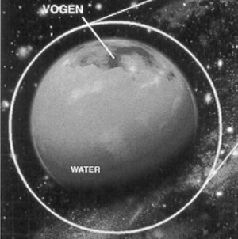
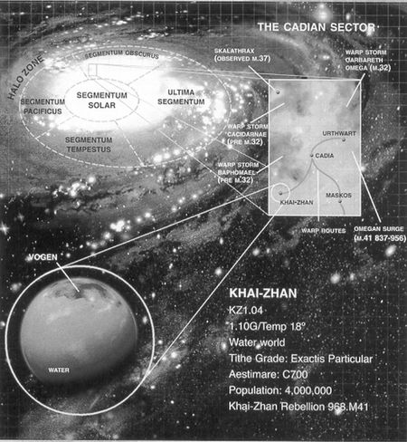
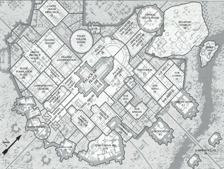

# 0948 凯詹 Khai-Zhan

精校状态：中文行文已逐段精校，部分术语仍为暂定

分类：地理 / 真实空间 Real Space / 朦胧星域 Segmentum Obscurus

原文来源：https://www.bilibili.com/opus/1167179241270280196

原作者：帝国神选罐头

原文时间：2026年02月09日 07:31

[返回分类目录](目录.md) · [全书目录](../../目录.md)

原篇名：凯-詹 Khai-Zhan

<!-- A0948-B0001 -->
### Basic Data 基本资料

原题：Basic Data 基础数据

<!-- /A0948-B0001 -->

<!-- A0948-B0002 -->
**英文原文**

Name:Khai-Zhan

<!-- /A0948-B0002 -->

<!-- A0948-B0003 -->

原译文

名称：凯-詹

**校订译文**

名称：凯詹

<!-- /A0948-B0003 -->

<!-- A0948-B0004 -->
**英文原文**

Segmentum:Segmentum Obscurus

<!-- /A0948-B0004 -->

<!-- A0948-B0005 -->

原译文

星域：朦胧星域

**校订译文**

星域：朦胧星域

<!-- /A0948-B0005 -->

<!-- A0948-B0006 -->
**英文原文**

Sector:Cadian Sector

<!-- /A0948-B0006 -->

<!-- A0948-B0007 -->

原译文

星区：卡迪亚星区

**校订译文**

星区：卡迪亚星区

<!-- /A0948-B0007 -->

<!-- A0948-B0008 -->
**英文原文**

Population:4 Million

<!-- /A0948-B0008 -->

<!-- A0948-B0009 -->

原译文

人口：400万

**校订译文**

人口：400万

<!-- /A0948-B0009 -->

<!-- A0948-B0010 -->
**英文原文**

Affiliation:Imperium

<!-- /A0948-B0010 -->

<!-- A0948-B0011 -->

原译文

隶属：帝国

**校订译文**

隶属：帝国

<!-- /A0948-B0011 -->

<!-- A0948-B0012 -->
**英文原文**

Class:Agri World / Ocean World

<!-- /A0948-B0012 -->

<!-- A0948-B0013 -->

原译文

类别：农业世界/海洋世界

**校订译文**

类别：农业世界/海洋世界

<!-- /A0948-B0013 -->

<!-- A0948-B0014 -->
**英文原文**

Tithe Grade:Extractis Particular

<!-- /A0948-B0014 -->

<!-- A0948-B0015 -->

原译文

什一税等级：第一级特等

**校订译文**

什一税等级：第一级特等

<!-- /A0948-B0015 -->

<!-- A0948-B0016 图片 -->

<!-- A0948-B0017 -->

原译文

Planetary Image 行星图像

**校订译文**

Planetary Image 行星图像

<!-- /A0948-B0017 -->

<!-- A0948-B0018 -->
**英文原文**

Khai-Zhan is an Agri World in the Segmentum Obscurus. The planet was the site of the Khai-Zhan Uprising.

<!-- /A0948-B0018 -->

<!-- A0948-B0019 -->

原译文

凯-詹是一个朦胧星域的农业世界。这个行星是凯-詹叛乱的地点。

**校订译文**

凯詹是朦胧星域的一颗农业世界，也是凯詹叛乱的发生地。

<!-- /A0948-B0019 -->

<!-- A0948-B0020 -->
## Overview 概述

<!-- /A0948-B0020 -->

<!-- A0948-B0021 -->
**英文原文**

The planet is of vital strategic value to both the forces of Chaos and the Imperium due to its location along a warp route within the Cadian Gate and being within close proximity of the Eye of Terror.

<!-- /A0948-B0021 -->

<!-- A0948-B0022 -->

原译文

这颗行星对混沌部队和帝国部队都具有至关重要的战略价值，因为它位于卡迪亚之门内的亚空间航线上，并且靠近恐惧之眼。

**校订译文**

这颗行星对混沌部队和帝国部队都具有至关重要的战略价值，因为它位于卡迪亚之门内的亚空间航线上，并且靠近恐惧之眼。

<!-- /A0948-B0022 -->

<!-- A0948-B0023 图片 -->

<!-- A0948-B0024 -->

原译文

Location of Khai-zhan 凯-詹的位置

**校订译文**

Location of Khai-zhan 凯詹的位置

<!-- /A0948-B0024 -->

<!-- A0948-B0025 -->
## Geography 地理

<!-- /A0948-B0025 -->

<!-- A0948-B0026 -->
**英文原文**

Khai-Zhan is a water-world with 98.3% of its surface covered in shallow oceans, and possesses only one substantial landmass. The environment of the planet is noted to be particularly stable due to having little tectonic and tidal activity. The latter is a result of having two moons that are both distant and of low mass. Thus, any disturbances to the world's single continent and massive oceans are minimal.

<!-- /A0948-B0026 -->

<!-- A0948-B0027 -->

原译文

凯-詹是一个水世界，98.3%的表面覆盖着浅海，只有一块陆地。由于构造和潮汐活动很少，行星的环境特别稳定。后者是由于两颗卫星既遥远又质量低。因此，对世界单一大陆和巨大海洋的任何干扰都是最小的。

**校订译文**

凯詹是一颗海洋世界，浅海覆盖了98.3%的地表，只有一块规模可观的陆地。由于地壳构造活动和潮汐活动都很微弱，这里的自然环境格外稳定。潮汐微弱，是因为两颗卫星既距离遥远，质量又小。因此，星球上唯一的大陆和广袤海洋都很少受到扰动。

<!-- /A0948-B0027 -->

<!-- A0948-B0028 -->
## Society 社会

<!-- /A0948-B0028 -->

<!-- A0948-B0029 -->
**英文原文**

Roughly 4 million Imperial Citizens inhabit Khai-Zhan. This population is distributed almost entirely along the coastline, leaving the interior forests of the continent virtually untouched except for occasional outposts, roads and trails.

<!-- /A0948-B0029 -->

<!-- A0948-B0030 -->

原译文

大约有400万帝国公民居住在凯-詹。这些人口几乎完全沿着海岸线分布，除了偶尔的前哨、道路和小径外，大陆的内陆森林几乎没有受到影响。

**校订译文**

大约有400万帝国公民居住在凯詹。这些人口几乎完全沿着海岸线分布，除了偶尔的前哨、道路和小径外，大陆的内陆森林几乎没有受到影响。

<!-- /A0948-B0030 -->

<!-- A0948-B0031 -->
**英文原文**

The planet's geography lends itself to the production and harvest of seaweed, its main economic activity. The kelp cakes produced on Khai-Zhan account for over half of the diet of the human populations within a 100 light year radius, making it the most important producer of food-stuffs in the Cadian Sector. To supply such demand, the harvesting operations on the planet are highly developed and include fleets of mile-long collection vessels.

<!-- /A0948-B0031 -->

<!-- A0948-B0032 -->

原译文

行星的地理位置适合海藻的生产和收获，这是其主要的经济活动。凯-詹生产的藻饼占100光年半径内人口饮食的一半以上，使其成为卡迪亚星区最重要的食品生产地。为了满足这种需求，行星上的收割作业高度发达，包括长达一英里的收集战舰。

**校订译文**

凯詹的地理条件适合种植和采收海藻，这也是当地最主要的经济活动。以此地为中心、半径100光年范围内的人类，其食物有一半以上是凯詹生产的海藻饼；因此，这里是卡迪亚星区最重要的粮食产地。为满足如此庞大的需求，当地采收业高度发达，甚至配有由一英里长的采收船组成的船队。

<!-- /A0948-B0032 -->

<!-- A0948-B0033 -->
## Vogen 沃根

<!-- /A0948-B0033 -->

<!-- A0948-B0034 -->
**英文原文**

While subject to Imperial rule, the political system on Khai-Zhan is primarily composed of family cartels. The cartels control harvesting operations and compete fiercely with one another, including open warfare. The one exception to inter-cartel tensions is at the capital city of Vogen, which maintains the single space port on the planet. In order to ensure access to the space port and therefore the ability to export their goods, the cartels abstain from hostilities within the city and mix freely there.

<!-- /A0948-B0034 -->

<!-- A0948-B0035 -->

原译文

虽然受帝国统治，但凯-詹的政治体系主要由企业联盟家族组成。企业联盟控制着收割作业，并相互激烈竞争，包括公开战争。企业联盟间紧张局势的一个例外是首都沃根，该城拥有行星上唯一的太空港。为了确保进入太空港并因此能够出口货物，企业联盟在城市内不采取敌对行动，并在那里自由混合。

**校订译文**

凯詹虽受帝国统治，但当地政治主要由各个家族财团主导。财团控制海藻采收业，彼此竞争激烈，甚至公开交战。首都沃根是这种敌对关系的唯一例外：星球上唯一的太空港就位于此地。为确保能够使用太空港出口货物，各财团都不在城内挑起争端，彼此人员可以自由往来。

<!-- /A0948-B0035 -->

<!-- A0948-B0036 图片 -->

<!-- A0948-B0037 -->

原译文

Map of Vogen 沃根地图

**校订译文**

Map of Vogen 沃根地图

<!-- /A0948-B0037 -->

<!-- A0948-B0038 -->
**英文原文**

Vogen is also the seat of Imperial rule and the planetary governor, who exploits the collective presence of the cartels in the city in order to regulate their business operations and apply Imperial law.

<!-- /A0948-B0038 -->

<!-- A0948-B0039 -->

原译文

沃根也是帝国统治和行星总督的所在地，他利用企业联盟在城市中的集体存在来规范他们的业务运营并适用帝国法律。

**校订译文**

沃根也是帝国统治机构及行星总督的驻地。总督利用各财团都在城内设有机构这一条件，监管其经营活动，并推行帝国法律。

<!-- /A0948-B0039 -->

<!-- A0948-B0040 -->
**英文原文**

When Vogen was invaded by the forces of the Night Lords and Iron Warriors, the Cadian 122nd was stationed at the city's space port, however proved no match for the invading Night Lords. The Night Lords took and held the Space Port for several days, before other Cadian units were able to liberate it. The streets around the Vogen Law Court would become known as Sniper's Alley during the conflict.

<!-- /A0948-B0040 -->

<!-- A0948-B0041 -->

原译文

当沃根被午夜领主和钢铁勇士的部队入侵时，卡迪亚第122兵团驻扎在该城的太空港，但事实证明，它无法与入侵的午夜领主匹敌。午夜领主占领并控制了太空港几天，直到其他卡迪亚部队能够解放它。在冲突期间，沃根法庭周围的街道被称为狙击手之巷。

**校订译文**

午夜领主与钢铁勇士入侵沃根时，卡迪亚第122团驻守太空港，却无法抵挡来袭的午夜领主。后者占领太空港数日，直到其他卡迪亚部队将其夺回。战斗期间，沃根法庭周边的街道被称为“狙击手之巷”。

<!-- /A0948-B0041 -->

<!-- A0948-B0042 -->
## Planetary Data 行星数据

<!-- /A0948-B0042 -->

<!-- A0948-B0043 -->
**英文原文**

Designation: KZ1.04

<!-- /A0948-B0043 -->

<!-- A0948-B0044 -->

原译文

命名：KZ1.04

**校订译文**

编号：KZ1.04

<!-- /A0948-B0044 -->

<!-- A0948-B0045 -->
**英文原文**

Gravity: 1.10G

<!-- /A0948-B0045 -->

<!-- A0948-B0046 -->

原译文

重力：1.10G

**校订译文**

重力：1.10G

<!-- /A0948-B0046 -->

<!-- A0948-B0047 -->
**英文原文**

Temperature: 18°

<!-- /A0948-B0047 -->

<!-- A0948-B0048 -->

原译文

温度：18°

**校订译文**

温度：18°

<!-- /A0948-B0048 -->

<!-- A0948-B0049 -->
**英文原文**

Aestimare: C700

<!-- /A0948-B0049 -->

<!-- A0948-B0050 -->

原译文

评估：C700

**校订译文**

评估：C700

<!-- /A0948-B0050 -->

本篇核心术语与暂定项

以下列出本篇出现的英文原形及核心术语表用词。同形词可能指不同对象，具体词义以本篇正文和校注为准；单复数、别名和仅见于图注的名称可能尚未列入。完整候选见[术语表](../../术语表/双语术语候选.csv)。

| 英文 | 采用中文 | 状态 |
| --- | --- | --- |
| Warp | 亚空间 | 官方已核对 |
| Imperium | 帝国 | 暂定·简称 |
| Eye of Terror | 恐惧之眼 | 官方已核对 |
| Iron Warriors | 钢铁勇士 | 暂定·官方待核 |
| Night Lords | 午夜领主 | 暂定·官方待核 |
| Segmentum Obscurus | 朦胧星域 | 暂定·官方待核 |
| Segmentum | 星域 | 暂定·官方待核 |
| Sector | 星区 | 暂定·官方待核 |
| Khai-Zhan | 凯詹 | 暂定·官方待核 |
| Obscurus | 朦胧星 | 暂定·官方待核 |
| Aestimare | 战略价值评级 | 暂定·官方待核 |
| System | 星系（恒星系统） | 暂定·官方待核 |
| Cadian Sector | 卡迪亚星区 | 暂定·官方待核 |
| Khai-Zhan Uprising | 凯詹叛乱 | 暂定·官方待核 |
| Vogen | 沃根 | 暂定·官方待核 |

