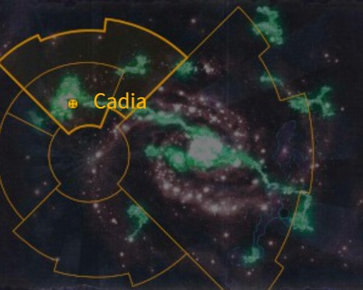
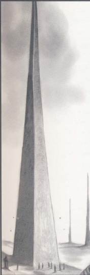
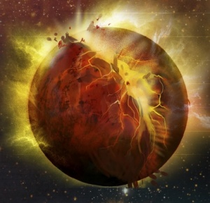
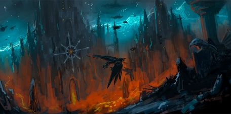
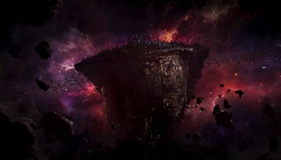
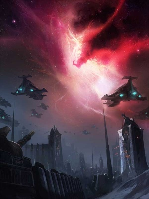
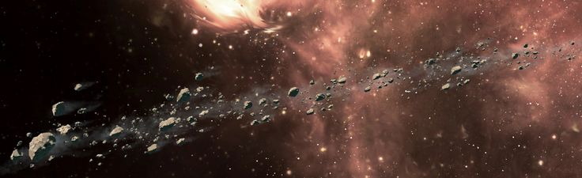

# 0949 卡迪亚主星 Cadia Prime

精校状态：中文行文已逐段精校，部分术语仍为暂定

分类：地理 / 真实空间 Real Space / 朦胧星域 Segmentum Obscurus

原文来源：https://www.bilibili.com/opus/1132718962014945285

原作者：帝国神选罐头

原文时间：2025年11月08日 10:48

[返回分类目录](目录.md) · [全书目录](../../目录.md)

原篇名：卡迪亚一号 Cadia Prime

<!-- A0949-B0001 -->
**英文原文**

This is Cadia, you silly fool! Cadia! Right on the doorway of Chaos! Right in the heart of everything! The seepage of evil is so great, I have a hundred active cults to subdue every month! This place breeds recidivists like a pond breeds scum. This is Cadia! This is the Gate of the Eye! This is where the bloody work of the Inquisition is done!"- Inquisitor-General Neve

<!-- /A0949-B0001 -->

<!-- A0949-B0002 -->

原译文

这是卡迪亚，你这个愚蠢的傻瓜！卡迪亚！就在混沌的门口！就在一切的中心！邪恶的渗透如此之大，我每个月都有一百个活跃的教派要制服！这个地方像池塘滋生渣滓一样滋生惯犯。这是卡迪亚！这是恐惧之眼的大门！这就是审判庭流血的工作的地方！“- 审判官将军内夫

**校订译文**

“这里可是卡迪亚，你这个蠢货！卡迪亚！就在混沌的门口，就在一切的中心！邪恶渗透得如此严重，我每个月都得镇压一百个正在活动的邪教！这里滋生惯犯，就像池塘滋生浮渣。这就是卡迪亚！这就是恐惧之眼的大门！审判庭血腥的工作，就是在这里干的！”——审判总长内夫

<!-- /A0949-B0002 -->

<!-- A0949-B0003 图片 -->

<!-- A0949-B0004 -->

原译文

Map 地图

**校订译文**

Map 地图

<!-- /A0949-B0004 -->

<!-- A0949-B0005 -->
### Basic Data 基本资料

原题：Basic Data 基础信息

<!-- /A0949-B0005 -->

<!-- A0949-B0006 -->
**英文原文**

Name:Cadia Prime

<!-- /A0949-B0006 -->

<!-- A0949-B0007 -->

原译文

名称：卡迪亚主星

**校订译文**

名称：卡迪亚主星

<!-- /A0949-B0007 -->

<!-- A0949-B0008 -->
**英文原文**

Segmentum:Segmentum Obscurus

<!-- /A0949-B0008 -->

<!-- A0949-B0009 -->

原译文

星域：朦胧星域

**校订译文**

星域：朦胧星域

<!-- /A0949-B0009 -->

<!-- A0949-B0010 -->
**英文原文**

Sector:Cadian Sector

<!-- /A0949-B0010 -->

<!-- A0949-B0011 -->

原译文

星区：卡迪亚星区

**校订译文**

星区：卡迪亚星区

<!-- /A0949-B0011 -->

<!-- A0949-B0012 -->
**英文原文**

Subsector:Cadian Subsector

<!-- /A0949-B0012 -->

<!-- A0949-B0013 -->

原译文

分区：卡迪亚分区

**校订译文**

次星区：卡迪亚次星区

<!-- /A0949-B0013 -->

<!-- A0949-B0014 -->
**英文原文**

System:Cadian System

<!-- /A0949-B0014 -->

<!-- A0949-B0015 -->

原译文

星系：卡迪亚星系

**校订译文**

星系：卡迪亚星系

<!-- /A0949-B0015 -->

<!-- A0949-B0016 -->
**英文原文**

Population:250,000,000 - 850,000,000 (pre-13th Black Crusade), only 3 million survivors remain

<!-- /A0949-B0016 -->

<!-- A0949-B0017 -->

原译文

人口：2,5000,0000 - 8,5000,0000（第13次黑色远征前），仅剩300万幸存者

**校订译文**

人口：2.5亿—8.5亿（第十三次黑色远征前），仅剩约300万幸存者

<!-- /A0949-B0017 -->

<!-- A0949-B0018 -->
**英文原文**

Affiliation:Imperium

<!-- /A0949-B0018 -->

<!-- A0949-B0019 -->

原译文

隶属：帝国

**校订译文**

隶属：帝国

<!-- /A0949-B0019 -->

<!-- A0949-B0020 -->
**英文原文**

Class:Dead World, Daemon World, formerly Fortress World

<!-- /A0949-B0020 -->

<!-- A0949-B0021 -->

原译文

级别：死亡世界，恶魔世界，前要塞世界

**校订译文**

类别：死寂世界、恶魔世界，原为要塞世界

<!-- /A0949-B0021 -->

<!-- A0949-B0022 -->
**英文原文**

Tithe Grade:None, formerly Aptus Non

<!-- /A0949-B0022 -->

<!-- A0949-B0023 -->

原译文

什一税等级：无，前特级免税

**校订译文**

什一税等级：无，前特级免税

<!-- /A0949-B0023 -->

<!-- A0949-B0024 图片 -->

<!-- A0949-B0025 -->

原译文

Planetary Image 行星图片

**校订译文**

Planetary Image 行星图片

<!-- /A0949-B0025 -->

<!-- A0949-B0026 -->
**英文原文**

Cadia was a terrestrial Fortress World on the edge of the nebula known as the Eye of Terror. The planet was situated in an area of space known as the Cadian Gate, the only stable, permanent route into and out of the Eye of Terror large enough to allow the passage of battlefleets. For this reason, Cadia was heavily fortified against the assaults of Chaos and was a frequent target of Abaddon the Despoiler's Black Crusades.

<!-- /A0949-B0026 -->

<!-- A0949-B0027 -->

原译文

卡迪亚是一个位于被称为恐惧之眼的星云边缘的类地堡垒世界。这颗行星位于一个被称为卡迪安之门的太空区域，这是进出恐惧之眼的唯一稳定、永久的航线，其大小足以让战斗舰队通过。出于这个原因，卡迪亚对混沌的攻击进行了严密的防御，并且是掠夺者阿巴顿的黑色远征的频繁目标。

**校订译文**

卡迪亚曾是一颗类地要塞世界，位于恐惧之眼星云的边缘。它所在的区域称为卡迪亚之门：这是唯一稳定、永久、且足够宽阔，能让作战舰队进出恐惧之眼的航道。因此，卡迪亚为抵御混沌进攻而修筑了严密防线，也频繁成为掠夺者阿巴顿黑色远征的目标。

<!-- /A0949-B0027 -->

<!-- A0949-B0028 -->
## Physical Characteristics 物理特性

<!-- /A0949-B0028 -->

<!-- A0949-B0029 -->
**英文原文**

Prior to its destruction, the planet's surface played host to a variety of terrain types, from frozen tundras and wind-swept moorlands to axeltree forests.

<!-- /A0949-B0029 -->

<!-- A0949-B0030 -->

原译文

在它被摧毁之前，行星表面有各种地形类型，从冰冻的苔原和风吹的沼泽地到针叶林。

**校订译文**

毁灭之前，卡迪亚地貌多样，从冰封苔原、狂风吹拂的荒原，到轴木林皆有分布。

**校注：** axeltree 作为树木名称暂译“轴木”，英文未称针叶树。

<!-- /A0949-B0030 -->

<!-- A0949-B0031 -->
**英文原文**

Designation: C1.0.17

<!-- /A0949-B0031 -->

<!-- A0949-B0032 -->

原译文

名称：C1.0.17

**校订译文**

编号：C1.0.17

<!-- /A0949-B0032 -->

<!-- A0949-B0033 -->
**英文原文**

Orbital Distance: 1.32 AU

<!-- /A0949-B0033 -->

<!-- A0949-B0034 -->

原译文

轨道距离：1.32天文单位

**校订译文**

轨道距离：1.32天文单位

<!-- /A0949-B0034 -->

<!-- A0949-B0035 -->
**英文原文**

Gravity: 1.12G

<!-- /A0949-B0035 -->

<!-- A0949-B0036 -->

原译文

重力：1.12G

**校订译文**

重力：1.12G

<!-- /A0949-B0036 -->

<!-- A0949-B0037 -->
**英文原文**

Temp: 20°C

<!-- /A0949-B0037 -->

<!-- A0949-B0038 -->

原译文

温度：20°C

**校订译文**

温度：20°C

<!-- /A0949-B0038 -->

<!-- A0949-B0039 -->
**英文原文**

Atmosphere: Breathable

<!-- /A0949-B0039 -->

<!-- A0949-B0040 -->

原译文

大气：可呼吸

**校订译文**

大气：可呼吸

<!-- /A0949-B0040 -->

<!-- A0949-B0041 -->
**英文原文**

Aestimare: A3

<!-- /A0949-B0041 -->

<!-- A0949-B0042 -->

原译文

评估：A3

**校订译文**

评估：A3

<!-- /A0949-B0042 -->

<!-- A0949-B0043 -->
### The Cadian Pylons 卡迪亚方尖碑

<!-- /A0949-B0043 -->

<!-- A0949-B0044 -->
**英文原文**

Perhaps the most unusual and significant feature of Cadia were the mysterious Pylons, structures of unknown origins that predated the planet's colonization by man. Five thousand, eight hundred ten intact Pylons were spread out across the surface of Cadia, with a further two thousand either buried or in various states of disrepair. No two were identical in design, but each one rose to precisely half a kilometer in height and extended a quarter-kilometer into the ground. Each Pylon also featured slim, winding tunnels machined into them, each one no wider than a man's head and exactly two hundred fifty meters long.

<!-- /A0949-B0044 -->

<!-- A0949-B0045 -->

原译文

也许卡迪亚最不寻常和最重要的特征是神秘的方尖碑，这些方尖碑的起源未知，早在人类殖民行星之前就已经存在。五千八百一十座完整的方尖碑散布在卡迪亚的表面，另有两千座被埋葬或处于各种失修状态。没有两个在设计上完全相同，但每个都上升到半公里的高度，并延伸到地面四分之一公里。每座塔上都有细长蜿蜒的隧道，每条隧道的宽度不超过一个人的头部，长度正好为250米。

**校订译文**

卡迪亚最独特、也最重要的景观，或许就是神秘的方尖碑。这些建筑来源不明，早在人类殖民之前就已存在。星球表面分布着5810座完整的方尖碑，另有约2000座被埋藏，或处于不同程度的损坏状态。没有两座方尖碑的设计完全相同，但每座都精确高出地面半公里，并向地下延伸四分之一公里。每座碑体内部还加工出狭窄蜿蜒的隧道，每条宽度都不超过一个人的头部，长度则恰为250米。

<!-- /A0949-B0045 -->

<!-- A0949-B0046 图片 -->

<!-- A0949-B0047 -->

原译文

Cadian Pylon 卡迪亚方尖碑

**校订译文**

Cadian Pylon 卡迪亚方尖碑

<!-- /A0949-B0047 -->

<!-- A0949-B0048 -->
**英文原文**

Efforts by the Adeptus Mechanicus to study the Pylons had failed miserably, as their surfaces were totally impenetrable to scanning by auspex and efforts to map the tunnels via Servitors had resulted in missing probes. However, it is widely believed that they were the reason for the existence of the Cadian Gate in the first place. During the 13th Black Crusade, as the warp storm Baphomael expanded to engulf the edges of the Cadian System, the Pylons simultaneously began resonating with an almost imperceptible vibration, and microscopic fractures began appearing on their surface. It was discovered that they were resonating at an amplitude similar to that produced by a Gellar Field in their effort to fight back against the encroaching storm.

<!-- /A0949-B0048 -->

<!-- A0949-B0049 -->

原译文

机械神教研究方尖碑的努力惨遭失败，由于它们的表面完全无法被鸟卜仪扫描，通过机仆绘制隧道地图的努力导致了探测器的丢失。然而，人们普遍认为，它们是卡迪亚之门存在的最初原因。在第13次黑色远征期间，随着亚空间风暴巴普梅尔的扩张，吞噬了卡迪亚星系的边缘，方尖碑同时开始产生几乎察觉不到的振动，其表面开始出现微观裂缝。人们发现，它们的共振幅度与盖勒力场在对抗入侵的风暴时产生的振幅相似。

**校订译文**

机械修会对方尖碑的研究屡遭失败：鸟卜仪无法扫描穿透碑体表面，派机仆绘制内部隧道地图，又只会让探测装置失踪。不过，普遍观点认为，卡迪亚之门之所以存在，正是方尖碑的作用。第十三次黑色远征期间，亚空间风暴巴普梅尔不断扩张，吞没卡迪亚星系边缘，方尖碑也同时开始以几乎不可察觉的幅度振动，表面逐渐出现微小裂纹。研究者发现，方尖碑为抵挡逼近的风暴而共振，其振幅与盖勒力场产生的振幅相似。

<!-- /A0949-B0049 -->

<!-- A0949-B0050 -->
**英文原文**

Access to the Pylons was generally forbidden, with it being deemed a rare privilege to be granted permission to visit if one were not of sufficient military rank.

<!-- /A0949-B0050 -->

<!-- A0949-B0051 -->

原译文

进入方尖碑通常是被禁止的，如果一个人没有足够的军衔，被允许访问被认为是一种罕见的特权。

**校订译文**

一般人不得接近方尖碑；对于军衔不够高的人来说，获准参观是一项罕见的特权。

<!-- /A0949-B0051 -->

<!-- A0949-B0052 -->
**英文原文**

During the final stages of the Thirteenth Black Crusade, the Magos Belisarius Cawl worked with the Necron Lord Trazyn to fully activate the Pylons and push the Eye of Terror back. However, in the end, Abaddon collided the debris of the Blackstone Fortress Will of Eternity into Cadia's surface, destabilizing the Pylons as they were fully awakening. In a catastrophic chain reaction, the Pylons were destroyed, which caused Cadia to be dragged into the Warp.

<!-- /A0949-B0052 -->

<!-- A0949-B0053 -->

原译文

在第十三次黑色远征的最后阶段，贤者贝利撒留·考尔与死灵领主塔拉辛合作，完全激活了方尖碑并将恐惧之眼推回。然而，最终，阿巴顿将黑石堡垒永恒意志号的残骸撞到了卡迪亚的表面，在它们完全觉醒时破坏了方尖碑的稳定。在一场灾难性的连锁反应中，方尖碑被摧毁，导致卡迪亚被拖入亚空间。

**校订译文**

第十三次黑色远征的最后阶段，贤者贝利萨留斯·考尔与太空死灵领主塔拉辛合作，试图彻底激活方尖碑，将恐惧之眼推回去。然而，阿巴顿最终将黑石堡垒永恒意志号的残骸撞向卡迪亚地表，使正在全面苏醒的方尖碑失去稳定。灾难性的连锁反应摧毁了方尖碑，卡迪亚也随之被拖入亚空间。

<!-- /A0949-B0053 -->

<!-- A0949-B0054 -->
## History 历史

<!-- /A0949-B0054 -->

<!-- A0949-B0055 -->
**英文原文**

Before Imperial colonization, Cadia was the home of a lost fragment of humanity that worshipped the four Gods of Chaos. This society was encountered by the Word Bearers Legion forty years before the Horus Heresy, and the prevalence of violet eyes amongst the populace was seen as a mark of mutation caused by the Eye of Terror, which also appears violet. It was on Cadia that the Word Bearers' Primarch, Lorgar, first met Ingethel the Chosen and became inducted into the service of the Foul Powers. This civilization was eventually wiped out by Cyclonic torpedoes.

<!-- /A0949-B0055 -->

<!-- A0949-B0056 -->

原译文

在帝国殖民之前，卡迪亚是崇拜混沌四神的失落的人类分支的家园。这个社会是在荷鲁斯叛乱的四十年前被怀言者军团遇到的，民众中紫色眼睛的盛行被视为恐惧之眼引起的突变的标志，恐惧之眼也呈紫色。正是在卡迪亚，怀言者的原体珞珈第一次见到了受选者英格泰尔，并被引入到对邪恶势力的服务中。这个文明最终被旋风鱼雷摧毁。

**校订译文**

在帝国殖民之前，卡迪亚是一支失落人类族群的家园，他们崇拜混沌四神。荷鲁斯之乱前四十年，怀言者军团接触了这个社会。当地人普遍拥有紫色双眼，被视为恐惧之眼引发变异的标志，因为恐惧之眼本身也呈紫色。怀言者原体珞珈正是在卡迪亚初次遇见受选者英格泰尔，并由此受引导，转而侍奉邪神。这个文明最终被旋风鱼雷摧毁。

<!-- /A0949-B0056 -->

<!-- A0949-B0057 -->
**英文原文**

Cadia was resettled sometime in the early 32nd millennium as a direct result of the 1st Black Crusade. The early defenses of Cadia, however, proved to be woefully ill-prepared, its major cities indefensible as they were built in the traditional High Terra style of broad, ordered avenues. Following the 2nd Black Crusade, changes were made to improve the planet's fortifications, rebuilding the cities into their present form.

<!-- /A0949-B0057 -->

<!-- A0949-B0058 -->

原译文

卡迪亚在第32个千年初的某个时候被重新安置，这是第一次黑色远征的直接结果。然而，事实证明，卡迪亚的早期防御措施准备不足，其主要城市是无法防御的，因为它们是按照传统的高地风格建造的，宽阔有序的大道。在第二次黑色远征之后，为了改善行星的防御工事，进行了改变，将城市重建成现在的形式。

**校订译文**

受第一次黑色远征直接影响，第32千年初，帝国在卡迪亚重新建立殖民地。然而，早期防御准备严重不足；主要城市沿用传统的高泰拉建筑风格，街道宽阔规整，几乎无险可守。第二次黑色远征之后，帝国着手加强行星防御，将城市改建成后来所见的形态。

**校注：** High Terra 是泰拉建筑风格，不是 highland 高地。

<!-- /A0949-B0058 -->

<!-- A0949-B0059 -->
### Destruction 毁灭

<!-- /A0949-B0059 -->

<!-- A0949-B0060 -->
**英文原文**

During the Thirteenth Black Crusade, Cadia was subjected to the largest Chaos invasion since the Horus Heresy. A surprise opening attack by the Volscani Cataphracts wiped out the Cadian High Command, forcing Ursarkar E. Creed to become its sole Castellan.

<!-- /A0949-B0060 -->

<!-- A0949-B0061 -->

原译文

在第十三次黑色远征期间，卡迪亚遭受了自荷鲁斯叛乱以来最大的混沌入侵。沃斯卡尼重骑兵的突然袭击摧毁了卡迪亚最高指挥部，迫使乌萨卡·E·克里德成为其唯一的堡主。

**校订译文**

第十三次黑色远征期间，卡迪亚遭受了荷鲁斯之乱以来规模最大的混沌入侵。战争伊始，沃斯卡尼重骑兵发动突袭，消灭了卡迪亚最高指挥部，迫使乌萨卡·E.克里德独自担起堡主之责。

<!-- /A0949-B0061 -->

<!-- A0949-B0062 图片 -->

<!-- A0949-B0063 -->

原译文

The destruction of Cadia 卡迪亚的毁灭

**校订译文**

The destruction of Cadia 卡迪亚的毁灭

<!-- /A0949-B0063 -->

<!-- A0949-B0064 -->
**英文原文**

After vicious fighting, only one fortress, Kasr Kraf, remained. However, the tide of the battle nearly turned thanks to the intervention of Eldar and Trazyn, who sought to reactivate the Pylons on the world and turn back the Warp. In the final battle beneath the surface of Cadia, Abaddon was forced to retreat as the Pylons were activating, but redirected debris from the Blackstone Fortress Will of Eternity into the planet. Cadia was shattered and, as the Pylons faltered, the planet was swallowed into the Warp. Castellan Creed and his Cadian 8th stayed behind to cover the evacuation, making their fate all but certain.

<!-- /A0949-B0064 -->

<!-- A0949-B0065 -->

原译文

经过激烈的战斗，只剩下一座堡垒，克拉夫堡。然而，由于灵族和塔拉辛的干预，这场战斗的趋势几乎发生了逆转，他们试图重新激活世界上的方尖碑并逆转亚空间。在卡迪亚地表下的最后一场战斗中，阿巴顿被迫撤退，因为方尖碑正在激活，但他将黑石堡垒永恒意志号的残骸重新定向到了这个行星上。卡迪亚被击碎，随着方尖碑摇摇欲坠，这颗星球被亚空间吞噬了。堡主克里德和他的卡迪安第八兵团留下来掩护撤离，他们的命运几乎是确定的。

**校订译文**

激战之后，只有卡斯尔·克拉夫这一座要塞仍在坚守。不过，灵族与塔拉辛介入战局，试图重新激活方尖碑、逼退亚空间，几乎扭转了形势。在卡迪亚地下的最后一战中，随着方尖碑启动，阿巴顿被迫撤退，却又把黑石堡垒永恒意志号的残骸引向星球。卡迪亚遭到撞击而破碎，方尖碑相继失效，星球遂被亚空间吞噬。堡主克里德与卡迪亚第八团留下掩护撤离，几乎注定有去无回。

**校注：** 保留此段对殿后者命运的叙述视角，不以其他篇的后续情节改写为既定死亡。

<!-- /A0949-B0065 -->

<!-- A0949-B0066 -->
**英文原文**

Only a handful of its citizens were able to escape in an evacuation fleet led by the Phalanx. Of its population, fewer than three million survived.

<!-- /A0949-B0066 -->

<!-- A0949-B0067 -->

原译文

只有少数公民能够在山阵号领导的撤离舰队中逃脱。在其人口中，只有不到300万人幸存下来。

**校订译文**

只有少数公民能够在山阵号领导的撤离舰队中逃脱。在其人口中，只有不到300万人幸存下来。

<!-- /A0949-B0067 -->

<!-- A0949-B0068 图片 -->

<!-- A0949-B0069 -->

原译文

Chaos controlled Cadian Asteroid 混沌控制的卡迪安小行星

**校订译文**

Chaos controlled Cadian Asteroid 混沌控制的卡迪亚小行星

<!-- /A0949-B0069 -->

<!-- A0949-B0070 -->
**英文原文**

Although Cadia was ultimately reduced to a burning wasteland by Abaddon's assault, the worlds in the wider Cadian System fought hard to destroy the spearhead the Despoiler had plunged into their midst. The Great Exodus of Cadia has seen swathes of Imperial defences redeployed to their sister worlds.

<!-- /A0949-B0070 -->

<!-- A0949-B0071 -->

原译文

尽管阿巴顿的进攻最终使卡迪亚沦为一片燃烧的荒地，但更广泛的卡迪亚星系中的世界仍在努力摧毁掠夺者投入其中的矛头。卡迪亚大逃亡事件中，帝国的大片防御工事被重新部署到了他们的姐妹世界。

**校订译文**

尽管卡迪亚最终在阿巴顿的攻击下化为燃烧的废土，卡迪亚星系其他世界仍奋力抗击，试图摧毁掠夺者楔入当地的进攻矛头。卡迪亚大撤离中，大批帝国防御力量被转移部署到这些姐妹世界。

<!-- /A0949-B0071 -->

<!-- A0949-B0072 -->
**英文原文**

Sometime after the Great Rift's creation, the Adeptus Custodes Captain General Trajann Valoris ordered a small, fast-moving force of Custodians to travel to Cadia's remains. Details of their mission are suppressed, even amongst their comrades, but they are accompanied by a number of warriors drawn from the ranks of the Shadowkeepers.

<!-- /A0949-B0072 -->

<!-- A0949-B0073 -->

原译文

在大裂隙形成后的某个时候，禁军修会禁军元帅图拉真·瓦洛里斯命令一支快速移动的禁军部队前往卡迪亚的残骸。他们的任务细节被隐瞒了，甚至在他们的战友中也是如此，但他们身边有许多来自暗影守护者等级的战士。

**校订译文**

大裂隙形成后，禁军元帅图拉真·瓦洛瑞斯命令一支规模小、行动迅捷的禁军部队前往卡迪亚残骸。任务细节严格保密，就连其他禁军同袍也无从知晓；只知道随行者中有多名来自暗影守护者的战士。

<!-- /A0949-B0073 -->

<!-- A0949-B0074 图片 -->

<!-- A0949-B0075 -->

原译文

Asteroid 1182 (ruins of Kasr Soliq) Shrine of Martyrs 小行星1182（索里克堡的废墟）殉难者圣地

**校订译文**

Asteroid 1182 (ruins of Kasr Soliq) Shrine of Martyrs 小行星1182（索里克堡的废墟）殉难者圣地

<!-- /A0949-B0075 -->

<!-- A0949-B0076 -->
## Military 军事

<!-- /A0949-B0076 -->

<!-- A0949-B0077 -->
**英文原文**

As one of the most strategically important planets in the Imperium, Cadia boasted a large military presence. Battlefleet Cadia provided orbital protection for the planet and could call upon the assistance of neighboring sector fleets such as Battlefleet Agripinaa, Battlefleet Corona and Battlefleet Scarus. The planet's surface was dotted with numerous orbital defense batteries, its skies were patrolled by flights of Imperial Aircraft, and any incoming civilian craft that failed to transmit the daily access codes were liable to be shot down without question.

<!-- /A0949-B0077 -->

<!-- A0949-B0078 -->

原译文

作为帝国中最具战略意义的行星之一，卡迪亚拥有庞大的军事存在。卡迪亚战斗舰队为行星提供轨道保护，并可能需要邻近星区舰队的协助，如阿格里皮纳战斗舰队、科罗纳战斗舰队和斯卡鲁斯战斗舰队。这颗行星的表面点缀着许多轨道防御阵列，它的天空由帝国战机的航行巡逻，任何未能传输日常访问代码的民用飞行器都有可能被击落。

**校订译文**

作为帝国战略地位最重要的行星之一，卡迪亚驻有庞大军力。卡迪亚舰队负责轨道防御，还能请求邻近星区舰队增援，包括阿格里皮娜舰队、科罗纳舰队和斯卡鲁斯舰队。地表遍布对轨道防御炮群，天空中不断有帝国战机编队巡逻；任何驶入的民用飞行器，只要未能发送当日准入代码，都可能遭到毫不迟疑的击落。

<!-- /A0949-B0078 -->

<!-- A0949-B0079 图片 -->

<!-- A0949-B0080 -->

原译文

Imperial forces keep watch on the Eye of Terror from the surface of Cadia 帝国军队在卡迪亚表面监视恐惧之眼

**校订译文**

Imperial forces keep watch on the Eye of Terror from the surface of Cadia 帝国军队在卡迪亚表面监视恐惧之眼

<!-- /A0949-B0080 -->

<!-- A0949-B0081 -->
**英文原文**

As a Fortress World, Cadia's entire population belonged to some branch of the Imperial military. Perhaps most famous of all are the Cadian Shock Troopers, regiments raised for service within the Imperial Guard. The Shock Troopers are considered some of the finest soldiers in the entire Imperium, even earning the respect of the legendary Adeptus Astartes. Cadians are well-known for their discipline, marksmanship and stoic sense of self-sacrifice, and are often emulated by other regiments.

<!-- /A0949-B0081 -->

<!-- A0949-B0082 -->

原译文

作为一个要塞世界，卡迪亚的全部人口都属于帝国军队的某个分支。也许最著名的是卡迪亚突击军，这是为帝国卫队服役而组建的兵团。突击军被认为是整个帝国中最优秀的士兵之一，甚至赢得了传说中的阿斯塔特的尊重。卡迪亚人以其纪律、枪法和坚忍的自我牺牲意识而闻名，经常被其他兵团效仿。

**校订译文**

作为一个要塞世界，卡迪亚的全部人口都属于帝国军队的某个分支。也许最著名的是卡迪亚突击军，这是为帝国卫队服役而组建的兵团。突击军被认为是整个帝国中最优秀的士兵之一，甚至赢得了传说中的阿斯塔特的尊重。卡迪亚人以其纪律、枪法和坚忍的自我牺牲意识而闻名，经常被其他兵团效仿。

<!-- /A0949-B0082 -->

<!-- A0949-B0083 -->
**英文原文**

The Planetary Defense Force, known as the Cadian Interior Guard, was also counted among one of the best military organizations. This is because one out of every ten Cadians, regardless of their skills, was assigned to the Interior Guard, resulting in some of the best soldiers spending their entire military career on Cadia.

<!-- /A0949-B0083 -->

<!-- A0949-B0084 -->

原译文

被称为卡迪安内卫的行星防御部队也被认为是最好的军事组织之一。这是因为每十个卡迪亚人中就有一个，无论他们的技能如何，都被分配到了内卫，导致一些最优秀的士兵在卡迪亚度过了他们的整个军事生涯。

**校订译文**

称为卡迪亚内卫的行星防御部队，也位列最优秀的军事组织之一。每十名卡迪亚人中便有一人被分配到内卫，不论其能力高低，因此一部分最优秀的士兵也会在卡迪亚度过整个军旅生涯。

<!-- /A0949-B0084 -->

<!-- A0949-B0085 图片 -->

<!-- A0949-B0086 -->

原译文

The remains of Cadia 卡迪亚的残骸

**校订译文**

The remains of Cadia 卡迪亚的残骸

<!-- /A0949-B0086 -->

<!-- A0949-B0087 -->
**英文原文**

Because of its closeness to the Eye of Terror, Cadia also maintained the Internal Guard for defense against Chaos cult activities. A less well-known part of the Cadian military establishment, the Internal Guard consisted of Inquisitors of the Ordo Malleus that had been permanently seconded to the Cadian military, and made frequent use of Sanctioned Psykers.

<!-- /A0949-B0087 -->

<!-- A0949-B0088 -->

原译文

由于靠近恐惧之眼，卡迪亚保留了内部守卫，以防御混沌教派活动。作为卡迪亚军事机构中不太知名的一部分，内部守卫由长期借调到卡迪亚军队的圣锤修会审判官组成，并经常使用合法灵能者。

**校订译文**

由于紧邻恐惧之眼，卡迪亚还设有内部卫队，用于防范混沌邪教活动。这是卡迪亚军队中较少为人所知的一部分，由长期借调的恶魔审判庭审判官组成，并经常运用制裁灵能者。

**校注：** Internal Guard 是审判官组成的内部卫队，与前段行星防御部队 Interior Guard 卡迪亚内卫分开。

<!-- /A0949-B0088 -->

<!-- A0949-B0089 -->
## Society 社会

<!-- /A0949-B0089 -->

<!-- A0949-B0090 -->
**英文原文**

Cadian society was heavily militarized, with 71.75% of its total population under arms, and a birth rate equal to the recruitment rate. Cadian children were taught how to strip, reassemble and shoot a lasgun before they were taught how to read. Prior to puberty, they were sent to survive on their own on the isolated islands of the Caducades Sea during the Month of Making, and by age ten most could perform infantry field drills and were proficient in killing. All Cadians were to train in the defense forces, joining the Youth Armies (also known as the Whiteshields) to train alongside regular soldiers and fight mock battles with each other in the Cadian wilderness. Both men and women served within front line roles in both mixed and single sex regiments, with all female regiments tending to serve within the Interior Guard rather than off-world All told, about half of all able-bodied Cadians would join the Shock Troop regiments and be shipped off-world to fight on distant planets, with only one in a thousand ever returning to their place of birth.

<!-- /A0949-B0090 -->

<!-- A0949-B0091 -->

原译文

卡迪亚社会高度军事化，71.75%的总人口处于武装之下，出生率与征兵率相当。卡迪亚的孩子们在学习阅读之前，先学会了如何拆解、重新组装和射击激光枪。在青春期之前，他们在“制造月”期间被派往卡杜加德斯海的孤岛上独自生存，到10岁时，大多数人都可以进行步兵野战演习，并精通杀戮。所有卡迪亚人都要在防御部队中训练，加入青年军（也称为白盾），与正规军一起训练，并在卡迪亚荒野中相互进行模拟战斗。男女都在混合和单性军团中担任战线角色，所有女性军团都倾向于在内卫而不是世界之外服役。总而言之，大约一半身体健全的卡迪亚人会加入突击军兵团，被运往世界之外，在遥远的行星上作战，只有千分之一的人会回到出生地。

**校订译文**

卡迪亚社会高度军事化，71.75%的人口服役，出生率与征兵率相当。孩子们尚未识字，就先学会拆解、重装和射击激光枪。在青春期之前，他们要在“成材月”被送到卡杜加德斯海的孤岛上，独自求生；到十岁时，多数孩子已经能参加步兵野外操练，并熟练掌握杀人技巧。所有卡迪亚人都必须接受防御部队训练，先加入青年军，又称白盾，与正规士兵一同操练，在卡迪亚荒野开展模拟对抗。无论男女，都在男女混编或单一性别的军团中担任前线战斗人员；全女性军团通常在内卫服役，而非派往外星。总体而言，约半数身体健全的卡迪亚人会加入突击军团，被运往遥远星球作战，其中仅千分之一能够重返故乡。

**校注：** 原文先写青春期之前进行孤岛试炼，再写十岁时已有战斗技能，均照源文保留，不重排为明确时间顺序。

<!-- /A0949-B0091 -->

<!-- A0949-B0092 -->
**英文原文**

Cadia was under permanent martial law, leading to a number of differences when compared to other Imperial worlds. The role of Planetary Governor was a military one, known as the Governor Primus, similarly serving as leader of the Cadian High Command. In times of emergency, when the Governor Primus was incapacitated, a special military rank of Lord Castellan of Cadia existed that by common consent could take over as commander-in-chief of the Cadian military. Also, there were no Arbites on Cadia, with the role of policing the population falling upon the Cadian Interior Guard.

<!-- /A0949-B0092 -->

<!-- A0949-B0093 -->

原译文

卡迪亚处于永久戒严状态，与其他帝国世界相比，导致了一些差异。行星总督的角色是一个军事角色，被称为首席总督，同样担任卡迪亚最高司令部的领导人。在紧急情况下，当首席总督丧失能力时，卡迪亚的一个特别军衔存在-领主堡主，经双方同意，可以接任卡迪亚军队的首席指挥官。此外，卡迪亚没有仲裁员，负责维持人口治安的任务落在了卡迪亚内卫身上。

**校订译文**

卡迪亚长期实行戒严，制度因此与帝国其他世界颇有不同。行星总督是一个军职，称为首席总督，同时领导卡迪亚最高指挥部。紧急情况下，若首席总督无法履职，可由各方共同认可的人选担任特别军职“卡迪亚堡主领主”，接掌全军统帅权。此外，卡迪亚没有法务部执法官，治安职责由卡迪亚内卫承担。

<!-- /A0949-B0093 -->

<!-- A0949-B0094 -->
**英文原文**

This martial theme extended its way into every aspect of life on Cadia. Civilian clothing incorporated camouflage patterns, available in a variety of urban and wilderness colouring, while the dwellings of both rich and poor were armoured against attack. Cities on Cadia, known as Kasrs in the local dialect, were fortresses in their own right. Each Kasr was protected by powerful Void Shields capable of withstanding days upon days of punishing orbital bombardment. They were encircled by rings of massive earthworks studded with gun emplacements and weapons batteries, separated by an inner moat. Passage over the moat was controlled by hydraulic bascule bridges, each one guarded by a heavily armed barbican, and defended by the many armoured fortifications and shatrovies overlooking it. Once inside, the streets of each Kasr were laid out in elaborate geometric patterns, from the air resembling an intricate puzzle. Every building was constructed to act as a strongpoint in the city's defence: ammunition dumps stored in the underground bunkers of bakeries, gun emplacements on public auditoriums, hab-blocks with reinforced buttresses and vision slits for windows, living rooms which doubled as pillboxes, bastions with rooftop landing pads. Given the Cadians' mastery of urban warfare, this layout allowed them to hold each Kasr for months, even years, should the outer defences fall Tens of thousands of different criminal gangs operated throughout the densely populated Kasrs, with ganger tattoos common amongst the troopers raised from these populations.

<!-- /A0949-B0094 -->

<!-- A0949-B0095 -->

原译文

这个军事主题延伸到了卡迪亚生活的方方面面。平民服装采用了迷彩图案，有各种城市和荒野颜色可供选择，而富人和穷人的住宅都装有装甲，可以抵御攻击。卡迪亚的城市，在当地方言中被称为卡斯尔，本身就是堡垒。每个卡斯尔都受到强大的虚空盾的保护，能够承受日复一日的轨道轰炸。他们被一圈巨大的土垒包围着，周围点缀着炮位和武器阵列，由一条内护城河隔开。护城河上的通道由液压拱桥控制，每座桥都由全副武装的外堡守卫，并由许多俯瞰护城河的装甲防御工事和城堡进行防御。进入护城河后，每个卡斯尔的街道都以精美的几何图案排列，从空中看就像一个复杂的谜题。每一栋建筑都是为了成为城市防御的据点而建造的：储存在面包店地下掩体中的弹药库、公共礼堂上的炮台、带加固扶壁和窗户视线狭缝的海港、兼作碉堡的客厅、带屋顶登陆场的堡垒。考虑到卡迪亚人对城市战争的掌握，这种布局使他们能够在外部防御工事倒塌的情况下，将每个卡斯尔控制数月甚至数年。数万个不同的犯罪帮派在人口稠密的卡斯尔活动，从这些人口中长大的士兵身上常见着帮派纹身。

**校订译文**

军事化渗透了卡迪亚生活的每一个角落。便服也有迷彩图案，分为城市与荒野等多种配色；不论贫富，住宅都有装甲防护。当地称城市为“卡斯尔”，每一座本身就是要塞。强大的虚空盾保护着它们，足以承受连日猛烈的轨道轰炸。城外是一圈圈巨大的土垒，其上布满炮位和武器阵地，并与城内之间以护城河隔开。跨河通道由液压开合桥控制，每座桥都有重兵瓮城守卫，周边还有装甲工事和俯瞰通道的沙特罗维堡防护。进入城内，街道按照复杂的几何图案铺设，从空中看如同精巧的谜阵。每栋建筑都能成为防御据点：面包房地下掩体存放弹药，公共礼堂架设火炮，居住楼配有加固扶壁、以观察缝代替窗户，客厅兼作碉堡，堡垒屋顶设有起降坪。卡迪亚人精通城市战，凭借这种布局，即使外围防线失守，也能在每座卡斯尔中坚守数月乃至数年。人口密集的卡斯尔内同时活跃着数万个不同的犯罪帮派，从这里征召的士兵身上常能见到帮派纹身。

**校注：** 修正 bascule bridge 液压开合桥、hab-block 居住楼及进入城内的动作对象。shatrovy 为本地工事称谓，暂译沙特罗维堡。

<!-- /A0949-B0095 -->

<!-- A0949-B0096 -->
**英文原文**

Social class on Cadia was dictated by military rank, which in turn lead to the upper echelons of command within the Cadian regiments to be highly classist - importance being placed on being from a military family or one's bloodlines as well as military competence.

<!-- /A0949-B0096 -->

<!-- A0949-B0097 -->

原译文

卡迪亚的社会阶层是由军衔决定的，这反过来又导致卡迪亚兵团中的高层指挥具有高度的阶级主义 — 重视出身于军人家庭或血统以及军事能力。

**校订译文**

卡迪亚人的社会地位由军衔决定，这也使各团高层指挥官十分看重门第。他们不仅重视军事能力，也重视一个人是否出自军人世家，以及其血统出身。

<!-- /A0949-B0097 -->

<!-- A0949-B0098 -->
**英文原文**

The ever-constant death toll from Chaos incursions, combined with the limited amount of land available, had also lead to the implementation of the Law of Decipherability. Every graveyard on Cadia was maintained by local priests who routinely checked the tombstones of the honoured dead for legibility. When a section of the cemetery was deemed illegible, those graves are exhumed and the bones were added to a communal pit. Because their names were no longer known, the need to honour their memory had passed, and the space could be reused.

<!-- /A0949-B0098 -->

<!-- A0949-B0099 -->

原译文

混沌入侵造成的持续死亡人数，再加上可用土地数量有限，也导致了解密法的实施。卡迪亚的每个墓地都由当地牧师维护，他们定期检查荣誉死者的墓碑是否清晰。当墓地的一部分被认为难以辨认时，这些坟墓被挖掘出来，骨头被添加到一个公共坑中。因为他们的名字不再为人所知，纪念他们的需要已经过去，这个空间可以重复使用。

**校订译文**

混沌不断入侵，死亡人数持续攀升，而可用土地有限，因此卡迪亚实行了“碑文可辨法”。当地祭司负责维护墓地，定期检查受尊崇逝者的墓碑是否仍能辨读。一旦某片墓区的碑文已无法辨认，便会掘开坟墓，将遗骨移入公共墓坑。既然名字已经不再为人所知，就无需继续祭奠，空出的土地也可重新使用。

**校注：** Decipherability 指墓碑文字仍可辨读，非密码解密。

<!-- /A0949-B0099 -->

<!-- A0949-B0100 -->
**英文原文**

Most Cadians have purple eyes - the genetic heritage of this planet.

<!-- /A0949-B0100 -->

<!-- A0949-B0101 -->

原译文

大多数卡迪亚人都有紫色的眼睛 — 这是这个行星的基因遗产。

**校订译文**

大多数卡迪亚人都有紫色的眼睛 — 这是这个行星的基因遗产。

<!-- /A0949-B0101 -->

<!-- A0949-B0102 -->
## Economy 经济

<!-- /A0949-B0102 -->

<!-- A0949-B0103 -->
**英文原文**

Cadia was heavily industrialized with a large population of skilled workers dedicated to producing military equipment. This allowed Cadia to outfit its Shock Troopers with only the best military equipment. Such was the rate and scale of production on Cadia that it was the largest exporter of arms and munitions in the region.

<!-- /A0949-B0103 -->

<!-- A0949-B0104 -->

原译文

卡迪亚高度工业化，有大量技术工人致力于生产军事装备。这使得卡迪亚能为其突击军配备最好的军事装备。卡迪亚的生产速度和规模之快，使其成为该地区最大的武器和弹药出口商。

**校订译文**

卡迪亚高度工业化，大量技术工人专门生产军用装备，使当地突击军得以配备最好的军备。凭借惊人的产量与生产规模，卡迪亚成为本地区最大的武器弹药出口地。

<!-- /A0949-B0104 -->

本篇核心术语与暂定项

以下列出本篇出现的英文原形及核心术语表用词。同形词可能指不同对象，具体词义以本篇正文和校注为准；单复数、别名和仅见于图注的名称可能尚未列入。完整候选见[术语表](../../术语表/双语术语候选.csv)。

| 英文 | 采用中文 | 状态 |
| --- | --- | --- |
| Adeptus Astartes | 阿斯塔特修会 | 官方已核对 |
| Adeptus Custodes | 帝皇禁军 | 官方已核对 |
| Adeptus Mechanicus | 机械修会 | 官方已核对 |
| Imperial Guard | 帝国卫队 | 暂定·语境区分 |
| Eldar | 灵族 | 暂定·语境区分 |
| Horus Heresy | 荷鲁斯之乱 | 官方已核对 |
| Warp | 亚空间 | 官方已核对 |
| Great Rift | 大裂隙 | 官方已核对 |
| Inquisition | 审判庭 | 暂定 |
| Inquisitor | 审判官 | 官方已核对 |
| Imperium | 帝国 | 暂定·简称 |
| Gellar Field | 盖勒力场 | 暂定 |
| Equipment | 装备 | 编辑用语已统一 |
| Eye of Terror | 恐惧之眼 | 官方已核对 |
| Ordo Malleus | 恶魔审判庭 | 用户指定 |
| Phalanx | 山阵号 | 暂定 |
| Primarch | 原体 | 官方已核对 |
| Word Bearers | 怀言者 | 暂定·官方待核 |
| Terra | 泰拉 | 暂定·官方待核 |
| Horus | 荷鲁斯 | 暂定·官方待核 |
| Segmentum Obscurus | 朦胧星域 | 暂定·官方待核 |
| Segmentum | 星域 | 暂定·官方待核 |
| Sector | 星区 | 暂定·官方待核 |
| Subsector | 次星区 | 暂定·官方待核 |
| Agripinaa | 阿格里皮娜 | 暂定·官方待核 |
| Cadia | 卡迪亚 | 暂定·官方待核 |
| Obscurus | 朦胧星 | 暂定·官方待核 |
| Aestimare | 战略价值评级 | 暂定·官方待核 |
| Aptus Non | 特级免税 | 暂定·官方待核 |
| Mission | 教团／传教机构 | 暂定 |
| Trajann Valoris | 图拉真·瓦洛瑞斯 | 官方已核对 |
| Belisarius Cawl | 贝利萨留斯·考尔 | 官方已核对 |
| The Phalanx | 山阵号 | 暂定·官方待核 |
| Despoiler | 劫掠者 | 暂定·官方待核 |
| Captain | 连长 | 暂定·官方待核 |
| Castellan | 堡主 | 官方已核对 |
| Lorgar | 珞珈 | 暂定·官方待核 |
| Ingethel | 英格泰尔 | 暂定·官方待核 |
| Powers | 能天使 | 暂定·官方待核 |
| Exodus | 伊克索底斯 | 暂定·官方待核 |
| Host | 天军 | 暂定·官方待核 |
| Blackstone Fortress | 黑石要塞 | 暂定·官方待核 |
| Abaddon the Despoiler | 掠夺者阿巴顿 | 官方已核对 |
| Ursarkar E. Creed | 乌萨卡·E.克里德 | 暂定·官方待核 |
| Primus | 领军 | 官方已核对 |
| Necron Lord | 死灵领主 | 暂定·官方待核 |
| Pylons | 方尖碑 | 暂定·官方待核 |
| Kasr Kraf | 卡斯尔·克拉夫 | 暂定·官方待核 |
| Lord Castellan | 堡主领主 | 暂定·官方待核 |
| Gun | 甘 | 暂定·官方待核 |
| Warp Storm | 亚空间风暴 | 暂定·官方待核 |
| System | 星系（恒星系统） | 暂定·官方待核 |
| Dead World | 死寂世界 | 暂定·官方待核 |
| Fortress World | 堡垒世界 | 暂定·官方待核 |
| Volscani Cataphracts | 沃斯卡尼铁骑 | 暂定·官方待核 |
| Will of Eternity | 永恒意志号 | 暂定·官方待核 |
| Cadian Shock Troopers | 卡迪亚突击军 | 暂定·官方待核 |
| Weapons Batteries | 舰炮组 | 暂定·官方待核 |
| Auspex | 鸟卜仪 | 暂定·官方待核 |
| Cadian Sector | 卡迪亚星区 | 暂定·官方待核 |
| Cadia Prime | 卡迪亚主星 | 暂定·官方待核 |
| Inquisitor-General Neve | 审判总长内夫 | 暂定·官方待核 |
| axeltree | 轴木 | 暂定·官方待核 |
| Baphomael | 巴普梅尔 | 暂定·官方待核 |
| Cadian Interior Guard | 卡迪亚内卫 | 暂定·官方待核 |
| Internal Guard | 内部卫队 | 暂定·官方待核 |
| Month of Making | 成材月 | 暂定·官方待核 |
| Governor Primus | 首席总督 | 暂定·官方待核 |
| Law of Decipherability | 碑文可辨法 | 暂定·官方待核 |

