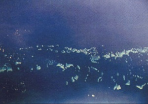

# 0950 圣约斯曼之希望 St. Josmane's Hope

精校状态：中文行文已逐段精校，部分术语仍为暂定

分类：地理 / 真实空间 Real Space / 朦胧星域 Segmentum Obscurus

原文来源：https://www.bilibili.com/opus/1172770953696903175

原作者：帝国神选罐头

原文时间：2026年02月24日 09:10

[返回分类目录](目录.md) · [全书目录](../../目录.md)

<!-- A0950-B0001 -->
### Basic Data 基本资料

原题：Basic Data 基础数据

<!-- /A0950-B0001 -->

<!-- A0950-B0002 -->
**英文原文**

Name:St. Josmane's Hope

<!-- /A0950-B0002 -->

<!-- A0950-B0003 -->

原译文

名称：圣约斯曼之希望

**校订译文**

名称：圣约斯曼之希望

<!-- /A0950-B0003 -->

<!-- A0950-B0004 -->
**英文原文**

Segmentum:Segmentum Obscurus

<!-- /A0950-B0004 -->

<!-- A0950-B0005 -->

原译文

星域：朦胧星域

**校订译文**

星域：朦胧星域

<!-- /A0950-B0005 -->

<!-- A0950-B0006 -->
**英文原文**

Sector:Cadian Sector

<!-- /A0950-B0006 -->

<!-- A0950-B0007 -->

原译文

星区：卡迪亚星区

**校订译文**

星区：卡迪亚星区

<!-- /A0950-B0007 -->

<!-- A0950-B0008 -->
**英文原文**

System:Cadian System

<!-- /A0950-B0008 -->

<!-- A0950-B0009 -->

原译文

星系：卡迪亚行星

**校订译文**

星系：卡迪亚星系

<!-- /A0950-B0009 -->

<!-- A0950-B0010 -->
**英文原文**

Class:Destroyed, former Penal World

<!-- /A0950-B0010 -->

<!-- A0950-B0011 -->

原译文

类别：被毁，前刑罚世界

**校订译文**

类别：被毁，前刑罚世界

<!-- /A0950-B0011 -->

<!-- A0950-B0012 图片 -->

<!-- A0950-B0013 -->

原译文

Planetary Image 行星图像

**校订译文**

Planetary Image 行星图像

<!-- /A0950-B0013 -->

<!-- A0950-B0014 -->
**英文原文**

St. Josmane's Hope was the ninth planet of the Cadian System. It served as an Imperial military prison within the Cadian sector.

<!-- /A0950-B0014 -->

<!-- A0950-B0015 -->

原译文

圣约斯曼之希望是卡迪亚星系的第九颗行星。它曾是卡迪亚星区的一座帝国军事监狱。

**校订译文**

圣约斯曼之希望是卡迪亚星系的第九颗行星。它曾是卡迪亚星区的一座帝国军事监狱。

<!-- /A0950-B0015 -->

<!-- A0950-B0016 -->
**英文原文**

The heart of St. Josmane's Hope was a vast continent-sized prison complex.

<!-- /A0950-B0016 -->

<!-- A0950-B0017 -->

原译文

圣约斯曼之希望的中心是一个巨大的大陆规模的监狱建筑群。

**校订译文**

圣约斯曼之希望的核心是一座横跨整个大陆的庞大监狱建筑群。

<!-- /A0950-B0017 -->

<!-- A0950-B0018 -->
**英文原文**

During the 13th Black Crusade the Imperium lost the planet to Chaos due to massive prison riots and revolts. When it became apparent that St. Josmane's Hope could not be reclaimed, it was destroyed in order to prevent the armies of Chaos from using it as a staging point in their invasion of the sector.

<!-- /A0950-B0018 -->

<!-- A0950-B0019 -->

原译文

在第13次黑色远征期间，帝国因大规模的监狱暴乱和叛乱而失去了这个行星。当圣约斯曼之希望显然无法收复时，它被摧毁，以防止混沌军队将其作为入侵该星区的集结点。

**校订译文**

在第13次黑色远征期间，帝国因大规模的监狱暴乱和叛乱而失去了这个行星。当圣约斯曼之希望显然无法收复时，它被摧毁，以防止混沌军队将其作为入侵该星区的集结点。

<!-- /A0950-B0019 -->

<!-- A0950-B0020 -->
## The 13th Black Crusade 第十三次黑色远征

<!-- /A0950-B0020 -->

<!-- A0950-B0021 -->
## The Fall of St. Josmane's Hope 圣约斯曼之希望的陷落

<!-- /A0950-B0021 -->

<!-- A0950-B0022 -->
**英文原文**

In 999.M41 insurgent activity rose across the sectors surrounding the Eye of Terror with the aim of destabilizing the imperial defence lines before the launch of the 13th Black Crusade.

<!-- /A0950-B0022 -->

<!-- A0950-B0023 -->

原译文

999.M41，叛乱行动在恐惧之眼周围的星区兴起，目的是在发动第13次黑色远征之前破坏帝国防线的稳定。

**校订译文**

999.M41，叛乱行动在恐惧之眼周围的星区兴起，目的是在发动第13次黑色远征之前破坏帝国防线的稳定。

<!-- /A0950-B0023 -->

<!-- A0950-B0024 -->
**英文原文**

On St. Josmane's Hope subversive groups such as the Corrective Rehabilitation Movement aimed their efforts at the prisoners and tried to pit them against their gaolers. In the brutal fighting that erupted, contact was lost with the other worlds of the Cadian system. Isolated and unable to turn the tide many of the local defenders kept a bullet for themselves rather than allowing the raging convicts to take them alive.

<!-- /A0950-B0024 -->

<!-- A0950-B0025 -->

原译文

在圣约斯曼之希望上，诸如矫正康复运动等颠覆团体将他们的努力瞄准了囚犯，并试图让他们与狱卒对抗。在爆发的残酷战斗中，与卡迪亚星系的其他世界失去了联系。许多当地守军孤立无援，无法扭转局势，他们为自己保留了一颗子弹，而不是让肆虐的罪犯活捉他们。

**校订译文**

在圣约斯曼之希望，矫正康复运动等颠覆组织将囚犯作为煽动对象，试图挑起他们与狱卒之间的冲突。残酷的战斗随即爆发，星球与卡迪亚星系其他世界的联系也中断了。许多守军孤立无援，又无力扭转局势，便给自己留下一颗子弹，以免落入狂暴囚犯之手。

<!-- /A0950-B0025 -->

<!-- A0950-B0026 -->
**英文原文**

When the forces of Chaos begun to invade the planet they were initially greeted as liberators. However, the Chaos Space Marines of the Violators, who spearheaded the assault, treated the inmates like slaves and conscripted them for their own cause.

<!-- /A0950-B0026 -->

<!-- A0950-B0027 -->

原译文

当混沌部队开始入侵行星时，他们最初被视为解放者。然而，率先发动袭击的违逆者混沌星际战士将囚犯当作奴隶对待，并为自己的事业征召他们。

**校订译文**

混沌军队开始入侵时，起初受到了解放者般的欢迎。然而，充当进攻先锋的违背者混沌星际战士，却把囚犯当作奴隶，强征他们为自己效力。

<!-- /A0950-B0027 -->

<!-- A0950-B0028 -->
## The Destruction of St. Josmane's Hope 圣约斯曼之希望的毁灭

<!-- /A0950-B0028 -->

<!-- A0950-B0029 -->
**英文原文**

The Imperial counter-offensive to reconquer St. Josmane's Hope succeeded only in liberating parts of the world.

<!-- /A0950-B0029 -->

<!-- A0950-B0030 -->

原译文

帝国夺回圣约斯曼之希望的反攻只成功地解放了世界的部分地区。

**校订译文**

帝国夺回圣约斯曼之希望的反攻只成功地解放了世界的部分地区。

<!-- /A0950-B0030 -->

<!-- A0950-B0031 -->
**英文原文**

During a meeting of representatives of all major Imperial fighting forces in the sector, Lord Castellan Ursarkar E. Creed commissioned the destruction of the planet. With options such as Exterminatus and nova cannon bombardment unavailable, the only way left was to send a small special force to trigger tectonic instabilities by overloading the generatorium grid in the main prison complex.

<!-- /A0950-B0031 -->

<!-- A0950-B0032 -->

原译文

在该星区所有主要帝国战斗部队的代表会议上，领主堡主乌萨卡·E·克里德下令摧毁这颗行星。由于灭绝令和新星炮轰炸等选项不可用，剩下的唯一办法是派遣一支小型特殊部队，通过使主监狱建筑群中的发电机栅极过载来引发构造不稳定。

**校订译文**

在星区各支主要帝国军队代表的会议上，堡主领主乌萨卡·E.克里德下令摧毁这颗星球。由于无法执行灭绝令或使用新星炮轰炸，唯一可行的办法，是派遣一支小型特战部队潜入主监狱建筑群，使发电网络过载，从而引发地壳构造失稳。

**校注：** generatorium grid 为发电设施网络，不是电子元件的栅极。

<!-- /A0950-B0032 -->

<!-- A0950-B0033 -->
**英文原文**

Members of various Imperial forces were grouped together into "Strike Force Herald". They penetrated the heart of the beset world and successfully caused St. Josmane's Hope to disintegrate. However, all of its members were lost during the planet's destruction.

<!-- /A0950-B0033 -->

<!-- A0950-B0034 -->

原译文

各帝国部队的成员被组成了“先驱打击部队”。他们渗透到被围困的世界的中心，成功地瓦解了圣约斯曼之希望。然而，在行星毁灭期间，它的所有成员都消失了。

**校订译文**

帝国各部抽调人员，组成“先驱打击部队”。他们潜入这颗被战火困住的星球腹地，成功使圣约斯曼之希望解体。然而，整支部队也随星球的毁灭全部牺牲。

<!-- /A0950-B0034 -->

<!-- A0950-B0035 -->
## Trivia 琐事

<!-- /A0950-B0035 -->

<!-- A0950-B0036 -->
**英文原文**

St. Josmane's Hope was one of the numerous planets created by Games Workshop as a theatre of war for their global Eye of Terror campaign. Originally it was not scheduled for destruction. Andy Chambers elaborated the reasons behind the decision in White Dwarf 287 (UK):

<!-- /A0950-B0036 -->

<!-- A0950-B0037 -->

原译文

圣约斯曼之希望是GW为其全球恐惧之眼战役创造的众多行星之一，作为战争剧场。最初，它没有计划被销毁。安迪·钱伯斯在《白矮人287期》（英国）详细阐述了判决背后的原因：

**校订译文**

圣约斯曼之希望，是 Games Workshop 为“恐惧之眼”全球战役活动创设的众多战场行星之一，最初并未计划将它毁灭。安迪·钱伯斯在英国版《白矮人》第287期中，说明了这一决定的缘由：

<!-- /A0950-B0037 -->

<!-- A0950-B0038 -->

原译文

"On our internal Eye of Terror web group we contemplated the situation. From a background perspective we felt the Imperium would sacrifice the planet rather than lose it to the forces of Disorder, it would also mark the victory of the Chaos players so that come what may they had made a milestone mark (unplanned as it was) in the narrative of the Eye of Terror campaign. So it was one Friday night that I gave the order to destroy St Josmane's Hope, a fictional world in a giant fictional game with no actual pieces. It was a weird feeling." “在我们内部的恐惧之眼网络小组中，我们考虑了这种情况。从背景角度来看，我们觉得帝国会牺牲行星，而不是把它输给混沌部队，这也标志着混沌玩家的胜利，所以不管发生什么，他们在恐惧之眼战役的叙事中都取得了里程碑式的成就（尽管是计划外的）。所以在一个周五的晚上，我下令摧毁圣约斯曼之希望，一个巨大的虚构游戏中的虚构世界，没有实际的部分。这是一种奇怪的感觉。”

**校订译文**

"On our internal Eye of Terror web group we contemplated the situation. From a background perspective we felt the Imperium would sacrifice the planet rather than lose it to the forces of Disorder, it would also mark the victory of the Chaos players so that come what may they had made a milestone mark (unplanned as it was) in the narrative of the Eye of Terror campaign. So it was one Friday night that I gave the order to destroy St Josmane's Hope, a fictional world in a giant fictional game with no actual pieces. It was a weird feeling." “我们在内部的‘恐惧之眼’网络工作组里讨论过这个局面。从背景设定来看，我们觉得，帝国宁可牺牲这颗星球，也不会让它落入无序阵营之手。同时，这也能确认混沌玩家的胜利：无论后来发生什么，他们都已经在‘恐惧之眼’战役的故事中留下了里程碑般的一笔，尽管这并非原定计划。于是，在一个星期五的晚上，我下令摧毁圣约斯曼之希望——那是一场庞大虚构游戏里的虚构世界，甚至没有任何实体棋子代表它。那种感觉很奇怪。”

**校注：** 保留整段原英文；pieces 在桌面游戏语境指实体棋子，不是“实际的部分”。Disorder 为活动阵营称谓，译无序阵营，不强等同所有混沌军。

<!-- /A0950-B0038 -->

本篇核心术语与暂定项

以下列出本篇出现的英文原形及核心术语表用词。同形词可能指不同对象，具体词义以本篇正文和校注为准；单复数、别名和仅见于图注的名称可能尚未列入。完整候选见[术语表](../../术语表/双语术语候选.csv)。

| 英文 | 采用中文 | 状态 |
| --- | --- | --- |
| Space Marines | 星际战士 | 官方已核对 |
| Chaos Space Marines | 混沌星际战士 | 官方已核对 |
| Imperium | 帝国 | 暂定·简称 |
| Eye of Terror | 恐惧之眼 | 官方已核对 |
| Segmentum Obscurus | 朦胧星域 | 暂定·官方待核 |
| Segmentum | 星域 | 暂定·官方待核 |
| Sector | 星区 | 暂定·官方待核 |
| Obscurus | 朦胧星 | 暂定·官方待核 |
| St. Josmane's Hope | 圣约斯曼之希望 | 暂定·官方待核 |
| Strike Force Herald | 先驱打击部队 | 暂定·官方待核 |
| Herald | 传令官 | 暂定·官方待核 |
| Liberators | 解放者 | 暂定·官方待核 |
| Castellan | 堡主 | 官方已核对 |
| Ursarkar E. Creed | 乌萨卡·E.克里德 | 暂定·官方待核 |
| Andy Chambers | 安迪·钱伯斯 | 暂定·官方待核 |
| Lord Castellan | 堡主领主 | 暂定·官方待核 |
| System | 星系（恒星系统） | 暂定·官方待核 |
| Penal World | 刑罚世界 | 暂定·官方待核 |
| Games Workshop | Games Workshop | 暂定·官方待核 |
| Cadian Sector | 卡迪亚星区 | 暂定·官方待核 |
| Corrective Rehabilitation Movement | 矫正康复运动 | 暂定·官方待核 |

