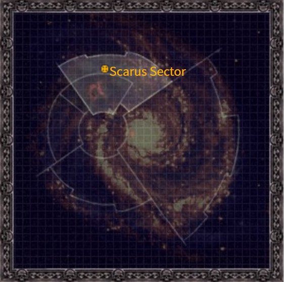
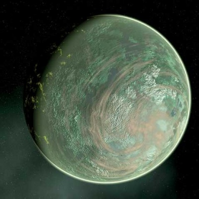
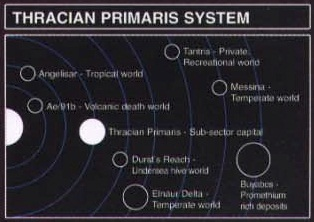

# 0951 色雷斯主星 Thracian Primaris

精校状态：中文行文已逐段精校，部分术语仍为暂定

分类：地理 / 真实空间 Real Space / 朦胧星域 Segmentum Obscurus

原文来源：https://www.bilibili.com/opus/1109050784562020356

原作者：帝国神选罐头

原文时间：2025年09月05日 16:03

[返回分类目录](目录.md) · [全书目录](../../目录.md)

<!-- A0951-B0001 图片 -->

<!-- A0951-B0002 -->

原译文

Map 地图

**校订译文**

Map 地图

<!-- /A0951-B0002 -->

<!-- A0951-B0003 -->
### Basic Data 基本资料

原题：Basic Data 基础信息

<!-- /A0951-B0003 -->

<!-- A0951-B0004 -->
**英文原文**

Name:Thracian Primaris

<!-- /A0951-B0004 -->

<!-- A0951-B0005 -->

原译文

名称：色雷斯主星

**校订译文**

名称：色雷斯主星

<!-- /A0951-B0005 -->

<!-- A0951-B0006 -->
**英文原文**

Segmentum:Segmentum Obscurus

<!-- /A0951-B0006 -->

<!-- A0951-B0007 -->

原译文

星域：朦胧星域

**校订译文**

星域：朦胧星域

<!-- /A0951-B0007 -->

<!-- A0951-B0008 -->
**英文原文**

Sector:Scarus Sector

<!-- /A0951-B0008 -->

<!-- A0951-B0009 -->

原译文

星区：斯卡鲁斯星区

**校订译文**

星区：斯卡鲁斯星区

<!-- /A0951-B0009 -->

<!-- A0951-B0010 -->
**英文原文**

Subsector:Helican Subsector

<!-- /A0951-B0010 -->

<!-- A0951-B0011 -->

原译文

分区：赫利坎分区

**校订译文**

次星区：赫利坎次星区

<!-- /A0951-B0011 -->

<!-- A0951-B0012 -->
**英文原文**

System:Thracian Primaris system

<!-- /A0951-B0012 -->

<!-- A0951-B0013 -->

原译文

星系：色雷斯主星系

**校订译文**

星系：色雷斯主星系

<!-- /A0951-B0013 -->

<!-- A0951-B0014 -->
**英文原文**

Population:22,000,000,000

<!-- /A0951-B0014 -->

<!-- A0951-B0015 -->

原译文

人口：220,0000,0000

**校订译文**

人口：220亿

<!-- /A0951-B0015 -->

<!-- A0951-B0016 -->
**英文原文**

Affiliation:Imperium

<!-- /A0951-B0016 -->

<!-- A0951-B0017 -->

原译文

隶属：帝国

**校订译文**

隶属：帝国

<!-- /A0951-B0017 -->

<!-- A0951-B0018 -->
**英文原文**

Class:Hive World, Industrial World

<!-- /A0951-B0018 -->

<!-- A0951-B0019 -->

原译文

级别：巢都世界，工业世界

**校订译文**

级别：巢都世界，工业世界

<!-- /A0951-B0019 -->

<!-- A0951-B0020 -->
**英文原文**

Tithe Grade:Exactis Particular

<!-- /A0951-B0020 -->

<!-- A0951-B0021 -->

原译文

什一税等级：第一级特等

**校订译文**

什一税等级：第一级特等

<!-- /A0951-B0021 -->

<!-- A0951-B0022 图片 -->

<!-- A0951-B0023 -->

原译文

Planetary Image 行星图片

**校订译文**

Planetary Image 行星图片

<!-- /A0951-B0023 -->

<!-- A0951-B0024 -->
**英文原文**

Thracian Primaris is the pre-eminent industrial Hive World of the Helican Subsector and after 241.M41, its capital as well.

<!-- /A0951-B0024 -->

<!-- A0951-B0025 -->

原译文

色雷斯主星是赫利坎分区的杰出工业巢都世界，241.M41之后也是其首都。

**校订译文**

色雷斯主星是赫利坎次星区首屈一指的工业巢都世界，并从241.M41起成为该次星区首府。

<!-- /A0951-B0025 -->

<!-- A0951-B0026 -->
## Overview 概述

<!-- /A0951-B0026 -->

<!-- A0951-B0027 -->
**英文原文**

Hives now cover more than 70% of its surface, including what is left of its oceans. One of its greatest sights for the visitor is the kilometre-wide Avenue of the Victor Bellum which runs almost to the centre of the Hive and ends in the Spatian Gate. The gate is constructed of glossy white aethercite. It is so large that the Dome in its ceiling has its own local weather pattern; even Titans are said to be able to pass through it without bending.

<!-- /A0951-B0027 -->

<!-- A0951-B0028 -->

原译文

巢都现在覆盖了70%以上的表面，包括剩下的海洋。对游客来说，它最大的景点之一是一公里宽的战争胜者大道，这条大道几乎一直延伸到巢都的中心，终点是空间之门。大门由光滑的白色以太矿石建造。它如此之大，以至于顶部的穹顶有自己的当地天气模式；据说即使是泰坦也能不弯腰地穿过它。

**校订译文**

巢都如今覆盖了70%以上的地表，连残存的海洋也包括在内。最令访客惊叹的景观之一，是宽达一公里的战争胜者大道：它几乎伸入巢都中心，终点为斯帕提安门。城门由光洁的白色以太矿石砌成，规模之大，竟使其顶部穹顶内部形成了独立的局地天气；据说连泰坦都能不必弯身地从门下通过。

**校注：** Spatian 为专名，原“空间之门”按普通 space 误解，暂改斯帕提安门。

<!-- /A0951-B0028 -->

<!-- A0951-B0029 -->
## History 历史

<!-- /A0951-B0029 -->

<!-- A0951-B0030 -->
### Relief of Hive Ferax 丰饶巢都解围战

原题：Relief of Hive Ferax 丰饶巢都的解脱

<!-- /A0951-B0030 -->

<!-- A0951-B0031 -->
**英文原文**

When Hive Ferax fell prey to a cannibal Cult uprising in 071.M41, a number of nearby Space Marine Chapters mustered a strike force in response and under Force Commander Zha'Khan, of the Marauders Chapter, they deployed to the wastes near the embattled Hive and waited. Once the Cult had scoured Hive Ferax of its population, the hunger-maddened cannibals surged forth from the Hive in a vast horde in search of more food - only to find themselves under the massed guns of the strike force, who opened fire and destroyed the Cult.

<!-- /A0951-B0031 -->

<!-- A0951-B0032 -->

原译文

071.M41，当丰饶巢都成为食人教派叛乱的牺牲品时，附近的一些星际战士战团召集了一支打击部队作为回应，在掠夺者战团的部队指挥官扎’坎的指挥下，他们部署到四面楚歌的巢都附近的荒地并等待。一旦教派彻底消灭了巢都中的人口，饥饿的食人族就成群结队地从巢都中涌出，寻找更多的食物 — 结果却发现自己被打击小队的密集火力所包围，开火摧毁了教派。

**校订译文**

071.M41，丰饶巢都爆发食人邪教叛乱。附近数支星际战士战团集结了一支打击部队，由掠夺者战团的部队指挥官扎·坎率领，在巢都附近的荒原部署待命。邪教吃光了巢都居民后，被饥饿逼疯的食人者成群涌出，寻找更多食物，却迎头撞上打击部队集中的炮口；部队随即开火，将邪教歼灭。

<!-- /A0951-B0032 -->

<!-- A0951-B0033 -->
### The Triumph 大捷

<!-- /A0951-B0033 -->

<!-- A0951-B0034 -->
**英文原文**

Lord Helican, once he returned from a great quelling of the sub-sector's civil war, made a great parade, said to have stretched well over 20 miles, consisting of two Space Marine Chapters (the White Scars and Aurora Chapter), an unknown number of Imperial Guardsmen (approx. 100,000-500,000), 300 members of the Inquisition, several Imperial Titans and many more organizations also took part in the Triumph. Gregor Eisenhorn and Gideon Ravenor were just two of the many Inquisitors present in the vast collection of personnel. During the Triumph, Chaos tainted pilots strafed the parade, killing thousands, if not tens of thousands of citizens, Guardsmen, and Space Marines with their gunfire and through crashing their damaged planes. This is where Ravenor was so horribly wounded and, miraculously, Eisenhorn escaped unhurt. Following the disaster, much of the planet was enveloped in brief but brutal riots, worsened by the escape of over 30 alpha-plus level psykers. This event would later on be known as the Thracian Atrocity.

<!-- /A0951-B0034 -->

<!-- A0951-B0035 -->

原译文

赫利坎领主在平息了该分区的内战后返回，举行了一场盛大的游行，据说游行绵延20多英里，由两个星际战士战团长（白色伤疤和极光战团）、数量不详的帝国卫队（约10万至50万人）、300名审判庭成员、几台帝国泰坦和更多组织组成，也参加了胜利。格雷戈·艾森霍恩和吉迪翁·拉文诺只是众多审判官中的两位。在大捷期间，受混沌影响的飞行员向游行队伍扫射，用枪火和撞毁受损的飞机杀死了数千甚至数万名公民、卫队和星际战士。这就是拉文诺受重伤的地方，奇迹般地，艾森霍恩毫发无损地逃脱了。灾难发生后，行星的大部分地区都笼罩在短暂但残酷的骚乱中，30多名超阿尔法级灵能者的逃脱使骚乱更加严重。这一事件后来被称为色雷斯暴行。

**校订译文**

赫利坎领主平定次星区的大规模内战后凯旋，举办了一场据说绵延二十多英里的盛大阅兵。参阅者包括白疤和极光两个星际战士战团、数量不详的帝国卫队士兵（约十万至五十万人）、300名审判庭成员、数台帝国泰坦，以及许多其他机构的人员。格雷戈·艾森霍恩与吉迪恩·拉文诺只是到场众多审判官中的两位。庆典期间，遭混沌腐化的飞行员扫射阅兵队伍，还驾着受损飞机撞入人群，杀死了数千乃至数万名市民、帝国卫队士兵和星际战士。拉文诺正是在此遭受可怕重伤，艾森霍恩却奇迹般地毫发无损。灾难过后，星球大部分地区爆发短暂而残酷的骚乱；三十多名超阿尔法级灵能者逃脱，更使局势雪上加霜。这起事件后来被称为“色雷斯暴行”。

**校注：** two Space Marine Chapters 指两个战团，不是两名战团长。

<!-- /A0951-B0035 -->

<!-- A0951-B0036 -->
## Military 军事

<!-- /A0951-B0036 -->

<!-- A0951-B0037 -->
**英文原文**

Thracian Primaris has a Planetary Defence Force of 8 million. In addition, the planet is protected by five Ramilies Star Forts.

<!-- /A0951-B0037 -->

<!-- A0951-B0038 -->

原译文

色雷斯主星拥有800万的行星防御部队。此外，这颗行星还受到五个拉米雷斯星堡的保护。

**校订译文**

色雷斯主星拥有800万的行星防御部队。此外，这颗行星还受到五个拉米雷斯星堡的保护。

<!-- /A0951-B0038 -->

<!-- A0951-B0039 -->
## Other Planetary Data 其他行星数据

<!-- /A0951-B0039 -->

<!-- A0951-B0040 -->
**英文原文**

Designation: HSs 1.01

<!-- /A0951-B0040 -->

<!-- A0951-B0041 -->

原译文

标示：HSs 1.01

**校订译文**

编号：HSs 1.01

<!-- /A0951-B0041 -->

<!-- A0951-B0042 -->
**英文原文**

Orbital Distance: 0.89 AU

<!-- /A0951-B0042 -->

<!-- A0951-B0043 -->

原译文

轨道距离：0.89天文单位

**校订译文**

轨道距离：0.89天文单位

<!-- /A0951-B0043 -->

<!-- A0951-B0044 -->
**英文原文**

Gravitation: 1.12G

<!-- /A0951-B0044 -->

<!-- A0951-B0045 -->

原译文

重力：1.12G

**校订译文**

重力：1.12G

<!-- /A0951-B0045 -->

<!-- A0951-B0046 -->
**英文原文**

Temperature: 28°С

<!-- /A0951-B0046 -->

<!-- A0951-B0047 -->

原译文

温度：28°С

**校订译文**

温度：28°С

<!-- /A0951-B0047 -->

<!-- A0951-B0048 -->
**英文原文**

Aestimare: A350

<!-- /A0951-B0048 -->

<!-- A0951-B0049 -->

原译文

评估：A350

**校订译文**

评估：A350

<!-- /A0951-B0049 -->

<!-- A0951-B0050 -->
**英文原文**

Moons: None

<!-- /A0951-B0050 -->

<!-- A0951-B0051 -->

原译文

卫星：无

**校订译文**

卫星：无

<!-- /A0951-B0051 -->

<!-- A0951-B0052 图片 -->

<!-- A0951-B0053 -->

原译文

A map showing some of the worlds in the system 显示星系中一些世界的地图

**校订译文**

A map showing some of the worlds in the system 显示星系中一些世界的地图

<!-- /A0951-B0053 -->

本篇核心术语与暂定项

以下列出本篇出现的英文原形及核心术语表用词。同形词可能指不同对象，具体词义以本篇正文和校注为准；单复数、别名和仅见于图注的名称可能尚未列入。完整候选见[术语表](../../术语表/双语术语候选.csv)。

| 英文 | 采用中文 | 状态 |
| --- | --- | --- |
| Space Marines | 星际战士 | 官方已核对 |
| Inquisition | 审判庭 | 暂定 |
| Imperium | 帝国 | 暂定·简称 |
| Alpha-Plus | 阿尔法加级 | 暂定 |
| Hive World | 巢都世界 | 暂定·官方待核 |
| Segmentum Obscurus | 朦胧星域 | 暂定·官方待核 |
| Segmentum | 星域 | 暂定·官方待核 |
| Sector | 星区 | 暂定·官方待核 |
| Subsector | 次星区 | 暂定·官方待核 |
| Obscurus | 朦胧星 | 暂定·官方待核 |
| Gregor Eisenhorn | 格雷戈·艾森霍恩 | 暂定·官方待核 |
| Gideon Ravenor | 吉迪恩·拉文诺 | 暂定·官方待核 |
| Aestimare | 战略价值评级 | 暂定·官方待核 |
| White Scars | 白疤 | 官方已核 |
| Scars | 伤疤 | 暂定·官方待核 |
| Space Marine | 星际战士 | 暂定·官方待核 |
| Chapter | 战团 | 暂定·官方待核 |
| Aurora Chapter | 曙光女神 | 暂定·官方待核 |
| Marauders | 掠夺者 | 暂定·官方待核 |
| Horde | 部落 | 暂定·官方待核 |
| Thracian Primaris | 色雷斯主星 | 暂定·官方待核 |
| Helican Subsector | 赫利坎次星区 | 暂定·官方待核 |
| System | 星系（恒星系统） | 暂定·官方待核 |
| Exactis Particular | 第一级特等 | 暂定·官方待核 |
| Industrial World | 工业世界 | 暂定·官方待核 |
| The Wastes | 大荒地 | 暂定·官方待核 |
| Scarus Sector | 斯卡鲁斯星区 | 暂定·官方待核 |
| Spatian Gate | 斯帕提安门 | 暂定·官方待核 |
| Avenue of the Victor Bellum | 战争胜者大道 | 暂定·官方待核 |
| Hive Ferax | 丰饶巢都 | 暂定·官方待核 |
| Thracian Atrocity | 色雷斯暴行 | 暂定·官方待核 |

