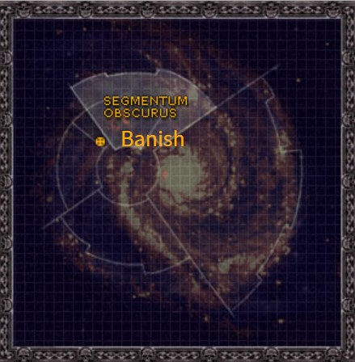

# 0952 巴尼什 Banish

精校状态：中文行文已逐段精校，部分术语仍为暂定

分类：地理 / 真实空间 Real Space / 朦胧星域 Segmentum Obscurus

原文来源：https://www.bilibili.com/opus/1160181356605472776

原作者：帝国神选罐头

原文时间：2026年01月21日 10:56

[返回分类目录](目录.md) · [全书目录](../../目录.md)

原篇名：放逐星 Banish

<!-- A0952-B0001 图片 -->

<!-- A0952-B0002 -->

原译文

Map 地图

**校订译文**

Map 地图

<!-- /A0952-B0002 -->

<!-- A0952-B0003 -->
### Basic Data 基本资料

原题：Basic Data 基础数据

<!-- /A0952-B0003 -->

<!-- A0952-B0004 -->
**英文原文**

Name:Banish

<!-- /A0952-B0004 -->

<!-- A0952-B0005 -->

原译文

名称：放逐星

**校订译文**

名称：巴尼什

<!-- /A0952-B0005 -->

<!-- A0952-B0006 -->
**英文原文**

Segmentum:Segmentum Obscurus

<!-- /A0952-B0006 -->

<!-- A0952-B0007 -->

原译文

星域：朦胧星域

**校订译文**

星域：朦胧星域

<!-- /A0952-B0007 -->

<!-- A0952-B0008 -->
**英文原文**

Sector:Narasima Sector

<!-- /A0952-B0008 -->

<!-- A0952-B0009 -->

原译文

星区：那罗希摩星区

**校订译文**

星区：那罗希摩星区

<!-- /A0952-B0009 -->

<!-- A0952-B0010 -->
**英文原文**

Affiliation:Imperium (Exorcists)

<!-- /A0952-B0010 -->

<!-- A0952-B0011 -->

原译文

隶属：帝国（驱魔者）

**校订译文**

隶属：帝国（驱魔者）

<!-- /A0952-B0011 -->

<!-- A0952-B0012 -->
**英文原文**

Class:Feral World, Adeptus Astartes Homeworld

<!-- /A0952-B0012 -->

<!-- A0952-B0013 -->

原译文

类别：蛮荒世界，阿斯塔特修会家园世界

**校订译文**

类别：蛮荒世界，阿斯塔特修会家园世界

<!-- /A0952-B0013 -->

<!-- A0952-B0014 -->
**英文原文**

Banish is the homeworld of the Exorcists Space Marine Chapter and their Fortress-Monastery, the Basilica Malefex.

<!-- /A0952-B0014 -->

<!-- A0952-B0015 -->

原译文

放逐星是驱魔者星际战士战团的家园世界和他们的堡垒修道院恶灵大教堂所在地。

**校订译文**

巴尼什是驱魔者星际战士战团的母星，战团的要塞修道院“恶灵大教堂”也坐落于此。

<!-- /A0952-B0015 -->

<!-- A0952-B0016 -->
**英文原文**

An isolated Feral World located in a quarantined sector of the Narasima Straits, Banish serves as the Exorcists' primary training and production centre. Banish has little in the way of natural assets or valuable infrastructure, but its hardy population which braves its acidic swamps are descended from Imperial prospectors stranded on the planet in an earlier age. They are a highly self-reliant people who have forgotten technology or galactic exploration.

<!-- /A0952-B0016 -->

<!-- A0952-B0017 -->

原译文

放逐星是一个位于那罗希摩海峡的隔离星区的孤立的蛮荒世界，是驱魔者的主要训练和生产中心。放逐星几乎没有自然资产或宝贵的基础设施，但其适应力强的人口勇敢地面对酸性沼泽，是早期滞留在行星上的帝国勘探者的后代。他们是高度自力更生的人口，已经忘记了技术或银河探索。

**校订译文**

巴尼什是一颗孤立的蛮荒世界，位于那罗希摩海峡的一处封锁区域内，是驱魔者的主要训练与生产中心。星球缺乏自然资源，也没有多少有价值的基础设施。当地居民却坚韧顽强，能够在酸性沼泽中生存；他们是早年受困于此的帝国勘探者的后代，高度自给自足，但已经遗忘了技术和银河探索的知识。

**校注：** 此句 sector 未提供独立正式星区名，按那罗希摩海峡中的封锁区域处理，基础表的 Narasima Sector 那罗希摩星区仍保留。

<!-- /A0952-B0017 -->

本篇核心术语与暂定项

以下列出本篇出现的英文原形及核心术语表用词。同形词可能指不同对象，具体词义以本篇正文和校注为准；单复数、别名和仅见于图注的名称可能尚未列入。完整候选见[术语表](../../术语表/双语术语候选.csv)。

| 英文 | 采用中文 | 状态 |
| --- | --- | --- |
| Adeptus Astartes | 阿斯塔特修会 | 官方已核对 |
| Imperium | 帝国 | 暂定·简称 |
| Segmentum Obscurus | 朦胧星域 | 暂定·官方待核 |
| Segmentum | 星域 | 暂定·官方待核 |
| Sector | 星区 | 暂定·官方待核 |
| Banish | 巴尼什 | 暂定·官方待核 |
| Obscurus | 朦胧星 | 暂定·官方待核 |
| Space Marine | 星际战士 | 暂定·官方待核 |
| Chapter | 战团 | 暂定·官方待核 |
| Fortress-monastery | 要塞修道院 | 暂定·官方待核 |
| Exorcists | 驱魔者 | 暂定·官方待核 |
| Feral World | 蛮荒世界 | 暂定·官方待核 |
| Basilica Malefex | 恶灵大教堂 | 暂定·官方待核 |

