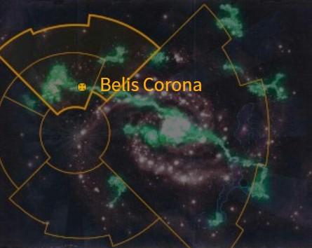
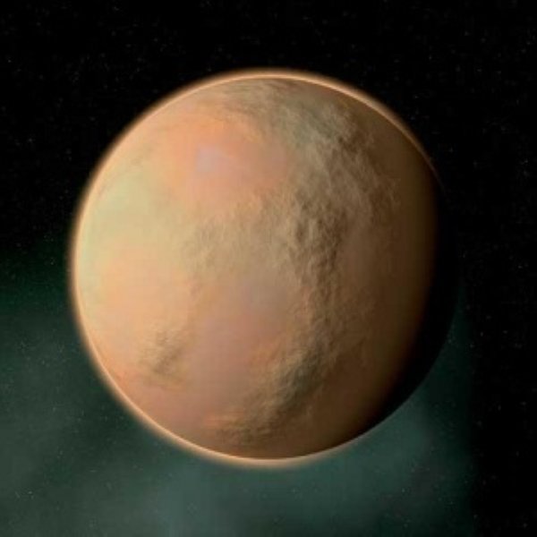

# 0953 贝利斯·卡罗纳 Belis Corona

精校状态：中文行文已逐段精校，部分术语仍为暂定

分类：地理 / 真实空间 Real Space / 朦胧星域 Segmentum Obscurus

原文来源：https://www.bilibili.com/opus/1168320671820808210

原作者：帝国神选罐头

原文时间：2026年02月12日 09:20

[返回分类目录](目录.md) · [全书目录](../../目录.md)

原篇名：比利斯·卡罗那 Belis Corona

<!-- A0953-B0001 图片 -->

<!-- A0953-B0002 -->

原译文

Map 地图

**校订译文**

Map 地图

<!-- /A0953-B0002 -->

<!-- A0953-B0003 -->
### Basic Data 基本资料

原题：Basic Data 基础数据

<!-- /A0953-B0003 -->

<!-- A0953-B0004 -->
**英文原文**

Name:Belis Corona

<!-- /A0953-B0004 -->

<!-- A0953-B0005 -->

原译文

名称：比利斯·卡罗那

**校订译文**

名称：贝利斯·卡罗纳

<!-- /A0953-B0005 -->

<!-- A0953-B0006 -->
**英文原文**

Segmentum:Segmentum Obscurus

<!-- /A0953-B0006 -->

<!-- A0953-B0007 -->

原译文

星域：朦胧世界

**校订译文**

星域：朦胧星域

<!-- /A0953-B0007 -->

<!-- A0953-B0008 -->
**英文原文**

Sector:Belis Corona Sector

<!-- /A0953-B0008 -->

<!-- A0953-B0009 -->

原译文

星区：比利斯·卡罗那星区

**校订译文**

星区：贝利斯·卡罗纳星区

<!-- /A0953-B0009 -->

<!-- A0953-B0010 -->
**英文原文**

System:Belis Corona System

<!-- /A0953-B0010 -->

<!-- A0953-B0011 -->

原译文

星系：比利斯·卡罗那星系

**校订译文**

星系：贝利斯·卡罗纳星系

<!-- /A0953-B0011 -->

<!-- A0953-B0012 -->
**英文原文**

Population:No Indigenous

<!-- /A0953-B0012 -->

<!-- A0953-B0013 -->

原译文

人口：无原住民

**校订译文**

人口：无原住民

<!-- /A0953-B0013 -->

<!-- A0953-B0014 -->
**英文原文**

Affiliation:Imperium

<!-- /A0953-B0014 -->

<!-- A0953-B0015 -->

原译文

隶属：帝国

**校订译文**

隶属：帝国

<!-- /A0953-B0015 -->

<!-- A0953-B0016 -->
**英文原文**

Class:War World, Dead World

<!-- /A0953-B0016 -->

<!-- A0953-B0017 -->

原译文

类别：战争世界，死亡世界

**校订译文**

类别：战争世界、死寂世界

<!-- /A0953-B0017 -->

<!-- A0953-B0018 -->
**英文原文**

Tithe Grade:Adeptus Non

<!-- /A0953-B0018 -->

<!-- A0953-B0019 -->

原译文

什一税等级：特级免税

**校订译文**

什一税等级：特级免税

<!-- /A0953-B0019 -->

<!-- A0953-B0020 图片 -->

<!-- A0953-B0021 -->

原译文

Planetary Image 行星图像

**校订译文**

Planetary Image 行星图像

<!-- /A0953-B0021 -->

<!-- A0953-B0022 -->
**英文原文**

Belis Corona is a Dead World located near the Eye of Terror, serving as the Segmentum Obscurus Naval Base, it is the fourth world of the Belis Corona System.

<!-- /A0953-B0022 -->

<!-- A0953-B0023 -->

原译文

比利斯·卡罗那是一个位于恐惧之眼附近的死亡世界，作为朦胧星域海军基地，它是比利斯·卡罗那星系的第四个世界。

**校订译文**

贝利斯·卡罗纳是一颗靠近恐惧之眼的死寂世界，也是朦胧星域的海军基地。它是贝利斯·卡罗纳星系的第四颗行星。

<!-- /A0953-B0023 -->

<!-- A0953-B0024 -->
## Overview 概述

<!-- /A0953-B0024 -->

<!-- A0953-B0025 -->
**英文原文**

Belis Corona has a vast conglomeration of orbital dockyards, where entire Battlefleets can be serviced. Munitions stockpiles are stored in armoured bunkers kilometres below the world's surface.

<!-- /A0953-B0025 -->

<!-- A0953-B0026 -->

原译文

比利斯·卡罗那拥有庞大的轨道船坞群，可以为整个战斗舰队提供服务。弹药储存在世界地表以下数公里的装甲地堡中。

**校订译文**

贝利斯·卡罗纳拥有庞大的轨道船坞群，可以为整个战斗舰队提供服务。弹药储存在世界地表以下数公里的装甲地堡中。

<!-- /A0953-B0026 -->

<!-- A0953-B0027 -->
**英文原文**

The orbital dockyards of the world provide the Imperium with a contingent of the Imperial Guard. One of the Regiments, the Belis Corona 55th Regiment, fought in the campaign to rid Corianus of Tyranids.

<!-- /A0953-B0027 -->

<!-- A0953-B0028 -->

原译文

世界各地的轨道船坞为帝国提供了一支帝国卫队。其中一个兵团，比利斯·卡罗那第55兵团，参加了消灭科里安努斯的泰伦的战役。

**校订译文**

该世界的轨道船坞为帝国卫队提供兵源。其中，贝利斯·卡罗纳第55团参加了清除科里安努斯泰伦虫族的战役。

<!-- /A0953-B0028 -->

<!-- A0953-B0029 -->
## History 历史

<!-- /A0953-B0029 -->

<!-- A0953-B0030 -->
**英文原文**

During the 13th Black Crusade, it was the site of battles between a Warband of the Herald of Nurgle, Typhus and the Grey Knights Chapter.

<!-- /A0953-B0030 -->

<!-- A0953-B0031 -->

原译文

在第13次黑色远征期间，这里曾是纳垢先驱的一个战帮、泰丰斯和灰骑士战团之间战斗的地点。

**校订译文**

第十三次黑色远征期间，纳垢先驱泰弗斯麾下的一支战帮曾在这里与灰骑士战团交战。

**校注：** Typhus 是 Herald of Nurgle 的同位语；战斗双方是他麾下战帮与灰骑士，而非三个阵营混战。

<!-- /A0953-B0031 -->

<!-- A0953-B0032 -->
**英文原文**

Following the destruction of Cadia in the 13th Black Crusade, Abaddon launched another assault on Belis Corona. Surviving Cadian Shock Troopers have been decisive in the world's defense.

<!-- /A0953-B0032 -->

<!-- A0953-B0033 -->

原译文

在第13次黑色远征中摧毁卡迪亚后，阿巴顿对比利斯·卡罗那发动了另一次进攻。幸存的卡迪亚突击军在世界防御中起到了决定性作用。

**校订译文**

卡迪亚在第十三次黑色远征中毁灭后，阿巴顿又对贝利斯·卡罗纳发动了进攻。幸存的卡迪亚突击军在保卫此地时发挥了决定性作用。

<!-- /A0953-B0033 -->

<!-- A0953-B0034 -->
### Other Characteristics of the planet 行星的其他特征

<!-- /A0953-B0034 -->

<!-- A0953-B0035 -->
**英文原文**

Designation — IN45.554

<!-- /A0953-B0035 -->

<!-- A0953-B0036 -->

原译文

命名 — IN45.554

**校订译文**

编号 — IN45.554

<!-- /A0953-B0036 -->

<!-- A0953-B0037 -->
**英文原文**

Orbital Distance — 3.94 AU

<!-- /A0953-B0037 -->

<!-- A0953-B0038 -->

原译文

轨道距离 — 3.94天文单位

**校订译文**

轨道距离 — 3.94天文单位

<!-- /A0953-B0038 -->

<!-- A0953-B0039 -->
**英文原文**

Gravity — 0.76G

<!-- /A0953-B0039 -->

<!-- A0953-B0040 -->

原译文

重力 — 0.76G

**校订译文**

重力 — 0.76G

<!-- /A0953-B0040 -->

<!-- A0953-B0041 -->
**英文原文**

Average Temperature — 2°C

<!-- /A0953-B0041 -->

<!-- A0953-B0042 -->

原译文

平均温度 — 2°C

**校订译文**

平均温度 — 2°C

<!-- /A0953-B0042 -->

<!-- A0953-B0043 -->
**英文原文**

Aestimare: K500

<!-- /A0953-B0043 -->

<!-- A0953-B0044 -->

原译文

评估：K500

**校订译文**

评估：K500

<!-- /A0953-B0044 -->

<!-- A0953-B0045 -->
**英文原文**

Population: No indigenous lifeforms recorded

<!-- /A0953-B0045 -->

<!-- A0953-B0046 -->

原译文

人口：没有记录到土著生命形式

**校订译文**

人口：未记录到本土生命

<!-- /A0953-B0046 -->

本篇核心术语与暂定项

以下列出本篇出现的英文原形及核心术语表用词。同形词可能指不同对象，具体词义以本篇正文和校注为准；单复数、别名和仅见于图注的名称可能尚未列入。完整候选见[术语表](../../术语表/双语术语候选.csv)。

| 英文 | 采用中文 | 状态 |
| --- | --- | --- |
| Grey Knights | 灰骑士 | 官方已核对 |
| Imperial Guard | 帝国卫队 | 暂定·语境区分 |
| Tyranids | 泰伦虫族 | 官方已核对 |
| Imperium | 帝国 | 暂定·简称 |
| Nurgle | 纳垢 | 官方已核对 |
| Eye of Terror | 恐惧之眼 | 官方已核对 |
| Segmentum Obscurus | 朦胧星域 | 暂定·官方待核 |
| Segmentum | 星域 | 暂定·官方待核 |
| Sector | 星区 | 暂定·官方待核 |
| Cadia | 卡迪亚 | 暂定·官方待核 |
| Belis Corona | 贝利斯·卡罗纳 | 暂定·官方待核 |
| Obscurus | 朦胧星 | 暂定·官方待核 |
| Aestimare | 战略价值评级 | 暂定·官方待核 |
| Herald | 传令官 | 暂定·官方待核 |
| Chapter | 战团 | 暂定·官方待核 |
| Typhus | 泰弗斯 | 官方已核对 |
| System | 星系（恒星系统） | 暂定·官方待核 |
| Dead World | 死寂世界 | 暂定·官方待核 |
| War World | 战争世界 | 暂定·官方待核 |
| Belis Corona System | 贝利斯·卡罗纳星系 | 暂定·官方待核 |
| Cadian Shock Troopers | 卡迪亚突击军 | 暂定·官方待核 |
| Belis Corona Sector | 贝利斯·卡罗纳星区 | 暂定·官方待核 |

