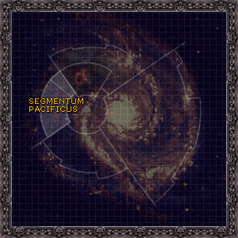

# 0954 太平星域 Segmentum Pacificus

精校状态：中文行文已逐段精校，部分术语仍为暂定

分类：地理 / 真实空间 Real Space / 朦胧星域 Segmentum Obscurus

原文来源：https://www.bilibili.com/opus/1137545160946614272

原作者：帝国神选罐头

原文时间：2025年11月21日 10:56

[返回分类目录](目录.md) · [全书目录](../../目录.md)

<!-- A0954-B0001 -->
**英文原文**

The Segmentum Pacificus is one of the five Segmentums into which Imperial dominion of the Galaxy is divided. Its Segmentum Fortress is located at Hydraphur, ruled by "the Lords of Hydraphur".

<!-- /A0954-B0001 -->

<!-- A0954-B0002 -->

原译文

太平星域是帝国统治银河系的五个星域之一。它的星域堡垒位于海德拉弗，由海德拉弗领主统治。

**校订译文**

太平星域是帝国银河疆域划分出的五大星域之一。其星域堡垒位于海德拉弗，由“海德拉弗诸领主”统治。

<!-- /A0954-B0002 -->

<!-- A0954-B0003 图片 -->

<!-- A0954-B0004 -->

原译文

Galactic map of Segmentum Pacificus 太平星域的银河地图

**校订译文**

Galactic map of Segmentum Pacificus 太平星域的银河地图

<!-- /A0954-B0004 -->

<!-- A0954-B0005 -->
## History 历史

<!-- /A0954-B0005 -->

<!-- A0954-B0006 -->
**英文原文**

During the Nova Terra Interregnum, the whole of Segmentum Pacificus was claimed by the Ur-Council of Nova Terra. Later thousands of worlds in Segmentum Pacificus were claimed by the Imperium in the Macharian Crusade, but many were subsequently lost in the Macharian Heresy.

<!-- /A0954-B0006 -->

<!-- A0954-B0007 -->

原译文

在新泰拉空位期期间，整个太平星域被新泰拉的乌尔议会宣称拥有。后来，在马卡里安远征中，帝国声称拥有太平星域的数千个世界，但随后许多世界在马卡里安叛乱中失落了。

**校订译文**

新泰拉空位期期间，新泰拉的乌尔议会宣称拥有整个太平星域。后来，帝国在马卡里安远征中夺取了太平星域数千颗世界，但其中许多又在随后的马卡里安叛乱中失去。

<!-- /A0954-B0007 -->

<!-- A0954-B0008 -->
**英文原文**

In 999.M41, whole swaths of Segmentum Pacificus would suffer from mass uprisings by disgruntled citizens collectively known as the Night of a Thousand Rebellions. Many outlaying planets as well as key worlds such as Darkhold, Minisotira, and Enceladus are swept up in the chaos. Even the Lions Defiant Chapter of Space Marines find their Homeworld the victim of insurgent activity. Since the uprisings began, communication with much of Segmentum Pacificus has been lost.

<!-- /A0954-B0008 -->

<!-- A0954-B0009 -->

原译文

在999.M41，整个太平星域地区都将遭受不满公民的大规模叛乱，统称为千叛之夜。许多外围行星以及达克霍德、米尼索提拉和恩克拉多斯等关键世界都被卷入了混乱之中。就连星际战士的反抗之狮战团也发现他们的家园世界是叛乱行动的受害者。自叛乱开始以来，与太平星域的大部分地区失去了联系。

**校订译文**

999.M41，太平星域大片地区爆发了由不满现状的居民发动的大规模起义，统称“千叛之夜”。许多边远行星，以及达克霍德、米尼索提拉和恩克拉多斯等重要世界，都卷入动乱。就连反抗之狮星际战士战团的母星也发生了叛乱。动乱爆发后，帝国便与太平星域的大片地区失去联系。

<!-- /A0954-B0009 -->

<!-- A0954-B0010 -->
**英文原文**

In M42, Segmentum Pacificus faced an unprecedented threat when the Tyranid Hive Fleet Leviathan launched a massive new offensive into the region. The Imperium found itself initially unprepared, and Imperial heroes such as Lord Commander Solar Arcadian Leontus and Captain-General Trajann Valoris are rallying forces around Sanctum to resist the xenos tide.

<!-- /A0954-B0010 -->

<!-- A0954-B0011 -->

原译文

在M42，当泰伦虫巢舰队利维坦向该地区发动大规模新攻势时，太阳星域面临着前所未有的威胁。帝国最初发现自己没有做好准备，帝国英雄，如太阳领主指挥官莱昂图斯和禁军元帅图拉真·瓦洛里斯，正在圣地星周围集结部队，抵抗异型的浪潮。

**校订译文**

第42千年，泰伦利维坦虫巢舰队向太平星域发动大规模新攻势，使这里面临前所未有的威胁。帝国起初准备不足，太阳领主指挥官阿卡迪安·雷昂图斯、禁军元帅图拉真·瓦洛瑞斯等英雄正在圣所星周围集结兵力，抵御滚滚而来的异形大军。

**校注：** 英文为 Segmentum Pacificus，原译“太阳星域”错误；恢复太平星域。

<!-- /A0954-B0011 -->

<!-- A0954-B0012 -->
## Notable Planets 著名行星

<!-- /A0954-B0012 -->

<!-- A0954-B0013 -->

原译文

Adrantis Five 阿德兰蒂斯五星

**校订译文**

Adrantis Five 阿德兰提斯五号

<!-- /A0954-B0013 -->

<!-- A0954-B0014 -->

原译文

Atar-Median 阿塔尔-梅迪安

**校订译文**

Atar-Median 阿塔尔中星

<!-- /A0954-B0014 -->

<!-- A0954-B0015 -->

原译文

Colchis 科尔基斯

**校订译文**

Colchis 科尔基斯

<!-- /A0954-B0015 -->

<!-- A0954-B0016 -->

原译文

Macharia 马卡里亚

**校订译文**

Macharia 马卡里亚

<!-- /A0954-B0016 -->

<!-- A0954-B0017 -->

原译文

Mortikah VII 莫提卡七号

**校订译文**

Mortikah VII 莫提卡七号

<!-- /A0954-B0017 -->

<!-- A0954-B0018 -->

原译文

Nova Terra 新泰拉

**校订译文**

Nova Terra 新泰拉

<!-- /A0954-B0018 -->

<!-- A0954-B0019 -->

原译文

Sanctum 圣地星

**校订译文**

Sanctum 圣所星

<!-- /A0954-B0019 -->

<!-- A0954-B0020 -->

原译文

Tanith 坦尼斯

**校订译文**

Tanith 坦尼斯

<!-- /A0954-B0020 -->

<!-- A0954-B0021 -->

原译文

Ultima Macharia 极限马卡里亚

**校订译文**

Ultima Macharia 极限马卡里亚

<!-- /A0954-B0021 -->

<!-- A0954-B0022 -->

原译文

Verghast 维吉哈斯特

**校订译文**

Verghast 维吉哈斯特

<!-- /A0954-B0022 -->

<!-- A0954-B0023 -->

原译文

Xana 夏娜

**校订译文**

Xana 夏娜

<!-- /A0954-B0023 -->

<!-- A0954-B0024 -->
## Notable Other Celestial Objects 著名其他天体

<!-- /A0954-B0024 -->

<!-- A0954-B0025 -->

原译文

Halo Zone 光环区

**校订译文**

Halo Zone 光环区

<!-- /A0954-B0025 -->

<!-- A0954-B0026 -->

原译文

Veiled Region 帷幕地区

**校订译文**

Veiled Region 帷幕地区

<!-- /A0954-B0026 -->

<!-- A0954-B0027 -->

原译文

Seventh Blackstone Fortress 第七黑石堡垒

**校订译文**

Seventh Blackstone Fortress 第七黑石堡垒

<!-- /A0954-B0027 -->

<!-- A0954-B0028 -->

原译文

Precipice 绝壁

**校订译文**

Precipice 绝壁

<!-- /A0954-B0028 -->

<!-- A0954-B0029 -->

原译文

Salient Stars 突出群星

**校订译文**

Salient Stars 突出群星

<!-- /A0954-B0029 -->

<!-- A0954-B0030 -->
## Notable Sectors and Sub-Sectors 著名星区与次星区

原题：Notable Sectors and Sub-Sectors 著名星区与分区

<!-- /A0954-B0030 -->

<!-- A0954-B0031 -->

原译文

Donian Sector 多尼安星区

**校订译文**

Donian Sector 多尼安星区

<!-- /A0954-B0031 -->

<!-- A0954-B0032 -->

原译文

Laanah Rifts 拉纳裂隙

**校订译文**

Laanah Rifts 拉纳裂隙

<!-- /A0954-B0032 -->

<!-- A0954-B0033 -->

原译文

Sabbat Worlds 萨巴特世界群

**校订译文**

Sabbat Worlds 萨巴特诸世界

<!-- /A0954-B0033 -->

<!-- A0954-B0034 -->

原译文

Western Reaches 西部河段

**校订译文**

Western Reaches 西部疆域

<!-- /A0954-B0034 -->

<!-- A0954-B0035 -->

原译文

Bastior Sub-sector 巴斯蒂奥分区

**校订译文**

Bastior Sub-sector 巴斯蒂奥次星区

<!-- /A0954-B0035 -->

<!-- A0954-B0036 -->
## Notable Systems 著名星系

<!-- /A0954-B0036 -->

<!-- A0954-B0037 -->

原译文

Avernia 阿维尼亚

**校订译文**

Avernia 阿维尼亚

<!-- /A0954-B0037 -->

<!-- A0954-B0038 -->

原译文

Formidyre 弗米戴尔

**校订译文**

Formidyre 弗米戴尔

<!-- /A0954-B0038 -->

<!-- A0954-B0039 -->
## Other Segmentums 其他星域

<!-- /A0954-B0039 -->

<!-- A0954-B0040 -->
**英文原文**

Segmentum Solar - Galactic East

<!-- /A0954-B0040 -->

<!-- A0954-B0041 -->

原译文

太阳星域 - 银河东部

**校订译文**

太阳星域 - 银河东部

**校注：** 以下方向是相对于太平星域的位置，原文并非说太阳星域坐落银河最东部。

<!-- /A0954-B0041 -->

<!-- A0954-B0042 -->
**英文原文**

Segmentum Obscurus - Galactic North East

<!-- /A0954-B0042 -->

<!-- A0954-B0043 -->

原译文

朦胧星域 - 银河东北部

**校订译文**

朦胧星域 - 银河东北部

<!-- /A0954-B0043 -->

<!-- A0954-B0044 -->
**英文原文**

Ultima Segmentum - Galactic Far East

<!-- /A0954-B0044 -->

<!-- A0954-B0045 -->

原译文

极限星域 - 银河远东

**校订译文**

极限星域 - 银河远东

<!-- /A0954-B0045 -->

<!-- A0954-B0046 -->
**英文原文**

Segmentum Tempestus - Galactic South East

<!-- /A0954-B0046 -->

<!-- A0954-B0047 -->

原译文

暴风星域 - 银河东南部

**校订译文**

暴风星域 - 银河东南部

<!-- /A0954-B0047 -->

本篇核心术语与暂定项

以下列出本篇出现的英文原形及核心术语表用词。同形词可能指不同对象，具体词义以本篇正文和校注为准；单复数、别名和仅见于图注的名称可能尚未列入。完整候选见[术语表](../../术语表/双语术语候选.csv)。

| 英文 | 采用中文 | 状态 |
| --- | --- | --- |
| Space Marines | 星际战士 | 官方已核对 |
| Imperium | 帝国 | 暂定·简称 |
| Terra | 泰拉 | 暂定·官方待核 |
| Nova Terra Interregnum | 新泰拉空位期 | 暂定·官方待核 |
| Hive Fleet Leviathan | 利维坦虫巢舰队 | 暂定·官方待核 |
| Segmentum Solar | 太阳星域 | 暂定·官方待核 |
| Segmentum Pacificus | 太平星域 | 暂定·官方待核 |
| Segmentum Obscurus | 朦胧星域 | 暂定·官方待核 |
| Segmentum Tempestus | 暴风星域 | 暂定·官方待核 |
| Ultima Segmentum | 极限星域 | 暂定·官方待核 |
| Segmentum | 星域 | 暂定·官方待核 |
| Nova Terra | 新泰拉 | 暂定·官方待核 |
| Hydraphur | 海德拉弗 | 暂定·官方待核 |
| Obscurus | 朦胧星 | 暂定·官方待核 |
| Trajann Valoris | 图拉真·瓦洛瑞斯 | 官方已核对 |
| Captain-General | 禁军元帅 | 暂定·官方待核 |
| Lord Commander | 领主指挥官 | 暂定·官方待核 |
| Chapter | 战团 | 暂定·官方待核 |
| Captain | 连长 | 暂定·官方待核 |
| Lions Defiant | 反抗之狮 | 暂定·官方待核 |
| Dominion | 主天使 | 暂定·官方待核 |
| Xenos | 异形 | 暂定·官方待核 |
| Sanctum | 圣所星 | 暂定·官方待核 |
| Ur-Council | 乌尔议会 | 暂定·官方待核 |
| Segmentum Fortress | 星域堡垒 | 暂定·官方待核 |
| Macharian Crusade | 马卡里安远征 | 暂定·官方待核 |
| Lord Commander Solar | 太阳领主指挥官 | 暂定·官方待核 |
| Macharian Heresy | 马卡里安叛乱 | 暂定·官方待核 |
| Arcadian Leontus | 阿卡迪安·雷昂图斯 | 暂定·官方待核 |
| Night of a Thousand Rebellions | 千叛之夜 | 暂定·官方待核 |

