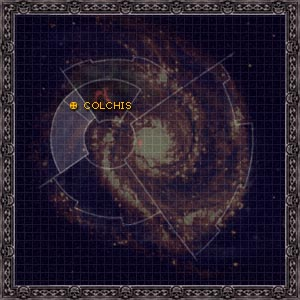
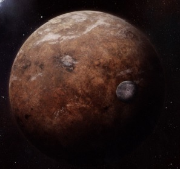

# 0956 科尔基斯 Colchis

精校状态：中文行文已逐段精校，部分术语仍为暂定

分类：地理 / 真实空间 Real Space / 朦胧星域 Segmentum Obscurus

原文来源：https://www.bilibili.com/opus/1102997633750794245

原作者：帝国神选罐头

原文时间：2025年08月20日 08:34

[返回分类目录](目录.md) · [全书目录](../../目录.md)

<!-- A0956-B0001 -->
**英文原文**

Take me from my home, and I will sail to the stars of your empire. I will serve as a son must serve. But let Colchis stand as I have shaped it: a planet of peace and prosperity.

<!-- /A0956-B0001 -->

<!-- A0956-B0002 -->

原译文

带我离开我的家，我将驶向你帝国的群星。我会像儿子一样服务。但让科尔基斯像我塑造的那样屹立不倒：一个和平与繁荣的星球。

**校订译文**

“带我离开故乡，我便驶向您帝国的群星。我将尽一个儿子应尽的职责，侍奉于您。但请让科尔基斯保有我塑造的模样：一个和平而繁荣的世界。”

<!-- /A0956-B0002 -->

<!-- A0956-B0003 -->
**英文原文**

— Attributed to Lorgar and inscribed on the golden plaque on the door leading to the Spiral of the Covenant

<!-- /A0956-B0003 -->

<!-- A0956-B0004 -->

原译文

— 归因于珞珈，并刻在通往圣约螺旋的门上的金色牌匾上

**校订译文**

——据称出自珞珈之口，铭刻于通往圣约螺旋的大门金匾上

<!-- /A0956-B0004 -->

<!-- A0956-B0005 图片 -->

<!-- A0956-B0006 -->

原译文

Map 地图

**校订译文**

Map 地图

<!-- /A0956-B0006 -->

<!-- A0956-B0007 -->
### Basic Data 基本资料

原题：Basic Data 基础信息

<!-- /A0956-B0007 -->

<!-- A0956-B0008 -->
**英文原文**

Name:Colchis

<!-- /A0956-B0008 -->

<!-- A0956-B0009 -->

原译文

名称：科尔基斯

**校订译文**

名称：科尔基斯

<!-- /A0956-B0009 -->

<!-- A0956-B0010 -->
**英文原文**

Segmentum:Segmentum Pacificus

<!-- /A0956-B0010 -->

<!-- A0956-B0011 -->

原译文

星域：太平星域

**校订译文**

星域：太平星域

<!-- /A0956-B0011 -->

<!-- A0956-B0012 -->
**英文原文**

ffiliation:Imperium/None

<!-- /A0956-B0012 -->

<!-- A0956-B0013 -->

原译文

隶属：帝国/无

**校订译文**

隶属：帝国/无

<!-- /A0956-B0013 -->

<!-- A0956-B0014 -->
**英文原文**

Class:Dead World, Destroyed 035.M31

<!-- /A0956-B0014 -->

<!-- A0956-B0015 -->

原译文

级别：死亡世界，035.M31被毁

**校订译文**

类别：死寂世界，于035.M31毁灭

<!-- /A0956-B0015 -->

<!-- A0956-B0016 图片 -->

<!-- A0956-B0017 -->

原译文

Planetary Image 行星图片

**校订译文**

Planetary Image 行星图片

<!-- /A0956-B0017 -->

<!-- A0956-B0018 -->
**英文原文**

Colchis was the original homeworld of the Word Bearers Space Marine Legion. After the Horus Heresy, it was bombed into submission from orbit, and because of its unique geological makeup, the entire planet fractured and exploded. The planet's location is a secret guarded by the Inquisition.

<!-- /A0956-B0018 -->

<!-- A0956-B0019 -->

原译文

科尔基斯是怀言者星际战士的最初家园世界。在荷鲁斯叛乱之后，它被从轨道上轰炸屈服，由于其独特的地质构造，整个行星断裂并爆炸。这个行星的位置是审判庭保守的秘密。

**校订译文**

科尔基斯曾是怀言者星际战士军团最初的母星。荷鲁斯之乱后，它在轨道轰炸下被迫屈服，又因独特的地质构造而整体碎裂、爆炸。其所在位置成为审判庭严守的秘密。

<!-- /A0956-B0019 -->

<!-- A0956-B0020 -->
## Geography 地理

<!-- /A0956-B0020 -->

<!-- A0956-B0021 -->
**英文原文**

Colchis was a massive world, three times larger than Terra. It took 4.8 Terran years to orbit its sun and 170.4 Terran hours to rotate once around its axis, giving it an extended day-night cycle to which humans could not adapt; thus, the Colchisian civilizations developed a unique method for keeping track of time. With this extended solar day, time was broken up into seven sub-days, known as Dawnaway, Mornday, Long Noon, Post-noon, Duskeve, Coldfall, and High Night. These sub-days are further divided into three segments (wake-rise, wake-main, and rest-eve) to correlate more closely with a Terran day. The hottest time of day on Colchis is wake-main of Long Noon, and the coldest is rest-eve of High Night.

<!-- /A0956-B0021 -->

<!-- A0956-B0022 -->

原译文

科尔基斯是一个巨大的世界，比泰拉大三倍。绕太阳一周需要4.8泰拉年，绕其轴线旋转一周需要170.4泰拉时，这使其昼夜周期延长，人类无法适应；因此，科尔基斯文明发展了一种独特的时间追踪方法。随着太阳日的延长，时间被划分为七个子日，分别是拂远、上午、长午、午后、昏前、冷落和至夜。这些子日进一步分为三个部分（醒起、醒主和休前），以便与泰拉日更紧密地相关。科尔基斯一天中最热的时间是长午的醒起时间，最冷的时间是至夜的休前。

**校订译文**

科尔基斯体型庞大，约为泰拉的三倍。它绕恒星公转一周需4.8个泰拉年，自转一周则需170.4个泰拉小时。如此漫长的昼夜周期令人类难以适应，因此当地文明发展出独特的计时方式：将一个太阳日分为七个子日，依次称为拂远、上午、长午、午后、昏前、冷落和至夜。每个子日又分为醒起、醒主和休前三个时段，以便更贴近泰拉人的日常作息。一日中最热的是长午的醒主时段，最冷的是至夜的休前时段。

**校注：** seven sub-days 与170.4小时保留原数值；最热时段原文为 wake-main，原译误作 wake-rise，已改回醒主。three times larger 按上下文约三倍表达，不据歧义增算为四倍。

<!-- /A0956-B0022 -->

<!-- A0956-B0023 -->
**英文原文**

Mountains and deserts dominated the dry land of Colchis and civilisation clustered along coastlines, relying on water and air travel between settlements. Its capital city-state was Vharadesh, the City of Grey Flowers.

<!-- /A0956-B0023 -->

<!-- A0956-B0024 -->

原译文

科尔基斯的旱地以山脉和沙漠为主，文明沿着海岸线聚集，依靠定居点之间的水上和空中旅行。它的首都是维拉德什，灰花之城。

**校订译文**

科尔基斯陆地多为山脉与沙漠，聚落集中在海岸，彼此依靠水路和空中交通往来。首都城邦为维拉德什，亦称灰花之城。

<!-- /A0956-B0024 -->

<!-- A0956-B0025 -->
**英文原文**

Life on Colchis was often harsh outside of the cities which were all controlled by a religious institution known as the Covenant. Slavery was rife, and desert nomads who dwelt outside of these cities were dubbed the Declined and seen as damned by the Great Powers.

<!-- /A0956-B0025 -->

<!-- A0956-B0026 -->

原译文

科尔基斯的生活在城市之外往往很艰难，这些城市都由一个被称为圣约的宗教机构控制。奴隶制盛行，居住在这些城市以外的沙漠游牧民族被称为衰落者，被列强视为诅咒。

**校订译文**

科尔基斯的城市全部由名为“圣约”的宗教组织控制，而城外的生活通常十分艰苦。奴隶制盛行，住在城外的沙漠游牧民被称为“衰落者”，被视为遭到至高诸神诅咒的人。

**校注：** Great Powers 此处为科尔基斯宗教中的神明，不是地缘政治“列强”；被诅咒的对象是游牧民。

<!-- /A0956-B0026 -->

<!-- A0956-B0027 -->
## History 历史

<!-- /A0956-B0027 -->

<!-- A0956-B0028 -->
**英文原文**

It was originally a technologically advanced world but it regressed to a feudal state, prior to the arrival of Lorgar. Ancient ruins dotted the landscape and derelict starships littered its orbit. At the time of Lorgar's arrival the planet was dominated by the Covenant of Colchis. After being raised by Kor Phaeron, Lorgar was able to lead a rebellion that overthrow the Covenant and conquered the planet.

<!-- /A0956-B0028 -->

<!-- A0956-B0029 -->

原译文

它最初是一个技术先进的世界，但在珞珈到来之前，它倒退到回了封建国家。古老的废墟点缀着这片土地，废弃的星际飞船散落在它的轨道上。在珞珈到达时，这颗行星被科尔基斯圣约所统治。在科尔·法伦的抚养下，珞珈能够领导一场推翻圣约并征服行星的叛乱。

**校订译文**

科尔基斯原本技术发达，但在珞珈到来前已经退化为封建社会。地表散布古老遗迹，轨道上漂浮着废弃星舰。珞珈降临时，星球由科尔基斯圣约统治。科尔·法伦将他抚养成人，后来珞珈领导叛乱，推翻圣约并征服了整个星球。

<!-- /A0956-B0029 -->

<!-- A0956-B0030 -->
**英文原文**

After his discovery by the Emperor, Lorgar brought the planet into the Imperium, granting it access to advanced technology and society. Under Lorgar's brief rule the planet prospered but when the Emperor took Lorgar away, the planet plummeted back to a feudal state. Imperial traffic avoided Colchis not only for its lack of orbital infrastructure but also due to rumours that the area was unreliable after the disappearance of the 2,188th Expeditionary Fleet.

<!-- /A0956-B0030 -->

<!-- A0956-B0031 -->

原译文

在被帝皇发现后，珞珈将这颗行星带入了帝国，使其能够接触到先进的技术和社会。在珞珈的短暂统治下，这个行星繁荣起来，但当帝皇把珞珈带走时，这个行星又回到了封建国家。帝国交通避开科尔基斯不仅是因为其缺乏轨道基础设施，还因为有传言称该地区在第2188远征舰队消失后不可靠。

**校订译文**

帝皇找到珞珈后，他将科尔基斯带入帝国，使当地得以接触先进技术和社会制度。在珞珈短暂的统治期间，星球欣欣向荣；然而帝皇带走他后，这里又迅速退回封建社会。帝国舰船通常避开科尔基斯，既因为这里缺乏轨道设施，也因为第2188远征舰队失踪后，传言称这一带并不安全。

<!-- /A0956-B0031 -->

<!-- A0956-B0032 -->
**英文原文**

Beginning in 010.M31, Colchis faced several Imperial assaults during the Bitter War campaign of the Horus Heresy. When the Ultramarines returned to Colchis to purge it after the Horus Heresy they found a collapsed world. All of the industries were destroyed and people barely clung on to life. The Inquisition ordered the cleansing by the use of cyclonic torpedoes, disrupting Colchis's delicate geological structure, and thereby triggering a catastrophic explosion that annihilated the planet. At the time the Mark of Calth had reached 219,479.25.03 (approximately 25 years).

<!-- /A0956-B0032 -->

<!-- A0956-B0033 -->

原译文

从010.M31开始，科尔基斯在荷鲁斯叛乱的苦战战役中面临了几次帝国的袭击。当极限战士在荷鲁斯叛乱之后回到科尔基斯进行清洗时，他们发现了一个崩溃的世界。所有的工业都被摧毁了，人们几乎无法生存。审判庭下令使用旋风鱼雷进行清理，破坏了科尔基斯的微妙地质结构，从而引发了毁灭行星的灾难性爆炸。当时，考斯的标记已经达到219,479.25.03（大约25年）。

**校订译文**

从010.M31起，科尔基斯在荷鲁斯之乱的苦难战争中遭受多次帝国进攻。战后极限战士重返此地执行净化时，所见已是一个全面崩溃的世界：工业尽数毁坏，居民挣扎求生。审判庭下令使用旋风鱼雷清洗星球，结果破坏了科尔基斯脆弱的地质结构，引发灾难性爆炸，将整颗行星彻底毁灭。此时，考斯战事计时已达到219,479.25.03，约合二十五年。

<!-- /A0956-B0033 -->

<!-- A0956-B0034 -->
## Other Planetary Information 其他行星信息

<!-- /A0956-B0034 -->

<!-- A0956-B0035 -->
**英文原文**

Prior to its destruction, Colchis had 19 recorded natural satellites.

<!-- /A0956-B0035 -->

<!-- A0956-B0036 -->

原译文

在被摧毁之前，科尔基斯有19颗记录在案的天然卫星。

**校订译文**

在被摧毁之前，科尔基斯有19颗记录在案的天然卫星。

<!-- /A0956-B0036 -->

<!-- A0956-B0037 -->
**英文原文**

The Colchisian Torquatii Solar Auxilia Regiments were mustered from Colchis.

<!-- /A0956-B0037 -->

<!-- A0956-B0038 -->

原译文

科尔基斯戴环者太阳辅助军是从科尔基斯召集起来的。

**校订译文**

科尔基斯戴环者太阳辅助军诸团的兵员，征自科尔基斯。

<!-- /A0956-B0038 -->

本篇核心术语与暂定项

以下列出本篇出现的英文原形及核心术语表用词。同形词可能指不同对象，具体词义以本篇正文和校注为准；单复数、别名和仅见于图注的名称可能尚未列入。完整候选见[术语表](../../术语表/双语术语候选.csv)。

| 英文 | 采用中文 | 状态 |
| --- | --- | --- |
| Ultramarines | 极限战士 | 官方已核对 |
| Horus Heresy | 荷鲁斯之乱 | 官方已核对 |
| Inquisition | 审判庭 | 暂定 |
| Imperium | 帝国 | 暂定·简称 |
| Emperor | 帝皇 | 官方已核对 |
| Slavery | 奴隶制 | 编辑用语已统一 |
| Word Bearers | 怀言者 | 暂定·官方待核 |
| Terra | 泰拉 | 暂定·官方待核 |
| Horus | 荷鲁斯 | 暂定·官方待核 |
| Solar Auxilia | 太阳辅助军 | 暂定·官方待核 |
| Segmentum Pacificus | 太平星域 | 暂定·官方待核 |
| Segmentum | 星域 | 暂定·官方待核 |
| Calth | 考斯 | 暂定·官方待核 |
| Ancient | 旗手 | 官方已核对 |
| Space Marine Legion | 星际战士军团 | 暂定·官方待核 |
| Kor Phaeron | 科尔·法伦 | 暂定·官方待核 |
| Space Marine | 星际战士 | 暂定·官方待核 |
| Lorgar | 珞珈 | 暂定·官方待核 |
| Colchis | 科尔基斯 | 暂定·官方待核 |
| Bitter War | 苦难战争 | 暂定·官方待核 |
| Powers | 能天使 | 暂定·官方待核 |
| Phaeron | 法皇 | 暂定·官方待核 |
| The Mark of Calth | 考斯战事计时 | 暂定·官方待核 |
| The Declined | 衰落者 | 暂定·官方待核 |
| Vharadesh | 维拉德什 | 暂定·官方待核 |
| Dead World | 死寂世界 | 暂定·官方待核 |
| Spiral of the Covenant | 圣约螺旋 | 暂定·官方待核 |
| Colchisian Torquatii | 科尔基斯戴环者 | 暂定·官方待核 |

