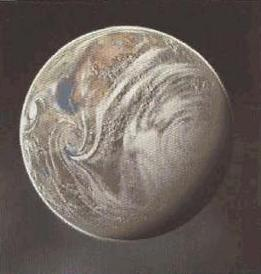

# 0957 哈拉孔 Harakon

精校状态：中文行文已逐段精校，部分术语仍为暂定

分类：地理 / 真实空间 Real Space / 朦胧星域 Segmentum Obscurus

原文来源：https://www.bilibili.com/opus/1155718352952360969

原作者：帝国神选罐头

原文时间：2026年01月09日 10:17

[返回分类目录](目录.md) · [全书目录](../../目录.md)

<!-- A0957-B0001 -->
### Basic Data 基本资料

原题：Basic Data 基础信息

<!-- /A0957-B0001 -->

<!-- A0957-B0002 -->
**英文原文**

Name:Harakon

<!-- /A0957-B0002 -->

<!-- A0957-B0003 -->

原译文

名称：哈拉孔

**校订译文**

名称：哈拉孔

<!-- /A0957-B0003 -->

<!-- A0957-B0004 -->
**英文原文**

Affiliation:Imperiu

<!-- /A0957-B0004 -->

<!-- A0957-B0005 -->

原译文

隶属：帝国

**校订译文**

隶属：帝国

<!-- /A0957-B0005 -->

<!-- A0957-B0006 -->
**英文原文**

Class:Hive World

<!-- /A0957-B0006 -->

<!-- A0957-B0007 -->

原译文

类别：巢都世界

**校订译文**

类别：巢都世界

<!-- /A0957-B0007 -->

<!-- A0957-B0008 图片 -->

<!-- A0957-B0009 -->

原译文

Planetary Image 行星图像

**校订译文**

Planetary Image 行星图像

<!-- /A0957-B0009 -->

<!-- A0957-B0010 -->
**英文原文**

Harakon is a low gravity Hive World in which the hive spires reach high into the upper atmosphere.

<!-- /A0957-B0010 -->

<!-- A0957-B0011 -->

原译文

哈拉孔是一个低重力的巢都世界，巢都尖塔高达高层大气。

**校订译文**

哈拉孔是一颗重力较低的巢都世界，巢都尖塔直耸高层大气。

<!-- /A0957-B0011 -->

<!-- A0957-B0012 -->
**英文原文**

The population of Harakon is high and as such they produce large numbers of Imperial Guard Regiments, the Harakoni Warhawks. Below the spires are mountain passes in which the Harakonis use grav-gliders to hunt the native Vapourwyrms.

<!-- /A0957-B0012 -->

<!-- A0957-B0013 -->

原译文

哈拉孔的人口众多，因此他们产生了大量的帝国卫队，即哈拉考尼战鹰。尖塔下方是山口，哈拉孔人在山口中使用重力滑翔机狩猎当地的雾龙。

**校订译文**

哈拉孔人口众多，为帝国卫队组建了大批军团，统称哈拉考尼战鹰。尖塔下方是群山间的隘道，当地人驾着重力滑翔机，在其中猎捕本土生物雾龙。

<!-- /A0957-B0013 -->

<!-- A0957-B0014 -->
**英文原文**

The dominant dialect on Harakon is Konndar.

<!-- /A0957-B0014 -->

<!-- A0957-B0015 -->

原译文

哈拉孔的主要方言是康达尔。

**校订译文**

哈拉孔的主要方言是康达尔。

<!-- /A0957-B0015 -->

本篇核心术语与暂定项

以下列出本篇出现的英文原形及核心术语表用词。同形词可能指不同对象，具体词义以本篇正文和校注为准；单复数、别名和仅见于图注的名称可能尚未列入。完整候选见[术语表](../../术语表/双语术语候选.csv)。

| 英文 | 采用中文 | 状态 |
| --- | --- | --- |
| Imperial Guard | 帝国卫队 | 暂定·语境区分 |
| Hive World | 巢都世界 | 暂定·官方待核 |
| Harakon | 哈拉考 | 暂定·官方待核 |
| Warhawks | 战鹰 | 暂定·官方待核 |
| Vapourwyrms | 雾龙 | 暂定·官方待核 |
| Konndar | 康达尔 | 暂定·官方待核 |

