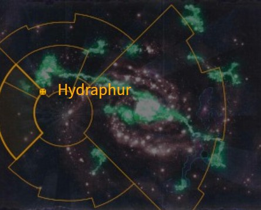

# 0958 海德拉弗 Hydraphur

精校状态：中文行文已逐段精校，部分术语仍为暂定

分类：地理 / 真实空间 Real Space / 朦胧星域 Segmentum Obscurus

原文来源：https://www.bilibili.com/opus/1167665899750031431

原作者：帝国神选罐头

原文时间：2026年02月10日 15:00

[返回分类目录](目录.md) · [全书目录](../../目录.md)

<!-- A0958-B0001 图片 -->

<!-- A0958-B0002 -->

原译文

Map 地图

**校订译文**

Map 地图

<!-- /A0958-B0002 -->

<!-- A0958-B0003 -->
### Basic Data 基本资料

原题：Basic Data 基础数据

<!-- /A0958-B0003 -->

<!-- A0958-B0004 -->
**英文原文**

Name:Hydraphur

<!-- /A0958-B0004 -->

<!-- A0958-B0005 -->

原译文

名称：海德拉弗

**校订译文**

名称：海德拉弗

<!-- /A0958-B0005 -->

<!-- A0958-B0006 -->
**英文原文**

Segmentum:Segmentum Pacificus

<!-- /A0958-B0006 -->

<!-- A0958-B0007 -->

原译文

星域：太平星域

**校订译文**

星域：太平星域

<!-- /A0958-B0007 -->

<!-- A0958-B0008 -->
**英文原文**

Affiliation:Imperium

<!-- /A0958-B0008 -->

<!-- A0958-B0009 -->

原译文

隶属：帝国

**校订译文**

隶属：帝国

<!-- /A0958-B0009 -->

<!-- A0958-B0010 -->
**英文原文**

Class:Forge World, Segmentum Fortress

<!-- /A0958-B0010 -->

<!-- A0958-B0011 -->

原译文

类别：铸造世界，星域堡垒

**校订译文**

类别：铸造世界，星域堡垒

<!-- /A0958-B0011 -->

<!-- A0958-B0012 -->
**英文原文**

Hydraphur is a Forge World as well as the administrative and fleet capital of Segmentum Pacificus.

<!-- /A0958-B0012 -->

<!-- A0958-B0013 -->

原译文

海德拉弗是一个铸造世界，也是太平星域的行政和舰队首都。

**校订译文**

海德拉弗是一颗铸造世界，也是太平星域的行政首府与舰队总部所在地。

<!-- /A0958-B0013 -->

<!-- A0958-B0014 -->
## Overview 概述

<!-- /A0958-B0014 -->

<!-- A0958-B0015 -->
**英文原文**

Orbiting Hydraphur is the massive Star Fort Ascendant as well as massive shipyards which ring the world. These artificial rings, while not as large as those on Luna or Mars, serve as the fleet base for Segmentum Pacificus. However the world itself is divided into several spheres of influence. The Imperial Navy holds sway in the atmosphere and above, while on the surface the Ecclesiarchy rules in uneasy conjunction with the Adeptus Mechanicus.

<!-- /A0958-B0015 -->

<!-- A0958-B0016 -->

原译文

绕海德拉弗轨道运行的是巨大的星堡上升号以及环绕世界的大型造船厂。这些人造环虽然不如月球或火星上的环大，但它们是太平星域的舰队基地。然而，世界本身被划分为几个势力范围。帝国海军在大气层和上层占据主导地位，而从地表上看，国教与机械神教的关系并不融洽。

**校订译文**

海德拉弗轨道上有庞大的升腾星堡，以及环绕星球的巨型造船厂。这些人造环虽然不及月球或火星的环形设施庞大，却承担着太平星域舰队基地的职能。星球本身分属数方势力：帝国海军掌控大气层及其上方空间，地表则由国教和机械修会在紧张的合作关系中共同统治。

<!-- /A0958-B0016 -->

<!-- A0958-B0017 -->
## History 历史

<!-- /A0958-B0017 -->

<!-- A0958-B0018 -->
**英文原文**

During the Plague of Unbelief, Hydraphur surrendered to the rebel forces of Cardinal Bucharis, to the lasting shame of its subsequent generations. After Hydraphur's return to the fold of the Imperium, Cardinal Chye Balronas instituted an annual religious festival characterized by fasting and penitent observance. Another legacy of the Plague was the Administratum's attempt to curtail the power of the Imperial Navy in the system. Although the Hydraphur system was a centre of Fleet operations, the administrative presence of the Ecclesiarchy and the Inquisition were increased, while the landholding Naval families on Hydraphur were gradually relieved of their possessions. However, the success of the partition was mixed: although the primary authorities on Hydraphur itself are the Administratum and the Ecclesiarchy, the Navy responded by tightening its control over the rest of the system and subsector, to the point where the Ecclesiarchy on Hydraphur found it necessary to use covert couriers to communicate with its fellows in other systems. The Navy also formed close ties with the mercantile families on Hydraphur, such that their syndicate ties were regarded as family associations. Due to the strife on Hydraphur during the Age of Apostasy, the world was ultimately divided between the Navy, Ecclesiarchy, and Mechanicum thanks to reforms overseen by Balronas.

<!-- /A0958-B0018 -->

<!-- A0958-B0019 -->

原译文

在无信瘟疫期间，海德拉弗向红衣主教布查里斯的叛军投降，给后世带来了持久的耻辱。海德拉弗回归帝国后，红衣主教蔡·巴尔罗纳斯设立了一个以禁食和忏悔为特征的年度宗教节日。瘟疫的另一个遗留问题是内务部试图削弱帝国海军在该星系中的力量。尽管海德拉弗星系是舰队行动的中心，但国教和审判庭的行政存在有所增加，而海德拉弗的海军家族则逐渐失去了他们的财产。然而，分治的成功喜忧参半：尽管海德拉弗的主要当局是内务部和国教，但海军的回应是加强了对星系其他部分和分区的控制，以至于海德拉弗的国教发现有必要使用秘密信使与其他星系中的同伴进行沟通。海军还与海德拉弗的商业家族建立了密切的联系，因此他们的企业联盟关系被视为家族联盟。由于叛教时代海德拉弗的冲突，由于巴尔罗纳斯监督的改革，世界最终分裂为海军、国教和机械教。

**校订译文**

无信瘟疫期间，海德拉弗向红衣主教布查里斯的叛军投降，令后世几代人蒙羞。星球重归帝国后，红衣主教蔡·巴尔罗纳斯设立了以斋戒和忏悔仪式为核心的年度宗教节庆。此事的另一个后果，是内政部试图削弱帝国海军在该星系的权力。海德拉弗星系虽是舰队行动中枢，国教与审判庭的行政力量仍被加强，拥有当地地产的海军家族则逐步失去财产。不过，分权改革的成效好坏参半：海德拉弗本土虽由内政部与国教主导，海军却反过来收紧了对星系其他地区及整个次星区的控制，甚至迫使当地国教必须派遣秘密信使，才能与其他星系的同僚通讯。海军还与当地商人家族建立密切关系，双方商业联盟的纽带几乎被视为家族关系。叛教时代的冲突过后，在巴尔罗纳斯主持的改革下，海德拉弗最终由海军、国教和机械教分掌。

**校注：** 同篇前段用 Adeptus Mechanicus，此历史段末尾却用 Mechanicum；分别保留机械修会／机械教，并标原文名称跨时代使用疑点，不暗改英文。

<!-- /A0958-B0019 -->

<!-- A0958-B0020 -->
**英文原文**

Sometime after the Great Rift's creation, Hydraphur was invaded by the Black Legion and the Imperium sent its forces to defend the world. However, the Black Legion advanced in great numbers, which forced the defenders to retreat - save for the Adeptus Custodes. No matter how many times the Black Legion charged the Custodes, they have stood firm and have broken the traitors' advance against their Auramite wall. By the early days of the Indomitus Crusade it had been assailed 3 times by the forces of Chaos.

<!-- /A0958-B0020 -->

<!-- A0958-B0021 -->

原译文

大裂隙形成后的某个时候，海德拉弗被黑色军团入侵，帝国派军队保卫世界。然而，黑色军团大量前进，迫使守军撤退 - 除了禁军。无论黑色军团对禁军发起多少次冲锋，他们都坚定不移，打破了叛徒对他们的耀金之墙的进攻。在不屈远征的早期，它已经被混沌部队袭击了三次。

**校订译文**

大裂隙形成后，黑色军团入侵海德拉弗，帝国派兵保卫星球。然而，黑色军团凭借庞大兵力持续推进，迫使除禁军之外的守军后撤。无论敌人发动多少次冲锋，禁军都岿然不动，以耀金铸成的防线击碎叛徒攻势。到不屈远征初期，海德拉弗已遭混沌军队进攻三次。

<!-- /A0958-B0021 -->

本篇核心术语与暂定项

以下列出本篇出现的英文原形及核心术语表用词。同形词可能指不同对象，具体词义以本篇正文和校注为准；单复数、别名和仅见于图注的名称可能尚未列入。完整候选见[术语表](../../术语表/双语术语候选.csv)。

| 英文 | 采用中文 | 状态 |
| --- | --- | --- |
| Adeptus Custodes | 帝皇禁军 | 官方已核对 |
| Adeptus Mechanicus | 机械修会 | 官方已核对 |
| Great Rift | 大裂隙 | 官方已核对 |
| Inquisition | 审判庭 | 暂定 |
| Imperium | 帝国 | 暂定·简称 |
| Imperial Navy | 帝国海军 | 暂定 |
| Mechanicum | 机械教 | 暂定·历史称谓 |
| Indomitus | 不屈学派 | 暂定·学派语境 |
| Administratum | 内政部 | 暂定 |
| Ecclesiarchy | 国教会 | 暂定 |
| Forge World | 铸造世界 | 暂定·官方待核 |
| Age of Apostasy | 叛教时代 | 暂定·官方待核 |
| Black Legion | 黑色军团 | 暂定·官方待核 |
| Indomitus Crusade | 不屈远征 | 暂定·官方待核 |
| Segmentum Pacificus | 太平星域 | 暂定·官方待核 |
| Segmentum | 星域 | 暂定·官方待核 |
| Subsector | 次星区 | 暂定·官方待核 |
| Mars | 火星 | 暂定·官方待核 |
| Hydraphur | 海德拉弗 | 暂定·官方待核 |
| Luna | 月球 | 暂定·官方待核 |
| Cardinal | 红衣主教 | 暂定 |
| Penitent | 忏悔 | 暂定·官方待核 |
| Segmentum Fortress | 星域堡垒 | 暂定·官方待核 |
| System | 星系（恒星系统） | 暂定·官方待核 |
| Plague of Unbelief | 无信瘟疫 | 暂定·官方待核 |
| Bucharis | 布查里斯 | 暂定·官方待核 |
| Ascendant | 升腾星堡 | 暂定·官方待核 |
| Chye Balronas | 蔡·巴尔罗纳斯 | 暂定·官方待核 |

