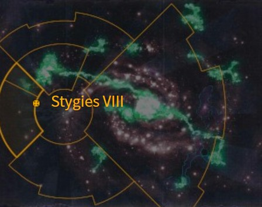
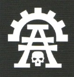
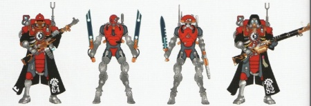
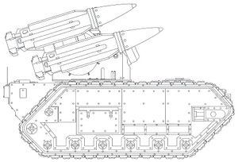
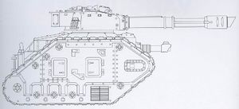
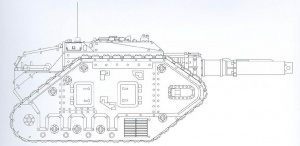
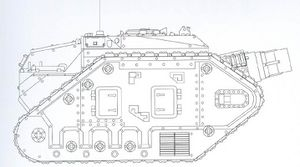
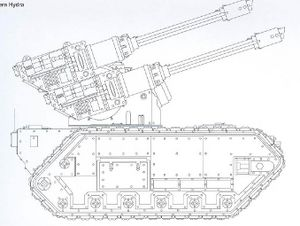

# 0962 黄泉八号 Stygies VIII

精校状态：中文行文已逐段精校，部分术语仍为暂定

分类：地理 / 真实空间 Real Space / 朦胧星域 Segmentum Obscurus

原文来源：https://www.bilibili.com/opus/1160518133524463640

原作者：帝国神选罐头

原文时间：2026年01月22日 08:43

[返回分类目录](目录.md) · [全书目录](../../目录.md)

<!-- A0962-B0001 图片 -->

<!-- A0962-B0002 -->

原译文

Map 地图

**校订译文**

Map 地图

<!-- /A0962-B0002 -->

<!-- A0962-B0003 -->
### Basic Data 基本资料

原题：Basic Data 基础数据

<!-- /A0962-B0003 -->

<!-- A0962-B0004 -->
**英文原文**

Name:Stygies VIII

<!-- /A0962-B0004 -->

<!-- A0962-B0005 -->

原译文

名称：黄泉八号

**校订译文**

名称：黄泉八号

<!-- /A0962-B0005 -->

<!-- A0962-B0006 -->
**英文原文**

Segmentum:Segmentum Pacificus

<!-- /A0962-B0006 -->

<!-- A0962-B0007 -->

原译文

星域：太平星域

**校订译文**

星域：太平星域

<!-- /A0962-B0007 -->

<!-- A0962-B0008 -->
**英文原文**

System:Vulcanis system

<!-- /A0962-B0008 -->

<!-- A0962-B0009 -->

原译文

星系：火神星系

**校订译文**

星系：火神星系

<!-- /A0962-B0009 -->

<!-- A0962-B0010 -->
**英文原文**

Affiliation:Imperium

<!-- /A0962-B0010 -->

<!-- A0962-B0011 -->

原译文

隶属：帝国

**校订译文**

隶属：帝国

<!-- /A0962-B0011 -->

<!-- A0962-B0012 -->
**英文原文**

Class:Forge World

<!-- /A0962-B0012 -->

<!-- A0962-B0013 -->

原译文

类别：铸造世界

**校订译文**

类别：铸造世界

<!-- /A0962-B0013 -->

<!-- A0962-B0014 -->
**英文原文**

Tithe Grade:Aptus Non

<!-- /A0962-B0014 -->

<!-- A0962-B0015 -->

原译文

什一税等级：特级免税

**校订译文**

什一税等级：特级免税

<!-- /A0962-B0015 -->

<!-- A0962-B0016 -->
**英文原文**

Stygies VIII is a large Forge Moon which orbits a massive ringed gas giant in the binary star system of Vulcanis.

<!-- /A0962-B0016 -->

<!-- A0962-B0017 -->

原译文

黄泉八号是一个巨大的铸造卫星，它围绕着火神双星星系中的一颗巨大的环状气态巨星运行。

**校订译文**

黄泉八号是一颗大型铸造卫星，绕火神双恒星系统内一颗带有星环的巨大气态行星运行。

<!-- /A0962-B0017 -->

<!-- A0962-B0018 图片 -->

<!-- A0962-B0019 -->

原译文

Stygies VIII's Symbol 黄泉八号标志

**校订译文**

Stygies VIII's Symbol 黄泉八号标志

<!-- /A0962-B0019 -->

<!-- A0962-B0020 -->
## Overview 概述

<!-- /A0962-B0020 -->

<!-- A0962-B0021 -->
**英文原文**

Stygies VIII is the 8th moon orbiting the gas giant Vulcanis. It is a trove of Xenos technology, and their ruling Tech-Priests use diversionary actions and binharic sub-codes to conceal their forbidden treasure trove from the wider Imperium. The current Fabricator General of Stygies VIII is Sigma 3-Soth.

<!-- /A0962-B0021 -->

<!-- A0962-B0022 -->

原译文

黄泉八号是围绕气态巨星火神星运行的第八颗卫星。这是一个异型技术的宝库，他们的统治技术神甫使用转移注意力的行动和二进制子码来向更广泛的帝国隐藏他们被禁止的宝藏。黄泉八号的现任铸造将军是西格玛3-索斯。

**校订译文**

黄泉八号是气态巨行星火神星的第八颗卫星，也是异形技术的宝库。统治这里的技术祭司通过声东击西的行动与二进制语子代码，向帝国其他势力隐瞒禁忌收藏。目前，黄泉八号的铸造将军为西格玛3-索斯。

<!-- /A0962-B0022 -->

<!-- A0962-B0023 -->
**英文原文**

It is home to the best munitions artisans and one of the few worlds which produces Leman Russ Vanquishers. It was once home to the Legio Vulcanum I and II, but they turned traitor and now houses the Legio Honorum. Of all Forge Worlds, Stygies VIII produces the best gun barrels and recoil dampeners, and the finest quality propellant chemicals.

<!-- /A0962-B0023 -->

<!-- A0962-B0024 -->

原译文

它是最好的军火工匠的家园，也是少数几个生产黎曼鲁斯胜利者的世界之一。这里曾经是火神一号和二号军团的家园，但他们变成了叛徒，现在是荣誉军团的所在地。在所有铸造世界中，黄泉八号生产最好的枪管和后坐力阻尼器，以及最优质的推进剂化学品。

**校订译文**

黄泉八号拥有顶尖的军火工匠，也是少数能够生产黎曼鲁斯胜利者坦克的世界之一。火神一号与火神二号军团曾驻扎于此，但二者后来叛变，如今这里驻扎的是荣誉军团。在所有铸造世界中，黄泉八号出产的枪炮管、后坐力缓冲器和发射药品质最为出众。

<!-- /A0962-B0024 -->

<!-- A0962-B0025 -->
## History 历史

<!-- /A0962-B0025 -->

<!-- A0962-B0026 -->
**英文原文**

Stygies almost fell to rebel forces during the Horus Heresy — it was only saved by the intervention of Eldar forces. This event led to Stygies becoming the home of a secret sect known as the Xenarites, who are dedicated to the study and exploitation of Xenos technology, a policy which most Tech-Priests find offensive. Well aware of the antipathy their colleagues have of their sect, the Xenarites pursue a policy of covert study, but still send out expeditions to find more technology. It is not unusual, however, for the Xenarites' expeditions to come under attack from Xenos populations and even other Imperial forces. These occurrences of interservice conflicts are regrettable to the Xenarites, but have only served to drive them deeper underground.

<!-- /A0962-B0026 -->

<!-- A0962-B0027 -->

原译文

在荷鲁斯叛乱期间，黄泉几乎被叛军攻陷 — 只有灵族军队的干预才能挽救它。这一事件导致黄泉成为一个名为异务派的秘密教派的所在地，他们致力于研究和利用异型技术，这一方针被大多数技术神甫认为是冒犯的。异务派很清楚他们的同事对他们教派的反感，他们奉行秘密研究的方针，但仍然派出探险队寻找更多的技术。然而，异务派的探险队受到异型族群甚至其他帝国军队的攻击并不罕见。这些军种间冲突的发生让异务派感到遗憾，但只会让他们潜入更深的地下。

**校订译文**

荷鲁斯之乱期间，黄泉八号险些被叛军攻陷，幸因灵族军队介入才得以幸存。此事促成了一个秘密教派在当地扎根，称为异技派。该派致力于研究、利用异形技术，这在多数技术祭司眼中是不可接受的。异技派深知同僚的敌意，因此秘密开展研究，却仍不断派出考察队寻找更多技术。这些队伍遭到异形族群、甚至其他帝国军队攻击，并不罕见。异技派对帝国内部的此类武装冲突感到遗憾，但结果只是让他们藏得更深。

<!-- /A0962-B0027 -->

<!-- A0962-B0028 图片 -->

<!-- A0962-B0029 -->

原译文

Stygies VIII Skitarii 黄泉八号护教军

**校订译文**

Stygies VIII Skitarii 黄泉八号护教军

<!-- /A0962-B0029 -->

<!-- A0962-B0030 -->
**英文原文**

Because of this, the Forge World has developed an infamous and suspicious reputation in the Imperium, though the High Lords of Terra have ruled that Stygies VIII is too vital to interfere with. The Ordo Xenos felt differently, however, and in M36 a dozen Deathwatch Kill-Teams launched a devastating invasion of the Forge World. Stygies VIII was forced to employ radical measures to survive the Deathwatch's attempted purge, and in the aftermath its Tech-Priests grew fearful of the growing record of violations against them. In order to rectify this, they launched a series of stealth attacks, using viral programming, machine canticles, and infiltration methods to destroy or alter the Adeptus Administratum documents and even the datastacks of the Inquisition that contain information about Stygies VIII. Self-perpetuating programs ensure the obfuscation is continuous, but nonetheless a secret war has still unfolded on Stygies VIII between the Deathwatch and radical Tech-Priests. Some of these radicals have fled to Vulcanis III where they have breached a Webway portal seeking the Black Library itself and coming into conflict with Harlequins.

<!-- /A0962-B0030 -->

<!-- A0962-B0031 -->

原译文

因此，铸造世界在帝国中建立了著名和可疑的声誉，尽管泰拉的高领主裁定黄泉八号太重要了，无法干预。然而，攘外修会却有不同的感受，在M36，十几支死亡守望杀戮小队对铸造世界发动了毁灭性的入侵。黄泉八号被迫采取激进措施，以在死亡守望试图进行的清洗中幸存下来，此后，其技术神甫越来越担心对他们的侵犯记录越来越多。为了纠正这一点，他们发动了一系列隐形攻击，使用病毒编程、机器颂歌和渗透方法来破坏或更改机械神教文件，甚至是包含黄泉八号信息的审判庭的数据。自我延续的程序确保了混淆的持续性，但尽管如此，死亡守望和激进的技术神甫之间在黄泉八号上仍展开了一场秘密战争。其中一些激进分子逃到了火神三号，在那里他们在网道传送门上破开了一个缺口，寻找黑色图书馆，并与丑角发生冲突。

**校订译文**

因此，黄泉八号在帝国内恶名远扬、备受怀疑。不过，泰拉高领主裁定它的地位过于重要，不宜贸然干预。异形审判庭却持不同看法：第36千年，十二支死亡守望杀戮小队对这颗铸造世界发动了毁灭性进攻。黄泉八号被迫采取激进手段，才从这场清洗中幸存。事后，技术祭司日益忧虑，因为记录自身违规行为的档案越来越多。为消除证据，他们运用病毒程序、机械颂歌和渗透手段，展开一连串秘密行动，销毁或篡改内政部档案，甚至动手修改审判庭中记有黄泉八号信息的数据堆栈。自我延续的程序确保这些掩盖行动持续生效，然而死亡守望与激进技术祭司之间的秘密战争仍在黄泉八号上延续。其中一些激进派逃往火神三号，突破一座网道传送门，企图寻找黑图书馆本身，并因此与丑角发生冲突。

**校注：** a dozen 为十二；violations against them 指针对技术祭司自身违法行为的记录，不是别人侵犯他们。Adeptus Administratum 为内政部，不是机械修会。

<!-- /A0962-B0031 -->

<!-- A0962-B0032 -->
**英文原文**

The warriors of Stygies VIII reinforce their untrustworthy reputation by deploying stealth screens and auspex-befouling technologies to confound their enemies and obscure their presence and mission. When pressed about the details of such equipment, they vehemently deny all knowledge of it.

<!-- /A0962-B0032 -->

<!-- A0962-B0033 -->

原译文

黄泉八号的战士们通过部署隐形屏幕和鸟卜仪污染技术来迷惑敌人，掩盖他们的存在和任务，从而巩固了他们不可信任的声誉。当被问及此类设备的细节时，他们强烈否认对此一无所知。

**校订译文**

黄泉八号战士部署隐形屏障和干扰鸟卜仪的技术，迷惑敌人，掩盖自身踪迹与任务，也进一步坐实了其不可信赖的名声。一旦遭人追问这些装备的细节，他们便坚称对此一无所知。

**校注：** vehemently deny all knowledge 表示坚称不知情，原译双重否定产生反义。

<!-- /A0962-B0033 -->

<!-- A0962-B0034 -->
## Notable Stygians 著名黄泉人

<!-- /A0962-B0034 -->

<!-- A0962-B0035 -->

原译文

Tech-Acquisitor Scaevola 技术获取者斯凯沃拉

**校订译文**

Tech-Acquisitor Scaevola 技术获取者斯凯沃拉

<!-- /A0962-B0035 -->

<!-- A0962-B0036 -->

原译文

Magos Explorator Isonovere Holt 探索贤者伊索诺弗·霍尔特

**校订译文**

Magos Explorator Isonovere Holt 探索贤者伊索诺弗·霍尔特

<!-- /A0962-B0036 -->

<!-- A0962-B0037 -->

原译文

Archmagos Biologis Orm Van de Rauss 生物大贤者奥姆·范·德·劳斯

**校订译文**

Archmagos Biologis Orm Van de Rauss 生物大贤者奥姆·范·德·劳斯

<!-- /A0962-B0037 -->

<!-- A0962-B0038 -->

原译文

Magos Reductor Vettaph Leach 源还贤者维塔普·利奇

**校订译文**

Magos Reductor Vettaph Leach 源还贤者维塔普·利奇

<!-- /A0962-B0038 -->

<!-- A0962-B0039 -->

原译文

Magos Xenologis Ratibor al-Aban 异务贤者拉蒂博尔·阿尔-阿班

**校订译文**

Magos Xenologis Ratibor al-Aban 异务贤者拉蒂博尔·阿尔-阿班

<!-- /A0962-B0039 -->

<!-- A0962-B0040 -->

原译文

Hieronomus Tezla 希罗尼穆斯·特兹拉

**校订译文**

Hieronomus Tezla 希罗诺穆兹·特兹拉

<!-- /A0962-B0040 -->

<!-- A0962-B0041 -->
## Stygies VIII patterns 黄泉八号型号

<!-- /A0962-B0041 -->

<!-- A0962-B0042 -->
**英文原文**

Stygies VIII is known to be the originator of one of the most common patterns of Manticore and pattern of the Leman Russ Vanquisher.

<!-- /A0962-B0042 -->

<!-- A0962-B0043 -->

原译文

黄泉八号被认为是蝎尾狮最常见型号之一和黎曼鲁斯胜利者型号的创造者。

**校订译文**

一种最常见的蝎尾狮导弹车型号，以及一种黎曼鲁斯胜利者型号，均源自黄泉八号。

<!-- /A0962-B0043 -->

<!-- A0962-B0044 图片 -->

<!-- A0962-B0045 -->

原译文

Stygies VIII pattern Manticore 黄泉八号型蝎尾狮

**校订译文**

Stygies VIII pattern Manticore 黄泉八号型蝎尾狮导弹车

<!-- /A0962-B0045 -->

<!-- A0962-B0046 图片 -->

<!-- A0962-B0047 -->

原译文

Stygies VIII pattern Leman Russ Vanquisher 黄泉八号型黎曼鲁斯胜利者

**校订译文**

Stygies VIII pattern Leman Russ Vanquisher 黄泉八号型黎曼鲁斯胜利者坦克

<!-- /A0962-B0047 -->

<!-- A0962-B0048 图片 -->

<!-- A0962-B0049 -->

原译文

Stygies VIII pattern Destroyer 黄泉八号型毁灭者

**校订译文**

Stygies VIII pattern Destroyer 黄泉八号型毁灭者坦克

<!-- /A0962-B0049 -->

<!-- A0962-B0050 图片 -->

<!-- A0962-B0051 -->

原译文

Stygies VIII pattern Thunderer 黄泉八号型雷霆

**校订译文**

Stygies VIII pattern Thunderer 黄泉八号型雷霆坦克

<!-- /A0962-B0051 -->

<!-- A0962-B0052 图片 -->

<!-- A0962-B0053 -->

原译文

Stygies VIII pattern Hydra Flak Tank 黄泉八号型九头蛇防空坦克

**校订译文**

Stygies VIII pattern Hydra Flak Tank 黄泉八号型九头蛇防空坦克

<!-- /A0962-B0053 -->

<!-- A0962-B0054 -->
## Trivia 琐事

<!-- /A0962-B0054 -->

<!-- A0962-B0055 -->
### Conflicting sources 来源冲突

<!-- /A0962-B0055 -->

<!-- A0962-B0056 -->
**英文原文**

Imperial Armour Volume One places Stygies VIII in Ultima Segmentum. In the 7th Edition Skitarii codex, however, Stygies is located on the border of the Segmentum Pacificus and Segmentum Solar "perilously close to the Eye of Terror. It is unclear how this apparent conflict affects the previously given history of the planet.

<!-- /A0962-B0056 -->

<!-- A0962-B0057 -->

原译文

《帝国装甲第一册》将黄泉八号置于极限星域中。然而，在第7版护教军圣典中，黄泉位于太平星域和太阳星域的边界，“非常靠近恐惧之眼”。目前尚不清楚这个明显的冲突对之前给定的行星历史有何影响。

**校订译文**

《帝国装甲》第一卷将黄泉八号划在极限星域；第七版《护教军圣典》却将它置于太平星域与太阳星域的交界处，并称其“危险地靠近恐惧之眼”。这一明显矛盾会如何影响此前记载的行星历史，尚不清楚。

**校注：** 地理位置冲突来自英文所述不同版本，不以外部推测改动。

<!-- /A0962-B0057 -->

本篇核心术语与暂定项

以下列出本篇出现的英文原形及核心术语表用词。同形词可能指不同对象，具体词义以本篇正文和校注为准；单复数、别名和仅见于图注的名称可能尚未列入。完整候选见[术语表](../../术语表/双语术语候选.csv)。

| 英文 | 采用中文 | 状态 |
| --- | --- | --- |
| Deathwatch | 死亡守望 | 官方已核对 |
| Eldar | 灵族 | 暂定·语境区分 |
| Horus Heresy | 荷鲁斯之乱 | 官方已核对 |
| Inquisition | 审判庭 | 暂定 |
| Imperium | 帝国 | 暂定·简称 |
| Webway | 网道 | 暂定 |
| History | 历史 | 编辑用语已统一 |
| Equipment | 装备 | 编辑用语已统一 |
| Administratum | 内政部 | 暂定 |
| Adeptus Administratum | 内政部 | 暂定 |
| Eye of Terror | 恐惧之眼 | 官方已核对 |
| Forge World | 铸造世界 | 暂定·官方待核 |
| Terra | 泰拉 | 暂定·官方待核 |
| Horus | 荷鲁斯 | 暂定·官方待核 |
| High Lords of Terra | 泰拉高领主 | 暂定·官方待核 |
| Skitarii | 护教军 | 暂定·官方待核 |
| Ordo Xenos | 异形审判庭 | 用户指定 |
| Segmentum Solar | 太阳星域 | 暂定·官方待核 |
| Segmentum Pacificus | 太平星域 | 暂定·官方待核 |
| Ultima Segmentum | 极限星域 | 暂定·官方待核 |
| Segmentum | 星域 | 暂定·官方待核 |
| Deeper | 深人 | 暂定·官方待核 |
| Stygies VIII | 黄泉八号 | 暂定·官方待核 |
| Honorum | 荣誉星 | 暂定·官方待核 |
| Tech | 技术语 | 暂定·官方待核 |
| Aptus Non | 特级免税 | 暂定·官方待核 |
| Mission | 教团／传教机构 | 暂定 |
| Xenarites | 异技派 | 暂定·官方待核 |
| Xenos | 异形 | 暂定·官方待核 |
| Leman Russ Vanquisher | 黎曼鲁斯胜利者 | 官方已核·中英对照 |
| Gun | 甘 | 暂定·官方待核 |
| System | 星系（恒星系统） | 暂定·官方待核 |
| Binharic | 二进制语 | 暂定·官方待核 |
| Fabricator | 铸造师 | 暂定·待核官方 |
| Manticore | 蝎尾狮导弹车 | 官方已核对 |
| Auspex | 鸟卜仪 | 暂定·官方待核 |
| Black Library | 黑图书馆 | 暂定·官方待核 |
| Imperial Armour | 帝国装甲 | 暂定·官方待核 |
| Vulcanis | 火神星 | 暂定·官方待核 |
| Sigma 3-Soth | 西格玛3-索斯 | 暂定·官方待核 |
| Legio Honorum | 荣誉军团 | 暂定·官方待核 |

