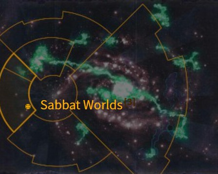

# 0964 福蒂斯双星 Fortis Binary

精校状态：中文行文已逐段精校，部分术语仍为暂定

分类：地理 / 真实空间 Real Space / 朦胧星域 Segmentum Obscurus

原文来源：https://www.bilibili.com/opus/1173227813647417344

原作者：帝国神选罐头

原文时间：2026年02月25日 14:43

[返回分类目录](目录.md) · [全书目录](../../目录.md)

<!-- A0964-B0001 图片 -->

<!-- A0964-B0002 -->

原译文

Map 地图

**校订译文**

Map 地图

<!-- /A0964-B0002 -->

<!-- A0964-B0003 -->
### Basic Data 基本资料

原题：Basic Data 基础数据

<!-- /A0964-B0003 -->

<!-- A0964-B0004 -->
**英文原文**

Name:Fortis Binary

<!-- /A0964-B0004 -->

<!-- A0964-B0005 -->

原译文

名称：福蒂斯双星

**校订译文**

名称：福蒂斯双星

<!-- /A0964-B0005 -->

<!-- A0964-B0006 -->
**英文原文**

Segmentum:Segmentum Pacificus

<!-- /A0964-B0006 -->

<!-- A0964-B0007 -->

原译文

星域：太平星域

**校订译文**

星域：太平星域

<!-- /A0964-B0007 -->

<!-- A0964-B0008 -->
**英文原文**

Sector:Sabbat Worlds

<!-- /A0964-B0008 -->

<!-- A0964-B0009 -->

原译文

星区：安息日世界

**校订译文**

星区：萨巴特诸世界

<!-- /A0964-B0009 -->

<!-- A0964-B0010 -->
**英文原文**

Affiliation:Imperium

<!-- /A0964-B0010 -->

<!-- A0964-B0011 -->

原译文

隶属：帝国

**校订译文**

隶属：帝国

<!-- /A0964-B0011 -->

<!-- A0964-B0012 -->
**英文原文**

Class:Forge World

<!-- /A0964-B0012 -->

<!-- A0964-B0013 -->

原译文

类别：铸造世界

**校订译文**

类别：铸造世界

<!-- /A0964-B0013 -->

<!-- A0964-B0014 -->
**英文原文**

Fortis Binary is a Forge World in the Sabbat Worlds cluster that fell to Chaos but was liberated by the Imperium during the Sabbat Worlds Crusade.

<!-- /A0964-B0014 -->

<!-- A0964-B0015 -->

原译文

福蒂斯双星是安息日世界星群中的一个铸造世界，它陷入了混乱，但在安息日世界远征期间被帝国解放。

**校订译文**

福蒂斯双星是萨巴特诸世界星群中的一颗铸造世界。它曾落入混沌之手，后在萨巴特诸世界远征中被帝国解放。

<!-- /A0964-B0015 -->

<!-- A0964-B0016 -->
## History 历史

<!-- /A0964-B0016 -->

<!-- A0964-B0017 -->
**英文原文**

During the Sabbat Worlds Crusade, the Tanith First and Only regiment was ordered to make a suicidal frontal attack on the enemy trench line. The order came from Lord Militant General Hechtor Dravere, the theatre commander, at the suggestion of Colonel Draker Flense of the Jantine Patricians, who harboured a deep personal hatred for the Tanith's commanding officer, Colonel-Commissar Ibram Gaunt.

<!-- /A0964-B0017 -->

<!-- A0964-B0018 -->

原译文

在安息日世界远征期间，塔尼斯第一唯一团奉命对敌方战壕线进行自杀式正面攻击。该命令是由战区指挥官军务领主将军赫克托·德拉维尔根据詹亭贵族军的上校德拉克尔·弗伦塞的建议下达的，他对塔尼斯的指挥官、兵团政委伊布拉姆·冈特怀有深深的个人仇恨。

**校订译文**

萨巴特诸世界远征期间，塔尼斯第一唯一团奉命对敌方战壕发动近乎自杀的正面进攻。命令由战区指挥官、军务领主将军赫克托·德拉维尔下达，建议者则是詹亭贵族军的德拉克尔·弗伦塞上校。弗伦塞与塔尼斯部队的指挥官、上校政委伊布拉姆·冈特有着极深的私怨。

<!-- /A0964-B0018 -->

<!-- A0964-B0019 -->
**英文原文**

Imperial Guardsmen fought with Chaos forces across four hundred kilometres of battlefield, a vast and ragged pat­tern of opposing trench systems, facing each other across a mangled dead-land of cratered mud and shattered factories. However, the Ghosts managed to sabotage a Chaos ritual to turn the attacking guardsmen into Daemonhosts.

<!-- /A0964-B0019 -->

<!-- A0964-B0020 -->

原译文

帝国卫队与混沌部队在四百公里的战场上作战，这是一个巨大而破旧的对抗战壕系统，在一片坑坑洼洼的废墟和破碎的工厂中面对面。然而，幽灵设法破坏了混沌仪式，将进攻的卫兵变成了恶魔宿主。

**校订译文**

帝国卫队与混沌部队在绵延四百公里的战场上交锋。庞大而破碎的战壕体系彼此对峙，中间隔着满布弹坑泥地和残破工厂的死亡地带。不过，幽灵们成功破坏了一场混沌仪式，阻止敌人将进攻的卫兵变成恶魔宿主。

**校注：** 英文为破坏“将卫兵化作恶魔宿主”的仪式，原译误成幽灵将卫兵变成宿主，施受关系完全相反。

<!-- /A0964-B0020 -->

<!-- A0964-B0021 -->
**英文原文**

During the conflict, food shortages in the Forge World's Hive Cities caused the citizens of Fortis Binary to process the flesh of dead soldiers as food.

<!-- /A0964-B0021 -->

<!-- A0964-B0022 -->

原译文

在冲突期间，铸造世界巢都城市的粮食短缺导致福蒂斯双星的平民将死去士兵的肉作为食物加工。

**校订译文**

战争期间，铸造世界各巢都粮食短缺，福蒂斯双星的居民因而将阵亡士兵的尸肉加工为食物。

<!-- /A0964-B0022 -->

<!-- A0964-B0023 -->
**英文原文**

A few years after Fortis Binary was liberated, the planet is able to raise five regiments that joined the second front under Lord General Van Voytz.

<!-- /A0964-B0023 -->

<!-- A0964-B0024 -->

原译文

在福蒂斯双星解放几年后，这颗行星能够组建五个兵团，在领主将军范·沃伊茨的领导下加入第二战场。

**校订译文**

解放数年后，福蒂斯双星已能组建五个兵团，加入范·沃伊茨领主将军指挥的第二条战线。

<!-- /A0964-B0024 -->

<!-- A0964-B0025 -->
## Description 描述

<!-- /A0964-B0025 -->

<!-- A0964-B0026 -->
**英文原文**

General Dravere made his headquarters in a ducal palace which was miraculously intact after six months of serial bombardment, and overlooked the wide rift valley of Diemos, once the hydro­electric industrial heartland of Fortis Binary, and now the axis on which the war revolved. In all directions, as far as the eye could see, sprawled the gross architecture of the manufacturing zone: the towers and hangers, the vaults and bunkers, the storage tanks and chimney stacks. A great ziggurat rose to the north, the brilliant gold icon of the Adeptus Mechanicus displayed on its flank. It rivalled, perhaps even surpassed, the Temple of the Ecclesiarchy, dedicated to the God-Emperor.

<!-- /A0964-B0026 -->

<!-- A0964-B0027 -->

原译文

德拉维尔将军的总部设在一座公爵宫殿里，经过六个月的连续轰炸，这座宫殿奇迹般地完好无损，俯瞰着迪莫斯山谷的宽广裂隙，这里曾经是福蒂斯双星的水电工业中心，现在是战争的轴心。在视线所及的各个方向上，制造区的总体建筑都在扩建：塔楼和吊架、穹顶和地堡、储罐和烟囱。一个巨大的塔庙向北升起，侧面展示着机械神教的辉煌金色标志。它可以与献给神皇的国教圣殿相媲美，甚至可能超越。

**校订译文**

德拉维尔将军将指挥部设在一座公爵宫殿中。经历六个月接连不断的轰炸，这座宫殿竟奇迹般完好无损，俯瞰着宽广的迪莫斯裂谷。这里曾是福蒂斯双星的水电工业中心，如今则成为战事的焦点。制造区的庞大建筑向四面八方延伸，直至视野尽头：高塔、机库、拱顶建筑、地堡、储罐与烟囱交错林立。北方耸立着一座巨大的阶梯塔庙，侧面饰有机械修会灿然的金色徽记；其规模足以与供奉神皇的国教会圣殿相媲美，甚至可能更胜一筹。

**校注：** Diemos为本地裂谷专名，不因近似拼写与火卫二Deimos合并；hangers在此疑为hangars机库笔误。

<!-- /A0964-B0027 -->

<!-- A0964-B0028 -->
**英文原文**

There were silos and shelled-out structures of the rising industrial manufactories just behind the Shriven lines, sooty shells of melted stone, rusted metal girder-work and fractured ceramite. Gargoyles, built to ward the buildings against contamination, had been defaced or toppled completely.

<!-- /A0964-B0028 -->

<!-- A0964-B0029 -->

原译文

忏悔线后面有正在崛起的工业制造厂的筒仓和空壳结构，熔化的石头的乌黑外壳，生锈的金属梁和断裂的陶钢。为保护建筑物免受污染而建造的石像鬼已被损坏或完全倒塌。

**校订译文**

忏悔者阵线后方，是高耸工业制造厂留下的筒仓与遭炮火打空的建筑。熔融石料、锈蚀金属梁架和碎裂陶钢构成覆满煤灰的残壳。原本用于保护建筑免遭污染的石像鬼，早已被毁容或彻底推倒。

**校注：** Shriven首字母大写，在此为作战部队称谓，暂译忏悔者；原“忏悔线”漏掉主体。

<!-- /A0964-B0029 -->

本篇核心术语与暂定项

以下列出本篇出现的英文原形及核心术语表用词。同形词可能指不同对象，具体词义以本篇正文和校注为准；单复数、别名和仅见于图注的名称可能尚未列入。完整候选见[术语表](../../术语表/双语术语候选.csv)。

| 英文 | 采用中文 | 状态 |
| --- | --- | --- |
| Adeptus Mechanicus | 机械修会 | 官方已核对 |
| Commissar | 政委 | 官方已核对 |
| Imperium | 帝国 | 暂定·简称 |
| Emperor | 帝皇 | 官方已核对 |
| Ecclesiarchy | 国教会 | 暂定 |
| Forge World | 铸造世界 | 暂定·官方待核 |
| The Order | 秩序 | 暂定·官方待核 |
| Segmentum Pacificus | 太平星域 | 暂定·官方待核 |
| Segmentum | 星域 | 暂定·官方待核 |
| Sector | 星区 | 暂定·官方待核 |
| Tanith | 塔尼斯 | 暂定·官方待核 |
| Gaunt | 兵虫 | 暂定·官方待核 |
| Gargoyles | 石像鬼 | 官方已核对 |
| Fortis Binary | 福蒂斯双星 | 暂定·官方待核 |
| Sabbat Worlds | 萨巴特诸世界 | 暂定·官方待核 |
| Ibram Gaunt | 伊布拉姆·冈特 | 官方词根参考·全名待核 |
| Colonel-Commissar | 上校政委 | 暂定·官方待核 |
| Draker Flense | 德拉克尔·弗伦塞 | 暂定·官方待核 |
| Jantine Patricians | 詹亭贵族军 | 暂定·官方待核 |
| Van Voytz | 范·沃伊茨 | 暂定·官方待核 |
| Diemos | 迪莫斯裂谷 | 暂定·官方待核 |
| Shriven | 忏悔者 | 暂定·官方待核 |

