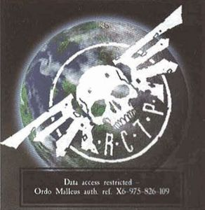

# 0965 塔尼斯 Tanith

精校状态：中文行文已逐段精校，部分术语仍为暂定

分类：地理 / 真实空间 Real Space / 朦胧星域 Segmentum Obscurus

原文来源：https://www.bilibili.com/opus/1164594340977180681

原作者：帝国神选罐头

原文时间：2026年02月02日 08:20

[返回分类目录](目录.md) · [全书目录](../../目录.md)

<!-- A0965-B0001 -->
### Basic Data 基本资料

原题：Basic Data 基础数据

<!-- /A0965-B0001 -->

<!-- A0965-B0002 -->
**英文原文**

Name:Tanith

<!-- /A0965-B0002 -->

<!-- A0965-B0003 -->

原译文

名称：塔尼斯

**校订译文**

名称：塔尼斯

<!-- /A0965-B0003 -->

<!-- A0965-B0004 -->
**英文原文**

Segmentum:Segmentum Pacificus

<!-- /A0965-B0004 -->

<!-- A0965-B0005 -->

原译文

星域：太平星域

**校订译文**

星域：太平星域

<!-- /A0965-B0005 -->

<!-- A0965-B0006 -->
**英文原文**

Sector:Sabbat Worlds

<!-- /A0965-B0006 -->

<!-- A0965-B0007 -->

原译文

星区：萨巴特世界

**校订译文**

星区：萨巴特诸世界

<!-- /A0965-B0007 -->

<!-- A0965-B0008 -->
**英文原文**

System:Tanith System

<!-- /A0965-B0008 -->

<!-- A0965-B0009 -->

原译文

星系：塔尼斯星系

**校订译文**

星系：塔尼斯星系

<!-- /A0965-B0009 -->

<!-- A0965-B0010 -->
**英文原文**

Population:0

<!-- /A0965-B0010 -->

<!-- A0965-B0011 -->

原译文

人口：0

**校订译文**

人口：0

<!-- /A0965-B0011 -->

<!-- A0965-B0012 -->
**英文原文**

Affiliation:Unknown, formerly Imperium

<!-- /A0965-B0012 -->

<!-- A0965-B0013 -->

原译文

隶属：未知，前帝国

**校订译文**

隶属：未知，原属帝国

<!-- /A0965-B0013 -->

<!-- A0965-B0014 -->
**英文原文**

Class:Dead World, Frontier World, former Forest World, former Feudal World

<!-- /A0965-B0014 -->

<!-- A0965-B0015 -->

原译文

类别：死亡世界，边疆世界，前森林世界，前封建世界

**校订译文**

类别：死寂世界、边疆世界；原为森林世界、封建世界

**校注：** Dead World为死寂世界，区别Death World死亡世界。

<!-- /A0965-B0015 -->

<!-- A0965-B0016 图片 -->

<!-- A0965-B0017 -->

原译文

Planetary Image 行星图像

**校订译文**

Planetary Image 行星图像

<!-- /A0965-B0017 -->

<!-- A0965-B0018 -->
**英文原文**

Tanith was a Forest World of the Imperium located in the Sabbat Worlds cluster of Segmentum Pacificus, which was destroyed by the forces of Chaos. It is most notable for being the homeworld of the Tanith First and Only regiment of the Astra Militarum.

<!-- /A0965-B0018 -->

<!-- A0965-B0019 -->

原译文

塔尼斯是帝国的森林世界，位于太平星域的萨巴特世界群中，被混沌部队摧毁。最值得注意的是，它是星界军塔尼斯第一唯一团的家园世界。

**校订译文**

塔尼斯曾是太平星域萨巴特诸世界星群中的一颗帝国森林世界，后来遭混沌军队摧毁。它最著名的身份，是星界军塔尼斯第一唯一团的母星。

<!-- /A0965-B0019 -->

<!-- A0965-B0020 -->
## History 历史

<!-- /A0965-B0020 -->

<!-- A0965-B0021 -->
**英文原文**

Prior to the planet's destruction, Tanith had a spotless record for supplying its Imperial Tithe. However, there were rumours that, being so close to the Edge meant that the planet was touched by Chaos.

<!-- /A0965-B0021 -->

<!-- A0965-B0022 -->

原译文

在行星毁灭之前，塔尼斯在供应帝国什一税方面有着无可挑剔的记录。然而，有传言称，如此靠近边缘意味着这颗行星被混沌所触及。

**校订译文**

毁灭之前，塔尼斯缴纳帝国什一税的记录无可挑剔。不过，也有传言认为，它太靠近“边缘”，因此受到了混沌的影响。

<!-- /A0965-B0022 -->

<!-- A0965-B0023 -->
### The Old Days 旧日

<!-- /A0965-B0023 -->

<!-- A0965-B0024 -->
**英文原文**

Research indicates that the initial settlers of Tanith belonged to a human gene-stock branch called the Magmeta, an ethnic strand with multiple genomic markers suggesting it originated from the Terran regions of Albia and Europa.

<!-- /A0965-B0024 -->

<!-- A0965-B0025 -->

原译文

研究表明，塔尼斯的最初定居者属于一个名为玛格梅塔的人类基因库分支，这是一个具有多个基因组标记的种族链，表明它起源于泰拉的阿尔比亚和欧罗巴地区。

**校订译文**

研究表明，塔尼斯的最初定居者属于一个称作玛格梅塔的人类遗传支系。其多个基因组标记显示，这一族群可能起源于泰拉的阿尔比亚与欧罗巴地区。

<!-- /A0965-B0025 -->

<!-- A0965-B0026 -->
**英文原文**

At one point, Tanith was a Feudal World ruled over by the Huhlhwch Dynasty. The Huhlhwch were overthrown, however, and replaced with a system of democratically-run city-states. The planet's ancient legends attribute this to a sect of wood-warriors known as the Nalsheen.

<!-- /A0965-B0026 -->

<!-- A0965-B0027 -->

原译文

有一段时间，塔尼斯是一个由胡尔赫奇王朝统治的封建世界。然而，胡尔赫奇被推翻，取而代之的是民主管理的城邦制度。这个行星的古老传说将此归因于一个被称为纳尔辛的木战士教派。

**校订译文**

塔尼斯一度是胡尔赫奇王朝统治的封建世界。王朝后来遭到推翻，取而代之的是民主管理的城邦制度。当地古老传说认为，这场变革由一个称作纳尔辛的林地战士团体促成。

<!-- /A0965-B0027 -->

<!-- A0965-B0028 -->
### The Fall of Tanith 塔尼斯之陨

<!-- /A0965-B0028 -->

<!-- A0965-B0029 -->
**英文原文**

On his deathbed, Warmaster Slaydo, commander of the Sabbat Worlds Crusade, bestowed upon Ibram Gaunt — a commissar who had fought with distinction at Balhaut — the rank of Colonel-Commissar and dispatched him to Tanith to raise three regiments for the Crusade. Gaunt himself initially regarded Tanith as an excellent world for this new raising, having dutifully paid its Tithes over the years and lacking any sort of complicated martial traditions.

<!-- /A0965-B0029 -->

<!-- A0965-B0030 -->

原译文

萨巴特世界远征指挥官战帅斯莱多在临终前，授予在巴尔豪特英勇作战的政委伊布拉姆·冈特上校政委军衔，并派遣他前往塔尼斯为远征集结三个兵团。冈特本人最初认为塔尼斯是这个新集结的绝佳场所，多年来一直尽职尽责地支付了什一税，缺乏任何复杂的军事传统。

**校订译文**

萨巴特诸世界远征的统帅斯莱多临终前，将曾在巴尔豪特立下显赫战功的政委伊布拉姆·冈特擢升为上校政委，派他前往塔尼斯，为远征组建三个兵团。冈特起初认为，这里十分适合征募新军：塔尼斯多年来忠实缴纳什一税，也没有复杂棘手的军事传统。

<!-- /A0965-B0030 -->

<!-- A0965-B0031 -->
**英文原文**

However, in the wake of their defeat at Balhaut, a splinter fleet of Chaos slipped past the picket set up by the Imperial Navy, thanks to the newly-appointed Warmaster Macaroth's change of tactics. This small fleet attacked and conquered six systems before being defeated, one of which was Tanith.

<!-- /A0965-B0031 -->

<!-- A0965-B0032 -->

原译文

然而，在巴尔豪特之败后，由于新任命的战帅马卡罗斯改变了战术，混沌的一支分裂舰队躲过了帝国海军设立的警戒队。这支小型舰队在被击败之前攻击并征服了六个星系，其中之一是塔尼斯。

**校订译文**

然而，混沌在巴尔豪特战败后，一支分舰队趁新任战帅马卡洛斯调整战术之机，穿过帝国海军的警戒网。这支小舰队在被消灭之前，先后袭击并征服六个星系，塔尼斯便是其中之一。

<!-- /A0965-B0032 -->

<!-- A0965-B0033 -->
**英文原文**

On the day of the Founding, the Chaos armada bombarded Tanith from orbit, and deployed ground troops to kill vital Imperial personnel before burning Tanith and its forests with the fleet's firepower. Colonel-Commissar Ibram Gaunt was one of the last people to leave the planet before its demise, and was saved by a youth called Brin Milo, whom he took with him in gratitude. Milo later confirms that he was the only civilian to leave Tanith alive, being too young to join the Guard.

<!-- /A0965-B0033 -->

<!-- A0965-B0034 -->

原译文

在建军之日，混沌舰队从轨道上轰炸了塔尼斯，并部署了地面部队杀死了重要的帝国人员，然后用舰队的火力烧毁了塔尼斯及其森林。伊布拉姆·冈特上校政委是行星灭亡前最后离开行星的人之一，他被一个名叫布林·米洛的年轻人救了出来，他感激地带着他。米洛后来证实，他是唯一一个活着离开坦尼斯的平民，因为他太年轻，无法加入卫队。

**校订译文**

就在新军建军当天，混沌舰队从轨道轰击塔尼斯，并派出地面部队，刺杀帝国关键人员，随后以舰炮焚毁整个世界及其森林。上校政委伊布拉姆·冈特是行星毁灭前最后撤离的人之一。一名叫布林·米洛的少年救了他，冈特出于感激将少年一同带走。米洛后来证实，自己是唯一活着离开塔尼斯的平民；他当时年纪太小，还不能加入卫队。

<!-- /A0965-B0034 -->

<!-- A0965-B0035 -->
**英文原文**

In all, only around 3,500 people survived the evacuation. The remaining Tanith themselves referred to the destruction of their homeworld as The Loss. Nonetheless, the survivors knew their duty - they had, after all, enlisted with the Astra Militarum - and joined the Imperial forces fighting in the Sabbat Worlds Crusade.

<!-- /A0965-B0035 -->

<!-- A0965-B0036 -->

原译文

总共只有大约3500人在撤离中幸存下来。剩下的塔尼斯人自己将他们家园世界的毁灭称为“亏蚀”。尽管如此，幸存者们知道他们的职责 — 毕竟，他们加入了星界军 — 并加入了参加萨巴特世界远征的帝国军队。

**校订译文**

最终，撤离者中仅约3500人生还。幸存的塔尼斯人将母星毁灭称为“失落”。尽管遭逢巨变，他们仍明白自己的职责：既然已经应征加入星界军，就应随帝国部队继续参加萨巴特诸世界远征。

**校注：** The Loss指母星毁灭这一共同创伤，暂译失落，原亏蚀不合此处语境。

<!-- /A0965-B0036 -->

<!-- A0965-B0037 -->
## Geography 地理

<!-- /A0965-B0037 -->

<!-- A0965-B0038 -->
**英文原文**

Tanith was a heavily forested world, famous for its forests of nalwood trees. Nalwood trees were capable of uprooting and moving, with entire forests migrating to get better access to sunlight or water. This made blazing trails through the forests useless, as any trails were erased by the movement of the trees. As a result of this, Tanith's native inhabitants have an unerring sense of direction, developed in the ever-changing woodlands, and unmatched stealth skills which became renowned during the Sabbat Worlds Crusade.

<!-- /A0965-B0038 -->

<!-- A0965-B0039 -->

原译文

塔尼斯是一个森林茂密的世界，以其纳尔木森林而闻名。纳尔木树能够连根拔起并移动，整个森林都会迁移以获得更好的阳光或水。这使得穿越森林的小径变得毫无用处，因为任何小径都会被树木的移动所抹去。因此，塔尼斯的土著居民有着在不断变化的林地中发展起来的准确的方向感，以及在萨巴特世界远征期间闻名的无与伦比的隐形技能。

**校订译文**

塔尼斯森林茂密，以纳尔木林闻名。这些树能够拔根行走，整片森林会为了获得更充足的阳光或水源而迁移。因此，在森林中开路、留下路标都毫无用处，树木移动便会抹去所有痕迹。在不断变化的林地中，当地居民练就了极准的方向感和无可比拟的潜行本领，后来在萨巴特诸世界远征中声名远扬。

<!-- /A0965-B0039 -->

<!-- A0965-B0040 -->
**英文原文**

Nalwood was Tanith's main export, both in terms of raw nalwood lumber and exquisite carvings. The material became extremely rare after the planet's destruction.

<!-- /A0965-B0040 -->

<!-- A0965-B0041 -->

原译文

纳尔木是塔尼斯的主要出口产品，无论是原木还是精美的雕刻品。行星毁灭后，这种材料变得极其罕见。

**校订译文**

纳尔木是塔尼斯最主要的出口品，既以原木出售，也制成精美雕刻。行星毁灭后，这种材料变得极为罕见。

<!-- /A0965-B0041 -->

<!-- A0965-B0042 -->
**英文原文**

The capital city of Tanith - surrounded by a giant wall, presumably to keep the nalwood trees from moving into the city - was Tanith Magna. The world was governed by the Elector of Tanith, and the main governmental building was the Assembly. The planet was split up into counties, and each city raised a militia, from which a number of Imperial Guardsmen were recruited.

<!-- /A0965-B0042 -->

<!-- A0965-B0043 -->

原译文

塔尼斯的首都是塔尼斯·马格纳，周围环绕着一堵巨大的墙，大概是为了防止纳尔木树进入城市。世界由塔尼斯选帝侯统治，主要的政府建筑是议会。这个行星被分成几个郡，每个城市都有一支民兵，从中招募了一些帝国卫队。

**校订译文**

塔尼斯首都名为塔尼斯·马格纳，周围环绕着巨墙，推测是为阻止纳尔木移入城内。行星由塔尼斯选侯治理，主要政务建筑为议会大厦。整个世界划分为若干郡，各城市均组织民兵，帝国卫队从中征募部分人员。

**校注：** Elector只提供选侯职衔，英文未表明选举帝皇的职责，不擅加“帝”。

<!-- /A0965-B0043 -->

<!-- A0965-B0044 -->
### Known Areas 已知地区

<!-- /A0965-B0044 -->

<!-- A0965-B0045 -->
### Regions 区域

<!-- /A0965-B0045 -->

<!-- A0965-B0046 -->

原译文

Beldane District 贝尔丹地区

**校订译文**

Beldane District 贝尔丹地区

<!-- /A0965-B0046 -->

<!-- A0965-B0047 -->

原译文

County Cuhulic 库赫利克郡

**校订译文**

County Cuhulic 库赫利克郡

<!-- /A0965-B0047 -->

<!-- A0965-B0048 -->

原译文

County Pryze 普莱兹郡

**校订译文**

County Pryze 普莱兹郡

<!-- /A0965-B0048 -->

<!-- A0965-B0049 -->

原译文

Magna Province 马格纳行省Settlements 定居点

**校订译文**

Magna Province 马格纳行省

Settlements 定居点

<!-- /A0965-B0049 -->

<!-- A0965-B0050 -->

原译文

Sottress 索特雷斯

**校订译文**

Sottress 索特雷斯

<!-- /A0965-B0050 -->

<!-- A0965-B0051 -->

原译文

Tanith Attica 塔尼斯·阿提卡

**校订译文**

Tanith Attica 塔尼斯·阿提卡

<!-- /A0965-B0051 -->

<!-- A0965-B0052 -->

原译文

Tanith Dale 塔尼斯·戴尔

**校订译文**

Tanith Dale 塔尼斯·戴尔

<!-- /A0965-B0052 -->

<!-- A0965-B0053 -->
**英文原文**

Tanith Longshore — Coastal settlement.

<!-- /A0965-B0053 -->

<!-- A0965-B0054 -->

原译文

塔尼斯沿岸 — 沿海定居点。

**校订译文**

塔尼斯沿岸 — 沿海定居点。

<!-- /A0965-B0054 -->

<!-- A0965-B0055 -->

原译文

Tanith Magna 塔尼斯·马格纳

**校订译文**

Tanith Magna 塔尼斯·马格纳

<!-- /A0965-B0055 -->

<!-- A0965-B0056 -->
**英文原文**

Tanith Steeple — Mountain settlement.

<!-- /A0965-B0056 -->

<!-- A0965-B0057 -->

原译文

塔尼斯尖顶 — 山地定居点。

**校订译文**

塔尼斯尖顶 — 山地定居点。

<!-- /A0965-B0057 -->

<!-- A0965-B0058 -->
**英文原文**

Tanith Ultima — Shrine-city.

<!-- /A0965-B0058 -->

<!-- A0965-B0059 -->

原译文

塔尼斯·极限 — 圣地城市。Other Geographic Features 其他地理特征

**校订译文**

塔尼斯·极限——圣地城市。

Other Geographic Features 其他地理特征

<!-- /A0965-B0059 -->

<!-- A0965-B0060 -->

原译文

Heban 黑檀

**校订译文**

Heban 黑檀

<!-- /A0965-B0060 -->

<!-- A0965-B0061 -->

原译文

Pryze Junction 普莱兹枢纽

**校订译文**

Pryze Junction 普莱兹枢纽

<!-- /A0965-B0061 -->

<!-- A0965-B0062 -->

原译文

River Pryze 普莱兹河Native Wildlife 本土野生动物The various animal and planet species that lived on Tanith are largely extinct, following the planet's destruction.随着行星的毁灭，生活在塔尼斯上的各种动物和行星物种基本上已经灭绝。Fauna 动物

**校订译文**

River Pryze 普莱兹河

Native Wildlife 本土野生动物

The various animal and planet species that lived on Tanith are largely extinct, following the planet's destruction.

行星毁灭后，原本生活在塔尼斯的各种动物与植物大多已经灭绝。

Fauna 动物

**校注：** 底稿误将章节标题及英文粘入中文块；恢复层次。英文animal and planet species中的planet疑为plant，中文按动植物语境纠正，英文仍原样保留。

<!-- /A0965-B0062 -->

<!-- A0965-B0063 -->

原译文

Cuchlain 库赫林

**校订译文**

Cuchlain 库赫林

<!-- /A0965-B0063 -->

<!-- A0965-B0064 -->

原译文

Fruit-wasp 果蜂

**校订译文**

Fruit-wasp 果蜂

<!-- /A0965-B0064 -->

<!-- A0965-B0065 -->
**英文原文**

Larisel — Small rodents hunted by woodsmen for their pelts.

<!-- /A0965-B0065 -->

<!-- A0965-B0066 -->

原译文

拉里塞尔 — 伐木工人为获取皮毛而猎杀的小型啮齿动物。

**校订译文**

拉里塞尔 — 伐木工人为获取皮毛而猎杀的小型啮齿动物。

<!-- /A0965-B0066 -->

<!-- A0965-B0067 -->

原译文

Nal-grub 纳尔-格鲁布

**校订译文**

Nal-grub 纳尔-格鲁布

<!-- /A0965-B0067 -->

<!-- A0965-B0068 -->

原译文

Sap-fly 树液蝇

**校订译文**

Sap-fly 树液蝇

<!-- /A0965-B0068 -->

<!-- A0965-B0069 -->
**英文原文**

Shoggy — Small amphibian creatures with bulging eyes that dwelled by woodland pools in Tanith's forests.

<!-- /A0965-B0069 -->

<!-- A0965-B0070 -->

原译文

肖吉 — 一种眼睛凸出的小型两栖动物，栖息在塔尼斯森林的林地池塘边。Flora 植物

**校订译文**

肖吉——一种眼球突出的两栖小生物，栖居于塔尼斯森林的池塘边。

Flora 植物

<!-- /A0965-B0070 -->

<!-- A0965-B0071 -->
**英文原文**

Nalwood — Motile trees.

<!-- /A0965-B0071 -->

<!-- A0965-B0072 -->

原译文

纳尔木 — 能动的树

**校订译文**

纳尔木——能够自行移动的树木。

<!-- /A0965-B0072 -->

<!-- A0965-B0073 -->

原译文

Ploin 普洛因Tanith's people are pale-skinned and dark-haired, with a lilting, sing-song accent.塔尼斯的人民皮肤苍白，头发乌黑，带着轻快的起伏口音。Most Tanith men (and youths) were tattooed with blue and green ink. These tattoos could have various meanings - it is known, for example, that there were specific markings to indicate a betrothal in addition to more general family markings. Some of these were common shapes like loops, whorls, spirals and stars whereas others resembled animals (including dragons, snakes and fish) or plants. Earrings and studs were also commonplace.大多数塔尼斯人（和年轻人）都纹有蓝色和绿色的纹身。这些纹身可能有各种含义 — 例如，众所周知，除了更一般的家庭标记外，还有特定的标记来表示订婚。其中一些是常见的形状，如环、轮、螺旋和星，而另一些则类似于动物（包括龙、蛇和鱼）或植物。耳环和耳钉也很常见。Some of the Tanith people believed in various types of spirit, including the drud-fellad (which watch over the forests) and nyrsis (which protect streams and rivers). In addition, some believed in benevolent spirits of order and protection known as anroth, which supposedly watched over Tanith homes (however others dismissed the stories of anroth as tales for children). Children also attended church school, such as the one headed by Archdeacon Mkere.一些塔尼斯人相信各种各样的精魄，包括德鲁德·费拉德（守护森林）和尼西斯（保护溪流和河流）。此外，一些人相信被称为安罗斯的仁慈的秩序和保护精魄，据说安罗斯会守护塔尼斯的家园（然而，其他人则认为安罗斯的故事是儿童故事）。孩子们也上教堂学校，比如由副主教姆克雷领导的学校。Tanith Pipes are a traditional musical instrument of Tanith, described as a small clutch of spidery reeds attached to a bellows bag which is squeezed rhythmically under the arm. Their initial use on Tanith was to guide off-worlders through the shifting nalwood forests, but in the Tanith First they were used to rally the men and spook the enemy (although they have a similar effect on the Tanith's allies).塔尼斯小管是塔尼斯的一种传统乐器，被描述为一小团蜘蛛状的芦苇，连接着一个风箱袋，风箱袋在手臂下有节奏地被挤压。它们最初在塔尼斯的用途是引导世界外的人穿过移动的纳尔木森林，但在塔尼斯第一团中，它们被用来召集人们并恐吓敌人（尽管它们对塔尼斯的盟友也有类似的影响）。According to Scout Trooper Bonin, most old Tanith families (his own included) would baptise and officially name their children at the age of eight, as naming children at birth was considered premature and it was believed that a child would "grow into" the names he or she would need. Bonin, however, remarked that this tradition wasn't observed much in Tanith's final years.据侦察兵博宁介绍，大多数塔尼斯家族（包括他自己的家族）都会在八岁时给孩子洗礼并正式命名，因为在出生时给孩子起名被认为为时过早，人们相信孩子会“成长为”他或她需要的名字。然而，博宁表示，在塔尼斯的最后几年，这一传统并没有得到太多的遵守。Tanith was supposedly home to the legendary Nalsheen wood warriors, a brotherhood of Tanith who used the martial art cwlwhl (pronounced kil-wil), using blade-tipped staffs to fight off multiple foes. The Nalsheen were responsible for overthrowing the corrupt Huhlhwch Dynasty and ushering in the free modern era of Tanith. Guardsman Mkvenner is the only remaining Tanith to have been trained in cwlwhl, but has reluctantly admitted that he never completed his training.塔尼斯据说是传说中的纳尔辛木战士的家园，塔尼斯的兄弟会使用奎尔威尔武术（发音为基尔-威尔），使用刃尖端的棍棒击退多个敌人。纳尔辛推翻了腐败的胡尔赫奇王朝，开创了塔尼斯自由的现代时代。卫兵马克文纳是唯一一个接受奎尔威尔训练的塔尼斯人，但他不情愿地承认自己从未完成过训练。Language 语言The Nalsheen used proto-Gothic - the early form of both High and Low Gothic used presently in the Imperium - as their private language.纳尔辛使用原始哥特语作为他们的个人语言，这是帝国目前使用的高哥特语和低哥特语的早期形式。The Tanith accent is noted to be a lilting, sing-song accent. The main Tanith curse-word is feth, the name of an ancient Tanith tree-god.塔尼斯口音是一种轻快的起伏口音。主要的塔尼斯咒言是费斯，这是古代塔尼斯树神的名字。Known Words & Phrases 已知词汇与短语

**校订译文**

Ploin 普洛因

Tanith's people are pale-skinned and dark-haired, with a lilting, sing-song accent.

塔尼斯居民皮肤白皙、头发乌黑，说话带有轻快而抑扬顿挫的口音。

Most Tanith men (and youths) were tattooed with blue and green ink. These tattoos could have various meanings - it is known, for example, that there were specific markings to indicate a betrothal in addition to more general family markings. Some of these were common shapes like loops, whorls, spirals and stars whereas others resembled animals (including dragons, snakes and fish) or plants. Earrings and studs were also commonplace.

多数塔尼斯男子，包括少年，都有蓝色和绿色墨水刺成的纹身。纹样含义各异，除通常的家族标记外，也有表示订婚的特定图案。有些呈圆环、涡纹、螺旋或星形，另一些则描绘龙、蛇、鱼等动物，或植物。耳环和耳钉也十分常见。

Some of the Tanith people believed in various types of spirit, including the drud-fellad (which watch over the forests) and nyrsis (which protect streams and rivers). In addition, some believed in benevolent spirits of order and protection known as anroth, which supposedly watched over Tanith homes (however others dismissed the stories of anroth as tales for children). Children also attended church school, such as the one headed by Archdeacon Mkere.

部分塔尼斯人相信各种精灵，例如守护森林的德鲁德·费拉德，以及保护河流溪涧的尼西斯。另有人相信一种称为安罗斯的善灵，代表秩序与庇护，据说会看守人们的家宅；也有人只把这些故事当作讲给孩子的传说。儿童还会就读于教会学校，例如姆克雷副主教主持的学校。

Tanith Pipes are a traditional musical instrument of Tanith, described as a small clutch of spidery reeds attached to a bellows bag which is squeezed rhythmically under the arm. Their initial use on Tanith was to guide off-worlders through the shifting nalwood forests, but in the Tanith First they were used to rally the men and spook the enemy (although they have a similar effect on the Tanith's allies).

塔尼斯风笛是当地传统乐器，由一小簇形似蜘蛛足的簧管连接皮囊，夹在臂下有节奏地挤压发声。它最初用于引导星外来客穿越不断移动的纳尔木林；到了塔尼斯第一团，则用来鼓舞和召集士兵、震慑敌人，尽管盟军有时也同样受到惊吓。

According to Scout Trooper Bonin, most old Tanith families (his own included) would baptise and officially name their children at the age of eight, as naming children at birth was considered premature and it was believed that a child would "grow into" the names he or she would need. Bonin, however, remarked that this tradition wasn't observed much in Tanith's final years.

据侦察兵博宁说，多数历史悠久的塔尼斯家族，包括他自己的家族，会等孩子八岁才施洗并正式命名。当地认为一出生便取名过早，孩子应随着成长，逐渐显出适合自己的名字。不过，博宁也指出，在塔尼斯毁灭前的最后几年，这项传统已不再普遍遵行。

Tanith was supposedly home to the legendary Nalsheen wood warriors, a brotherhood of Tanith who used the martial art cwlwhl (pronounced kil-wil), using blade-tipped staffs to fight off multiple foes. The Nalsheen were responsible for overthrowing the corrupt Huhlhwch Dynasty and ushering in the free modern era of Tanith. Guardsman Mkvenner is the only remaining Tanith to have been trained in cwlwhl, but has reluctantly admitted that he never completed his training.

传说塔尼斯是纳尔辛林地战士的故乡。这一兄弟会练习奎尔威尔武术（cwlwhl，读作kil-wil），使用顶端装刃的长棍迎战多个敌人。纳尔辛推翻腐败的胡尔赫奇王朝，开启塔尼斯自由的近代。卫兵马克文纳是幸存塔尼斯人中唯一受过奎尔威尔训练的人，不过他也勉强承认，自己从未完成全部训练。

Language 语言

The Nalsheen used proto-Gothic - the early form of both High and Low Gothic used presently in the Imperium - as their private language.

纳尔辛以原始哥特语作为内部专用语言。这是当今帝国高哥特语与低哥特语的早期形式。

The Tanith accent is noted to be a lilting, sing-song accent. The main Tanith curse-word is feth, the name of an ancient Tanith tree-god.

塔尼斯口音以轻快、如吟唱般抑扬顿挫著称。当地最常见的咒骂词是“费斯”，源自塔尼斯一位古老树神的名字。

Known Words & Phrases 已知词汇与短语

**校注：** 此块包含多段完整英中内容及标题，已恢复段落并逐字保留原英文。wood-warriors为林地战士；pipes按乐器结构译风笛，非小管。

<!-- /A0965-B0073 -->

<!-- A0965-B0074 -->
**英文原文**

Anroth — A type of spirit.

<!-- /A0965-B0074 -->

<!-- A0965-B0075 -->

原译文

安罗斯 — 一种精魄。

**校订译文**

安罗斯 — 一种精魄。

<!-- /A0965-B0075 -->

<!-- A0965-B0076 -->
**英文原文**

Chulan — Pronounced "Koo-lun". Outsider, unknown person, foreigner/off-worlder.

<!-- /A0965-B0076 -->

<!-- A0965-B0077 -->

原译文

丘兰 — 发音为“库-伦”。外来者、未知人员、外国人/外星人。

**校订译文**

丘兰——读作“Koo-lun”。意为外来者、陌生人、异乡人或星外来客。

<!-- /A0965-B0077 -->

<!-- A0965-B0078 -->
**英文原文**

Cwlwhl — A martial art.

<!-- /A0965-B0078 -->

<!-- A0965-B0079 -->

原译文

奎尔威尔 — 一种武术。

**校订译文**

奎尔威尔 — 一种武术。

<!-- /A0965-B0079 -->

<!-- A0965-B0080 -->
**英文原文**

The county names are closely similar to those of real-life Ireland and Scotland.

<!-- /A0965-B0080 -->

<!-- A0965-B0081 -->

原译文

郡名与现实生活中的爱尔兰和苏格兰非常相似。

**校订译文**

这些郡名与现实中爱尔兰及苏格兰的地名十分相似。

<!-- /A0965-B0081 -->

<!-- A0965-B0082 -->
**英文原文**

Many Tanith names begin with "Mk", a variant of "Mc" or "Mac" used by the Irish and Scottish, from whom inspiration for the Tanith appears to have been drawn.

<!-- /A0965-B0082 -->

<!-- A0965-B0083 -->

原译文

塔尼斯的许多名字都以“Mk”开头，这是爱尔兰和苏格兰人使用的“Mc”或“Mac”的变体，塔尼斯的灵感似乎来自于他们。

**校订译文**

塔尼斯的许多名字都以“Mk”开头，这是爱尔兰和苏格兰人使用的“Mc”或“Mac”的变体，塔尼斯的灵感似乎来自于他们。

<!-- /A0965-B0083 -->

<!-- A0965-B0084 -->
**英文原文**

There are also elements of Welsh in their language.

<!-- /A0965-B0084 -->

<!-- A0965-B0085 -->

原译文

他们的语言中也有威尔士语的元素。

**校订译文**

他们的语言中也有威尔士语的元素。

<!-- /A0965-B0085 -->

<!-- A0965-B0086 -->
**英文原文**

Tanith pipes are described as a similar in appearance and sound to Uilleann pipes.

<!-- /A0965-B0086 -->

<!-- A0965-B0087 -->

原译文

塔尼斯小管被描述为在外观和声音上与爱尔兰肘风笛相似。

**校订译文**

据描述，塔尼斯风笛在外形与音色上都与爱尔兰肘风笛相似。

<!-- /A0965-B0087 -->

<!-- A0965-B0088 -->

原译文

#战锤40k##地理##太平星域##萨巴特世界##塔尼斯星系##死亡世界##边疆世界##塔尼斯#

**校订译文**

#战锤40k##地理##太平星域##萨巴特诸世界##塔尼斯星系##死寂世界##边疆世界##塔尼斯#

<!-- /A0965-B0088 -->

本篇核心术语与暂定项

以下列出本篇出现的英文原形及核心术语表用词。同形词可能指不同对象，具体词义以本篇正文和校注为准；单复数、别名和仅见于图注的名称可能尚未列入。完整候选见[术语表](../../术语表/双语术语候选.csv)。

| 英文 | 采用中文 | 状态 |
| --- | --- | --- |
| Astra Militarum | 星界军 | 官方已核对 |
| Commissar | 政委 | 官方已核对 |
| Imperium | 帝国 | 暂定·简称 |
| Imperial Navy | 帝国海军 | 暂定 |
| Segmentum Pacificus | 太平星域 | 暂定·官方待核 |
| Segmentum | 星域 | 暂定·官方待核 |
| Sector | 星区 | 暂定·官方待核 |
| Tanith | 塔尼斯 | 暂定·官方待核 |
| Imperial Tithe | 帝国什一税 | 暂定·官方待核 |
| Ancient | 旗手 | 官方已核对 |
| Founding | 建军 | 暂定·官方待核 |
| Macaroth | 马卡洛斯 | 暂定·官方待核 |
| Gaunt | 兵虫 | 暂定·官方待核 |
| System | 星系（恒星系统） | 暂定·官方待核 |
| Dead World | 死寂世界 | 暂定·官方待核 |
| Feudal World | 封建世界 | 暂定·官方待核 |
| Sabbat Worlds | 萨巴特诸世界 | 暂定·官方待核 |
| Forest World | 森林世界 | 暂定·官方待核 |
| Albia | 阿尔比亚 | 暂定·官方待核 |
| Ibram Gaunt | 伊布拉姆·冈特 | 官方词根参考·全名待核 |
| Colonel-Commissar | 上校政委 | 暂定·官方待核 |
| Touched | 受触者 | 暂定·官方待核 |
| Slaydo | 斯莱多 | 暂定·官方待核 |
| Balhaut | 巴尔豪特 | 暂定·官方待核 |
| Magmeta | 玛格梅塔 | 暂定·官方待核 |
| Huhlhwch Dynasty | 胡尔赫奇王朝 | 暂定·官方待核 |
| Nalsheen | 纳尔辛 | 暂定·官方待核 |
| Brin Milo | 布林·米洛 | 暂定·官方待核 |
| The Loss | 失落 | 暂定·官方待核 |
| Nalwood | 纳尔木 | 暂定·官方待核 |
| Tanith Magna | 塔尼斯·马格纳 | 暂定·官方待核 |
| Elector of Tanith | 塔尼斯选侯 | 暂定·官方待核 |
| Tanith Longshore | 塔尼斯沿岸 | 暂定·官方待核 |
| Tanith Steeple | 塔尼斯尖顶 | 暂定·官方待核 |
| Tanith Ultima | 塔尼斯·极限 | 暂定·官方待核 |
| Larisel | 拉里塞尔 | 暂定·官方待核 |
| Shoggy | 肖吉 | 暂定·官方待核 |
| anroth | 安罗斯 | 暂定·官方待核 |
| Tanith Pipes | 塔尼斯风笛 | 暂定·官方待核 |
| cwlwhl | 奎尔威尔 | 暂定·官方待核 |
| Chulan | 丘兰 | 暂定·官方待核 |

