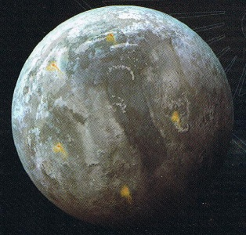

# 0966 贝塔利斯三号 Betalis III

精校状态：中文行文已逐段精校，部分术语仍为暂定

分类：地理 / 真实空间 Real Space / 朦胧星域 Segmentum Obscurus

原文来源：https://www.bilibili.com/opus/1169598630699466760

原作者：帝国神选罐头

原文时间：2026年02月15日 20:00

[返回分类目录](目录.md) · [全书目录](../../目录.md)

<!-- A0966-B0001 -->
### Basic Data 基本资料

原题：Basic Data 基础数据

<!-- /A0966-B0001 -->

<!-- A0966-B0002 -->
**英文原文**

Name:Betalis III

<!-- /A0966-B0002 -->

<!-- A0966-B0003 -->

原译文

名称：贝塔利斯三号

**校订译文**

名称：贝塔利斯三号

<!-- /A0966-B0003 -->

<!-- A0966-B0004 -->
**英文原文**

Segmentum:Segmentum Solar

<!-- /A0966-B0004 -->

<!-- A0966-B0005 -->

原译文

星域：太平星域

**校订译文**

星域：太阳星域

**校注：** Segmentum Solar明确为太阳星域，原太平星域错误。

<!-- /A0966-B0005 -->

<!-- A0966-B0006 -->
**英文原文**

Sector:Talis Munus

<!-- /A0966-B0006 -->

<!-- A0966-B0007 -->

原译文

星区：塔利斯使命

**校订译文**

星区：塔利斯使命

<!-- /A0966-B0007 -->

<!-- A0966-B0008 -->
**英文原文**

Subsector:Caerulus-Primaris

<!-- /A0966-B0008 -->

<!-- A0966-B0009 -->

原译文

分区：深蓝之首

**校订译文**

次星区：深蓝之首

<!-- /A0966-B0009 -->

<!-- A0966-B0010 -->
**英文原文**

System:Betalis System

<!-- /A0966-B0010 -->

<!-- A0966-B0011 -->

原译文

星系：贝塔利斯星系

**校订译文**

星系：贝塔利斯星系

<!-- /A0966-B0011 -->

<!-- A0966-B0012 -->
**英文原文**

Population:62,000,000

<!-- /A0966-B0012 -->

<!-- A0966-B0013 -->

原译文

人口：6200,0000

**校订译文**

人口：6200万

<!-- /A0966-B0013 -->

<!-- A0966-B0014 -->
**英文原文**

Affiliation:Imperium

<!-- /A0966-B0014 -->

<!-- A0966-B0015 -->

原译文

隶属：帝国

**校订译文**

隶属：帝国

<!-- /A0966-B0015 -->

<!-- A0966-B0016 -->
**英文原文**

Class:Ice World/Mining World

<!-- /A0966-B0016 -->

<!-- A0966-B0017 -->

原译文

类别：冰雪世界/矿业世界

**校订译文**

类别：冰雪世界/矿业世界

<!-- /A0966-B0017 -->

<!-- A0966-B0018 -->
**英文原文**

Tithe Grade:N/A

<!-- /A0966-B0018 -->

<!-- A0966-B0019 -->

原译文

什一税等级：N/A

**校订译文**

什一税等级：N/A

<!-- /A0966-B0019 -->

<!-- A0966-B0020 图片 -->

<!-- A0966-B0021 -->

原译文

Planetary Image 行星图像

**校订译文**

Planetary Image 行星图像

<!-- /A0966-B0021 -->

<!-- A0966-B0022 -->
**英文原文**

Betalis III is an Ice World and Mining World of the Imperium most famous for its invasion by Eldar forces in 894.M41.

<!-- /A0966-B0022 -->

<!-- A0966-B0023 -->

原译文

贝塔利斯三号是帝国的冰雪世界和矿业世界，最著名的是M41.894灵族军队的入侵。

**校订译文**

贝塔利斯三号是帝国的一颗冰雪世界兼矿业世界，最著名的事件是894.M41遭到灵族入侵。

<!-- /A0966-B0023 -->

<!-- A0966-B0024 -->
## History 历史

<!-- /A0966-B0024 -->

<!-- A0966-B0025 -->
**英文原文**

Originally discovered in the Omniel Crusade, an Adeptus Mechanicus Explorator craft came across the world while recovering an Eldar craft that had landed on the planet. Scoured by the Ordo Xenos and Adeptus Mechanicus afterwards, after many decades the scans were complete and no further Eldar presence could be found. Concluding that the craft had been abandoned, the Inquisition lost interest in Betalis III and it quickly developed into an ore and mineral mining outpost for the Imperium. Its extreme climate made it uninhabitable and thus little development occurred, its only major population consisted of tens of millions of settlers shipped in to serve as miners or factory laborers. The planets climate meant the planetary population was forced to live in confined quarters for generations on end, leading to madness, claustrophobia, and agoraphobia.

<!-- /A0966-B0025 -->

<!-- A0966-B0026 -->

原译文

最初是在奥姆尼尔远征中发现的，一艘机械神教探索者飞船穿越世界，同时回收了一艘降落在行星上的灵族飞船。经过几十年的扫描，在攘外修会和机械神教的搜寻下，扫描完成了，再也没有发现灵族的存在。审判庭认为该舰已被遗弃，因此对贝塔利斯三号失去了兴趣，并迅速发展成为帝国的矿石和矿产开采前哨。其极端的气候使其无法居住，因此几乎没有发展，其唯一的主要人口是数以千万计的定居者，他们被运来当矿工或工厂工人。行星的气候意味着行星上的人口被迫连续几代人生活在狭小的空间里，导致疯狂、幽闭恐惧症和恐旷症。

**校订译文**

奥姆尼尔远征期间，一艘机械修会探索船在回收降落于此的灵族飞船时，发现了贝塔利斯三号。随后，异形审判庭与机械修会对行星展开全面搜索。历经数十年扫描，他们未再发现灵族踪迹，遂认定那艘飞船早已遭遗弃。审判庭因此失去兴趣，贝塔利斯三号很快成为帝国的矿石与矿物开采前哨。当地极端气候不宜居住，开发因而十分有限；主要人口是数以千万计运来从事采矿和工厂劳动的移民。恶劣环境迫使他们世世代代挤在狭小居住区内，导致精神失常、幽闭恐惧和旷野恐惧等问题。

<!-- /A0966-B0026 -->

<!-- A0966-B0027 -->
**英文原文**

In 894.M41 Eldar forces from Craftworld Alaitoc, Craftworld Mymeara, and Corsairs from the Void Dragons, Sky Raiders, and Sunblitz Brotherhood descended upon Betalis III in search of Irillyth, the lost Phoenix Lord of the Shadow Spectres Aspect Warriors. Betalis III was reinforced by Cadian and Elysian Imperial Guard as well as Titans from the Legio Gryphonicus and Space Wolves Space Marines. After fighting the Eldar to a bloody standstill, the mysterious aliens vanished as quickly as they had arrived, presumably recovering Irillyth.

<!-- /A0966-B0027 -->

<!-- A0966-B0028 -->

原译文

894.M41，来自方舟世界阿莱托克、方舟世界迈耶拉的灵族部队，以及来自虚空龙、天空突袭者和日闪兄弟会的海盗，突袭了贝塔利斯三号，寻找失落的影灵支派战士凤凰领主伊瑞莱斯。贝塔利斯三号得到了卡迪亚和艾丽西亚帝国卫队以及狮鹫军团的泰坦和太空野狼星际战士的增援。在与灵族战斗到血腥的僵局之后，神秘的异型像他们到达时一样迅速消失了，大概是找到了伊瑞莱斯。

**校订译文**

894.M41，阿莱托克与迈耶拉方舟世界的灵族部队，以及虚空之龙、天空突袭者和日闪兄弟会的海盗，降临贝塔利斯三号，寻找影灵支派失踪的凤凰领主伊瑞利斯。帝国派出卡迪亚与艾丽西亚的帝国卫队、狮鹫军团泰坦，以及太空野狼前往增援。双方浴血鏖战，陷入僵局之后，这些神秘异形又像来时一样迅速消失，推测已找回伊瑞利斯。

<!-- /A0966-B0028 -->

本篇核心术语与暂定项

以下列出本篇出现的英文原形及核心术语表用词。同形词可能指不同对象，具体词义以本篇正文和校注为准；单复数、别名和仅见于图注的名称可能尚未列入。完整候选见[术语表](../../术语表/双语术语候选.csv)。

| 英文 | 采用中文 | 状态 |
| --- | --- | --- |
| Space Marines | 星际战士 | 官方已核对 |
| Space Wolves | 太空野狼 | 官方已核对 |
| Adeptus Mechanicus | 机械修会 | 官方已核对 |
| Imperial Guard | 帝国卫队 | 暂定·语境区分 |
| Eldar | 灵族 | 暂定·语境区分 |
| Inquisition | 审判庭 | 暂定 |
| Imperium | 帝国 | 暂定·简称 |
| Craftworld | 方舟世界 | 官方已核对 |
| Ordo Xenos | 异形审判庭 | 用户指定 |
| Segmentum Solar | 太阳星域 | 暂定·官方待核 |
| Segmentum | 星域 | 暂定·官方待核 |
| Sector | 星区 | 暂定·官方待核 |
| Subsector | 次星区 | 暂定·官方待核 |
| Brotherhood | 兄弟会 | 暂定·官方待核 |
| Betalis III | 贝塔利斯三号 | 暂定·官方待核 |
| Xenos | 异形 | 暂定·官方待核 |
| Alaitoc | 阿莱托克 | 暂定·官方待核 |
| Phoenix Lord | 凤凰领主 | 暂定·官方待核 |
| Irillyth | 伊瑞利斯 | 暂定·官方待核 |
| Shadow Spectres | 影灵 | 暂定·官方待核 |
| Sunblitz Brotherhood | 日闪兄弟会 | 暂定·官方待核 |
| Void Dragons | 虚空之龙 | 暂定·官方待核 |
| Legio Gryphonicus | 狮鹫军团 | 暂定·官方待核 |
| System | 星系（恒星系统） | 暂定·官方待核 |
| Mining World | 矿业世界 | 暂定·官方待核 |
| Talis Munus | 塔利斯使命 | 暂定·官方待核 |
| Caerulus-Primaris | 深蓝之首 | 暂定·官方待核 |
| Omniel Crusade | 奥姆尼尔远征 | 暂定·官方待核 |
| Mymeara | 迈耶拉 | 暂定·官方待核 |
| Sky Raiders | 天空突袭者 | 暂定·官方待核 |

