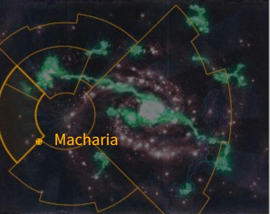

# 0967 马卡里亚 Macharia

精校状态：中文行文已逐段精校，部分术语仍为暂定

分类：地理 / 真实空间 Real Space / 朦胧星域 Segmentum Obscurus

原文来源：https://www.bilibili.com/opus/1169994201534824535

原作者：帝国神选罐头

原文时间：2026年02月16日 21:35

[返回分类目录](目录.md) · [全书目录](../../目录.md)

<!-- A0967-B0001 图片 -->

<!-- A0967-B0002 -->

原译文

Map 地图

**校订译文**

Map 地图

<!-- /A0967-B0002 -->

<!-- A0967-B0003 -->
### Basic Data 基本资料

原题：Basic Data 基础数据

<!-- /A0967-B0003 -->

<!-- A0967-B0004 -->
**英文原文**

Name:Macharia

<!-- /A0967-B0004 -->

<!-- A0967-B0005 -->

原译文

名称：马卡里亚

**校订译文**

名称：马卡里亚

<!-- /A0967-B0005 -->

<!-- A0967-B0006 -->
**英文原文**

Segmentum:Segmentum Pacificus

<!-- /A0967-B0006 -->

<!-- A0967-B0007 -->

原译文

星域：太平星域

**校订译文**

星域：太平星域

<!-- /A0967-B0007 -->

<!-- A0967-B0008 -->
**英文原文**

Sector:Macharian Sector

<!-- /A0967-B0008 -->

<!-- A0967-B0009 -->

原译文

星区：马卡里安星区

**校订译文**

星区：马卡里安星区

<!-- /A0967-B0009 -->

<!-- A0967-B0010 -->
**英文原文**

Subsector:Cytheris Sub-Sector

<!-- /A0967-B0010 -->

<!-- A0967-B0011 -->

原译文

分区：西瑟里斯分区

**校订译文**

次星区：西瑟里斯次星区

<!-- /A0967-B0011 -->

<!-- A0967-B0012 -->
**英文原文**

System:Donia Magna System

<!-- /A0967-B0012 -->

<!-- A0967-B0013 -->

原译文

星系：大多尼亚星系

**校订译文**

星系：大多尼亚星系

<!-- /A0967-B0013 -->

<!-- A0967-B0014 -->
**英文原文**

Population:30 billion

<!-- /A0967-B0014 -->

<!-- A0967-B0015 -->

原译文

人口：300亿

**校订译文**

人口：300亿

<!-- /A0967-B0015 -->

<!-- A0967-B0016 -->
**英文原文**

Affiliation:Imperium

<!-- /A0967-B0016 -->

<!-- A0967-B0017 -->

原译文

隶属：帝国

**校订译文**

隶属：帝国

<!-- /A0967-B0017 -->

<!-- A0967-B0018 -->
**英文原文**

Class:Shrine World

<!-- /A0967-B0018 -->

<!-- A0967-B0019 -->

原译文

类别：圣地世界

**校订译文**

类别：圣地世界

<!-- /A0967-B0019 -->

<!-- A0967-B0020 -->
**英文原文**

Macharia is an Imperial Shrine World in Segmentum Pacificus. It was originally known as Donia. It is most famous for being the homeworld of Lord Commander Solar Macharius and the site where he began his famous Macharian Crusade.

<!-- /A0967-B0020 -->

<!-- A0967-B0021 -->

原译文

马卡里亚是太平星域的一个帝国圣地世界。它最初被称为多尼亚。它最著名的是作为太阳领主指挥官马卡里乌斯的家园世界，也是他开始著名的马卡里安远征的地方。

**校订译文**

马卡里亚是太平星域的一颗帝国圣地世界，原名多尼亚。它既是太阳领主指挥官马卡里乌斯的母星，也是著名的马卡里安远征的出发地。

<!-- /A0967-B0021 -->

<!-- A0967-B0022 -->
## Overview 概述

<!-- /A0967-B0022 -->

<!-- A0967-B0023 -->
**英文原文**

Originally known as Donia, upon Macharius' rise to power it was renamed by him to Emperor's Gift and again in the latter stages of the Crusade to Emperor's Glory. After Macharius' death, it was again renamed Macharia in his honour and became the Lord Commander's resting place. Spoils from the Macharian Crusade made Macharia fabulously wealthy, a status it still enjoys today.

<!-- /A0967-B0023 -->

<!-- A0967-B0024 -->

原译文

最初被称为多尼亚，在马卡里乌斯掌权后，它被他重新命名为帝皇的礼物，并在远征的后期再次更名为帝皇的荣耀。马卡里乌斯去世后，它再次更名为马卡里亚，以纪念他，并成为领主指挥官的安息之地。马卡里安远征的战利品使马卡里亚变得极其富有，至今仍享有这一地位。

**校订译文**

马卡里乌斯掌权后，将原名多尼亚的世界改称“帝皇之赐”；远征后期，又改名为“帝皇之耀”。他去世后，行星再次更名为马卡里亚，以纪念这位领主指挥官，并成为其长眠之地。远征战利品使马卡里亚富甲一方，这份财富一直延续至今。

<!-- /A0967-B0024 -->

<!-- A0967-B0025 -->
**英文原文**

Macharia is comparatively easily reached by the Warp for inexplicable reasons which the Ecclesiarchy heralds as a miracle and proof of the Macharius' status as a saint. The planet is covered in marble buildings and shrines, the largest of which can be seen by orbit. Massive numbers of pilgrims, zealots, and beggars inhabit the world, which are kept in line by Frateris Militia. Despite is grandeur and wealth, Macharia's lower levels are nonetheless known to a dark impoverished underbelly nicknamed the "shame of Macharia".

<!-- /A0967-B0025 -->

<!-- A0967-B0026 -->

原译文

由于无法解释的原因，亚空间相对容易到达马卡里亚，国教称这是一个奇迹，证明了马卡里乌斯作为圣人的地位。行星上到处都是大理石建筑和神殿，其中最大的一座可以通过轨道看到。世界上居住着大量的朝圣者、狂热分子和乞丐，他们由兄弟会民兵组织控制。尽管马卡里亚拥有壮丽和财富，但其较低的水平仍然被称为“马卡里亚的耻辱”，一个黑暗贫困的脆弱绰号。

**校订译文**

通过亚空间前往马卡里亚的航程，往往比前往其他世界更容易，原因却无法解释。国教会将其宣扬为奇迹，视作马卡里乌斯圣人身份的证明。行星遍布大理石建筑与神龛，最大的建筑甚至能从轨道上看见。大量朝圣者、狂信徒和乞丐居住于此，由教会民兵维持秩序。然而，在富丽堂皇的表象之下，底层城区依旧阴暗贫困，被称作“马卡里亚之耻”。

<!-- /A0967-B0026 -->

<!-- A0967-B0027 -->
## History 历史

<!-- /A0967-B0027 -->

<!-- A0967-B0028 -->
**英文原文**

In 955.M41 an Ork superkrooza named the Brawla entered Macharia's system on a collision course with the sacred world. Ultimately, Macharia was saved from devastation by the Tempestus Scions of the 196th Omicroid Hydras Regiment, who led a boarding action to destroy the xenos craft with melta charges. The resulting explosion was visible from Macharia.

<!-- /A0967-B0028 -->

<!-- A0967-B0029 -->

原译文

955.M41，一个被称为斗殴者的欧克超级巡洋舰进入了马卡里亚的星系，与圣地世界发生了碰撞。最终，马卡里亚被第196奥米克洛伊德九头蛇兵团的暴风忠嗣从毁灭中拯救出来，他们领导了一次跳帮行动，用热熔炸药摧毁了异型战舰。从马卡里亚可以看到由此产生的爆炸。

**校订译文**

955.M41，一艘名为斗殴者号的欧克超级巡洋舰闯入马卡里亚星系，沿着即将撞向这颗圣地世界的航线前进。第196奥米克洛伊德九头蛇团的风暴忠嗣军发动跳帮，用热熔装药炸毁异形舰船，才让马卡里亚免遭毁灭。从行星上也能看见爆炸的光芒。

**校注：** on a collision course表示正驶向碰撞，不表示已经撞上星球。

<!-- /A0967-B0029 -->

<!-- A0967-B0030 -->
**英文原文**

During the Noctis Aeterna, Macharia faced a dilemma when the vast numbers of pilgrims of the world could no longer be sent away due to the paralysis of the Astronomican. Camps were erected across its endless shrines, and many Psykers emerged amongst the populace. This caused the influential Cardinal Nolis Rayne to declare that they were chosen by the Emperor himself and soon himself demonstrated his own supposedly divinely-granted psychic abilities. The resulting schism tore Macharia apart in holy war. The Adepta Sororitas and Arch-Cardinal Molinair declared Rayne a heretic, and soon the forces of Chaos manifested in his ranks. Rayne was forced retreat to parts unknown.

<!-- /A0967-B0030 -->

<!-- A0967-B0031 -->

原译文

在永恒之夜期间，马卡里亚面临着一个困境，即由于星炬的瘫痪，世界上大量的朝圣者无法再被送走。营地建在无尽的圣地上，许多灵能者出现在民众中。这导致有影响力的红衣主教诺利斯·雷恩宣布，他们是由帝皇自己选择的，很快他自己就展示了自己所谓的神圣赐予的灵能能力。由此产生的分裂使马卡里亚在圣战中四分五裂。修女会和大红衣主教摩林纳尔宣布雷恩为异端，很快混沌的部队在他的队伍中显现出来。雷恩被迫撤退到未知的地方。

**校订译文**

永恒之夜期间，星炬瘫痪，马卡里亚的大批朝圣者无法离开，各处神殿周围遂遍布营地。民众中接连涌现灵能者，颇有影响力的红衣主教诺利斯·雷恩便宣称，他们皆为帝皇亲自选中；不久，他自己也展现出号称神赐的灵能。这场宗教分裂最终引发圣战，使马卡里亚陷入内乱。修女会与大红衣主教摩林纳尔宣布雷恩为异端，随后混沌势力果然在其阵营中现身。雷恩最终被迫逃往不明之地。

<!-- /A0967-B0031 -->

<!-- A0967-B0032 -->
## Locations 地点

<!-- /A0967-B0032 -->

<!-- A0967-B0033 -->
**英文原文**

Tomb of Macharius - Continent-sized mausoleum. The tomb of Macharius itself is located near the spot where he was born (while conflicting sources state it to be the spot he first set foot on the world). Macharius' own flagship, Lord of Light, has been altered to withstand the atmosphere and hangs permanently above the tomb-complex. The Tomb is also the site of one of the most advanced Imperial military academies, the Schola Macharia.

<!-- /A0967-B0033 -->

<!-- A0967-B0034 -->

原译文

马卡里乌斯之墓 - 大陆大小的陵墓。马卡里乌斯之墓位于他出生的地方附近（而相互矛盾的消息来源称，这是他第一次踏上世界的地方）。马卡里乌斯自己的旗舰“光明领主”已经过改造，可以承受这种大气，并永久悬停在陵墓建筑群上方。该墓也是最先进的帝国军事学院之一马卡里亚学院的所在地。

**校订译文**

马卡里乌斯之墓——规模堪比大陆的陵墓群。马卡里乌斯本人的墓室位于其出生地附近，但另有相互矛盾的来源称，这里是他首次踏上该世界的地方。他的旗舰光之领主号经过改装，能够承受大气环境，永久悬停于陵墓群上空。帝国最先进的军事学院之一——马卡里亚学院——也坐落于此。

**校注：** 出生地与首次登陆地的说法在英文中已标明冲突，保留两种说法，不推定一方正确。

<!-- /A0967-B0034 -->

<!-- A0967-B0035 -->
**英文原文**

Schola Momento Mori - Schola Progenium facility

<!-- /A0967-B0035 -->

<!-- A0967-B0036 -->

原译文

纪念死亡学院 - 忠嗣学院设施

**校订译文**

铭记死亡学院——忠嗣学院设施。

<!-- /A0967-B0036 -->

<!-- A0967-B0037 -->
**英文原文**

Lord Solar's Palace - Titanic structure that was once the site of Macharius' personal rule, though in truth he seldom ever was in it. It is now the site of museums dedicated to the Macharius Crusade and is managed and protected by throngs of Priests, Crusaders, Missionaries, Ministorum scribes, and Adepta Sororitas. It is known for its frequent and sometimes bloody political intrigue between the various Ecclesiarchy factions that operate within the Palace.

<!-- /A0967-B0037 -->

<!-- A0967-B0038 -->

原译文

太阳领主宫殿 - 泰坦级建筑，曾经是马卡里乌斯个人统治的地点，尽管事实上他很少在里面。现在它是专门纪念马卡里乌斯远征军的博物馆所在地，由一群牧师、十字军、传教士、国教抄写员和修女会管理和保护。它以在宫殿内运作的各种国教派系之间频繁且有时血腥的政治阴谋而闻名。

**校订译文**

太阳领主宫殿——一座规模惊人的建筑，曾是马卡里乌斯亲自执政的场所，尽管他实际上鲜少驻留。如今，这里设有纪念马卡里安远征的博物馆，由大批牧师、十字军、传教士、国教抄写员及战斗修女管理守卫。宫内各国教派系之间的政治阴谋频繁发生，有时甚至演变为流血冲突。

**校注：** Titanic是规模巨大，不是泰坦级型号；Macharius Crusade与Macharian Crusade同指该远征。

<!-- /A0967-B0038 -->

<!-- A0967-B0039 -->
**英文原文**

Schola of Our Lord Solar - Schola Progenium facility

<!-- /A0967-B0039 -->

<!-- A0967-B0040 -->

原译文

我们的太阳领主学院 - 忠嗣学院设施

**校订译文**

吾主太阳领主学院——忠嗣学院设施。

<!-- /A0967-B0040 -->

<!-- A0967-B0041 -->
**英文原文**

Macharian Confessional - Fortress that spans half a continent.

<!-- /A0967-B0041 -->

<!-- A0967-B0042 -->

原译文

马卡里安告解室 - 横跨半个大陆的堡垒。

**校订译文**

马卡里安告解室 - 横跨半个大陆的堡垒。

<!-- /A0967-B0042 -->

<!-- A0967-B0043 -->
**英文原文**

Fortress-Cathedral of the Order of the Charred Veil.

<!-- /A0967-B0043 -->

<!-- A0967-B0044 -->

原译文

焦黑面纱修会要塞大教堂。

**校订译文**

焦黑面纱修会要塞大教堂。

<!-- /A0967-B0044 -->

<!-- A0967-B0045 -->
**英文原文**

Solar Torch - Order Hospitaller facility

<!-- /A0967-B0045 -->

<!-- A0967-B0046 -->

原译文

太阳火炬 - 医院修会设施

**校订译文**

太阳火炬——医疗修会设施。

<!-- /A0967-B0046 -->

<!-- A0967-B0047 -->
**英文原文**

Solar Quill - Order Dialogus facility

<!-- /A0967-B0047 -->

<!-- A0967-B0048 -->

原译文

太阳羽毛笔 - 交流修会设施

**校订译文**

太阳羽毛笔——书记修会设施。

<!-- /A0967-B0048 -->

<!-- A0967-B0049 -->

原译文

Solar Reach 太阳领域

**校订译文**

Solar Reach 太阳领域

<!-- /A0967-B0049 -->

<!-- A0967-B0050 -->

原译文

Magna Basilica 伟大圣殿

**校订译文**

Magna Basilica 伟大圣殿

<!-- /A0967-B0050 -->

<!-- A0967-B0051 -->
## Government 政府

<!-- /A0967-B0051 -->

<!-- A0967-B0052 -->
**英文原文**

Today, Macharia is technically overseen by Arch-Confessor Evaristus Helical, though he is now a senile figurehead of Arch-Cardinal Molinair.

<!-- /A0967-B0052 -->

<!-- A0967-B0053 -->

原译文

今天，马卡里亚在技术上由大告解者埃瓦里斯图斯·赫利卡尔监督，尽管他现在是大红衣主教摩林纳尔的衰老傀儡。

**校订译文**

如今，马卡里亚名义上由大告解者埃瓦里斯图斯·赫利卡尔统管，但他年老昏聩，已沦为大红衣主教摩林纳尔的傀儡。

**校注：** technically在此是名义上，不是技术上。

<!-- /A0967-B0053 -->

本篇核心术语与暂定项

以下列出本篇出现的英文原形及核心术语表用词。同形词可能指不同对象，具体词义以本篇正文和校注为准；单复数、别名和仅见于图注的名称可能尚未列入。完整候选见[术语表](../../术语表/双语术语候选.csv)。

| 英文 | 采用中文 | 状态 |
| --- | --- | --- |
| Adepta Sororitas | 修女会 | 官方已核对 |
| Astronomican | 星炬 | 暂定 |
| Warp | 亚空间 | 官方已核对 |
| Imperium | 帝国 | 暂定·简称 |
| Conflicting sources | 来源冲突 | 编辑用语已统一 |
| Emperor | 帝皇 | 官方已核对 |
| Ecclesiarchy | 国教会 | 暂定 |
| Shrine World | 圣地世界 | 暂定·官方待核 |
| Schola Progenium | 忠嗣学院 | 暂定·官方待核 |
| The Order | 秩序 | 暂定·官方待核 |
| Frateris Militia | 教会民兵 | 暂定·官方待核 |
| Segmentum Pacificus | 太平星域 | 暂定·官方待核 |
| Segmentum | 星域 | 暂定·官方待核 |
| Sector | 星区 | 暂定·官方待核 |
| Subsector | 次星区 | 暂定·官方待核 |
| Macharia | 马卡里亚 | 暂定·官方待核 |
| Cardinal | 红衣主教 | 暂定 |
| Confessor | 告解者 | 暂定 |
| Hospitaller | 医疗修女 | 官方已核对 |
| Dialogus | 书记修女 | 官方已核对 |
| Veil | 韦尔 | 暂定·官方待核 |
| Lord Commander | 领主指挥官 | 暂定·官方待核 |
| Crusaders | 十字军 | 暂定·官方待核 |
| Lord Solar | 太阳领主 | 暂定·官方待核 |
| Tempestus Scions | 风暴忠嗣军 | 官方已核对 |
| Xenos | 异形 | 暂定·官方待核 |
| Scribes | 抄写员 | 暂定·官方待核 |
| Arch-Cardinal | 大红衣主教 | 暂定·官方待核 |
| System | 星系（恒星系统） | 暂定·官方待核 |
| Noctis Aeterna | 永恒之夜 | 暂定·官方待核 |
| Macharian Crusade | 马卡里安远征 | 暂定·官方待核 |
| Macharius | 马卡里乌斯 | 暂定·官方待核 |
| Lord Commander Solar | 太阳领主指挥官 | 暂定·官方待核 |
| Lord of Light | 光之领主号 | 暂定·官方待核 |
| Cytheris Sub-Sector | 西瑟里斯次星区 | 暂定·官方待核 |
| Donia Magna System | 大多尼亚星系 | 暂定·官方待核 |
| Brawla | 斗殴者号 | 暂定·官方待核 |
| Nolis Rayne | 诺利斯·雷恩 | 暂定·官方待核 |
| Molinair | 摩林纳尔 | 暂定·官方待核 |
| Schola Macharia | 马卡里亚学院 | 暂定·官方待核 |
| Schola Momento Mori | 铭记死亡学院 | 暂定·官方待核 |
| Order of the Charred Veil | 焦黑面纱修会 | 暂定·官方待核 |
| Evaristus Helical | 埃瓦里斯图斯·赫利卡尔 | 暂定·官方待核 |

