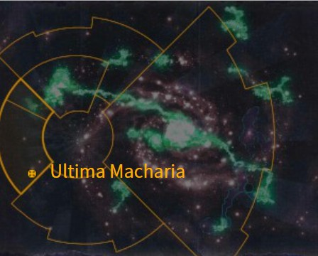

# 0969 极限马卡里亚 Ultima Macharia

精校状态：中文行文已逐段精校，部分术语仍为暂定

分类：地理 / 真实空间 Real Space / 朦胧星域 Segmentum Obscurus

原文来源：https://www.bilibili.com/opus/1169994244459331593

原作者：帝国神选罐头

原文时间：2026年02月16日 21:35

[返回分类目录](目录.md) · [全书目录](../../目录.md)

原篇名：终极马卡里亚 Ultima Macharia

<!-- A0969-B0001 图片 -->

<!-- A0969-B0002 -->

原译文

Map 地图

**校订译文**

Map 地图

<!-- /A0969-B0002 -->

<!-- A0969-B0003 -->
### Basic Data 基本资料

原题：Basic Data 基础数据

<!-- /A0969-B0003 -->

<!-- A0969-B0004 -->
**英文原文**

Name:Ultima Macharia

<!-- /A0969-B0004 -->

<!-- A0969-B0005 -->

原译文

名称：终极马卡里亚

**校订译文**

名称：极限马卡里亚

<!-- /A0969-B0005 -->

<!-- A0969-B0006 -->
**英文原文**

Segmentum:Segmentum Pacificus

<!-- /A0969-B0006 -->

<!-- A0969-B0007 -->

原译文

星域：太平星域

**校订译文**

星域：太平星域

<!-- /A0969-B0007 -->

<!-- A0969-B0008 -->
**英文原文**

Sector:Halo Zone

<!-- /A0969-B0008 -->

<!-- A0969-B0009 -->

原译文

星区：光环区

**校订译文**

星区：光环区

<!-- /A0969-B0009 -->

<!-- A0969-B0010 -->
**英文原文**

Affiliation:Imperium

<!-- /A0969-B0010 -->

<!-- A0969-B0011 -->

原译文

隶属：帝国

**校订译文**

隶属：帝国

<!-- /A0969-B0011 -->

<!-- A0969-B0012 -->
**英文原文**

Class:Shrine World

<!-- /A0969-B0012 -->

<!-- A0969-B0013 -->

原译文

类别：圣地世界

**校订译文**

类别：圣地世界

<!-- /A0969-B0013 -->

<!-- A0969-B0014 -->
**英文原文**

Ultima Macharia is the final world to have been conquered during the Macharian Crusade. The planet is home to the Great Column, a gigantic memorial to Solar Macharius that can be seen from high orbit.

<!-- /A0969-B0014 -->

<!-- A0969-B0015 -->

原译文

终极马卡里亚是马卡里安远征期间被征服的最后一个世界。这颗行星是巨柱的所在地，这是一个巨大的纪念太阳领主马卡里乌斯的纪念碑，可以从高轨道上看到。

**校订译文**

极限马卡里亚是马卡里安远征征服的最后一个世界。行星上矗立着纪念太阳领主马卡里乌斯的巨柱，这座庞大的纪念碑从高轨道上也清晰可见。

<!-- /A0969-B0015 -->

<!-- A0969-B0016 -->
## History 历史

<!-- /A0969-B0016 -->

<!-- A0969-B0017 -->
**英文原文**

It is located in the Halo Zone, beyond the reach of the Astronomican and outside of the Segmentum Pacificus region. It was here that Macharius's troops refused to go any further, and the crusade ended. It is a testament to the fearsome nature of Macharius that he managed to get this far in the name of the Emperor. It was the one thousandth planet to be conquered under the 2nd Army Group, under General Sejanus. Later, Lord Inquisitor Karamazov oversaw bloody purges on the planet.

<!-- /A0969-B0017 -->

<!-- A0969-B0018 -->

原译文

它位于光环区，超出了星炬的范围，也不在太平星域地区。正是在这里，马卡里乌斯的军队拒绝继续前进，远征结束了。这证明了马卡里乌斯的可怕本性，他以帝皇的名义走了这么远。这是塞扬努斯将军率领的第二集团军征服的第一千颗行星。后来，领主审判官卡拉马佐夫监督了行星上的血腥清洗。

**校订译文**

该星位于光环区，处于星炬照射范围及太平星域之外。马卡里乌斯的军队在这里拒绝继续前进，远征也就此结束。马卡里乌斯能以帝皇之名推进到如此遥远之处，足见他令人敬畏的威势。这是塞扬努斯将军率领的第二集团军征服的第一千颗行星。后来，审判官领主卡拉马佐夫监督了这颗行星上的血腥清洗。

**校注：** 底稿正文称行星位于太平星域之外，但本条基础数据将其列入太平星域，968又称光环区为太平星域内的区域。三处分类不一致，暂保留原文并待核。fearsome character 指马卡里乌斯令人敬畏的威势，非“可怕本性”。

<!-- /A0969-B0018 -->

<!-- A0969-B0019 -->
**英文原文**

All contact was lost with Ultima Macharia in 999.M41, due to the dimming of the light of the Astronomican.

<!-- /A0969-B0019 -->

<!-- A0969-B0020 -->

原译文

由于星炬的光线变暗，在999.M41与终极马卡里亚失去了所有联系。

**校订译文**

999.M41，随着星炬的光芒变得暗淡，帝国与极限马卡里亚完全失去了联系。

<!-- /A0969-B0020 -->

本篇核心术语与暂定项

以下列出本篇出现的英文原形及核心术语表用词。同形词可能指不同对象，具体词义以本篇正文和校注为准；单复数、别名和仅见于图注的名称可能尚未列入。完整候选见[术语表](../../术语表/双语术语候选.csv)。

| 英文 | 采用中文 | 状态 |
| --- | --- | --- |
| Astronomican | 星炬 | 暂定 |
| Inquisitor | 审判官 | 官方已核对 |
| Imperium | 帝国 | 暂定·简称 |
| Emperor | 帝皇 | 官方已核对 |
| Shrine World | 圣地世界 | 暂定·官方待核 |
| Segmentum Pacificus | 太平星域 | 暂定·官方待核 |
| Segmentum | 星域 | 暂定·官方待核 |
| Sector | 星区 | 暂定·官方待核 |
| Halo Zone | 光环区 | 暂定·官方待核 |
| Macharia | 马卡里亚 | 暂定·官方待核 |
| Ultima Macharia | 极限马卡里亚 | 暂定·官方待核 |
| Macharian Crusade | 马卡里安远征 | 暂定·官方待核 |
| Macharius | 马卡里乌斯 | 暂定·官方待核 |
| Army Group | 集团军群 | 暂定·官方待核 |
| General Sejanus | 塞扬努斯将军 | 暂定·官方待核 |
| Great Column | 巨柱 | 暂定·官方待核 |

