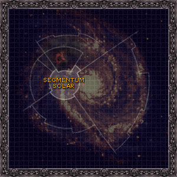
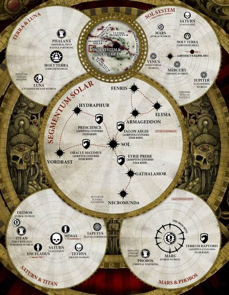

# 0970 太阳星域 Segmentum Solar

精校状态：中文行文已逐段精校，部分术语仍为暂定

分类：地理 / 真实空间 Real Space / 太阳星域 Segmentum Solar

原文来源：https://www.bilibili.com/opus/1152363330715779079

原作者：帝国神选罐头

原文时间：2025年12月31日 09:18

[返回分类目录](目录.md) · [全书目录](../../目录.md)

<!-- A0970-B0001 -->
**英文原文**

The Segmentum Solar is one of the Segmentums, divisions of the Galaxy, of the Imperium. Its Segmentum Fortress is located at Mars. Its most notable feature is Terra, the homeworld of mankind. Segmentum Solar is the core of Imperial space and represents the foundations of Mankind. It has been the most densely settled Human region of the Galaxy since the Dark Age of Technology.

<!-- /A0970-B0001 -->

<!-- A0970-B0002 -->

原译文

太阳星域是帝国星域之一，银河系的一部分。它的星域堡垒位于火星。它最显著的特点是泰拉，人类的家园世界。太阳星域是帝国空域的核心，代表着人类的基础。它是自黑暗技术时代以来银河系人类居住密度最高的地区。

**校订译文**

太阳星域是帝国划分银河行政区域的星域之一，其星域要塞设于火星。人类的母星泰拉也位于这里。自黑暗科技时代以来，太阳星域一直是银河中人口最稠密的地区。

<!-- /A0970-B0002 -->

<!-- A0970-B0003 图片 -->

<!-- A0970-B0004 -->

原译文

Galactic map of Segmentum Solar 太阳星域银河系地图

**校订译文**

Galactic map of Segmentum Solar 太阳星域银河系地图

<!-- /A0970-B0004 -->

<!-- A0970-B0005 -->
## Notable Planets 著名行星

<!-- /A0970-B0005 -->

<!-- A0970-B0006 图片 -->

<!-- A0970-B0007 -->

原译文

Map of key locations within Segmentum Solar 太阳星域内部关键位置地图

**校订译文**

Map of key locations within Segmentum Solar 太阳星域内部关键位置地图

<!-- /A0970-B0007 -->

<!-- A0970-B0008 -->

原译文

Ardamantua 阿达曼图阿

**校订译文**

Ardamantua 阿达曼图阿

<!-- /A0970-B0008 -->

<!-- A0970-B0009 -->

原译文

Armageddon 阿玛吉多顿

**校订译文**

Armageddon 阿玛吉多顿

<!-- /A0970-B0009 -->

<!-- A0970-B0010 -->

原译文

Atoma Prime 阿托马一号

**校订译文**

Atoma Prime 阿托马主星

<!-- /A0970-B0010 -->

<!-- A0970-B0011 -->

原译文

Barbarossa IV 巴巴罗萨四号

**校订译文**

Barbarossa IV 巴巴罗萨四号

<!-- /A0970-B0011 -->

<!-- A0970-B0012 -->

原译文

Benediction 祝福星

**校订译文**

Benediction 祝福星

<!-- /A0970-B0012 -->

<!-- A0970-B0013 -->

原译文

Beta-Garmon II 贝塔-伽蒙二号

**校订译文**

Beta-Garmon II 贝塔-伽蒙二号

<!-- /A0970-B0013 -->

<!-- A0970-B0014 -->

原译文

Chrysis 克利西斯

**校订译文**

Chrysis 克里西斯

<!-- /A0970-B0014 -->

<!-- A0970-B0015 -->

原译文

Conqueror's Due 征服者之权

**校订译文**

Conqueror's Due 征服者之权

<!-- /A0970-B0015 -->

<!-- A0970-B0016 -->

原译文

Cthonia 科索尼亚

**校订译文**

Cthonia 科索尼亚

<!-- /A0970-B0016 -->

<!-- A0970-B0017 -->

原译文

Eidolica 艾多利卡

**校订译文**

Eidolica 艾多利卡

<!-- /A0970-B0017 -->

<!-- A0970-B0018 -->

原译文

Elysia 艾丽西亚

**校订译文**

Elysia 艾丽西亚

<!-- /A0970-B0018 -->

<!-- A0970-B0019 -->

原译文

Gathalamor 加拉塔莫

**校订译文**

Gathalamor 加塔拉莫

<!-- /A0970-B0019 -->

<!-- A0970-B0020 -->

原译文

Hermetica 何米狄克

**校订译文**

Hermetica 何米狄克

<!-- /A0970-B0020 -->

<!-- A0970-B0021 -->

原译文

Heta-Gladius 赫塔-格拉迪乌斯

**校订译文**

Heta-Gladius 赫塔-格拉迪乌斯

<!-- /A0970-B0021 -->

<!-- A0970-B0022 -->

原译文

Jupiter 木星

**校订译文**

Jupiter 木星

<!-- /A0970-B0022 -->

<!-- A0970-B0023 -->

原译文

Mars 火星

**校订译文**

Mars 火星

<!-- /A0970-B0023 -->

<!-- A0970-B0024 -->

原译文

Molech 摩洛

**校订译文**

Molech 摩洛

<!-- /A0970-B0024 -->

<!-- A0970-B0025 -->

原译文

Necromunda 涅克罗蒙达

**校订译文**

Necromunda 涅克罗蒙达

<!-- /A0970-B0025 -->

<!-- A0970-B0026 -->

原译文

Nikaea 尼凯亚

**校订译文**

Nikaea 尼凯亚

<!-- /A0970-B0026 -->

<!-- A0970-B0027 -->

原译文

Paramar V 帕拉马尔五号

**校订译文**

Paramar V 帕拉马尔五号

<!-- /A0970-B0027 -->

<!-- A0970-B0028 -->

原译文

Phaeton 法厄同

**校订译文**

Phaeton 法厄同

<!-- /A0970-B0028 -->

<!-- A0970-B0029 -->

原译文

Port Sanctus 圣港

**校订译文**

Port Sanctus 圣港

<!-- /A0970-B0029 -->

<!-- A0970-B0030 -->

原译文

Saturn 土星

**校订译文**

Saturn 土星

<!-- /A0970-B0030 -->

<!-- A0970-B0031 -->

原译文

Titan 泰坦

**校订译文**

Titan 泰坦

<!-- /A0970-B0031 -->

<!-- A0970-B0032 -->

原译文

Tarrengast 塔伦加斯特

**校订译文**

Tarrengast 塔伦加斯特

<!-- /A0970-B0032 -->

<!-- A0970-B0033 -->

原译文

Terra 泰拉

**校订译文**

Terra 泰拉

<!-- /A0970-B0033 -->

<!-- A0970-B0034 -->

原译文

Luna 月球

**校订译文**

Luna 月球

<!-- /A0970-B0034 -->

<!-- A0970-B0035 -->

原译文

Srinagar 斯利那加

**校订译文**

Srinagar 斯利那加

<!-- /A0970-B0035 -->

<!-- A0970-B0036 -->

原译文

Urk 乌尔克

**校订译文**

Urk 乌尔克

<!-- /A0970-B0036 -->

<!-- A0970-B0037 -->

原译文

Vorlese 沃勒斯

**校订译文**

Vorlese 沃勒斯

<!-- /A0970-B0037 -->

<!-- A0970-B0038 -->

原译文

Voss Prime 沃斯一号

**校订译文**

Voss Prime 沃斯主星

<!-- /A0970-B0038 -->

<!-- A0970-B0039 -->
## Notable Other Celestial Objects 其他著名天体

<!-- /A0970-B0039 -->

<!-- A0970-B0040 -->

原译文

Trail of Saint Evisser 圣艾维瑟之路

**校订译文**

Trail of Saint Evisser 圣艾维瑟之路

<!-- /A0970-B0040 -->

<!-- A0970-B0041 -->

原译文

The Comet 彗星

**校订译文**

The Comet 彗星

<!-- /A0970-B0041 -->

<!-- A0970-B0042 -->
## Notable Sectors, Systems, Regions 著名星区，星系，地区

<!-- /A0970-B0042 -->

<!-- A0970-B0043 -->

原译文

Alaxxes Nebula 阿拉克西斯星云

**校订译文**

Alaxxes Nebula 阿拉克西斯星云

<!-- /A0970-B0043 -->

<!-- A0970-B0044 -->

原译文

Armageddon Sector 阿玛吉多顿星区

**校订译文**

Armageddon Sector 阿玛吉多顿星区

<!-- /A0970-B0044 -->

<!-- A0970-B0045 -->

原译文

Beta-Garmon Star Cluster 贝塔-伽蒙星群

**校订译文**

Beta-Garmon Star Cluster 贝塔-伽蒙星群

<!-- /A0970-B0045 -->

<!-- A0970-B0046 -->

原译文

Chonma Sector 天马星区

**校订译文**

Chonma Sector 天马星区

<!-- /A0970-B0046 -->

<!-- A0970-B0047 -->

原译文

Cypra Segentus System 西普拉·塞根图斯星系

**校订译文**

Cypra Segentus System 西普拉·塞根图斯星系

<!-- /A0970-B0047 -->

<!-- A0970-B0048 -->

原译文

Fourth Quadrant 第四象限

**校订译文**

Fourth Quadrant 第四象限

<!-- /A0970-B0048 -->

<!-- A0970-B0049 -->

原译文

Jopal System 乔帕尔星系

**校订译文**

Jopal System 乔帕尔星系

<!-- /A0970-B0049 -->

<!-- A0970-B0050 -->

原译文

Moebian Domain 莫比安领域

**校订译文**

Moebian Domain 莫比安领域

<!-- /A0970-B0050 -->

<!-- A0970-B0051 -->

原译文

Necromunda System 涅克罗蒙达星系

**校订译文**

Necromunda System 涅克罗蒙达星系

<!-- /A0970-B0051 -->

<!-- A0970-B0052 -->

原译文

Oddyssian System 奥德赛星系

**校订译文**

Oddyssian System 奥德赛星系

<!-- /A0970-B0052 -->

<!-- A0970-B0053 -->

原译文

Quintillus System 昆提卢斯星系

**校订译文**

Quintillus System 昆提卢斯星系

<!-- /A0970-B0053 -->

<!-- A0970-B0054 -->

原译文

Sector Solar 太阳星区

**校订译文**

Sector Solar 太阳星区

<!-- /A0970-B0054 -->

<!-- A0970-B0055 -->

原译文

Sol System 太阳星系

**校订译文**

Sol System 太阳系

<!-- /A0970-B0055 -->

<!-- A0970-B0056 -->

原译文

Veritus Sub-Sector 维里图斯分区

**校订译文**

Veritus Sub-Sector 维里图斯次星区

<!-- /A0970-B0056 -->

<!-- A0970-B0057 -->

原译文

Talledus System 塔列多斯星系

**校订译文**

Talledus System 塔列多斯星系

<!-- /A0970-B0057 -->

<!-- A0970-B0058 -->
## Other Segmentums 其他星域

<!-- /A0970-B0058 -->

<!-- A0970-B0059 -->
**英文原文**

Segmentum Pacificus — Galactic West

<!-- /A0970-B0059 -->

<!-- A0970-B0060 -->

原译文

太平星域 — 银河西部

**校订译文**

太平星域 — 银河西部

<!-- /A0970-B0060 -->

<!-- A0970-B0061 -->
**英文原文**

Segmentum Obscurus — Galactic North

<!-- /A0970-B0061 -->

<!-- A0970-B0062 -->

原译文

朦胧星域 — 银河北部

**校订译文**

朦胧星域 — 银河北部

<!-- /A0970-B0062 -->

<!-- A0970-B0063 -->
**英文原文**

Ultima Segmentum — Galactic East

<!-- /A0970-B0063 -->

<!-- A0970-B0064 -->

原译文

极限星域 — 银河东部

**校订译文**

极限星域 — 银河东部

<!-- /A0970-B0064 -->

<!-- A0970-B0065 -->
**英文原文**

Segmentum Tempestus — Galactic South

<!-- /A0970-B0065 -->

<!-- A0970-B0066 -->

原译文

暴风星域 — 银河南部

**校订译文**

暴风星域 — 银河南部

<!-- /A0970-B0066 -->

本篇核心术语与暂定项

以下列出本篇出现的英文原形及核心术语表用词。同形词可能指不同对象，具体词义以本篇正文和校注为准；单复数、别名和仅见于图注的名称可能尚未列入。完整候选见[术语表](../../术语表/双语术语候选.csv)。

| 英文 | 采用中文 | 状态 |
| --- | --- | --- |
| Imperium | 帝国 | 暂定·简称 |
| Dark Age of Technology | 黑暗科技时代 | 暂定 |
| Terra | 泰拉 | 暂定·官方待核 |
| Segmentum Solar | 太阳星域 | 暂定·官方待核 |
| Segmentum Pacificus | 太平星域 | 暂定·官方待核 |
| Segmentum Obscurus | 朦胧星域 | 暂定·官方待核 |
| Segmentum Tempestus | 暴风星域 | 暂定·官方待核 |
| Ultima Segmentum | 极限星域 | 暂定·官方待核 |
| Segmentum | 星域 | 暂定·官方待核 |
| Mars | 火星 | 暂定·官方待核 |
| Obscurus | 朦胧星 | 暂定·官方待核 |
| The Dark | 《黑暗》 | 暂定·官方待核 |
| Segmentum Fortress | 星域堡垒 | 暂定·官方待核 |

