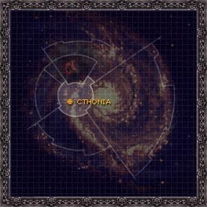
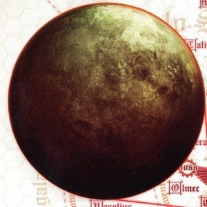

# 0971 科索尼亚 Cthonia

精校状态：中文行文已逐段精校，部分术语仍为暂定

分类：地理 / 真实空间 Real Space / 太阳星域 Segmentum Solar

原文来源：https://www.bilibili.com/opus/1101900398411644963

原作者：帝国神选罐头

原文时间：2025年08月17日 09:36

[返回分类目录](目录.md) · [全书目录](../../目录.md)

<!-- A0971-B0001 图片 -->

<!-- A0971-B0002 -->

原译文

Map 地图

**校订译文**

Map 地图

<!-- /A0971-B0002 -->

<!-- A0971-B0003 -->
### Basic Data 基本资料

原题：Basic Data 基础信息

<!-- /A0971-B0003 -->

<!-- A0971-B0004 -->
**英文原文**

Name:Cthonia

<!-- /A0971-B0004 -->

<!-- A0971-B0005 -->

原译文

名称：科索尼亚

**校订译文**

名称：科索尼亚

<!-- /A0971-B0005 -->

<!-- A0971-B0006 -->
**英文原文**

Segmentum:Segmentum Solar

<!-- /A0971-B0006 -->

<!-- A0971-B0007 -->

原译文

星域：太阳星域

**校订译文**

星域：太阳星域

<!-- /A0971-B0007 -->

<!-- A0971-B0008 -->
**英文原文**

Population:Approx. 2 billion (before destruction)

<!-- /A0971-B0008 -->

<!-- A0971-B0009 -->

原译文

人口：约20亿（毁灭前）

**校订译文**

人口：约20亿（毁灭前）

<!-- /A0971-B0009 -->

<!-- A0971-B0010 -->
**英文原文**

Affiliation:Imperium/Sons of Horus

<!-- /A0971-B0010 -->

<!-- A0971-B0011 -->

原译文

隶属：帝国/荷鲁斯之子

**校订译文**

隶属：帝国/荷鲁斯之子

<!-- /A0971-B0011 -->

<!-- A0971-B0012 -->
**英文原文**

Class:Destroyed, former Adeptus Astartes Homeworld/Feral World/Mining World

<!-- /A0971-B0012 -->

<!-- A0971-B0013 -->

原译文

级别：毁灭，前阿斯塔特修会家园世界/蛮荒世界/矿业世界

**校订译文**

类别：已毁灭；原为星际战士母星／蛮荒世界／矿业世界

<!-- /A0971-B0013 -->

<!-- A0971-B0014 图片 -->

<!-- A0971-B0015 -->

原译文

Planetary Image 行星图片

**校订译文**

Planetary Image 行星图片

<!-- /A0971-B0015 -->

<!-- A0971-B0016 -->
**英文原文**

Cthonia was the world on which Horus landed after being stolen from the grip of the Emperor.

<!-- /A0971-B0016 -->

<!-- A0971-B0017 -->

原译文

科索尼亚是荷鲁斯从帝皇手中被偷走后登陆的世界。

**校订译文**

荷鲁斯从帝皇身边被掳走后，流落到了科索尼亚。

<!-- /A0971-B0017 -->

<!-- A0971-B0018 -->
## History 历史

<!-- /A0971-B0018 -->

<!-- A0971-B0019 -->
**英文原文**

A den of hive-sprawls and polluted industry, Cthonia existed in one of Earth's closest neighbouring systems. Being within reach even for non-warp spacecraft, Cthonia had been colonised, built upon, tunnelled and mined probably since the dawn of space travel. As such, all natural resources had been stripped away and used up millennia before, and the ancient mining technology had long since been rediscovered and removed by the Adeptus Mechanicus of Mars. The planet that remained was largely redundant and abandoned, described as rocky and volcanic, completely riddled with catacombs, crumbling industrial plants and exhausted mine-workings. The planet was notorious for the vicious gangs and slums. Most of its population fought and died with each other in the labyrinthine tunnels below the Mechanicum-ruled surface. At the planet's heart was a massive volcanic cavern that the gangs used to incinerate their dead.

<!-- /A0971-B0019 -->

<!-- A0971-B0020 -->

原译文

科索尼亚是一个巢都蔓延和污染工业的巢穴，存在于地球的最近的邻近星系之一。即使是非亚空间航天器也能到达，科索尼亚可能从太空航行开始就被殖民、建造、挖掘和开采了。因此，所有的自然资源在数千年前就被剥夺和耗尽了，古老的采矿技术早已被火星的机械神教重新发现和移除。剩下的行星基本上是多余和废弃的，被描述为岩石和火山，完全布满了地下墓穴、摇摇欲坠的工业厂房和枯竭的矿井。这个行星因恶毒的帮派和贫民窟而臭名昭著。其大部分人口在机械教统治的地表下的迷宫般的隧道中相互战斗并死亡。这个行星的中心是一个巨大的火山洞穴，帮派们用它来焚烧死者。

**校订译文**

科索尼亚位于距离泰拉最近的恒星系之一，曾遍布连绵的巢都和污染严重的工业设施。即使不用亚空间航行，人类也能抵达这里，因此科索尼亚可能在人类刚开始太空航行时，就已被殖民、建设并大规模采掘。早在数千年前，这里的自然资源便已开采殆尽；火星的机械修会也早已重新发现并移走了那些古老的采矿技术。剩下的行星几乎失去了利用价值，沦为一片废土。其地表多岩石和火山，地下墓穴、摇摇欲坠的工业厂房与枯竭的矿井遍布各处。科索尼亚以凶残的帮派和贫民窟闻名。地表由机械教统治，而大多数居民则在地下迷宫般的隧道中相互厮杀、死去。行星深处有一座巨大的火山洞穴，帮派会在那里焚烧死者。

<!-- /A0971-B0020 -->

<!-- A0971-B0021 -->
**英文原文**

The first Imperial contact with Cthonia took place in the early Great Crusade, when a Star Hunters pioneer company under Captain Kornelius Dure discovered the world and declared it a "nest of serpents coiling in the dark that we would be better to destroy". However, the planet was revealed as the homeworld of Horus, one of the Emperor's lost Primarch's and the first to be rediscovered. Upon incorporation into the Imperium, the Space Marines of the Luna Wolves Legion were created using the human inhabitants of the violent gangs inhabiting the planet's hives. Inhabitants of Cthonia had slightly freckled faces and pale, craggy features.

<!-- /A0971-B0021 -->

<!-- A0971-B0022 -->

原译文

帝国与科索尼亚的第一次接触发生在大远征早期，当时科内利乌斯·杜尔连长领导的一个星辰猎手先锋连队发现了这个世界，并声称它是“黑暗中盘旋的蛇巢，我们最好摧毁它”。然而，这颗行星被揭示为荷鲁斯的家园世界，荷鲁斯是帝皇失去的原体之一，也是第一个被重新发现的。在并入帝国后，影月苍狼军团的星际战士是由居住在行星巢都中的暴力帮派的人类居民创建的。克索尼亚的居民脸上有轻微的雀斑，面色苍白，面容崎岖。

**校订译文**

帝国在大远征早期首次接触科索尼亚：科内利乌斯·杜尔连长率领的一支星辰猎手先锋连发现了这个世界，称它为“黑暗中群蛇盘踞的巢穴，我们最好将其摧毁”。然而，帝国随后发现，这里是失落原体之一荷鲁斯的故乡；按本条叙述，他也是第一个被寻回的原体。科索尼亚并入帝国后，影月苍狼军团从行星巢都的暴力帮派中招募人类，改造为星际战士。科索尼亚人通常肤色苍白、面容棱角分明，脸上带有些许雀斑。

<!-- /A0971-B0022 -->

<!-- A0971-B0023 -->
**英文原文**

During the Horus Heresy, Cthonia was blockaded by the Imperial Fists, who laid siege to the world for several years until the war's end despite attempts by the Sons of Horus under Ashurhaddon to relieve it. In course of the siege, parts of the local population sided with the loyalists, and the Imperial Fists even began to recruit from Cthonia's gangs. The planet was finally destroyed by the Dark Angels at the end of the Heresy in 014.M31.

<!-- /A0971-B0023 -->

<!-- A0971-B0024 -->

原译文

在荷鲁斯叛乱时期，科索尼亚被帝国之拳封锁，尽管阿舒哈顿领导下的荷鲁斯之子试图解除世界的封锁，但帝国之拳仍对世界进行了数年的围困，直到战争结束。在围困过程中，部分当地人站在了忠诚者一边，帝国之拳甚至开始从科索尼亚的帮派中招募人员。这颗行星最终在014.M31叛乱结束时被黑暗天使摧毁。

**校订译文**

荷鲁斯之乱期间，帝国之拳封锁了科索尼亚。尽管阿舒哈顿率领荷鲁斯之子试图打破封锁，帝国之拳仍围困该星数年，直到战争结束。围城期间，部分当地居民支持忠诚派，帝国之拳甚至开始从科索尼亚的帮派中招募新兵。最终，黑暗天使于014.M31、叛乱结束之际摧毁了这颗行星。

<!-- /A0971-B0024 -->

<!-- A0971-B0025 -->
## Geography 地理

<!-- /A0971-B0025 -->

<!-- A0971-B0026 -->
### Notable Locations 著名地点

<!-- /A0971-B0026 -->

<!-- A0971-B0027 -->
**英文原文**

Lupercal's Gate - Immense hive city that before the Age of Strife had been far more heavily populated. Later dubbed Traitor's Gate by the Imperials during the Siege of Cthonia.

<!-- /A0971-B0027 -->

<!-- A0971-B0028 -->

原译文

牧狼神之门 — 这座巨大的巢都城市在纷争时代之前人口要多得多。后来在科索尼亚围城期间被帝国称为叛徒之门。

**校订译文**

卢佩卡尔之门——一座巨大的巢都城市，纷争时代之前的人口远比后来稠密。科索尼亚围城期间，帝国将其称为叛徒之门。

**校注：** 沿已定人物名词根 Lupercal＝卢佩卡尔；原译牧狼神之门。

<!-- /A0971-B0028 -->

<!-- A0971-B0029 -->
**英文原文**

Terminal Atlas - An immense space elevator cable dating back to the Dark Age of Technology which linked the surface to an immense Orbital Plate above.

<!-- /A0971-B0029 -->

<!-- A0971-B0030 -->

原译文

阿特拉斯终点站 - 一条巨大的太空电梯缆线，可以追溯到黑暗技术时代，将表面连接到上面的一个巨大的轨道平台。

**校订译文**

阿特拉斯航空站——一条可追溯至黑暗科技时代的巨大太空电梯缆索，将地表与上方庞大的轨道平台相连。

<!-- /A0971-B0030 -->

<!-- A0971-B0031 -->
**英文原文**

Titan Yards - Despite its title, few Titans were built here but it was a major construction hub for Leman Russ Tanks.

<!-- /A0971-B0031 -->

<!-- A0971-B0032 -->

原译文

泰坦区 - 尽管它的标题是泰坦，但这里建造的泰坦很少，但它是黎曼鲁斯坦克的主要制造中心。

**校订译文**

泰坦工场——虽然以泰坦为名，实际建造的泰坦却很少；这里主要是黎曼鲁斯坦克的制造中心。

**校注：** yards 为制造工场；原“泰坦区”未能体现工业设施性质。

<!-- /A0971-B0032 -->

<!-- A0971-B0033 -->
**英文原文**

Pharos Obscurus - A ruined relic that had once been a beacon for interstellar trade.

<!-- /A0971-B0033 -->

<!-- A0971-B0034 -->

原译文

朦胧灯塔 - 曾经是星际贸易灯塔的废墟遗迹。

**校订译文**

朦胧灯塔——一座曾用于星际贸易导航的信标遗址。

<!-- /A0971-B0034 -->

<!-- A0971-B0035 -->
**英文原文**

Tyrant's Den - Subterranean fortress of the Sons of Horus garrison

<!-- /A0971-B0035 -->

<!-- A0971-B0036 -->

原译文

暴君之巢 - 荷鲁斯之子驻军的地下堡垒

**校订译文**

暴君之巢——荷鲁斯之子驻军的地下堡垒。

<!-- /A0971-B0036 -->

<!-- A0971-B0037 -->
**英文原文**

Aanlok Chasm - Large sinkhole leading into Cthonia's underworld.

<!-- /A0971-B0037 -->

<!-- A0971-B0038 -->

原译文

阿诺克裂口 - 通往科索尼亚地下的大灰岩坑。

**校订译文**

阿诺克裂口——一处通往科索尼亚地下的大型塌陷坑。

**校注：** sinkhole 仅说明塌陷坑，不能据此添加原译“灰岩”这一地质成分。

<!-- /A0971-B0038 -->

<!-- A0971-B0039 -->
**英文原文**

Serpent's Jaws - Large sinkhole leading to Cthonia's underworld.

<!-- /A0971-B0039 -->

<!-- A0971-B0040 -->

原译文

毒蛇之颚 - 通往科索尼亚地下的大灰岩坑。

**校订译文**

毒蛇之颚——一处通往科索尼亚地下的大型塌陷坑。

<!-- /A0971-B0040 -->

<!-- A0971-B0041 -->

原译文

Poison Coast 毒素海岸

**校订译文**

Poison Coast 毒素海岸

<!-- /A0971-B0041 -->

<!-- A0971-B0042 -->

原译文

Yedig Expanse 耶迪格大平原

**校订译文**

Yedig Expanse 耶迪格大平原

<!-- /A0971-B0042 -->

<!-- A0971-B0043 -->

原译文

Vorhek Mountains 沃尔赫克山脉

**校订译文**

Vorhek Mountains 沃尔赫克山脉

<!-- /A0971-B0043 -->

<!-- A0971-B0044 -->

原译文

Zoeker Spire 佐克尖塔

**校订译文**

Zoeker Spire 佐克尖塔

<!-- /A0971-B0044 -->

<!-- A0971-B0045 -->
## Society 社会

<!-- /A0971-B0045 -->

<!-- A0971-B0046 -->
### Known Gangs 著名帮派

<!-- /A0971-B0046 -->

<!-- A0971-B0047 -->

原译文

Abrax Scourge 阿布拉克斯天灾

**校订译文**

Abrax Scourge 阿布拉克斯天灾

<!-- /A0971-B0047 -->

<!-- A0971-B0048 -->

原译文

Black Grin 黑笑

**校订译文**

Black Grin 黑笑

<!-- /A0971-B0048 -->

<!-- A0971-B0049 -->

原译文

Catulans 卡图兰

**校订译文**

Catulans 卡图兰

<!-- /A0971-B0049 -->

<!-- A0971-B0050 -->

原译文

Deeprat Clan 深鼠氏族

**校订译文**

Deeprat Clan 深鼠氏族

<!-- /A0971-B0050 -->

<!-- A0971-B0051 -->

原译文

Eyeless 无眼

**校订译文**

Eyeless 无眼

<!-- /A0971-B0051 -->

<!-- A0971-B0052 -->

原译文

Goredrinkers 饮血者

**校订译文**

Goredrinkers 饮血者

<!-- /A0971-B0052 -->

<!-- A0971-B0053 -->

原译文

Helleboreae 铁筷子族

**校订译文**

Helleboreae 铁筷子族

<!-- /A0971-B0053 -->

<!-- A0971-B0054 -->

原译文

Iron Hunt 钢铁猎手

**校订译文**

Iron Hunt 钢铁猎手

<!-- /A0971-B0054 -->

<!-- A0971-B0055 -->

原译文

Iron Teeth 铁齿

**校订译文**

Iron Teeth 铁齿

<!-- /A0971-B0055 -->

<!-- A0971-B0056 -->

原译文

Justaerin 加斯塔林

**校订译文**

Justaerin 加斯塔林

<!-- /A0971-B0056 -->

<!-- A0971-B0057 -->

原译文

Kraton Reapers 克拉顿收割者

**校订译文**

Kraton Reapers 克拉顿收割者

<!-- /A0971-B0057 -->

<!-- A0971-B0058 -->

原译文

Reivers 掠夺者

**校订译文**

Reivers 掠夺者

<!-- /A0971-B0058 -->

<!-- A0971-B0059 -->

原译文

Rukal 鲁卡尔

**校订译文**

Rukal 鲁卡尔

<!-- /A0971-B0059 -->

<!-- A0971-B0060 -->

原译文

Truth Keepers 真理守护者

**校订译文**

Truth Keepers 真理守护者

<!-- /A0971-B0060 -->

<!-- A0971-B0061 -->
### Known superstitions and beliefs 已知的迷信观念和信仰

<!-- /A0971-B0061 -->

<!-- A0971-B0062 -->

原译文

Blood price to the dark 献给黑暗的血之代价

**校订译文**

Blood price to the dark 献给黑暗的血之代价

<!-- /A0971-B0062 -->

<!-- A0971-B0063 -->

原译文

Breath-thieves 呼吸窃贼

**校订译文**

Breath-thieves 呼吸窃贼

<!-- /A0971-B0063 -->

<!-- A0971-B0064 -->

原译文

Coin-takers 夺币者

**校订译文**

Coin-takers 夺币者

<!-- /A0971-B0064 -->

<!-- A0971-B0065 -->

原译文

Death web 死亡之网

**校订译文**

Death web 死亡之网

<!-- /A0971-B0065 -->

<!-- A0971-B0066 -->

原译文

The eyeless 无眼者

**校订译文**

The eyeless 无眼者

<!-- /A0971-B0066 -->

<!-- A0971-B0067 -->

原译文

Worm burrows 蠕虫洞穴

**校订译文**

Worm burrows 蠕虫洞穴

<!-- /A0971-B0067 -->

<!-- A0971-B0068 -->

原译文

Writhing Gods 扭动诸神

**校订译文**

Writhing Gods 扭动诸神

<!-- /A0971-B0068 -->

本篇核心术语与暂定项

以下列出本篇出现的英文原形及核心术语表用词。同形词可能指不同对象，具体词义以本篇正文和校注为准；单复数、别名和仅见于图注的名称可能尚未列入。完整候选见[术语表](../../术语表/双语术语候选.csv)。

| 英文 | 采用中文 | 状态 |
| --- | --- | --- |
| Space Marines | 星际战士 | 官方已核对 |
| Adeptus Astartes | 阿斯塔特修会 | 官方已核对 |
| Dark Angels | 黑暗天使 | 官方已核对 |
| Adeptus Mechanicus | 机械修会 | 官方已核对 |
| Horus Heresy | 荷鲁斯之乱 | 官方已核对 |
| Warp | 亚空间 | 官方已核对 |
| Imperium | 帝国 | 暂定·简称 |
| Mechanicum | 机械教 | 暂定·历史称谓 |
| Dark Age of Technology | 黑暗科技时代 | 暂定 |
| Imperial Fists | 帝国之拳 | 暂定 |
| Emperor | 帝皇 | 官方已核对 |
| Primarch | 原体 | 官方已核对 |
| Great Crusade | 大远征 | 暂定·官方待核 |
| Age of Strife | 纷争时代 | 暂定·官方待核 |
| Luna Wolves | 影月苍狼 | 暂定·官方待核 |
| Horus | 荷鲁斯 | 暂定·官方待核 |
| Sons of Horus | 荷鲁斯之子 | 暂定·官方待核 |
| Segmentum Solar | 太阳星域 | 暂定·官方待核 |
| Segmentum | 星域 | 暂定·官方待核 |
| Mars | 火星 | 暂定·官方待核 |
| Luna | 月球 | 暂定·官方待核 |
| Cthonia | 科索尼亚 | 暂定·官方待核 |
| Obscurus | 朦胧星 | 暂定·官方待核 |
| Titan | 泰坦 | 暂定·官方待核 |
| Pharos | 灯塔 | 暂定·官方待核 |
| Ancient | 旗手 | 官方已核对 |
| Lupercal | 卢佩卡尔 | 暂定·官方待核 |
| Captain | 连长 | 暂定·官方待核 |
| Pharos Obscurus | 朦胧灯塔 | 暂定·官方待核 |
| Terminal Atlas | 阿特拉斯航空站 | 暂定·官方待核 |
| Star Hunters | 星辰猎手 | 暂定·官方待核 |
| The Dark | 《黑暗》 | 暂定·官方待核 |
| Hive City | 巢都城市 | 暂定·官方待核 |
| Feral World | 蛮荒世界 | 暂定·官方待核 |
| Mining World | 矿业世界 | 暂定·官方待核 |
| Kornelius Dure | 科内利乌斯·杜尔 | 暂定·官方待核 |
| Titan Yards | 泰坦工场 | 暂定·官方待核 |
| Aanlok Chasm | 阿诺克裂口 | 暂定·官方待核 |

