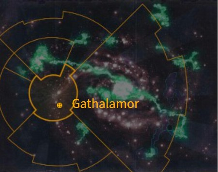

# 0972 加塔拉莫 Gathalamor

精校状态：中文行文已逐段精校，部分术语仍为暂定

分类：地理 / 真实空间 Real Space / 太阳星域 Segmentum Solar

原文来源：https://www.bilibili.com/opus/1157568139594039328

原作者：帝国神选罐头

原文时间：2026年01月14日 09:55

[返回分类目录](目录.md) · [全书目录](../../目录.md)

<!-- A0972-B0001 图片 -->

<!-- A0972-B0002 -->

原译文

Map 地图

**校订译文**

Map 地图

<!-- /A0972-B0002 -->

<!-- A0972-B0003 -->
### Basic Data 基本资料

原题：Basic Data 基础数据

<!-- /A0972-B0003 -->

<!-- A0972-B0004 -->
**英文原文**

Name:Gathalamor

<!-- /A0972-B0004 -->

<!-- A0972-B0005 -->

原译文

名称：加塔拉莫

**校订译文**

名称：加塔拉莫

<!-- /A0972-B0005 -->

<!-- A0972-B0006 -->
**英文原文**

Segmentum:Segmentum Solar

<!-- /A0972-B0006 -->

<!-- A0972-B0007 -->

原译文

星域：太阳星域

**校订译文**

星域：太阳星域

<!-- /A0972-B0007 -->

<!-- A0972-B0008 -->
**英文原文**

Affiliation:Imperium (Ecclesiarchy)

<!-- /A0972-B0008 -->

<!-- A0972-B0009 -->

原译文

隶属：帝国（教会）

**校订译文**

隶属：帝国（国教会）

<!-- /A0972-B0009 -->

<!-- A0972-B0010 -->
**英文原文**

Class:Cardinal World

<!-- /A0972-B0010 -->

<!-- A0972-B0011 -->

原译文

类别：枢机世界

**校订译文**

类别：红衣主教世界

<!-- /A0972-B0011 -->

<!-- A0972-B0012 -->
**英文原文**

Gathalamor is an Imperial world in the Segmentum Solar, to the galactic south-west of Terra. Gathalamor is known mostly as being the diocese of the heretic Cardinal Bucharis during the Age of Apostasy, whose heresies reached such an extent that they became known as the Plague of Unbelief.

<!-- /A0972-B0012 -->

<!-- A0972-B0013 -->

原译文

加塔拉莫是一个位于太阳星域的帝国世界，位于泰拉的银河系西南部。加拉塔莫主要被知晓是作为叛教时代异端红衣主教布查里斯的教区，他的异端达到了如此程度，以至于被称为无信瘟疫。

**校订译文**

加塔拉莫是太阳星域的一颗帝国行星，位于泰拉的银河西南方向。它以叛教时代异端红衣主教布查里斯的教区而闻名。布查里斯的异端势力蔓延极广，因而得名“无信瘟疫”。

<!-- /A0972-B0013 -->

<!-- A0972-B0014 -->
## History 历史

<!-- /A0972-B0014 -->

<!-- A0972-B0015 -->
### Plague of Unbelief 无信瘟疫

<!-- /A0972-B0015 -->

<!-- A0972-B0016 -->
**英文原文**

The world's population was not rich and many lived in abject poverty. Bucharis took over and enslaved the population, forcing them to build a gigantic Cardinal Palace. He also took a large number of thugs and cut-throats and assaulted the nearby world of Rhanda. The resulting empire made Gathalamor fairly rich, although Bucharis' ideals of survival of the fittest meant many of the poorest died.

<!-- /A0972-B0016 -->

<!-- A0972-B0017 -->

原译文

世界的人口并不富裕，许多人生活在赤贫之中。布查里斯接管并奴役了当地居民，迫使他们建造了一座巨大的红衣主教宫殿。他还带走了大量暴徒和割喉者，袭击了附近的朗达世界。由此产生的帝国使加塔拉莫相当富有，尽管布查里斯的适者生存的标准意味着许多最贫穷的人死亡。

**校订译文**

这个世界并不富裕，许多人生活在赤贫之中。布查里斯掌权后奴役当地居民，强迫他们修建了一座庞大的红衣主教宫殿。他还率领大批暴徒和杀手，进攻邻近的兰达。随着其势力扩张，加塔拉莫变得相当富有；但布查里斯奉行适者生存的准则，许多最贫困的居民因此丧命。

<!-- /A0972-B0017 -->

<!-- A0972-B0018 -->
**英文原文**

Gathalamor is the site of the tomb of the Great Confessor Dolan Chirosius, who was martyred on the world by Bucharis. His martyrdom quickly inspired the population to rise up and kill Bucharis. At the end, all that remained of his body was a small pile of ashes. From then on, the world was back under the rule of Terra and remains so to this day.

<!-- /A0972-B0018 -->

<!-- A0972-B0019 -->

原译文

加塔拉莫是大告解者多兰·奇罗修斯的陵墓所在地，他被布查里斯在世界上殉道。他的殉道很快激发了人们觉醒杀死布查里斯。最后，他的尸体只剩下一小堆灰烬。从那时起，世界又回到了泰拉的统治之下，直到今天。

**校订译文**

加塔拉莫是大告解者多兰·奇罗修斯的陵墓所在地。多兰被布查里斯杀害于此，成为殉道者；他的牺牲很快激励民众起义，杀死了布查里斯。最终，遗体只剩下一小堆灰烬。自那以后，这个世界重新归于泰拉统治，并一直延续至本条所述时期。

**校注：** 末句 his 的指代不明确：前文先提殉道者多兰，又提布查里斯被杀。仅据当前英文无法确定化为灰烬的是谁，中文保留歧义并提示，不凭设定记忆补足。

<!-- /A0972-B0019 -->

<!-- A0972-B0020 -->
### Later history 后来历史

<!-- /A0972-B0020 -->

<!-- A0972-B0021 -->
**英文原文**

Later, Gathalamor was infiltrated by a Chaos Cultist known as the Manskinner. He corrupted the Gathalamor 24th regiment before escaping the planet and going on to form an army of the Lost and the Damned that carved a path towards Macharia. The Ecclesiarchy tried to suppress knowledge of this, unable to admit that the piety of Gathalamorians was not absolute.

<!-- /A0972-B0021 -->

<!-- A0972-B0022 -->

原译文

后来，加塔拉莫被一个被称为人皮的混沌邪教徒渗透。在逃离行星之前，他腐化了加塔拉莫第24兵团，并继续组建了一支迷失者和被诅咒者军队，为马卡里亚开辟了一条道路。教会试图压制对此的了解，无法承认加塔拉莫人的虔诚不是绝对的。

**校订译文**

后来，一名被称为剥人皮者的混沌邪教徒渗透了加塔拉莫。他先腐化了加塔拉莫第24团，随后逃离行星，组建了一支迷失者与诅咒者大军，一路杀向马卡里亚。国教会试图封锁消息，因为他们无法承认加塔拉莫人的虔诚并非无懈可击。

**校注：** Manskinner 为人物称号，原译“人皮”丢失施事含义，暂译剥人皮者；carved a path towards Macharia 此处按行军目的地译一路杀向马卡里亚，原为马卡里亚开辟道路误导敌我关系。

<!-- /A0972-B0022 -->

<!-- A0972-B0023 -->
**英文原文**

Gathalamor was invaded by the Forces of Chaos, in the aftermath of the Great Rift's creation. The world was only saved with the intervention of the Indomitus Crusade.

<!-- /A0972-B0023 -->

<!-- A0972-B0024 -->

原译文

大裂隙形成后，加塔拉莫被混沌部队入侵。在不屈远征的干预下，世界才得以被拯救。

**校订译文**

大裂隙出现后，混沌部队入侵加塔拉莫。直到不屈远征介入，这个世界才得以获救。

<!-- /A0972-B0024 -->

<!-- A0972-B0025 -->
## Known Places 已知地点

<!-- /A0972-B0025 -->

<!-- A0972-B0026 -->

原译文

Sanctic Citadel 圣地城堡

**校订译文**

Sanctic Citadel 圣地城堡

<!-- /A0972-B0026 -->

<!-- A0972-B0027 -->
**英文原文**

Mount Amalath - Site of a great Inquisitorial conclave that saw the creation of the Amalathian ideology.

<!-- /A0972-B0027 -->

<!-- A0972-B0028 -->

原译文

阿马拉特山 - 一个大审判庭秘会的所在地，见证了阿马拉特思想的创立。

**校订译文**

阿马拉特山——一场大型审判庭秘会的会址；阿马拉特安派的思想在此次会议上形成。

<!-- /A0972-B0028 -->

本篇核心术语与暂定项

以下列出本篇出现的英文原形及核心术语表用词。同形词可能指不同对象，具体词义以本篇正文和校注为准；单复数、别名和仅见于图注的名称可能尚未列入。完整候选见[术语表](../../术语表/双语术语候选.csv)。

| 英文 | 采用中文 | 状态 |
| --- | --- | --- |
| Great Rift | 大裂隙 | 官方已核对 |
| Imperium | 帝国 | 暂定·简称 |
| The Lost and the Damned | 迷失者与被诅咒者 | 暂定 |
| Indomitus | 不屈学派 | 暂定·学派语境 |
| Ecclesiarchy | 国教会 | 暂定 |
| Age of Apostasy | 叛教时代 | 暂定·官方待核 |
| Terra | 泰拉 | 暂定·官方待核 |
| Indomitus Crusade | 不屈远征 | 暂定·官方待核 |
| Segmentum Solar | 太阳星域 | 暂定·官方待核 |
| Segmentum | 星域 | 暂定·官方待核 |
| Gathalamor | 加塔拉莫 | 暂定·官方待核 |
| Macharia | 马卡里亚 | 暂定·官方待核 |
| Cardinal | 红衣主教 | 暂定 |
| Confessor | 告解者 | 暂定 |
| Inquisitorial Conclave | 审判庭秘会 | 暂定·官方待核 |
| Absolute | 绝对号 | 暂定·官方待核 |
| Amalathian | 阿马拉特安派 | 暂定·官方待核 |
| Piety | 虔诚星 | 暂定·官方待核 |
| Cardinal World | 红衣主教世界 | 暂定·官方待核 |
| Rhanda | 兰达 | 暂定·官方待核 |
| Plague of Unbelief | 无信瘟疫 | 暂定·官方待核 |
| Dolan Chirosius | 多兰·奇罗修斯 | 暂定·官方待核 |
| Bucharis | 布查里斯 | 暂定·官方待核 |
| Manskinner | 剥人皮者 | 暂定·官方待核 |
| Mount Amalath | 阿马拉特山 | 暂定·官方待核 |

