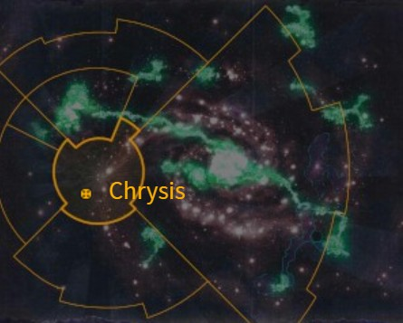

# 0974 克里西斯 Chrysis

精校状态：中文行文已逐段精校，部分术语仍为暂定

分类：地理 / 真实空间 Real Space / 太阳星域 Segmentum Solar

原文来源：https://www.bilibili.com/opus/1169173424650584087

原作者：帝国神选罐头

原文时间：2026年02月14日 16:30

[返回分类目录](目录.md) · [全书目录](../../目录.md)

原篇名：克律西斯 Chrysis

<!-- A0974-B0001 图片 -->

<!-- A0974-B0002 -->

原译文

Map 地图

**校订译文**

Map 地图

<!-- /A0974-B0002 -->

<!-- A0974-B0003 -->
### Basic Data 基本资料

原题：Basic Data 基础数据

<!-- /A0974-B0003 -->

<!-- A0974-B0004 -->
**英文原文**

Name:Chrysis

<!-- /A0974-B0004 -->

<!-- A0974-B0005 -->

原译文

名称：克律西斯

**校订译文**

名称：克里西斯

<!-- /A0974-B0005 -->

<!-- A0974-B0006 -->
**英文原文**

Segmentum:Segmentum Solar

<!-- /A0974-B0006 -->

<!-- A0974-B0007 -->

原译文

星域：太阳星域

**校订译文**

星域：太阳星域

<!-- /A0974-B0007 -->

<!-- A0974-B0008 -->
**英文原文**

Affiliation:Imperium

<!-- /A0974-B0008 -->

<!-- A0974-B0009 -->

原译文

隶属：帝国

**校订译文**

隶属：帝国

<!-- /A0974-B0009 -->

<!-- A0974-B0010 -->
**英文原文**

Class:Knight World

<!-- /A0974-B0010 -->

<!-- A0974-B0011 -->

原译文

类别：骑士世界

**校订译文**

类别：骑士世界

<!-- /A0974-B0011 -->

<!-- A0974-B0012 -->
**英文原文**

Chrysis is a Knight World of the Imperium and home to House Krast.

<!-- /A0974-B0012 -->

<!-- A0974-B0013 -->

原译文

克律西斯是帝国的骑士世界，也是克拉斯家族的家园。

**校订译文**

克里西斯是帝国的骑士世界，也是克拉斯家族的家园。

<!-- /A0974-B0013 -->

<!-- A0974-B0014 -->
## Overview 概述

<!-- /A0974-B0014 -->

<!-- A0974-B0015 -->
**英文原文**

The Knight world of Chrysis was the first to be rediscovered at the outset of the Great Crusade (in 850.M30) by Rogue Trader Militant Bastian Jeffers. Its proximity to Mars meant that the knightly houses of Chrysis were able to swiftly resupply their Knights with new weapons and equipment.

<!-- /A0974-B0015 -->

<!-- A0974-B0016 -->

原译文

克律西斯骑士世界是第一个在大远征开始时（850.M30）被武装行商浪人巴斯蒂安·杰弗斯重新发现的世界。它靠近火星意味着克律西斯骑士家族的骑士能够迅速被提供新的武器和装备。

**校订译文**

大远征初期，武装行商浪人巴斯蒂安·杰弗斯于850.M30重新发现了克里西斯；它是这一时期首个被重新发现的骑士世界。由于靠近火星，当地骑士家族能够迅速为骑士机甲补充新武器和装备。

<!-- /A0974-B0016 -->

<!-- A0974-B0017 -->
**英文原文**

However during the Horus Heresy, the Knight world’s proximity to Mars was to ultimately prove its undoing when the full might of Horus’ traitor forces descended upon Chrysis as he carved a bloody path across the galaxy towards Terra. The Knights of House Krast returned to their planet only to find it devastated and the lesser houses all but erased from existence.

<!-- /A0974-B0017 -->

<!-- A0974-B0018 -->

原译文

然而，在荷鲁斯叛乱期间，骑士世界与火星的接近最终证实了它的毁灭，当荷鲁斯的叛徒部队的全部力量降临到克律西斯上时，他在银河系中开辟了一条通往泰拉的血腥之路。克拉斯家族的骑士回到他们的行星，却发现它被摧毁了，那些较小的家族几乎消失了。

**校订译文**

然而，靠近火星也在荷鲁斯之乱期间给克里西斯带来了灭顶之灾。荷鲁斯率领叛军一路杀向泰拉时，其大军倾力攻袭了这颗行星。克拉斯家族的骑士返回家园，才发现行星已遭蹂躏，较小的骑士家族也几乎全被消灭。

<!-- /A0974-B0018 -->

本篇核心术语与暂定项

以下列出本篇出现的英文原形及核心术语表用词。同形词可能指不同对象，具体词义以本篇正文和校注为准；单复数、别名和仅见于图注的名称可能尚未列入。完整候选见[术语表](../../术语表/双语术语候选.csv)。

| 英文 | 采用中文 | 状态 |
| --- | --- | --- |
| Horus Heresy | 荷鲁斯之乱 | 官方已核对 |
| Imperium | 帝国 | 暂定·简称 |
| Equipment | 装备 | 编辑用语已统一 |
| Rogue Trader | 行商浪人 | 暂定 |
| Great Crusade | 大远征 | 暂定·官方待核 |
| Terra | 泰拉 | 暂定·官方待核 |
| Horus | 荷鲁斯 | 暂定·官方待核 |
| Segmentum Solar | 太阳星域 | 暂定·官方待核 |
| Segmentum | 星域 | 暂定·官方待核 |
| Mars | 火星 | 暂定·官方待核 |
| Chrysis | 克里西斯 | 暂定·官方待核 |
| Knight World | 骑士世界 | 暂定·官方待核 |
| Rogue Trader Militant | 军务行商浪人 | 暂定·官方待核 |
| Bastian Jeffers | 巴斯蒂安·杰弗斯 | 暂定·官方待核 |

