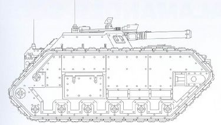
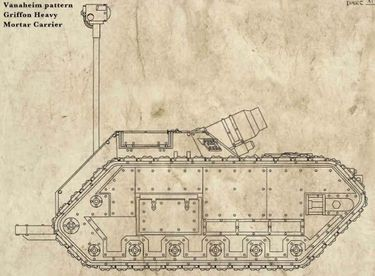
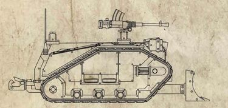
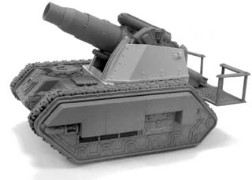
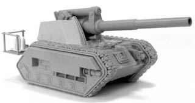

# 0976 瓦纳海姆 Vanaheim

精校状态：中文行文已逐段精校，部分术语仍为暂定

分类：地理 / 真实空间 Real Space / 太阳星域 Segmentum Solar

原文来源：https://www.bilibili.com/opus/1203218135745822728

原作者：帝国神选罐头

原文时间：2026年05月17日 10:20

[返回分类目录](目录.md) · [全书目录](../../目录.md)

<!-- A0976-B0001 -->
### Basic Data 基本资料

原题：Basic Data 基础数据

<!-- /A0976-B0001 -->

<!-- A0976-B0002 -->
**英文原文**

Name:Vanaheim

<!-- /A0976-B0002 -->

<!-- A0976-B0003 -->

原译文

名称：瓦纳海姆

**校订译文**

名称：瓦纳海姆

<!-- /A0976-B0003 -->

<!-- A0976-B0004 -->
**英文原文**

Segmentum:Segmentum Solar

<!-- /A0976-B0004 -->

<!-- A0976-B0005 -->

原译文

星域：太阳星域

**校订译文**

星域：太阳星域

<!-- /A0976-B0005 -->

<!-- A0976-B0006 -->
**英文原文**

Affiliation:Imperium

<!-- /A0976-B0006 -->

<!-- A0976-B0007 -->

原译文

隶属：帝国

**校订译文**

隶属：帝国

<!-- /A0976-B0007 -->

<!-- A0976-B0008 -->
**英文原文**

Class:Forge World

<!-- /A0976-B0008 -->

<!-- A0976-B0009 -->

原译文

类别：铸造世界

**校订译文**

类别：铸造世界

<!-- /A0976-B0009 -->

<!-- A0976-B0010 -->
**英文原文**

Vanaheim is an Imperial Forge World.

<!-- /A0976-B0010 -->

<!-- A0976-B0011 -->

原译文

瓦纳海姆是一个帝国铸造世界。

**校订译文**

瓦纳海姆是一个帝国铸造世界。

<!-- /A0976-B0011 -->

<!-- A0976-B0012 -->
## Overview 概述

<!-- /A0976-B0012 -->

<!-- A0976-B0013 -->
**英文原文**

Vanaheim is known to produce variants of several common Imperial war-machines including the Salamander Scout vehicle, Griffon, Medusa, Centaur Carrier and Basilisk. They also produce the main Shotgun pattern used by Skitarii Provost Enforcers.

<!-- /A0976-B0013 -->

<!-- A0976-B0014 -->

原译文

众所周知，瓦纳海姆生产了几种常见的帝国战争机器的变体，包括火蜥蜴侦察载具、狮鹫、美杜莎、半人马运输车和石化蜥蜴。他们还制作了护教军教长执法者使用的主要霰弹枪型号。

**校订译文**

瓦纳海姆以制造数种常见帝国战争机器的变型而闻名，包括火蜥蜴侦察车、狮鹫、美杜莎、半人马运输车和石化蜥蜴自行火炮。这里还生产护教军纠察执法者所用的主要霰弹枪型号。

**校注：** Provost 在护教军执法语境中为纠察职责，参照既定 Skitarii Provosts 护教军纠察部队，暂译护教军纠察执法者，非教会教长。

<!-- /A0976-B0014 -->

<!-- A0976-B0015 -->
**英文原文**

During the Horus Heresy the Forge World was invaded by the Warmaster's forces.

<!-- /A0976-B0015 -->

<!-- A0976-B0016 -->

原译文

在荷鲁斯叛乱时期，铸造世界被战帅的部队入侵。

**校订译文**

荷鲁斯之乱期间，战帅的部队入侵了这颗铸造世界。

<!-- /A0976-B0016 -->

<!-- A0976-B0017 -->
## Vanaheim Patterns 瓦纳海姆型

<!-- /A0976-B0017 -->

<!-- A0976-B0018 图片 -->

<!-- A0976-B0019 -->

原译文

Vanaheim pattern Salamander Scout 瓦纳海姆型火蜥蜴侦查车

**校订译文**

Vanaheim pattern Salamander Scout 瓦纳海姆型火蜥蜴侦察车

<!-- /A0976-B0019 -->

<!-- A0976-B0020 图片 -->

<!-- A0976-B0021 -->

原译文

Vanaheim pattern Griffon 瓦纳海姆型狮鹫

**校订译文**

Vanaheim pattern Griffon 瓦纳海姆型狮鹫

<!-- /A0976-B0021 -->

<!-- A0976-B0022 图片 -->

<!-- A0976-B0023 -->

原译文

Vanaheim pattern Centaur Carrier 瓦纳海姆型半人马运输车

**校订译文**

Vanaheim pattern Centaur Carrier 瓦纳海姆型半人马运输车

<!-- /A0976-B0023 -->

<!-- A0976-B0024 图片 -->

<!-- A0976-B0025 -->

原译文

Vanaheim pattern Medusa 瓦纳海姆型美杜莎

**校订译文**

Vanaheim pattern Medusa 瓦纳海姆型美杜莎

<!-- /A0976-B0025 -->

<!-- A0976-B0026 图片 -->

<!-- A0976-B0027 -->

原译文

Vanaheim pattern Basilisk 瓦纳海姆型石化蜥蜴

**校订译文**

Vanaheim pattern Basilisk 瓦纳海姆型石化蜥蜴自行火炮

<!-- /A0976-B0027 -->

本篇核心术语与暂定项

以下列出本篇出现的英文原形及核心术语表用词。同形词可能指不同对象，具体词义以本篇正文和校注为准；单复数、别名和仅见于图注的名称可能尚未列入。完整候选见[术语表](../../术语表/双语术语候选.csv)。

| 英文 | 采用中文 | 状态 |
| --- | --- | --- |
| Horus Heresy | 荷鲁斯之乱 | 官方已核对 |
| Imperium | 帝国 | 暂定·简称 |
| Forge World | 铸造世界 | 暂定·官方待核 |
| Horus | 荷鲁斯 | 暂定·官方待核 |
| Skitarii | 护教军 | 暂定·官方待核 |
| Enforcers | 地方执法者 | 暂定·官方待核 |
| Segmentum Solar | 太阳星域 | 暂定·官方待核 |
| Segmentum | 星域 | 暂定·官方待核 |
| Medusa | 美杜莎 | 暂定·官方待核 |
| Scout | 侦察兵 | 暂定·官方待核 |
| Vanaheim | 瓦纳海姆 | 暂定·官方待核 |
| Shotgun | 霰弹枪 | 暂定·官方待核 |
| Skitarii Provost Enforcers | 护教军纠察执法者 | 暂定·官方待核 |

