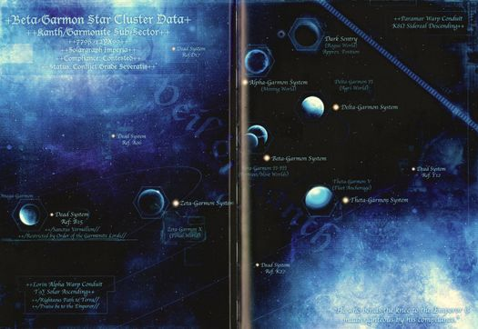

# 0978 贝塔-伽蒙星群 Beta-Garmon Star Cluster

精校状态：中文行文已逐段精校，部分术语仍为暂定

分类：地理 / 真实空间 Real Space / 太阳星域 Segmentum Solar

原文来源：https://www.bilibili.com/opus/1206183282433064962

原作者：帝国神选罐头

原文时间：2026年05月25日 10:07

[返回分类目录](目录.md) · [全书目录](../../目录.md)

原篇名：贝塔-伽蒙恒星群 Beta-Garmon Star Cluster

<!-- A0978-B0001 -->
**英文原文**

The Beta-Garmon Star Cluster is a strategically vital region of Segmentum Solar.

<!-- /A0978-B0001 -->

<!-- A0978-B0002 -->

原译文

贝塔-伽蒙恒星群是太阳星域的一个具有重要战略意义的区域。

**校订译文**

贝塔-伽蒙星群是太阳星域内具有重要战略意义的一片区域。

<!-- /A0978-B0002 -->

<!-- A0978-B0003 图片 -->

<!-- A0978-B0004 -->

原译文

The Beta-Garmon Cluster 贝塔-伽蒙星群

**校订译文**

The Beta-Garmon Cluster 贝塔-伽蒙星群

<!-- /A0978-B0004 -->

<!-- A0978-B0005 -->
## History 历史

<!-- /A0978-B0005 -->

<!-- A0978-B0006 -->
**英文原文**

The Beta-Garmon Cluster was first settled during the Dark Age of Technology and was one of the few regions of human space to largely endure the Age of Strife intact, making it vital in the early days of the Great Crusade when it peacefully merged with the fledgling Imperium. Beta-Garmon is also the home to stable Warp routes that allow for entry into the Sol System. These factors make the region extremely important from a strategic standpoint.

<!-- /A0978-B0006 -->

<!-- A0978-B0007 -->

原译文

贝塔-伽蒙星群最早是在黑暗技术时代定居的，是人类空域中为数不多的几个在很大程度上完整地经历了纷争时代的地区之一，这使得它在大远征的早期与羽翼未丰的帝国的和平合并变得至关重要。贝塔-伽蒙也是稳定的亚空间路线的所在地，这些路线允许进入太阳系。从战略角度来看，这些因素使该地区变得极其重要。

**校订译文**

贝塔-伽蒙星群最早在黑暗科技时代得到殖民，也是人类疆域中少数基本完整地度过纷争时代的地区。因此，当它在大远征初期和平加入新生的帝国时，便成为一处至关重要的基地。当地还有通往太阳系的稳定亚空间航路，进一步提高了它的战略价值。

<!-- /A0978-B0007 -->

<!-- A0978-B0008 -->
**英文原文**

Beta-Garmon served as the mustering point for the Imperial retribution force before it struck Prospero. Due to the Ruinstorm at the onset of the Horus Heresy, the Cluster was largely cutoff from the wider Imperium and schisms between loyalist and traitor factions began thanks to the instigation of the Alpha Legion. After the nearby Paramar System fell into civil war, the Beta-Garmon cluster quickly followed suit. Later in the Heresy, it was taken by the Emperor's Children only to be retaken by Salamanders, Imperial Army and loyalist Titan Legions in the Battle of Nyrcon. Heavily fortified by Rogal Dorn thereafter, Beta-Garmon became the site of vicious fighting between Imperial and traitor forces due to its strategic importance. The battle was one of the largest of the Heresy, but ultimately it was the forces of the Warmaster that emerged victorious.

<!-- /A0978-B0008 -->

<!-- A0978-B0009 -->

原译文

贝塔-伽蒙在帝国惩罚部队袭击普罗斯佩罗之前，曾担任其集结点。由于荷鲁斯叛乱开始时的毁灭风暴，该星群在很大程度上与更广泛的帝国隔绝，在阿尔法军团的煽动下，忠诚派和叛徒派系之间的分裂开始了。在附近的帕拉马尔星系陷入内战后，贝塔-伽蒙星群也迅速跟进。在叛乱后期，它被帝皇之子占领，但在尼康之战中被火蜥蜴、帝国军队和忠诚派泰坦军团夺回。此后，贝塔-伽蒙在罗格·多恩的大力加强下，由于其战略重要性，成为帝国和叛徒部队之间残酷战斗的地点。这场战斗是叛乱最大的战斗之一，但最终是战帅的部队取得了胜利。

**校订译文**

帝国惩戒部队进攻普罗斯佩罗之前，曾在贝塔-伽蒙集结。荷鲁斯之乱初期，毁灭风暴使星群与帝国其他地区基本隔绝；阿尔法军团从中煽动，促使当地分裂为忠诚派与叛乱派。邻近的帕拉马尔星系爆发内战后，贝塔-伽蒙星群也迅速卷入战火。叛乱后期，帝皇之子占领了这里，随后火蜥蜴、帝国军和忠诚派泰坦军团又在尼尔康之战中将其夺回。罗格·多恩此后大力加固当地防御。由于战略地位极其重要，星群成为帝国与叛军激烈争夺的战场。这是荷鲁斯之乱中规模最大的战役之一，最终以战帅的部队获胜告终。

<!-- /A0978-B0009 -->

<!-- A0978-B0010 -->
**英文原文**

At some point after the Heresy, it seems as if the Beta-Garmon Cluster became lost to the Emperor. In 679.M36 the Rogue Trader Khorlu rediscovered the fabled Beta-Garmon System. With the aid of the Silver Skulls, the Imperium reconquered the region. As a reward for helping him secure the System, Khorlu later ceded to the Silver Skulls the planet Beta-Garmon IV, considered the jewel of this system.

<!-- /A0978-B0010 -->

<!-- A0978-B0011 -->

原译文

在叛乱之后的某个时刻，贝塔-伽蒙星群似乎输给了帝皇。679.M36，行商浪人霍尔重新发现了传说中的贝塔-伽蒙星系。在银色颅骨的帮助下，帝国重新征服了该地区。作为帮助他保护该星系的奖励，霍尔后来将贝塔-伽蒙四号行星割让给了银色颅骨，该行星被认为是该星系的瑰宝。

**校订译文**

荷鲁斯之乱结束后的某个时期，帝国似乎失去了对贝塔-伽蒙星群的控制。679.M36，行商浪人霍尔鲁重新发现了传说中的贝塔-伽蒙星系。帝国在银色颅骨的协助下重新征服当地。为酬谢战团帮助他夺取星系，霍尔鲁后来将号称星系瑰宝的贝塔-伽蒙四号割让给银色颅骨。

**校注：** lost to the Emperor 表示帝国失去对星群的控制，原译“输给了帝皇”将关系译反。Khorlu 与979同一人物，统一霍尔鲁。

<!-- /A0978-B0011 -->

<!-- A0978-B0012 图片 -->

<!-- A0978-B0013 -->

原译文

Advance of the Reprisal Fleet in 013.M31 013.M31报复舰队的推进

**校订译文**

Advance of the Reprisal Fleet in 013.M31 013.M31报复舰队的推进

<!-- /A0978-B0013 -->

<!-- A0978-B0014 -->
## Known Worlds of the Beta-Garmon Cluster 贝塔-伽蒙星群的已知世界

<!-- /A0978-B0014 -->

<!-- A0978-B0015 -->
**英文原文**

At its peak, the Beta-Garmon Cluster spanned 30 worlds. However by the time of the Great Crusade only five Systems remained of importance:

<!-- /A0978-B0015 -->

<!-- A0978-B0016 -->

原译文

贝塔-伽蒙星群在其鼎盛时期跨越了30个世界。然而，到大远征时，只有五个星系仍然很重要：

**校订译文**

贝塔-伽蒙星群在鼎盛时期涵盖30个世界。但到大远征时期，只有五个星系仍占据重要地位：

<!-- /A0978-B0016 -->

<!-- A0978-B0017 -->
**英文原文**

Alpha-Garmon System - Consists of a dozen worlds around the bloated star of the system, mostly molten-planets and orbital outposts to monitor the system's Red Giant.

<!-- /A0978-B0017 -->

<!-- A0978-B0018 -->

原译文

阿尔法-伽蒙星系 - 由围绕该星系膨胀恒星的十几个世界组成，主要是熔融行星和轨道前哨，用于监测该星系的红巨星。

**校订译文**

阿尔法-伽蒙星系——十二个世界围绕一颗膨胀的恒星运行。当地主要是熔融的行星，以及用于监测这颗红巨星的轨道前哨。

**校注：** 英文将十二个世界与轨道前哨混列描述；明确 a dozen 为十二，不译成不定数“十几个”。

<!-- /A0978-B0018 -->

<!-- A0978-B0019 -->
**英文原文**

Alpha-Garmon IX - Mining World

<!-- /A0978-B0019 -->

<!-- A0978-B0020 -->

原译文

阿尔法-伽蒙九号 - 矿业世界

**校订译文**

阿尔法-伽蒙九号 - 矿业世界

<!-- /A0978-B0020 -->

<!-- A0978-B0021 -->
**英文原文**

Dark Sentry - Rogue World

<!-- /A0978-B0021 -->

<!-- A0978-B0022 -->

原译文

黑暗哨兵 - 离群世界

**校订译文**

黑暗哨兵 - 离群世界

<!-- /A0978-B0022 -->

<!-- A0978-B0023 -->
**英文原文**

Beta-Garmon System - Capital and most heavily populated System. The five other worlds of the System have long since been abandoned and is home to ancient ruins and debris fields.

<!-- /A0978-B0023 -->

<!-- A0978-B0024 -->

原译文

贝塔-伽蒙星系 - 首都和人口最稠密的星系。该星系的五个其他世界早已被遗弃，是古代废墟和残骸场的所在地。

**校订译文**

贝塔-伽蒙星系——星群的首府，也是人口最稠密的星系。星系中另外五个世界早已荒废，只剩古代遗迹和残骸遍布其间。

<!-- /A0978-B0024 -->

<!-- A0978-B0025 -->
**英文原文**

Beta-Garmon II - Capital of the Beta-Garmon system. Radiation-blasted Industrial World/Fortress World.

<!-- /A0978-B0025 -->

<!-- A0978-B0026 -->

原译文

贝塔-伽蒙二号 - 贝塔-伽蒙星系的首都。被辐射摧毁的工业世界/堡垒世界。

**校订译文**

贝塔-伽蒙二号——贝塔-伽蒙星系的首府，一颗饱受辐射侵袭的工业世界兼堡垒世界。

<!-- /A0978-B0026 -->

<!-- A0978-B0027 -->
**英文原文**

Beta-Garmon III - Hive World

<!-- /A0978-B0027 -->

<!-- A0978-B0028 -->

原译文

贝塔-伽蒙三号 - 巢都世界

**校订译文**

贝塔-伽蒙三号——巢都世界。

<!-- /A0978-B0028 -->

<!-- A0978-B0029 -->
**英文原文**

Beta-Garmon IV - Currently the homeworld of the Silver Skulls

<!-- /A0978-B0029 -->

<!-- A0978-B0030 -->

原译文

贝塔-伽蒙四号 - 目前是银色颅骨的家园世界

**校订译文**

贝塔-伽蒙四号——现为银色颅骨战团的母星。

<!-- /A0978-B0030 -->

<!-- A0978-B0031 -->
**英文原文**

Delta-Garmon System - A cold and mostly dead system clustered around a neutron star. Solar radiation flares make navigation and habitation difficult.

<!-- /A0978-B0031 -->

<!-- A0978-B0032 -->

原译文

德尔塔-伽蒙星系 - 一个围绕中子星聚集的寒冷且大部分死亡的星系。太阳辐射耀斑使航行和居住变得困难。

**校订译文**

德尔塔-伽蒙星系——围绕中子星分布的寒冷星系，大部分地方毫无生机。恒星的辐射耀斑使航行和定居都十分困难。

<!-- /A0978-B0032 -->

<!-- A0978-B0033 -->
**英文原文**

Delta-Garmon II - Agri-World protected by Dark Age technologies.

<!-- /A0978-B0033 -->

<!-- A0978-B0034 -->

原译文

德尔塔-伽蒙二号 - 受黑暗时代技术保护的农业世界。

**校订译文**

德尔塔-伽蒙二号——受到黑暗科技时代技术保护的农业世界。

<!-- /A0978-B0034 -->

<!-- A0978-B0035 -->
**英文原文**

Theta-Garmon System - Most planets of this system are given to fleet support and other infrastructure operations.

<!-- /A0978-B0035 -->

<!-- A0978-B0036 -->

原译文

西塔-伽蒙星系 - 该星系的大多数行星都用于舰队支援和其他基础设施运营。

**校订译文**

西塔-伽蒙星系——大多数行星都用于舰队支援及其他基础设施的运作。

<!-- /A0978-B0036 -->

<!-- A0978-B0037 -->
**英文原文**

Theta-Garmon V - Fleet base. Also known as Iridium due to the primary resource mined on the planet.

<!-- /A0978-B0037 -->

<!-- A0978-B0038 -->

原译文

西塔-伽蒙五号 - 舰队基地。也被称为铱星，因为它是行星上开采的主要资源。

**校订译文**

西塔-伽蒙五号——舰队基地。当地主要开采铱，因此又名铱星。

<!-- /A0978-B0038 -->

<!-- A0978-B0039 -->
**英文原文**

Zeta-Garmon System - Due to its blue star, the worlds of the Zeta-Garmon System are basked in an eerie ghostly light. Though once prosperous, celestial anomalies have created molecular stagnation and much of the world now exists in a crystallized form. Diamond seas and glass rain make most of the System uninhabitable.

<!-- /A0978-B0039 -->

<!-- A0978-B0040 -->

原译文

泽塔-伽蒙星系 - 由于其蓝色恒星，泽塔-伽蒙星系的世界被笼罩在一种诡异的幽灵般的光线中。虽然曾经繁荣，但天体异常造成了分子停滞，世界大部分地区现在以结晶形式存在。钻石海和玻璃雨使该星系的大部分地区无法居住。

**校订译文**

泽塔-伽蒙星系——受蓝色恒星的光芒照耀，星系内各个世界都笼罩在诡异而幽幻的光线中。这里曾经繁荣一时，但天体异常引发了分子停滞，使世界的大部分区域变为结晶状态。钻石之海与玻璃之雨令星系的大部分地区无法居住。

<!-- /A0978-B0040 -->

<!-- A0978-B0041 -->
**英文原文**

Zeta-Garmon X - Penal World

<!-- /A0978-B0041 -->

<!-- A0978-B0042 -->

原译文

泽塔-伽蒙十号 - 刑罚世界

**校订译文**

泽塔-伽蒙十号 - 刑罚世界

<!-- /A0978-B0042 -->

<!-- A0978-B0043 -->
**英文原文**

In addition, there were a number of less significant and outlying worlds and systems:

<!-- /A0978-B0043 -->

<!-- A0978-B0044 -->

原译文

此外，还有一些不太重要和偏远的世界和星系：

**校订译文**

此外，还有一些不太重要和偏远的世界和星系：

<!-- /A0978-B0044 -->

<!-- A0978-B0045 -->

原译文

Epsilon-Garmon System 埃普西隆-伽蒙星系

**校订译文**

Epsilon-Garmon System 埃普西隆-伽蒙星系

<!-- /A0978-B0045 -->

<!-- A0978-B0046 -->

原译文

Epsilon-Garmon II 埃普西隆-伽蒙二号

**校订译文**

Epsilon-Garmon II 埃普西隆-伽蒙二号

<!-- /A0978-B0046 -->

<!-- A0978-B0047 -->
**英文原文**

Omega-Garmon System - Dead System

<!-- /A0978-B0047 -->

<!-- A0978-B0048 -->

原译文

欧米伽-伽蒙星系 - 死亡星系

**校订译文**

欧米伽-伽蒙星系——死寂星系。

<!-- /A0978-B0048 -->

<!-- A0978-B0049 -->
**英文原文**

147-Gamma Minoris-Garmon - Outlying world of the star cluster.

<!-- /A0978-B0049 -->

<!-- A0978-B0050 -->

原译文

147-小伽马-伽蒙 - 星群的偏远世界。

**校订译文**

147-小伽马-伽蒙 - 星群的偏远世界。

<!-- /A0978-B0050 -->

本篇核心术语与暂定项

以下列出本篇出现的英文原形及核心术语表用词。同形词可能指不同对象，具体词义以本篇正文和校注为准；单复数、别名和仅见于图注的名称可能尚未列入。完整候选见[术语表](../../术语表/双语术语候选.csv)。

| 英文 | 采用中文 | 状态 |
| --- | --- | --- |
| Imperial Army | 帝国军 | 暂定·官方待核 |
| Horus Heresy | 荷鲁斯之乱 | 官方已核对 |
| Warp | 亚空间 | 官方已核对 |
| Imperium | 帝国 | 暂定·简称 |
| Dark Age of Technology | 黑暗科技时代 | 暂定 |
| Rogue Trader | 行商浪人 | 暂定 |
| Emperor | 帝皇 | 官方已核对 |
| Hive World | 巢都世界 | 暂定·官方待核 |
| Agri-World | 农业世界 | 暂定·官方待核 |
| Emperor's Children | 帝皇之子 | 官方已核对 |
| Great Crusade | 大远征 | 暂定·官方待核 |
| Age of Strife | 纷争时代 | 暂定·官方待核 |
| Horus | 荷鲁斯 | 暂定·官方待核 |
| Segmentum Solar | 太阳星域 | 暂定·官方待核 |
| Segmentum | 星域 | 暂定·官方待核 |
| Salamanders | 火蜥蜴 | 暂定·官方待核 |
| Beta-Garmon IV | 贝塔-伽蒙四号 | 暂定·官方待核 |
| Titan | 泰坦 | 暂定·官方待核 |
| Ancient | 旗手 | 官方已核对 |
| Alpha Legion | 阿尔法军团 | 暂定·官方待核 |
| The Battle of Nyrcon | 尼尔康之战 | 暂定·官方待核 |
| Sol | 太阳系 | 暂定·官方待核 |
| Silver Skulls | 银色颅骨 | 暂定·官方待核 |
| Monitor | 监视者 | 暂定·官方待核 |
| Dark Sentry | 黑暗哨兵号（打击巡洋舰）／黑暗哨兵（游荡行星） | 语境定译·官方待核 |
| The Dark | 《黑暗》 | 暂定·官方待核 |
| Ruinstorm | 毁灭风暴 | 暂定·官方待核 |
| System | 星系（恒星系统） | 暂定·官方待核 |
| Beta-Garmon III | 贝塔-伽蒙三号 | 暂定·官方待核 |
| Delta-Garmon II | 德尔塔-伽蒙二号 | 暂定·官方待核 |
| Fortress World | 堡垒世界 | 暂定·官方待核 |
| Industrial World | 工业世界 | 暂定·官方待核 |
| Mining World | 矿业世界 | 暂定·官方待核 |
| Penal World | 刑罚世界 | 暂定·官方待核 |
| Beta | 贝塔号 | 暂定·官方待核 |
| Titan Legions | 泰坦军团 | 暂定·官方待核 |
| Beta-Garmon Star Cluster | 贝塔-伽蒙星群 | 暂定·官方待核 |
| Khorlu | 霍尔鲁 | 暂定·官方待核 |
| Iridium | 铱星 | 暂定·官方待核 |
| 147-Gamma Minoris-Garmon | 147-小伽马-伽蒙 | 暂定·官方待核 |
| Beta-Garmon II | 贝塔-伽蒙二号 | 暂定·官方待核 |
| Sol System | 太阳系 | 暂定·官方待核 |

