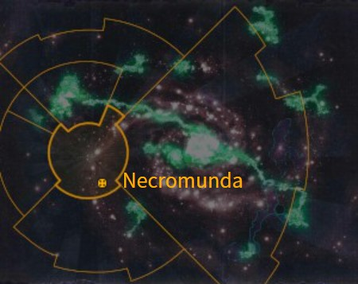
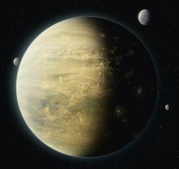
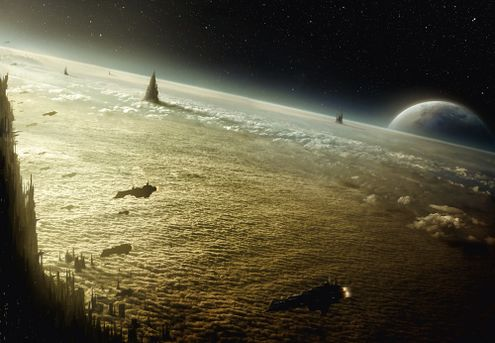
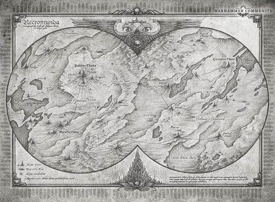
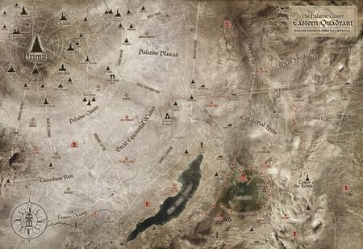
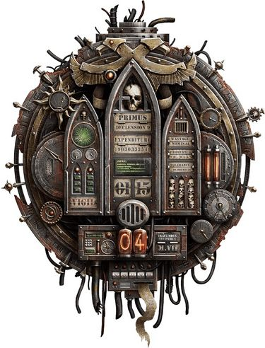
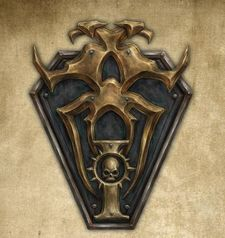

# 0980 涅克罗蒙达 Necromunda

精校状态：中文行文已逐段精校，部分术语仍为暂定

分类：地理 / 真实空间 Real Space / 太阳星域 Segmentum Solar

原文来源：https://www.bilibili.com/opus/1155046873524862997

原作者：帝国神选罐头

原文时间：2026年01月07日 14:51

[返回分类目录](目录.md) · [全书目录](../../目录.md)

<!-- A0980-B0001 图片 -->

<!-- A0980-B0002 -->

原译文

Map 地图

**校订译文**

Map 地图

<!-- /A0980-B0002 -->

<!-- A0980-B0003 -->
### Basic Data 基本资料

原题：Basic Data 基础信息

<!-- /A0980-B0003 -->

<!-- A0980-B0004 -->
**英文原文**

Name:Necromunda

<!-- /A0980-B0004 -->

<!-- A0980-B0005 -->

原译文

名称：涅克罗蒙达

**校订译文**

名称：涅克罗蒙达

<!-- /A0980-B0005 -->

<!-- A0980-B0006 -->
**英文原文**

Segmentum:Segmentum Solar

<!-- /A0980-B0006 -->

<!-- A0980-B0007 -->

原译文

星域：太阳星域

**校订译文**

星域：太阳星域

<!-- /A0980-B0007 -->

<!-- A0980-B0008 -->
**英文原文**

System:Necromunda System

<!-- /A0980-B0008 -->

<!-- A0980-B0009 -->

原译文

星系：涅克罗蒙达星系

**校订译文**

星系：涅克罗蒙达星系

<!-- /A0980-B0009 -->

<!-- A0980-B0010 -->
**英文原文**

Population:Believed to be many billions, exact number unknown

<!-- /A0980-B0010 -->

<!-- A0980-B0011 -->

原译文

人口：据信有几十亿，确切数字未知

**校订译文**

人口：据信有几十亿，确切数字未知

<!-- /A0980-B0011 -->

<!-- A0980-B0012 -->
**英文原文**

Affiliation:Imperium

<!-- /A0980-B0012 -->

<!-- A0980-B0013 -->

原译文

隶属：帝国

**校订译文**

隶属：帝国

<!-- /A0980-B0013 -->

<!-- A0980-B0014 -->
**英文原文**

Class:Hive World, Adeptus Astartes Recruiting World

<!-- /A0980-B0014 -->

<!-- A0980-B0015 -->

原译文

类别：巢都世界，阿斯塔特修会募兵世界

**校订译文**

类别：巢都世界、星际战士征兵世界

<!-- /A0980-B0015 -->

<!-- A0980-B0016 图片 -->

<!-- A0980-B0017 -->

原译文

Planetary Image 行星图片

**校订译文**

Planetary Image 行星图片

<!-- /A0980-B0017 -->

<!-- A0980-B0018 -->
**英文原文**

Necromunda is a Hive World in Segmentum Solar, and a major producer of munitions for the Imperial Guard. Necromunda's forges produce lasguns, autoguns, shotguns, and boltguns, among other weapons. The planet also levies huge numbers of troops for the Imperial Guard (most notably the "Necromundan Spiders"), as well as other supplies. The world has been governed by the House Helmawr for the past seven thousand years. Necromunda is typical of most hive worlds, its hive cities rife with powerful gangs.

<!-- /A0980-B0018 -->

<!-- A0980-B0019 -->

原译文

涅克罗蒙达是太阳星域的一个巢都世界，也是帝国卫队军火的主要生产商。涅克罗蒙达的铸造厂生产激光枪、自动枪、霰弹枪和爆矢枪等武器。这个行星还为帝国卫队（最著名的是“涅克罗蒙达蜘蛛”）以及其他补给征召了大量部队。在过去的七千年里，世界一直由赫尔马沃家族统治。涅克罗蒙达是大多数巢都世界的典型代表，它的巢都城市充斥着强大的帮派。

**校订译文**

涅克罗蒙达是太阳星域的巢都世界，也是帝国卫队的主要军火产地之一。其铸造厂生产激光枪、自动枪、霰弹枪、爆矢枪等武器。这颗行星还向帝国卫队征调大批兵员——其中最著名的是“涅克罗蒙达蜘蛛”——并提供其他物资。过去七千年间，赫尔玛沃家族一直统治着这里。它是典型的巢都世界，各座巢都中盘踞着众多强大的帮派。

<!-- /A0980-B0019 -->

<!-- A0980-B0020 -->
## History 历史

<!-- /A0980-B0020 -->

<!-- A0980-B0021 -->
### Pre-Imperium 前帝国

<!-- /A0980-B0021 -->

<!-- A0980-B0022 -->
**英文原文**

It is rumoured that long ago the Piscean xenos race were the first to arrive on Necromunda, which at the time still had large oceans. It is said they were both cunning and violent and viciously resisted Humanity's conquest of Necromunda years later. According to the legends of House Delaque, the Pisceans vanished shortly before Necromunda became consumed by industry and war. The Delaque believe the Pisceans did not leave Necromunda but instead took refuge in the subterranean oceans near the planet's core as Humanity first began to arrive.

<!-- /A0980-B0022 -->

<!-- A0980-B0023 -->

原译文

据传，很久以前，双鱼座的异型种族是第一个到达涅克罗蒙达的，当时那里还有大片的海洋。据说他们既狡猾又暴力，几年后恶毒地抵抗了人类对涅克罗蒙达的征服。根据德拉奎家族的传说，双鱼座在涅克罗蒙达被工业和战争吞噬前不久就消失了。德拉奎认为，当人类首次抵达时，双鱼座并没有离开涅克罗蒙达，而是在行星核心附近的地下海洋避难。

**校订译文**

据传，最早抵达涅克罗蒙达的是皮斯凯恩异形族群，当时行星上仍有大片海洋。他们既狡诈又凶暴，后来曾猛烈抵抗人类的征服。德拉奎家族的传说称，在涅克罗蒙达被工业与战争吞噬前不久，皮斯凯恩族便消失了。但德拉奎人相信，他们并未离开行星，而是在人类开始到来时，躲进了靠近地核的地下海洋。

**校注：** Piscean 是异形族群名，原“双鱼座”易误作星座。暂音译皮斯凯恩族，官方待核。

<!-- /A0980-B0023 -->

<!-- A0980-B0024 -->
### Colonisation 殖民化

<!-- /A0980-B0024 -->

<!-- A0980-B0025 -->
**英文原文**

Necromunda was founded 15,000 years ago as a mining and manufacturing colony. It used to be the capital of the Araneus Continuity, a small empire of Humans ruled by Techno-nobility, who submitted to the Imperium during the Great Crusade.

<!-- /A0980-B0025 -->

<!-- A0980-B0026 -->

原译文

涅克罗蒙达成立于15000年前，是一个采矿和制造业殖民地。它曾经是蜘蛛连续体的首都，这是一个由技术贵族统治的人类小帝国，在大远征期间屈服于帝国。

**校订译文**

大约一万五千年前，涅克罗蒙达作为采矿与制造业殖民地建立。它曾是蜘蛛连续体的首都；这是一个由技术贵族统治的人类小国，后来在大远征期间臣服于帝国。

<!-- /A0980-B0026 -->

<!-- A0980-B0027 -->
### Great Crusade and Horus Heresy 大远征和荷鲁斯之乱

原题：Great Crusade and Horus Heresy 大远征和荷鲁斯叛乱

<!-- /A0980-B0027 -->

<!-- A0980-B0028 -->
**英文原文**

The planet was attacked by unknown Xenos arriving without warning from the system's Warp Gates, leaving only the capital Araneus Prime, which was then renamed to Necromunda. In M30 the planet was liberated from an Ork presence by the Imperial Fists lead by Rogal Dorn, establishing the close ties between Necromunda and the Chapter. This event and the bravery of the Legiones Astartes is celebrated every year in the local planetary holiday of Imperial Fistmas.

<!-- /A0980-B0028 -->

<!-- A0980-B0029 -->

原译文

这颗行星遭到了未知的异型的袭击，异型在没有收到星系的亚空间门警告的情况下抵达，只留下了首都蜘蛛一号，后来更名为涅克罗蒙达。在M30，罗格·多恩领导的帝国之拳将这颗行星从欧克的存在中解放出来，建立了涅克罗蒙达和战团之间的密切联系。每年在当地的行星节日帝国之拳节上，都会庆祝这一事件和阿斯塔特军团士兵的勇敢。

**校订译文**

未知异形从该星系的亚空间之门突然来袭，袭击后只剩下首都蜘蛛主星，后来改名为涅克罗蒙达。M30，罗格·多恩率领帝国之拳驱逐了盘踞当地的欧克，使行星重获自由，也由此奠定了涅克罗蒙达与帝国之拳的密切联系。当地每年都会庆祝“帝国之拳节”，纪念这次解放与阿斯塔特军团的英勇。

**校注：** 英文首句把 planet、only the capital 混用，可能压缩了整个蜘蛛连续体受袭的过程；保留首都幸存这一叙述，不替英文补造范围。without warning 修饰袭击突如其来，非“未收到亚空间门警告”。

<!-- /A0980-B0029 -->

<!-- A0980-B0030 -->
**英文原文**

According to another point of view, it was not Orks but rather a brief defiance of the former Necromunda's human colony against the coming of the Imperium that unleashed a war that made ash wastes from where hive-cities rise. Necromunda was apparently devastated during the Horus Heresy, and the Ironhead Squats were vital in rebuilding the planet.

<!-- /A0980-B0030 -->

<!-- A0980-B0031 -->

原译文

根据另一种观点，这不是欧克，而是对前涅克罗蒙达人类殖民地对帝国到来的短暂反抗，引发了一场战争，化作巢都城市拔地而起之处的灰烬废土。涅克罗蒙达显然在荷鲁斯叛乱期间遭到破坏，铁首矮人在重建行星方面至关重要。

**校订译文**

另一种说法认为，导致这场战争的并非欧克，而是当地人类殖民地对帝国到来的短暂反抗。战争留下了如今环绕各座巢都的灰烬荒原。涅克罗蒙达显然又在荷鲁斯之乱期间遭到重创，铁首矮人在战后重建中发挥了关键作用。

<!-- /A0980-B0031 -->

<!-- A0980-B0032 -->
### Recent History 近期历史

<!-- /A0980-B0032 -->

<!-- A0980-B0033 -->
**英文原文**

The ensuing millennia have not changed its basic purpose very much; Necromunda is still a world of mines, factories, refineries and processing plants. The planet is a vast powerhouse of industry, making thousands and thousands of different items for use throughout nearby planetary systems.

<!-- /A0980-B0033 -->

<!-- A0980-B0034 -->

原译文

随后的几千年并没有改变它的基本目的；涅克罗蒙达仍然是一个由矿山、工厂、精炼厂和加工厂组成的世界。这个行星是一个巨大的工业强大组织，制造了成千上万种不同的物品，供附近的行星系统使用。

**校订译文**

此后数千年，行星的基本用途并未发生太大变化：涅克罗蒙达仍遍布矿山、工厂、精炼厂和加工设施。它是一座庞大的工业基地，生产成千上万种商品，供应邻近的各个恒星系。

<!-- /A0980-B0034 -->

<!-- A0980-B0035 -->
**英文原文**

In the aftermath of the Great Rift's creation during the Thirteenth Black Crusade, a world-wide rebellion broke out on Necromunda. However it quickly ended sometime later, once word reached the Hive World that Lord Commander Roboute Guilliman's Indomitus Crusade was soon arriving to put down the rebellion.

<!-- /A0980-B0035 -->

<!-- A0980-B0036 -->

原译文

在第十三次黑色远征期间大裂隙形成之后，一场全球性的叛乱在涅克罗蒙达爆发。然而，不久之后，当领主指挥官罗伯特·基里曼的不屈远征很快就会到来镇压叛乱的消息传到巢都世界时，它很快就结束了。

**校订译文**

第十三次黑色远征期间大裂隙出现后，涅克罗蒙达爆发了全球性叛乱。但当罗保特·基里曼领主指挥官的不屈远征即将抵达、镇压叛乱的消息传来后，这场叛乱很快就结束了。

<!-- /A0980-B0036 -->

<!-- A0980-B0037 -->
## Population 人口

<!-- /A0980-B0037 -->

<!-- A0980-B0038 -->
**英文原文**

The population number of Necromunda has never been determined and probably never will. Only once, four thousand years ago, was it estimated that the upper habitation level of Hive Trazior housed a billion people by itself. Neither Trazior nor any of the other several thousand hives on the planet were ever censused again. It has been said that more people live on Necromunda than had ever have been alive on Terra up until the end of the Twentieth Century.

<!-- /A0980-B0038 -->

<!-- A0980-B0039 -->

原译文

涅克罗蒙达的人口数量从未确定，可能永远也不会确定。四千年前，只有一次估计特拉齐尔巢都的上层居住层独自容纳了10亿人。无论是特拉齐尔还是行星上其他几千个巢都，都没有再次受到普查。据说，直到第二十个百年(?)末，生活在涅克罗蒙达上的人比生活在泰拉上的人还多。

**校订译文**

涅克罗蒙达的人口从未得到确切统计，将来也很可能无法确定。唯一一次估算发生在四千年前：仅特拉齐尔巢都的上层居住区，就被认为住着十亿人。此后，无论特拉齐尔还是行星上的其他数千座巢都，都未再接受人口普查。据说，涅克罗蒙达现有的人口，比截至二十世纪末曾在泰拉生活过的所有人加起来还多。

**校注：** Twentieth Century 指二十世纪。ever have been alive 指截至当时历来生活过的人口总数，非当时单一时点的人口。

<!-- /A0980-B0039 -->

<!-- A0980-B0040 -->
## Geography 地理

<!-- /A0980-B0040 -->

<!-- A0980-B0041 -->
**英文原文**

Necromunda is a planet devoid of any remnant of its original environment, its surface reduced to a wasteland of windblown ash and accumulated industrial waste. Throughout the wastelands lie the hive cities, grouped into clusters comprising up to a dozen or so individual hives, linked by a network of overground travel tubes and subterranean passages. Those clusters are scattered over the surface of the planet and are connected together by roads and transportation tubes supported on pylons and suspended from cables.

<!-- /A0980-B0041 -->

<!-- A0980-B0042 -->

原译文

涅克罗蒙达是一个没有任何原始环境遗迹的行星，它的表面被风吹的灰烬和积聚的工业废料变成了一片荒地。整个荒地上都是巢都城市，它们被分成集群，由多达十几个单独的巢都组成，由地上旅行管道和地下通道网络连接起来。这些集群散布在行星表面，通过支撑在塔架上并悬挂在电缆上的道路和运输管道连接在一起。

**校订译文**

涅克罗蒙达的原始环境已荡然无存，地表变成由风卷灰烬与工业废料堆积而成的荒原。巢都散布其间，每个集群可包含约十余座独立巢都，由地上运输管道和地下通道相连。这些集群分布在行星各地，彼此间的道路与运输管道由高架支柱托起，或以缆索悬吊。

<!-- /A0980-B0042 -->

<!-- A0980-B0043 图片 -->

<!-- A0980-B0044 -->

原译文

Orbital view of the planet Necromunda 涅克罗蒙达行星的轨道图

**校订译文**

Orbital view of the planet Necromunda 涅克罗蒙达行星的轨道图

<!-- /A0980-B0044 -->

<!-- A0980-B0045 -->
**英文原文**

The wasteland that separates the hives is covered in abrasive and highly corrosive ash, the end product of fifteen thousand years of industry. In densely populated areas of Necromunda hives may be separated by only fifty to a hundred miles of waste, while in other areas the waste may stretch for thousands of miles between hives. The ash layer can be miles deep, forming shifting ranges of dust dunes, which can bury roads and transport tubes, and erode the base of a hive during one of the frequent dust storms. Over this desert lies a cloud layer of airborne pollution, so that the great spires of the hives rise from a drifting mist of tainted vapour like islands out of the sea.

<!-- /A0980-B0045 -->

<!-- A0980-B0046 -->

原译文

分隔巢都的荒地上覆盖着磨蚀性和高腐蚀性的灰烬，这是一万五千年工业的最终产物。在涅克罗蒙达人口稠密的地区，巢都之间可能只有50到100英里的荒地，而在其他地区，荒地可能在巢都之间延伸数千英里。灰烬层可能深达数英里，形成沙丘移动范围，这可能会掩埋道路和运输管道，并在频繁的沙尘暴中侵蚀巢都的底部。在这片沙漠上，有一层空气污染的云层，所以巢都的巨大尖顶从漂浮的污染蒸汽雾中升起，就像大海中的岛屿。

**校订译文**

巢都之间的荒原覆盖着具有强烈磨蚀性与腐蚀性的灰烬，这是长达一万五千年的工业活动留下的产物。在人口密集地区，相邻巢都之间可能只隔着五十至一百英里的荒原；而在其他地方，距离可能长达数千英里。灰烬层可厚达数英里，形成不断移动的尘丘。尘丘能掩埋道路与运输管道，频繁爆发的沙尘暴还会侵蚀巢都底部。荒漠上方笼罩着污染云层，巢都的高大尖塔从污浊雾气中耸立而出，宛如海中的岛屿。

<!-- /A0980-B0046 -->

<!-- A0980-B0047 -->
**英文原文**

The ash wastes are mostly composed of metallic oxides, powdered plastics, and inorganic chemicals which take millennia to reduce. The ash occurs in many different, often vivid hues, such as sulphur yellow, citric green, cobalt blue, pink, mauve, and various shades of grey, and it varies in texture from fine dust to crystal. It’s an inhospitable environment where the ash corrodes equipment and poisons organic life, and no unpolluted air, food, or water can be found. A surprising variety of creatures do survive; there are fungi, algae, and bacteria which live on the waste itself, as well as mutated animals. These are believed to be responsible for the limited free oxygen content of Necromunda’s atmosphere.

<!-- /A0980-B0047 -->

<!-- A0980-B0048 -->

原译文

灰烬荒地主要由金属氧化物、粉末塑料和无机化学物质组成，需要数千年才能沉降。灰烬呈现出许多不同的、通常是鲜艳的色调，如硫黄色、柠檬绿色、钴蓝色、粉红色、淡紫色和各种深浅的灰色，其质地从细尘到晶体不等。这是一个不适宜居住的环境，灰烬会腐蚀设备并毒害有机生命，而且找不到未受污染的空气、食物或水。令人惊讶的是，确实有各种各样的生物存活下来；有真菌、藻类和细菌生活在荒地本身，也有变异的动物。这些被认为是造成涅克罗蒙达大气中游离氧含量有限的原因。

**校订译文**

灰烬荒原主要由金属氧化物、塑料粉末和无机化学物质组成，这些物质需要数千年才能分解。灰烬的颜色各异，而且往往十分鲜艳：硫黄般的黄色、柠檬绿、钴蓝、粉红、淡紫以及深浅不同的灰色；质地则从细尘到晶体不等。这里不适合居住：灰烬腐蚀设备、毒害生物，也找不到洁净的空气、食物或水。然而，仍有出人意料的多种生物存活，包括以废物为生的真菌、藻类、细菌及变异动物。人们认为，涅克罗蒙达大气中仅存的少量游离氧，正是这些生物维持的。

**校注：** 末句说这些生物提供／维持仅存的游离氧，原译却成了它们导致氧含量低，因果方向不当。

<!-- /A0980-B0048 -->

<!-- A0980-B0049 -->
**英文原文**

During the planet’s calmer season, which coincides with the long extinct summer, liquid pollutants rise to the surface, forming slick-lakes and short-lived blind-rivers. Streams meander across the land, vanishing into sinkholes in the dust only to rise elsewhere. Imperial scholars who have studied dust ecologies believe that there may be currents and tides within the ash surface. These transient rivers and lakes can dry out, forming a hard pan on the surface of the dust. These dangerous areas conceal deep seas of fine dust beneath them and to fall through the crust of a pan is certain death.

<!-- /A0980-B0049 -->

<!-- A0980-B0050 -->

原译文

在行星上较为平静的季节，类似早已绝迹的夏季，液体污染物上升到地表，形成光滑的湖泊和短暂的盲河。溪流蜿蜒穿过陆地，消失在尘土中的灰岩坑中，只在其他地方上升。研究过灰尘生态的帝国学者认为，灰烬表面可能存在洋流和潮汐。这些短暂的河流和湖泊会干涸，在灰尘表面形成一个坚硬的盆地。这些危险区域下面隐藏着深海细尘，从盆地里掉下来肯定会导致死亡。

**校订译文**

在较平静的季节——时间上对应早已不复存在的夏季——液态污染物涌上地表，形成油污湖和短暂存在的隐流。溪流蜿蜒穿过荒原，消失在尘土中的塌陷坑里，又从别处冒出。研究尘土生态的帝国学者认为，灰烬层内可能也存在水流与潮汐。短暂的河湖干涸后，会在尘土表面留下坚硬的结壳。结壳下面却可能藏着深厚的细尘之海，一旦踩破表层陷落其中，便必死无疑。

<!-- /A0980-B0050 -->

<!-- A0980-B0051 -->
**英文原文**

In hotter weather, when the sun breaks through the cloud cover, noxious vapours rise up and form poisonous mists and fogs. Mists are invariably followed by toxic rain storms, laden with particles of ash dust and other contaminants.

<!-- /A0980-B0051 -->

<!-- A0980-B0052 -->

原译文

在更热的天气里，当太阳穿透云层时，有害的蒸汽会升起，形成有毒的雾气。薄雾之后总是伴随着有毒的暴雨，充满了灰烬和其他污染物的颗粒。

**校订译文**

天气更热、阳光穿透云层时，有害蒸气会升起，形成毒雾。毒雾之后总会降下暴雨，其中裹挟着灰尘和其他污染颗粒。

<!-- /A0980-B0052 -->

<!-- A0980-B0053 -->
**英文原文**

The most dangerous hazard in the wastes is the ash storms. A moderate ash storm will strip an unprotected man to the bone in seconds, and then reduce his bones to dust, while strong ones have been known to destroy entire hives. Ruined spires are occasionally revealed in the wake of one storm, possibly to once again be covered by shifting waste during the next one.

<!-- /A0980-B0053 -->

<!-- A0980-B0054 -->

原译文

荒地中最不安全的危险是灰烬风暴。中等的灰烬风暴会在几秒钟内把一个没有保护的人撕成骨头，然后把他的骨头变成灰尘，而众所周知，强的会摧毁整个巢都。毁坏的尖塔偶尔会在一场风暴后显露出来，可能在下一场风暴中再次被移动的荒地覆盖。

**校订译文**

荒原上最危险的灾害是灰烬风暴。中等强度的风暴就能在数秒内磨去毫无防护者的血肉，再将骨头粉碎成尘；更猛烈的风暴甚至能毁掉整座巢都。风暴过后，废墟中的尖塔偶尔会重见天日，却又可能在下一场风暴中被流动的废灰重新掩埋。

<!-- /A0980-B0054 -->

<!-- A0980-B0055 -->
**英文原文**

Much remains hidden beneath the ash surface, ready to be reclaimed and used: derelict spires from lost hives, buried convoys, wrecked stratoplanes, aircrafts and spaceships; long-abandoned mine workings; and even, in places, raw materials from the bedrock of the planet. There are a few places where, due to the natural sorting of the wind and ash itself, veins of pore oxides and chemicals have accumulated.

<!-- /A0980-B0055 -->

<!-- A0980-B0056 -->

原译文

许多遗迹隐藏在灰烬表面之下，随时可以回收和使用：失落的巢都的废弃尖塔、被埋的车队、失事的平流层飞机、飞行器和宇宙飞船上；废弃已久的矿井；甚至在某些地方，来自行星基岩的原材料。在一些地方，由于风和灰烬本身的自然分类，孔隙氧化物和化学物质的脉络已经积聚。

**校订译文**

灰烬层下埋藏着大量可回收利用的东西：失落巢都的废弃尖塔、被掩埋的车队、坠毁的平流层飞机、其他飞行器与太空船、废弃已久的矿井，甚至还有行星基岩中的原材料。在某些地方，风与灰烬的自然分选作用还使氧化物和化学物质聚集成矿脉。

**校注：** pore oxides 疑为 pure oxides（纯氧化物）笔误，当前正文仅保留确定的氧化物，不据疑词造“孔隙氧化物”术语。

<!-- /A0980-B0056 -->

<!-- A0980-B0057 -->
### The Sludge Seas 淤泥海

<!-- /A0980-B0057 -->

<!-- A0980-B0058 -->
**英文原文**

Chocked with ash, thick with chemicals and poisoned by heavy metals, the sludge seas are all that remains of Necromunda’s ancient oceans. The consistency of the sludge varies from a thin, chemical soup to viscous polluted mud. Near the equator, the sea’s surface has solidified into a crust of sludge, baked hard by the sun. Conventional ships are useless in such conditions, and only flyers or hover vehicles cross the seas. It is even rumoured that some mutants live in these areas, utterly isolated from the rest of Necromunda.

<!-- /A0980-B0058 -->

<!-- A0980-B0059 -->

原译文

淤泥海被灰烬堵塞，富含化学物质，被重金属毒害，是涅克罗蒙达古老海洋的全部遗迹。污泥的稠度从稀薄的化学汤到粘稠的污染泥不等。在赤道附近，海面已经凝固成一层淤泥，被太阳烤得很硬。在这种情况下，传统船只毫无用处，只有飞行器或宣读载具才能穿越海洋。甚至有传言说，一些变种人生活在这些地区，与涅克罗蒙达的其他地区完全隔离。

**校订译文**

古老海洋如今只剩下淤泥海，其中塞满灰烬、混杂化学物质，并受重金属污染。污泥有的稀薄如化学汤液，有的则黏稠如泥浆。赤道附近的海面已经凝成污泥硬壳，又被阳光烤得坚硬。普通船只无法在这种环境中航行，只有飞行器或悬浮载具才能渡海。甚至有传闻称，一些变种人生活在这些地区，与涅克罗蒙达其他地方完全隔绝。

<!-- /A0980-B0059 -->

<!-- A0980-B0060 -->
**英文原文**

The sludge seas support their quota of hives. Some have been built on massive piles, driven deep into the sea floor, while other (relatively small) hives have been constructed on massive floating platforms anchored in position. On more than one occasion a floating hive have broken free during an ash storm and sunk or capsized. Survivors of such disasters are rare.

<!-- /A0980-B0060 -->

<!-- A0980-B0061 -->

原译文

淤泥海支撑着他们的巢都限额。一些巢都建在巨大的桩上，深入海底，而另一些（相对较小的）巢都则建在锚定在适当位置的巨大浮动平台上。不止一次，漂浮的巢都在灰烬风暴中挣脱出来，沉没或倾覆。这种灾难的幸存者很少。

**校订译文**

淤泥海上也分布着一些巢都。有的建在深入海床的巨型桩柱上，有些规模相对较小的巢都则建在以锚固定的巨大浮动平台上。漂浮巢都曾多次在灰烬风暴中挣脱锚链，最终沉没或倾覆。这样的灾难鲜有幸存者。

<!-- /A0980-B0061 -->

<!-- A0980-B0062 -->
### The Forbidden Cities 禁忌城市

<!-- /A0980-B0062 -->

<!-- A0980-B0063 -->
**英文原文**

Running deep beneath the ash waste, cut into the very bedrock, are ancient military tunnels meant to link the hives together. Originally constructed as a way for military forces to be moved quickly around the planet and linked with cavernous storage depots and bunkers, stockpiled with synthetic food and raw materials in anticipation of war or other disaster. Many of those tunnels and bunkers have through the millennia been bypassed or sealed up, forgotten and lost. But after discovery that these places are the only source of valuable psyker drugs they have been secretly recolonised and are now known as the “Forbidden Cities”.

<!-- /A0980-B0063 -->

<!-- A0980-B0064 -->

原译文

在灰烬荒地的深处，切入基岩，是古老的军事隧道，旨在将巢都连接在一起。最初的建造是为了让军队在行星上快速移动，并与洞穴般的仓库和掩体相连，这些仓库和掩体储存着合成食品和原材料，以备战争或其他灾难。数千年来，许多隧道和掩体被绕过或封锁，被遗忘和失落。但在发现这些地方是珍贵的灵能者药物的唯一来源后，它们被秘密地重新殖民，现在被称为“禁忌城市”。

**校订译文**

灰烬荒原深处，古老的军事隧道凿入基岩，连接着各座巢都。修建它们原本是为了快速调动全球兵力；隧道还与巨大的地下仓库和掩体相通，其中储存合成食品与原材料，以应付战争和其他灾难。数千年间，许多通道与掩体被废置或封闭，最终遭人遗忘。但后来人们发现，这些地方是某些珍贵灵能药物的唯一产地，于是又秘密迁入定居；它们如今被称为“禁忌城市”。

<!-- /A0980-B0064 -->

<!-- A0980-B0065 -->
### The Hives 巢都

<!-- /A0980-B0065 -->

<!-- A0980-B0066 -->
**英文原文**

The hive cities of Necromunda retain the ancient names of the cities and settlements from which they grew. There are several thousand Hives on the planet, some massive and populated by billions, while others are desolate and inhabited only by the dead. Each hive takes the form of many huge spires which rise from the base of the city, covering an approximately circular area of fifty to a hundred miles in diameter. The spires – whose tops can rise to a dozen or more miles above the ground surface, piercing the clouds – are only the top part of the hives, comprising the upper hab zones with factory layers on or above the current surface layer. The older and partially ruined factory and hab layers still exist and, although they are buried beneath the ash wastes, are rarely abandoned until they are utterly derelict or polluted beyond use even by Necromundan standards. A hive contains thousands of miles of cluttered corridors, many thousands of abandoned and debris strewn chamber, and endless connecting tunnels, ventilation passages, service ducts, and light shafts. But also vast open areas, some so large that they lie under their own artificial sky domes. The funnel-shape of the hive spires is designed to strengthen the hive against the worst ravages of the dust, but even so are they often buried half their height or more in ash. This is stabilised and held in place by the fresh wastes which pour from the drains of the hive factories.

<!-- /A0980-B0066 -->

<!-- A0980-B0067 -->

原译文

涅克罗蒙达的巢都城市保留了它们兴起的城市和定居点的古老名称。这个行星上有几千个巢都，有些规模庞大，人口数十亿，而另一些则荒凉，只有死者居住。每个巢都都是从城市底部升起的许多巨大的尖塔，覆盖了直径约50至100英里的圆形区域。尖塔 — 其顶部可以高出地面十几英里或更远，穿透云层 — 只是巢都的顶部，包括上层居住区，在当前表层或之上有工厂层。旧的和部分毁坏的工厂和港口层仍然存在，尽管它们被埋在灰烬荒地之下，但很少被丢弃，直到它们完全被遗弃或污染，甚至按照涅克罗蒙达的标准也无法使用。巢都包含数千英里杂乱的通道、数千个废弃和散落着碎片的腔，以及无尽的连接隧道、通风通道、服务管道和采光井。但也有广阔的开阔地，有些开阔地如此之大，以至于它们位于自己的人造天空圆顶之下。巢都尖塔的漏斗形设计是为了加强巢都的强度，使其免受灰尘的最严重破坏，但即便如此，它们也经常被埋在灰烬中，埋在一半或更多的高度。从巢都工厂的排污管中倾倒的新鲜废料稳定并保持了这一点。

**校订译文**

涅克罗蒙达各座巢都沿用着其前身城市或聚落的古老名称。行星上有数千座巢都，有些规模庞大、居住着数十亿人，有些则荒凉破败，只剩死者。每座巢都由城市底座上耸起的多座巨塔构成，大致覆盖直径五十至一百英里的圆形区域。塔尖可伸出地表十余英里，穿透云层；但这些尖塔只是巢都最上方的部分，由上层居住区及位于当前地表附近或上方的工厂层组成。较古老、部分毁坏的工厂与居住层即使已埋入灰烬荒原，也很少被放弃，除非彻底破败，或污染严重到连涅克罗蒙达人都无法继续使用。巢都中有数千英里拥挤杂乱的走廊、成千上万间遍地残骸的废弃房室，以及无穷无尽的联络隧道、通风道、设施管线和采光井。也有一些极为宽阔的空间，甚至拥有独立的人造天空穹顶。尖塔采用漏斗状设计，以抵御尘暴最猛烈的侵袭；即便如此，它们仍常有一半以上埋在灰烬里。工厂排出的新废料又会将这些灰烬固结在原地。

<!-- /A0980-B0067 -->

<!-- A0980-B0068 图片 -->

<!-- A0980-B0069 -->

原译文

World Map of Necromunda 涅克罗蒙达的世界地图

**校订译文**

World Map of Necromunda 涅克罗蒙达的世界地图

<!-- /A0980-B0069 -->

<!-- A0980-B0070 -->
**英文原文**

Shanty towns are built outside the hives, clustered at the outer edge of the shells of the spires. They are inhabited by all kind of hive scum who cannot cope with the life within the hive. Conditions in the shanties are worse than anything in the hives, yet for most shanty-dwellers even their crude home is preferable to wandering the ash waste. The spires at least offer a limited protection against the poisonous rain and corrosive ash. Beneath and extending around the hives, under the wasteland itself, lies a labyrinth formed of ancient disused factories, sewers and service tunnels of an earlier age.

<!-- /A0980-B0070 -->

<!-- A0980-B0071 -->

原译文

棚户区建在巢都外，聚集在尖塔外壳的外缘。它们栖息着各种无法应对巢都内生活的巢都渣滓。棚屋里的条件比巢都里的任何东西都糟糕，但对于大多数棚屋居民来说，即使是他们简陋的家也比在灰烬中游荡要好。尖塔至少提供了有限的保护，可以抵御有毒的雨水和腐蚀性的灰烬。在巢都下方和周围，在荒地下方，是一个由古老的废弃工厂、下水道和早期服务隧道组成的迷宫。

**校订译文**

巢都外侧沿尖塔外壳边缘分布着棚户区，住着各种无法在巢都内部立足的巢都渣滓。棚户区的条件比巢都内任何地方都差，但对大多数居民来说，再简陋的家也胜过在灰烬荒原流浪。尖塔至少能遮挡一部分毒雨和腐蚀性灰烬。巢都下方及周边的荒原地下，则是一座由古代废弃工厂、下水道和设施隧道构成的迷宫。

<!-- /A0980-B0071 -->

<!-- A0980-B0072 -->
**英文原文**

Each hive spire is also known by a local name. There are approximately a thousand hive clusters on Necromunda; each cluster is a group of up to a dozen or so individual hive cities, all linked by a network of overground travel tubes and subterranean passages. There are several thousand hive cities on Necromunda, some big and vast in scale, some decrepit and lost.

<!-- /A0980-B0072 -->

<!-- A0980-B0073 -->

原译文

每个巢都尖塔也有一个当地名字。涅克罗蒙达上大约有一千个巢都集群；每个集群都是一组多达十几个单独的巢都城市，所有这些城市都由地上航行管道和地下通道网络连接起来。涅克罗蒙达上有数千个巢都城市，有些规模庞大，有些破旧而失落。

**校订译文**

每座巢都尖塔还有各自的地方名称。涅克罗蒙达约有一千个巢都集群，每群由约十余座独立巢都组成，以地上运输管道及地下通道连接。行星上数千座巢都之中，既有规模宏伟者，也有衰败荒废者。

<!-- /A0980-B0073 -->

<!-- A0980-B0074 -->
**英文原文**

Known Hives and notable locations on Necromunda include:

<!-- /A0980-B0074 -->

<!-- A0980-B0075 -->

原译文

涅克罗蒙达上已知的巢都和著名地点包括：

**校订译文**

涅克罗蒙达上已知的巢都和著名地点包括：

<!-- /A0980-B0075 -->

<!-- A0980-B0076 -->
### Western hemisphere 西半球

<!-- /A0980-B0076 -->

<!-- A0980-B0077 -->

原译文

Palatine Cluster 帕拉蒂尼集群

**校订译文**

Palatine Cluster 帕拉蒂尼集群

<!-- /A0980-B0077 -->

<!-- A0980-B0078 -->
**英文原文**

Hive Primus — Largest and oldest surviving hive and planetary capital under Lord Helmawr. Hive Primus boasts the most magnificent and grandiose architecture on Necromunda.

<!-- /A0980-B0078 -->

<!-- A0980-B0079 -->

原译文

第一巢都 — 赫尔马沃领主统治下现存最大、最古老的巢都和行星首都。第一巢都拥有涅克罗蒙达上最宏伟壮观的建筑。

**校订译文**

第一巢都 — 赫尔玛沃领主统治下现存最大、最古老的巢都和行星首都。第一巢都拥有涅克罗蒙达上最宏伟壮观的建筑。

<!-- /A0980-B0079 -->

<!-- A0980-B0080 -->
**英文原文**

Hive Trazior — Known as the Three Sisters due to the three huge spires that can be seen from this great hive-city. Trazior is located on the edge of the Great Equatorial Wastes and is the southernmost "frontier" Hive of the great Palatine Cluster. Many important merchant clans are based in this hive. The Hive is dominated by House Orlock.

<!-- /A0980-B0080 -->

<!-- A0980-B0081 -->

原译文

特拉齐尔巢都 — 因其在这座巨大的巢都城市中可见的三个巨大尖塔而被称为三姐妹。特拉齐尔位于大赤道荒地的边缘，是大帕拉蒂尼集群最南端的“边境”巢都。许多重要的商人家族都驻扎在这个巢都里。巢都由奥洛克家族主导。

**校订译文**

特拉齐尔巢都——因三座显眼的巨大尖塔而得名“三姐妹”。它位于大赤道荒原边缘，是庞大的帕拉蒂尼集群最南端的“边境”巢都。许多重要商人氏族以此为据点，其中奥洛克家族占据主导地位。

<!-- /A0980-B0081 -->

<!-- A0980-B0082 -->
**英文原文**

Acropolis Hive — Also known as Hive Acropolis, Another old and ornate Hive in the Palatine cluster, located at a vital intersection of several great road tunnels. The Acropolis Hive is home to some of the most powerful merchant clans and is also home to massive shanty towns from those who hope to get a share of the wealth. House Delaque is the dominant force in the Acropolis.

<!-- /A0980-B0082 -->

<!-- A0980-B0083 -->

原译文

卫城巢都 — 也称为巢都卫城，帕拉蒂尼集群中另一个古老而华丽的巢都，位于几个大型公路隧道的重要交叉口。卫城巢都是一些最强大的商人家族的家园，也是那些希望分享财富的人的大规模棚户区的家园。德拉奎家族是卫城的主导力量。

**校订译文**

卫城巢都——又称巢都卫城，是帕拉蒂尼集群中另一座古老华丽的巢都，坐落在数条大型道路隧道的关键交汇处。一些最强大的商人氏族定居于此，大批希望分得财富的人也聚集成庞大的棚户区。德拉奎家族是这里的主导力量。

<!-- /A0980-B0083 -->

<!-- A0980-B0084 -->
**英文原文**

Hive Temenos — This hive sees the headquarters of the Ecclesiarchy on Necromunda, and its population is said to be the most devout and pious. Many of the resident Clan Houses manufacture ritual items for the Ecclesiarchy while others work in their scriptoriums. Hive Temenos is a major powerbase for House Cawdor.

<!-- /A0980-B0084 -->

<!-- A0980-B0085 -->

原译文

塔梅诺斯巢都 — 这个巢都是涅克罗蒙达上国教的总部，据说它的人口是最虔诚和虔敬的。许多常驻的氏族会为国教制作仪式用品，而其他人则在他们的缮写室工作。塔梅诺斯巢都是考多家族的主要力量基地。

**校订译文**

塔梅诺斯巢都——国教会驻涅克罗蒙达的总部所在，据说当地居民最为虔诚。许多氏族家族为国教会制造仪式用品，另一些居民则在缮写室工作。这里也是考多家族的重要据点。

<!-- /A0980-B0085 -->

<!-- A0980-B0086 -->
**英文原文**

The Skull — This derelict hive is the largest of a cluster of three remote ruined hives, once populated but abandoned due to Ork raiders many years prior.

<!-- /A0980-B0086 -->

<!-- A0980-B0087 -->

原译文

颅骨 — 这个废弃的巢都是三个偏远的废弃巢都中最大的一个，这些巢都曾经有人居住，但多年前被欧克入侵者遗弃。

**校订译文**

颅骨——一组偏远废弃巢都中最大的一座。这组巢都共有三座，曾经有人居住，但多年前因欧克袭掠而被放弃。

<!-- /A0980-B0087 -->

<!-- A0980-B0088 -->
**英文原文**

Hive Secundus — Originally the second greatest hive city on Necromunda, around a century ago it fell to Genestealer infestation due to unsanctioned Adeptus Mechanicus biological research. The Inquisition was forced to intervene and destroyed the central spire. Despite this, the Genestealers were not fully purged and remain there still alongside feral humans amongst the ruins, which are now guarded by a defensive line manned by Necromundan conscripts and penal legionnaires.

<!-- /A0980-B0088 -->

<!-- A0980-B0089 -->

原译文

第二巢都 — 最初是涅克罗蒙达上第二大巢都城市，大约一个世纪前，由于未经批准的机械神教生物研究，它被基因窃取者侵扰。审判庭被迫介入并摧毁了中央尖塔。尽管如此，基因窃取者并没有被完全清除，仍然与废墟中的野蛮人一起留在那里，现在由涅克罗蒙达征召兵和刑罚军团士兵的防线守卫着。

**校订译文**

第二巢都——原为涅克罗蒙达第二大巢都。约一个世纪前，机械修会未经批准的生物研究招致基因窃取者入侵，导致巢都沦陷。审判庭被迫介入，摧毁了中央尖塔，但仍未能彻底清除基因窃取者。它们至今与野化人类一同盘踞在废墟中，外围则由涅克罗蒙达征召兵和刑罚军团士兵组成的防线封锁。

<!-- /A0980-B0089 -->

<!-- A0980-B0090 -->
**英文原文**

Hive Arcos — A former hive which was lost to a Corpse Grinder Cult rebellion; afterward, the hive was abandoned and quarantined.

<!-- /A0980-B0090 -->

<!-- A0980-B0091 -->

原译文

阿科斯巢都 — 一个在尸体研磨者教派叛乱中陷落的前巢都；之后，巢都被遗弃并隔离。

**校订译文**

阿科斯巢都 — 一个在尸体研磨者教派叛乱中陷落的前巢都；之后，巢都被遗弃并隔离。

<!-- /A0980-B0091 -->

<!-- A0980-B0092 -->

原译文

Mynerva Cluster 迈内瓦集群

**校订译文**

Mynerva Cluster 迈内瓦集群

<!-- /A0980-B0092 -->

<!-- A0980-B0093 -->

原译文

Hive Mynerva 迈内瓦巢都

**校订译文**

Hive Mynerva 迈内瓦巢都

<!-- /A0980-B0093 -->

<!-- A0980-B0094 -->

原译文

Hive Prosperine 普罗斯培林巢都

**校订译文**

Hive Prosperine 普罗斯培林巢都

<!-- /A0980-B0094 -->

<!-- A0980-B0095 -->

原译文

Hive Alortis 阿洛提斯巢都

**校订译文**

Hive Alortis 阿洛提斯巢都

<!-- /A0980-B0095 -->

<!-- A0980-B0096 -->

原译文

Hive Alpha-Prime 阿尔法一号巢都

**校订译文**

Hive Alpha-Prime 阿尔法一号巢都

<!-- /A0980-B0096 -->

<!-- A0980-B0097 -->

原译文

Hive Aranthor 阿兰托尔巢都

**校订译文**

Hive Aranthor 阿兰托尔巢都

<!-- /A0980-B0097 -->

<!-- A0980-B0098 -->

原译文

Hive Bellium 贝利姆巢都

**校订译文**

Hive Bellium 贝利姆巢都

<!-- /A0980-B0098 -->

<!-- A0980-B0099 -->

原译文

Hive Ceres 刻瑞斯巢都

**校订译文**

Hive Ceres 刻瑞斯巢都

<!-- /A0980-B0099 -->

<!-- A0980-B0100 -->

原译文

Hive Cinus 奇努斯巢都

**校订译文**

Hive Cinus 奇努斯巢都

<!-- /A0980-B0100 -->

<!-- A0980-B0101 -->

原译文

Hive Hindsk 辛德斯克巢都

**校订译文**

Hive Hindsk 辛德斯克巢都

<!-- /A0980-B0101 -->

<!-- A0980-B0102 -->

原译文

Hive Janus 雅努斯巢都

**校订译文**

Hive Janus 雅努斯巢都

<!-- /A0980-B0102 -->

<!-- A0980-B0103 -->

原译文

Hive Meridian 子午线巢都

**校订译文**

Hive Meridian 子午线巢都

<!-- /A0980-B0103 -->

<!-- A0980-B0104 -->

原译文

Hive Rothgol 罗斯戈尔巢都

**校订译文**

Hive Rothgol 罗斯戈尔巢都

<!-- /A0980-B0104 -->

<!-- A0980-B0105 -->

原译文

Hive Thatos 萨托斯巢都

**校订译文**

Hive Thatos 萨托斯巢都

<!-- /A0980-B0105 -->

<!-- A0980-B0106 -->

原译文

Hive Titania 泰坦妮娅巢都

**校订译文**

Hive Titania 泰坦妮娅巢都

<!-- /A0980-B0106 -->

<!-- A0980-B0107 -->

原译文

Hive Uthos 乌索斯巢都

**校订译文**

Hive Uthos 乌索斯巢都

<!-- /A0980-B0107 -->

<!-- A0980-B0108 -->

原译文

Hive Ulantia 乌兰蒂亚巢都

**校订译文**

Hive Ulantia 乌兰蒂亚巢都

<!-- /A0980-B0108 -->

<!-- A0980-B0109 -->

原译文

Hive Valkyria 瓦尔基利亚巢都

**校订译文**

Hive Valkyria 瓦尔基利亚巢都

<!-- /A0980-B0109 -->

<!-- A0980-B0110 -->

原译文

Prison Hive Zalktraa 扎尔克特拉监狱巢都

**校订译文**

Prison Hive Zalktraa 扎尔克特拉监狱巢都

<!-- /A0980-B0110 -->

<!-- A0980-B0111 -->

原译文

Skygelt Tower 天贡之塔

**校订译文**

Skygelt Tower 天贡之塔

<!-- /A0980-B0111 -->

<!-- A0980-B0112 图片 -->

<!-- A0980-B0113 -->

原译文

The Palatine Cluster - Eastern Quadrant 帕拉蒂尼集群 - 东象限

**校订译文**

The Palatine Cluster - Eastern Quadrant 帕拉蒂尼集群 - 东象限

<!-- /A0980-B0113 -->

<!-- A0980-B0114 -->
### Eastern hemisphere 东半球

<!-- /A0980-B0114 -->

<!-- A0980-B0115 -->
**英文原文**

Hive Mortis — Once an industrial lynchpin of the equatorial city clusters, it has now been reduced to a barely-populated wreck after a plague outbreak. Mortuary cults have since been created in the Hive, which subsist by harvesting and breaking down corpses. House Escher holds sway in Hive Mortis.

<!-- /A0980-B0115 -->

<!-- A0980-B0116 -->

原译文

死亡巢都 — 曾经是赤道城市集群的工业关键，在瘟疫爆发后，它现在已经变成了一个几乎无人居住的废墟。此后，巢都里建立了丧葬教派，以收割和分解尸体为生。埃舍尔家族在死亡巢都中占据主导地位。

**校订译文**

死亡巢都——曾是赤道巢都集群的工业枢纽，一场瘟疫过后却沦为几乎无人居住的废墟。当地后来出现了以收集、分解尸体为生的丧葬教派。埃舍尔家族掌控着这座巢都。

<!-- /A0980-B0116 -->

<!-- A0980-B0117 -->
**英文原文**

Gothrul's Needle — A spire rivalling Hive Primus, Gothrul's Needle was one of the first original spaceports on Necromunda. and is ruled by a democratic council of elected representatives. Considered insidious, the Houses of other hives have tried to bring down the rulers of Gothrul for years.

<!-- /A0980-B0117 -->

<!-- A0980-B0118 -->

原译文

戈特鲁尔之针 — 是一个与第一巢都相媲美的尖塔，是涅克罗蒙达上最早的太空港之一。由民选代表组成的民主议会统治。其他巢都的家族被认为是阴险的，多年来一直试图推翻戈特鲁尔的统治者。

**校订译文**

戈特鲁尔之针——规模可与第一巢都媲美的尖塔，也是涅克罗蒙达最古老的太空港之一，由民选代表组成的民主议会统治。其他巢都的家族认为这种制度暗藏威胁，多年来一直试图推翻其统治者。

**校注：** Considered insidious 的受评对象为该巢都的政治制度／统治者，原译把其他家族说成“被认为阴险”而转错主体。

<!-- /A0980-B0118 -->

<!-- A0980-B0119 -->
**英文原文**

Quinspirus Cluster — Located on the edge of the solidified sludge sea called the Worldsump Ocean.

<!-- /A0980-B0119 -->

<!-- A0980-B0120 -->

原译文

昆斯皮鲁斯集群 — 位于被称为世污洋的固化淤泥海的边缘。

**校订译文**

昆斯皮鲁斯集群 — 位于被称为世污洋的固化淤泥海的边缘。

<!-- /A0980-B0120 -->

<!-- A0980-B0121 -->
**英文原文**

Quinspirus Hive — When the sea was still navigable, it was home to great dockyards now buried deep under the surface. The Hive has five great spires and is home to constant gang wars between House Orlock and House Delaque.

<!-- /A0980-B0121 -->

<!-- A0980-B0122 -->

原译文

昆斯皮鲁斯巢都 — 当海还可以通航时，它是现在深埋在水面下的大型造船厂的所在地。巢都有五个巨大的尖塔，是奥洛克家族和德拉奎家族之间不断发生帮派战争的地方。

**校订译文**

昆斯皮鲁斯巢都——海洋尚可通航时，这里曾有大型船坞，如今已深埋于海面以下。巢都拥有五座巨塔，奥洛克与德拉奎两家的帮派在此争战不休。

<!-- /A0980-B0122 -->

<!-- A0980-B0123 -->

原译文

Hive Vosroth 沃斯罗斯巢都

**校订译文**

Hive Vosroth 沃斯罗斯巢都

<!-- /A0980-B0123 -->

<!-- A0980-B0124 -->
### The Ash Wastes 灰烬荒原

原题：The Ash Wastes 灰烬荒地

<!-- /A0980-B0124 -->

<!-- A0980-B0125 -->

原译文

Bullet Road 子弹之路

**校订译文**

Bullet Road 子弹之路

<!-- /A0980-B0125 -->

<!-- A0980-B0126 -->

原译文

Cinderak Crater 辛德拉克环形山

**校订译文**

Cinderak Crater 辛德拉克环形山

<!-- /A0980-B0126 -->

<!-- A0980-B0127 -->

原译文

Cinderak City 辛德拉克城

**校订译文**

Cinderak City 辛德拉克城

<!-- /A0980-B0127 -->

<!-- A0980-B0128 -->

原译文

The Forbidden Cities 禁忌城市

**校订译文**

The Forbidden Cities 禁忌城市

<!-- /A0980-B0128 -->

<!-- A0980-B0129 -->

原译文

Great Ash Road 大灰烬路

**校订译文**

Great Ash Road 大灰烬路

<!-- /A0980-B0129 -->

<!-- A0980-B0130 -->

原译文

Great Equatorial Wastes 大赤道荒地

**校订译文**

Great Equatorial Wastes 大赤道荒原

<!-- /A0980-B0130 -->

<!-- A0980-B0131 -->

原译文

Road of Bones 骨路

**校订译文**

Road of Bones 骨路

<!-- /A0980-B0131 -->

<!-- A0980-B0132 -->

原译文

Worldsump Ocean 世污洋

**校订译文**

Worldsump Ocean 世污洋

<!-- /A0980-B0132 -->

<!-- A0980-B0133 -->
## Cycles, Shifts and Seasons 周期、班次和季节

原题：Cycles, Shifts and Seasons 周期、移位和季节

<!-- /A0980-B0133 -->

<!-- A0980-B0134 -->
**英文原文**

On Necromunda, time is measured differently depending on where you reside within the hive cities. In the upper spire, closer to the Imperium of Mankind, traditional Imperial Standard units, like hours, days, and months are used. However, for those in the lower levels, where life revolves around factories and habs, time is marked by three key measures:

<!-- /A0980-B0134 -->

<!-- A0980-B0135 -->

原译文

在涅克罗蒙达上，时间的测量方式因你在巢都城市中的居住地而异。在更靠近人类帝国的上层尖塔，使用了传统的帝国标准单位，如小时、天和月。然而，对于那些生活在工厂和港口周围的下层人群来说，时间有三个关键指标：

**校订译文**

涅克罗蒙达的计时方式取决于人们住在巢都的哪一层。与帝国联系更紧密的尖塔上层，沿用小时、日、月等帝国标准单位；下层居民的生活围绕工厂与居住区展开，则主要用以下三种单位计时：

<!-- /A0980-B0135 -->

<!-- A0980-B0136 图片 -->

<!-- A0980-B0137 -->

原译文

The Great Horologium of Necromunda 涅克罗蒙达的大时钟

**校订译文**

The Great Horologium of Necromunda 涅克罗蒙达的大时钟

<!-- /A0980-B0137 -->

<!-- A0980-B0138 -->
**英文原文**

Seasons: The Necromundan solar year is divided into seven segments, Each segment has ancient names like Solchem, Solsear, Solset, Orwyrd, Wyndawn, Wyndspyr, and Wyndloss, which transition from Fire to Change to Ash respectively.

<!-- /A0980-B0138 -->

<!-- A0980-B0139 -->

原译文

季节：涅克罗蒙达的太阳年分为七个部分，每个部分都有古老的名字，如化日、灼日、至日、起命、风镇、风息和风失，分别从火过渡到转换再到灰烬。

**校订译文**

季节：涅克罗蒙达的一次公转周期分为七段，依次称为化日（Solchem）、灼日（Solsear）、至日（Solset）、起命（Orwyrd）、风镇（Wyndawn）、风息（Wyndspyr）与风失（Wyndloss）。它们依次从火季，经转换季，过渡至灰烬季。

**校注：** 七季的译名暂沿原稿，并附英文便于辨认，未核官方词源；不可仅凭 Solset 字形认定现实历法中的至日。

<!-- /A0980-B0139 -->

<!-- A0980-B0140 -->
**英文原文**

Three Storm Seasons (or Seasons of Ash)

<!-- /A0980-B0140 -->

<!-- A0980-B0141 -->

原译文

三个风暴季节（或灰烬季节）

**校订译文**

三个风暴季节（或灰烬季节）

<!-- /A0980-B0141 -->

<!-- A0980-B0142 -->
**英文原文**

Three Dry Seasons (or Seasons of Fire)

<!-- /A0980-B0142 -->

<!-- A0980-B0143 -->

原译文

三个旱季（或火季）

**校订译文**

三个旱季（或火季）

<!-- /A0980-B0143 -->

<!-- A0980-B0144 -->
**英文原文**

One Season of Change

<!-- /A0980-B0144 -->

<!-- A0980-B0145 -->

原译文

一个转换的季节

**校订译文**

一个转换季

<!-- /A0980-B0145 -->

<!-- A0980-B0146 -->
**英文原文**

Cycles: Analogous to Terran days but adjusted to match the hive world's longer revolution, each Seasonal segment contains 100 Cycles.

<!-- /A0980-B0146 -->

<!-- A0980-B0147 -->

原译文

周期：类似于泰拉日，但经过调整以匹配巢都世界的较长运行，每个季节包含100个周期。

**校订译文**

周期：类似于泰拉的一日，但按巢都世界较长的天体运行周期作了调整。每个季节包含一百个周期。

**校注：** 英文使用 revolution，通常指公转，但本段将 Cycle 类比于日。暂保留较宽的“天体运行周期”，日长／公转的原文概念关系待核。

<!-- /A0980-B0147 -->

<!-- A0980-B0148 -->
**英文原文**

Shifts: Each Cycle is further divided into three Shifts: Vigil, Laudate, and Magnificat, each covering a third of the day and distinguished mainly by the workforce operating during each period.

<!-- /A0980-B0148 -->

<!-- A0980-B0149 -->

原译文

移位：每个周期又分为三个移位：守夜、赞美和圣颂，每个移位占一天的三分之一，主要由每个时期工作的劳动力来区分。

**校订译文**

班次：每个周期再分为三个班次，分别称为守夜（Vigil）、赞美（Laudate）和圣颂（Magnificat）。各占一天的三分之一，主要按当班的劳动人员区分。

<!-- /A0980-B0149 -->

<!-- A0980-B0150 -->
**英文原文**

Timestamps on Necromunda combine these elements: in long form, Cycle and Season are used together, with Shift if necessary (e.g., Solset 034.2 for the second Shift of the thirty-fourth day in the third seasonal segment). In short form, this might be represented as 3.34.2.

<!-- /A0980-B0150 -->

<!-- A0980-B0151 -->

原译文

涅克罗蒙达上的时间标记结合了这些元素：在长形式中，周期和季节一起使用，必要时使用移位（例如，至日034.2用于第三个季节段第三十四天的第二个移位）。简而言之，这可以表示为3.34.2。

**校订译文**

涅克罗蒙达将这些单位组合起来记录时间。长格式同时写出季节与周期，必要时再加班次，例如“Solset 034.2”，意为第三个季节“至日”的第三十四天、第二班；短格式则可写作“3.34.2”。

<!-- /A0980-B0151 -->

<!-- A0980-B0152 -->
**英文原文**

Unlike the Imperial Standard, there is no specific unit for a year on Necromunda. The passage of time is marked by the cyclical nature of the Seasons, where one Great Cycle seamlessly flows into the next without the need for a defined annual measurement. For the people of Necromunda, each cycle resembles the last, reinforcing a perpetual sense of continuity in their lives.

<!-- /A0980-B0152 -->

<!-- A0980-B0153 -->

原译文

与帝国标准不同，涅克罗蒙达上没有一年的特定单位。时间的流逝以季节的周期性为特征，一个大周期无缝地流入下一个，而不需要确定的年度测量。对于涅克罗蒙达的人们来说，每个周期都与上一个周期相似，强化了他们生活中永恒的连续感。

**校订译文**

与帝国标准历法不同，涅克罗蒙达没有专门表示“年”的单位。时间由季节的循环来标记，一个“大周期”自然接续下一个，无须另行规定年数。对当地人而言，每个周期都与上一个相似，仿佛生活永远如此延续。

<!-- /A0980-B0153 -->

<!-- A0980-B0154 -->
### The Great Horologium 大时钟

<!-- /A0980-B0154 -->

<!-- A0980-B0155 -->
**英文原文**

The Great Horologium of Necromunda, known colloquially as the ‘Eye of Helmawr’ or ominously as the ‘Death Clock’, provides detailed information to industrial overseers about production metrics. This includes the current work shift (Vigil, Laudate, or Magnificat), production targets, and specific details about each hive, zone, and sector within Hive Primus. For senior overseers and commissars, it offers additional insights such as Expenditure, Wastage, Yield, Tolerance (measured in lives sacrificed), average Psychopathology levels, and worker Maladjustment grades. This comprehensive data allows overseers to swiftly assess workplace conditions and make decisions to ensure targets are met.

<!-- /A0980-B0155 -->

<!-- A0980-B0156 -->

原译文

涅克罗蒙达的大时钟，俗称“赫尔马沃之眼”或不祥的“死亡时钟”，为工业监工提供有关生产指标的详细信息。这包括当前的工作班次（守夜、赞美或圣颂）、生产目标以及每个巢都、区域，扇区和第一巢都内的具体细节。对于高级监工和政委，它提供了额外的见解，如支出、浪费、产量、耐受性（以牺牲的生命衡量）、平均灵能反常水平和工人适应不良等级。这些全面的数据使监工能够快速评估工作场所的条件，并做出决策以确保实现目标。

**校订译文**

涅克罗蒙达的大时钟俗称“赫尔玛沃之眼”，也有个不祥的别名——“死亡时钟”。它向工业监工提供详细的生产数据，包括当前班次（守夜、赞美或圣颂）、生产目标，以及各巢都和第一巢都内部各区域、分区的具体情况。高级监工与督察官还能看到支出、损耗、产量、容许损失（以牺牲的人命计）、平均精神病理水平及工人适应不良等级等信息。这些数据帮助监工迅速评估工作环境、作出决定，确保完成生产指标。

**校注：** Psychopathology 为精神病理，非灵能异常；commissars 此处为工业监管语境，暂作督察官，不能无证认定为军队政委。

<!-- /A0980-B0156 -->

<!-- A0980-B0157 -->
## Administration 行政

<!-- /A0980-B0157 -->

<!-- A0980-B0158 -->
**英文原文**

The planet's capital is Hive Primus (also known as the Palatine), one of Necromunda's many hive cities. The hive, the largest on Necromunda, is enormous in size, reaching from the surface to some 10 miles into the air, and from surface level to roughly 2.8 miles into the ground (although only the first 1.3 miles are habitable by humans), and possesses a population greater than some worlds. Hive Primus, and the planet as a whole, is ruled over by Lord Gerontius Helmawr of House Helmawr. The Hive's Houses are in a constant struggle to gain power and control of the Hive.

<!-- /A0980-B0158 -->

<!-- A0980-B0159 -->

原译文

这个行星的首都是第一巢都（也称为帕拉蒂尼），它是涅克罗蒙达的众多巢都城市之一。这个巢都是涅克罗蒙达上最大的，体积巨大，从地表延伸到空中约10英里，从地表到地下约2.8英里（尽管只有前1.3英里适合人类居住），其人口数量比一些世界还多。第一巢都和整个行星都由赫尔马沃家族的杰罗提乌斯·赫尔马沃领主统治。巢都的家族一直在为获得权力和控制巢都而斗争。

**校订译文**

行星首都是第一巢都，又名帕拉蒂尼。它是涅克罗蒙达最大的巢都，从地表向上延伸约十英里，向下深入地下约2.8英里；其中只有最靠近地面的1.3英里地下区域适合人类居住。这一座巢都的人口就超过某些行星。赫尔玛沃家族的杰罗提乌斯·赫尔玛沃领主统治着第一巢都乃至整颗行星，各大家族则不断争夺巢都内的权力与控制权。

<!-- /A0980-B0159 -->

<!-- A0980-B0160 -->
### Notable Planetary Governors 著名行星总督

<!-- /A0980-B0160 -->

<!-- A0980-B0161 -->

原译文

Cinderak Helmawr 辛德拉克·赫尔马沃

**校订译文**

Cinderak Helmawr 辛德拉克·赫尔玛沃

<!-- /A0980-B0161 -->

<!-- A0980-B0162 -->

原译文

Hyrodo Helmawr 希罗多·赫尔马沃

**校订译文**

Hyrodo Helmawr 希罗多·赫尔玛沃

<!-- /A0980-B0162 -->

<!-- A0980-B0163 -->

原译文

Targan Helmawr III 塔根·赫尔马沃三世

**校订译文**

Targan Helmawr III 塔根·赫尔玛沃三世

<!-- /A0980-B0163 -->

<!-- A0980-B0164 -->

原译文

Voss Helmawr 沃斯·赫尔马沃

**校订译文**

Voss Helmawr 沃斯·赫尔玛沃

<!-- /A0980-B0164 -->

<!-- A0980-B0165 -->

原译文

Dagorn Helmawr 达戈恩·赫尔马沃

**校订译文**

Dagorn Helmawr 达戈恩·赫尔玛沃

<!-- /A0980-B0165 -->

<!-- A0980-B0166 -->

原译文

Marius Helmawr 马里乌斯·赫尔马沃

**校订译文**

Marius Helmawr 马里乌斯·赫尔玛沃

<!-- /A0980-B0166 -->

<!-- A0980-B0167 -->
## Necromundan society 涅克罗蒙达社会

<!-- /A0980-B0167 -->

<!-- A0980-B0168 -->
**英文原文**

Necromunda's society operates under a feudal system typical of larger Hive Worlds. Central administration is impractical due to the unrecorded nature of most inhabitants. Instead, individuals pledge loyalty to others in a hierarchical structure, with families supporting the most powerful member of their group, who in turn swear loyalty to other increasingly more powerful members of the hierarchy. This urban feudalism is self-regulating, as weaker clans seek protection from stronger ones until resource limitations halt further expansion. Rival clans inevitably clash, with combat determining their influence, making constant feuding between warrior gangs a fundamental aspect of life on Necromunda.

<!-- /A0980-B0168 -->

<!-- A0980-B0169 -->

原译文

涅克罗蒙达的社会在更大的巢都世界典型的封建制度下运作。由于大多数居民没有记录在案，中央行政是不切实际的。相反，个人在等级结构中宣誓效忠他人，家族支持他们群体中最有权势的成员，而这些成员又宣誓效忠等级结构中其他越来越有权势的人。这种城市封建主义是自我调节的，因为较弱的氏族会寻求强大氏族的保护，直到资源限制停止进一步扩张。敌对氏族不可避免地会发生冲突，战斗决定了他们的影响力，使战士帮派之间不断的争斗成为在涅克罗蒙达生活的一个基本方面。

**校订译文**

涅克罗蒙达实行大型巢都世界常见的封建制度。绝大多数居民没有登记在册，因此很难进行中央集权式管理。人们依照层级关系彼此效忠：家族拥戴自身群体中最有权势的人，而这些人又向更高层、更强大的统治者宣誓。这种城市封建制度自行维持着平衡：弱小氏族向强者寻求庇护，直到资源不足以支撑进一步扩张。竞争氏族之间不可避免地爆发冲突，并以武力决定彼此的影响力。因此，武装帮派间无休止的争斗成为当地生活的常态。

<!-- /A0980-B0169 -->

<!-- A0980-B0170 -->
**英文原文**

On Necromunda the word ‘gang’ describe many different types of armed bands. It’s a generic term which includes clan warriors, bands of ash nomads, mutant bands, groups of scavvies, armed bands of techs, bands of fugitive psykers, brat gangs of the upper hab layers, sanctioned gangs, professional bounty-hunters, guards and retainers such as Enforcers. Every clan has gangs of fighters who protect the clan’s territory and attempt to expand its borders into areas controlled by its rivals.

<!-- /A0980-B0170 -->

<!-- A0980-B0171 -->

原译文

在涅克罗蒙达，“帮派”一词描述了许多不同类型的武装团伙。这是一个通用术语，包括氏族战士、灰烬游牧群体、变种人群体、拾荒者团体、技术武装群体、逃亡的灵能者群体、上层居住的无矩帮派、合法帮派、专业赏金猎人、守卫和执法者等随从。每个氏族都有斗士帮派，他们保护氏族的领土，并试图将其边界扩大到竞争对手控制的地区。

**校订译文**

在涅克罗蒙达，“帮派”泛指各种武装团体，包括氏族战士、灰烬游牧民、变种人、拾荒者、武装技术人员、逃亡灵能者、上层居住区的纨绔帮派、获准活动的帮派、职业赏金猎人，以及执法者之类的卫兵和扈从。每个氏族都有自己的战斗帮派，保护领地，并试图侵占对手控制的区域。

<!-- /A0980-B0171 -->

<!-- A0980-B0172 -->
**英文原文**

The number of gangs on Necromunda almost certainly runs into millions, ranging from small gangs which control no more than a section of corridor to the private armies of large and clans powerful which dominate whole spires. The biggest gang on the planet is in practice the retinue of House Helmawr. A typical gang will be made up by around a dozen members, this is an ideal strength for skirmishing and raiding in the corridors and tunnels of the hive. Small groups are simply much more effective in this environment than larger mobs which are far too conspicuous and easily to track down. Gangs need to be able to infiltrate the territories of their rivals undetected for raids, and must be able to hive in the dark recesses and among the pipes and conduits of the road tunnels to set ambushes. The success of a gang establishes the right of its members to become leaders of their own families and take a part in the administration of their clan's business. Clan leaders and important families are all headed by the most successful gang leaders of their generation.

<!-- /A0980-B0172 -->

<!-- A0980-B0173 -->

原译文

涅克罗蒙达上的帮派数量几乎肯定会达到数百万，从控制不超过一段通道的小帮派到控制整个尖塔的强大氏族的私人军队。这个行星上最大的帮派实际上是赫尔玛沃家族的随从。一个典型的帮派将由大约十几名成员组成，这是在巢都的通道和隧道中进行小规模战斗和突袭的理想力量。在这种环境中，小团体比大暴徒群更有效，因为大暴徒群太显眼，很容易被追踪。帮派需要能够不被发现地渗透到对手的领土进行突袭，并且必须能够在黑暗的凹处和公路隧道的管道和导管之间进行伏击。帮派的成功确立了其成员有权成为自己家族的领袖，并参与管理家族企业。氏族领袖和重要家人都由他们这一代最成功的帮派领袖领导。

**校订译文**

涅克罗蒙达的帮派几乎肯定数以百万计：小者只占据一段走廊，大者则是控制整座尖塔的强大氏族的私人军队。实际上，最大的“帮派”就是赫尔玛沃家族的扈从。典型帮派约有十二人，适合在巢都走廊与隧道中交火、突袭。与过于显眼、容易追踪的大群人相比，小队在这种环境中更有效。帮派必须悄悄潜入对手地盘发动袭击，也要能藏进昏暗角落或道路隧道的管线之间设伏。成员凭帮派的战绩取得领导自身家族、参与氏族事务管理的资格。氏族与重要家族的首领，通常都是同代人中最成功的帮派头目。

<!-- /A0980-B0173 -->

<!-- A0980-B0174 -->
**英文原文**

All gangs impose some sort of initiation rite on their recruits, in the upper hab layers money or social position may be enough to ensure acceptance. In the lower levels a recruit frequently has to prove his worth, often by fighting other prospective recruits or gang members. Many of the gangs will only fully accept a new recruit once they have proven themselves during by taking a trophy. Typically this means cutting off a finger, ear, or taking a scalp from a fallen enemy. Attempting to take a trophy from a living enemy is more admired but seen as reckless. The practice of trophy-taking is generally known as ‘scragging’.

<!-- /A0980-B0174 -->

<!-- A0980-B0175 -->

原译文

所有帮派都会对他们的新人进行某种入帮仪式，在高层，金钱或社会地位可能足以确保被接受。在较低级别，新人经常必须证明自己的价值，通常是通过与其他潜在的新人或帮派成员作战。许多帮派只有在通过获得战利品来证明自己后，才会完全接受新招募的成员。通常，这意味着从倒下的敌人身上割下手指、耳朵或头皮。试图从活着的敌人手中夺取战利品更令人钦佩，但被视为鲁莽。夺取战利品的做法通常被称为“扭打”。

**校订译文**

所有帮派都要求新人完成某种入帮仪式。在上层居住区，金钱或社会地位可能就足以换来接纳；而在下层，新人往往需要与其他候选者或现有成员搏斗，证明自己的价值。许多帮派只有在新人取得战利品后，才会正式接受他们。通常，这意味着从倒下的敌人身上割取一根手指、一只耳朵或一块头皮。若能从活人身上取下，更令人钦佩，但也被视为鲁莽。这种割取人体战利品的做法通称“割证”。

**校注：** scragging 在此明确指割取人体战利品，原“扭打”漏失仪式含义；暂译割证并保留对照。

<!-- /A0980-B0175 -->

<!-- A0980-B0176 -->
**英文原文**

A single clan living in just one spire of one hive may have hundreds of associated gangs, and there are thousands of clans on Necromunda, as well as many gangs not formally associated with clans.

<!-- /A0980-B0176 -->

<!-- A0980-B0177 -->

原译文

生活在一个巢都的一个尖塔上的一个氏族可能有数百个相关的帮派，而涅克罗蒙达上有数千个氏族，还有许多与氏族没有正式联系的帮派。

**校订译文**

仅居住在一座巢都的一座尖塔内的氏族，就可能辖有数百个帮派。涅克罗蒙达共有数千个氏族，另有许多不正式依附任何氏族的帮派。

<!-- /A0980-B0177 -->

<!-- A0980-B0178 -->
**英文原文**

The great Clan Houses of Necromunda consist of:

<!-- /A0980-B0178 -->

<!-- A0980-B0179 -->

原译文

涅克罗蒙达的大氏族家族包括：

**校订译文**

涅克罗蒙达的大氏族家族包括：

<!-- /A0980-B0179 -->

<!-- A0980-B0180 -->

原译文

House Cawdor 考多家族

**校订译文**

House Cawdor 考多家族

<!-- /A0980-B0180 -->

<!-- A0980-B0181 -->

原译文

House Escher 埃舍尔家族

**校订译文**

House Escher 埃舍尔家族

<!-- /A0980-B0181 -->

<!-- A0980-B0182 -->

原译文

House Delaque 德拉奎家族

**校订译文**

House Delaque 德拉奎家族

<!-- /A0980-B0182 -->

<!-- A0980-B0183 -->

原译文

House Goliath 歌利亚家族

**校订译文**

House Goliath 歌利亚家族

<!-- /A0980-B0183 -->

<!-- A0980-B0184 -->

原译文

House Orlock 奥洛克家族

**校订译文**

House Orlock 奥洛克家族

<!-- /A0980-B0184 -->

<!-- A0980-B0185 -->

原译文

House Van Saar 凡·萨尔家族

**校订译文**

House Van Saar 凡·萨尔家族

<!-- /A0980-B0185 -->

<!-- A0980-B0186 -->
**英文原文**

House Aranthus – Former Fallen House

<!-- /A0980-B0186 -->

<!-- A0980-B0187 -->

原译文

阿兰瑟斯家族 — 前堕落家族

**校订译文**

阿兰瑟斯家族——曾经覆灭失势的家族。

**校注：** Fallen House 在当地语境指失势、覆灭的家族，非必然投向混沌的堕落者。

<!-- /A0980-B0187 -->

<!-- A0980-B0188 -->
**英文原文**

The spider and the spider’s web are seen as very powerful symbols to inhabitants of Necromunda.

<!-- /A0980-B0188 -->

<!-- A0980-B0189 -->

原译文

对于涅克罗蒙达的居民来说，蜘蛛和蛛网被视为非常强大的象征。

**校订译文**

对于涅克罗蒙达的居民来说，蜘蛛和蛛网被视为非常强大的象征。

<!-- /A0980-B0189 -->

<!-- A0980-B0190 -->
**英文原文**

The caryatids that exist in great numbers infesting the airducts and vents of the hives are seen by many hivers as good luck charms since they tend to attach themselves to charismatic, powerful and successful individuals.

<!-- /A0980-B0190 -->

<!-- A0980-B0191 -->

原译文

大量存在于巢都通风管道和通风口的女像柱被许多巢都人视为幸运符，因为它们倾向于依附于有魅力、有权势和成功的人。

**校订译文**

大量卡里亚提德生物栖居在巢都的通风管道与风口中。它们倾向于依附有魅力、有权势且事业成功的人，因此许多巢都居民将其视为幸运的象征。

**校注：** caryatid 在此为会依附人物、栖居通风管道的生物，不能按建筑术语译成女像柱；暂音译卡里亚提德，具体官方译名待核。

<!-- /A0980-B0191 -->

<!-- A0980-B0192 -->
**英文原文**

A common Necromundan ritual is the atonement of failure of duty and obligation by the atoner cutting off one of their own fingers or, more rarely, one of their ears. This severed piece of flesh is then presented to their superior as a token of reborn loyalty and commitment.

<!-- /A0980-B0192 -->

<!-- A0980-B0193 -->

原译文

一个常见的涅克罗蒙达仪式是赎罪，赎罪者砍掉自己的一根手指，或者更罕见的是砍掉自己的耳朵，来弥补失职和义务。然后，这块被切断的肉被交给他们的上级，作为重生的忠诚和承诺的象征。

**校订译文**

当地常见的一种赎罪仪式，是由失职或未尽义务者自行砍下一根手指，少数情况下则割下一只耳朵，再将其献给上级，表示重新立誓效忠、履行责任。

<!-- /A0980-B0193 -->

<!-- A0980-B0194 -->
**英文原文**

It’s common for a good fighter to hold up their hands in greeting, palms outwards and fingers spread. This to show any potential opponents that they have all their fingers, and by extension has never been defeated or made a mistake. They are therefore someone to be feared.

<!-- /A0980-B0194 -->

<!-- A0980-B0195 -->

原译文

一个好的斗士通常会举手问候，手掌向外，手指张开。这是为了向任何潜在的对手表明，他们都有自己的手指，并且从未被击败或犯过错误。因此，他们是一个值得害怕的人。

**校订译文**

善战之人打招呼时常会举起双手，掌心向外、十指张开，向潜在对手展示自己手指齐全。这暗示着他从未战败，也未犯下必须断指赎罪的错误，因而值得畏惧。

<!-- /A0980-B0195 -->

<!-- A0980-B0196 -->
### Economy 经济

<!-- /A0980-B0196 -->

<!-- A0980-B0197 -->
**英文原文**

Necromunda has been thoroughly exploited for its resources, transforming the planet's landscape drastically. Mountains have been dismantled for ore, oceans have become polluted sludge ponds, and fertile plains have given way to city hives. Clusters of these hives are surrounded by industrial ash deserts and covered by a cloud of pollution, making the spires appear like islands in a toxic mist.

<!-- /A0980-B0197 -->

<!-- A0980-B0198 -->

原译文

涅克罗蒙达的资源已被充分开发，极大地改变了行星的景观。山脉因矿石而被拆除，海洋变成了被污染的污泥池，肥沃的平原被巢都城市所取代。这些巢都集群被工业灰烬沙漠包围，被污染云覆盖，使尖塔看起来像有毒薄雾中的岛屿。

**校订译文**

涅克罗蒙达的资源遭到彻底开采，行星面貌随之剧变。山脉为采矿而被夷平，海洋沦为污泥池，肥沃的平原则变成连片巢都。工业灰烬形成的荒漠环绕着巢都集群，污染云层笼罩上方，令高耸的尖塔宛如毒雾中的岛屿。

<!-- /A0980-B0198 -->

<!-- A0980-B0199 -->
**英文原文**

Despite its degraded state, Necromunda remains valuable to the Imperium due to its accumulated waste, which its inhabitants recycle and scavenge for survival. Necromundans have learned to reclaim and recycle everything in order to squeeze a living from their exhausted world. The planet's population far exceeds its capacity to support itself, relying heavily on synthetic and imported food. Recycling plants convert organic waste into synthetic food, while real food is a rare luxury. The population is vast, with a census of just one hive's upper levels estimating a billion people, highlighting the immense and uncounted numbers across the thousands of hives on Necromunda.

<!-- /A0980-B0199 -->

<!-- A0980-B0200 -->

原译文

尽管其状态已经降级，但由于其积累的废料，涅克罗蒙达对帝国来说仍然很有价值，其居民为了生存而回收和清理这些废料。涅克罗蒙达人已经学会了回收和再利用一切，以便从他们枯竭的世界中谋生。行星上的人口远远超过了其养活自己的能力，严重依赖合成和进口食品。回收工厂将有机废料转化为合成食品，而真正的食品是一种罕见的奢侈品。人口众多，仅对一个巢都上层的人口普查就估计有10亿人，突显了涅克罗蒙达数千个巢都中巨大而数不清的数字。

**校订译文**

尽管环境已败坏至此，涅克罗蒙达积累的废料仍对帝国具有价值。居民依靠回收与拾荒谋生，学会将一切东西反复利用，从这个枯竭的世界里挤出活路。行星人口远超自身承载能力，严重依赖合成食品与外界进口。回收厂把有机废物加工成合成食品，真正的食物反倒成了稀罕的奢侈品。仅一座巢都的上层人口就曾被估计达十亿，足以说明数千座巢都中未能统计的人口有多么庞大。

<!-- /A0980-B0200 -->

<!-- A0980-B0201 -->
**英文原文**

Industrial production is controlled by many clans, where each producer fits into a pattern of feudal obligation - taking raw materials, components, and power from some clans and supplying others. Powerful clans act as clearing houses for goods and services provided by their feudal inferiors. Clans will often rise in power and importance as lesser clans in related industries come together in uneasy alliances.

<!-- /A0980-B0201 -->

<!-- A0980-B0202 -->

原译文

工业生产由许多氏族控制，每个生产者都符合封建义务的模式 — 从一些氏族那里获得原材料、零部件和权力，并向其他氏族供应。强大的氏族充当封建下级提供的商品和服务的结算所。随着相关行业中较小的氏族结成不稳定的联盟，氏族的权力和重要性往往会上升。

**校订译文**

工业生产由众多氏族掌控。每个生产者都嵌在封建义务关系中：从某些氏族取得原料、零件和能源，再向其他氏族供应产品。强大氏族负责统筹其附庸提供的货物与服务。相关行业中的小氏族往往通过不稳固的联盟结合起来，进而提高自身权势与地位。

<!-- /A0980-B0202 -->

<!-- A0980-B0203 -->
**英文原文**

Workers usually live in or very near the factories where they work and are as much resources as the machines they tend. Some workers, especially techs, are surgically adapted to perform special functions – such physical and mental enhancements are expensive to finance, making such workers very valuable.

<!-- /A0980-B0203 -->

<!-- A0980-B0204 -->

原译文

工人通常居住在他们工作的工厂内或非常靠近工厂，他们所拥有的资源与他们所使用的机器一样多。一些工人，尤其是技术人员，通过手术适应了执行特殊职能 — 这种身体和精神上的增强是昂贵的，这使得这些工人非常有价值。

**校订译文**

工人通常住在任职的工厂内或附近，和他们照看的机器一样，都被视作资源。有些工人——尤其是技术人员——接受手术改造，以执行特定任务。身体和心智强化所需费用高昂，因此这类工人也格外值钱。

**校注：** are as much resources as the machines 表明工人与机器同被当作资源，原译“工人拥有同样多的资源”颠倒意义。

<!-- /A0980-B0204 -->

<!-- A0980-B0205 -->
**英文原文**

The pressures of competition for limited resources (including such basics as food, air, and water) mean that every group must sometimes resort to armed force to secure its survival.

<!-- /A0980-B0205 -->

<!-- A0980-B0206 -->

原译文

对有限资源（包括食物、空气和水等基本资源）的竞争压力意味着，每个群体有时都必须诉诸武力来确保生存。

**校订译文**

对有限资源（包括食物、空气和水等基本资源）的竞争压力意味着，每个群体有时都必须诉诸武力来确保生存。

<!-- /A0980-B0206 -->

<!-- A0980-B0207 -->
### Religion 宗教

<!-- /A0980-B0207 -->

<!-- A0980-B0208 -->
**英文原文**

The Imperial Creed has deeply permeated the planet, producing numerous saints, martyrs, and religious figures. These saints are categorized into five main types:

<!-- /A0980-B0208 -->

<!-- A0980-B0209 -->

原译文

帝国信条已经深深地渗透到这个星球上，产生了无数圣人、殉道者和宗教人物。这些圣人主要分为五类：

**校订译文**

帝国教义深深影响着这颗行星，孕育了众多圣人、殉道者及宗教人物。当地将圣人主要分成五类：

<!-- /A0980-B0209 -->

<!-- A0980-B0210 图片 -->

<!-- A0980-B0211 -->

原译文

the Insigniana Imperialis Helmawr, symbol of religious authority on Necromunda 赫尔马沃帝国徽章，宗教权威在涅克罗蒙达的象征

**校订译文**

the Insigniana Imperialis Helmawr, symbol of religious authority on Necromunda 赫尔玛沃帝国徽章，涅克罗蒙达宗教权威的象征

<!-- /A0980-B0211 -->

<!-- A0980-B0212 -->
**英文原文**

Imperial Saints: These saints are officially recognized by the Ministorum and are often heroes who performed extraordinary deeds. Examples include Valdor the Blessed and Saint Mina, patron of the Order of the Bloody Rose.

<!-- /A0980-B0212 -->

<!-- A0980-B0213 -->

原译文

帝国圣人：这些圣人由国教正式认可，通常是做出非凡事迹的英雄。例子包括受祝者瓦尔多和鲜血玫瑰修会的圣人米娜。

**校订译文**

帝国圣人：由国教会正式承认，往往是建立非凡功绩的英雄，例如受祝者瓦尔多，以及鲜血玫瑰修会的主保圣人米娜。

<!-- /A0980-B0213 -->

<!-- A0980-B0214 -->
**英文原文**

Great Saints: Local to Necromunda but acknowledged by the Ecclesiarchy, these saints are significant for their contributions to the Imperial Creed. Notable figures include Martek the Unifier, the first Lord of Necromunda, and Encorderius the Lost Saint, a foundational figure of the Redemption.

<!-- /A0980-B0214 -->

<!-- A0980-B0215 -->

原译文

伟大圣者：这些圣人是涅克罗蒙达的本地人，但得到了国教的认可，他们对帝国信条的贡献具有重要意义。著名的人物包括第一位涅克罗蒙达领主统一者马泰克和救赎的建立者失落圣者安可德里乌斯。

**校订译文**

伟大圣人：来自涅克罗蒙达本地、又得到国教会承认的圣人，以对帝国教义的重大贡献而著称。例如涅克罗蒙达首位领主“统一者”马泰克，以及救赎信仰的奠基人物“失落圣人”安可德里乌斯。

<!-- /A0980-B0215 -->

<!-- A0980-B0216 -->
**英文原文**

Lesser Saints: Recognized within specific hives or regions, these saints are often associated with particular localities. Examples include Mung the Eternal and Felstyr of Temenos, whose influence is limited to places like Primus’s Hive City or the Gale Forges of Rothgol.

<!-- /A0980-B0216 -->

<!-- A0980-B0217 -->

原译文

次级圣徒：在特定的巢都或区域内被识别，这些圣徒通常与特定的地点有关。例子包括永恒者芒格和特梅诺斯的费尔斯蒂尔，他们的影响力仅限于第一的巢都城市或罗斯戈尔的烈风铸造厂等地。

**校订译文**

地方圣人：在特定巢都或地区受到承认，通常与当地紧密相连。例如“永恒者”芒格和塔梅诺斯的费尔斯蒂尔，其影响仅限于第一巢都城区或罗斯戈尔的烈风铸造厂等地方。

<!-- /A0980-B0217 -->

<!-- A0980-B0218 -->
**英文原文**

Pauper Saints: Saints emerging from the lower classes, including workers and beggars. These figures, such as Cognus, the Saint of Quotas, Gelt, the Saint of Coin, and Glurg, the Saint of Gunk, are tied to the industrial and mechanical lifeblood of Necromunda.

<!-- /A0980-B0218 -->

<!-- A0980-B0219 -->

原译文

贫民圣徒：来自下层阶级的圣徒，包括工人和乞丐。这些人物，如配额圣徒科涅乌斯、硬币圣徒盖尔特和粘液圣徒格鲁格，都与涅克罗蒙达的工业和机械命脉息息相关。

**校订译文**

贫民圣人：出身工人、乞丐等下层群体，与涅克罗蒙达的工业及机械命脉紧密相连。例如配额圣人科涅乌斯、钱币圣人盖尔特和污泥圣人格鲁格。

<!-- /A0980-B0219 -->

<!-- A0980-B0220 -->
**英文原文**

Gang Saints: Martyrs revered by the gangs, these saints symbolize values important to gang life. Notable examples are Shanks, the Saint of Knives, Calibre, the Saint of Bullets, and Vermin, the Saint of Rats.

<!-- /A0980-B0220 -->

<!-- A0980-B0221 -->

原译文

帮派圣徒：帮派崇敬的殉道者，这些圣徒象征着对帮派生活很重要的价值观。著名的例子有刀具圣徒尚克斯、子弹圣徒卡利伯和老鼠圣徒弗敏。

**校订译文**

帮派圣人：帮派尊崇的殉道者，象征帮派生活中看重的价值。例如刀刃圣人尚克斯、子弹圣人卡利伯和鼠群圣人弗敏。

<!-- /A0980-B0221 -->

<!-- A0980-B0222 -->
**英文原文**

Together, these saints form a complex and deeply rooted religious framework within Necromundan society, reflecting the diverse and often harsh realities of life on the planet. House Helmawr is the ultimate authority on the planet, sanctioned by the Ecclesiarchy.

<!-- /A0980-B0222 -->

<!-- A0980-B0223 -->

原译文

这些圣人共同构成了涅克罗蒙达社会中一个复杂而根深蒂固的宗教框架，反映了行星上生活的多样性和往往残酷的现实。赫尔马沃家族是这个行星上的最终权威，受到国教的认可。

**校订译文**

这些圣人共同构成了涅克罗蒙达社会复杂而根深蒂固的宗教体系，映照着行星上多样而常常残酷的生活现实。得到国教会认可的赫尔玛沃家族，是当地的最高权威。

<!-- /A0980-B0223 -->

<!-- A0980-B0224 -->
### Crime 犯罪

<!-- /A0980-B0224 -->

<!-- A0980-B0225 -->
**英文原文**

Like most Hive Worlds, Necromunda is home to huge amounts of crime. It might appear that large swathes of Necromunda are anarchic and lawless. This, however, is not true. Necromunda exists only because of its adherence to an ancient canon of rules laid down by the first true lords of the Helmawr line. These know now that if Necromunda is to survive, it must be allowed to war with itself. The Great Web of Necromunda must remain intact, facilitating the murderous competition that drives the houses to ever greater heights of productivity while at the same time, inter-house conflict is restricted to the proxy wars fought between gangs. But the balance between sanctioned violence and true anarchy is a fine one, preserved by institutions such as the Palanite Enforcers. There are however crimes not ignored by Imperial technologies, such as Heresy or engaging in A.I. research. These crimes are often dealt with the Adeptus Arbites as opposed to local enforcers.

<!-- /A0980-B0225 -->

<!-- A0980-B0226 -->

原译文

像大多数巢都世界一样，涅克罗蒙达是大量犯罪的家园。看起来，涅克罗蒙达的大片地区似乎是无政府和无法无天的。然而，事实并非如此。涅克罗蒙达之所以存在，是因为它遵守了赫尔马沃家族第一批真正领主制定的古老规则。这些人现在知道，如果涅克罗蒙达要生存下去，就必须允许它与自己开战。涅克罗蒙达的巨网必须保持完整，促进将家族推向更高生产力的凶残竞争，同时，家族间的冲突仅限于帮派之间的代理战争。但受制裁的暴力和真正的无政府状态之间的平衡是很好的，由帕拉尼特执法者等机构维护。然而，并没有忽视一些通过帝国技术的犯罪，比如异端或从事人工智能研究。这些罪行通常由法务部处理，而不是由当地执法者处理。

**校订译文**

和多数巢都世界一样，涅克罗蒙达犯罪猖獗，大片地区看似无法无天，事实却并非如此。这里之所以仍能运转，正是因为遵守着赫尔玛沃家族早期统治者制定的古老规则。统治者明白，要让涅克罗蒙达生存，就必须容许其内部相互争战。“涅克罗蒙达巨网”必须保持完整：它一面让血腥竞争推动各大家族不断提高生产力，一面又将家族冲突限制为帮派之间的代理战争。获准的暴力与真正的无政府状态之间只有一线之隔，由帕拉尼特执法者等机构维持平衡。不过，异端行为和人工智能研究等罪行仍是帝国不能容忍的，通常由法务部处理，而非交给当地执法者。

**校注：** sanctioned 表示获准，fine balance 表示微妙／脆弱的平衡，非“受制裁的暴力”“平衡很好”。Imperial technologies 疑为英文用词错误，语境仅能确定这些罪行会受帝国法务部处置，未直译为技术执法主体。

<!-- /A0980-B0226 -->

<!-- A0980-B0227 -->
**英文原文**

Likewise, some are not content to merely rob settlements or Guilder caravans without the benefits of a Clan House blessing. These nefarious souls are the true criminals of Necromunda, and their crimes are crimes not against the decency or morality of human existence but against the absolute authority of the Houses themselves.

<!-- /A0980-B0227 -->

<!-- A0980-B0228 -->

原译文

同样，有些人也不满足于仅仅抢劫定居点或行会商队，没有氏族家族允许的好处。这些邪恶的灵魂是涅克罗蒙达的真正罪犯，他们的罪行不是对人类生存的体面或道德的犯罪，而是对家族本身的绝对权威的犯罪。

**校订译文**

也有些人不甘于只在氏族家族的庇护下行事，而擅自劫掠聚落或行会商队。这些人才是涅克罗蒙达眼中的真正罪犯：他们冒犯的并非人类的道德与体面，而是各大家族的绝对权威。

**校注：** 英文 not content…without the benefits 句法不顺；结合后句其罪在冒犯家族权威，暂按未经家族许可的私自劫掠理解，待核。

<!-- /A0980-B0228 -->

<!-- A0980-B0229 -->
**英文原文**

It has been noted that the underworld of Necromunda have all kind of outcasts with a variety of skills and technical abilities, and many are quite capable of modifying, rebuilding or designing weapons using commonly available materials.

<!-- /A0980-B0229 -->

<!-- A0980-B0230 -->

原译文

人们注意到，涅克罗蒙达的地下世界有各种各样的技能和技术能力的被排斥者，其中许多人完全有能力使用常用材料修改、重建或设计武器。

**校订译文**

涅克罗蒙达的地下社会聚集着掌握各种技能与技术的边缘人，其中许多人完全能够利用常见材料改造、重造或设计武器。

<!-- /A0980-B0230 -->

<!-- A0980-B0231 -->
**英文原文**

The Imperial House distinguishes between criminals, outcasts, outlaws and outlanders as follows:

<!-- /A0980-B0231 -->

<!-- A0980-B0232 -->

原译文

帝国家族对罪犯、被排斥者、亡命徒和外地人的区别如下：

**校订译文**

帝国家族对罪犯、放逐者、通缉犯和域外人作如下区分：

**校注：** 四类为本篇涅克罗蒙达社会身份：criminal罪犯、outcast放逐者、outlaw通缉犯、outlander域外人；不据此改全书其他语境的一般名词。

<!-- /A0980-B0232 -->

<!-- A0980-B0233 -->
**英文原文**

A criminal on Necromunda engages in unsanctioned industries like the Narco Lords or overseers of the Rogue Factoria. While often outlaws, they maintain ties with legitimate businesses and the Merchant Guild, remaining integral to the system and boosting productivity.

<!-- /A0980-B0233 -->

<!-- A0980-B0234 -->

原译文

涅克罗蒙达的罪犯从事未经批准的行业，如毒枭领主或非法工厂的监工。虽然他们经常违法，但他们与合法企业和商人行会保持联系，仍然是该系统不可或缺的一部分，并提高了生产力。

**校订译文**

罪犯从事未经批准的行业，例如毒枭领主或非法工坊的监工。他们虽然往往遭到通缉，却仍与合法企业及商人行会往来，参与社会体系运作，并推动生产增长。

<!-- /A0980-B0234 -->

<!-- A0980-B0235 -->
**英文原文**

An Outlaw is designated by Palanite Enforcers for breaking Necromunda's laws, whether as mutants, clanners defaulting on Guild dues, or other deviants, all marked with a bounty on their heads.

<!-- /A0980-B0235 -->

<!-- A0980-B0236 -->

原译文

帕拉尼特执法者指定了一名亡命徒，因为他违反了涅克罗蒙达的法律，无论是变种人、拖欠行会会费的氏族成员还是其他异常者，他们的头上都标有赏金。

**校订译文**

通缉犯是被帕拉尼特执法者认定违反当地法律的人：可能是变种人，也可能是拖欠行会费用的氏族成员，或其他越轨者。他们都被悬赏缉拿。

<!-- /A0980-B0236 -->

<!-- A0980-B0237 -->
**英文原文**

An Outcast is expelled from Necromundan society, unlikely to be reinstated. Unlike criminals who may retain societal acceptance and outlaws who can seek redemption, outcasts are wholly excluded from the system and suffer accordingly.

<!-- /A0980-B0237 -->

<!-- A0980-B0238 -->

原译文

被排斥者被逐出涅克罗蒙达社会，不太可能恢复。与可能保留社会接受度的罪犯和可以寻求救赎的亡命徒不同，被排斥者完全被排除在制度之外，并因此而受苦。

**校订译文**

放逐者被涅克罗蒙达社会彻底驱逐，几乎没有重新获准加入的希望。罪犯可能仍被社会接纳，通缉犯也可能获得赦免；放逐者却完全被排除在体系之外，承受由此带来的一切苦难。

<!-- /A0980-B0238 -->

<!-- A0980-B0239 -->
**英文原文**

An Outlander lives beyond the Imperial House jurisdiction, often found in deep badzones or distant ash wastes. Some underhivers qualify as outlanders if they reside far from major settlements, operating under their own laws in areas beyond formal governance.

<!-- /A0980-B0239 -->

<!-- A0980-B0240 -->

原译文

外地人生活在帝国家族管辖范围之外，经常出现在深渊恶区或遥远的灰烬荒地中。一些下巢人如果居住在远离主要定居点的地方，在正式治理之外的地区根据自己的法律运作，则有资格成为外地人。

**校订译文**

域外人生活在帝国家族的管辖之外，常见于深处的恶区或遥远的灰烬荒原。一些下巢居民只要远离主要聚落、生活在正式统治触及不到的地方，也属于这一类；他们在那里依自己的规则行事。

<!-- /A0980-B0240 -->

<!-- A0980-B0241 -->
### Mutants 变种人

<!-- /A0980-B0241 -->

<!-- A0980-B0242 -->
**英文原文**

Mutants are feared by everyone on Necromunda, from the highest administrator in Helmawr’s court to the lowliest unskilled workers. Most hive dwellers do not understand that mutation is an inevitable part of life on a planet as polluted as Necromunda. Mutants are branded as evil, corrupted, and tainted by witchery. As a result mutants are persecuted and most mutant do not survive very long once they have been discovered. Those that survive band together in gang of their own.

<!-- /A0980-B0242 -->

<!-- A0980-B0243 -->

原译文

从赫尔马沃的王宫的最高管理者到最低级的非技术工人，涅克罗蒙达上的每个人都担忧变种人。大多数巢都居民不明白，在像涅克罗蒙达这样污染严重的行星上，变种人是生命不可避免的一部分。变种人被贴上邪恶、堕落和被巫术污染的标签。因此，变种人受到迫害，大多数变种人一旦被发现就无法存活很长时间。那些幸存下来的人结成了自己的帮派。

**校订译文**

从赫尔玛沃宫廷的最高行政官到最底层的非技术工人，涅克罗蒙达人无不惧怕变种人。多数巢都居民并不明白，在污染如此严重的行星上，变异是生活中不可避免的现象。他们将变种人视为邪恶、堕落、受到巫术污染的存在。变种人因此遭到迫害，大多在暴露后不久便死去；幸存者则结成自己的帮派。

<!-- /A0980-B0243 -->

<!-- A0980-B0244 -->
### Other Elements 其他成员

<!-- /A0980-B0244 -->

<!-- A0980-B0245 -->
**英文原文**

Ironhead Squats – A clan of Squat miners

<!-- /A0980-B0245 -->

<!-- A0980-B0246 -->

原译文

铁首矮人 - 矮人矿工氏族

**校订译文**

铁首矮人 - 矮人矿工氏族

<!-- /A0980-B0246 -->

<!-- A0980-B0247 -->
**英文原文**

Cold Traders – Operate a web of black market goods and do business with all aspects of Necromundan society. Selling all sorts of contraband, xenos artifacts, and military hardware, they wage a constant battle against the authorities of the Adeptus Terra.

<!-- /A0980-B0247 -->

<!-- A0980-B0248 -->

原译文

冷商 — 经营黑市商品网络，与涅克罗蒙达社会的各个方面做生意。他们出售各种违禁品、异型造物和军事设备，不断与中央政务部的权力对抗。

**校订译文**

冷商——经营黑市网络，与涅克罗蒙达社会各阶层交易。他们出售违禁品、异形造物及军用装备，不断与中央政务部当局周旋。

<!-- /A0980-B0248 -->

<!-- A0980-B0249 -->
**英文原文**

Imperial Impostors – Charlatans who impersonate Imperial authorities to gain wealth and power. Due to the massive and slow nature of Imperial bureaucracy, this crime is surprisingly simple to pull off. Criminal enterprises exist solely to falsify ones records and impersonate nobility. Usually, they attempt to steal as much as they can before discovery.

<!-- /A0980-B0249 -->

<!-- A0980-B0250 -->

原译文

帝国骗子 — 冒充帝国当局以获得财富和权力的骗子。由于帝国官僚机构庞大而缓慢的性质，这种犯罪非常容易实施。犯罪企业的存在只是为了伪造记录和冒充贵族。通常，他们会在被发现之前尽可能多地偷窃。

**校订译文**

帝国冒名者——假扮帝国权威人物，以攫取财富与权力的骗子。帝国官僚机构既庞大又迟缓，使这种骗局出人意料地容易实施。甚至有专门伪造身份档案、帮助他人冒充贵族的犯罪组织。冒名者通常会在身份暴露前尽量多捞取财物。

<!-- /A0980-B0250 -->

<!-- A0980-B0251 -->
**英文原文**

Rogue Factoria – Hereteks who operate networks of illegal manufactorums churning out non-STC approved designs. They exist in the depths of the Underhive, brutally working swathes of slaves in their factories. The most prominent Rogue Factoria syndicate is the Archwerks.

<!-- /A0980-B0251 -->

<!-- A0980-B0252 -->

原译文

非法工厂 — 经营非法制造网络的技术异端，大量生产未经STC批准的设计。他们生活在下巢的深处，在工厂里残酷地奴役着大批奴隶。最著名的非法工厂联合是大工厂。

**校订译文**

非法工坊——由技术异端经营的非法制造网络，大量生产未经标准建造模板认可的产品。他们盘踞在下巢深处，残酷地驱使大批奴隶劳动。最著名的非法工坊集团是“大工厂”。

<!-- /A0980-B0252 -->

<!-- A0980-B0253 -->
**英文原文**

Narco Lords – Drug kingpins who oversee the trade of stimms. Without their drugs, the ruling elite could not extend their lives, work quotas would not be met, and the coffers of the ruling Planetary Governor would be lighter. Many of Necromunda's Ganger Houses, such as House Escher, are heavily involved in the narcotics trade.

<!-- /A0980-B0253 -->

<!-- A0980-B0254 -->

原译文

毒枭领主 - 监督兴奋剂交易的毒枭。没有他们的药物，统治精英就无法延长寿命，工作配额就无法实现，统治行星总督的金库也会更轻。涅克罗蒙达的许多帮派家族，如埃舍尔家族，都严重参与了毒品交易。

**校订译文**

毒枭领主——控制兴奋剂贸易的毒枭。没有这些药物，统治精英就无法延寿，工人难以完成生产配额，行星总督的财库也会缩水。埃舍尔家族等许多帮派家族都深深介入了药物交易。

<!-- /A0980-B0254 -->

<!-- A0980-B0255 -->
**英文原文**

Rebel Lords – These are insurgent leaders, often from Fallen Houses that have since been removed from grace by Lord Helmawr. Rebel lords have high bounties placed on their heads and are formidable fighters, augmented with bionics and exotic weaponry.

<!-- /A0980-B0255 -->

<!-- A0980-B0256 -->

原译文

叛军领主 — 这些是叛军领袖，通常来自后来被赫尔马沃领主剥夺恩典的堕落家族。叛军领主头上戴着丰厚的赏金，是强大的战士，辅以仿生部件和奇异的武器。

**校订译文**

叛军领主——叛乱首领，往往出身于被赫尔玛沃领主剥夺地位的失势家族。他们受到高额悬赏，凭借机械义体和奇异武器强化自身，是强悍的战士。

<!-- /A0980-B0256 -->

<!-- A0980-B0257 -->
**英文原文**

Helot Cults – Such as the Corpse Grinder Cults and covens of Rogue Psykers known locally as Psi-Syndica.

<!-- /A0980-B0257 -->

<!-- A0980-B0258 -->

原译文

奴隶教派 — 如尸体研磨者教派和当地称为灵能联合的非法灵能者集会。

**校订译文**

奴隶教派 — 如尸体研磨者教派和当地称为灵能联合的非法灵能者集会。

<!-- /A0980-B0258 -->

<!-- A0980-B0259 -->
**英文原文**

Genestealer Cults – Such as the Cult of the Slithering Star and Cult of the Second Son.

<!-- /A0980-B0259 -->

<!-- A0980-B0260 -->

原译文

基因窃取者教派 - 如滑行之星教派和次子教派。

**校订译文**

基因窃取者教派 - 如滑行之星教派和次子教派。

<!-- /A0980-B0260 -->

<!-- A0980-B0261 -->
## Imperial Fists 帝国之拳

<!-- /A0980-B0261 -->

<!-- A0980-B0262 -->
**英文原文**

Necromunda is one of two official recruiting worlds of the Imperial Fists Space Marine Chapter, along with Inwit. The Fists are based from the Spear of Dorn Fortress.

<!-- /A0980-B0262 -->

<!-- A0980-B0263 -->

原译文

涅克罗蒙达是帝国之拳星际战士战团的两个官方募兵世界之一，还有因维特。帝国之拳基于多恩之矛堡垒。

**校订译文**

涅克罗蒙达与因维特并列为帝国之拳战团的两颗正式征兵世界。帝国之拳在当地以多恩之矛堡垒为基地。

<!-- /A0980-B0263 -->

<!-- A0980-B0264 -->
## Satellites 卫星

<!-- /A0980-B0264 -->

<!-- A0980-B0265 -->
**英文原文**

Necromunda has a moon called Juggerata.

<!-- /A0980-B0265 -->

<!-- A0980-B0266 -->

原译文

涅克罗蒙达有一颗名为朱格拉塔的卫星。

**校订译文**

涅克罗蒙达有一颗名为朱格拉塔的卫星。

<!-- /A0980-B0266 -->

<!-- A0980-B0267 -->
**英文原文**

In addition, Necromunda possesses a number of artificial satellites, the most notable of which is the Eye of Selene, an orbital trade port (one of the busiest such localities in Segmentum Solar). The Ring is the only means by which goods are legally brought to or from Necromunda. Goods from the Ring are shipped to Hive Primus then sent out by land to other Hives in exchange for manufactured goods.

<!-- /A0980-B0267 -->

<!-- A0980-B0268 -->

原译文

此外，涅克罗蒙达拥有许多人造卫星，其中最著名的是赛琳娜之眼，一个轨道贸易港（太阳星域最繁忙的此类地点之一）。指环是将货物合法带入或运出涅克罗蒙达的唯一方式。指环上的货物被运到第一巢都，然后通过陆路运往其他巢都，以换取制成品。

**校订译文**

涅克罗蒙达还有多座人造卫星，其中最著名的是轨道贸易港“赛琳娜之眼”，也是太阳星域最繁忙的同类设施之一。这座“环港”是货物合法进出涅克罗蒙达的唯一通道。外来货物先由环港送往第一巢都，再经陆路分送各巢都，换取工业制成品。

**校注：** The Ring 结合上句暂视为轨道贸易港的称呼，译环港；本段未单独解释其与赛琳娜之眼的关系，待核。

<!-- /A0980-B0268 -->

<!-- A0980-B0269 -->
## Trivia 琐事

<!-- /A0980-B0269 -->

<!-- A0980-B0270 -->
**英文原文**

Necromunda was originally created as a setting for the game Confrontation and was developed by Nigel Stillman and Bryan Ansell. The planet was first presented in White Dwarf 130 (UK) and was described as very similar to many other hive worlds.

<!-- /A0980-B0270 -->

<!-- A0980-B0271 -->

原译文

涅克罗蒙达最初是作为游戏《对峙》的背景而创建的，由奈杰尔·斯蒂尔曼和布莱恩·安塞尔开发。这颗行星首次出现在《白矮人130》（英国）中，被描述为与许多其他巢都世界非常相似。

**校订译文**

涅克罗蒙达最初是游戏《对峙》的背景世界，由奈杰尔·斯蒂尔曼与布莱恩·安塞尔设计。它首次刊载于英国版《白矮人》第130期，被描述为与众多其他巢都世界十分相似的行星。

<!-- /A0980-B0271 -->

<!-- A0980-B0272 -->
**英文原文**

There is a Rough Riders Ratskins Regiment; it's unstated if they are recruited from the Ratskin tribes of Necromunda's underhive or just share a name.

<!-- /A0980-B0272 -->

<!-- A0980-B0273 -->

原译文

有一个蛮骑兵鼠皮兵团；没有说明他们是从涅克罗蒙达的下巢的鼠皮部落招募的，还是只是同名。

**校订译文**

另有一支名为“鼠皮”的蛮骑兵团；原文并未说明，它是否从涅克罗蒙达下巢的鼠皮部落征兵，抑或只是同名。

<!-- /A0980-B0273 -->

本篇核心术语与暂定项

以下列出本篇出现的英文原形及核心术语表用词。同形词可能指不同对象，具体词义以本篇正文和校注为准；单复数、别名和仅见于图注的名称可能尚未列入。完整候选见[术语表](../../术语表/双语术语候选.csv)。

| 英文 | 采用中文 | 状态 |
| --- | --- | --- |
| Adeptus Astartes | 阿斯塔特修会 | 官方已核对 |
| Adeptus Mechanicus | 机械修会 | 官方已核对 |
| Imperial Guard | 帝国卫队 | 暂定·语境区分 |
| Genestealer Cults | 基因窃取者教派 | 官方已核对 |
| Orks | 欧克蛮人 | 官方已核对 |
| Psyker | 灵能者 | 官方已核对 |
| Roboute Guilliman | 罗保特·基里曼 | 官方已核对 |
| Horus Heresy | 荷鲁斯之乱 | 官方已核对 |
| Warp | 亚空间 | 官方已核对 |
| Great Rift | 大裂隙 | 官方已核对 |
| Inquisition | 审判庭 | 暂定 |
| Imperium | 帝国 | 暂定·简称 |
| Indomitus | 不屈学派 | 暂定·学派语境 |
| Equipment | 装备 | 编辑用语已统一 |
| Imperial Fists | 帝国之拳 | 暂定 |
| Adeptus Terra | 中央政务部 | 暂定 |
| Ecclesiarchy | 国教会 | 暂定 |
| Adeptus Arbites | 法务部 | 暂定 |
| Helot | 农奴；希洛人（古希腊语境） | 语境定译·官方待核 |
| Hive World | 巢都世界 | 暂定·官方待核 |
| Mutant | 变种人 | 暂定·官方待核 |
| Necromunda | 涅克罗蒙达 | 暂定·官方待核 |
| House Escher | 埃舍尔家族 | 暂定·官方待核 |
| The Order | 秩序 | 暂定·官方待核 |
| Great Crusade | 大远征 | 暂定·官方待核 |
| Terra | 泰拉 | 暂定·官方待核 |
| Horus | 荷鲁斯 | 暂定·官方待核 |
| STC | 标准建造模板 | 暂定·官方待核 |
| Imperial Creed | 帝国教义 | 暂定·官方待核 |
| Enforcers | 地方执法者 | 暂定·官方待核 |
| Indomitus Crusade | 不屈远征 | 暂定·官方待核 |
| Legiones Astartes | 阿斯塔特军团 | 暂定·官方待核 |
| Segmentum Solar | 太阳星域 | 暂定·官方待核 |
| Segmentum | 星域 | 暂定·官方待核 |
| Sector | 星区 | 暂定·官方待核 |
| Perpetual | 永生者 | 暂定·官方待核 |
| Squats | 矮人 | 暂定·官方待核 |
| House Helmawr | 赫尔玛沃家族 | 暂定·官方待核 |
| Gelt | 盖尔特 | 暂定·官方待核 |
| Bionics | 仿生改造／仿生部件（依语境） | 语境定译·官方待核 |
| Order of the Bloody Rose | 鲜血玫瑰修会 | 暂定 |
| Palatine | 宫廷官 | 官方已核对 |
| Ancient | 旗手 | 官方已核对 |
| Vigil | 警戒团（静默修女编制）／警戒堡（红蝎空间站）／守夜星（行星） | 语境定译·官方待核 |
| Lord Commander | 领主指挥官 | 暂定·官方待核 |
| Outlanders | 异乡人 | 暂定·官方待核 |
| Space Marine | 星际战士 | 暂定·官方待核 |
| Chapter | 战团 | 暂定·官方待核 |
| Reborn | 复生者（战团）／重生者（死神军自称） | 语境定译·官方待核 |
| Magnificat | 圣颂垂体 | 暂定·官方待核 |
| Absolute | 绝对号 | 暂定·官方待核 |
| Ash Wastes | 灰烬荒原 | 暂定·官方待核 |
| Xenos | 异形 | 暂定·官方待核 |
| Primus | 领军 | 官方已核对 |
| Pylons | 方尖碑 | 暂定·官方待核 |
| Branded | 烙印者 | 暂定·官方待核 |
| The Ring | 圆环 | 暂定·官方待核 |
| Imperial Fistmas | 帝国之拳节 | 暂定·官方待核 |
| The Dark | 《黑暗》 | 暂定·官方待核 |
| System | 星系（恒星系统） | 暂定·官方待核 |
| Hive City | 巢都城市 | 暂定·官方待核 |
| Bullets | 子弹 | 暂定·官方待核 |
| Defiance | 反抗号 | 暂定·官方待核 |
| Bryan Ansell | 布莱恩·安塞尔 | 暂定·官方待核 |
| The Wastes | 大荒地 | 暂定·官方待核 |
| Piscean | 皮斯凯恩族 | 暂定·官方待核 |
| Araneus Continuity | 蜘蛛连续体 | 暂定·官方待核 |
| Araneus Prime | 蜘蛛主星 | 暂定·官方待核 |
| House Delaque | 德拉奎家族 | 暂定·官方待核 |
| Hive Trazior | 特拉齐尔巢都 | 暂定·官方待核 |
| Hive Temenos | 塔梅诺斯巢都 | 暂定·官方待核 |
| Hive Primus | 第一巢都 | 暂定·官方待核 |
| Palanite Enforcers | 帕拉尼特执法者 | 暂定·官方待核 |
| Scragging | 割证 | 暂定·官方待核 |
| Spear of Dorn | 多恩之矛堡垒 | 暂定·官方待核 |
| Eye of Selene | 赛琳娜之眼 | 暂定·官方待核 |
| Juggerata | 朱格拉塔 | 暂定·官方待核 |
| Gerontius Helmawr | 杰罗提乌斯·赫尔玛沃 | 暂定·官方待核 |
| Rogue Factoria | 非法工坊 | 暂定·官方待核 |
| Archwerks | 大工厂 | 暂定·官方待核 |
| Imperial Impostors | 帝国冒名者 | 暂定·官方待核 |
| Great Horologium | 大时钟 | 暂定·官方待核 |
| House Orlock | 欧洛克家族 | 暂定·官方待核 |
| Necromunda System | 涅克罗蒙达星系 | 暂定·官方待核 |
| Great Equatorial Wastes | 大赤道荒原 | 暂定·官方待核 |
| Worldsump Ocean | 世污洋 | 暂定·官方待核 |
| House Cawdor | 考多家族 | 暂定·官方待核 |

