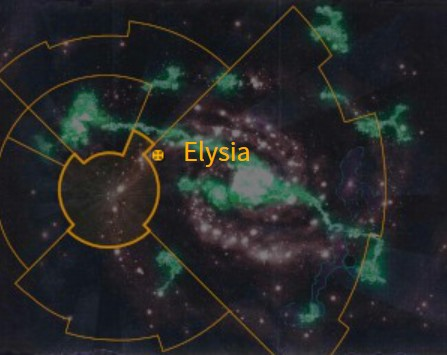

# 0981 艾丽西亚 Elysia

精校状态：中文行文已逐段精校，部分术语仍为暂定

分类：地理 / 真实空间 Real Space / 太阳星域 Segmentum Solar

原文来源：https://www.bilibili.com/opus/1158017461849686070

原作者：帝国神选罐头

原文时间：2026年01月15日 14:59

[返回分类目录](目录.md) · [全书目录](../../目录.md)

<!-- A0981-B0001 图片 -->

<!-- A0981-B0002 -->

原译文

Map 地图

**校订译文**

Map 地图

<!-- /A0981-B0002 -->

<!-- A0981-B0003 -->
### Basic Data 基本资料

原题：Basic Data 基础数据

<!-- /A0981-B0003 -->

<!-- A0981-B0004 -->
**英文原文**

Name:Elysia

<!-- /A0981-B0004 -->

<!-- A0981-B0005 -->

原译文

名称：艾丽西亚

**校订译文**

名称：艾丽西亚

<!-- /A0981-B0005 -->

<!-- A0981-B0006 -->
**英文原文**

Segmentum:Segmentum Solar

<!-- /A0981-B0006 -->

<!-- A0981-B0007 -->

原译文

星域：太阳星域

**校订译文**

星域：太阳星域

<!-- /A0981-B0007 -->

<!-- A0981-B0008 -->
**英文原文**

System:Elysia System

<!-- /A0981-B0008 -->

<!-- A0981-B0009 -->

原译文

星系：艾丽西亚星系

**校订译文**

星系：艾丽西亚星系

<!-- /A0981-B0009 -->

<!-- A0981-B0010 -->
**英文原文**

Affiliation:Imperium

<!-- /A0981-B0010 -->

<!-- A0981-B0011 -->

原译文

隶属：帝国

**校订译文**

隶属：帝国

<!-- /A0981-B0011 -->

<!-- A0981-B0012 -->
**英文原文**

Class:Civilised World

<!-- /A0981-B0012 -->

<!-- A0981-B0013 -->

原译文

类别：文明世界

**校订译文**

类别：文明世界

<!-- /A0981-B0013 -->

<!-- A0981-B0014 -->
**英文原文**

Elysia is a world of the Imperium surrounded by wilderness space.

<!-- /A0981-B0014 -->

<!-- A0981-B0015 -->

原译文

艾丽西亚是一个被荒芜空域包围的帝国世界。

**校订译文**

艾丽西亚是一个被荒芜空域包围的帝国世界。

<!-- /A0981-B0015 -->

<!-- A0981-B0016 -->
## Overview 概述

<!-- /A0981-B0016 -->

<!-- A0981-B0017 -->
**英文原文**

The areas surrounding the planet are known for their pirates due to the many barren moons, gas clouds, and asteroid fields that provide perfect cover for the outlaws. The Elysians have been forced to master the art of ship-to-ship boarding actions and fighting in concert with orbital support in the face of the threat of pirates.

<!-- /A0981-B0017 -->

<!-- A0981-B0018 -->

原译文

行星周围的地区以海盗而闻名，因为许多贫瘠的卫星、气体云和小行星域为亡命徒提供了完美的掩护。面对海盗的威胁，艾丽西亚人被迫掌握船对船跳帮行动的艺术，并与轨道支援协同作战。

**校订译文**

艾丽西亚周围海盗猖獗：大量荒芜卫星、气体云和小行星带为他们提供了理想掩护。为了应对威胁，艾丽西亚人不得不精通舰船间的跳帮战，并学会配合轨道支援作战。

<!-- /A0981-B0018 -->

<!-- A0981-B0019 -->
**英文原文**

Elysia is most well known for the regiments it provides for the Imperial Guard, known as the Elysian Drop Troops.

<!-- /A0981-B0019 -->

<!-- A0981-B0020 -->

原译文

艾丽西亚最出名的是它为帝国卫队提供的兵团，即艾丽西亚空降军。

**校订译文**

艾丽西亚最出名的是它为帝国卫队提供的兵团，即艾丽西亚空降军。

<!-- /A0981-B0020 -->

<!-- A0981-B0021 -->
## History 历史

<!-- /A0981-B0021 -->

<!-- A0981-B0022 -->
**英文原文**

Sometime after the Great Rift's creation, Elysia was invaded by a large force of Chaos Space Marines. In order to prevent the invaders from becoming a threat to Terra, the Adeptus Custodes Captain-General Trajann Valoris has led the Fury of Terra Shield Host, to battle against the traitors. The proceeding war saw the forces of Chaos defeated and Elysia saved.

<!-- /A0981-B0022 -->

<!-- A0981-B0023 -->

原译文

在大裂隙形成后的某个时候，艾丽西亚被一支庞大的混沌星际战士部队入侵。为了防止入侵者对泰拉构成威胁，禁军元帅图拉真·瓦洛里斯率领泰拉之盾之怒天军，与叛徒作战。在接下来的战争中，混沌部队被击败，艾丽西亚得救了。

**校订译文**

大裂隙出现后，一支庞大的混沌星际战士部队入侵艾丽西亚。为阻止他们进一步威胁泰拉，禁军元帅图拉真·瓦洛瑞斯率领“泰拉之怒”盾卫军团前去迎战。最终，混沌部队战败，艾丽西亚获救。

**校注：** Fury of Terra 修饰 Shield Host，按其组织类型为泰拉之怒盾卫军团；Shield Host 的词根参考 GW09/GW10 第3页，整个具名部队仍暂定。原泰拉之盾之怒天军误断结构。

<!-- /A0981-B0023 -->

本篇核心术语与暂定项

以下列出本篇出现的英文原形及核心术语表用词。同形词可能指不同对象，具体词义以本篇正文和校注为准；单复数、别名和仅见于图注的名称可能尚未列入。完整候选见[术语表](../../术语表/双语术语候选.csv)。

| 英文 | 采用中文 | 状态 |
| --- | --- | --- |
| Space Marines | 星际战士 | 官方已核对 |
| Adeptus Custodes | 帝皇禁军 | 官方已核对 |
| Imperial Guard | 帝国卫队 | 暂定·语境区分 |
| Chaos Space Marines | 混沌星际战士 | 官方已核对 |
| Great Rift | 大裂隙 | 官方已核对 |
| Imperium | 帝国 | 暂定·简称 |
| Terra | 泰拉 | 暂定·官方待核 |
| Segmentum Solar | 太阳星域 | 暂定·官方待核 |
| Segmentum | 星域 | 暂定·官方待核 |
| Elysia | 艾丽西亚 | 暂定·官方待核 |
| Master | 导师（审判庭职衔）／舰务官（舰员职务） | 语境定译·官方待核 |
| Trajann Valoris | 图拉真·瓦洛瑞斯 | 官方已核对 |
| Shield Host | 盾卫军团 | 官方已核对 |
| Captain-General | 禁军元帅 | 暂定·官方待核 |
| Captain | 连长 | 暂定·官方待核 |
| Invaders | 侵略者 | 暂定·官方待核 |
| Host | 天军 | 暂定·官方待核 |
| Wilderness Space | 荒野空域 | 暂定·官方待核 |
| System | 星系（恒星系统） | 暂定·官方待核 |
| Civilised World | 文明世界 | 暂定·官方待核 |
| Elysian Drop Troops | 艾丽西亚空降兵 | 暂定·官方待核 |
| Fury of Terra | 泰拉之怒盾卫军团 | 暂定·官方待核 |

