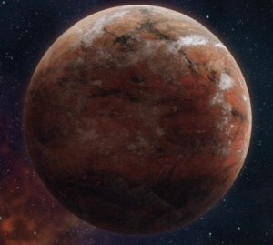

# 0982 帕拉马尔五号 Paramar V

精校状态：中文行文已逐段精校，部分术语仍为暂定

分类：地理 / 真实空间 Real Space / 太阳星域 Segmentum Solar

原文来源：https://www.bilibili.com/opus/1198731707453276162

原作者：帝国神选罐头

原文时间：2026年05月05日 08:11

[返回分类目录](目录.md) · [全书目录](../../目录.md)

<!-- A0982-B0001 -->
### Basic Data 基本资料

原题：Basic Data 基础数据

<!-- /A0982-B0001 -->

<!-- A0982-B0002 -->
**英文原文**

Name:Paramar V

<!-- /A0982-B0002 -->

<!-- A0982-B0003 -->

原译文

名称：帕拉马尔五号

**校订译文**

名称：帕拉马尔五号

<!-- /A0982-B0003 -->

<!-- A0982-B0004 -->
**英文原文**

Segmentum:Segmentum Solar

<!-- /A0982-B0004 -->

<!-- A0982-B0005 -->

原译文

星域：太阳星域

**校订译文**

星域：太阳星域

<!-- /A0982-B0005 -->

<!-- A0982-B0006 -->
**英文原文**

System:Paramar System

<!-- /A0982-B0006 -->

<!-- A0982-B0007 -->

原译文

星系：帕拉马尔星系

**校订译文**

星系：帕拉马尔星系

<!-- /A0982-B0007 -->

<!-- A0982-B0008 -->
**英文原文**

Affiliation:Imperium

<!-- /A0982-B0008 -->

<!-- A0982-B0009 -->

原译文

隶属：帝国

**校订译文**

隶属：帝国

<!-- /A0982-B0009 -->

<!-- A0982-B0010 -->
**英文原文**

Class:Mechanicum World

<!-- /A0982-B0010 -->

<!-- A0982-B0011 -->

原译文

类别：机械教世界

**校订译文**

类别：机械教世界

<!-- /A0982-B0011 -->

<!-- A0982-B0012 图片 -->

<!-- A0982-B0013 -->

原译文

Planetary Image 行星图像

**校订译文**

Planetary Image 行星图像

<!-- /A0982-B0013 -->

<!-- A0982-B0014 -->
**英文原文**

Paramar V is a world of the Imperium under the domain of the Adeptus Mechanicus of Gryphonne IV.

<!-- /A0982-B0014 -->

<!-- A0982-B0015 -->

原译文

帕拉马尔五号是格里芬四号机械教的领地下的帝国世界。

**校订译文**

帕拉马尔五号是帝国行星，隶属格里芬四号的机械修会。

**校注：** 本条简介英文为 Adeptus Mechanicus，基础类别及早期历史则为 Mechanicum，分别译机械修会／机械教，不擅自替英文统一年代用词。

<!-- /A0982-B0015 -->

<!-- A0982-B0016 -->
## Overview 概述

<!-- /A0982-B0016 -->

<!-- A0982-B0017 -->
**英文原文**

At one point a life-bearing world covered in oceans, millennia before the dawn of the Imperium Paramar V was reduced to an arid, radiation-swept wasteland scoured by solar winds. The planet's atmosphere is only breathable with artificial aid and the surface temperature varies wildly (due to its thin atmosphere and slow day/night cycle). It is believed by the Mechanicum that Paramar V's composition was artificially engineered at some point in the distant past.

<!-- /A0982-B0017 -->

<!-- A0982-B0018 -->

原译文

在帕拉马尔五号帝国黎明前的数千年里，一个被海洋覆盖的有生命的世界一度沦为一片被太阳风冲刷的干旱、辐射席卷的荒地。这颗行星的大气层只有在人工辅助下才能呼吸，表面温度变化很大（由于大气层薄，昼夜循环缓慢）。机械教认为，帕拉马尔五号的构成是在遥远的过去的某个时候人工设计的。

**校订译文**

帕拉马尔五号曾遍布海洋、孕育生命，但早在帝国建立数千年前，它就已沦为干旱荒原，遭受辐射与恒星风侵袭。当地空气必须经过人工处理或借助辅助设备才可供人呼吸。由于大气稀薄、昼夜交替缓慢，地表温差极大。机械教认为，这颗行星的构成曾在遥远过去受到人工改造。

<!-- /A0982-B0018 -->

<!-- A0982-B0019 -->
**英文原文**

The Paramar System, including Paramar V, is located in the northern reaches of the Segmentum Solar, in an unusually stable Warp-synchronous location in almost direct conjunction between the Isstvan System and the Sol System. Among other factors, this made Paramar V a strategically crucial planet for Horus when he led his great rebellion against the Imperium.

<!-- /A0982-B0019 -->

<!-- A0982-B0020 -->

原译文

帕拉马尔星系，包括帕拉马尔五号，位于太阳星域的北部，在伊斯塔万星系和太阳系之间几乎直接连接的异常稳定的亚空间同步位置。除其他因素外，这使得帕拉马尔五号在荷鲁斯领导对抗帝国的大叛乱时，成为一颗具有战略重要性的行星。

**校订译文**

包括帕拉马尔五号在内的帕拉马尔星系，位于太阳星域北部一处异常稳定、与亚空间同步的位置，几乎直接连通伊斯塔万星系与太阳系。加上其他因素，这使帕拉马尔五号成为荷鲁斯发动大叛乱时至关重要的战略目标。

<!-- /A0982-B0020 -->

<!-- A0982-B0021 -->
## History 历史

<!-- /A0982-B0021 -->

<!-- A0982-B0022 -->
**英文原文**

The Paramar System was first identified during the Great Crusade, having been recorded in the Carta Imperialis in 803.M30 by the Rogue Trader Hel DeAniasie. Not long afterwards, the system became a waypoint for the Crusade; it quickly expanded from an automated Mechanicum outpost to a refuelling and resupply depot for Imperial Expeditionary Fleets, allowing the Imperium to expand from the Segmentum Solar into the Segmentum Obscurus. In particular, the planet possessed vast untapped geological reserves of hydrocarbons, allowing for the installation of extensive promethium refining operations, and the extensive systems of caves beneath the planet's surface were converted into armoured sub-surface bunkers capable of securely storing gigatons of arms and munitions.

<!-- /A0982-B0022 -->

<!-- A0982-B0023 -->

原译文

帕拉马尔星系最早是在大远征期间发现的，由行商浪人赫尔·德阿尼亚西于803.M30在帝国海图中记录下来。不久之后，该星系成为远征的航路点；它迅速从一个自动化的机械教前哨扩展到帝国远征舰队的燃料补充和补给站，使帝国能够从太阳星域扩展到朦胧星域。特别是，行星拥有巨大的未开发的碳氢化合物地质储量，可以进行大规模的钷素精炼作业，行星表面下广阔的洞穴系统被改造成能够安全储存数十亿吨武器和弹药的装甲地下掩体。

**校订译文**

大远征期间，行商浪人赫尔·德阿尼亚西于803.M30首次将帕拉马尔星系记录在《帝国星图》中。不久后，这里便成为远征的重要中转站，从机械教的自动化前哨迅速扩展为帝国远征舰队的加油和补给基地，支持帝国从太阳星域向朦胧星域扩张。帕拉马尔五号地下蕴藏着大量尚未开发的碳氢化合物，因而建起了大规模钷素精炼设施。广阔的地下洞穴则被改造成装甲掩体，可以安全储存数十亿吨武器弹药。

<!-- /A0982-B0023 -->

<!-- A0982-B0024 -->
**英文原文**

The planet was the site of three battles during the Horus Heresy:

<!-- /A0982-B0024 -->

<!-- A0982-B0025 -->

原译文

在荷鲁斯叛乱时期，这颗行星曾发生过三场战斗：

**校订译文**

荷鲁斯之乱期间，这颗行星经历了三场战役：

<!-- /A0982-B0025 -->

<!-- A0982-B0026 -->
## First Battle of Paramar 第一次帕拉马尔之战

<!-- /A0982-B0026 -->

<!-- A0982-B0027 -->
**英文原文**

Due to the Paramar System's strategic location and Paramar V's weapon and ammo stockpiles, the traitorous Warmaster Horus made taking it a priority target. In 006.M31, following the Isstvan V Dropsite Massacre, Horus tasked Alpharius, primarch of the Alpha Legion, with capturing Paramar intact.

<!-- /A0982-B0027 -->

<!-- A0982-B0028 -->

原译文

由于帕拉马尔星系的战略位置和帕拉马尔五号的武器和弹药库存，叛徒战帅荷鲁斯将其作为优先目标。006.M31，在伊斯塔万五号登陆点大屠杀之后，荷鲁斯委托阿尔法军团的原体阿尔法瑞斯完整地攻占帕拉马尔。

**校订译文**

帕拉马尔星系位置重要，五号行星又储存着大量武器弹药，因此叛变的战帅荷鲁斯将其列为优先夺取的目标。006.M31，伊斯塔万五号空降场大屠杀之后，荷鲁斯命阿尔法军团原体阿尔法瑞斯在不破坏其设施的前提下攻占帕拉马尔。

<!-- /A0982-B0028 -->

<!-- A0982-B0029 -->
**英文原文**

A large contingent of the Alpha Legion, led by the Harrowmaster Armillus Dynat, arrived in the Paramar System and proceeded to have their Spartoí operatives infiltrate key locations, including both the Pharaeon Armada base and Paramar V. Despite the unexpected arrival of the loyalist 77th Grand Battalion of the Iron Warriors bolstering the planet's defences, the Alpha Legion and their allies successfully invaded and conquered Paramar V.

<!-- /A0982-B0029 -->

<!-- A0982-B0030 -->

原译文

由折磨大师阿尔米卢斯·戴纳特领导的阿尔法军团的一支庞大队伍抵达了帕拉马尔星系，并开始让他们的龙牙特工渗透到关键地点，包括法老无敌舰队基地和帕拉马尔五号。尽管忠诚派钢铁勇士第77大营意外抵达，加强了行星的防御，阿尔法军团及其盟友成功入侵并征服了帕拉马尔五号。

**校订译文**

折磨大师阿尔梅琉斯·迪纳特率领大批阿尔法军团战士抵达星系，并派龙牙密探渗透包括法老无敌舰队基地和帕拉马尔五号在内的要地。效忠帝国的钢铁勇士第77大营意外到来，增强了行星的防御；但阿尔法军团及其盟友仍成功攻占了帕拉马尔五号。

<!-- /A0982-B0030 -->

<!-- A0982-B0031 -->
## Second Battle of Paramar 第二次帕拉马尔之战

<!-- /A0982-B0031 -->

<!-- A0982-B0032 -->
**英文原文**

An Imperial counterattack was launched on Paramar in 008.M31.

<!-- /A0982-B0032 -->

<!-- A0982-B0033 -->

原译文

帝国于008.M31对帕拉马尔发动反击。

**校订译文**

帝国于008.M31对帕拉马尔发动反击。

<!-- /A0982-B0033 -->

<!-- A0982-B0034 -->
## Third Battle of Paramar 第三次帕拉马尔之战

<!-- /A0982-B0034 -->

<!-- A0982-B0035 -->
**英文原文**

In 019.M31, Imperial forces made another invasion of Paramar as part of The Scouring.

<!-- /A0982-B0035 -->

<!-- A0982-B0036 -->

原译文

019.M31，帝国军队再次入侵帕拉马尔，作为大清洗的一部分。

**校订译文**

019.M31，帝国部队在大清洗中再次进攻帕拉马尔。

<!-- /A0982-B0036 -->

本篇核心术语与暂定项

以下列出本篇出现的英文原形及核心术语表用词。同形词可能指不同对象，具体词义以本篇正文和校注为准；单复数、别名和仅见于图注的名称可能尚未列入。完整候选见[术语表](../../术语表/双语术语候选.csv)。

| 英文 | 采用中文 | 状态 |
| --- | --- | --- |
| Adeptus Mechanicus | 机械修会 | 官方已核对 |
| Horus Heresy | 荷鲁斯之乱 | 官方已核对 |
| Warp | 亚空间 | 官方已核对 |
| Imperium | 帝国 | 暂定·简称 |
| Mechanicum | 机械教 | 暂定·历史称谓 |
| Rogue Trader | 行商浪人 | 暂定 |
| Primarch | 原体 | 官方已核对 |
| Iron Warriors | 钢铁勇士 | 暂定·官方待核 |
| Great Crusade | 大远征 | 暂定·官方待核 |
| Horus | 荷鲁斯 | 暂定·官方待核 |
| Segmentum Solar | 太阳星域 | 暂定·官方待核 |
| Segmentum Obscurus | 朦胧星域 | 暂定·官方待核 |
| Segmentum | 星域 | 暂定·官方待核 |
| Gryphonne IV | 格里芬四号 | 暂定·官方待核 |
| Obscurus | 朦胧星 | 暂定·官方待核 |
| Alpha Legion | 阿尔法军团 | 暂定·官方待核 |
| Sol | 太阳系 | 暂定·官方待核 |
| Isstvan | 伊斯塔万 | 暂定·官方待核 |
| Armillus Dynat | 阿尔梅琉斯·迪纳特 | 暂定·官方待核 |
| Alpharius | 阿尔法瑞斯 | 暂定·官方待核 |
| Harrowmaster | 折磨大师 | 暂定·官方待核 |
| Imperialis | 帝国徽记 | 暂定·官方待核 |
| Paramar V | 帕拉马尔五号 | 暂定·官方待核 |
| Spartoí | 龙牙密探 | 暂定·官方待核 |
| System | 星系（恒星系统） | 暂定·官方待核 |
| Promethium | 钷素 | 暂定·官方待核 |
| Hel DeAniasie | 赫尔·德阿尼亚西 | 暂定·官方待核 |
| Carta Imperialis | 帝国星图 | 暂定·官方待核 |
| Sol System | 太阳系 | 暂定·官方待核 |

