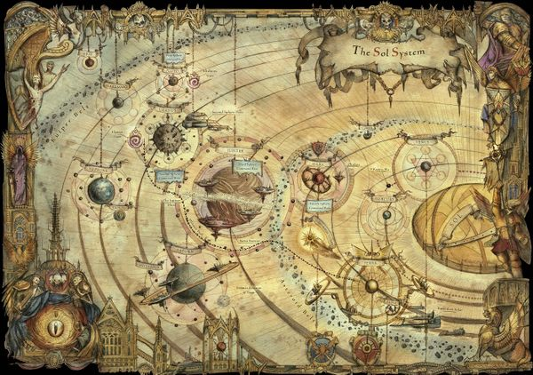

# 0984 太阳系 Sol System

精校状态：中文行文已逐段精校，部分术语仍为暂定

分类：地理 / 真实空间 Real Space / 太阳星域 Segmentum Solar

原文来源：https://www.bilibili.com/opus/1056643885629964306

原作者：帝国神选罐头

原文时间：2025年04月17日 10:37

[返回分类目录](目录.md) · [全书目录](../../目录.md)

<!-- A0984-B0001 -->
**英文原文**

The Sol System or Terran System is the name of the Solar System in the Age of the Imperium. The system is named for its sun, and is part of the Segmentum Solar. Its planets include Holy Terra and Mars.

<!-- /A0984-B0001 -->

<!-- A0984-B0002 -->

原译文

太阳系或泰拉星系是帝国时代太阳系的名称。该系统以其太阳命名，是太阳星域的一部分。它的行星包括神圣泰拉和火星。

**校订译文**

太阳系在帝国时代也被称为泰拉星系，以其恒星太阳命名，属于太阳星域。神圣泰拉与火星都位于其中。

<!-- /A0984-B0002 -->

<!-- A0984-B0003 图片 -->

<!-- A0984-B0004 -->

原译文

Map of the Sol System 太阳系地图

**校订译文**

Map of the Sol System 太阳系地图

<!-- /A0984-B0004 -->

<!-- A0984-B0005 -->
## History 历史

<!-- /A0984-B0005 -->

<!-- A0984-B0006 -->
**英文原文**

The birthplace of humanity on the planet Terra, the Sol System was fully colonized by humans by M15. During the Dark Age of Technology humanity expanded across the stars thanks to the invention of Warp Drives and Navigators, and in this period the Sol System was dominated by the empires of Terra and Mars which coexisted peacefully. During the Age of Strife, the Sol System fell into complete anarchy. Terra collapsed into wars between Techno-Barbarians while Mars reverted to complete isolation and religious worship of technology. Salvation only came with the coming of the Emperor, who unified Terra, Mars, and then the entire Sol System into the fledgling Imperium during the Unification Wars and Great Crusade.

<!-- /A0984-B0006 -->

<!-- A0984-B0007 -->

原译文

泰拉星球是人类的出生地，太阳系在M15完全被人类殖民。在黑暗技术时代，由于亚空间驱动器和导航者的发明，人类在星际间扩张，在这一时期，太阳系由和平共处的泰拉和火星帝国主导。在纷争时代，太阳系陷入了完全的无政府状态。泰拉陷入了技术蛮人之间的战争，而火星则恢复了完全的孤立和对技术的宗教崇拜。救赎只随着帝皇的到来而到来，他在统一战争和大远征期间将泰拉、火星和整个太阳系统一为羽翼未丰的帝国。

**校订译文**

人类起源于泰拉，到M15时已经完成对太阳系的殖民。黑暗科技时代，亚空间引擎与导航员的出现使人类得以向群星扩张；当时，太阳系由和平共处的泰拉与火星两大帝国主导。纷争时代到来后，星系陷入彻底的无政府状态：泰拉被技术蛮人的战争撕裂，火星则完全闭关自守，形成了对技术的宗教崇拜。直到帝皇崛起，局面才得到扭转。他在统一战争与大远征期间，先后将泰拉、火星及整个太阳系纳入新生的帝国。

<!-- /A0984-B0007 -->

<!-- A0984-B0008 -->
**英文原文**

During the subsequent Horus Heresy, the Sol System was the site of bitter fighting between loyalists and traitors during the Schism of Mars and Solar War. At the final phase of the war Horus' forces succeeded in capturing the Sol System and besieged Terra itself, but were eventually defeated and repelled during the Great Scouring. Since that time, the Sol System has not been the site of all-out war though it did see fighting during the War of the Beast, Age of Apostasy, and recently the Battle of Lion's Gate. The System was also saw a minor but mysterious Necron raid on Mars in late M41.

<!-- /A0984-B0008 -->

<!-- A0984-B0009 -->

原译文

在随后的荷鲁斯叛乱时期，太阳系是火星和太阳战争分裂期间忠诚者和叛徒之间激烈战斗的场所。在战争的最后阶段，荷鲁斯的部队成功占领了太阳系并围攻了泰拉本身，但最终在大清洗中被击败和击退。从那时起，太阳系就没有成为全面战争的地点，尽管它在野兽战争、叛教时代和最近的狮门之战中确实发生了战斗。M41晚期，该星系还被观察到对火星进行了一次轻微但神秘的太空死灵突袭。

**校订译文**

荷鲁斯之乱期间，忠诚派与叛军在火星分裂及太阳战争中激烈交锋。战争末期，荷鲁斯的部队占领太阳系，并围攻泰拉；他们最终战败，在大清洗中被逐出。此后太阳系未再经历全面战争，但野兽战争、叛教时代以及较近的狮门之战都曾令这里重燃战火。M41晚期，太空死灵还曾对火星发动一次规模不大却十分神秘的突袭。

<!-- /A0984-B0009 -->

<!-- A0984-B0010 -->
**英文原文**

During the Noctis Aeterna the Sol System was threatened by the Khornate Crusade of Slaughter but subsequently defeated by an Indomitus Crusade fleet under Cassandra VanLeskus. In addition, Ganymede became infested with Daemons and the Grey Knights were forced to purge the planet.

<!-- /A0984-B0010 -->

<!-- A0984-B0011 -->

原译文

在永恒之夜期间，太阳系受到恐虐屠杀远征的威胁，但随后被卡珊德拉·凡勒斯库斯领导的不屈远征舰队击败。此外，木卫三被恶魔侵扰，灰骑士被迫净化星球。

**校订译文**

永恒之夜期间，恐虐的屠杀远征威胁太阳系，随后被卡桑德拉·凡·莱斯库斯指挥的不屈远征舰队击败。木卫三也遭到恶魔侵扰，灰骑士被迫对其进行净化。

**校注：** 被击败的是恐虐远征军，原中文句法使“太阳系”成为被击败的主语。

<!-- /A0984-B0011 -->

<!-- A0984-B0012 -->
## Planets 行星

<!-- /A0984-B0012 -->

<!-- A0984-B0013 -->
**英文原文**

Mercury - Mining World

<!-- /A0984-B0013 -->

<!-- A0984-B0014 -->

原译文

水星（墨丘利） - 矿业世界

**校订译文**

水星（墨丘利） - 矿业世界

<!-- /A0984-B0014 -->

<!-- A0984-B0015 -->
**英文原文**

Venus - Industrial World

<!-- /A0984-B0015 -->

<!-- A0984-B0016 -->

原译文

金星（维纳斯）- 工业世界

**校订译文**

金星（维纳斯）- 工业世界

<!-- /A0984-B0016 -->

<!-- A0984-B0017 -->
**英文原文**

Terra - Throneworld of the Imperium

<!-- /A0984-B0017 -->

<!-- A0984-B0018 -->

原译文

泰拉（地球） - 帝国王座世界

**校订译文**

泰拉（地球） - 帝国王座世界

<!-- /A0984-B0018 -->

<!-- A0984-B0019 -->
**英文原文**

Luna - Moon of Terra

<!-- /A0984-B0019 -->

<!-- A0984-B0020 -->

原译文

月球（露娜） - 泰拉的卫星

**校订译文**

月球（露娜） - 泰拉的卫星

<!-- /A0984-B0020 -->

<!-- A0984-B0021 -->
**英文原文**

Mars - Forge World and capital of the Adeptus Mechanicus

<!-- /A0984-B0021 -->

<!-- A0984-B0022 -->

原译文

火星（玛尔斯） - 铸造世界与机械神教首都

**校订译文**

火星（玛尔斯）——铸造世界，也是机械修会的首都。

<!-- /A0984-B0022 -->

<!-- A0984-B0023 -->
**英文原文**

Phobos - Moon of Mars

<!-- /A0984-B0023 -->

<!-- A0984-B0024 -->

原译文

火卫一（福波斯） - 火星的卫星

**校订译文**

火卫一（福波斯） - 火星的卫星

<!-- /A0984-B0024 -->

<!-- A0984-B0025 -->
**英文原文**

Ceres - Dwarf Planet

<!-- /A0984-B0025 -->

<!-- A0984-B0026 -->

原译文

谷神星（刻瑞斯） - 矮行星

**校订译文**

谷神星（刻瑞斯） - 矮行星

<!-- /A0984-B0026 -->

<!-- A0984-B0027 -->
**英文原文**

Jupiter - Forge World/Mining World

<!-- /A0984-B0027 -->

<!-- A0984-B0028 -->

原译文

木星（朱庇特） - 铸造世界/矿业世界

**校订译文**

木星（朱庇特） - 铸造世界/矿业世界

<!-- /A0984-B0028 -->

<!-- A0984-B0029 -->
**英文原文**

Ganymede - Hub-Fortress

<!-- /A0984-B0029 -->

<!-- A0984-B0030 -->

原译文

木卫三（加尼米德） - 枢纽要塞

**校订译文**

木卫三（加尼米德） - 枢纽要塞

<!-- /A0984-B0030 -->

<!-- A0984-B0031 -->
**英文原文**

Saturn - Inquisitorial Fortress

<!-- /A0984-B0031 -->

<!-- A0984-B0032 -->

原译文

土星（萨图恩） - 审判庭堡垒

**校订译文**

土星（萨图恩） - 审判庭堡垒

<!-- /A0984-B0032 -->

<!-- A0984-B0033 -->
**英文原文**

Titan - Moon of Saturn and Homeworld of the Grey Knights

<!-- /A0984-B0033 -->

<!-- A0984-B0034 -->

原译文

土卫六（泰坦） - 土星的卫星和灰骑士的家园世界

**校订译文**

土卫六（泰坦） - 土星的卫星和灰骑士的家园世界

<!-- /A0984-B0034 -->

<!-- A0984-B0035 -->
**英文原文**

Deimos - Sub-moon of Titan, previously a moon of Mars)

<!-- /A0984-B0035 -->

<!-- A0984-B0036 -->

原译文

火卫二（迪莫斯） - 土卫六的次卫星，以前是火星的卫星

**校订译文**

迪莫斯（原称火卫二）——土卫六的次卫星，原先是火星的卫星。

<!-- /A0984-B0036 -->

<!-- A0984-B0037 -->
**英文原文**

Enceladus - Moon of Saturn.

<!-- /A0984-B0037 -->

<!-- A0984-B0038 -->

原译文

土卫二（恩克拉多斯） - 土星的卫星。

**校订译文**

土卫二（恩克拉多斯） - 土星的卫星。

<!-- /A0984-B0038 -->

<!-- A0984-B0039 -->

原译文

Uranus 天王星（乌拉诺斯）

**校订译文**

Uranus 天王星（乌拉诺斯）

<!-- /A0984-B0039 -->

<!-- A0984-B0040 -->
**英文原文**

Elysian Gate - One of the two stable Warp routes into the Sol System built during the Dark Age of Technology.

<!-- /A0984-B0040 -->

<!-- A0984-B0041 -->

原译文

极乐世界之门 - 黑暗技术时代建造的两条进入太阳系的稳定亚空间航道之一。

**校订译文**

极乐之门——黑暗科技时代建成的两条通往太阳系的稳定亚空间航路之一。

<!-- /A0984-B0041 -->

<!-- A0984-B0042 -->

原译文

Neptune 海王星（涅普顿）

**校订译文**

Neptune 海王星（涅普顿）

<!-- /A0984-B0042 -->

<!-- A0984-B0043 -->
**英文原文**

Pluto - Dwarf Planet

<!-- /A0984-B0043 -->

<!-- A0984-B0044 -->

原译文

冥王星（普鲁托） - 矮行星

**校订译文**

冥王星（普鲁托） - 矮行星

<!-- /A0984-B0044 -->

<!-- A0984-B0045 -->
**英文原文**

Khthonic Gate - One of the two stable Warp routes into the Sol System built during the Dark Age of Technology.

<!-- /A0984-B0045 -->

<!-- A0984-B0046 -->

原译文

地府之门 - 黑暗技术时代建造的两条稳定的进入太阳系的亚空间航道之一。

**校订译文**

赫索尼克之门——黑暗科技时代建成的两条通往太阳系的稳定亚空间航路之一。

<!-- /A0984-B0046 -->

<!-- A0984-B0047 -->
**英文原文**

Makemake - Dwarf Planet

<!-- /A0984-B0047 -->

<!-- A0984-B0048 -->

原译文

鸟神星（迈克马克） - 矮行星

**校订译文**

鸟神星（迈克马克） - 矮行星

<!-- /A0984-B0048 -->

<!-- A0984-B0049 -->
**英文原文**

Eris - Dwarf Planet

<!-- /A0984-B0049 -->

<!-- A0984-B0050 -->

原译文

阋神星（厄里斯） - 矮行星

**校订译文**

阋神星（厄里斯） - 矮行星

<!-- /A0984-B0050 -->

<!-- A0984-B0051 -->
**英文原文**

Other celestial objects in the Sol System include the Oort Cloud, The Comet and Artefact 9-Kappa-Mu.

<!-- /A0984-B0051 -->

<!-- A0984-B0052 -->

原译文

太阳系中的其他天体包括奥尔特云、彗星和9-卡帕-穆遗迹。

**校订译文**

太阳系中的其他天体包括奥尔特云、彗星和9-卡帕-穆遗迹。

<!-- /A0984-B0052 -->

<!-- A0984-B0053 -->
## Defences 防御

<!-- /A0984-B0053 -->

<!-- A0984-B0054 -->
**英文原文**

As the centre of the Imperium, the Sol System sports the heaviest known defences in the Galaxy. At the very edge of the System near the Mandeville Point are arrays of Star Forts garrisoned by Regiments of the Imperial Guard. The rest of the outer System is densely laced with thousand-mile-wide minefields, Imperial Navy patrol monitors, and enormous Hunter Servitors. Past these is the core defences of the system, most notably the enormous Battlefleet Solar of the Imperial Navy. In addition to these forces, the Grey Knights, Inquisition, Adeptus Mechanicus, and Adeptus Arbites all have substantial forces in-system deployed through endless bases, stations, and garrisons. At Terra itself orbits the massively powerful Imperial Fists battlestation known as The Phalanx. Due to the massive daily influx of zealots, adepts, bureaucrats, merchants, pilgrims, and the like, daily security is screened heavily by the Adeptus Custodes. The Custodes maintain surveillance stations and listening devices throughout the System.

<!-- /A0984-B0054 -->

<!-- A0984-B0055 -->

原译文

作为帝国的中心，太阳系拥有银河系中已知最重的防御工事。在曼德维尔角附近的星系边缘，是帝国卫队各兵团驻守的星堡阵列。外部系统的其余部分密集地分布着数千英里宽的雷区、帝国海军巡逻监视器和巨大的猎手机仆。除了这些，还有该星系的核心防御，最引人注目的是帝国海军庞大的太阳舰队。除了这些部队，灰骑士、审判庭、机械神教和法务部都有大量的部队部署在无尽的基地、派驻和驻军中。在泰拉，强大的帝国之拳战斗要塞被称为山阵号。由于狂热分子、行家、官僚、商人、朝圣者等每天大量涌入，日常安全受到禁军的严格审查。禁军在整个系统中维护监控站和监听设备。

**校订译文**

作为帝国的中心，太阳系拥有银河中已知最严密的防御。星系最外缘、曼德维尔点附近布设着成列星堡，由帝国卫队各团驻守。外围其余区域遍布宽达千英里的雷区、帝国海军巡逻监视舰和巨型猎手机仆。再往内便是核心防线，其中最主要的力量是帝国海军规模庞大的太阳战斗舰队。此外，灰骑士、审判庭、机械修会及法务部也在星系内的无数基地、空间站与驻防地部署了大量兵力。威力巨大的帝国之拳战斗要塞山阵号环绕泰拉运行。每天都有海量狂信者、帝国任职者、官僚、商人和朝圣者等涌入，帝皇禁军因此实施严密的安全审查，并在整个星系设有监控站和监听装置。

**校注：** monitor 为舰种，非监视器；Mandeville Point 为曼德维尔点，非角；adepts 指帝国任职者，非泛义行家。

<!-- /A0984-B0055 -->

<!-- A0984-B0056 -->
**英文原文**

Known Imperial Guard Regiments based in the Sol System include the Palatine Sentinels, Lucifer Blacks, Jupiter Storms, Auroran Rifles, Granite Myrmidons, Inferallti Hussars, Orion Watch, and potentially the Terran Praefects.

<!-- /A0984-B0056 -->

<!-- A0984-B0057 -->

原译文

已知的以太阳系为基地的帝国卫队包括帕拉廷哨兵、路西法黑卫、木星风暴、欧罗拉步枪、花岗岩密尔弥冬、地狱骠骑兵、猎户座守望，以及可能的泰拉总督。

**校订译文**

已知驻扎太阳系的帝国卫队部队包括帕拉廷哨兵、路西法黑卫、木星风暴、欧罗拉步枪团、花岗岩密尔弥冬、因费拉尔提骠骑兵和猎户座守望；泰拉总督团也可能驻扎于此。

**校注：** Terran Praefects 是兵团称号，此处暂加团避免误作行政总督；是否驻扎太阳系仍按英文 potentially 保留不确定性。

<!-- /A0984-B0057 -->

<!-- A0984-B0058 -->
**英文原文**

Known Star Forts in the Sol System include the Oracle Maximus, Prescience, Taon Aegis and Eyrie Prime. These are overseen by the Adeptus Custodes.

<!-- /A0984-B0058 -->

<!-- A0984-B0059 -->

原译文

太阳系中已知的星堡包括最大神谕、预知、陶恩宙斯盾和主鹰巢。这些由禁军监管。

**校订译文**

太阳系已知星堡包括至高神谕、预知、陶恩之盾和主鹰巢，均由帝皇禁军监管。

<!-- /A0984-B0059 -->

本篇核心术语与暂定项

以下列出本篇出现的英文原形及核心术语表用词。同形词可能指不同对象，具体词义以本篇正文和校注为准；单复数、别名和仅见于图注的名称可能尚未列入。完整候选见[术语表](../../术语表/双语术语候选.csv)。

| 英文 | 采用中文 | 状态 |
| --- | --- | --- |
| Grey Knights | 灰骑士 | 官方已核对 |
| Adeptus Custodes | 帝皇禁军 | 官方已核对 |
| Adeptus Mechanicus | 机械修会 | 官方已核对 |
| Imperial Guard | 帝国卫队 | 暂定·语境区分 |
| Horus Heresy | 荷鲁斯之乱 | 官方已核对 |
| Warp | 亚空间 | 官方已核对 |
| Inquisition | 审判庭 | 暂定 |
| Imperium | 帝国 | 暂定·简称 |
| Imperial Navy | 帝国海军 | 暂定 |
| Dark Age of Technology | 黑暗科技时代 | 暂定 |
| Mandeville Point | 曼德维尔点 | 暂定 |
| Indomitus | 不屈学派 | 暂定·学派语境 |
| Imperial Fists | 帝国之拳 | 暂定 |
| Phalanx | 山阵号 | 暂定 |
| Emperor | 帝皇 | 官方已核对 |
| Adeptus Arbites | 法务部 | 暂定 |
| Forge World | 铸造世界 | 暂定·官方待核 |
| Age of Apostasy | 叛教时代 | 暂定·官方待核 |
| Great Crusade | 大远征 | 暂定·官方待核 |
| Age of Strife | 纷争时代 | 暂定·官方待核 |
| Terra | 泰拉 | 暂定·官方待核 |
| Horus | 荷鲁斯 | 暂定·官方待核 |
| Navigators | 导航员 | 官方已核对 |
| Indomitus Crusade | 不屈远征 | 暂定·官方待核 |
| Unification Wars | 统一战争 | 暂定·官方待核 |
| Segmentum Solar | 太阳星域 | 暂定·官方待核 |
| Segmentum | 星域 | 暂定·官方待核 |
| Age of the Imperium | 帝国时代 | 暂定·官方待核 |
| Mars | 火星 | 暂定·官方待核 |
| Jupiter | 木星 | 暂定·官方待核 |
| Deimos | 迪莫斯 | 暂定·官方待核 |
| Luna | 月球 | 暂定·官方待核 |
| Phobos | 火卫一 | 暂定·官方待核 |
| Venus | 金星 | 暂定·官方待核 |
| Mercury | 水星 | 暂定·官方待核 |
| Titan | 泰坦 | 暂定·官方待核 |
| Palatine | 宫廷官 | 官方已核对 |
| Sol | 太阳系 | 暂定·官方待核 |
| The Phalanx | 山阵号 | 暂定·官方待核 |
| The Beast | 野兽 | 暂定·官方待核 |
| Great Scouring | 大清洗 | 暂定·官方待核 |
| Elysian Gate | 极乐之门 | 暂定·官方待核 |
| Khthonic Gate | 赫索尼克之门 | 暂定·官方待核 |
| The Comet | 彗星 | 暂定·官方待核 |
| Inferallti Hussars | 因费拉尔提骠骑兵 | 暂定·官方待核 |
| The Dark | 《黑暗》 | 暂定·官方待核 |
| Jupiter Storms | 木星风暴 | 暂定·官方待核 |
| Orion Watch | 猎户座看守 | 暂定·官方待核 |
| Granite Myrmidons | 花岗岩密尔弥冬 | 暂定·官方待核 |
| System | 星系（恒星系统） | 暂定·官方待核 |
| Noctis Aeterna | 永恒之夜 | 暂定·官方待核 |
| Hub-Fortress | 枢纽堡垒 | 暂定·官方待核 |
| Industrial World | 工业世界 | 暂定·官方待核 |
| Mining World | 矿业世界 | 暂定·官方待核 |
| Oracle Maximus | 至高神谕 | 暂定·官方待核 |
| Taon Aegis | 陶恩之盾 | 暂定·官方待核 |
| Terran Praefects | 泰拉总督团 | 暂定·官方待核 |
| Saturn | 土星 | 暂定·官方待核 |
| Sol System | 太阳系 | 暂定·官方待核 |
| Lion's Gate | 狮门 | 暂定·官方待核 |

