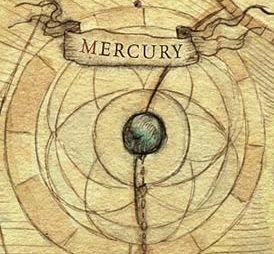

# 0986 水星 Mercury

精校状态：中文行文已逐段精校，部分术语仍为暂定

分类：地理 / 小行星

原文来源：https://www.bilibili.com/opus/1169993763449208839

原作者：帝国神选罐头

原文时间：2026年02月16日 21:33

[返回分类目录](目录.md) · [全书目录](../../目录.md)

<!-- A0986-B0001 -->
### Basic Data 基本资料

原题：Basic Data 基础数据

<!-- /A0986-B0001 -->

<!-- A0986-B0002 -->
**英文原文**

Name:Mercury

<!-- /A0986-B0002 -->

<!-- A0986-B0003 -->

原译文

名称：水星

**校订译文**

名称：水星

<!-- /A0986-B0003 -->

<!-- A0986-B0004 -->
**英文原文**

Segmentum:Segmentum Solar

<!-- /A0986-B0004 -->

<!-- A0986-B0005 -->

原译文

星域：太阳星域

**校订译文**

星域：太阳星域

<!-- /A0986-B0005 -->

<!-- A0986-B0006 -->
**英文原文**

Sector:Sector Solar

<!-- /A0986-B0006 -->

<!-- A0986-B0007 -->

原译文

星区：太阳星区

**校订译文**

星区：太阳星区

<!-- /A0986-B0007 -->

<!-- A0986-B0008 -->
**英文原文**

Subsector:Subsector Sol

<!-- /A0986-B0008 -->

<!-- A0986-B0009 -->

原译文

分区：太阳分区

**校订译文**

次星区：太阳次星区

<!-- /A0986-B0009 -->

<!-- A0986-B0010 -->
**英文原文**

System:Sol System

<!-- /A0986-B0010 -->

<!-- A0986-B0011 -->

原译文

星系：太阳系

**校订译文**

星系：太阳系

<!-- /A0986-B0011 -->

<!-- A0986-B0012 -->
**英文原文**

Affiliation:Imperium

<!-- /A0986-B0012 -->

<!-- A0986-B0013 -->

原译文

隶属：帝国

**校订译文**

隶属：帝国

<!-- /A0986-B0013 -->

<!-- A0986-B0014 -->
**英文原文**

Class:Mining World

<!-- /A0986-B0014 -->

<!-- A0986-B0015 -->

原译文

类别：矿业世界

**校订译文**

类别：矿业世界

<!-- /A0986-B0015 -->

<!-- A0986-B0016 图片 -->

<!-- A0986-B0017 -->

原译文

Planetary Image 行星图像

**校订译文**

Planetary Image 行星图像

<!-- /A0986-B0017 -->

<!-- A0986-B0018 -->
**英文原文**

Mercury is an Imperial Mining World that lies near Terra in the Sol System.

<!-- /A0986-B0018 -->

<!-- A0986-B0019 -->

原译文

水星是一个帝国矿业世界，位于太阳系的泰拉附近。

**校订译文**

水星是一个帝国矿业世界，位于太阳系的泰拉附近。

<!-- /A0986-B0019 -->

<!-- A0986-B0020 -->
## History 历史

<!-- /A0986-B0020 -->

<!-- A0986-B0021 -->
**英文原文**

During the Dark Age of Technology Mercury's city of Cytheron used force field generators to hold back the rays of Sol itself. This technology was later utilized by the Dark Angels in the form of the Cytheron Pattern Aegis.

<!-- /A0986-B0021 -->

<!-- A0986-B0022 -->

原译文

在黑暗技术时代，水星的西瑟隆城使用力场发生器来阻挡太阳光本身。这项技术后来被黑暗天使以西瑟隆型宙斯盾的形式使用。

**校订译文**

黑暗科技时代，水星的西瑟隆城利用力场发生器抵挡太阳辐射。黑暗天使后来将这项技术用于西瑟隆型防护系统。

**校注：** Aegis 在此为防护技术系统，不是神话专名宙斯盾，暂译西瑟隆型防护系统。

<!-- /A0986-B0022 -->

<!-- A0986-B0023 -->
**英文原文**

During the Horus Heresy, shoal facilities operated in Mercury's orbit despite its conditions. Alpha Legion infiltrators also worked with anti-Imperial scavenger clans in the area during the Solar War. Shortly before the Siege of Terra the Sisters of Silence purged Psykers from Mercury in a bloody pogrom.

<!-- /A0986-B0023 -->

<!-- A0986-B0024 -->

原译文

在荷鲁斯叛乱时期，尽管条件恶劣，水星轨道上仍有浅滩设施在运作。在太阳战争期间，阿尔法军团渗透者还与该地区的反帝国拾荒者部落合作。在泰拉围城前不久，寂静修女在一场血腥的大屠杀中清除了水星上的灵能者。

**校订译文**

尽管环境恶劣，荷鲁斯之乱期间水星轨道上的群集设施仍在运转。太阳战争中，阿尔法军团渗透者还与当地反帝国的拾荒者氏族合作。泰拉围城前夕，寂静修女在一场血腥清剿中杀戮了水星上的灵能者。

**校注：** shoal facilities 指轨道设施群，原“浅滩设施”误套水文词义；具体构型待核。

<!-- /A0986-B0024 -->

<!-- A0986-B0025 -->
**英文原文**

Some time after the Great Rift appeared, preparations for an uprising by a Genestealer Cult were discovered on the planet's Decima-Caldus orbital platform. A combined Talon of Custodians and Silent Sisters struck fast and drove the punishing blade through the cult - right to the Patriarch, killing it outright.

<!-- /A0986-B0025 -->

<!-- A0986-B0026 -->

原译文

大裂隙出现一段时间后，在行星的第十热轨道平台上发现了基因窃取者教派叛乱的准备工作。禁军之爪和寂静修女联合起来，迅速出击，将惩戒之刃穿过教派，直达族长，将其彻底杀死。

**校订译文**

大裂隙出现后，人们发现水星的德西玛-卡尔杜斯轨道平台上有基因窃取者教派正筹备起义。由帝皇禁军与寂静修女合编的一支“利爪”部队迅速出击，深入教派核心，当场击杀了族长。

**校注：** Decima-Caldus 为轨道平台专名，原第十热为字面拆译，暂音译德西玛-卡尔杜斯。a combined Talon 为禁军与寂静修女组成同一支利爪部队；后句 punishing blade 为突袭修辞，非明确的具名武器。

<!-- /A0986-B0026 -->

本篇核心术语与暂定项

以下列出本篇出现的英文原形及核心术语表用词。同形词可能指不同对象，具体词义以本篇正文和校注为准；单复数、别名和仅见于图注的名称可能尚未列入。完整候选见[术语表](../../术语表/双语术语候选.csv)。

| 英文 | 采用中文 | 状态 |
| --- | --- | --- |
| Dark Angels | 黑暗天使 | 官方已核对 |
| Horus Heresy | 荷鲁斯之乱 | 官方已核对 |
| Great Rift | 大裂隙 | 官方已核对 |
| Imperium | 帝国 | 暂定·简称 |
| Dark Age of Technology | 黑暗科技时代 | 暂定 |
| Patriarch | 族长 | 官方已核对 |
| Terra | 泰拉 | 暂定·官方待核 |
| Horus | 荷鲁斯 | 暂定·官方待核 |
| Sisters of Silence | 寂静修女 | 暂定·官方待核 |
| Segmentum Solar | 太阳星域 | 暂定·官方待核 |
| Segmentum | 星域 | 暂定·官方待核 |
| Sector | 星区 | 暂定·官方待核 |
| Subsector | 次星区 | 暂定·官方待核 |
| Mercury | 水星 | 暂定·官方待核 |
| Alpha Legion | 阿尔法军团 | 暂定·官方待核 |
| Sol | 太阳系 | 暂定·官方待核 |
| The Dark | 《黑暗》 | 暂定·官方待核 |
| System | 星系（恒星系统） | 暂定·官方待核 |
| Mining World | 矿业世界 | 暂定·官方待核 |
| Subsector Sol | 太阳次星区 | 暂定·官方待核 |
| Cytheron | 西瑟隆 | 暂定·官方待核 |
| Cytheron Pattern Aegis | 西瑟隆型防护系统 | 暂定·官方待核 |
| Decima-Caldus | 德西玛-卡尔杜斯 | 暂定·官方待核 |
| Sector Solar | 太阳星区 | 暂定·官方待核 |
| Sol System | 太阳系 | 暂定·官方待核 |

