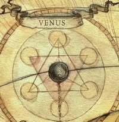

# 0987 金星 Venus

精校状态：中文行文已逐段精校，部分术语仍为暂定

分类：地理 / 小行星

原文来源：https://www.bilibili.com/opus/1169117633043234821

原作者：帝国神选罐头

原文时间：2026年02月14日 12:53

[返回分类目录](目录.md) · [全书目录](../../目录.md)

<!-- A0987-B0001 -->
## Basic Data 基本资料

原题：Basic Data 基础数据

<!-- /A0987-B0001 -->

<!-- A0987-B0002 -->
**英文原文**

Name:Venus

<!-- /A0987-B0002 -->

<!-- A0987-B0003 -->

原译文

名称：金星

**校订译文**

名称：金星

<!-- /A0987-B0003 -->

<!-- A0987-B0004 -->
**英文原文**

Segmentum:Segmentum Solar

<!-- /A0987-B0004 -->

<!-- A0987-B0005 -->

原译文

星域：太阳星域

**校订译文**

星域：太阳星域

<!-- /A0987-B0005 -->

<!-- A0987-B0006 -->
**英文原文**

Sector:Sector Solar

<!-- /A0987-B0006 -->

<!-- A0987-B0007 -->

原译文

星区：太阳星区

**校订译文**

星区：太阳星区

<!-- /A0987-B0007 -->

<!-- A0987-B0008 -->
**英文原文**

Subsector:Subsector Sol

<!-- /A0987-B0008 -->

<!-- A0987-B0009 -->

原译文

分区：太阳分区

**校订译文**

次星区：太阳次星区

<!-- /A0987-B0009 -->

<!-- A0987-B0010 -->
**英文原文**

System:Sol System

<!-- /A0987-B0010 -->

<!-- A0987-B0011 -->

原译文

星系：太阳星系

**校订译文**

星系：太阳系

<!-- /A0987-B0011 -->

<!-- A0987-B0012 -->
**英文原文**

Affiliation:Imperium

<!-- /A0987-B0012 -->

<!-- A0987-B0013 -->

原译文

隶属：帝国

**校订译文**

隶属：帝国

<!-- /A0987-B0013 -->

<!-- A0987-B0014 -->
**英文原文**

Class:Industrial World

<!-- /A0987-B0014 -->

<!-- A0987-B0015 -->

原译文

类别：金星

**校订译文**

类别：工业世界

<!-- /A0987-B0015 -->

<!-- A0987-B0016 图片 -->

<!-- A0987-B0017 -->

原译文

Planetary Image 行星图像

**校订译文**

Planetary Image 行星图像

<!-- /A0987-B0017 -->

<!-- A0987-B0018 -->
**英文原文**

Venus is an Imperium Industrial World that lies near Terra in the Sol System. Originally its abundant volcanism and thick atmosphere made it uninhabitable, but it was terraformed at some point before the rise of the Imperium. There are deep cloud hives on this planet.

<!-- /A0987-B0018 -->

<!-- A0987-B0019 -->

原译文

金星是一个帝国工业世界，位于太阳系中的泰拉附近。最初，它丰富的火山活动和厚厚的大气层使其无法居住，但在帝国崛起之前的某个时候，它被地球化了。这个行星上有很深的云层。

**校订译文**

金星是太阳系内靠近泰拉的一颗帝国工业世界。它原本因火山活动频繁、大气浓密而无法居住，但在帝国崛起之前的某个时期接受了环境改造。如今，浓厚云层深处坐落着巢都。

**校注：** deep cloud hives 指浓云深处的巢都，原译仅写“很深的云层”，漏掉人工城市。

<!-- /A0987-B0019 -->

<!-- A0987-B0020 -->
**英文原文**

During the Great Crusade, Venus was dominated by War Witches who fielded armies of Litho-Gholem. The early Iron Warriors Space Marine Legion led the conquest of Venus during the Mehr Yasht campaign.

<!-- /A0987-B0020 -->

<!-- A0987-B0021 -->

原译文

在大远征期间，金星被战争女巫统治，她们派出了岩石魔像的军队。早期的钢铁勇士星际战士军团在梅赫尔·亚什特战役中领导了对金星的征服。

**校订译文**

大远征期间，战争女巫统治着金星，指挥岩石魔像大军。早期的钢铁勇士军团在梅赫尔·亚什特战役中主导了对金星的征服。

<!-- /A0987-B0021 -->

本篇核心术语与暂定项

以下列出本篇出现的英文原形及核心术语表用词。同形词可能指不同对象，具体词义以本篇正文和校注为准；单复数、别名和仅见于图注的名称可能尚未列入。完整候选见[术语表](../../术语表/双语术语候选.csv)。

| 英文 | 采用中文 | 状态 |
| --- | --- | --- |
| Imperium | 帝国 | 暂定·简称 |
| Iron Warriors | 钢铁勇士 | 暂定·官方待核 |
| Great Crusade | 大远征 | 暂定·官方待核 |
| Terra | 泰拉 | 暂定·官方待核 |
| Segmentum Solar | 太阳星域 | 暂定·官方待核 |
| Segmentum | 星域 | 暂定·官方待核 |
| Sector | 星区 | 暂定·官方待核 |
| Subsector | 次星区 | 暂定·官方待核 |
| Venus | 金星 | 暂定·官方待核 |
| Space Marine Legion | 星际战士军团 | 暂定·官方待核 |
| Sol | 太阳系 | 暂定·官方待核 |
| Space Marine | 星际战士 | 暂定·官方待核 |
| System | 星系（恒星系统） | 暂定·官方待核 |
| Industrial World | 工业世界 | 暂定·官方待核 |
| Subsector Sol | 太阳次星区 | 暂定·官方待核 |
| Litho-Gholem | 岩石魔像 | 暂定·官方待核 |
| Mehr Yasht | 梅赫尔·亚什特战役 | 暂定·官方待核 |
| Sector Solar | 太阳星区 | 暂定·官方待核 |
| Sol System | 太阳系 | 暂定·官方待核 |

