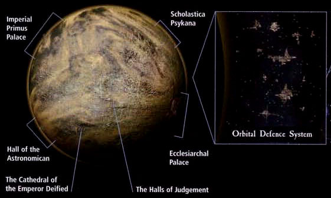
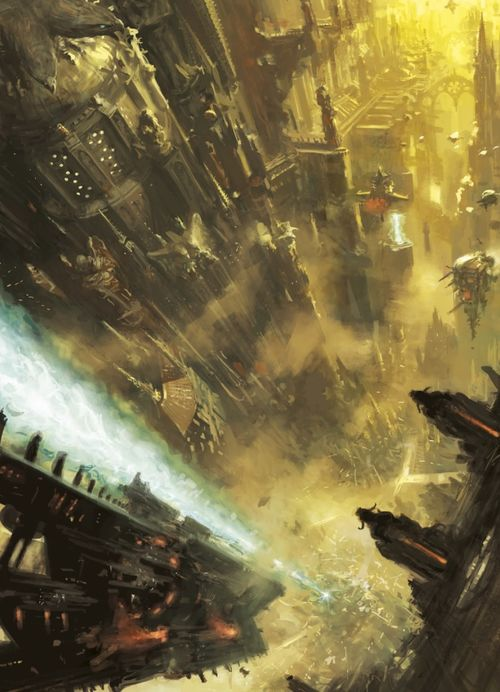
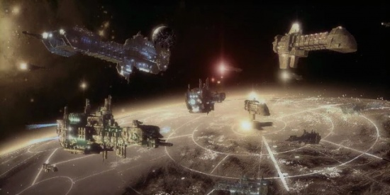
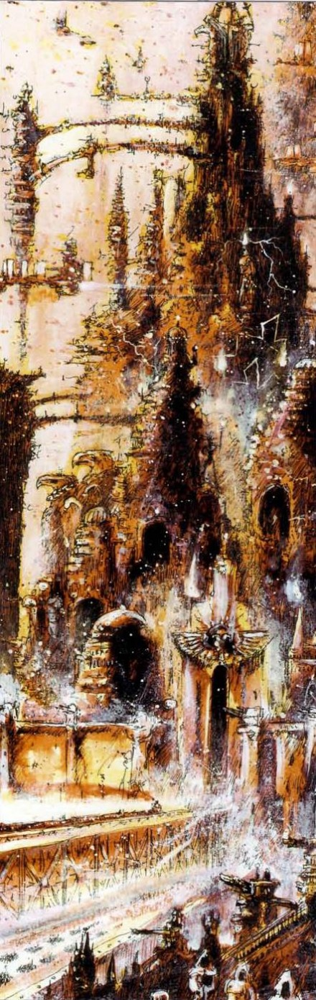
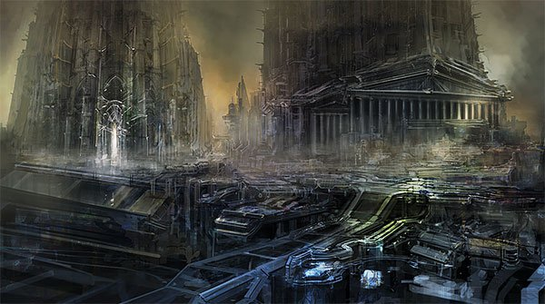
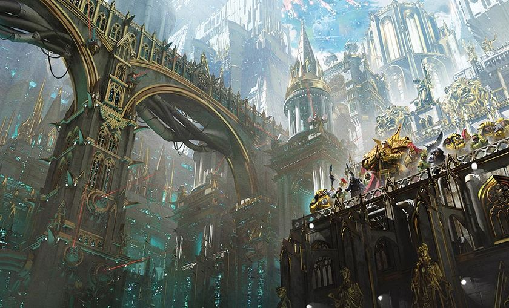

# 0988 泰拉 Terra

精校状态：中文行文已逐段精校，部分术语仍为暂定

分类：地理 / 小行星

原文来源：https://www.bilibili.com/opus/1056407829929263120

原作者：帝国神选罐头

原文时间：2025年04月16日 19:21

[返回分类目录](目录.md) · [全书目录](../../目录.md)

<!-- A0988-B0001 -->
**英文原文**

Beautiful on the surface, but rotten underneath. Don't ever, even for a second, doubt that this is the most dangerous world in the galaxy... Danger does not always come in the shape of orks with bolters, Ragnar. This world is where the elite of the Imperium have gathered. We are talking now of the most ruthless, ambitious, unscrupulous collection of rogues ever culled from a million planets. This is the place they have come to realise their ambitions, and on Terra they can, and will not let anything stand in their way. Not me, not you, not their own kin if need be.

<!-- /A0988-B0001 -->

<!-- A0988-B0002 -->

原译文

表面上光鲜亮丽，实则内里腐朽不堪。千万不要，哪怕只是一秒钟，怀疑这是银河系中最危险的世界……危险可不总是以手持爆弹枪的兽人那种形式出现，拉格纳。这个世界是帝国精英汇聚之地。我们现在所说的，是从一百万个星球中筛选出的最残忍、最有野心、最不择手段的一群无耻之徒。他们来到这里实现自己的抱负，在泰拉，他们能够而且也绝不会让任何事物阻挡他们的道路。挡路的如果是我、是你，甚至是他们的亲人，只要有必要，他们都不会手下留情。

**校订译文**

“表面光鲜，内里腐朽。哪怕一秒钟，也不要怀疑这里是银河中最危险的世界……拉格纳，危险可不总以手持爆矢枪的欧克的模样出现。帝国的精英汇聚于此：这群从百万颗行星中挑出来的无耻之徒，最是冷酷、野心勃勃、不择手段。他们来到这里，就是为了实现自己的野心。在泰拉，他们既有能力，也绝不会容许任何人挡路——无论是我、是你，必要时甚至是他们的至亲。”

<!-- /A0988-B0002 -->

<!-- A0988-B0003 -->
**英文原文**

Torin, Wolfblade to House Belisarius.

<!-- /A0988-B0003 -->

<!-- A0988-B0004 -->

原译文

托林，去贝利撒留家族的狼刃

**校订译文**

——托林，派驻贝利萨留斯家族的狼刃战士

<!-- /A0988-B0004 -->

<!-- A0988-B0005 图片 -->

<!-- A0988-B0006 -->

原译文

Map 地图

**校订译文**

Map 地图

<!-- /A0988-B0006 -->

<!-- A0988-B0007 -->
### Basic Data 基本资料

原题：Basic Data 基本信息

<!-- /A0988-B0007 -->

<!-- A0988-B0008 -->
**英文原文**

Name:Terra

<!-- /A0988-B0008 -->

<!-- A0988-B0009 -->

原译文

名称：泰拉

**校订译文**

名称：泰拉

<!-- /A0988-B0009 -->

<!-- A0988-B0010 -->
**英文原文**

Segmentum:Segmentum Solar

<!-- /A0988-B0010 -->

<!-- A0988-B0011 -->

原译文

星域：太阳星域

**校订译文**

星域：太阳星域

<!-- /A0988-B0011 -->

<!-- A0988-B0012 -->
**英文原文**

Sector:Sector Solar

<!-- /A0988-B0012 -->

<!-- A0988-B0013 -->

原译文

星区：太阳星区

**校订译文**

星区：太阳星区

<!-- /A0988-B0013 -->

<!-- A0988-B0014 -->
**英文原文**

Subsector:Sub-Sector Solar

<!-- /A0988-B0014 -->

<!-- A0988-B0015 -->

原译文

分区：太阳分区

**校订译文**

次星区：太阳次星区

<!-- /A0988-B0015 -->

<!-- A0988-B0016 -->
**英文原文**

System:Sol System

<!-- /A0988-B0016 -->

<!-- A0988-B0017 -->

原译文

星系：太阳系

**校订译文**

星系：太阳系

<!-- /A0988-B0017 -->

<!-- A0988-B0018 -->
**英文原文**

Population:200 Billion to Quadrillions

<!-- /A0988-B0018 -->

<!-- A0988-B0019 -->

原译文

人口：2000亿至万亿

**校订译文**

人口：估计从2000亿至以千万亿计不等

**校注：** Quadrillions 按现代英语短数制为10^15量级，即“千万亿”量级，原“万亿”小了约三个数量级；本条人口来源跨度极大，保留为不同估计范围。

<!-- /A0988-B0019 -->

<!-- A0988-B0020 -->
**英文原文**

Affiliation:Imperium

<!-- /A0988-B0020 -->

<!-- A0988-B0021 -->

原译文

隶属关系：帝国

**校订译文**

隶属关系：帝国

<!-- /A0988-B0021 -->

<!-- A0988-B0022 -->
**英文原文**

Class:Hive World

<!-- /A0988-B0022 -->

<!-- A0988-B0023 -->

原译文

类别：巢都世界

**校订译文**

类别：巢都世界

<!-- /A0988-B0023 -->

<!-- A0988-B0024 -->
**英文原文**

Tithe Grade:Aptus Non

<!-- /A0988-B0024 -->

<!-- A0988-B0025 -->

原译文

什一税等级：特别免税

**校订译文**

什一税等级：特级免税

<!-- /A0988-B0025 -->

<!-- A0988-B0026 图片 -->

<!-- A0988-B0027 -->

原译文

Planetary Image 行星图像

**校订译文**

Planetary Image 行星图像

<!-- /A0988-B0027 -->

<!-- A0988-B0028 -->
**英文原文**

Terra , also dubbed Holy Terra and known in antiquity as Earth, is the homeworld of Mankind, the resting place of the Emperor, and the most holy and revered place in the Imperium. Pilgrims throughout the Imperium flock to Terra - even the barren soil that pilgrims tread upon is considered holy. It is effectively a temple the size of a planet.

<!-- /A0988-B0028 -->

<!-- A0988-B0029 -->

原译文

泰拉，也被称为神圣泰拉，在古代被称为地球，是人类的家园，帝皇的安息之地，也是帝国中最神圣、最受尊敬的地方。整个帝国的朝圣者都涌向泰拉——即使朝圣者踏上的贫瘠土地也被认为是神圣的。它实际上是一座行星大小的圣殿。

**校订译文**

泰拉又称神圣泰拉，古时名为地球，是人类的母星、帝皇的休憩之地，也是帝国最神圣、最受尊崇的世界。各地朝圣者纷纷涌来，就连脚下贫瘠的土壤也被视为圣物。整颗行星俨然是一座巨大的神殿。

<!-- /A0988-B0029 -->

<!-- A0988-B0030 -->
**英文原文**

As the capital world of the Imperium, Terra is also home to the main headquarters of many important Imperial organisations, including the Adeptus Terra, the Administratum, and the Departmento Munitorum.

<!-- /A0988-B0030 -->

<!-- A0988-B0031 -->

原译文

作为帝国的首都，泰拉也是许多重要帝国组织的主要总部所在地，包括中央政务部、内务部和军务部。

**校订译文**

作为帝国首都，泰拉也是中央政务部、内政部、军务部等许多重要机构的总部所在地。

<!-- /A0988-B0031 -->

<!-- A0988-B0032 -->
## History 历史

<!-- /A0988-B0032 -->

<!-- A0988-B0033 -->
### Old Earth 旧地球

<!-- /A0988-B0033 -->

<!-- A0988-B0034 -->
**英文原文**

The Age of Terra is the name given to the period of human history dating from the dawn of mankind to the Dark Age of Technology. Early in Mankind's history, the mysterious Perpetual known only as The Emperor is said to have ruled as a king with Oll Persson as his Warmaster. The two engaged in a war with a Cult which in time would become known as the Cognitae. During their war, Persson defies the Emperor's orders by destroying a Warp-generating tower constructed by the Cognitae.

<!-- /A0988-B0034 -->

<!-- A0988-B0035 -->

原译文

泰拉时代是指从人类诞生到黑暗技术时代的人类历史时期。在人类历史的早期，神秘的永生者只被称为帝皇，据说是以国王的身份统治的，欧尔·佩松是他的战帅。两人与一个后来被称为闻道学派的教派进行了战争。在战争期间，佩松违抗帝皇的命令，摧毁了闻道学派建造的亚空间产生塔。

**校订译文**

“泰拉时代”指从人类诞生至黑暗科技时代开始之前的历史时期。据说，在人类历史早期，后来被称为帝皇的神秘永生者曾以国王身份统治，欧尔·佩松则任其战帅。他们曾与一个后来称为闻道学派的教派交战。战争中，佩松违抗帝皇命令，摧毁了该教派建造的一座能引发亚空间现象的高塔。

**校注：** Warp-generating tower 未说明是产生能量、裂隙或其他亚空间效应，暂译能引发亚空间现象的高塔，不补造装置原理。

<!-- /A0988-B0035 -->

<!-- A0988-B0036 -->
**英文原文**

Later, cities such as Atlantys and Nova Yoruk are cited as being the most legendary and ancient cities of Terra. Nations known as Jermani, Merica, Britania are said to have prospered and wilted during this time. Eventually humanity was able to invent space travel, allowing for the colonization of the Solar System.

<!-- /A0988-B0036 -->

<!-- A0988-B0037 -->

原译文

后来，亚特兰蒂斯和新约鲁克等城市被认为是泰拉最具传奇色彩和最古老的城市。被称为杰曼德、梅里卡、不列颠尼亚的国家据说在这段时间里从繁荣到衰落。最终，人类能够实现太空旅行，从而实现了太阳系的殖民化。

**校订译文**

亚特兰蒂斯与新约鲁克等城市，后来被记为泰拉最古老、最富传奇色彩的都市。据说，杰马尼、梅里卡和不列颠尼亚等国家都在这一时代兴盛而后衰亡。人类最终发明了太空航行技术，开始殖民太阳系。

<!-- /A0988-B0037 -->

<!-- A0988-B0038 -->
### Stellar Exodus 走向群星

原题：Stellar Exodus 离开恒星

<!-- /A0988-B0038 -->

<!-- A0988-B0039 -->
**英文原文**

During the Dark Age of Technology Terra was finally able to leave the Sol System thanks to the advent of Warp Drives. Mankind was able to colonize much of the Galaxy as a result. Terra was the center of an empire that coexisted peacefully with its first colony, Mars.

<!-- /A0988-B0039 -->

<!-- A0988-B0040 -->

原译文

在黑暗技术时代，由于亚空间驱动器的出现，人类终于能够离开太阳系。因此，人类得以在银河系的大部分地区殖民。泰拉是一个与其第一个殖民地火星和平共处的帝国的中心。

**校订译文**

黑暗科技时代，亚空间引擎的出现终于使人类能够离开太阳系，殖民银河的大部分地区。泰拉是一个星际帝国的中心，并与其最早的殖民地火星和平共处。

<!-- /A0988-B0040 -->

<!-- A0988-B0041 -->
### Old Night & Unification 旧夜与统一

<!-- /A0988-B0041 -->

<!-- A0988-B0042 -->
**英文原文**

During the Age of Strife, Terra fell into chaos and mayhem as Techno-barbarians, mutants, warlords, and Psykers rampaged throughout the planet. Becoming a wasteland, it was not until the arrival of the Emperor and his Thunder Warriors that the birthplace of mankind was again unified into a single polity.

<!-- /A0988-B0042 -->

<!-- A0988-B0043 -->

原译文

在纷争时代，泰拉陷入了混沌和混乱，因为技术蛮人、变种人、军阀和灵能者在整个星球上肆虐。星球成为一片荒地，直到帝皇和他的雷霆战士到来，人类的诞生地才再次统一为一个单一的政体。

**校订译文**

纷争时代，技术蛮人、变种人、军阀与灵能者肆虐泰拉，使它陷入动荡与混乱，沦为废土。直到帝皇及其雷霆战士出现，人类的发源地才再次统一在同一政权之下。

**校注：** chaos and mayhem 是普通混乱动荡，不能自动认定为混沌阵营。

<!-- /A0988-B0043 -->

<!-- A0988-B0044 图片 -->

<!-- A0988-B0045 -->

原译文

Terra's landscape 泰拉景观

**校订译文**

Terra's landscape 泰拉景观

<!-- /A0988-B0045 -->

<!-- A0988-B0046 -->
**英文原文**

Before the completion of the Unification Wars, Terra was divided into several competing nations, including:

<!-- /A0988-B0046 -->

<!-- A0988-B0047 -->

原译文

在统一战争结束之前，泰拉被划分为几个相互竞争的国家，包括：

**校订译文**

在统一战争结束之前，泰拉被划分为几个相互竞争的国家，包括：

<!-- /A0988-B0047 -->

<!-- A0988-B0048 -->
**英文原文**

Achaemenid Empire — One of the earlier geopolitical entities to swear allegiance to the Emperor, the Achaemenid Empire had therefore suffered little during the Wars of Unification, avoiding both atomic strike and invasion by Thunder Warriors. A monarchical empire, the population were separated into tribal factions and were apparently a culture of truth and discourse. As a result of the relative peaceful nature of the region and the protection enjoyed by early adoption of Imperial allegiance, the Achaeminians sported few of the genetic defects or abnormalities seen amongst humans during this time and were therefore selected as a recruiting source for the infant Legiones Astartes. The Achaeminians provided the initial Terran intake assigned to Legion XV. The Achaeminians appeared to posses a form of superstitious belief in the mystical power of their ancestors; emblems of Dhul-Qarnayn (their greatest King) were used as charms against harm.

<!-- /A0988-B0048 -->

<!-- A0988-B0049 -->

原译文

阿契美尼德帝国 — 较早宣誓效忠帝皇的地缘政治实体之一，因此在统一战争期间几乎没有遭受任何损失，避免了核弹袭击和雷霆战士的入侵。作为一个君主制帝国，人口被分成部落派系，显然是一种真理和演说的文化。由于该地区相对和平的性质和早期接受效忠帝国所享有的保护，阿契美尼德人几乎没有这一时期人类中常见的遗传缺陷或异常，因此被选为早期阿斯塔特军团的招募来源。阿契美尼德人为第十五军团提供了最初的人员补给。阿契美尼德人似乎对先祖的神秘力量有一种迷信的信仰；杜尔·卡尔奈恩（他们最伟大的国王）的徽章被用作抵御伤害的护身符。

**校订译文**

阿契美尼德帝国——最早向帝皇宣誓效忠的政权之一，因此在统一战争中损失很小，既未遭核打击，也未被雷霆战士入侵。这是一个君主制帝国，人口分属不同部落派系，文化似乎崇尚真实与论辩。当地长期相对和平，又因早早效忠而受到保护，因此居民很少出现这一时代人类常见的遗传缺陷或异常，被选为新生阿斯塔特军团的兵源。第十五军团最初的泰拉新兵便来自这里。阿契美尼德人似乎相信祖先具有神秘力量，会佩戴其最伟大国王杜尔·卡尔奈恩的徽记，作为免受伤害的护符。

<!-- /A0988-B0049 -->

<!-- A0988-B0050 -->
**英文原文**

Afrik — continent with dusty plains

<!-- /A0988-B0050 -->

<!-- A0988-B0051 -->

原译文

非洲大陆 — 尘土飞扬的平原

**校订译文**

阿弗里克——遍布尘土平原的大陆。

**校注：** Afrik 是未来大陆的名称，暂作阿弗里克，与现实 Africa 的非洲区别；原稿直接译非洲大陆。

<!-- /A0988-B0051 -->

<!-- A0988-B0052 -->
**英文原文**

Adedeji - Based in Eastern Africa

<!-- /A0988-B0052 -->

<!-- A0988-B0053 -->

原译文

阿德德吉 - 总部设在东非

**校订译文**

阿德德吉——位于非洲东部的政权。

<!-- /A0988-B0053 -->

<!-- A0988-B0054 -->
**英文原文**

Nordafrik Conclaves

<!-- /A0988-B0054 -->

<!-- A0988-B0055 -->

原译文

诺达弗里克密会

**校订译文**

诺达弗里克密会

<!-- /A0988-B0055 -->

<!-- A0988-B0056 -->
**英文原文**

Xozer - had great and well defended oases. Local 'hierophants knew how to summon daemons. Was destroyed by Ursh

<!-- /A0988-B0056 -->

<!-- A0988-B0057 -->

原译文

泽斯尔 - 有伟大而防御良好的绿洲。当地的祭司长知道如何召唤恶魔。被乌尔什摧毁

**校订译文**

泽斯尔——拥有大片防御严密的绿洲，当地祭司长懂得召唤恶魔。该国后来被乌尔什摧毁。

<!-- /A0988-B0057 -->

<!-- A0988-B0058 -->
**英文原文**

Akkad — Central Asian kingdom

<!-- /A0988-B0058 -->

<!-- A0988-B0059 -->

原译文

阿卡德 — 中亚王国

**校订译文**

阿卡德 — 中亚王国

<!-- /A0988-B0059 -->

<!-- A0988-B0060 -->
**英文原文**

Albia — ruled by the Unspeakable King

<!-- /A0988-B0060 -->

<!-- A0988-B0061 -->

原译文

阿尔比亚 — 由难以言喻的国王统治

**校订译文**

阿尔比亚——由不可言说之王统治。

<!-- /A0988-B0061 -->

<!-- A0988-B0062 -->
**英文原文**

Albyon — inspired by the real life British Isles.

<!-- /A0988-B0062 -->

<!-- A0988-B0063 -->

原译文

阿尔比恩 — 灵感来自现实的不列颠群岛。

**校订译文**

阿尔比恩 — 灵感来自现实的不列颠群岛。

<!-- /A0988-B0063 -->

<!-- A0988-B0064 -->
**英文原文**

Boeotia — An area of Terra mentioned in Imperial records as holding out against full Unification for some considerable time; while tacitly recognizing the Emperor's dominance, the ruling monarchy of Boeotia used all manner of diplomacy in order to avoid losing power. In a show of great patience and benevolence, the Emperor allowed the ruling family of Boeotia - the Yeselti - to carry on like this for over 150 years, with the intention that they would integrate themselves into unified Imperial Terra at their own speed and with as much dignity as possible. Instead, the Yeselti clung onto their independence to the point where, firstly, the Imperial Army was forced to invade the province and finally, Legiones Astartes of the Thousand Sons were assigned to quash the trucculent little state. Boeotia was notable both for the presence of industry and at least one buried shrine to gods worshiped by humans in an earlier age.

<!-- /A0988-B0064 -->

<!-- A0988-B0065 -->

原译文

博奥提亚 — 帝国记录中提到的泰拉地区，在相当长的一段时间内一直反对完全统一；在默许帝皇统治的同时，博奥提亚的君主政体使用了各种外交手段来避免失去权力。为了表现出极大的耐心和仁慈，帝皇允许博奥提亚的统治家族—叶塞尔提—继续这样生活了150多年，目的是让他们以自己的速度和尽可能多的尊严融入统一的帝国土地。相反，叶塞尔提坚持自己的独立，最初，帝国军队被迫入侵该地区，最后，千子军团的阿斯塔特被派去镇压这个残暴的小国。博奥提亚以工业的存在和至少一座埋葬在早期人类崇拜的神的圣地而闻名。

**校订译文**

维奥蒂亚——帝国记载称，这个泰拉政权曾长期拒绝完全统一。当地王室一面默认帝皇的霸权，一面用尽外交手段维持自身权力。帝皇展现出极大的耐心与宽容，容许叶塞尔提王室将这种局面维持了一百五十多年，希望他们能按自己的节奏、尽量体面地融入统一后的帝国泰拉。然而，王室始终坚持独立，最终迫使帝国军进攻当地，随后又由千子军团出面镇压这个顽抗的小国。维奥蒂亚拥有工业设施，地下还至少埋藏着一座供奉古代人类诸神的圣所。

<!-- /A0988-B0065 -->

<!-- A0988-B0066 -->
**英文原文**

Caucasus Wastes — Based on the real life Caucuses.

<!-- /A0988-B0066 -->

<!-- A0988-B0067 -->

原译文

高加索废弃区 — 基于现实的高加索地区。

**校订译文**

高加索荒原——取材于现实中的高加索地区。

<!-- /A0988-B0067 -->

<!-- A0988-B0068 -->
**英文原文**

Ceylonia — hives of this country were attacked by the Emperor's Skylance drop-ships.

<!-- /A0988-B0068 -->

<!-- A0988-B0069 -->

原译文

锡兰 — 这个国家的巢都遭到了帝皇的天空长枪空降船的袭击。

**校订译文**

锡兰——当地巢都曾遭帝皇的天空长枪登陆艇袭击。

<!-- /A0988-B0069 -->

<!-- A0988-B0070 -->
**英文原文**

Ethnarchy — Ruled by eugenicist oligarchs in the Caucasus.

<!-- /A0988-B0070 -->

<!-- A0988-B0071 -->

原译文

部落统治 — 由高加索地区的优生学寡头统治。

**校订译文**

族政国——高加索地区由优生学寡头统治的政权。

<!-- /A0988-B0071 -->

<!-- A0988-B0072 -->

原译文

Europa, (Ancient Europa) 欧罗巴（古欧罗巴）

**校订译文**

Europa, (Ancient Europa) 欧罗巴（古欧罗巴）

<!-- /A0988-B0072 -->

<!-- A0988-B0073 -->

原译文

Franc 法兰克

**校订译文**

Franc 法兰克

<!-- /A0988-B0073 -->

<!-- A0988-B0074 -->
**英文原文**

Hy Brasil — Based in South America.

<!-- /A0988-B0074 -->

<!-- A0988-B0075 -->

原译文

海巴西 — 总部位于南美洲。

**校订译文**

海巴西——位于南美洲。

<!-- /A0988-B0075 -->

<!-- A0988-B0076 -->
**英文原文**

Ind — hives of this country were attacked by the Emperor's Skylance drop-ships.

<!-- /A0988-B0076 -->

<!-- A0988-B0077 -->

原译文

印地—这个国家的巢都遭到了帝皇的天空长枪空降船的袭击。

**校订译文**

印地——当地巢都曾遭帝皇的天空长枪登陆艇袭击。

<!-- /A0988-B0077 -->

<!-- A0988-B0078 -->
**英文原文**

Maulland Sen Confederacy — Based in the Nordic region.

<!-- /A0988-B0078 -->

<!-- A0988-B0079 -->

原译文

莫兰森邦联—总部设在北欧地区。

**校订译文**

莫兰森邦联——位于北欧地区。

<!-- /A0988-B0079 -->

<!-- A0988-B0080 -->

原译文

Merica 梅里卡

**校订译文**

Merica 梅里卡

<!-- /A0988-B0080 -->

<!-- A0988-B0081 -->

原译文

Old Muscovy 古俄国

**校订译文**

Old Muscovy 古俄国

<!-- /A0988-B0081 -->

<!-- A0988-B0082 -->
**英文原文**

Panpacific Empire — Based within the pacific region

<!-- /A0988-B0082 -->

<!-- A0988-B0083 -->

原译文

泛太平洋帝国—以太平洋地区为基地

**校订译文**

泛太平洋帝国——位于太平洋地区。

<!-- /A0988-B0083 -->

<!-- A0988-B0084 -->

原译文

Saragorn Enclave 萨拉贡飞地

**校订译文**

Saragorn Enclave 萨拉贡飞地

<!-- /A0988-B0084 -->

<!-- A0988-B0085 -->

原译文

Sumatura, or Sumaturan 苏马图拉，或苏马图兰

**校订译文**

Sumatura, or Sumaturan 苏马图拉，或苏马图兰

<!-- /A0988-B0085 -->

<!-- A0988-B0086 -->
**英文原文**

Taiga - location of nomadic caterpillar cities

<!-- /A0988-B0086 -->

<!-- A0988-B0087 -->

原译文

泰加-游牧履带车城市的位置

**校订译文**

泰加——游牧式履带城市活动的地区。

<!-- /A0988-B0087 -->

<!-- A0988-B0088 -->
**英文原文**

Terrawatt Clan — Ruled from the Ural Mountains

<!-- /A0988-B0088 -->

<!-- A0988-B0089 -->

原译文

泰拉瓦特氏族—统治乌拉尔山脉

**校订译文**

泰拉瓦特氏族——以乌拉尔山脉为统治中心。

<!-- /A0988-B0089 -->

<!-- A0988-B0090 -->
**英文原文**

Ursh — Based in Central Asia

<!-- /A0988-B0090 -->

<!-- A0988-B0091 -->

原译文

乌尔什 — 总部设在中亚

**校订译文**

乌尔什——位于中亚。

<!-- /A0988-B0091 -->

<!-- A0988-B0092 -->

原译文

Yndonesic Bloc 印尼集团

**校订译文**

Yndonesic Bloc 印尼集团

<!-- /A0988-B0092 -->

<!-- A0988-B0093 -->
### Age of the Imperium 帝国时代

<!-- /A0988-B0093 -->

<!-- A0988-B0094 -->
### Heresy-Era 叛乱时代

原题：Heresy-Era 叛乱前

**校注：** Heresy-Era 指叛乱时代，原“叛乱前”范围错误。

<!-- /A0988-B0094 -->

<!-- A0988-B0095 -->
**英文原文**

Proclaimed the capital of the newly-formed Imperium by the Emperor following the unification of the planet, Terra remained the center of humanity throughout the Great Crusade. Terra was the site of great change during this period, with the continent-spanning Imperial Palace being constructed and the burgeoning Imperial bureaucracy settling on the new throneworld seeing a massive population and construction boom. The Emperor during this time attempted to restore the nature and wildlife to Terra, but ultimately the Horus Heresy would see these dreams crushed.

<!-- /A0988-B0095 -->

<!-- A0988-B0096 -->

原译文

在行星统一后，帝皇宣布泰拉为新成立的帝国的首都，在整个大远征期间，泰拉一直是人类的中心。在这一时期，泰拉发生了巨大的变化。横跨大陆的帝国皇宫正在建造之中，新兴的帝国官僚机构入驻了这个新的王座世界，使得这里出现了大规模的人口增长和建筑热潮。在此期间，帝皇试图恢复泰拉的自然环境和野生动物，但最终荷鲁斯叛乱会看着这些梦想破灭。

**校订译文**

泰拉统一后，帝皇宣布它为新生帝国的首都。整个大远征期间，泰拉始终是人类的中心，并经历了巨大变化：横跨大陆的帝国皇宫开始兴建，新兴官僚机构进驻王座世界，带来人口与建设规模的迅速增长。帝皇也尝试恢复泰拉的自然环境和野生生物，但荷鲁斯之乱最终粉碎了这些梦想。

<!-- /A0988-B0096 -->

<!-- A0988-B0097 图片 -->

<!-- A0988-B0098 -->

原译文

Holy Terra 神圣泰拉

**校订译文**

Holy Terra 神圣泰拉

<!-- /A0988-B0098 -->

<!-- A0988-B0099 -->
**英文原文**

During the Horus Heresy, Terra was the site of the dramatic final battle of the conflict that saw the Emperor crippled and the traitorous Warmaster Horus killed, the Battle of Terra. Terra was devastated during the battle and even ten thousand years later, the scars of the siege were still visible on its ancient infrastructure. During the battle the Emperor's Children were particularly vicious towards Terra's population, engaging in acts of cruelty and debauchery. The terror was so great that in the ten thousand years since the Heresy, the populace of Terra has retained a terror of all Space Marines, loyalist and otherwise. For this reason, there are only a handful of Marines on Terra at any given time, including the Wolfblade, a small unit of Space Wolves assigned as bodyguards to House Belisarius of the Navis Nobilite.

<!-- /A0988-B0099 -->

<!-- A0988-B0100 -->

原译文

在荷鲁斯叛乱期间，泰拉是冲突中戏剧性的最后一场战斗的发生地，这场战斗导致帝皇残废，叛徒战帅荷鲁斯被杀，即泰拉之战。泰拉在战斗中被摧毁，甚至一万年后，其古老的基础设施上仍然可以看到围城的痕迹。在战斗中，帝皇之子对泰拉的人民特别恶毒，残忍和放荡的行为的恐怖是如此之大，以至于在叛乱后的一万年里，泰拉的民众一直对所有星际战士、忠诚派和其他感到恐惧。因此，在任何时候，泰拉上都只有少数星际战士，包括狼刃，这是一支被指派为导航者家族贝利撒留家族保镖的太空野狼小队。

**校订译文**

荷鲁斯之乱的最后决战发生于泰拉：帝皇遭受重创，叛变的战帅荷鲁斯被杀。泰拉在这场战役中遭到严重破坏，一万年后，古老的基础设施上仍能见到围城的伤痕。帝皇之子尤其残暴，对居民施以种种酷虐与放纵的恶行。创伤之深，使当地人在此后一万年间始终畏惧所有星际战士，无论忠诚者还是叛徒。因此，按本条叙述，泰拉通常只有少数星际战士停留，其中包括狼刃：一支负责护卫导航员贵族贝利萨留斯家族的太空野狼小队。

**校注：** 英文 devastated 为遭严重破坏，并非整个泰拉已被摧毁。原文有关当地通常仅有少量星际战士的说法，与末节“野兽战争前帝国之拳全面驻防”可能分别描述不同年代；保留并提醒适用时期。

<!-- /A0988-B0100 -->

<!-- A0988-B0101 -->
### Post-Heresy 叛乱后

<!-- /A0988-B0101 -->

<!-- A0988-B0102 -->
**英文原文**

Since the Heresy, Terra has largely stood as the untouched center of the Imperium, though it was the site of violence during the War of the Beast, The Beheading, Siege of the Eternity Gate, Years of Madness, and the Age of Apostasy. Recently, there have been Genestealer Cults spotted on Terra, beginning the Unthinkable War.

<!-- /A0988-B0102 -->

<!-- A0988-B0103 -->

原译文

自叛乱以来，泰拉在很大程度上一直是帝国未受影响的中心，不过，在野兽战争，斩首行动，永恒之门围攻，疯狂年代以及叛教时代期间，这里曾是暴力冲突频发之地。 最近，在泰拉上发现了基因窃取者教派，开始了无法想象的战争。

**校订译文**

荷鲁斯之乱以后，泰拉作为帝国中心大体未再遭战火摧残，但野兽战争、斩首行动、永恒之门围城、疯狂年代和叛教时代仍曾引发暴力冲突。较近时期，人们又在泰拉发现基因窃取者教派，揭开了“无法想象的战争”。

<!-- /A0988-B0103 -->

<!-- A0988-B0104 -->
**英文原文**

Ten thousand years after the Heresy Terra faced its greatest challenge since Horus' betrayal. Due to the forming of the Great Rift the Astronomican went dark for a period known as the Noctis Aeterna, which on Terra lasted a little over a month. Most travel to Terra was paralyzed and Warp energies began to manifest on the planet, leading to widespread riots, starvation, and madness. Though formidably defended, Terra's defensive forces could not contain the massive social upheavals outside of key structures such as the Palace and many Hives fell into full-scale anarchy. Chaos Cults began to operate openly and recruit from the desperate masses as the mayhem spread. At the behest of Inquisitorial Representative Kleopatra Arx the High Lords of Terra issued the Arx Doctrine which saw much of Terra ceded to mob rule while remaining Imperial forces reinforced the Palace, Forbidden Fortress, and other key structures. Ultimately some 1/4th of Terra was temporarily lost to anarchy. While the Custodes and other forces ventured outside of the Palace walls to contain the worst of the heretics, they were unable to prevent the summoning of a great Khornate army onto Terra's soil. In the ensuing Battle of Lion's Gate the Throneworld faced its 2nd major invasion. In the end, due to the intervention of the Custodes, Sisters of Silence, Grey Knights and the reborn Roboute Guilliman the legions of Chaos were turned back. Afterwards, Guilliman took the mantle of Lord Commander of the Imperium on Terra and oversaw a massive purge of Imperial bureaucracy that became known as the Primarch's Scourge. During this campaign, many xenophile and Chaos cults were exposed and collateral damage spiraled across Terra. While Terra was secured from Daemonic invasion, it still took many months for Imperial forces to secure the planet outside of the Imperial Palace and other key zones. The chaos of the Noctis Aeterna and the demands of Guilliman's Indomitus Crusade prevented the Imperium from swiftly restoring order to the planet, leaving much of the fighting to the over-extended Custodes and Arbites. The issue proved very controversial to the High Lords of Terra.

<!-- /A0988-B0104 -->

<!-- A0988-B0105 -->

原译文

叛乱一万年后，泰拉面临着自荷鲁斯叛乱以来最大的挑战。由于大裂隙的形成，星炬陷入了一段被称为永恒之夜的黑暗时期，在泰拉上持续了一个多月。大多数前往泰拉的航行都陷入了瘫痪，亚空间能量开始在这个星球上显现，导致了广泛的骚乱、饥饿和疯狂。尽管防御工事坚固，但泰拉的防御力量无法遏制皇宫等关键建筑之外的大规模社会动荡，许多巢都陷入了全面的无政府状态。随着混乱的蔓延，混沌邪教开始公开行动，并从绝望的群众中招募成员。在审判庭代表克利奥帕特拉·尔斯的要求下，泰拉的高领主颁布了尔斯教条，该教条将泰拉的大部分地区割让给暴徒统治，而剩余的帝国军队则加强了皇宫、禁忌要塞和其他关键建筑。最终，泰拉大约四分之一的地区暂时陷入无政府状态。当禁军和其他部队冒险走出皇宫城墙，以遏制最恶劣的异端时，他们无法阻止一支伟大的恐虐军队被召集到泰拉的土地上。在随后的狮门之战中，王座世界面临着第二次重大入侵。最后，由于禁军、寂静修女、灰骑士和重生的罗伯特·基里曼的干预，混沌军团被击退。之后，基里曼接过了泰拉帝国领主指挥官的职责，监督了对帝国官僚机构的大规模清洗，这场清洗被称为“原体天灾”。在这场战役中，许多亲异型和混沌邪教被揭露，附带损害在泰拉各地蔓延。虽然泰拉从恶魔的入侵中得到了保护，但帝国军队仍然花了几个月的时间来保护皇宫和其他关键区域以外的星球。永恒之夜的混乱和基里曼的不屈远征的要求阻碍了帝国迅速恢复泰拉的秩序，将大部分战斗留给了过度扩张的禁军和法务部。事实证明，这个问题对泰拉的高领主来说非常有争议。

**校订译文**

荷鲁斯之乱一万年后，泰拉遭遇了自荷鲁斯背叛以来最严峻的危机。大裂隙形成，星炬熄灭，带来被称为永恒之夜的时期；这一状态在泰拉持续了一个多月。绝大多数前往泰拉的航行陷入瘫痪，亚空间能量开始显现，引发普遍的骚乱、饥荒与疯狂。尽管防御强大，守军仍无力平息皇宫等核心设施之外的大规模动荡，许多巢都完全失序。混沌邪教公开活动，从绝望人群中招募信徒。应审判庭代表克利奥帕特拉·阿克斯的要求，泰拉高领主颁布“阿克斯教条”，暂时放弃大片地区，集中剩余兵力加强皇宫、禁忌要塞等关键设施的防御。最终约四分之一的泰拉一度落入无政府状态。帝皇禁军与其他部队虽出城压制最严重的异端威胁，却未能阻止一支庞大的恐虐大军被召唤至泰拉。随后的狮门之战成为王座世界遭受的第二次重大入侵。帝皇禁军、寂静修女、灰骑士与归来的罗保特·基里曼共同出手，最终击退混沌大军。基里曼随后在泰拉出任帝国领主指挥官，监督了一场针对官僚体系的大清洗，即“原体之灾”。清洗揭露了许多崇拜异形的团体和混沌邪教，连带造成的损害也蔓延全星。虽然恶魔入侵已被击退，帝国部队仍花了数月，才重新控制皇宫等核心区域以外的地方。永恒之夜造成的混乱，加上不屈远征对资源与兵力的需求，使帝国无法迅速恢复秩序。大量战斗任务落到早已疲于应付的帝皇禁军和法务部身上，也令泰拉高领主为此产生激烈争议。

<!-- /A0988-B0105 -->

<!-- A0988-B0106 -->
## Geography 地理

<!-- /A0988-B0106 -->

<!-- A0988-B0107 -->
**英文原文**

Terra is a hive world; stripped long ago of all forms of resources; its soil is utterly barren and its atmosphere is a fog of pollution. Massive, labyrinthine edifices of state sprawl across the vast majority of the surface. Its oceans have long ago boiled away, though newer artificial ones were created by the Emperor after the Unification Wars. Many mountain ranges have been leveled, perhaps all of them except the Himalayas, which seemingly remain all but untouched due to the laboratories said to be underneath and the chambers of the Astronomican that course throughout the whole mountain range.

<!-- /A0988-B0107 -->

<!-- A0988-B0108 -->

原译文

泰拉是一个巢都世界；很久以前就被剥夺了一切形式的资源；它的土壤完全贫瘠，大气中弥漫着污染的雾气。巨大的、迷宫般的宏伟建筑在绝大多数地表上蔓延。它的海洋早已沸腾，尽管统一战争后帝皇创造了新的人造海洋。许多山脉都被夷为平地，也许除了喜马拉雅山脉之外，所有山脉都被夷平了，由于据说在下面的实验室和遍布整个山脉的星炬，喜马拉雅山脉似乎几乎完好无损。

**校订译文**

泰拉是一颗资源早已耗尽的巢都世界。土壤完全贫瘠，大气污浊如雾，规模庞大、形如迷宫的国家机构建筑覆盖了绝大部分地表。原有海洋早已蒸发殆尽，尽管帝皇在统一战争后又建造过新的人工海洋。许多山脉已被夷平，也许只有喜马拉雅山脉例外。它似乎基本完好，原因可能在于山下据说设有实验室，星炬的厅室设施也遍布整条山脉。

**校注：** boiled away 指海洋蒸发消失，不只是海水沸腾。人工海洋、南极冰盖及岛屿等描述来自不同条目时期，保留原文，不强作单一时点地图。

<!-- /A0988-B0108 -->

<!-- A0988-B0109 图片 -->

<!-- A0988-B0110 -->

原译文

Terra's hives 泰拉巢都

**校订译文**

Terra's hives 泰拉巢都

<!-- /A0988-B0110 -->

<!-- A0988-B0111 -->
**英文原文**

Despite being devastated during the Horus Heresy and earlier than that during the long Age of Strife, Terra is probably the most vastly-populated and built-up hive world in the Imperium. Beneath countless layers and millennia of urban accretion, catacombs hold older cultures completely different from the surface ones.

<!-- /A0988-B0111 -->

<!-- A0988-B0112 -->

原译文

尽管在荷鲁斯叛乱时期以及在漫长的纷争时代被摧毁，泰拉可能是帝国中人口最多、建造巢都最密集的世界。在无数阶层和数千年的城市扩张之下，地下墓穴保存着与地表文化完全不同的古老文化。

**校订译文**

虽然先后经历了漫长纷争时代与荷鲁斯之乱的摧残，泰拉仍可能是帝国人口最密集、建筑规模最大的巢都世界。数千年堆叠起来的无数城市层之下，地下墓穴里还保存着与地表截然不同的古老文化。

<!-- /A0988-B0112 -->

<!-- A0988-B0113 -->
**英文原文**

Much of the population of Terra exists in the most terrible squalor, their greatest hope that one of their offspring might be accepted into the Adeptus Terra, the Priesthood of Terra, as a Menial, an adept of the lowliest sort. A square metre of land on Terra costs more than a palace on any Hive World; only the most wealthy can even afford to own a small section of land.

<!-- /A0988-B0113 -->

<!-- A0988-B0114 -->

原译文

泰拉的大部分人口生活在最可怕的肮脏中，他们最大的希望是他们的一个后代能被中央政务部接纳为泰拉的圣职，成为一名卑微的，一名最低级的专家。泰拉上的一平方米土地比任何巢都世界上的一座宫殿都要贵；只有最富有的人才有能力拥有一小块土地。

**校订译文**

泰拉多数居民生活在极度污秽贫困的环境中。他们最大的盼望，就是有一个孩子能被又称“泰拉圣职体系”的中央政务部录用，哪怕只当最低等的任职者——杂役。泰拉每平方米土地的价格，比其他巢都世界的一整座宫殿还高，只有最富有的人才买得起一小块地。

**校注：** Menial 是最低等杂役；adept 在此为帝国任职者，非专家。Adeptus Terra 与 Priesthood of Terra 是同一机构的称呼，不是两次录取或职衔递进。

<!-- /A0988-B0114 -->

<!-- A0988-B0115 -->
**英文原文**

Terra is also home to Orbital Plates. These orbiting cities were old even by the time of the Unification Wars, but during the Horus Heresy in the prelude to the Battle of Terra Rogal Dorn had them all dismantled, moved, or abandoned over questions of their safety. Also in orbit are countless orbital defense platforms.

<!-- /A0988-B0115 -->

<!-- A0988-B0116 -->

原译文

泰拉也是轨道板块的所在地。即使在统一战争时期，这些轨道城市也很古老，但在泰拉之战前奏的荷鲁斯叛乱时期，由于安全问题，它们都被罗格·多恩拆除、移动或遗弃了。轨道上还有无数轨道防御平台。

**校订译文**

泰拉周围曾有被称为“轨道板块”的城市；即使在统一战争时期，它们也已十分古老。荷鲁斯之乱期间、泰拉之战前夕，罗格·多恩出于安全考虑，将这些城市全部拆除、迁走或废弃。轨道上另有无数防御平台。

<!-- /A0988-B0116 -->

<!-- A0988-B0117 -->
**英文原文**

Although Terra is nominally the homeworld of the Imperial Fists chapter, the chapter itself rarely visits Terra, if at all, and bases its operations from its gargantuan star fortress, the Phalanx.

<!-- /A0988-B0117 -->

<!-- A0988-B0118 -->

原译文

虽然泰拉名义上是帝国之拳战团的家园世界，但该战团本身很少访问泰拉，如果有的话，它的行动基地是其庞大的星堡山阵号。

**校订译文**

泰拉虽名义上是帝国之拳战团的母星，但战团几乎不来此地，而是以巨大的星堡山阵号为行动基地。

<!-- /A0988-B0118 -->

<!-- A0988-B0119 -->
### Notable Locations 著名地点

<!-- /A0988-B0119 -->

<!-- A0988-B0120 -->
**英文原文**

Terra is the heart of the Imperium, and the home of many of its most important organisations. Most importantly, it is the homeworld and resting place of the Emperor of Mankind. The most important places and organisations based on Terra include:

<!-- /A0988-B0120 -->

<!-- A0988-B0121 -->

原译文

泰拉是帝国的核心，也是许多最重要组织的所在地。最重要的是，它是人类帝皇的家园和安息之地。基于泰拉的最重要的地点和组织包括：

**校订译文**

泰拉是帝国的心脏，也是众多重要机构的所在地；最关键的是，它既是人类的母星，也是人类帝皇长居之地。这里的重要地点与组织包括：

**校注：** 英文称泰拉为帝皇 homeworld，与有关帝皇出生、来历的不同版本可能相涉；此处按行星条目的“人类母星、帝皇所在之地”表达，不新增身世断言。

<!-- /A0988-B0121 -->

<!-- A0988-B0122 图片 -->

<!-- A0988-B0123 -->

原译文

Terra during the Horus Heresy, an orbital plate is visible in the background 在荷鲁斯叛乱时期的泰拉，背景中可以看到一个轨道板块

**校订译文**

Terra during the Horus Heresy, an orbital plate is visible in the background 荷鲁斯之乱时期的泰拉，背景中可见一座轨道板块

<!-- /A0988-B0123 -->

<!-- A0988-B0124 -->
**英文原文**

The Imperial Palace is one of the largest structures on Terra, more like a sprawling hive-city than a single edifice. It covers the better part of the northern hemisphere and is guarded by the Adeptus Custodes, who rarely leave the Palace. The palace serves as the headquarters of the Adeptus Terra and Administratum as well as the home of the Sanctum Imperialis, the great throne room of the Emperor. The Palace is divided into the Inner and Outer Palaces. It is described as "an endless, black hive of forbidden technology and subterranean passages delving deep within the bowels of the planet.". The mere administration of the Palace requires over 10 billion Adepts of the Adeptus Terra.

<!-- /A0988-B0124 -->

<!-- A0988-B0125 -->

原译文

帝国皇宫是泰拉上最大的建筑之一，更像是一个庞大的巢都城市，而不是一座单一的建筑。它覆盖了北半球的大部分地区，由很少离开皇宫的禁军守卫。这座宫殿是中央政务部和内务部的总部，也是帝国圣所-帝皇王座厅的所在地。宫殿分为内殿和外殿。它被描述为“一个无尽的黑色巢都，里面有被禁止的技术和深入星球内部的地下通道。”。仅仅管理宫殿就需要超过100亿的中央政务部专家。

**校订译文**

帝国皇宫是泰拉最庞大的建筑群之一，其规模更像一座铺展开来的巢都。它覆盖北半球大部，由帝皇禁军守卫；按本条的时代描述，这些卫士很少离开皇宫。中央政务部与内政部以此为总部，帝皇的巨大王座厅——帝国圣所——也坐落其中。皇宫分为内殿与外殿，被形容为“一座无边无际的黑暗巢都，充斥禁忌技术，地下通道深入行星腹地”。仅管理皇宫，就需要中央政务部一百多亿名任职者。

**校注：** 本条称禁军很少出宫，反映特定时代的描述；与永恒之夜后外出作战等段落并列保留。

<!-- /A0988-B0125 -->

<!-- A0988-B0126 -->
**英文原文**

The Eternity Gate is the largest entry to the Inner Imperial Palace's Sanctum Imperialis. A mile long passage leads to the Eternity Gate, lined with the banners of thousands of the greatest and long-dead Imperial heroes, including Macharius. It constitutes the end of the galactic pilgrimage trail, and is itself the most important pilgrimage site.

<!-- /A0988-B0126 -->

<!-- A0988-B0127 -->

原译文

永恒之门是进入帝国皇宫内殿帝国圣所的最大通道。一英里长的通道通往永恒之门，门上挂着数千名最伟大、早已逝去的帝国英雄的横幅，其中包括马卡里乌斯。它构成了银河朝圣之路的终点，本身就是最重要的朝圣地点。

**校订译文**

永恒之门是帝国皇宫内殿通往帝国圣所的最大入口。门前有一条长达一英里的通道，两侧排列着数千名早已逝去的伟大帝国英雄的旗帜，其中就有马卡里乌斯。这是银河朝圣之路的终点，也是最重要的朝圣地点。

**校注：** lined with banners 指通道两侧排列旗帜，原译成门上悬挂“横幅”。

<!-- /A0988-B0127 -->

<!-- A0988-B0128 -->
**英文原文**

The Sanctum Imperialis is the heart of the Imperial Palace, the massive chamber housing the Golden Throne and the Emperor's body. It is guarded by a select group of three hundred Custodes.

<!-- /A0988-B0128 -->

<!-- A0988-B0129 -->

原译文

帝国圣所是皇宫的核心，是容纳黄金王座和帝皇遗体的巨大房间。它由三百名精心挑选的禁军守卫。

**校订译文**

帝国圣所是皇宫的核心，巨大的厅室内安置着黄金王座与帝皇的躯体，由三百名精选的帝皇禁军守卫。

**校注：** Emperor’s body 指帝皇的躯体，不应译遗体并据此认定已死亡。

<!-- /A0988-B0129 -->

<!-- A0988-B0130 -->
**英文原文**

The Great Chamber of the Senatorum Imperialis — A massive meeting chamber within the Palace complex where the Imperium holds its "parliament". It is the most famous meeting place of the High Lords of Terra.

<!-- /A0988-B0130 -->

<!-- A0988-B0131 -->

原译文

帝国议会大会议厅 — 皇宫内的一个大型会议厅，帝国在这里举行“国会”。它是泰拉高领主最著名的聚会场所。

**校订译文**

帝国议会大会议厅——皇宫建筑群内的庞大会场，帝国在此召开“议会”，也是泰拉高领主最著名的议事场所。

<!-- /A0988-B0131 -->

<!-- A0988-B0132 -->
**英文原文**

The Lion's Gate Spaceport - major transportation hub.

<!-- /A0988-B0132 -->

<!-- A0988-B0133 -->

原译文

狮门太空港 — 主要的交通枢纽。

**校订译文**

狮门太空港 — 主要的交通枢纽。

<!-- /A0988-B0133 -->

<!-- A0988-B0134 -->
**英文原文**

The Petitioner's City - domain of the Administratum.

<!-- /A0988-B0134 -->

<!-- A0988-B0135 -->

原译文

祈愿者之城 - 内务部的管辖范围。

**校订译文**

祈愿者之城——内政部管辖的区域。

<!-- /A0988-B0135 -->

<!-- A0988-B0136 -->

原译文

The Central Offices of the Departmento Munitorum. 军务部中央办公室

**校订译文**

The Central Offices of the Departmento Munitorum. 军务部中央办公室

<!-- /A0988-B0136 -->

<!-- A0988-B0137 -->
**英文原文**

The Tower of Hegemon — The headquarters of the Adeptus Custodes.

<!-- /A0988-B0137 -->

<!-- A0988-B0138 -->

原译文

霸权之塔 — 禁军的总部。

**校订译文**

霸权之塔——帝皇禁军的总部。

<!-- /A0988-B0138 -->

<!-- A0988-B0139 -->
**英文原文**

The City of Sight — The headquarters of the Adeptus Astra Telepathica.

<!-- /A0988-B0139 -->

<!-- A0988-B0140 -->

原译文

视界之城 — 星语庭的总部。

**校订译文**

视界之城 — 星语庭的总部。

<!-- /A0988-B0140 -->

<!-- A0988-B0141 -->

原译文

The Obsidian Keep 黑曜石要塞

**校订译文**

The Obsidian Keep 黑曜石要塞

<!-- /A0988-B0141 -->

<!-- A0988-B0142 -->
**英文原文**

The Conduit - Center of Imperial intergalactic communication

<!-- /A0988-B0142 -->

<!-- A0988-B0143 -->

原译文

导管 - 帝国星际通信中心

**校订译文**

导管 - 帝国星际通信中心

<!-- /A0988-B0143 -->

<!-- A0988-B0144 -->

原译文

The Bhab Bastion 巴布要塞

**校订译文**

The Bhab Bastion 巴布要塞

<!-- /A0988-B0144 -->

<!-- A0988-B0145 -->

原译文

The Tower of Heroes 英雄之塔

**校订译文**

The Tower of Heroes 英雄之塔

<!-- /A0988-B0145 -->

<!-- A0988-B0146 -->

原译文

The Shrouds 寿衣

**校订译文**

The Shrouds 寿衣

<!-- /A0988-B0146 -->

<!-- A0988-B0147 -->

原译文

The Pillar of Bone 白骨之墩

**校订译文**

The Pillar of Bone 白骨之墩

<!-- /A0988-B0147 -->

<!-- A0988-B0148 -->

原译文

The Investiary 群英广场

**校订译文**

The Investiary 群英广场

<!-- /A0988-B0148 -->

<!-- A0988-B0149 -->

原译文

The Column of Glory 荣耀之柱

**校订译文**

The Column of Glory 荣耀之柱

<!-- /A0988-B0149 -->

<!-- A0988-B0150 -->

原译文

The Library Sanctus 神圣图书馆

**校订译文**

The Library Sanctus 神圣图书馆

<!-- /A0988-B0150 -->

<!-- A0988-B0151 -->

原译文

The Dark Cells 黑暗囚牢

**校订译文**

The Dark Cells 黑暗囚牢

<!-- /A0988-B0151 -->

<!-- A0988-B0152 -->

原译文

The Principa Collegiate 普林西帕学院

**校订译文**

The Principa Collegiate 普林西帕学院

<!-- /A0988-B0152 -->

<!-- A0988-B0153 -->
**英文原文**

The Forbidden Fortress — Built throughout the mountain range of the Himalayas. A single peak is carved to form the Chamber of the Astronomican, where ten thousand psykers continuously power the Astronomican beacon with their own life energies. The "psychic light" of the beacon reaches thousands of light years across the Warp. The Astronomican is utilised by the mutant psykers known as Navigators to guide interstellar ships through otherwise trackless chaos of the Warp. Without it, long-distance Warp travel would be impossible and the Imperium would disintegrate.

<!-- /A0988-B0153 -->

<!-- A0988-B0154 -->

原译文

禁忌要塞 — 建在喜马拉雅山脉。一座山峰被雕刻成星炬，一万名灵能者用自己的生命能量不断为星炬灯塔供能。灯塔的“灵能之光”穿越亚空间达到数千光年外。被称为导航员的变种灵能者利用星炬来引导星际飞船穿越亚空间的无轨混乱。没有它，长途亚空间旅行将是不可能的，帝国将瓦解。

**校订译文**

禁忌要塞——分布于喜马拉雅山脉之中。其中一座山峰被凿成星炬厅室，一万名灵能者持续以生命能量为星炬供能。它的灵能光芒透过亚空间照向数千光年之外，供被称为导航员的变种灵能者指引星际舰船，穿越原本毫无路径可循的混乱亚空间。没有它，长距离亚空间航行便无法维持，帝国也会分崩离析。

<!-- /A0988-B0154 -->

<!-- A0988-B0155 -->
**英文原文**

The Trench of the Astronomican - An enormous, seemingly bottomless trench that connects the cables of the Astronomican to the Golden Throne in the Imperial Palace. The trench has an ominous reputation on Terra and is lined with the machinery of the Mechanicum. It is mounted with Void Shield arrays and gun batteries to protect the trench against any attack or sabotage.

<!-- /A0988-B0155 -->

<!-- A0988-B0156 -->

原译文

星炬沟渠 — 一条巨大的、看似无底的沟渠，将星炬的电缆连接到皇宫的黄金王座。这条沟渠在泰拉上有着不祥的名声，上面排列着机械神教的机器。它安装了虚空盾阵列和火炮排，以保护沟渠免受任何攻击或破坏。

**校订译文**

星炬沟渠——一条巨大、仿佛深不见底的沟壑，容纳连接星炬与皇宫内黄金王座的缆线。它在泰拉有着不祥的名声，沿线布满机械教的设备，并以虚空盾阵列与炮台防范袭击或破坏。

**校注：** 英文明确 Mechanicum，采用机械教，区别其他段落的 Adeptus Mechanicus 机械修会。

<!-- /A0988-B0156 -->

<!-- A0988-B0157 -->
**英文原文**

Fortress of the Inquisition — The Inquisition's headquarters on Terra is a sprawling complex built beneath the south polar ice caps. The Fortress, deep underground, is heavily warded and equipped with psyker dampening devices and null-fields. Only members of the Inquisition and sparse numbers of doomed prisoners are permitted to enter the underground complex. The Fortress is overseen by a senior Inquisitor known as The Castellan, which changes every year to ensure no single man or woman can establish a powerbase over the facility.

<!-- /A0988-B0157 -->

<!-- A0988-B0158 -->

原译文

审判庭堡垒 — 审判庭位于泰拉的总部是一座建在南极冰盖下的庞大建筑群。堡垒位于地下深处，防御严密，配备了灵能者阻尼装置和虚无立场。只有审判庭的成员和少数注定要被处死的囚犯才被允许进入地下建筑群。堡垒由一位名为堡主的高级审判官监督，该审判官每年都会发生变化，以确保没有任何一个男人或女人可以在设施上建立权力基础。

**校订译文**

审判庭堡垒——审判庭在泰拉的总部，是建于南极冰盖下的庞大地下建筑群。它戒备森严，设有灵能抑制设备与无效力场。只有审判庭成员和少数注定难逃一死的囚徒获准进入。堡垒由称为“堡主”的高级审判官掌管，每年轮换一人，以免任何个人在此建立自己的势力根基。

**校注：** null-fields 为力场而非立场；高级审判官每年轮换，非同一审判官每年发生变化。

<!-- /A0988-B0158 -->

<!-- A0988-B0159 -->
**英文原文**

Navigator's Quarter — The ghetto of the Navis Nobilite (the Navigators). It is said to be on a massive island.

<!-- /A0988-B0159 -->

<!-- A0988-B0160 -->

原译文

导航员区 — 导航员家族的聚居区。据说它位于一个巨大的岛屿上。

**校订译文**

导航员区 — 导航员家族的聚居区。据说它位于一个巨大的岛屿上。

<!-- /A0988-B0160 -->

<!-- A0988-B0161 -->
**英文原文**

Hall of Judgement — The headquarters of the Adeptus Arbites.

<!-- /A0988-B0161 -->

<!-- A0988-B0162 -->

原译文

审判大厅 — 法务部的总部。

**校订译文**

审判大厅 — 法务部的总部。

<!-- /A0988-B0162 -->

<!-- A0988-B0163 -->
**英文原文**

Assassinorum Temple — Although its agents operate throughout the Imperium, the Officio Assassinorum is based on Terra. Its School of Assassins and most of the temples that comprise the Officio are said to be located on Terra, although their actual locations are closely guarded secrets. The Assassinorum Temple serves as the headquarters of the Grand Master of Assassins.

<!-- /A0988-B0163 -->

<!-- A0988-B0164 -->

原译文

刺客神庙 — 尽管其特工在整个帝国运作，但刺客神庙是以泰拉为基地的。据说，它的刺客学校和组成官方的大多数神庙都位于泰拉上，尽管它们的实际位置是严格保密的。刺客神庙是刺客庭大导师的总部。

**校订译文**

刺客神庙——刺客庭的特工遍布帝国，但其总部设在泰拉。据说，刺客学校与组成刺客庭的大多数神庙都位于这里，具体地点则是严守的秘密。刺客神庙也是刺客庭大导师的驻地。

<!-- /A0988-B0164 -->

<!-- A0988-B0165 -->
**英文原文**

Ecclesiarchal Palace — The headquarters of the Ecclesiarchy, the Ecclesiarchal palace sprawls over almost the entirety of Terra's southern continent. It is also home to one of the two major convent-fortresses (the Sanctorum) of the Adepta Sororitas (The Sisterhood).

<!-- /A0988-B0165 -->

<!-- A0988-B0166 -->

原译文

国教宫殿 — 国教教会的总部，国教宫殿几乎遍布泰拉的整个南部大陆。它也是修女会（姐妹会）的两个主要修道院堡垒（圣所）之一的所在地。

**校订译文**

国教宫殿——国教会总部，几乎遍布泰拉整片南部大陆。战斗修女两大修道院堡垒之一的圣地修道院也设于此。

**校注：** 原文这里将 Sanctorum 放在泰拉，但其他章节（1098）把 Convent Sanctorum 置于欧菲莉亚七号，且本篇243列泰拉Convent Prioris。保留当前来源称谓，标明机构地点矛盾，不能将两院默默合并。

<!-- /A0988-B0166 -->

<!-- A0988-B0167 -->
**英文原文**

Skhallax City - Mechanicum enclave on Terra, the 3rd largest site on Terra after the Imperial Palace and Ecclesiarchal Palace.

<!-- /A0988-B0167 -->

<!-- A0988-B0168 -->

原译文

斯卡哈拉克斯城 - 泰拉上的机械神教飞地，是泰拉上仅次于帝国皇宫和国教宫殿的第三大建筑。

**校订译文**

斯卡哈拉克斯城——机械教在泰拉的飞地，规模居泰拉第三，仅次于帝国皇宫和国教宫殿。

**校注：** 原文明称 Mechanicum，译机械教；若其所述为后世泰拉时期，则机构命名可能混用，待核来源。

<!-- /A0988-B0168 -->

<!-- A0988-B0169 -->
**英文原文**

Nexus Axiomatic - Headquarters of the Merchant Fleet and the seat of the Speaker for the Chartist Captains.

<!-- /A0988-B0169 -->

<!-- A0988-B0170 -->

原译文

联结公理 - 商人舰队和宪章船长发言人总部所在地

**校订译文**

公理枢纽——商船舰队总部及特许舰长代言人的驻所。

<!-- /A0988-B0170 -->

<!-- A0988-B0171 -->
**英文原文**

The Cathedral of the Emperor Deified — A massive cathedral of the Imperial Cult located close to the Ecclesiarchal Palace.

<!-- /A0988-B0171 -->

<!-- A0988-B0172 -->

原译文

神皇大教堂 — 一座巨大的帝国教派大教堂，位于国教宫殿附近。

**校订译文**

神皇大教堂——一座信奉帝皇的大型教堂，位于国教宫殿附近。

<!-- /A0988-B0172 -->

<!-- A0988-B0173 -->
**英文原文**

The Cathedral of the Saviour Emperor — A large cathedral that is popular among pilgrims. It contains what is claimed to be pieces of the Emperor's armor and ashes from Roboute Guilliman's cloak. Pilgrims will take multi-year journeys to the Cathedral and endure massive lines, only to be granted a mere 3 seconds in the presence of the relics before moving on.

<!-- /A0988-B0173 -->

<!-- A0988-B0174 -->

原译文

救世帝皇大教堂 — 一座在朝圣者中很受欢迎的大教堂。它包含了据称是帝皇盔甲的碎片和罗伯特·基里曼斗篷的灰烬。朝圣者将花费多年的时间前往大教堂，忍受巨大的队列，但在继续前进之前，他们只能在圣物面前停留3秒。

**校订译文**

救世帝皇大教堂——深受朝圣者推崇的大型教堂，保存着据称来自帝皇盔甲的碎片与罗保特·基里曼斗篷的灰烬。朝圣者跋涉多年、排过漫长队伍，最终却只能在圣物前停留三秒，便必须继续前行。

<!-- /A0988-B0174 -->

<!-- A0988-B0175 -->

原译文

The Basilica of the Order of the Ebon Chalice 乌木圣杯修会圣殿

**校订译文**

The Basilica of the Order of the Ebon Chalice 乌木圣杯修会圣殿

<!-- /A0988-B0175 -->

<!-- A0988-B0176 -->
**英文原文**

Scholastia Psykana — The school of the Adeptus Astra Telepathica where Sanctioned Psykers are trained.

<!-- /A0988-B0176 -->

<!-- A0988-B0177 -->

原译文

灵能学院 — 培训合法灵能者的星语庭学校。

**校订译文**

灵能学院——星语庭培训受许可灵能者的学校。

<!-- /A0988-B0177 -->

<!-- A0988-B0178 -->
**英文原文**

Khangba Marwu — vast underground prison.

<!-- /A0988-B0178 -->

<!-- A0988-B0179 -->

原译文

康巴玛乌 — 巨大的地下监狱。

**校订译文**

康巴·玛乌——规模庞大的地下监狱。

<!-- /A0988-B0179 -->

<!-- A0988-B0180 -->
**英文原文**

Naval Headquarters - The headquarters of the Imperial Navy. Described as a giant ouslite rock fortress.

<!-- /A0988-B0180 -->

<!-- A0988-B0181 -->

原译文

海军总部 - 帝国海军的总部。被描述为一座巨大的岩石堡垒。

**校订译文**

海军总部——帝国海军的总部，据描述是一座以乌斯莱特岩建成的巨型堡垒。

**校注：** ouslite 为材料名，原译完全漏掉；暂音译乌斯莱特岩，未宣称现实矿物对应。

<!-- /A0988-B0181 -->

<!-- A0988-B0182 -->
**英文原文**

Imperial College of Fleet Strategy — Finest college of the Imperial Navy.

<!-- /A0988-B0182 -->

<!-- A0988-B0183 -->

原译文

帝国舰队战略学院 — 帝国海军最好的学院。

**校订译文**

帝国舰队战略学院 — 帝国海军最好的学院。

<!-- /A0988-B0183 -->

<!-- A0988-B0184 -->

原译文

Damocles Space Port 达摩克利斯太空港

**校订译文**

Damocles Space Port 达摩克利斯太空港

<!-- /A0988-B0184 -->

<!-- A0988-B0185 -->
**英文原文**

Eternal City — A vast city of both splendor and squalor that exists close to the walls of the Imperial Palace.

<!-- /A0988-B0185 -->

<!-- A0988-B0186 -->

原译文

永恒之城 — 一座既辉煌又肮脏的巨大城市，靠近皇宫的城墙。

**校订译文**

永恒之城 — 一座既辉煌又肮脏的巨大城市，靠近皇宫的城墙。

<!-- /A0988-B0186 -->

<!-- A0988-B0187 -->
**英文原文**

The Catacombs — Vast underground passages, so large that they require oversight by a designated official known as the Mistress Plenary who is a lesser member of the Senatorum Imperialis.

<!-- /A0988-B0187 -->

<!-- A0988-B0188 -->

原译文

地下墓穴 — 巨大的地下通道，如此之大，以至于需要一位被称为夫人全体会议的指定官员进行监督，她是帝国议会的一名较小成员。

**校订译文**

地下墓穴——规模极其庞大的地下通道，由专设官员“地下墓穴全权女领主”监管。她也是帝国议会中地位较低的一名成员。

**校注：** Mistress Plenary 是官职，非“夫人全体会议”；沿80既定地下墓穴全权女领主。

<!-- /A0988-B0188 -->

<!-- A0988-B0189 -->

原译文

The Citadel of the Estate Imperium 帝国档案局堡垒

**校订译文**

The Citadel of the Estate Imperium 帝国档案局堡垒

<!-- /A0988-B0189 -->

<!-- A0988-B0190 -->

原译文

The Plaza of the Nine Primarchs 九原体广场

**校订译文**

The Plaza of the Nine Primarchs 九原体广场

<!-- /A0988-B0190 -->

<!-- A0988-B0191 -->

原译文

The Administratum Centrum Subsector Solar 太阳分区管理中心

**校订译文**

The Administratum Centrum Subsector Solar 内政部太阳次星区中心

<!-- /A0988-B0191 -->

<!-- A0988-B0192 -->

原译文

Dorn's Redoubt 多恩棱堡

**校订译文**

Dorn's Redoubt 多恩棱堡

<!-- /A0988-B0192 -->

<!-- A0988-B0193 -->

原译文

The Ways of Mourning 哀悼之路

**校订译文**

The Ways of Mourning 哀悼之路

<!-- /A0988-B0193 -->

<!-- A0988-B0194 -->
**英文原文**

Hive Karelia — Home to a library containing knowledge of the Dark Age of Technology. The library was bombed by Pro-Panpacifists and had been scheduled for demolition until Hawser succeeded in recovering over 7,000 texts from a data archive deemed worthless.

<!-- /A0988-B0194 -->

<!-- A0988-B0195 -->

原译文

卡累里亚巢都 — 一个包含黑暗技术时代知识的图书馆的所在地。该图书馆遭到泛太平洋帝国支持者的轰炸，原计划拆除，直到豪瑟尔成功地从一个被认为毫无价值的数据档案中恢复了7000多条文本。

**校订译文**

卡累里亚巢都——一座保存黑暗科技时代知识的图书馆所在地。图书馆曾遭泛太平洋派支持者轰炸，并一度被列入拆除计划；直到豪瑟尔从一处被判定毫无价值的数据档案中成功恢复七千多份文献，情况才发生转变。

<!-- /A0988-B0195 -->

<!-- A0988-B0196 -->
**英文原文**

Hive Tashkent — Hive-City based in Asia.

<!-- /A0988-B0196 -->

<!-- A0988-B0197 -->

原译文

塔什干巢都 — 位于亚洲的巢都城市。

**校订译文**

塔什干巢都 — 位于亚洲的巢都城市。

<!-- /A0988-B0197 -->

<!-- A0988-B0198 -->

原译文

Hive Salvator 萨尔瓦托巢都

**校订译文**

Hive Salvator 萨尔瓦托巢都

<!-- /A0988-B0198 -->

<!-- A0988-B0199 -->

原译文

Hive Malliax 马利亚克斯巢都

**校订译文**

Hive Malliax 马利亚克斯巢都

<!-- /A0988-B0199 -->

<!-- A0988-B0200 -->
**英文原文**

Novion Urban Primus - Hive City

<!-- /A0988-B0200 -->

<!-- A0988-B0201 -->

原译文

诺维恩第一城 - 巢都城市

**校订译文**

诺维恩第一城 - 巢都城市

<!-- /A0988-B0201 -->

<!-- A0988-B0202 -->

原译文

Hive Xericho 泽里科巢都

**校订译文**

Hive Xericho 泽里科巢都

<!-- /A0988-B0202 -->

<!-- A0988-B0203 -->

原译文

Hive Ababa 亚的斯亚贝巴巢都

**校订译文**

Hive Ababa 亚贝巴巢都

<!-- /A0988-B0203 -->

<!-- A0988-B0204 -->
**英文原文**

Himalayic Shelf — deep beneath it lives the deadly denizens of rune-locked vaults. Adeptus Custodes often fight the skirmishes to hold them back.

<!-- /A0988-B0204 -->

<!-- A0988-B0205 -->

原译文

喜马拉雅大陆架 — 在其深处，居住着符文封印的地下密室中那些致命的生物。禁军经常通过小规模冲突来阻止他们。

**校订译文**

喜马拉雅台地——深处有符文封锁的地下库室，其中囚居着致命生物。帝皇禁军经常与它们交战，阻止其逃出。

**校注：** Shelf 在此为内陆山地区域，暂作台地，原“大陆架”容易误导为近海地形；地貌正式名称待核。

<!-- /A0988-B0205 -->

<!-- A0988-B0206 -->
**英文原文**

Manufactora Mericum — amongst the endless tunnels of this Manufactora exist cults that sometime purged and culled by Adeptus Custodes

<!-- /A0988-B0206 -->

<!-- A0988-B0207 -->

原译文

梅里库姆工厂 — 在这个工厂的无尽隧道中，存在着一些邪教组织，它们时不时会被禁军肃清和剿灭。

**校订译文**

梅里库姆工厂——无尽隧道中滋生着邪教组织，帝皇禁军会不时前来清剿。

<!-- /A0988-B0207 -->

<!-- A0988-B0208 -->
**英文原文**

Pan-Siberic Cluster — here resided the Ulgwyrm Cult before it was destroyed by the Adeptus Custodes of the Gilded Fist.

<!-- /A0988-B0208 -->

<!-- A0988-B0209 -->

原译文

泛西伯利亚集群——这里居住着乌尔格巨怪教派，后来被镀金之拳的禁军摧毁。

**校订译文**

泛西伯利亚集群——乌尔格巨怪教派曾盘踞于此，后来被镀金之拳的帝皇禁军摧毁。

<!-- /A0988-B0209 -->

<!-- A0988-B0210 -->
**英文原文**

The Walking City - Mobile industrial city that perpetually walks across the equator of Terra.

<!-- /A0988-B0210 -->

<!-- A0988-B0211 -->

原译文

步行城市 - 移动的工业城市，永远走在泰拉的赤道上。

**校订译文**

步行城市——一座移动工业城，永不停息地沿泰拉赤道行进。

<!-- /A0988-B0211 -->

<!-- A0988-B0212 -->
**英文原文**

White Mountain - Abandoned fortress located in a region left irradiated and devastated from a war long before the Unification Wars. Used as an anti-Psyker prison during the Horus Heresy. The prison was originally constructed for Magnus the Red.

<!-- /A0988-B0212 -->

<!-- A0988-B0213 -->

原译文

白山 - 位于统一战争前很久就被战争辐照和摧毁的地区的废弃堡垒。在荷鲁斯叛乱时期被用作反灵能者监狱。这座监狱最初是为赤红之马格努斯建造的。

**校订译文**

白山——位于一片废弃战区的堡垒。早在统一战争之前很久，该地区就已遭战争摧毁并受到辐射污染。荷鲁斯之乱期间，它被用作具有灵能压制能力的监狱，最初准备关押红魔马格努斯。

**校注：** anti-Psyker prison 为能压制灵能者的监狱，原“反灵能者监狱”不清楚；未附会为反对灵能者的政治组织。

<!-- /A0988-B0213 -->

<!-- A0988-B0214 -->
**英文原文**

Courvain - Inquisition Fortress

<!-- /A0988-B0214 -->

<!-- A0988-B0215 -->

原译文

库尔万 - 审判庭堡垒

**校订译文**

库尔万 - 审判庭堡垒

<!-- /A0988-B0215 -->

<!-- A0988-B0216 -->

原译文

Garden of Saints 活圣人花园

**校订译文**

Garden of Saints 圣人花园

**校注：** Saints 未限定 Living Saints，删去无依据的“活”字。

<!-- /A0988-B0216 -->

<!-- A0988-B0217 -->
**英文原文**

Wyvern's Gate Spaceport - Northern polar regions.

<!-- /A0988-B0217 -->

<!-- A0988-B0218 -->

原译文

飞龙太空港 - 北极地区。

**校订译文**

飞龙之门太空港——位于北极地区。

<!-- /A0988-B0218 -->

<!-- A0988-B0219 -->
**英文原文**

Bibliotekeion Magnifika - Library/archive of great fame and import

<!-- /A0988-B0219 -->

<!-- A0988-B0220 -->

原译文

马格尼菲卡图书馆 - 享有盛誉和重要意义的图书馆/档案馆

**校订译文**

马格尼菲卡图书馆 - 享有盛誉和重要意义的图书馆/档案馆

<!-- /A0988-B0220 -->

<!-- A0988-B0221 -->
**英文原文**

Librarium Terra - Repository for the collected knowledge concerning the Imperium

<!-- /A0988-B0221 -->

<!-- A0988-B0222 -->

原译文

泰拉智库 - 收集有关帝国知识的宝库

**校订译文**

泰拉图书馆——汇集有关帝国知识的典藏机构。

**校注：** Librarium 为知识典藏处，原“智库”易混同星际战士灵能组织，暂译泰拉图书馆。

<!-- /A0988-B0222 -->

<!-- A0988-B0223 -->
**英文原文**

Ural Forges - Manufactured high-grade servitor equipment and subtle devices for the Dark Angels.

<!-- /A0988-B0223 -->

<!-- A0988-B0224 -->

原译文

乌拉尔铸造厂 - 为黑暗天使制造高级服务设备和精致装置。

**校订译文**

乌拉尔铸造厂——为黑暗天使制造高品质机仆装备及精密装置。

**校注：** servitor equipment 是机仆装备，原“服务设备”漏失世界观实体。

<!-- /A0988-B0224 -->

<!-- A0988-B0225 -->
## Transportation 运输

<!-- /A0988-B0225 -->

<!-- A0988-B0226 -->
**英文原文**

Teeming with untold billions, Terra has endless causeways which stretch across both above and below its surface. These include conventional highways and roads as well as skylanes for aircraft. The transportation networks are divided into three groups. The first is the Via Ordinaria which are chaotic and cramped passages used by the commoners of the planet. The second is the Via Exclusiva, which was actually the largest network and used by security personnel. The third is the Via Prohibida, which is kept clear at all times and used only by the highest echelons of Imperial society such as high-level members of the Adeptus Terra, senior members of the Adeptus Arbites, and the Inquisition.

<!-- /A0988-B0226 -->

<!-- A0988-B0227 -->

原译文

泰拉拥有数不清的数十亿人口，拥有绵延不绝的堤道，横跨其表面之上和之下。这些包括传统的高速公路和公路，以及飞机的空中通道。交通网络分为三组。第一条是普通道路，这是星球上平民使用的混乱而狭窄的通道。第二个是专用道路，它实际上是最大的网络，由安全人员使用。第三条是严禁道路，它始终保持畅通，只供帝国社会的最高层使用，如中央政务部的高级成员、法务部的高级成员和审判官。

**校订译文**

泰拉有难以计数的人口，地上地下道路纵横交错，既有普通公路，也有供飞行器使用的空中航道。交通网络分为三类：“普通道路”拥挤混乱，供平民使用；“专用道路”实际上规模最大，供安全人员通行；“禁行道路”则始终保持畅通，只向帝国社会最高阶层开放，包括中央政务部高级官员、法务部高层及审判庭人员。

<!-- /A0988-B0227 -->

<!-- A0988-B0228 图片 -->

<!-- A0988-B0229 -->

原译文

Terra's landscape 泰拉景观

**校订译文**

Terra's landscape 泰拉景观

<!-- /A0988-B0229 -->

<!-- A0988-B0230 -->
## Economy 经济

<!-- /A0988-B0230 -->

<!-- A0988-B0231 -->
**英文原文**

It is often said that Terra consumes everything and makes nothing, and while an exaggeration the maxim holds a degree of truth as the planet requires tremendous amounts of resources to be shipped in from off-world to sustain its gargantuan population and is itself devoid of any self-sufficiency. Without daily shipments from thousands of vessels, Terra would quickly starve and plunge into anarchy. The Imperial Tithe ultimately is for the benefit of Terra, and makes it the site of both incredible wealth and extreme poverty. While Terra had a grand splendor and was heavily restored during the time of the Great Crusade, as of the 41st Millennium most of its structures have decayed.

<!-- /A0988-B0231 -->

<!-- A0988-B0232 -->

原译文

人们常说，泰拉消耗一切，什么也不做，虽然这是一种夸张的说法，但这句格言在一定程度上是有道理的，因为这个星球需要从外部世界运送大量资源来维持其庞大的人口，而且它本身也没有任何自给自足的能力。如果没有成千上万艘船只的日常运输，泰拉将很快饿死并陷入无政府状态。帝国最终是为了泰拉的利益，使其成为难以置信的财富和极端贫困的所在地。虽然泰拉在大远征期间曾有过壮丽辉煌，并得到了大量的修复，但截至第41个千年，它的大部分结构已经破败。

**校订译文**

人们常说，泰拉消耗一切，却不生产任何东西。这虽有夸张，却也道出了实情：泰拉无法自给自足，必须从外界输入巨量资源，养活庞大的人口。若没有每天数千艘舰船运来补给，它很快就会陷入饥荒与无政府状态。帝国什一税最终服务于泰拉，使这里同时容纳着惊人的财富与极端的贫困。大远征时期，泰拉曾得到大规模修复，呈现壮丽景象；但到了M41，多数建筑已经衰败。

**校注：** Imperial Tithe 为帝国什一税，原中文只剩“帝国”，漏掉关键税制主体。

<!-- /A0988-B0232 -->

<!-- A0988-B0233 -->
## Military 军事

<!-- /A0988-B0233 -->

<!-- A0988-B0234 -->
**英文原文**

As the throneworld of the Emperor of Mankind, Terra is among the most heavily defended worlds within the Imperium. As Terra itself faced few assaults in the ten thousand years since the Heresy, even the idea of attacking the planet was seen as ridiculous by many Imperial officials. Nonetheless, the planet has always sported significant defenses which include forces from:

<!-- /A0988-B0234 -->

<!-- A0988-B0235 -->

原译文

作为人类帝皇的王座世界，泰拉是帝国中防御最严密的世界之一。自叛乱以来的一万年里，泰拉本身几乎没有受到攻击，因此许多帝国官员甚至认为攻击行星的想法都是荒谬的。尽管如此，星球上一直有重要的防御，其中包括来自以下方面的力量：

**校订译文**

作为人类帝皇的王座世界，泰拉是帝国防御最严密的行星之一。荷鲁斯之乱后一万年间，它很少遭受直接攻击，许多帝国官员甚至觉得进攻泰拉的念头本身就很荒谬。尽管如此，泰拉始终维持着强大的防御力量，其中包括：

<!-- /A0988-B0235 -->

<!-- A0988-B0236 图片 -->

<!-- A0988-B0237 -->

原译文

Rogal Dorn and his staff on Terra during the Solar War 太阳战争期间，罗格·多恩和他的部队在泰拉上

**校订译文**

Rogal Dorn and his staff on Terra during the Solar War 太阳战争期间，罗格·多恩及其参谋人员在泰拉

**校注：** staff 此处为多恩的参谋班子，而非泛指部队。

<!-- /A0988-B0237 -->

<!-- A0988-B0238 -->
**英文原文**

Battlefleet Solar, which includes not only vast fleets but a gigantic array of Star Forts and Hunter Servitors.

<!-- /A0988-B0238 -->

<!-- A0988-B0239 -->

原译文

太阳战斗舰队，不仅包括庞大的舰队，还包括一系列巨大的星堡和猎手伺服机。

**校订译文**

太阳战斗舰队——除了庞大舰队，还包括数量众多的星堡与猎手机仆。

<!-- /A0988-B0239 -->

<!-- A0988-B0240 -->

原译文

The Phalanx 山阵号

**校订译文**

The Phalanx 山阵号

<!-- /A0988-B0240 -->

<!-- A0988-B0241 -->
**英文原文**

Imperial Guard Regiments including the Palatine Sentinels, Lucifer Blacks, Katanda Stalwarts, 23rd Hajada Erthguard, and Terran Praefects

<!-- /A0988-B0241 -->

<!-- A0988-B0242 -->

原译文

帝国卫队兵团，包括帕拉廷哨兵、路西法黑卫、卡坦达固卫、第23哈吉达大地守护和泰拉卫队

**校订译文**

帝国卫队各团，包括帕拉廷哨兵、路西法黑卫、卡坦达固卫、第23哈吉达大地卫队及泰拉总督团。

**校注：** Terran Praefects 与984同一卫队单位，暂统一泰拉总督团，不混为行星总督官职。

<!-- /A0988-B0242 -->

<!-- A0988-B0243 -->

原译文

The Convent Prioris of the Adepta Sororitas 修女会修道院

**校订译文**

The Convent Prioris of the Adepta Sororitas 战斗修女首席修道院

**校注：** Convent Prioris 为机构专名，暂作首席修道院；与前文 Sanctorum 地点冲突并列保留，见166校注。

<!-- /A0988-B0243 -->

<!-- A0988-B0244 -->

原译文

The Adeptus Custodes 禁军

**校订译文**

The Adeptus Custodes 帝皇禁军

<!-- /A0988-B0244 -->

<!-- A0988-B0245 -->

原译文

Sisters of Silence 寂静修女

**校订译文**

Sisters of Silence 寂静修女

<!-- /A0988-B0245 -->

<!-- A0988-B0246 -->

原译文

The Legio Ignatum Titan Legion 烈焰军团

**校订译文**

The Legio Ignatum Titan Legion 烈焰泰坦军团

**校注：** 本条 Legio Ignatum 为泰坦军团，列表中补明军种，词根仍沿烈焰军团。

<!-- /A0988-B0246 -->

<!-- A0988-B0247 -->

原译文

Knights of House Taranis 塔兰尼斯家族骑士

**校订译文**

Knights of House Taranis 塔兰尼斯家族骑士

<!-- /A0988-B0247 -->

<!-- A0988-B0248 -->

原译文

The Ordo Sinister 噩兆修会

**校订译文**

The Ordo Sinister 噩兆修会

<!-- /A0988-B0248 -->

<!-- A0988-B0249 -->

原译文

Skitarii Forces 护教军部队

**校订译文**

Skitarii Forces 护教军部队

<!-- /A0988-B0249 -->

<!-- A0988-B0250 -->

原译文

The Adeptus Arbites 法务部

**校订译文**

The Adeptus Arbites 法务部

<!-- /A0988-B0250 -->

<!-- A0988-B0251 -->
**英文原文**

The Ordo Custodum of the Inquisition. The Ordo Hereticus also maintains a large presence on the planet.

<!-- /A0988-B0251 -->

<!-- A0988-B0252 -->

原译文

审判庭的禁卫修会。讨逆修会也在行星上保持着大量的存在。

**校订译文**

审判庭的禁卫审判庭；异端审判庭也在泰拉部署着大批人员。

**校注：** 仅将正式审判庭分支 Ordo Custodum/Hereticus 统一审判庭后缀；本篇 Ordo Sinister 是另一组织，仍保留噩兆修会，不按词形混同。

<!-- /A0988-B0252 -->

<!-- A0988-B0253 -->

原译文

Inquisitorial Stormtroopers 审判官的风暴兵

**校订译文**

Inquisitorial Stormtroopers 审判庭风暴兵

<!-- /A0988-B0253 -->

<!-- A0988-B0254 -->

原译文

The Officio Assassinorum 刺客庭

**校订译文**

The Officio Assassinorum 刺客庭

<!-- /A0988-B0254 -->

<!-- A0988-B0255 -->

原译文

A small unit of Space Wolves 一小队太空野狼

**校订译文**

A small unit of Space Wolves 一小队太空野狼

<!-- /A0988-B0255 -->

<!-- A0988-B0256 -->
**英文原文**

The Imperial Fists fully garrisoned Terra until the War of the Beast, but elements including The Phalanx have returned to defending the planet in the aftermath of the Thirteenth Black Crusade.

<!-- /A0988-B0256 -->

<!-- A0988-B0257 -->

原译文

帝国之拳在野兽战争之前完全驻扎在泰拉，但在第十三次黑色远征之后，包括山阵号在内的元素已经重返保卫星球。

**校订译文**

野兽战争之前，帝国之拳曾全面驻防泰拉。第十三次黑色远征后，包括山阵号在内的部分力量重新返回，参与守卫行星。

<!-- /A0988-B0257 -->

<!-- A0988-B0258 -->

原译文

The Crusader Host (former) 远征代表（前）

**校订译文**

The Crusader Host (former) 远征代表（前）

<!-- /A0988-B0258 -->

<!-- A0988-B0259 -->

原译文

The Frateris Templar (former) 圣堂兄弟会

**校订译文**

The Frateris Templar (former) 圣堂兄弟会（昔日）

<!-- /A0988-B0259 -->

本篇核心术语与暂定项

以下列出本篇出现的英文原形及核心术语表用词。同形词可能指不同对象，具体词义以本篇正文和校注为准；单复数、别名和仅见于图注的名称可能尚未列入。完整候选见[术语表](../../术语表/双语术语候选.csv)。

| 英文 | 采用中文 | 状态 |
| --- | --- | --- |
| Space Marines | 星际战士 | 官方已核对 |
| Dark Angels | 黑暗天使 | 官方已核对 |
| Grey Knights | 灰骑士 | 官方已核对 |
| Space Wolves | 太空野狼 | 官方已核对 |
| Adepta Sororitas | 修女会 | 官方已核对 |
| Adeptus Custodes | 帝皇禁军 | 官方已核对 |
| Imperial Guard | 帝国卫队 | 暂定·语境区分 |
| Imperial Army | 帝国军 | 暂定·官方待核 |
| Thousand Sons | 千子 | 官方已核对 |
| Genestealer Cults | 基因窃取者教派 | 官方已核对 |
| Orks | 欧克蛮人 | 官方已核对 |
| Psyker | 灵能者 | 官方已核对 |
| Roboute Guilliman | 罗保特·基里曼 | 官方已核对 |
| Horus Heresy | 荷鲁斯之乱 | 官方已核对 |
| Astronomican | 星炬 | 暂定 |
| Adeptus Astra Telepathica | 星语庭 | 暂定 |
| Scholastia Psykana | 灵能学院 | 暂定 |
| Navigator | 导航员 | 官方已核对 |
| Warp | 亚空间 | 官方已核对 |
| Great Rift | 大裂隙 | 官方已核对 |
| Inquisition | 审判庭 | 暂定 |
| Inquisitor | 审判官 | 官方已核对 |
| Imperium | 帝国 | 暂定·简称 |
| Imperial Navy | 帝国海军 | 暂定 |
| Mechanicum | 机械教 | 暂定·历史称谓 |
| Servitor | 机仆 | 暂定 |
| Dark Age of Technology | 黑暗科技时代 | 暂定 |
| Indomitus | 不屈学派 | 暂定·学派语境 |
| History | 历史 | 编辑用语已统一 |
| Equipment | 装备 | 编辑用语已统一 |
| Administratum | 内政部 | 暂定 |
| Imperial Fists | 帝国之拳 | 暂定 |
| Phalanx | 山阵号 | 暂定 |
| Emperor of Mankind | 人类帝皇 | 暂定 |
| Emperor | 帝皇 | 官方已核对 |
| Primarch | 原体 | 官方已核对 |
| Adeptus Terra | 中央政务部 | 暂定 |
| Ecclesiarchy | 国教会 | 暂定 |
| Departmento Munitorum | 军务部 | 暂定 |
| Navis Nobilite | 导航员家族 | 暂定·官方待核 |
| Adeptus Arbites | 法务部 | 暂定 |
| Officio Assassinorum | 刺客庭 | 暂定·官方待核 |
| Hive World | 巢都世界 | 暂定·官方待核 |
| Mutant | 变种人 | 暂定·官方待核 |
| Age of Apostasy | 叛教时代 | 暂定·官方待核 |
| Emperor's Children | 帝皇之子 | 官方已核对 |
| Great Crusade | 大远征 | 暂定·官方待核 |
| Age of Strife | 纷争时代 | 暂定·官方待核 |
| Terra | 泰拉 | 暂定·官方待核 |
| Horus | 荷鲁斯 | 暂定·官方待核 |
| High Lords of Terra | 泰拉高领主 | 暂定·官方待核 |
| Sisters of Silence | 寂静修女 | 暂定·官方待核 |
| Magnus the Red | 红魔马格努斯 | 官方已核对 |
| Navigators | 导航员 | 官方已核对 |
| Imperial Cult | 帝皇信仰 | 暂定·官方待核 |
| Indomitus Crusade | 不屈远征 | 暂定·官方待核 |
| Lord Commander of the Imperium | 帝国最高统帅 | 暂定·官方待核 |
| Merchant Fleet | 商船队 | 暂定·官方待核 |
| Ordo Hereticus | 异端审判庭 | 用户指定 |
| Golden Throne | 黄金王座 | 暂定·官方待核 |
| Legiones Astartes | 阿斯塔特军团 | 暂定·官方待核 |
| Thunder Warriors | 雷霆战士 | 暂定·官方待核 |
| Unification Wars | 统一战争 | 暂定·官方待核 |
| Segmentum Solar | 太阳星域 | 暂定·官方待核 |
| Segmentum | 星域 | 暂定·官方待核 |
| Sector | 星区 | 暂定·官方待核 |
| Subsector | 次星区 | 暂定·官方待核 |
| Age of Terra | 泰拉时代 | 暂定·官方待核 |
| Perpetual | 永生者 | 暂定·官方待核 |
| Oll Persson | 欧尔·佩松 | 暂定·官方待核 |
| Mars | 火星 | 暂定·官方待核 |
| Cognitae | 闻道学派 | 暂定·官方待核 |
| Imperial Tithe | 帝国什一税 | 暂定·官方待核 |
| Aptus Non | 特级免税 | 暂定·官方待核 |
| Clear | 清明 | 暂定·官方待核 |
| Inquisitorial Representative | 审判庭代表 | 暂定 |
| Master | 导师（审判庭职衔）／舰务官（舰员职务） | 语境定译·官方待核 |
| The Beheading | 斩首事件 | 暂定 |
| Palatine | 宫廷官 | 官方已核对 |
| Hegemon | 霸主殿 | 暂定·官方待核 |
| Librarium | 智库馆 | 暂定·官方待核 |
| Ancient | 旗手 | 官方已核对 |
| Adept | 帝国任职者（广义）／文吏（行政语境） | 语境定译·官方待核 |
| Speaker for the Chartist Captains | 特许舰长代言人 | 暂定·官方待核 |
| Primarch's Scourge | 原体之灾 | 暂定·官方待核 |
| Kleopatra Arx | 克利奥帕特拉·阿克斯 | 暂定·官方待核 |
| Ordo Custodum | 禁卫审判庭 | 暂定·官方待核 |
| Grand Master of Assassins | 刺客庭大导师 | 暂定·官方待核 |
| Lord Commander | 领主指挥官 | 暂定·官方待核 |
| Scars | 伤疤 | 暂定·官方待核 |
| Sol | 太阳系 | 暂定·官方待核 |
| The Phalanx | 山阵号 | 暂定·官方待核 |
| Chapter | 战团 | 暂定·官方待核 |
| Reborn | 复生者（战团）／重生者（死神军自称） | 语境定译·官方待核 |
| Skylance | 天空长枪 | 暂定·官方待核 |
| Castellan | 堡主 | 官方已核对 |
| Nexus Axiomatic | 公理枢纽 | 暂定·官方待核 |
| Mob | 战群（欧克组织） | 暂定·官方待核 |
| The Beast | 野兽 | 暂定·官方待核 |
| Imperialis | 帝国徽记 | 暂定·官方待核 |
| Sanctum | 圣所星 | 暂定·官方待核 |
| Ethnarchy | 族政国 | 暂定·官方待核 |
| Primus | 领军 | 官方已核对 |
| Sanctum Imperialis | 帝国圣所 | 暂定·官方待核 |
| Grand Master | 大导师 | 暂定·官方待核 |
| White Mountain | 白山 | 暂定·官方待核 |
| Tower of Hegemon | 霸权之塔 | 暂定·官方待核 |
| Maulland Sen | 莫兰森 | 暂定·官方待核 |
| Khangba Marwu | 康巴·玛乌 | 暂定·官方待核 |
| City of Sight | 视界之城 | 暂定·官方待核 |
| Hy Brasil | 海巴西 | 暂定·官方待核 |
| Years of Madness | 疯狂年代 | 暂定·官方待核 |
| Wolfblade | 狼刃 | 暂定·官方待核 |
| Gun | 甘 | 暂定·官方待核 |
| The Dark | 《黑暗》 | 暂定·官方待核 |
| Ouslite | 乌斯莱特岩 | 暂定·官方待核 |
| System | 星系（恒星系统） | 暂定·官方待核 |
| Kin | 炉裔 | 暂定·官方待核 |
| Hive City | 巢都城市 | 暂定·官方待核 |
| Noctis Aeterna | 永恒之夜 | 暂定·官方待核 |
| House Belisarius | 贝利萨留斯家族 | 暂定·官方待核 |
| Atlantys | 亚特兰蒂斯 | 暂定·官方待核 |
| Nova Yoruk | 新约鲁克 | 暂定·官方待核 |
| Jermani | 杰马尼 | 暂定·官方待核 |
| Merica | 梅里卡 | 暂定·官方待核 |
| Britania | 不列颠尼亚 | 暂定·官方待核 |
| Nordafrik Conclaves | 诺达弗里克密会 | 暂定·官方待核 |
| Terrawatt Clan | 泰拉瓦特氏族 | 暂定·官方待核 |
| Albyon | 阿尔比恩 | 暂定·官方待核 |
| Adedeji | 阿德德吉 | 暂定·官方待核 |
| Albia | 阿尔比亚 | 暂定·官方待核 |
| Achaemenid Empire | 阿契美尼德帝国 | 暂定·官方待核 |
| Akkad | 阿卡德 | 暂定·官方待核 |
| Boeotia | 维奥蒂亚 | 暂定·官方待核 |
| Yeselti | 叶塞尔提 | 暂定·官方待核 |
| Caucasus Wastes | 高加索荒原 | 暂定·官方待核 |
| Panpacific Empire | 泛太平洋帝国 | 暂定·官方待核 |
| Ursh | 乌尔什 | 暂定·官方待核 |
| Macharius | 马卡里乌斯 | 暂定·官方待核 |
| Terran Praefects | 泰拉总督团 | 暂定·官方待核 |
| Arx Doctrine | 阿克斯教条 | 暂定·官方待核 |
| Dhul-Qarnayn | 杜尔·卡尔奈恩 | 暂定·官方待核 |
| Afrik | 阿弗里克 | 暂定·官方待核 |
| Xozer | 泽斯尔 | 暂定·官方待核 |
| Himalayic Shelf | 喜马拉雅台地 | 暂定·官方待核 |
| Librarium Terra | 泰拉图书馆 | 暂定·官方待核 |
| Via Ordinaria | 普通道路 | 暂定·官方待核 |
| Via Exclusiva | 专用道路 | 暂定·官方待核 |
| Via Prohibida | 禁行道路 | 暂定·官方待核 |
| Katanda Stalwarts | 卡坦达固卫 | 暂定·官方待核 |
| 23rd Hajada Erthguard | 第23哈吉达大地卫队 | 暂定·官方待核 |
| Sector Solar | 太阳星区 | 暂定·官方待核 |
| Sol System | 太阳系 | 暂定·官方待核 |
| Chamber of the Astronomican | 星炬大厅 | 暂定·官方待核 |
| Lion's Gate Spaceport | 狮门太空港 | 暂定·官方待核 |
| Lion's Gate | 狮门 | 暂定·官方待核 |
| The City of Sight | 视界之城 | 暂定·官方待核 |
| The Conduit | 导管 | 暂定·官方待核 |
| The Petitioner's City | 祈愿者之城 | 暂定·官方待核 |
| The Great Chamber of the Senatorum Imperialis | 帝国议会大会议厅 | 暂定·官方待核 |
| The Tower of Hegemon | 霸权之塔 | 暂定·官方待核 |
| Eternity Gate | 永恒之门 | 暂定·官方待核 |

