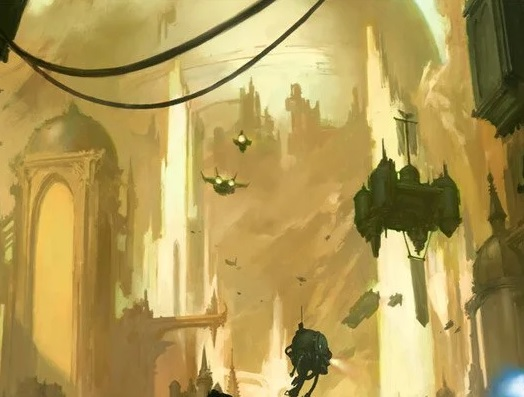

# 0989 星炬 Astronomican

精校状态：中文行文已逐段精校，部分术语仍为暂定

分类：地理 / 小行星

原文来源：https://www.bilibili.com/opus/1052614205571596297

原作者：帝国神选罐头

原文时间：2025年04月06日 14:00

[返回分类目录](目录.md) · [全书目录](../../目录.md)

<!-- A0989-B0001 -->
**英文原文**

The Astronomican is a psychic beacon located on Terra, which Navigators use to pilot Imperial spaceships through the otherwise unnavigable chaos of Warpspace. As the beam generated is psychic it exists within the psychic universe of the Warp. It is the duty of the Adeptus Astronomica to maintain all aspects of the Astronomican, including training those who will power it.

<!-- /A0989-B0001 -->

<!-- A0989-B0002 -->

原译文

星炬是位于泰拉上的一个灵能灯塔，导航者们用它来引导帝国宇宙飞船穿越亚空间中原本无法航行的混乱。由于产生的光束是灵能的，它存在于亚空间的精神宇宙中。星炬庭有责任维护星炬的各个方面，包括培训那些为其提供动力的人。

**校订译文**

星炬是位于泰拉的灵能灯塔。导航员依靠它，引导帝国舰船穿越混乱、原本难以辨明方向的亚空间。它发出的光束属于灵能，因此存在于亚空间这一灵能领域之中。星炬庭负责维护星炬的各项运作，包括训练为其供能的人选。

<!-- /A0989-B0002 -->

<!-- A0989-B0003 图片 -->

<!-- A0989-B0004 -->

原译文

The Astronomican sitting atop the Hollow Mountain 坐落于空洞山脉的星炬

**校订译文**

The Astronomican sitting atop the Hollow Mountain 坐落于空心山脉之上的星炬

<!-- /A0989-B0004 -->

<!-- A0989-B0005 -->
## Overview 概述

<!-- /A0989-B0005 -->

<!-- A0989-B0006 -->
**英文原文**

The Astronomican was originally constructed in M30 in preparation for the Great Crusade. The Emperor brought in large numbers of Tech-Priests and drafted much of Terra's population for the gargantuan task of constructing the Chamber of the Astronomican at the Forbidden Fortress. At the time of its construction, the Astronomican was the single largest structure on Terra, though this would later be surpassed by the Imperial Palace. In the days of the Great Crusade, the Astronomican was powered by the Emperor's own psychic might directly. Without the beacon of the Astronomican to guide their ships through the Warp, Imperial armies would not have been able to enact the Great Crusade.

<!-- /A0989-B0006 -->

<!-- A0989-B0007 -->

原译文

星炬最初是在M30建造的，为大远征做准备。帝皇带来了大量的技术神甫，并征召了泰拉的大部分人口，以完成在禁忌要塞建造星炬的艰巨任务。在建造时，星炬是泰拉上最大的建筑，尽管后来被皇宫超越。在大远征的日子里，星炬直接由帝皇自己的灵能力量提供动力。如果没有星炬的灯塔来引导他们的船只通过亚空间，帝国军队就无法发动大远征。

**校订译文**

星炬始建于M30，是大远征的准备工作之一。帝皇召来大量技术祭司，并征调泰拉的大批人口，在禁忌要塞建造规模浩大的星炬大厅。落成时，它是泰拉最大的单体建筑，后来才被帝国皇宫超越。大远征期间，星炬直接由帝皇自身的灵能力量供能。若无星炬指引舰船穿越亚空间，帝国军队便无法展开大远征。

<!-- /A0989-B0007 -->

<!-- A0989-B0008 -->
**英文原文**

In the climactic Siege of Terra at the end of the Horus Heresy, the Astronomican was initially captured and shut down by traitor forces. However, a contingent of Dark Angels under Corswain managed to recapture the beacon and attempted to reactivate it in order to give Roboute Guilliman's fleet of reinforcements a way to Terra. The Dark Angels proved unsuccessful in reactivating the Astronomican as the Death Guard under Typhus launched a counterattack to retake the Hollow Mountain. The loyalist effort seemed hopeless until Euphrati Keeler led a mass prayer amongst Terran refugees which saw huge swathes of them give their lives in order to restart the beacon and push back the Traitor host.

<!-- /A0989-B0008 -->

<!-- A0989-B0009 -->

原译文

在荷鲁斯异端最后的高潮泰拉围城中，星炬最初被叛徒部队占据并关闭。然而，考斯韦恩率领的一支黑暗天使小队设法夺回了灯塔，并试图重新激活它，以便为罗伯特·基里曼的增援舰队提供一条通往泰拉的道路。事实证明，黑暗天使在重新激活星炬方面并不成功，因为泰丰斯手下的死亡守卫发动了反击，夺回了空心山脉。忠诚派的努力似乎毫无希望，直到幼发拉底·琪乐领导泰拉避难者进行了一场大规模祷告，他们中的大部分人为了重新启动灯塔并击退叛徒而献出了生命。

**校订译文**

荷鲁斯之乱末期的泰拉围城战中，叛军一度夺取并关闭星炬。考斯韦恩率领的一支黑暗天使部队随后夺回灯塔，并试图重新点亮它，为罗保特·基里曼的增援舰队指明前往泰拉的航路。但泰弗斯率领死亡守卫反攻空心山脉，阻挠了重启。忠诚派的努力看似已无望，直到尤弗拉蒂·琪乐带领泰拉难民展开大规模祈祷。大批难民为此献出生命，终于重新点亮星炬，并击退叛军。

<!-- /A0989-B0009 -->

<!-- A0989-B0010 -->
**英文原文**

After the Heresy, the Emperor became interred within the Golden Throne and required increasing numbers of Psyker sacrifices to maintain the Astronomican. Today, the Astronomican is powered by ten thousand psykers trained by the Adeptus Astronomica. The omnipotent will of the Emperor constantly directs this energy across around fifty thousand light years of the Galaxy. Although the Emperor does not provide the energy of the beacon, only He has the psychic power to handle such immense energy and direct it across the Galaxy. The psykers who power the Astronomican are recruited into the organisation through the Adeptus Astra Telepathica. They are initiated into the Adeptus Astronomica as Acolytes, and taught how to use their powers, philosophy, the meaning of their lives, and the Lore of the Astronomican. Some achieve a mystic state, gaining the status of Chosen. It is these Chosen who are eventually called to serve in the Chamber of the Astronomican. Here they fuel the Astronomican beacon with their psychic energies; as their powers are drained the Chosen slowly fade and die. Up to one hundred Psykers die each day powering the Astronomican.

<!-- /A0989-B0010 -->

<!-- A0989-B0011 -->

原译文

叛乱之后，帝皇被安置在黄金王座内，并要求越来越多的灵能者献祭来维持星炬。今天，星炬由星炬庭训练的一万名灵能者提供动力。帝皇的全能意志不断地将这种能量引导到银河系大约五万光年的范围内。虽然帝皇没有提供灯塔的能量，但只有他有灵能力量来处理如此巨大的能量并将其引导到整个银河系。为星炬提供动力的灵能者通过星语庭招募到该组织中。他们作为侍从被引入星炬庭，并被教导如何使用他们的力量、哲学、生命的意义和星炬的知识。有些人达到了神秘的状态，获得了受选者的地位。正是这些被选中的人最终被召唤到星炬庭任职。在这里，他们用他们的灵能能量为星炬灯塔供能；随着他们的力量被耗尽，受选者慢慢衰弱并死亡。每天有多达一百名灵能者为星炬提供动力。

**校订译文**

荷鲁斯之乱后，帝皇被安置在黄金王座中，维持星炬也需要越来越多的灵能者牺牲。如今，1万名受星炬庭训练的灵能者为灯塔供能，帝皇的至高意志则不断将能量引导至银河中约5万光年的范围。帝皇本人虽不再提供灯塔的能量，却仍是唯一有能力驾驭如此庞大灵能、将其投向银河的人。这些供能者由星语庭招募，进入星炬庭成为侍从，学习如何运用力量、哲学、生命的意义及星炬秘识。其中一部分人会达到某种神秘境界，成为“受选者”，最终被召往星炬大厅。他们在那里以自身灵能点燃灯塔，随着力量被抽干，逐渐衰弱而死。每天最多有100名灵能者因供能而死亡。

**校注：** 原译末句漏译die；每天最多100人是死亡人数，不是全部供能人数。Chamber为大厅，区别组织星炬庭。

<!-- /A0989-B0011 -->

<!-- A0989-B0012 -->
**英文原文**

However, the psychic power they generate through their sacrifice is directed by the mind of the Emperor across about fifty thousand light years of the Galaxy. Because Terra is situated in the galactic west, the Astronomican does not cover the extreme eastern part of the Galaxy. Warp travel beyond the Astronomican's reach is severely limited - this creates the effective borders of the Imperium. Because of this, destroying the Astronomican would most likely halt all Imperial Warp travel within the Galaxy, effectively bringing the Imperium to its knees.

<!-- /A0989-B0012 -->

<!-- A0989-B0013 -->

原译文

然而，他们通过牺牲产生的灵能力量是由帝皇的精神引导的，横跨银河系约五万光年。由于泰拉位于银河系的西部，星炬没有覆盖银河系的最东部。超出星炬范围的亚空间航行受到严重限制—这创造了帝国的有效边界。因此，摧毁星炬很可能会停止银河系内的所有帝国亚空间航行，有效地使帝国屈服。

**校订译文**

这些人牺牲所释放的灵能，由帝皇的心智引导，覆盖银河中约5万光年的范围。由于泰拉位于银河西部，星炬无法照及最东端。在其覆盖范围之外，亚空间航行受到极大限制，因而形成了帝国疆域的实际边界。若星炬被摧毁，帝国在银河内的亚空间航行很可能几乎全部停顿，使帝国陷入瘫痪。

<!-- /A0989-B0013 -->

<!-- A0989-B0014 -->
**英文原文**

Navigators, as well as other psykers, can sense the Astronomican. It is described as a sensation of silvery light and a chorus of many heavenly voices, beginning first with a solitary voice and progressively growing into an angelic choir. It is suggested that "pious marines" who can hear the Astronomican can fall into a meditative trance when they focus on it. Space Marine Captain Gabriel Angelos occasionally entered a sort of battle trance when he heard the Astronomican while fighting, improving his prowess in combat for the duration.

<!-- /A0989-B0014 -->

<!-- A0989-B0015 -->

原译文

导航者和其他灵能者都能感觉到星炬。它被描述为一种银色的光的感觉和许多天堂般的声音的合唱，最初是一个孤独的声音，逐渐成长为一个天使般的合唱团。有人认为，当“虔诚的战士”听到星炬的声音时，他们可以进入冥想心流状态。星际战士连长加百列·安杰罗在战斗中听到星炬之声后，偶尔会进入一种战斗心流状态，在这段时间内提高了他的战斗能力。

**校订译文**

导航员及其他灵能者都能感知星炬。有人将其描述为银色光芒与天籁般的合唱：起初只有一道孤独的声音，随后逐渐汇成天使般的歌队。也有说法称，能听见星炬的“虔诚星际战士”在专注聆听时会进入冥想般的出神状态。星际战士连长加百列·安杰罗斯就偶尔在战斗中听见星炬之声，并进入一种战斗出神状态，暂时提升作战能力。

<!-- /A0989-B0015 -->

<!-- A0989-B0016 -->
**英文原文**

The Astronomican, unbeknownst to the Imperium, is what is drawing the Tyranid Hive Fleets to threaten the Galaxy and all of the Imperium.

<!-- /A0989-B0016 -->

<!-- A0989-B0017 -->

原译文

帝国不知道的是星炬正是吸引泰伦虫巢舰队威胁银河系和整个帝国的原因。

**校订译文**

帝国不知道的是星炬正是吸引泰伦虫巢舰队威胁银河系和整个帝国的原因。

<!-- /A0989-B0017 -->

<!-- A0989-B0018 -->
**英文原文**

Right after the 13th Black Crusade and the appearance of the Great Rift, the Astronomican went out, causing unrest and horror throughout the Imperium. This period, later called the Days of Blindness, varied wildly. On some worlds there were mere days of blindness; on others, months. It is presumed that some Imperial planets are still deprived of the Emperor's Light. On Terra the blindness lasted thirty-three days.

<!-- /A0989-B0018 -->

<!-- A0989-B0019 -->

原译文

在第13次黑色远征和大裂隙出现后，星炬熄灭了，在整个帝国引起了动荡和恐慌。这一时期，后来被称为盲目之日，变化很大。在某些世界里，只有盲目之日；其他的大概几个月。据推测，一些帝国行星仍然被剥夺了帝皇之光。在泰拉上，盲目持续了三十三天。

**校订译文**

第十三次黑色远征结束、大裂隙出现后，星炬随即熄灭，在帝国各地引发动荡与恐惧。这个后来被称为“失明之日”的时期，在各地持续时间差异极大：有些世界仅数日，有些长达数月，据信还有一些帝国行星至今未重见帝皇之光。泰拉的失明期持续了33天。

**校注：** mere days意为仅数日，原译漏时长。

<!-- /A0989-B0019 -->

本篇核心术语与暂定项

以下列出本篇出现的英文原形及核心术语表用词。同形词可能指不同对象，具体词义以本篇正文和校注为准；单复数、别名和仅见于图注的名称可能尚未列入。完整候选见[术语表](../../术语表/双语术语候选.csv)。

| 英文 | 采用中文 | 状态 |
| --- | --- | --- |
| Dark Angels | 黑暗天使 | 官方已核对 |
| Death Guard | 死亡守卫 | 官方已核对 |
| Psyker | 灵能者 | 官方已核对 |
| Roboute Guilliman | 罗保特·基里曼 | 官方已核对 |
| Horus Heresy | 荷鲁斯之乱 | 官方已核对 |
| Astronomican | 星炬 | 暂定 |
| Adeptus Astronomica | 星炬庭 | 暂定 |
| Adeptus Astra Telepathica | 星语庭 | 暂定 |
| Warp | 亚空间 | 官方已核对 |
| Great Rift | 大裂隙 | 官方已核对 |
| Imperium | 帝国 | 暂定·简称 |
| Emperor | 帝皇 | 官方已核对 |
| Great Crusade | 大远征 | 暂定·官方待核 |
| Terra | 泰拉 | 暂定·官方待核 |
| Horus | 荷鲁斯 | 暂定·官方待核 |
| Navigators | 导航员 | 官方已核对 |
| Golden Throne | 黄金王座 | 暂定·官方待核 |
| Tech | 技术语 | 暂定·官方待核 |
| Euphrati Keeler | 尤弗拉蒂·琪乐 | 暂定 |
| Mystic | 神秘者 | 暂定·官方待核 |
| Corswain | 考斯韦恩 | 暂定·官方待核 |
| Space Marine | 星际战士 | 暂定·官方待核 |
| Captain | 连长 | 暂定·官方待核 |
| Gabriel Angelos | 加百列·安杰罗斯 | 暂定·官方待核 |
| Powers | 能天使 | 暂定·官方待核 |
| Host | 天军 | 暂定·官方待核 |
| Typhus | 泰弗斯 | 官方已核对 |
| Hollow Mountain | 空心山脉 | 暂定·官方待核 |
| The Dark | 《黑暗》 | 暂定·官方待核 |
| Chamber of the Astronomican | 星炬大厅 | 暂定·官方待核 |
| Days of Blindness | 失明之日 | 暂定·官方待核 |

