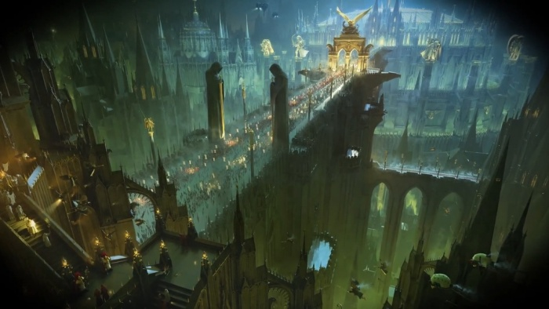
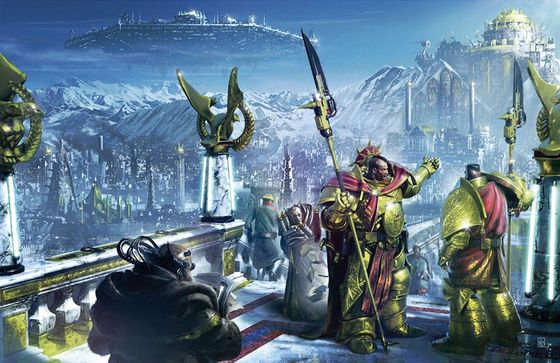
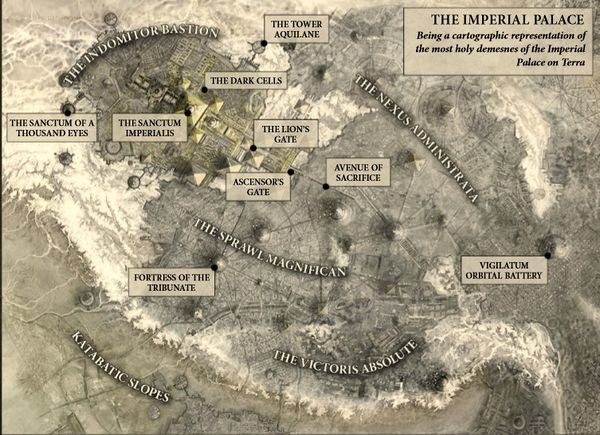
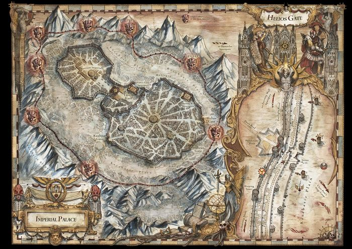
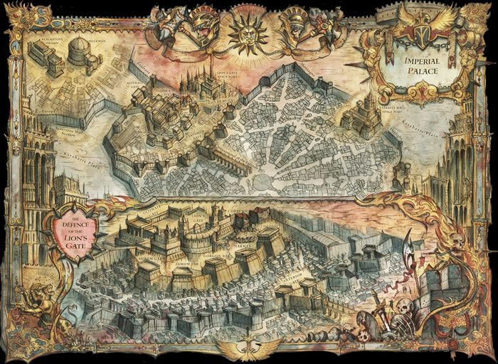
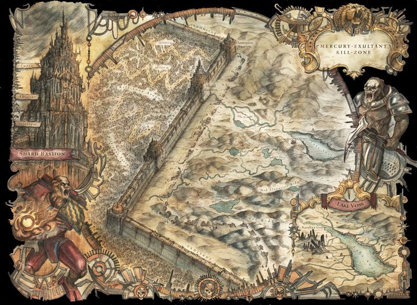
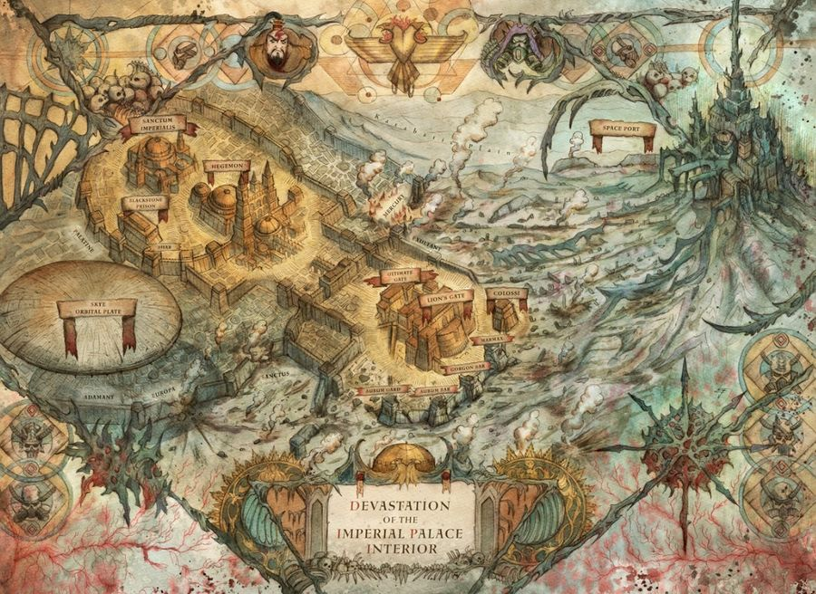
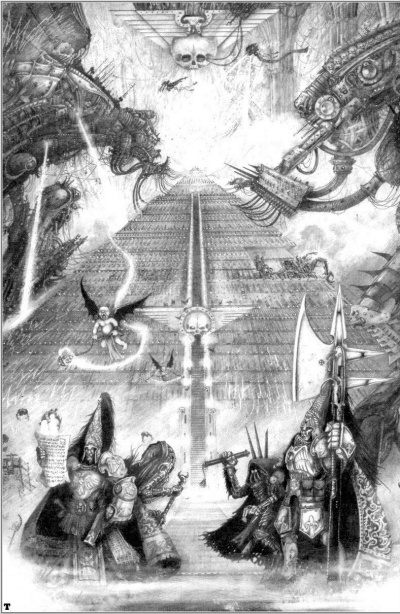
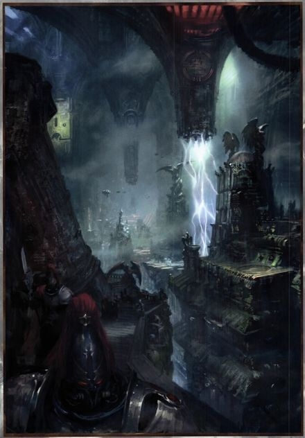

# 0991 帝国皇宫 Imperial Palace

精校状态：中文行文已逐段精校，部分术语仍为暂定

分类：地理 / 小行星

原文来源：https://www.bilibili.com/opus/1057805347890135045

原作者：帝国神选罐头

原文时间：2025年04月20日 13:45

[返回分类目录](目录.md) · [全书目录](../../目录.md)

<!-- A0991-B0001 -->
**英文原文**

The Imperial Palace is a vast edifice that serves as both the palace of the Emperor of Mankind and the capital city of the Imperium of Man. Built across a large part of the Asian continent on Terra, the Palace is divided into the Inner and Outer Palaces. The Palace is built to truly monumental proportions: seen from orbit, it consists of connected kilometres-high monolithic and pyramidal structures, marked with landing pads and studded with defense weaponry. The palace itself is the seat of the Adeptus Terra, but is overseen by the Adeptus Custodes.

<!-- /A0991-B0001 -->

<!-- A0991-B0002 -->

原译文

帝国皇宫是一座巨大的建筑，既是人类帝皇的宫殿，也是人类帝国的首都。建筑横跨亚洲大陆的大部分地区，分为内殿和外殿。这座宫殿是按照真正具有纪念意义的比例建造的：从轨道上看，它由连接数公里高的整体和金字塔结构组成，标有着陆台，并镶嵌着防御武器。宫殿本身是中央政务部的所在地，但由禁军监管。

**校订译文**

帝国皇宫是一座规模浩大的建筑群，既是人类帝皇的宫殿，也是人类帝国的都城。它横跨泰拉亚洲大陆的大部分地区，分为内殿与外殿。从轨道上俯瞰，一座座高达数公里的巨型整块建筑和金字塔状结构彼此相连，其间布满起降平台与防御武器。皇宫是中央政务部的所在地，由帝皇禁军监管。

<!-- /A0991-B0002 -->

<!-- A0991-B0003 图片 -->

<!-- A0991-B0004 -->

原译文

Imperial Palace complex 帝国皇宫建筑群

**校订译文**

Imperial Palace complex 帝国皇宫建筑群

<!-- /A0991-B0004 -->

<!-- A0991-B0005 -->
**英文原文**

Not only is the area of the Imperial Palace enormous, its macro-habs and space ports break through the atmosphere and rise into the void, and its sub-levels dig deep into Terra's holy bedrock, in some places reaching a depth of hundreds of miles below the surface. Its vaults, corridors, fastnesses, plazas, and chambers are so multitudinous that no single record remains to list them all, and the techno-urbanic serf tribes, clan holdings, and societal sub-nations that dwell within its walls could populate entire star systems.

<!-- /A0991-B0005 -->

<!-- A0991-B0006 -->

原译文

故宫不仅面积巨大，其宏观港口和太空港也突破了大气层，上升到虚空中，其子层深入泰拉神圣的基岩层，在某些地方达到了地表以下数百英里的深度。它的拱顶、走廊、堡垒、广场和房间如此之多，以至于没有一个记录可以一一列出，而居住在它墙内的技术城市化奴隶部落、宗族财产和社会亚族可以填充整个星系。

**校订译文**

帝国皇宫不仅占地辽阔，巨型居住区和太空港更穿透大气、直抵虚空；地下层则深入泰拉神圣的基岩，有些地方延伸到地表下数百英里。秘库、走廊、堡垒、广场与厅室多得无法由任何一份现存记录悉数列出。城墙内的技术都市农奴部族、宗族领地和众多次级社会共同体，其人口之众，足以填满整个恒星系。

**校注：** macro-habs为巨型居住区，原译宏观港口错误；人口规模为原文夸张设定，未改。

<!-- /A0991-B0006 -->

<!-- A0991-B0007 -->
## History 历史

<!-- /A0991-B0007 -->

<!-- A0991-B0008 -->
**英文原文**

Construction of the Imperial Palace began after the Unification Wars as a symbol of the Emperor's might and a monument dedicated to mankind's new unification. Based around the Himalayan Mountains, the Palace was designed by the most expert artisans of the many Masonic Guilds of Terra. The early management of the Palace was left to the Seneschals of the Departmento Regia Interior. Construction of the Palace defenses was overseen by Primarch Rogal Dorn, much to the frustration of Perturabo. Some construction of the Palace was still taking place by the end of the Great Crusade, meaning construction took at least 200 years.

<!-- /A0991-B0008 -->

<!-- A0991-B0009 -->

原译文

统一战争后，皇宫开始建造，作为帝皇力量的象征和人类新统一的纪念碑。这座宫殿位于喜马拉雅山脉周围，由许多泰拉石匠工会最专业的工匠设计。宫殿的早期管理权留给了内政部总管。宫殿防御工事的建造由原体罗格·多恩监督，这让佩图拉博非常沮丧。大远征结束时，宫殿的一些建设仍在进行，这意味着建设至少需要200年。

**校订译文**

统一战争结束后，帝国皇宫开始兴建，既象征帝皇的力量，也纪念人类重新统一。它以喜马拉雅山脉为中心，由泰拉诸石匠行会中最出色的工匠设计，早期管理交由内廷事务署的总管负责。原体罗格·多恩监督防御工事建设，这令佩图拉博深感不满。直到大远征末期，部分工程仍在继续，可见建设至少持续了200年。

**校注：** Departmento Regia Interior暂译内廷事务署，区别Administratum内政部。

<!-- /A0991-B0009 -->

<!-- A0991-B0010 图片 -->

<!-- A0991-B0011 -->

原译文

An area of the Imperial Palace Complex during the Horus Heresy 荷鲁斯叛乱时期的帝国皇宫建筑群

**校订译文**

An area of the Imperial Palace Complex during the Horus Heresy 荷鲁斯之乱时期的帝国皇宫建筑群

<!-- /A0991-B0011 -->

<!-- A0991-B0012 -->
**英文原文**

The Imperial Palace has only come under major attack twice, being the site of most of the fighting during the Siege of Terra at the climax of the Horus Heresy. During the Heresy, Rogal Dorn was forced to dramatically increase the Palace defenses, causing much of its splendor to be dismantled in favor of cold military necessities. As of the 41st Millennium, the Imperial Palace still bears the scars of that titanic battle.\[4\] After the Heresy, the Imperial Palace also saw an Eldar raid and damage from falling debris during the War of the Beast. Ten thousand years after the Heresy, Terra faced its second major assault following the Thirteenth Black Crusade. Thanks to the formation of the Great Rift the Palace was assailed by the vast legions of Khorne, which were turned back by the newly reborn Roboute Guilliman before they could reach the Eternity Gate.

<!-- /A0991-B0012 -->

<!-- A0991-B0013 -->

原译文

皇宫只遭受过两次重大袭击，是荷鲁斯叛乱高潮时期泰拉围城期间大部分战斗的地点。在叛乱时期，罗格·多恩被迫大幅增加宫殿的防御，导致宫殿的大部分辉煌被拆除，取而代之的是冰冷的军事必需品。截至第41个千年，皇宫仍然留有那场大战的痕迹。叛乱之后，在野兽战争期间，皇宫还发生了一次灵族突袭和碎片坠落造成的破坏。叛乱一万年后，泰拉面临着第十三次黑色远征的第二次重大进攻。由于大裂隙的形成，皇宫遭到了恐虐庞大军团的袭击，这些军团在到达永恒之门之前被恢复的罗伯特·基里曼击退。

**校订译文**

帝国皇宫只遭遇过两次大规模进攻。第一次是荷鲁斯之乱达到顶峰时的泰拉围城战，绝大多数战斗都围绕皇宫展开。为此，罗格·多恩大幅加强防御，拆除了许多华美设施，服从冷酷的军事需要。到第41个千年，皇宫仍留着这场巨战的伤痕。荷鲁斯之乱后，它也曾在野兽战争期间遭遇灵族突袭，并被坠落残骸损伤。一万年后，第十三次黑色远征结束，泰拉遭遇第二次大规模进攻。大裂隙形成后，恐虐大军袭向皇宫，但尚未抵达永恒之门，就被刚刚重返世间的罗保特·基里曼击退。

<!-- /A0991-B0013 -->

<!-- A0991-B0014 -->
## Design 设计

<!-- /A0991-B0014 -->

<!-- A0991-B0015 -->
### Outer Defenses 外部防御

<!-- /A0991-B0015 -->

<!-- A0991-B0016 -->
**英文原文**

Due to ancient laws prohibiting construction too close to the walls, the area around the Outer Palace walls are empty, which is an extreme rarity on Terra. Those that live close to the walls exist in both splendor and squalor.

<!-- /A0991-B0016 -->

<!-- A0991-B0017 -->

原译文

由于古代法律禁止在离城墙太近的地方施工，外殿城墙周围的区域是空的，这在泰拉上是极其罕见的。那些住在城墙附近的人既辉煌又肮脏。

**校订译文**

古老法律禁止在过于靠近城墙的地方建造房屋，因此外殿城墙周边留有空地，这在泰拉极为罕见。而靠近城墙的居民区中，奢华与贫困并存。

<!-- /A0991-B0017 -->

<!-- A0991-B0018 图片 -->

<!-- A0991-B0019 -->

原译文

An aerial view of the modern Imperial Palace 现代帝国皇宫鸟瞰图

**校订译文**

An aerial view of the modern Imperial Palace 现代帝国皇宫鸟瞰图

<!-- /A0991-B0019 -->

<!-- A0991-B0020 -->
**英文原文**

The walls surrounding the Outer Palace are of gargantuan proportions. The walls are 30 meters wide and taller than the greatest structures of the rest of Terra, in some areas being 1,100 meters in height. Defense towers consisting of massive gun-citadels run every hundred meters along the walls lengths. Inside the walls are endless amounts of power generators, ammunition trains, aircraft hangars, barracks, and void shield generators. Stretching for thousands of kilometers and with relatively few Custodes, much of this area are defended by regular Imperial Guard Regiments such as the Lucifer Blacks and Palatine Sentinels. Hundreds of thousands of men live and die within the walls of Terra, which in truth is more of a contiguous fortress than a simple barrier.

<!-- /A0991-B0020 -->

<!-- A0991-B0021 -->

原译文

外殿周围的墙壁比例巨大。这些墙宽30米，比泰拉其他地区最大的建筑还要高，在某些地区高1100米。由巨大的炮台组成的防御塔沿着城墙每百米一座。墙内有无数的发电机、弹药列车、飞机库、营房和虚空盾发生器。该地区绵延数千公里，禁军相对较少，大部分地区由路西法黑卫和帕拉廷哨兵等正规帝国卫队部队防守。数十万人在泰拉的城墙内生活和死亡，事实上，泰拉城墙与其说是一道简单的屏障，不如说是一座座相连的堡垒。

**校订译文**

外殿城墙规模惊人：厚达30米，高度超过泰拉其余地区最宏伟的建筑，部分墙段高达1,100米。沿线每隔百米就耸立一座巨型炮垒防御塔，墙体内部容纳无数发电机、弹药列车、机库、兵营和虚空盾发生器。整道防线绵延数千公里，而帝皇禁军人数有限，因此大部分地段由路西法黑卫、帕拉廷哨兵等正规帝国卫队部队驻守。数十万人终生生活在这些墙体之内；它们实际上是一整座连绵不断的堡垒。

<!-- /A0991-B0021 -->

<!-- A0991-B0022 -->
**英文原文**

In addition to its network of walls and gun batteries, the Imperial Palace is protected by a Void Shield array known as The Aegis. Designed by the Adeptus Mechanicus and perhaps the most sophisticated of its kind within the Imperium, the Aegis is a multi-layered self-repairing void web that encompasses the whole of the Palace and even slightly beyond. In its strongest areas the Aegis is capable of stopping the penetration of any object above a half-gram traveling faster than two meters per second. While The Aegis is invincible against orbital bombardment in theory, at its weakest outer reaches slow-moving aircraft can penetrate the shield and attack its open generators.

<!-- /A0991-B0022 -->

<!-- A0991-B0023 -->

原译文

除了墙壁和炮台网络外，皇宫还受到被称为宙斯盾的虚空盾阵列的保护。宙斯盾由机械神教设计，可能是帝国内同类产品中最复杂的，它是一个多层的自我修复的虚空盾网络，涵盖了整个皇宫，甚至稍微超出了皇宫。在其最强的区域，宙斯盾能够阻止任何超过半克、速度超过每秒两米的物体穿透。虽然理论上宙斯盾在轨道轰炸中是无敌的，但在其最薄弱的外部，缓慢移动的飞机可以穿透虚空盾并攻击其开放的发电机。

**校订译文**

除城墙与炮台网络外，皇宫还受名为“神盾”的虚空盾阵列保护。这套由机械修会设计的系统，可能是帝国同类设备中最精密的：多层、可自我修复的虚空力场网覆盖整个皇宫，并向外延伸少许。在防护最强的区域，任何质量超过半克、速度超过每秒2米的物体都会被阻挡。理论上，神盾能抵御一切轨道轰炸；但在最薄弱的外缘，低速飞机仍可穿越力场，攻击暴露的发生器。

<!-- /A0991-B0023 -->

<!-- A0991-B0024 -->
### Notable Palace Perimeter Areas 著名的皇宫周边地区

<!-- /A0991-B0024 -->

<!-- A0991-B0025 -->
**英文原文**

Helios Gate: Major gateway into the Palace overlooking the Katabatic Plain.

<!-- /A0991-B0025 -->

<!-- A0991-B0026 -->

原译文

日神之门：通往皇宫的主要入口，俯瞰卡塔巴蒂平原。

**校订译文**

日神之门：通往皇宫的主要入口，俯瞰卡塔巴蒂平原。

<!-- /A0991-B0026 -->

<!-- A0991-B0027 -->
**英文原文**

Indicus Gate: Major Gateway into the Palace, facing the Katabatic Plain.

<!-- /A0991-B0027 -->

<!-- A0991-B0028 -->

原译文

印第之门：通往皇宫的主要门户，面向卡塔巴蒂平原。

**校订译文**

印第之门：通往皇宫的主要门户，面向卡塔巴蒂平原。

<!-- /A0991-B0028 -->

<!-- A0991-B0029 -->
**英文原文**

Annapurna Gate: Major Gateway known for its craftsmanship. Removed by Rogal Dorn in the early stages of the Horus Heresy in preparation for the Siege of Terra.

<!-- /A0991-B0029 -->

<!-- A0991-B0030 -->

原译文

安纳普纳门：以精工闻名的主要门户。在荷鲁斯叛乱的早期阶段，罗格·多恩为准备泰拉围城而将其移除。

**校订译文**

安纳普纳门——以精湛工艺闻名的主要宫门。荷鲁斯之乱初期，罗格·多恩为准备泰拉防御战而将其拆除。

<!-- /A0991-B0030 -->

<!-- A0991-B0031 -->
**英文原文**

Kushito Gate: Gate in the southern region.

<!-- /A0991-B0031 -->

<!-- A0991-B0032 -->

原译文

库希托门：南部地区的门。

**校订译文**

库希托门：南部地区的门。

<!-- /A0991-B0032 -->

<!-- A0991-B0033 -->
**英文原文**

Eternity Wall: The main Wall line surrounding the Outer Palace.

<!-- /A0991-B0033 -->

<!-- A0991-B0034 -->

原译文

永恒之墙：环绕外殿的主墙。

**校订译文**

永恒之墙：环绕外殿的主墙。

<!-- /A0991-B0034 -->

<!-- A0991-B0035 -->

原译文

Daylight Wall Section 日光墙段

**校订译文**

Daylight Wall Section 日光墙段

<!-- /A0991-B0035 -->

<!-- A0991-B0036 -->

原译文

Celantine Wall Section 天空墙段

**校订译文**

Celantine Wall Section 塞兰廷墙段

**校注：** Celantine为专名，未见天空一译依据，暂音译塞兰廷。

<!-- /A0991-B0036 -->

<!-- A0991-B0037 -->

原译文

Katabatic Wall Section 重力墙段

**校订译文**

Katabatic Wall Section 卡塔巴蒂墙段

**校注：** Katabatic沿同篇平原名称卡塔巴蒂统一，不作重力的词义猜译。

<!-- /A0991-B0037 -->

<!-- A0991-B0038 -->

原译文

Mercury Wall Section 水星墙段

**校订译文**

Mercury Wall Section 水星墙段

<!-- /A0991-B0038 -->

<!-- A0991-B0039 -->

原译文

Montagne Wall Section 山脉墙段

**校订译文**

Montagne Wall Section 山脉墙段

<!-- /A0991-B0039 -->

<!-- A0991-B0040 -->

原译文

Tropic Wall Section 热带墙段

**校订译文**

Tropic Wall Section 热带墙段

<!-- /A0991-B0040 -->

<!-- A0991-B0041 -->

原译文

Dusk Wall Section 黄昏墙段

**校订译文**

Dusk Wall Section 黄昏墙段

<!-- /A0991-B0041 -->

<!-- A0991-B0042 -->

原译文

Twilight Wall Section 暮光墙段

**校订译文**

Twilight Wall Section 暮光墙段

<!-- /A0991-B0042 -->

<!-- A0991-B0043 -->
### Outer Palace 外殿

<!-- /A0991-B0043 -->

<!-- A0991-B0044 -->
**英文原文**

The Imperial Palace is as heavily urbanized and populated as any hive city. Adepts numbering in the billions work and reside within the Palace. The Outer Palace is also heavily urbanized by a population of destitute non-adepts. The Adeptus Custodes maintain a constant vigil over the Imperial Palace, and are among the few permitted to pass beyond the Eternity Gate into the Emperor's presence. The Adeptus Arbites are responsible for maintaining order and vigilance within the Outer Palace, especially outside official buildings which are often thronged with the queue lines of those seeking employment within the Administratum. Shock troops quickly put down the vicious queue riots that occasionally erupt.

<!-- /A0991-B0044 -->

<!-- A0991-B0045 -->

原译文

帝国皇宫的城市化程度和人口密度与任何巢都城市一样高。数十亿人在皇宫内工作和居住。外殿也被一群贫困的民众严重城市化。禁军们对皇宫保持着持续的守卫，是少数获准越过永恒之门进入帝皇面前的人之一。法务部负责维持外殿的秩序和警惕，特别是在官方建筑外，那里经常挤满了在行政机构内求职的人。突击队会迅速平息偶尔爆发的恶性排队骚乱。

**校订译文**

皇宫的城市化程度和人口密度不亚于任何巢都，数十亿官吏在此工作和居住。外殿还挤满了不属于官僚体系的贫民。帝皇禁军始终警戒，且是少数获准穿过永恒之门、来到帝皇面前的人。法务部负责维持外殿治安，尤其是各处官方建筑外围；那里常年挤满排队申请内政部工作的人。一旦队伍爆发严重骚乱，镇暴部队便会迅速将其压下。

<!-- /A0991-B0045 -->

<!-- A0991-B0046 图片 -->

<!-- A0991-B0047 -->

原译文

The Imperial Palace as it appeared during the Horus Heresy 荷鲁斯叛乱时期的帝国皇宫

**校订译文**

The Imperial Palace as it appeared during the Horus Heresy 荷鲁斯之乱时期的帝国皇宫

<!-- /A0991-B0047 -->

<!-- A0991-B0048 -->
**英文原文**

The Palace is the heart of the Administratum. Countless souls labour in the immeasurable archives and headquarters of the Imperium, ordering and maintaining an empire that spans the galaxy. Without them, the Imperium would lose all access to its history and databanks. Also, it is the seat of the High Lords of Terra, who are charged with interpreting the Emperor's will. These twelve Lords are accounted the most powerful of all living men. They guide the overall strategy of the inexhaustible armies of the Imperium, and uphold the Emperor's might across a million worlds.

<!-- /A0991-B0048 -->

<!-- A0991-B0049 -->

原译文

皇宫是行政机构的核心。无数的灵魂在帝国无法估量的档案和总部里劳动，命令和维护一个横跨银河系的帝国。没有他们，帝国将失去对其历史和数据库的所有访问。此外，它也是泰拉的高领主的所在地，他们负责解释帝皇的遗言。这十二位领主被认为是所有在世的人中最强大的。他们指导帝国取之不尽的军队的总体战略，并在百万个世界中维护帝皇的力量。

**校订译文**

皇宫是内政部的核心。无数人在浩瀚的档案馆与帝国总部中辛劳，管理并维持这个横跨银河的帝国。没有他们，帝国就会失去对历史与数据库的掌握。皇宫也是泰拉高领主的所在地，他们负责诠释帝皇的意志。这12位领主被视为当世最有权势的人，统筹帝国无穷军势的总体战略，并在百万世界上维护帝皇的威权。

**校注：** will在此为意志，不是遗言。

<!-- /A0991-B0049 -->

<!-- A0991-B0050 -->
### Notable Areas of the Outer Palace 外殿的著名区域

<!-- /A0991-B0050 -->

<!-- A0991-B0051 -->
**英文原文**

Grand Processional of the Eternals - 300 meter-wide causeway within site of the Lion's Gate. Used for military Parades.

<!-- /A0991-B0051 -->

<!-- A0991-B0052 -->

原译文

永恒大道-狮子门内300米宽的堤道。用于军事游行。

**校订译文**

永恒大道——位于狮门视野范围内、宽300米的高架大道，用于军事阅兵。

**校注：** 原文within site疑为within sight；按可望见狮门理解，不据此断定大道在门内。

<!-- /A0991-B0052 -->

<!-- A0991-B0053 -->
**英文原文**

Anterior Gate: Gate which separates the Anterior region of the Outer Palace with the Lion's Gate and Lion's Gate Spaceport.

<!-- /A0991-B0053 -->

<!-- A0991-B0054 -->

原译文

前门：将外殿前部区域与狮门和狮门太空港隔开的门。

**校订译文**

前门：将外殿前部区域与狮门和狮门太空港隔开的门。

<!-- /A0991-B0054 -->

<!-- A0991-B0055 -->
**英文原文**

Lion's Gate Spaceport: Attached to the Lion's Gate.

<!-- /A0991-B0055 -->

<!-- A0991-B0056 -->

原译文

狮门太空港：附于狮门。

**校订译文**

狮门太空港：附于狮门。

<!-- /A0991-B0056 -->

<!-- A0991-B0057 -->
**英文原文**

Lion's Gate: Major Gateway into the Inner Palace Complex, overlooking the Indian Subcontinent. The Lion's Gate also leads to the Lion's Gate Spaceport. The Gate originally had two enormous lion statues overlooking it, but these were removed by Rogal Dorn to make way for defenses in preparation for the Siege of Terra.

<!-- /A0991-B0057 -->

<!-- A0991-B0058 -->

原译文

狮门：通往内殿建筑群的主要门户，俯瞰印第次大陆。狮门也通往狮门太空港。大门最初有两座巨大的狮子雕像俯瞰着它，但这些雕像被罗格·多恩移走，为防御泰拉围城让路。

**校订译文**

狮门——通往内殿建筑群的主要宫门，俯瞰印度次大陆，并与狮门太空港相连。门前原有两尊巨狮雕像；为准备泰拉防御战，罗格·多恩将其移走，腾出位置修筑工事。

<!-- /A0991-B0058 -->

<!-- A0991-B0059 图片 -->

<!-- A0991-B0060 -->

原译文

The Lion's Gate region of the palace during the Horus Heresy 荷鲁斯叛乱时期皇宫的狮门区域

**校订译文**

The Lion's Gate region of the palace during the Horus Heresy 荷鲁斯之乱时期皇宫的狮门区域

<!-- /A0991-B0060 -->

<!-- A0991-B0061 -->
**英文原文**

Gorgon Bar - Known originally as Gorgon Gate, during the fortification of the Terra before the Siege by Horus it was heavily reinforced and designated "Bar", indicating its status as a converted civilian structure. It is one of several fortresses which guards the approach to the Lion's Gate.

<!-- /A0991-B0061 -->

<!-- A0991-B0062 -->

原译文

戈尔贡壁垒 - 最初被称为戈尔贡门，在荷鲁斯围攻之前的泰拉防御期间，它被大量加固并指定为“壁垒”，表明其作为改建民用建筑的地位。它是守卫狮门入口的几座堡垒之一。

**校订译文**

戈尔贡壁垒——原称戈尔贡门。荷鲁斯围城前，泰拉加强防御时，这座宫门被大幅加固，并改称“壁垒”，表明它由民用建筑改造而成。它是护卫狮门进路的数座堡垒之一。

<!-- /A0991-B0062 -->

<!-- A0991-B0063 -->
**英文原文**

Colossi Gate - Gate guarding the northern approach to the Lion's Gate from the Lion's Gate Spaceport.. It is one of several fortresses which guards the approach to the Lion's Gate.

<!-- /A0991-B0063 -->

<!-- A0991-B0064 -->

原译文

巨像之门-从狮门太空港守卫狮门北侧入口的大门。它是守卫狮门入口的几座堡垒之一。

**校订译文**

巨像之门——守卫从狮门太空港通往狮门北侧进路的大门，也是护卫狮门的数座堡垒之一。

<!-- /A0991-B0064 -->

<!-- A0991-B0065 -->
**英文原文**

Aurum Gard - one of several fortresses which guards the approach to the Lion's Gate.

<!-- /A0991-B0065 -->

<!-- A0991-B0066 -->

原译文

奥伦·加德 — 守卫狮门入口的几座堡垒之一。

**校订译文**

奥伦·加德 — 守卫狮门入口的几座堡垒之一。

<!-- /A0991-B0066 -->

<!-- A0991-B0067 -->
**英文原文**

Marmax - one of several fortresses which guards the approach to the Lion's Gate.

<!-- /A0991-B0067 -->

<!-- A0991-B0068 -->

原译文

马尔马克斯 — 守卫狮门入口的几座堡垒之一。

**校订译文**

马尔马克斯 — 守卫狮门入口的几座堡垒之一。

<!-- /A0991-B0068 -->

<!-- A0991-B0069 -->
**英文原文**

Aurum Bar - one of several fortresses which guards the approach to the Lion's Gate.

<!-- /A0991-B0069 -->

<!-- A0991-B0070 -->

原译文

黄金壁垒 — 守卫狮门入口的几座堡垒之一。

**校订译文**

黄金壁垒 — 守卫狮门入口的几座堡垒之一。

<!-- /A0991-B0070 -->

<!-- A0991-B0071 -->
**英文原文**

The City of Sight — center of the Adeptus Astra Telepathica. Near the Lion's Gate Spaceport.

<!-- /A0991-B0071 -->

<!-- A0991-B0072 -->

原译文

视界之城 — 星语庭中心。狮门太空港附近。

**校订译文**

视界之城 — 星语庭中心。狮门太空港附近。

<!-- /A0991-B0072 -->

<!-- A0991-B0073 -->
**英文原文**

The Obsidian Keep - Headquarters of the Astra Telepathica.

<!-- /A0991-B0073 -->

<!-- A0991-B0074 -->

原译文

黑曜石要塞 - 星语庭的总部。

**校订译文**

黑曜石要塞 - 星语庭的总部。

<!-- /A0991-B0074 -->

<!-- A0991-B0075 -->
**英文原文**

The Conduit - Center of Imperial galactic communication.

<!-- /A0991-B0075 -->

<!-- A0991-B0076 -->

原译文

导管 - 帝国银河通信中心。

**校订译文**

导管 - 帝国银河通信中心。

<!-- /A0991-B0076 -->

<!-- A0991-B0077 -->
**英文原文**

The Petitioner's City - City of the Administratum

<!-- /A0991-B0077 -->

<!-- A0991-B0078 -->

原译文

祈愿者之城 - 内务部所在城市

**校订译文**

祈愿者之城——内政部所属城区。

<!-- /A0991-B0078 -->

<!-- A0991-B0079 -->
**英文原文**

The Petitioner's Hall

<!-- /A0991-B0079 -->

<!-- A0991-B0080 -->

原译文

祈愿大厅

**校订译文**

祈愿大厅

<!-- /A0991-B0080 -->

<!-- A0991-B0081 -->
**英文原文**

The Avenue of Sacrifice - Located outside the Ascensor's Gate. here the noble houses of Terra present their infants to Adeptus Custodes the best of which will be taken to be raised as a new Custodes.

<!-- /A0991-B0081 -->

<!-- A0991-B0082 -->

原译文

牺牲大道 - 位于飞升之门外。在这里，泰拉的贵族家族将他们的婴儿交给禁军，其中最好的将被视为新的禁军。

**校订译文**

牺牲大道——位于飞升之门外。泰拉贵族家族在此将婴儿呈献给帝皇禁军，其中最优秀者会被选中，培养为新的禁军。

<!-- /A0991-B0082 -->

<!-- A0991-B0083 -->
**英文原文**

The Palatine Arc - Located near the Europa Wall, it was known as an ornate and affluent area where high-level Administratum officials lived. During the Siege of Terra it was besieged by the Death Guard, who unleashed horrific biological weapons on the region. This resulted in it becoming known as Poxville.

<!-- /A0991-B0083 -->

<!-- A0991-B0084 -->

原译文

帕拉蒂尼穹顶 - 位于欧罗巴墙附近，是一个华丽而富裕的地区，是高级行政官员居住的地方。在泰拉围城期间，它被死亡守卫围困，他们向该地区发射了可怕的生物武器。这使得它被称为疫病之城。

**校订译文**

帕拉蒂尼弧区——位于欧罗巴墙附近，原是内政部高官居住的华美富裕区域。泰拉围城战中，死亡守卫围攻此地并释放骇人的生物武器，使它此后被称为“疫病之城”。

<!-- /A0991-B0084 -->

<!-- A0991-B0085 图片 -->

<!-- A0991-B0086 -->

原译文

The Mercury-Exultant Killzone during the Siege of Terra 泰拉围城期间的水星欢欣杀戮区

**校订译文**

The Mercury-Exultant Killzone during the Siege of Terra 泰拉围城期间的水星欢欣杀戮区

<!-- /A0991-B0086 -->

<!-- A0991-B0087 -->
**英文原文**

The Via Principa - Main highway which leads from the plaza of the Lion's Gate to the Sanctum Imperialis.

<!-- /A0991-B0087 -->

<!-- A0991-B0088 -->

原译文

主要大道 — 从狮门广场通往帝国圣地的主要公路。

**校订译文**

主要大道——从狮门广场通往帝国圣所的主干道。

<!-- /A0991-B0088 -->

<!-- A0991-B0089 -->
**英文原文**

The Fortress of the Lord Commander Militant of the Imperial Guard - perched above the high northern escarpments of the Outer Wall. It's a heavy-set bleak structure designed to withstand orbital bombardment. The building acts as the command center for the Lord Commander Militant and thus is designed along the lines of a field bunker.

<!-- /A0991-B0089 -->

<!-- A0991-B0090 -->

原译文

帝国卫队军务领主指挥官要塞—坐落在外墙北部的高崖之上。这是一个沉重而荒凉的结构，旨在承受轨道轰炸。该建筑是军务领主指挥官的指挥中心，因此按照野战掩体设计。

**校订译文**

帝国卫队军务领主指挥官要塞——坐落在外墙北部的高崖上。这座厚重冷峻的建筑可抵御轨道轰炸，是军务领主指挥官的指挥中心，因此依照野战堡垒的形制设计。

<!-- /A0991-B0090 -->

<!-- A0991-B0091 -->
**英文原文**

Eternity Wall Spaceport: Attached to the Eternity Wall.

<!-- /A0991-B0091 -->

<!-- A0991-B0092 -->

原译文

永恒之墙太空港：附于永恒之墙。

**校订译文**

永恒之墙太空港：附于永恒之墙。

<!-- /A0991-B0092 -->

<!-- A0991-B0093 -->
**英文原文**

Investiary: Home to the massive Titanoliths of the Investiary, monuments to the Primarchs and Space Marines.

<!-- /A0991-B0093 -->

<!-- A0991-B0094 -->

原译文

群英广场：群英广场的巨岩、原体和星际战士纪念碑的所在地。

**校订译文**

群英广场——矗立着称为泰坦巨碑的宏伟纪念物，用以纪念原体与星际战士。

<!-- /A0991-B0094 -->

<!-- A0991-B0095 -->

原译文

The Dome of the Architects 建筑师穹顶

**校订译文**

The Dome of the Architects 建筑师穹顶

<!-- /A0991-B0095 -->

<!-- A0991-B0096 -->

原译文

The Enlightener's Star 启蒙者之星

**校订译文**

The Enlightener's Star 启蒙者之星

<!-- /A0991-B0096 -->

<!-- A0991-B0097 -->

原译文

The Fortress of the Tribunate 护民官要塞

**校订译文**

The Fortress of the Tribunate 护民官要塞

<!-- /A0991-B0097 -->

<!-- A0991-B0098 -->

原译文

The Nexus Administrata 管理枢纽

**校订译文**

The Nexus Administrata 管理枢纽

<!-- /A0991-B0098 -->

<!-- A0991-B0099 -->

原译文

The Sprawl Magnifican 壮丽扩区

**校订译文**

The Sprawl Magnifican 壮丽扩区

<!-- /A0991-B0099 -->

<!-- A0991-B0100 -->

原译文

The Victoris Absolute 绝对胜利

**校订译文**

The Victoris Absolute 绝对胜利

<!-- /A0991-B0100 -->

<!-- A0991-B0101 -->

原译文

The Vigilatum Orbital Battery 轨道警戒炮组

**校订译文**

The Vigilatum Orbital Battery 轨道警戒炮组

<!-- /A0991-B0101 -->

<!-- A0991-B0102 -->

原译文

The Crystal Observatory 水晶天文台

**校订译文**

The Crystal Observatory 水晶天文台

<!-- /A0991-B0102 -->

<!-- A0991-B0103 -->

原译文

The Forge of Flesh and Steel 铁血铸造厂

**校订译文**

The Forge of Flesh and Steel 血肉与钢铁熔炉

<!-- /A0991-B0103 -->

<!-- A0991-B0104 -->

原译文

The Preceptory 戒律

**校订译文**

The Preceptory 戒律所

<!-- /A0991-B0104 -->

<!-- A0991-B0105 -->

原译文

The Long Room 长屋

**校订译文**

The Long Room 长屋

<!-- /A0991-B0105 -->

<!-- A0991-B0106 -->
**英文原文**

The Central Offices of the Departmento Munitorum.

<!-- /A0991-B0106 -->

<!-- A0991-B0107 -->

原译文

军务部中央办公室。

**校订译文**

军务部中央办公室。

<!-- /A0991-B0107 -->

<!-- A0991-B0108 -->
**英文原文**

The Avenue of Eternal Remembrance: A 100 kilometer-long causeway built from the remains of Chaos Titans from the Siege of Terra. Built in honor of Sanguinius, it leads to the Eternity Gate itself.

<!-- /A0991-B0108 -->

<!-- A0991-B0109 -->

原译文

永恒纪念大道：一条100公里长的堤道，由泰拉围城中混沌泰坦的遗骸建造而成。它是为了纪念圣吉列斯而建造的，通往永恒之门。

**校订译文**

永恒纪念大道：一条100公里长的堤道，由泰拉围城中混沌泰坦的遗骸建造而成。它是为了纪念圣吉列斯而建造的，通往永恒之门。

<!-- /A0991-B0109 -->

<!-- A0991-B0110 -->
### Inner Palace 内殿

<!-- /A0991-B0110 -->

<!-- A0991-B0111 -->
**英文原文**

The Inner Palace is the massive complex at the heart of the Palace built over the ruins of Kathmandu. The Inner Palace's security is the exclusive domain of the Adeptus Custodes.

<!-- /A0991-B0111 -->

<!-- A0991-B0112 -->

原译文

内殿是建在加德满都废墟上的以皇宫为中心的大型建筑群。内殿的安全是禁军的专属领域。

**校订译文**

内殿位于整个皇宫的核心，是建在加德满都遗址上的庞大建筑群，其安全完全由帝皇禁军负责。

<!-- /A0991-B0112 -->

<!-- A0991-B0113 图片 -->

<!-- A0991-B0114 -->

原译文

Map of the Inner Palace at the time of the Horus Heresy 荷鲁斯叛乱时期的内殿地图

**校订译文**

Map of the Inner Palace at the time of the Horus Heresy 荷鲁斯之乱时期的内殿地图

<!-- /A0991-B0114 -->

<!-- A0991-B0115 -->
### Notable Areas of the Inner Palace 内殿著名区域

<!-- /A0991-B0115 -->

<!-- A0991-B0116 -->
**英文原文**

Ultimate Gate: Gate which separates the Inner and Outer Palace Complexes, located to the north of the Lion's Gate.

<!-- /A0991-B0116 -->

<!-- A0991-B0117 -->

原译文

极限之门：位于狮门以北，分隔内外殿建筑群的门。

**校订译文**

极限之门：位于狮门以北，分隔内外殿建筑群的门。

<!-- /A0991-B0117 -->

<!-- A0991-B0118 -->
**英文原文**

Ultimate Wall: Wall that surrounds the Inner Palace complex. Known as the Indomitus Bastion in M41.

<!-- /A0991-B0118 -->

<!-- A0991-B0119 -->

原译文

极限之墙：环绕内殿建筑群的墙。在M41中被称为不屈堡垒。

**校订译文**

极限之墙：环绕内殿建筑群的墙。在M41中被称为不屈堡垒。

<!-- /A0991-B0119 -->

<!-- A0991-B0120 -->
**英文原文**

Saturnine Wall Section: Wall Section in the southern region just south of the Ultimate Wall. Allows a shortcut into the Inner Palace.

<!-- /A0991-B0120 -->

<!-- A0991-B0121 -->

原译文

土星墙段：位于极限之墙以南的南部地区的墙段。允许进入内殿的捷径。

**校订译文**

土星墙段——位于极限之墙南侧的南部墙段；经此可抄近路进入内殿。

<!-- /A0991-B0121 -->

<!-- A0991-B0122 -->

原译文

Exultant Wall Section 欢欣墙段

**校订译文**

Exultant Wall Section 欢欣墙段

<!-- /A0991-B0122 -->

<!-- A0991-B0123 -->

原译文

Sanctus Wall Section 神圣墙段

**校订译文**

Sanctus Wall Section 神圣墙段

<!-- /A0991-B0123 -->

<!-- A0991-B0124 -->

原译文

Europa Wall Section 欧罗巴墙段

**校订译文**

Europa Wall Section 欧罗巴墙段

<!-- /A0991-B0124 -->

<!-- A0991-B0125 -->

原译文

Adamant Wall Section 坚定墙段

**校订译文**

Adamant Wall Section 坚定墙段

<!-- /A0991-B0125 -->

<!-- A0991-B0126 -->
**英文原文**

Acensor's Gate: Gate into the Inner Palace overlooking the Sprawling Magnifican.

<!-- /A0991-B0126 -->

<!-- A0991-B0127 -->

原译文

审查之门：通往内殿的大门，俯瞰着绵延的壮丽景色。

**校订译文**

飞升之门——通往内殿的宫门，俯瞰壮丽扩区。

**校注：** 英文Acensor与本篇先前Ascensor异写，暂沿飞升之门并保留英文差异；Sprawling Magnifican疑与The Sprawl Magnifican指同一区，仍待核。

<!-- /A0991-B0127 -->

<!-- A0991-B0128 -->
**英文原文**

The Great Chamber of the Senatorum Imperialis: The massive domed Imperial parliament building that acts as a frequently meeting place for the High Lords of Terra.

<!-- /A0991-B0128 -->

<!-- A0991-B0129 -->

原译文

帝国议会大会议厅：这座巨大的圆顶帝国议会大楼，是泰拉高领主经常聚会的场所。

**校订译文**

帝国议会大会议厅：这座巨大的圆顶帝国议会大楼，是泰拉高领主经常聚会的场所。

<!-- /A0991-B0129 -->

<!-- A0991-B0130 -->
**英文原文**

The Hegemon, a colossal domed structure which also served as a parliament building during the Horus Heresy.

<!-- /A0991-B0130 -->

<!-- A0991-B0131 -->

原译文

霸权，一座巨大的圆顶建筑，在荷鲁斯叛乱时期也被用作议会大楼。

**校订译文**

霸权——一座巨大的穹顶建筑，荷鲁斯之乱时期也曾充当议会大楼。

<!-- /A0991-B0131 -->

<!-- A0991-B0132 -->
**英文原文**

The Chamber of Heroes: Contains the Gothic Monolith

<!-- /A0991-B0132 -->

<!-- A0991-B0133 -->

原译文

英雄大厅：包含哥特式巨型独石

**校订译文**

英雄大厅：包含哥特式巨型独石

<!-- /A0991-B0133 -->

<!-- A0991-B0134 -->
**英文原文**

The Tower of Heroes: Contains the Bell of Lost Souls

<!-- /A0991-B0134 -->

<!-- A0991-B0135 -->

原译文

英雄之塔：包含失落灵魂的钟声

**校订译文**

英雄之塔——存放亡魂之钟。

<!-- /A0991-B0135 -->

<!-- A0991-B0136 -->
**英文原文**

The Tower of Hegemon: Command center of the Adeptus Custodes

<!-- /A0991-B0136 -->

<!-- A0991-B0137 -->

原译文

霸权之塔：禁军的指挥中心

**校订译文**

霸权之塔——帝皇禁军指挥中心。

<!-- /A0991-B0137 -->

<!-- A0991-B0138 -->
**英文原文**

The Principa Collegiate: Academy and library

<!-- /A0991-B0138 -->

<!-- A0991-B0139 -->

原译文

主要大学：学院与图书馆

**校订译文**

普林基帕学院——兼具学院与图书馆功能。

**校注：** Principa为名称，暂音译，不将其硬译为主要大学。

<!-- /A0991-B0139 -->

<!-- A0991-B0140 -->
**英文原文**

Blackstone Prison: Anti-Psyker Prison built from mined Cadian Blackstone.

<!-- /A0991-B0140 -->

<!-- A0991-B0141 -->

原译文

黑石监狱：用开采的卡迪亚黑石建造的反灵能者监狱。

**校订译文**

黑石监狱：用开采的卡迪亚黑石建造的反灵能者监狱。

<!-- /A0991-B0141 -->

<!-- A0991-B0142 -->
**英文原文**

The Delphic Battlement - Fortified walls before the Eternity Gate

<!-- /A0991-B0142 -->

<!-- A0991-B0143 -->

原译文

德尔菲城垛 — 永恒之门前的坚固城墙

**校订译文**

德尔菲城垛 — 永恒之门前的坚固城墙

<!-- /A0991-B0143 -->

<!-- A0991-B0144 -->
**英文原文**

The Grand Processional - Route to the Eternity Gate

<!-- /A0991-B0144 -->

<!-- A0991-B0145 -->

原译文

宏伟大道 - 通往永恒之门

**校订译文**

宏伟大道 - 通往永恒之门

<!-- /A0991-B0145 -->

<!-- A0991-B0146 -->
**英文原文**

The Royal Ascension - The steps leading to the Eternity Gate

<!-- /A0991-B0146 -->

<!-- A0991-B0147 -->

原译文

庄严飞升 - 通往永恒之门的台阶

**校订译文**

庄严飞升 - 通往永恒之门的台阶

<!-- /A0991-B0147 -->

<!-- A0991-B0148 -->
**英文原文**

Eternity Gate: Standing before the Sanctum Imperialis is the massive Eternity Gate, forged of the strongest materials. Two Titans from the Legio Ignatum stand guard over the Gate in its damasked beauty and immeasurable strength. In the halls before the Eternity Gate lay the Hall of Heroes, where the banners of every loyal Imperial Guard Regiment and Space Marine Chapter are hung in honor. In an arena before the Emperor himself, psykers are soul-bound for Imperial service as Astropaths.

<!-- /A0991-B0148 -->

<!-- A0991-B0149 -->

原译文

永恒之门：站在帝国圣地前的是巨大的永恒之门，由最坚固的材料锻造而成。来自烈焰军团的两名泰坦守卫着这座镶嵌着锦缎的美丽和不可估量的力量的大门。在永恒之门前的大厅里，有英雄大厅，每个忠诚的帝国卫队和星际战士的旗帜都挂在那里以示敬意。在帝皇面前的圆场上，灵能者作为星语者为帝国服务。

**校订译文**

永恒之门——帝国圣所前的巨门，以最坚固的材料锻造，纹饰华美而强度无匹，由烈焰军团的两台泰坦守卫。门前的英雄大厅悬挂着每个忠诚帝国卫队团与星际战士战团的旗帜，以示敬意。灵能者还会在帝皇面前的场地接受灵魂绑定，成为服务帝国的星语者。

**校注：** 原译漏去soul-bound灵魂绑定；damasked指纹饰，不意味着门上镶嵌锦缎。

<!-- /A0991-B0149 -->

<!-- A0991-B0150 -->
**英文原文**

Sanctum Imperialis: The heart of the Inner Palace and the official residence of the Emperor of Mankind.

<!-- /A0991-B0150 -->

<!-- A0991-B0151 -->

原译文

帝国圣地：内殿的中心，人类皇帝的官邸。

**校订译文**

帝国圣所——内殿核心，也是人类帝皇的正式居所。

<!-- /A0991-B0151 -->

<!-- A0991-B0152 图片 -->

<!-- A0991-B0153 -->

原译文

Sanctum Imperialis 帝国圣地

**校订译文**

Sanctum Imperialis 帝国圣所

<!-- /A0991-B0153 -->

<!-- A0991-B0154 -->
**英文原文**

Imperial Dungeon: The heart of the Sanctum Imperialis, contains the Throneroom where the Emperor himself remains upon the Golden Throne. Also site of inactive Webway Gate.

<!-- /A0991-B0154 -->

<!-- A0991-B0155 -->

原译文

帝国主塔：帝国圣地的中心，包含帝皇本人坐在黄金王座上的宝座。也是不活跃的网道门的所在地。

**校订译文**

帝国地牢——帝国圣所的核心，包括帝皇端坐黄金王座的王座厅，以及已停用的网道大门。

**校注：** 原帝国主塔按地下王座与网道门语境暂改帝国地牢；与Dark Cells黑暗地牢为不同位置。

<!-- /A0991-B0155 -->

<!-- A0991-B0156 -->
**英文原文**

Inner Gardens: Former residential area used by the Emperor which contained a variety of Terran flora and fauna.

<!-- /A0991-B0156 -->

<!-- A0991-B0157 -->

原译文

内环花园：帝皇使用的前住宅区，里面有各种各样的人类动植物。

**校订译文**

内环花园——帝皇昔日的居住区域，种养着各种泰拉植物与动物。

**校注：** Terran指泰拉本土，并非人类动植物。

<!-- /A0991-B0157 -->

<!-- A0991-B0158 -->

原译文

Areopeia Junction 阿罗佩亚枢纽

**校订译文**

Areopeia Junction 阿罗佩亚枢纽

<!-- /A0991-B0158 -->

<!-- A0991-B0159 -->
**英文原文**

Hall of Leng: Former residence of the Emperor known to be a place of chronological distortion where it is said he measured the angles of space and time.

<!-- /A0991-B0159 -->

<!-- A0991-B0160 -->

原译文

冰冷大厅：帝皇的故居，是一个时间扭曲的地方，据说他在那里测量了空间和时间的角度。

**校订译文**

伦格大厅——帝皇的昔日居所，也是时间发生扭曲的地方；据说他曾在这里测量时空的角度。

<!-- /A0991-B0160 -->

<!-- A0991-B0161 -->
**英文原文**

Hall of Victories: A private museum of some of mankind's greatest technological accomplishments. It includes shards of the first clay pot made in antiquity, the Mars Rover, a circuit board from the first Warp Drive, and a tube with the "Mendelian Eukaryotic Genesis Formula", which allowed for the first cloned human.

<!-- /A0991-B0161 -->

<!-- A0991-B0162 -->

原译文

胜利大厅：一座展示人类最伟大技术成就的私人博物馆。它包括古代制造的第一个陶罐的碎片、火星探测器、第一个亚空间驱动器的电路板，以及一个装有“孟德尔真核起源公式”的管子，该公式允许了第一个克隆人的诞生。

**校订译文**

胜利大厅——私人博物馆，收藏人类最伟大的部分技术成果，包括远古第一只陶罐的碎片、火星探测车、第一台亚空间引擎的一块电路板，以及一支内藏“孟德尔真核生物创生公式”的管状容器；该公式促成了首个人类克隆体的诞生。

<!-- /A0991-B0162 -->

<!-- A0991-B0163 -->
**英文原文**

The Hall of Widows: Central area of the Sanctum Imperialis.

<!-- /A0991-B0163 -->

<!-- A0991-B0164 -->

原译文

寡妇大厅：帝国圣地的中心区域。

**校订译文**

寡妇大厅——帝国圣所的中央区域。

<!-- /A0991-B0164 -->

<!-- A0991-B0165 -->
**英文原文**

The Dark Cells: Custodes-run prison

<!-- /A0991-B0165 -->

<!-- A0991-B0166 -->

原译文

黑暗地牢：禁军管理的监狱

**校订译文**

黑暗地牢——帝皇禁军管理的监狱。

<!-- /A0991-B0166 -->

<!-- A0991-B0167 图片 -->

<!-- A0991-B0168 -->

原译文

Beneath the Imperial Palace 皇宫下面

**校订译文**

Beneath the Imperial Palace 皇宫下面

<!-- /A0991-B0168 -->

<!-- A0991-B0169 -->

原译文

The Sanctum of a Thousand Eyes 千眼圣所

**校订译文**

The Sanctum of a Thousand Eyes 千眼圣所

<!-- /A0991-B0169 -->

<!-- A0991-B0170 -->

原译文

The Tower Aquilane. 天鹰之塔

**校订译文**

The Tower Aquilane. 天鹰之塔

<!-- /A0991-B0170 -->

<!-- A0991-B0171 -->
**英文原文**

The Sigilite's Retreat: Former open-air garden used as a place for meditation by Malcador the Sigillite.

<!-- /A0991-B0171 -->

<!-- A0991-B0172 -->

原译文

掌印者之居：前露天花园，曾被掌印者马卡多用作冥想场所。

**校订译文**

掌印者之居：前露天花园，曾被掌印者马卡多用作冥想场所。

<!-- /A0991-B0172 -->

<!-- A0991-B0173 -->
**英文原文**

The Via Oxidentus - Highway that runs into the western districts.

<!-- /A0991-B0173 -->

<!-- A0991-B0174 -->

原译文

奥克西登图斯大道 - 通往西部地区的公路

**校订译文**

奥克西登图斯大道 - 通往西部地区的公路

<!-- /A0991-B0174 -->

<!-- A0991-B0175 -->
**英文原文**

The Basilica Ventura - Gate Keep that guards the Via Oxidentus.

<!-- /A0991-B0175 -->

<!-- A0991-B0176 -->

原译文

文图拉大教堂 - 守卫奥克西登图斯大道的大门。

**校订译文**

文图拉大教堂——守卫奥克西登图斯大道的门楼堡垒。

<!-- /A0991-B0176 -->

<!-- A0991-B0177 -->

原译文

The Column of Glory 荣耀之柱

**校订译文**

The Column of Glory 荣耀之柱

<!-- /A0991-B0177 -->

<!-- A0991-B0178 -->
**英文原文**

The Shrouds - Used by the Officio Assassinorum in the past.

<!-- /A0991-B0178 -->

<!-- A0991-B0179 -->

原译文

寿衣 - 过去曾被刺客庭使用。

**校订译文**

寿衣 - 过去曾被刺客庭使用。

<!-- /A0991-B0179 -->

<!-- A0991-B0180 -->
**英文原文**

The Bhab Bastion - Fortress in the Inner Palace used by Rogal Dorn as his command center during the Siege of Terra.

<!-- /A0991-B0180 -->

<!-- A0991-B0181 -->

原译文

巴布堡垒 - 内殿的堡垒，罗格·多恩在泰拉围城期间将其用作指挥中心。

**校订译文**

巴布堡垒 - 内殿的堡垒，罗格·多恩在泰拉围城期间将其用作指挥中心。

<!-- /A0991-B0181 -->

<!-- A0991-B0182 -->
**英文原文**

The Sanctuary of Satya: Located near the Bhab Bastion

<!-- /A0991-B0182 -->

<!-- A0991-B0183 -->

原译文

萨提亚圣所：位于巴布堡垒附近

**校订译文**

萨提亚圣所：位于巴布堡垒附近

<!-- /A0991-B0183 -->

<!-- A0991-B0184 -->

原译文

The Pillar of Bone 白骨之墩

**校订译文**

The Pillar of Bone 白骨之墩

<!-- /A0991-B0184 -->

<!-- A0991-B0185 -->
**英文原文**

The Library Sanctus: Repository of some of the darkest and most sinister secrets of the Imperium.

<!-- /A0991-B0185 -->

<!-- A0991-B0186 -->

原译文

神圣图书馆：帝国一些最黑暗、最险恶秘密的宝库。

**校订译文**

神圣图书馆：帝国一些最黑暗、最险恶秘密的宝库。

<!-- /A0991-B0186 -->

<!-- A0991-B0187 -->

原译文

The Hall of Weapons 武器大厅

**校订译文**

The Hall of Weapons 武器大厅

<!-- /A0991-B0187 -->

<!-- A0991-B0188 -->

原译文

The Hall of Glories 荣誉大厅

**校订译文**

The Hall of Glories 荣誉大厅

<!-- /A0991-B0188 -->

<!-- A0991-B0189 -->
**英文原文**

The Katabat Terrace - Hanging garden that had once been a paradise. Had become run down and abandoned during the Siege of Terra.

<!-- /A0991-B0189 -->

<!-- A0991-B0190 -->

原译文

卡塔巴特露台 — 曾经是天堂般的空中花园。在泰拉围城中，它已经破败不堪，被遗弃了。

**校订译文**

卡塔巴特露台 — 曾经是天堂般的空中花园。在泰拉围城中，它已经破败不堪，被遗弃了。

<!-- /A0991-B0190 -->

<!-- A0991-B0191 -->
**英文原文**

Eagle's Highway: Large open transportation causeway

<!-- /A0991-B0191 -->

<!-- A0991-B0192 -->

原译文

雄鹰公路：大型开放式交通堤道

**校订译文**

雄鹰公路：大型开放式交通堤道

<!-- /A0991-B0192 -->

<!-- A0991-B0193 -->
## Other Structures 其他建筑

<!-- /A0991-B0193 -->

<!-- A0991-B0194 -->

原译文

The Hall of Glories 荣誉大厅

**校订译文**

The Hall of Glories 荣誉大厅

<!-- /A0991-B0194 -->

<!-- A0991-B0195 -->

原译文

The Heliosicon Tower 日神之塔

**校订译文**

The Heliosicon Tower 日神之塔

<!-- /A0991-B0195 -->

<!-- A0991-B0196 -->

原译文

The Kushmandan Archive 库什曼丹档案馆

**校订译文**

The Kushmandan Archive 库什曼丹档案馆

<!-- /A0991-B0196 -->

<!-- A0991-B0197 -->

原译文

The Stellarum Vigil 群星祈夜

**校订译文**

The Stellarum Vigil 群星祈夜

<!-- /A0991-B0197 -->

<!-- A0991-B0198 -->
## Trivia 琐事

<!-- /A0991-B0198 -->

<!-- A0991-B0199 -->
**英文原文**

An abandoned area of the Imperial Palace where the Emperor may have developed the first Astartes is inscribed with the poem Ozymandias by Percy Bysshe Shelley. After discovering the inscription Corax is perplexed by the poems meaning and thinks it may be a hidden conceit the Emperor wrote to himself.

<!-- /A0991-B0199 -->

<!-- A0991-B0200 -->

原译文

皇宫的一个废弃区域，帝皇可能在那里制造了第一位阿斯塔特，上面刻着珀西·比希·雪莱的诗奥兹曼迪亚斯。发现碑文后，科拉克斯对这首诗的含义感到困惑，认为这可能是帝皇写给自己的一个隐藏的自负。

**校订译文**

皇宫某处废弃区域刻有珀西·比希·雪莱的诗《奥兹曼迪亚斯》；帝皇可能曾在那里创造最早的阿斯塔特。科拉克斯发现铭文后，对诗意感到困惑，以为这或许是帝皇写给自己的某种隐晦构思。

**校注：** conceit在诗歌讨论中可指构思，不宜直译自负；first Astartes也不必强定为单一第一位。

<!-- /A0991-B0200 -->

本篇核心术语与暂定项

以下列出本篇出现的英文原形及核心术语表用词。同形词可能指不同对象，具体词义以本篇正文和校注为准；单复数、别名和仅见于图注的名称可能尚未列入。完整候选见[术语表](../../术语表/双语术语候选.csv)。

| 英文 | 采用中文 | 状态 |
| --- | --- | --- |
| Space Marines | 星际战士 | 官方已核对 |
| Adeptus Custodes | 帝皇禁军 | 官方已核对 |
| Adeptus Mechanicus | 机械修会 | 官方已核对 |
| Imperial Guard | 帝国卫队 | 暂定·语境区分 |
| Death Guard | 死亡守卫 | 官方已核对 |
| Eldar | 灵族 | 暂定·语境区分 |
| Psyker | 灵能者 | 官方已核对 |
| Roboute Guilliman | 罗保特·基里曼 | 官方已核对 |
| Horus Heresy | 荷鲁斯之乱 | 官方已核对 |
| Adeptus Astra Telepathica | 星语庭 | 暂定 |
| Warp | 亚空间 | 官方已核对 |
| Great Rift | 大裂隙 | 官方已核对 |
| Imperium of Man | 人类帝国 | 官方已核对 |
| Imperium | 帝国 | 暂定·简称 |
| Warp Drive | 亚空间驱动装置 | 暂定 |
| Webway | 网道 | 暂定 |
| Khorne | 恐虐 | 官方已核对 |
| Indomitus | 不屈学派 | 暂定·学派语境 |
| History | 历史 | 编辑用语已统一 |
| Administratum | 内政部 | 暂定 |
| Emperor of Mankind | 人类帝皇 | 暂定 |
| Emperor | 帝皇 | 官方已核对 |
| Primarch | 原体 | 官方已核对 |
| Adeptus Terra | 中央政务部 | 暂定 |
| Departmento Munitorum | 军务部 | 暂定 |
| Adeptus Arbites | 法务部 | 暂定 |
| Officio Assassinorum | 刺客庭 | 暂定·官方待核 |
| Great Crusade | 大远征 | 暂定·官方待核 |
| Terra | 泰拉 | 暂定·官方待核 |
| Horus | 荷鲁斯 | 暂定·官方待核 |
| High Lords of Terra | 泰拉高领主 | 暂定·官方待核 |
| Golden Throne | 黄金王座 | 暂定·官方待核 |
| Unification Wars | 统一战争 | 暂定·官方待核 |
| Malcador the Sigillite | 掌印者马卡多 | 暂定·官方待核 |
| Mars | 火星 | 暂定·官方待核 |
| Palatine | 宫廷官 | 官方已核对 |
| Hegemon | 霸主殿 | 暂定·官方待核 |
| Ancient | 旗手 | 官方已核对 |
| Vigil | 警戒团（静默修女编制）／警戒堡（红蝎空间站）／守夜星（行星） | 语境定译·官方待核 |
| Shrouds | 帷幕 | 暂定·官方待核 |
| Lord Commander | 领主指挥官 | 暂定·官方待核 |
| The Sigillite | 掌印者 | 暂定·官方待核 |
| The Primarchs | 原体 | 暂定·官方待核 |
| Scars | 伤疤 | 暂定·官方待核 |
| Space Marine | 星际战士 | 暂定·官方待核 |
| Chapter | 战团 | 暂定·官方待核 |
| Reborn | 复生者（战团）／重生者（死神军自称） | 语境定译·官方待核 |
| Saturnine Wall | 土星之墙 | 暂定·官方待核 |
| Bell of Lost Souls | 亡魂之钟 | 暂定·官方待核 |
| Lord Commander Militant | 军务领主指挥官 | 暂定·官方待核 |
| Delphic | 德尔斐 | 暂定·官方待核 |
| The Beast | 野兽 | 暂定·官方待核 |
| Imperialis | 帝国徽记 | 暂定·官方待核 |
| Sanctum | 圣所星 | 暂定·官方待核 |
| Gorgon Bar | 戈尔贡防线 | 暂定·官方待核 |
| Sanctus | 圣裁者 | 官方已核对 |
| Sanctum Imperialis | 帝国圣所 | 暂定·官方待核 |
| Emperor's Will | 帝皇意志号 | 暂定·官方待核 |
| Tower of Hegemon | 霸权之塔 | 暂定·官方待核 |
| Legio Ignatum | 烈焰军团 | 暂定·官方待核 |
| City of Sight | 视界之城 | 暂定·官方待核 |
| Colossi Gate | 巨像门 | 暂定·官方待核 |
| Blackstone Prison | 黑石监狱 | 暂定·官方待核 |
| Hall of Leng | 伦格大厅 | 暂定·官方待核 |
| Dwell | 德威尔 | 暂定·官方待核 |
| Gun | 甘 | 暂定·官方待核 |
| The Dark | 《黑暗》 | 暂定·官方待核 |
| The Aegis | 神盾 | 暂定·官方待核 |
| Palatine Arc | 帕拉蒂尼弧区 | 暂定·官方待核 |
| Ultimate Wall | 终极之墙 | 暂定·官方待核 |
| Delphic Battlement | 德尔斐城垛 | 暂定·官方待核 |
| Hive City | 巢都城市 | 暂定·官方待核 |
| Helios | 赫利俄斯 | 暂定·官方待核 |
| Monolith | 巨石堡垒 | 官方已核 |
| Colossi | 巨像 | 暂定·官方待核 |
| Gorgon | 戈尔贡 | 暂定·官方待核 |
| Chamber of Heroes | 英雄大厅 | 暂定·官方待核 |
| The Obsidian Keep | 黑曜石要塞 | 暂定·官方待核 |
| The Bhab Bastion | 巴布要塞 | 暂定·官方待核 |
| The Tower of Heroes | 英雄之塔 | 暂定·官方待核 |
| The Investiary | 群英广场 | 暂定·官方待核 |
| The Library Sanctus | 神圣图书馆 | 暂定·官方待核 |
| The Dark Cells | 黑暗囚牢 | 暂定·官方待核 |
| The Principa Collegiate | 普林西帕学院 | 暂定·官方待核 |
| Departmento Regia Interior | 内廷事务署 | 暂定·官方待核 |
| Principa Collegiate | 普林基帕学院 | 暂定·官方待核 |
| Imperial Dungeon | 帝国地牢 | 暂定·官方待核 |
| Helios Gate | 日神之门 | 暂定·官方待核 |
| Indicus Gate | 印第之门 | 暂定·官方待核 |
| Annapurna Gate | 安纳普纳门 | 暂定·官方待核 |
| Kushito Gate | 库希托门 | 暂定·官方待核 |
| Eternity Wall | 永恒之墙 | 暂定·官方待核 |
| Outer Palace | 外殿 | 暂定·官方待核 |
| Grand Processional of the Eternals | 永恒大道 | 暂定·官方待核 |
| Anterior Gate | 前门 | 暂定·官方待核 |
| Lion's Gate Spaceport | 狮门太空港 | 暂定·官方待核 |
| Lion's Gate | 狮门 | 暂定·官方待核 |
| Aurum Gard | 奥伦·加德 | 暂定·官方待核 |
| Marmax | 马尔马克斯 | 暂定·官方待核 |
| Aurum Bar | 黄金壁垒 | 暂定·官方待核 |
| The City of Sight | 视界之城 | 暂定·官方待核 |
| The Conduit | 导管 | 暂定·官方待核 |
| The Petitioner's City | 祈愿者之城 | 暂定·官方待核 |
| The Petitioner's Hall | 祈愿大厅 | 暂定·官方待核 |
| The Avenue of Sacrifice | 牺牲大道 | 暂定·官方待核 |
| The Palatine Arc | 帕拉蒂尼弧区 | 暂定·官方待核 |
| The Via Principa | 主要大道 | 暂定·官方待核 |
| Eternity Wall Spaceport | 永恒之墙太空港 | 暂定·官方待核 |
| Investiary | 群英广场 | 暂定·官方待核 |
| The Central Offices of the Departmento Munitorum | 军务部中央办公室 | 暂定·官方待核 |
| The Avenue of Eternal Remembrance | 永恒纪念大道 | 暂定·官方待核 |
| Inner Palace | 内殿 | 暂定·官方待核 |
| Ultimate Gate | 极限之门 | 暂定·官方待核 |
| Saturnine Wall Section | 土星墙段 | 暂定·官方待核 |
| The Great Chamber of the Senatorum Imperialis | 帝国议会大会议厅 | 暂定·官方待核 |
| The Chamber of Heroes | 英雄大厅 | 暂定·官方待核 |
| The Tower of Hegemon | 霸权之塔 | 暂定·官方待核 |
| The Delphic Battlement | 德尔菲城垛 | 暂定·官方待核 |
| The Grand Processional | 宏伟大道 | 暂定·官方待核 |
| The Royal Ascension | 庄严飞升 | 暂定·官方待核 |
| Inner Gardens | 内环花园 | 暂定·官方待核 |
| Hall of Victories | 胜利大厅 | 暂定·官方待核 |
| The Hall of Widows | 寡妇大厅 | 暂定·官方待核 |
| The Sigilite's Retreat | 掌印者之居 | 暂定·官方待核 |
| The Via Oxidentus | 奥克西登图斯大道 | 暂定·官方待核 |
| The Basilica Ventura | 文图拉大教堂 | 暂定·官方待核 |
| The Shrouds | 寿衣 | 暂定·官方待核 |
| The Sanctuary of Satya | 萨提亚圣所 | 暂定·官方待核 |
| The Katabat Terrace | 卡塔巴特露台 | 暂定·官方待核 |
| Eagle's Highway | 雄鹰公路 | 暂定·官方待核 |
| Eternity Gate | 永恒之门 | 暂定·官方待核 |
| Sanctuary of Satya | 萨提亚圣所 | 暂定·官方待核 |

