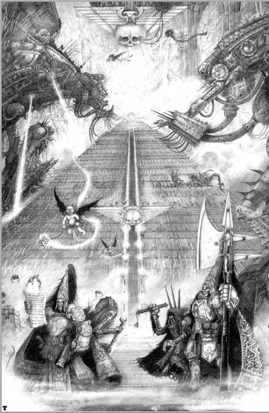
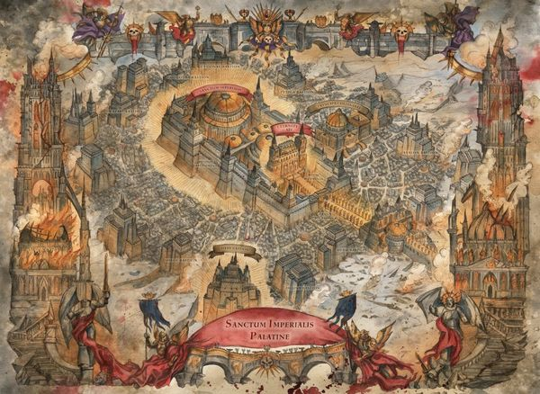
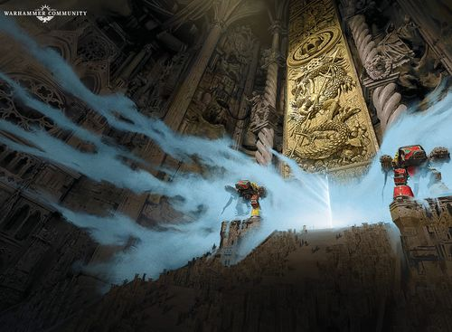
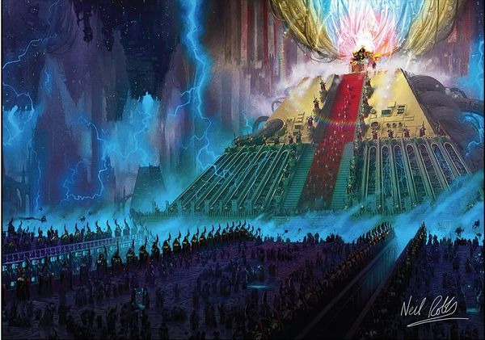

# 0992 帝国圣所 Sanctum Imperialis

精校状态：中文行文已逐段精校，部分术语仍为暂定

分类：地理 / 小行星

原文来源：https://www.bilibili.com/opus/1064897408311230469

原作者：帝国神选罐头

原文时间：2025年05月09日 16:25

[返回分类目录](目录.md) · [全书目录](../../目录.md)

原篇名：帝国圣殿 Sanctum Imperialis

<!-- A0992-B0001 -->
**英文原文**

The Sanctum Imperialis is the heart of the Imperial Palace on Terra and the official residence of the Emperor of Mankind.

<!-- /A0992-B0001 -->

<!-- A0992-B0002 -->

原译文

帝国圣殿是泰拉帝国皇宫的核心，也是人类帝皇的官邸。

**校订译文**

帝国圣所是泰拉帝国皇宫的核心，也是人类帝皇的正式居所。

<!-- /A0992-B0002 -->

<!-- A0992-B0003 图片 -->

<!-- A0992-B0004 -->

原译文

Sanctum Imperialis 帝国圣殿

**校订译文**

Sanctum Imperialis 帝国圣所

<!-- /A0992-B0004 -->

<!-- A0992-B0005 -->
## Overview 概述

<!-- /A0992-B0005 -->

<!-- A0992-B0006 -->
**英文原文**

Built above the ruins of Kathmandu in the Palace's northern regions, the Sanctum Imperialis lies deep within the Inner Palace, past the Eternity Gate which is permanently guarded by two Titans of the Legio Ignatum. The central area of the Sanctum is an expanse known as the Hall of Widows. Further into the Imperial Palace lies the Imperial Dungeon. The Dungeon was built deep underground by the Emperor to be the linchpin of his grand ambition. After a long journey below the surface of Terra, one finally comes before the last door (also called the Silver Door) into the Throneroom of the Emperor himself, which is guarded by a pair of Custodes Contemptor-Galatus Dreadnoughts. Over the door is the inscription Conservus, Restituere, Revivicarem.

<!-- /A0992-B0006 -->

<!-- A0992-B0007 -->

原译文

帝国圣殿建在皇宫北部地区加德满都废墟之上，位于内殿深处，经过永恒之门，永恒之门由烈焰军团的两名泰坦永久守卫。圣殿的中心区域是一个被称为寡妇大厅的广阔区域。在皇宫的更深处是帝国地牢。地牢是帝皇在地下深处建造的，是他雄心壮志的关键。在泰拉表面下进行了漫长的旅程后，人们终于来到了最后一扇门（也称为白银之门）之前，进入了帝皇的王座厅，王座由两名禁军蔑视者格拉图斯无畏守卫。门上刻着“保护、恢复、复兴”字样。

**校订译文**

帝国圣所建于皇宫北部的加德满都遗址之上，深藏内殿，位于永恒之门后方；宫门常年由烈焰军团的两台泰坦守卫。圣所中央是一片称为寡妇大厅的广阔区域。再向深处，便是帝国地牢——帝皇修建于地下深处、作为其宏伟计划关键所在的设施。在泰拉地下行进许久，才能抵达通往帝皇王座厅的最后一道门，亦称白银之门，由两台帝皇禁军角斗士型蔑视者无畏机甲把守。门上刻有“Conservus, Restituere, Revivicarem”，意为“守护、复原、复生”。

**校注：** 由无畏守卫的是最后一道门，不是直接守卫王座；采用官方角斗士型蔑视者无畏机甲。铭文保留原文并附暂译。

<!-- /A0992-B0007 -->

<!-- A0992-B0008 图片 -->

<!-- A0992-B0009 -->

原译文

Sanctum Imperialis Overview 帝国圣殿概述

**校订译文**

Sanctum Imperialis Overview 帝国圣所概览

<!-- /A0992-B0009 -->

<!-- A0992-B0010 -->
**英文原文**

Past the last door the Master of Mankind is eternally seated upon Golden Throne and is accompanied by the 300-strong Hetaeron Guard. The throneroom is at least 6 kilometers long and 1 kilometer high. Behind the Golden Throne is a dormant Webway Gate, long ago part of the Emperor's ultimate ambition but dormant since being sealed 10,000 years ago. In truth, the Throneroom is itself a massive edifice rather than a simple chamber, for within lies the vast machinery that keep the Golden Throne functional. In the years since the Heresy, the machinery has grown more vast and complex as the requirements to maintain the Throne have increased. The mechanisms of the Golden Throne are like roots that spread all the way to the Astronomicon.

<!-- /A0992-B0010 -->

<!-- A0992-B0011 -->

原译文

穿过最后一扇门，人类之主永远坐在黄金王座上，由300名强大的伙友卫队陪同。王座厅至少有6公里长，1公里高。黄金王座后面是一个休眠的网道门，很久以前是帝皇终极野心的一部分，但自从1万年前被密封以来一直处于休眠状态。事实上，王座厅本身是一座巨大的建筑，而不是一个简单的房间，因为里面有维持黄金王座功能的巨大机器。自叛乱以来的这些年里，随着维护王座的要求的增加，机器变得更加庞大和复杂。黄金王座的机械就像根，一直延伸到星炬。

**校订译文**

最后一道门内，人类之主永远端坐黄金王座，身旁由300人的伴卫卫队侍守。王座厅至少长6公里、高1公里。黄金王座背后是一道停用的网道大门，曾是帝皇终极宏愿的一部分，自一万年前封闭后便一直沉寂。王座厅实际上是一整座庞大建筑，其中容纳着维持黄金王座运作的巨型设备。荷鲁斯之乱以来，随着维护需求不断增加，这些机械也日益庞杂，像根系一样向外延伸，直达星炬。

<!-- /A0992-B0011 -->

<!-- A0992-B0012 图片 -->

<!-- A0992-B0013 -->

原译文

Eternity Gate 永恒之门

**校订译文**

Eternity Gate 永恒之门

<!-- /A0992-B0013 -->

<!-- A0992-B0014 -->
**英文原文**

The Tech-priests of the Adeptus Mechanicus' Adnector Concillium constantly maintain the Golden Throne, and they are the only ones besides the Adeptus Custodes and Sisters of Silence allowed to walk these halls. Along the walls of the Throneroom are thousands of outlets connected to the Golden Throne which are inserted with coffins holding a psyker. These serve to initiate the thousand daily sacrifices to keep the Golden Throne operational. Few can withstand to be before the Emperor's presence for very long without being overwhelmed. Even Custodes are are known to fall to their knees before the sight of Him.

<!-- /A0992-B0014 -->

<!-- A0992-B0015 -->

原译文

机械神教的统合议会的技术神甫不断维护着黄金王座，他们是除了禁军和寂静修女之外唯一被允许走在这些大厅里的人。沿着王座厅的墙壁，有数千个与黄金王座相连的接口，里面插着装有灵能者的棺材。这些用于启动每天的数千牺牲，以维持黄金王座的运作。很少有人能在帝皇面前呆很长时间而不被压垮。众所周知，即使是禁军也会在他面前跪下。

**校订译文**

机械修会统合议会的技术祭司持续维护黄金王座。除帝皇禁军与寂静修女外，只有他们获准进入这些厅堂。王座厅墙边排列着数千个与黄金王座相连的接口，供装有灵能者的棺舱接入，以完成每日千人的献祭，维持王座运作。几乎没人能长久承受帝皇的临在而不被压倒，就连禁军也曾在见到他时跪倒在地。

**校注：** 英文thousand daily为每日一千，不是数千；与989星炬每日百人死亡是不同设施语境，不合并。

<!-- /A0992-B0015 -->

<!-- A0992-B0016 图片 -->

<!-- A0992-B0017 -->

原译文

Emperor's Throneroom 帝皇的王座厅

**校订译文**

Emperor's Throneroom 帝皇的王座厅

<!-- /A0992-B0017 -->

<!-- A0992-B0018 -->
**英文原文**

The Imperial Dungeon was originally the laboratory where Amar Astarte created the Space Marines. However she destroyed her own lab during the Palace Coup in an attempt to erase her work. The Emperor had foreseen this and copied much of her work, apparently using the lab's destruction as an excuse to clear the chamber for the Webway Project.

<!-- /A0992-B0018 -->

<!-- A0992-B0019 -->

原译文

帝国地牢最初是阿马尔·阿斯塔特创建星际战士的实验室。然而，在皇宫政变期间，她摧毁了自己的实验室，试图抹去自己的作品。帝皇预见到了这一点，并复制了她的大部分作品，显然是以实验室的破坏为借口，为网道项目清理了房间。

**校订译文**

帝国地牢最初是阿玛尔·阿斯塔特创造星际战士的实验室。皇宫政变期间，她为抹去研究成果而毁掉了实验室。帝皇早已预见此事，复制了她的大量成果；他似乎又以实验室被毁为由，腾空这片区域，用于网道计划。

<!-- /A0992-B0019 -->

<!-- A0992-B0020 -->
### Other Areas of the Sanctum Imperialis 帝国圣所的其他区域

原题：Other Areas of the Sanctum Imperialis 帝国圣殿的其他地区

<!-- /A0992-B0020 -->

<!-- A0992-B0021 -->
**英文原文**

Inner Gardens: Former residential area used by the Emperor which contained a variety of Terran flora and fauna.

<!-- /A0992-B0021 -->

<!-- A0992-B0022 -->

原译文

内环花园：帝皇使用的前住宅区，里面有各种各样的泰拉动植物。

**校订译文**

内环花园——帝皇昔日的居住区，种养着各种泰拉动植物。

<!-- /A0992-B0022 -->

<!-- A0992-B0023 -->
**英文原文**

Great Observatory: A gigantic dome in the heart of the Palace, it is two thousand meters high, four kilometers wide, and build from solid marble. Three-hundred meter-wide steps lead to the Observatory, which is itched with the portraits of long-forgotten astronomers. At the center of the observatory hung an arcane device known as the Obsidian Speculum which was used to observe distant galaxies. The Speculum alongside much of the Observatory was damaged beyond repair during the Siege of Terra.

<!-- /A0992-B0023 -->

<!-- A0992-B0024 -->

原译文

大天文台：皇宫中心的一个巨大圆顶，高两千米，宽四公里，由实心大理石建造。三百米宽的台阶通往天文台，那里挂满了早已被遗忘的天文学家的肖像。天文台的中心悬挂着一个被称为黑曜石窥镜的神秘装置，用于观测遥远的星系。在泰拉围城期间，天文台大部分区域旁边的窥镜被损坏得无法修复。

**校订译文**

大观象台——皇宫核心的巨型穹顶建筑，高2,000米、宽4公里，由坚实的大理石建成。宽300米的台阶通往观象台，建筑上镌刻着早已被遗忘的天文学家肖像。中央悬挂一件名为黑曜石窥镜的秘奥装置，用于观察遥远星系。泰拉围城战中，窥镜与观象台的大部分区域一同遭到无法修复的破坏。

**校注：** 源文itched疑为etched；依肖像与建筑语境译镌刻。alongside意为窥镜与观象台皆受损，非窥镜位于损毁区域旁边。

<!-- /A0992-B0024 -->

<!-- A0992-B0025 -->
**英文原文**

Hall of Leng: Former residence of the Emperor known to be a place of chronological distortion where it is said he measured the angles of space and time. The Hall exists on a pulled thread in the fabric of space-time, described as a scan on the skin of space. Ancient men built a labyrinthine structure here which the Emperor came to expand upon.

<!-- /A0992-B0025 -->

<!-- A0992-B0026 -->

原译文

寒冷大厅：帝皇的故居，是一个时间扭曲的地方，据说他在那里测量了空间和时间的角度。大厅存在于时空结构中的一根拉线上，被描述为对空间表面的扫描。古代人在这里建造了一座迷宫般的建筑，帝皇前来扩建。

**校订译文**

伦格大厅——帝皇的旧居，也是时间发生扭曲的地方；据说他曾在此测量时空的角度。大厅位于时空织物中一根被扯出的丝线上，底稿又将它比作空间表面的“scan”。古人在此建造了一座迷宫般的建筑，后来由帝皇扩建。

**校注：** 原文scan on the skin of space比喻疑有拼写问题，可能想写scar等，但无版本依据；保留scan并标待核，不把扫描当已定设定。

<!-- /A0992-B0026 -->

<!-- A0992-B0027 -->
**英文原文**

Villas by the Lake: A gargantuan subterranean cavern which holds a large lake, twenty villas are built around a circular plaza. These villas were intended to be the homes of the Primarchs as they were raised by the Emperor, but their scattering prevented them from ever being used.

<!-- /A0992-B0027 -->

<!-- A0992-B0028 -->

原译文

湖畔别墅：一个巨大的地下洞穴，里面有一个大湖，二十栋别墅围绕着一个圆形广场建造。这些别墅原本是由帝皇建造的，是原体的家，但他们的分散使它们无法被使用。

**校订译文**

湖畔别墅——位于一座拥有大湖的巨型地下洞穴中，20座别墅围绕圆形广场而建。这里原是为由帝皇亲自抚养的原体们准备的住所，但原体失散，使这些住处从未投入使用。

<!-- /A0992-B0028 -->

<!-- A0992-B0029 -->
**英文原文**

Hall of Victories: A private museum of some of mankind's greatest technological accomplishments. It includes shards of the first clay pot made in antiquity, the Mars Rover, a circuit board from the first Warp Drive, and a tube with the "Mendelian Eukaryotic Genesis Formula", which allowed for the first cloned human.

<!-- /A0992-B0029 -->

<!-- A0992-B0030 -->

原译文

胜利大厅：一座展示人类最伟大技术成就的私人博物馆。它包括古代制造的第一个陶罐的碎片、火星探测器、第一个亚空间驱动器的电路板，以及一个装有“孟德尔真核起源公式”的管子，该公式允许第一个克隆人诞生。

**校订译文**

胜利大厅——私人博物馆，收藏人类最伟大的部分技术成果，包括远古第一只陶罐的碎片、火星探测车、第一台亚空间引擎的一块电路板，以及一支内藏“孟德尔真核生物创生公式”的管状容器；该公式促成了首个人类克隆体的诞生。

<!-- /A0992-B0030 -->

<!-- A0992-B0031 -->

原译文

Areopeia Junction 阿罗佩亚枢纽

**校订译文**

Areopeia Junction 阿罗佩亚枢纽

<!-- /A0992-B0031 -->

<!-- A0992-B0032 -->
## Trivia 琐事

<!-- /A0992-B0032 -->

<!-- A0992-B0033 -->
**英文原文**

The Emperor's residence, known as the Hall of Leng, may be a reference to the infamous Leng Plateau from the H.P. Lovecraft's Cthulhu Mythos, described as a place where realities merge.

<!-- /A0992-B0033 -->

<!-- A0992-B0034 -->

原译文

帝皇的住所，被称为寒冷大厅，可能是指H.P.洛夫克拉夫特的克苏鲁神话中臭名昭著的寒冷高原，被描述为现实融合的地方。

**校订译文**

帝皇居所“伦格大厅”的名字，可能取自H. P. 洛夫克拉夫特克苏鲁神话中著名的伦格高原——一个被描述为多重现实交汇之地的所在。

**校注：** 原寒冷高原是把Leng误作cold；沿本书伦格统一。典故关系仅为源文推测。

<!-- /A0992-B0034 -->

<!-- A0992-B0035 -->
**英文原文**

Portraits of astronomers within the Great Observatory include Algaonice, Galileo, Tycho Brahe, Hypatia, Zulema L'Astròloga, and Caroline Herschel. Also included is a scientist named Zarkov, who may be a reference to the fictional Hans Zarkov from the Flash Gordon series.

<!-- /A0992-B0035 -->

<!-- A0992-B0036 -->

原译文

大天文台内的天文学家肖像包括阿尔戈尼斯、伽利略、第谷·布拉赫、希帕蒂娅、祖勒玛·拉斯特罗加和卡罗琳·赫歇尔。还包括一位名叫扎尔科夫的科学家，他可能是飞侠哥顿系列中虚构的汉斯·扎尔科夫。

**校订译文**

大观象台镌刻的天文学家肖像包括阿尔戈尼斯、伽利略、第谷·布拉赫、希帕蒂娅、祖勒玛·拉斯特罗加和卡罗琳·赫歇尔。其中还有一位名叫扎尔科夫的科学家，可能影射《飞侠哥顿》中的虚构人物汉斯·扎尔科夫。

<!-- /A0992-B0036 -->

本篇核心术语与暂定项

以下列出本篇出现的英文原形及核心术语表用词。同形词可能指不同对象，具体词义以本篇正文和校注为准；单复数、别名和仅见于图注的名称可能尚未列入。完整候选见[术语表](../../术语表/双语术语候选.csv)。

| 英文 | 采用中文 | 状态 |
| --- | --- | --- |
| Space Marines | 星际战士 | 官方已核对 |
| Adeptus Custodes | 帝皇禁军 | 官方已核对 |
| Adeptus Mechanicus | 机械修会 | 官方已核对 |
| Psyker | 灵能者 | 官方已核对 |
| Warp | 亚空间 | 官方已核对 |
| Warp Drive | 亚空间驱动装置 | 暂定 |
| Webway | 网道 | 暂定 |
| Emperor of Mankind | 人类帝皇 | 暂定 |
| Emperor | 帝皇 | 官方已核对 |
| Terra | 泰拉 | 暂定·官方待核 |
| Sisters of Silence | 寂静修女 | 暂定·官方待核 |
| Adnector Concillium | 统合议会 | 暂定·官方待核 |
| Golden Throne | 黄金王座 | 暂定·官方待核 |
| Amar Astarte | 阿玛尔·阿斯塔特 | 暂定·官方待核 |
| Mars | 火星 | 暂定·官方待核 |
| Tech | 技术语 | 暂定·官方待核 |
| Clear | 清明 | 暂定·官方待核 |
| Webway Project | 网道计划 | 暂定·官方待核 |
| Master | 导师（审判庭职衔）／舰务官（舰员职务） | 语境定译·官方待核 |
| Ancient | 旗手 | 官方已核对 |
| Hetaeron Guard | 伴卫卫队 | 暂定·官方待核 |
| The Primarchs | 原体 | 暂定·官方待核 |
| Initiate | 正式成员 | 暂定·官方待核 |
| Imperialis | 帝国徽记 | 暂定·官方待核 |
| Sanctum | 圣所星 | 暂定·官方待核 |
| Sanctum Imperialis | 帝国圣所 | 暂定·官方待核 |
| Legio Ignatum | 烈焰军团 | 暂定·官方待核 |
| Hall of Leng | 伦格大厅 | 暂定·官方待核 |
| Palace Coup | 皇宫政变 | 暂定·官方待核 |
| Imperial Dungeon | 帝国地牢 | 暂定·官方待核 |
| Silver Door | 白银之门 | 暂定·官方待核 |
| Obsidian Speculum | 黑曜石窥镜 | 暂定·官方待核 |
| Villas by the Lake | 湖畔别墅 | 暂定·官方待核 |
| Inner Palace | 内殿 | 暂定·官方待核 |
| Inner Gardens | 内环花园 | 暂定·官方待核 |
| Hall of Victories | 胜利大厅 | 暂定·官方待核 |
| The Hall of Widows | 寡妇大厅 | 暂定·官方待核 |
| Eternity Gate | 永恒之门 | 暂定·官方待核 |

