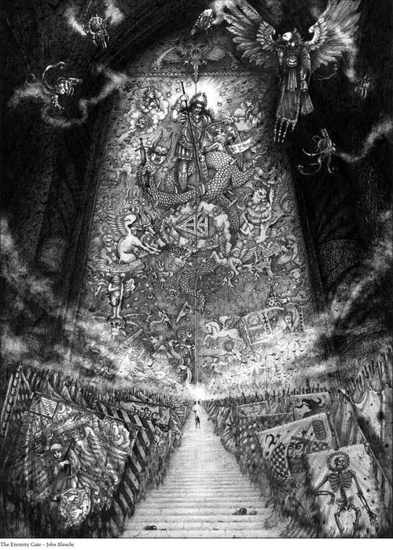
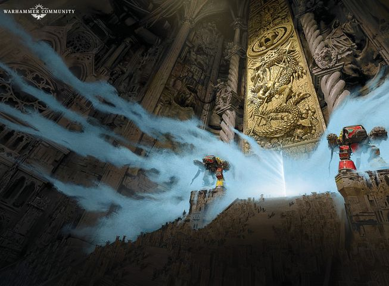
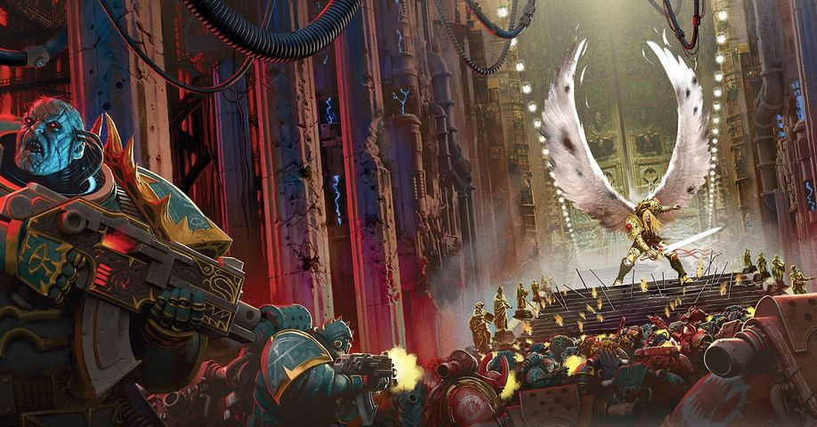

# 0993 永恒之门 Eternity Gate

精校状态：中文行文已逐段精校，部分术语仍为暂定

分类：地理 / 小行星

原文来源：https://www.bilibili.com/opus/1064897683224789032

原作者：帝国神选罐头

原文时间：2025年05月09日 16:26

[返回分类目录](目录.md) · [全书目录](../../目录.md)

<!-- A0993-B0001 -->
**英文原文**

The Eternity Gate is the Imperial Palace's final gateway to the Sanctum Imperialis which holds the Golden Throne and the Emperor himself.

<!-- /A0993-B0001 -->

<!-- A0993-B0002 -->

原译文

永恒之门是皇宫通往帝国圣殿的最后一道大门，帝国圣殿内容纳着黄金王座和帝皇本人。

**校订译文**

永恒之门是帝国皇宫通往帝国圣所的最后一道宫门，黄金王座和帝皇本人都位于圣所之内。

**校注：** 本篇称永恒之门为最后一道门，而992又述更深处白银之门；保留各篇视角／命名差异。

<!-- /A0993-B0002 -->

<!-- A0993-B0003 图片 -->

<!-- A0993-B0004 -->

原译文

Eternity Gate 永恒之门

**校订译文**

Eternity Gate 永恒之门

<!-- /A0993-B0004 -->

<!-- A0993-B0005 -->
## Description 描述

<!-- /A0993-B0005 -->

<!-- A0993-B0006 -->
**英文原文**

Two Warhound Titans of the honored Legio Ignatum stand guard, an eternal vigil they share with the 10,000 guards of the Adeptus Custodes.

<!-- /A0993-B0006 -->

<!-- A0993-B0007 -->

原译文

受人尊敬的烈焰军团的两名战犬泰坦站岗，他们与禁军的10000名守卫共同警戒。

**校订译文**

享有盛誉的烈焰军团派出两台战犬级泰坦守卫此门，与帝皇禁军的一万名战士共同履行永恒的守护使命。

<!-- /A0993-B0007 -->

<!-- A0993-B0008 图片 -->

<!-- A0993-B0009 -->

原译文

The Eternity Gate 永恒之门

**校订译文**

The Eternity Gate 永恒之门

<!-- /A0993-B0009 -->

<!-- A0993-B0010 -->
**英文原文**

Along the enormous part-hallway part-road to the Gate known as the Grand Processional scores of banners line the way, carried in battle by the Empire's greatest heroes from its very founding, among them one carried by Lord Commander Solar Macharius. Just as they honour the Emperor, he returns such honour. At the end of this hallway of heroes the gate itself stands, massive and unbreakable, forged of tempered adamantium layered with ceramite. Its outer face is sheathed in gold, and masked with an image of the Emperor in the days of the Great Crusade standing triumphant over his broken enemies.

<!-- /A0993-B0010 -->

<!-- A0993-B0011 -->

原译文

沿着被称为宏伟大道的通往大门的巨大走廊的部分道路，数十条横幅排列在路上，由帝国建国以来最伟大的英雄在战斗中携带，其中一条由领主指挥官太阳领主马卡里乌斯勋爵携带。正如他们尊重帝皇一样，他也回报了这样的荣誉。在这条英雄走廊的尽头，大门本身矗立着，巨大而坚不可摧，由回火的精金和陶钢锻造而成。它的外表覆盖着金色，并雕着一个帝皇的形象，在大远征的日子里，他战胜了破碎的敌人。

**校订译文**

通往永恒之门的宏伟大道兼有走廊与道路的形态，沿途陈列数十面战旗，都是帝国自建国以来最伟大英雄们曾带上战场的旗帜，其中就有太阳领主指挥官马卡里乌斯的旗帜。英雄们以战功荣耀帝皇，帝皇也以此荣耀他们。英雄长廊尽头，巨门巍然矗立，以淬炼精金覆以陶钢打造，坚不可摧。门外包覆黄金，饰有大远征时代帝皇踏过败敌、昂然胜立的形象。

<!-- /A0993-B0011 -->

<!-- A0993-B0012 -->
**英文原文**

An elite core of 300 Adeptus Custodes called the Companions stand guard over the Emperor himself while the rest of the Adeptus Custodes guard the rest of the Imperial Palace.

<!-- /A0993-B0012 -->

<!-- A0993-B0013 -->

原译文

一个由300名禁军组成的精英核心，称为伙友，守卫着帝皇本人，而其余的禁军则守卫着皇宫的其他部分。

**校订译文**

300名被称为“近侍”的帝皇禁军精锐贴身守卫帝皇，其余禁军则守护皇宫其他区域。

<!-- /A0993-B0013 -->

<!-- A0993-B0014 -->
**英文原文**

During the Battle of Terra in the Horus Heresy, Primarch Sanguinius led the defense of this entrance from the hordes of Chaos vying to overrun the Palace when no other could withstand the ferocity of the assault. Later during the War of the Beast, an Eldar raid got within sight of the Eternity Gate before it was defeated by Custodes. A Chaos uprising known as the Siege of the Eternity Gate took place sometime later.

<!-- /A0993-B0014 -->

<!-- A0993-B0015 -->

原译文

在荷鲁斯叛乱的泰拉之战中，原体圣吉列斯领导了这一入口的防御，当没有其他人能够抵御猛烈的进攻时，保卫这个入口免受混沌大军的围攻。在野兽战争的后期，一场灵族突袭在被禁军击败之前就进入了永恒之门的视线。后来发生了一场被称为“永恒之门围攻”的混沌叛乱。

**校订译文**

荷鲁斯之乱的泰拉之战中，混沌大军猛攻皇宫，众人都难以承受其攻势，原体圣吉列斯便亲率守军保卫这一入口。后来在野兽战争期间，一支灵族突袭部队一度推进到能够望见永恒之门的位置，最终被禁军击败。更晚些时候，这里还爆发过一场名为“永恒之门围攻”的混沌叛乱。

<!-- /A0993-B0015 -->

<!-- A0993-B0016 图片 -->

<!-- A0993-B0017 -->

原译文

Sanguinius defends the Eternity Gate during the Siege of Terra 圣吉列斯在荷鲁斯叛乱期间防御永恒之门

**校订译文**

Sanguinius defends the Eternity Gate during the Siege of Terra 泰拉围城战期间，圣吉列斯保卫永恒之门

<!-- /A0993-B0017 -->

本篇核心术语与暂定项

以下列出本篇出现的英文原形及核心术语表用词。同形词可能指不同对象，具体词义以本篇正文和校注为准；单复数、别名和仅见于图注的名称可能尚未列入。完整候选见[术语表](../../术语表/双语术语候选.csv)。

| 英文 | 采用中文 | 状态 |
| --- | --- | --- |
| Adeptus Custodes | 帝皇禁军 | 官方已核对 |
| Eldar | 灵族 | 暂定·语境区分 |
| Horus Heresy | 荷鲁斯之乱 | 官方已核对 |
| Emperor | 帝皇 | 官方已核对 |
| Primarch | 原体 | 官方已核对 |
| Great Crusade | 大远征 | 暂定·官方待核 |
| Terra | 泰拉 | 暂定·官方待核 |
| Horus | 荷鲁斯 | 暂定·官方待核 |
| Golden Throne | 黄金王座 | 暂定·官方待核 |
| Vigil | 警戒团（静默修女编制）／警戒堡（红蝎空间站）／守夜星（行星） | 语境定译·官方待核 |
| Companions | 近侍 | 暂定·官方待核 |
| Lord Commander | 领主指挥官 | 暂定·官方待核 |
| Founding | 建军 | 暂定·官方待核 |
| The Beast | 野兽 | 暂定·官方待核 |
| Imperialis | 帝国徽记 | 暂定·官方待核 |
| Sanctum | 圣所星 | 暂定·官方待核 |
| Sanctum Imperialis | 帝国圣所 | 暂定·官方待核 |
| Legio Ignatum | 烈焰军团 | 暂定·官方待核 |
| Ferocity | 凶猛 | 暂定·官方待核 |
| Macharius | 马卡里乌斯 | 暂定·官方待核 |
| Lord Commander Solar | 太阳领主指挥官 | 暂定·官方待核 |
| The Grand Processional | 宏伟大道 | 暂定·官方待核 |
| Eternity Gate | 永恒之门 | 暂定·官方待核 |

