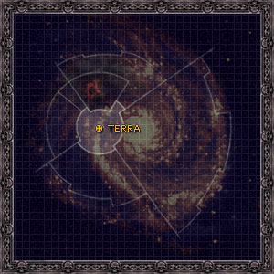

# 0996 月球 Luna

精校状态：中文行文已逐段精校，部分术语仍为暂定

分类：地理 / 小行星

原文来源：https://www.bilibili.com/opus/1127908401068638233

原作者：帝国神选罐头

原文时间：2025年10月26日 11:40

[返回分类目录](目录.md) · [全书目录](../../目录.md)

<!-- A0996-B0001 图片 -->

<!-- A0996-B0002 -->

原译文

Map 地图

**校订译文**

Map 地图

<!-- /A0996-B0002 -->

<!-- A0996-B0003 -->
### Basic Data 基本资料

原题：Basic Data 基础信息

<!-- /A0996-B0003 -->

<!-- A0996-B0004 -->
**英文原文**

Name:Luna

<!-- /A0996-B0004 -->

<!-- A0996-B0005 -->

原译文

名称：月球

**校订译文**

名称：月球

<!-- /A0996-B0005 -->

<!-- A0996-B0006 -->
**英文原文**

Segmentum:Segmentum Solar

<!-- /A0996-B0006 -->

<!-- A0996-B0007 -->

原译文

星语：太阳星域

**校订译文**

星域：太阳星域

**校注：** Segmentum为星域，原星语错字。

<!-- /A0996-B0007 -->

<!-- A0996-B0008 -->
**英文原文**

Sector:Sector Solar

<!-- /A0996-B0008 -->

<!-- A0996-B0009 -->

原译文

星区：太阳星区

**校订译文**

星区：太阳星区

<!-- /A0996-B0009 -->

<!-- A0996-B0010 -->
**英文原文**

Subsector:Subsector Sol

<!-- /A0996-B0010 -->

<!-- A0996-B0011 -->

原译文

分区：太阳分区

**校订译文**

次星区：太阳次星区

<!-- /A0996-B0011 -->

<!-- A0996-B0012 -->
**英文原文**

System:Sol System

<!-- /A0996-B0012 -->

<!-- A0996-B0013 -->

原译文

星系：太阳星系

**校订译文**

星系：太阳星系

<!-- /A0996-B0013 -->

<!-- A0996-B0014 -->
**英文原文**

Primary:Terra

<!-- /A0996-B0014 -->

<!-- A0996-B0015 -->

原译文

主星：泰拉

**校订译文**

主星：泰拉

<!-- /A0996-B0015 -->

<!-- A0996-B0016 -->
**英文原文**

Population:Billions

<!-- /A0996-B0016 -->

<!-- A0996-B0017 -->

原译文

人口：数十亿

**校订译文**

人口：数十亿

<!-- /A0996-B0017 -->

<!-- A0996-B0018 -->
**英文原文**

Affiliation:Imperium

<!-- /A0996-B0018 -->

<!-- A0996-B0019 -->

原译文

隶属：帝国

**校订译文**

隶属：帝国

<!-- /A0996-B0019 -->

<!-- A0996-B0020 -->
**英文原文**

Class:Civilised World/Death World

<!-- /A0996-B0020 -->

<!-- A0996-B0021 -->

原译文

级别：文明世界/死亡世界

**校订译文**

级别：文明世界/死亡世界

<!-- /A0996-B0021 -->

<!-- A0996-B0022 -->
**英文原文**

Luna is Terra's single moon. It is the base for massive defense structures defending Terra.

<!-- /A0996-B0022 -->

<!-- A0996-B0023 -->

原译文

月球是泰拉的唯一卫星。它是防御泰拉的大型防御结构的基础。

**校订译文**

月球是泰拉唯一的卫星，也是众多大型泰拉防御设施的所在地。

<!-- /A0996-B0023 -->

<!-- A0996-B0024 -->
## History 历史

<!-- /A0996-B0024 -->

<!-- A0996-B0025 -->
**英文原文**

Luna was a renowned center of human genetic research during the Dark Age of Technology, becoming home to massive underground genetic laboratories. During the Age of Strife, it was ruled over by brilliant but fanatical Selenar gene-cults who only submitted to the Emperor after the First Pacification of Luna, the first battle of the Great Crusade. The pacification of the Gene-Cults of Luna allowed the Emperor to mass-produce the Legiones Astartes. As the Crusade expanded outwards, Astartes production on Luna diminished and the Selenar cults lost their importance. The moon was instead given to the Sisters of Silence, Departmento Munitorum centers, and Imperialis Armada defenses.

<!-- /A0996-B0025 -->

<!-- A0996-B0026 -->

原译文

月球是黑暗技术时代著名的人类基因研究中心，成为大型地下基因实验室的所在地。在纷争时代，它被辉煌但狂热的赛琳娜基因教派统治，他们在大远征的第一场战斗 — 第一次月球平定之后才向帝皇屈服。月球基因教派的平定使帝皇能够大规模生产军团士兵。随着远征向外扩张，月球上的阿斯塔特生产减少，赛琳娜教派失去了重要性。月球被交给了寂静修女、军务部中心和帝国舰队防御。

**校订译文**

科技黑暗时代，月球以人类基因研究中心闻名，地下遍布巨型基因实验室。纷争时代，技术高超却狂热的赛琳娜基因教派统治这里；直到大远征首战——第一次月球平定战后，他们才向帝皇臣服。征服月球基因教派，使帝皇得以大规模培养阿斯塔特军团战士。随着远征向外扩展，月球上的阿斯塔特生产逐渐减少，赛琳娜教派也失去重要地位。月球随后改由寂静修女驻扎、军务部设立中心，并部署帝国舰队防御设施。

<!-- /A0996-B0026 -->

<!-- A0996-B0027 -->
**英文原文**

During the Horus Heresy's Solar War, Luna was the target of a major traitor attack led by Sons of Horus First Captain Abaddon. During the fighting its massive orbital defense ring was the target of a kamikaze attack by the Battle Barge War Oath and Abaddon captured its remaining gene-labs from loyalist forces. The Selenar Cults, resentful against the Imperium, chose to side with Warmaster Horus and share with him their gene-tech. After the traitor defeat in the Siege of Terra Luna was reclaimed by loyalists in the Great Scouring.

<!-- /A0996-B0027 -->

<!-- A0996-B0028 -->

原译文

在荷鲁斯叛乱的太阳战争期间，月球是荷鲁斯之子第一连长阿巴顿领导的一场重大叛徒袭击的目标。在战斗中，其庞大的轨道防御环成为了战斗驳船战争誓言号神风特攻的攻击目标，阿巴顿从忠诚部队手中夺取了其剩余的基因实验室。赛琳娜教派对帝国心怀怨恨，选择站在战帅荷鲁斯一边，与他分享他们的基因技术。月球在泰拉围城中叛徒失败后，被大清洗中的忠诚者夺回。

**校订译文**

荷鲁斯之乱的太阳战争中，荷鲁斯之子第一连长阿巴顿率叛军大举进攻月球。战斗驳船战争誓言号对庞大的轨道防御环发动自杀式撞击，阿巴顿则从忠诚派手中夺取了剩余基因实验室。怨恨帝国的赛琳娜教派选择投向战帅荷鲁斯，与其分享基因技术。叛军在泰拉围城战败后，忠诚派于大清洗期间夺回月球。

<!-- /A0996-B0028 -->

<!-- A0996-B0029 -->
**英文原文**

By the M41 era Luna had decayed, having long since been squeezed of its resources by Terra. Much of the populace seemed bitter and resentful towards Terra, which they blamed for exploiting and "forgetting" them. Outside of key port facilities much of the planets infrastructure was abandoned and rotted and much of the population lived in squalor. This included the Somnus Citadel, which was thought abandoned by the Imperium. While home to limited atmosphere and artificial gravity, most of Luna's population lived underground in large Hive cities while the surface was dotted with factories and defensive structures. As a result, at least some of Luna's surface is still barren.

<!-- /A0996-B0029 -->

<!-- A0996-B0030 -->

原译文

到M41时代，月球已经破败，很久以前就被泰拉挤压了资源。大部分民众似乎对泰拉感到痛苦和怨恨，他们指责泰拉剥削和“忘记”了他们。在主要港口设施之外，行星上的大部分基础设施都被遗弃和腐烂，大部分人口生活在肮脏的环境中。其中包括被认为被帝国遗弃的索莫纳斯城堡。虽然月球的大气层和人造重力有限，但月球上的大多数人口都生活在大型巢都城市的地下，而地表则点缀着工厂和防御结构。因此，月球表面至少有一部分仍然是贫瘠的。

**校订译文**

到了M41，月球早已被泰拉榨尽资源，日渐衰败。大批民众怨恨泰拉，指责它剥削并“遗忘”了他们。除关键港口设施外，大部分基础设施被废弃、任其腐朽，多数居民生活贫困。索莫纳斯城堡也在其中，被认为已遭帝国遗弃。尽管月球局部仍有大气，并由人工重力设施维持环境，多数居民仍住在地下的大型巢都中；工厂和防御设施散布地表，至少部分地面仍然荒芜。

<!-- /A0996-B0030 -->

<!-- A0996-B0031 -->
**英文原文**

After the destruction of Cadia Luna again became a battlefield in the final stage of the Terran Crusade. Due to the reborn Roboute Guilliman's efforts to reach Terra via the Webway, Magnus and his Thousand Sons were able to emerge on the moon. In the subsequent battle the Chaos invaders were defeated thanks to the arrival of Imperial reinforcements from Terra that included the Imperial Fists, Custodes, Battlefleet Solar, and Sisters of Silence. After reforming the Imperium and beginning the Indomitus Crusade, Guilliman had Luna return to a measure of its former glory by re-garrisoning the Somnus Citadel with the renewed Sisters of Silence.

<!-- /A0996-B0031 -->

<!-- A0996-B0032 -->

原译文

卡迪亚被摧毁后，月球再次成为泰拉远征最后阶段的战场。由于重生的罗伯特·基里曼努力通过网道到达泰拉，马格努斯和他的千子得以登上月球。在随后的战斗中，混沌入侵者被击败，这要归功于来自泰拉的帝国增援部队的到来，其中包括帝国之拳、禁军、太阳舰队和寂静修女。在改革帝国并开始不屈远征后，基里曼让月球通过与新的寂静修女重新驻扎索莫纳斯城堡，恢复了昔日的辉煌。

**校订译文**

卡迪亚毁灭后，月球在泰拉远征最后阶段再次化为战场。复归的罗保特·基里曼试图经网道抵达泰拉，马格努斯与千子也由此登上月球。来自泰拉的帝国之拳、帝皇禁军、太阳战斗舰队及寂静修女随后赶到，协助击败混沌入侵者。基里曼改革帝国、展开不屈远征后，令重建的寂静修女重新进驻索莫纳斯城堡，使月球恢复了几分昔日荣光。

**校注：** a measure of its former glory为部分恢复，不是完全恢复。

<!-- /A0996-B0032 -->

<!-- A0996-B0033 -->
## Notable Locations 著名地点

<!-- /A0996-B0033 -->

<!-- A0996-B0034 -->
**英文原文**

Somnus Citadel — Headquarters of the Sisters of Silence

<!-- /A0996-B0034 -->

<!-- A0996-B0035 -->

原译文

索莫纳斯城堡 — 寂静修女的总部

**校订译文**

索莫纳斯城堡 — 寂静修女的总部

<!-- /A0996-B0035 -->

<!-- A0996-B0036 -->
**英文原文**

Port Luna — Naval base for Battlefleet Sol. An enormous shipyard capable of accommodating thousands of starships, at the time of the Horus Heresy it was the largest man-made military structure in history.

<!-- /A0996-B0036 -->

<!-- A0996-B0037 -->

原译文

月球港 — 太阳舰队的海军基地。这是一个能够容纳数千艘星际飞船的巨大船坞，在荷鲁斯叛乱时代，它是历史上最大的人造军事建筑。

**校订译文**

月球港——太阳战斗舰队的海军基地，是能容纳数千艘星际舰船的巨型船坞。荷鲁斯之乱时期，它是人类历史上最大的人工军事设施。

<!-- /A0996-B0037 -->

<!-- A0996-B0038 -->
**英文原文**

The Circuit — A massive artificial valley filled with military compounds, command centers, factories, and other facilities.

<!-- /A0996-B0038 -->

<!-- A0996-B0039 -->

原译文

回路 — 一个巨大的人工山谷，里面满是军事场地、指挥中心、工厂和其他设施。

**校订译文**

回路 — 一个巨大的人工山谷，里面满是军事场地、指挥中心、工厂和其他设施。

<!-- /A0996-B0039 -->

<!-- A0996-B0040 -->
**英文原文**

The Ring — A belt of defensive platforms that form a continuous ring around the planet. Made from rock excavated from Luna itself, it is bristling with countless Lance, Torpedo, and Macrocannon batteries. During the Horus Heresy, the Ring was significantly damaged, and since then has not been completely repaired, more resembling an arc than a full ring.

<!-- /A0996-B0040 -->

<!-- A0996-B0041 -->

原译文

环 — 围绕行星形成连续环的防御平台带。它由从月球本身挖掘的岩石制成，上面布满了无数的光矛、鱼雷和宏炮。在荷鲁斯叛乱时期，环严重受损，从那以后就没有完全修复过，更像是一个弧形而不是一个完整的环。

**校订译文**

防御环——由防御平台构成、环绕月球的连续环带，以月球本土开采的岩石建造，布满光矛、鱼雷和宏炮炮组。荷鲁斯之乱期间遭到重创，此后始终未彻底修复，如今更像一段圆弧，而非完整圆环。

<!-- /A0996-B0041 -->

<!-- A0996-B0042 -->
**英文原文**

Herodotus Omega Dome - Held an vault holding the ancient Selenar artifact known as the Magna Mater. During the Siege of Terra traitor forces attempted to breach the Dome and acquire the artifact, causing Ta'lab Vita-37 to recruit the crew of the Sisypheum for aid. During the battle, the Dome was destroyed.

<!-- /A0996-B0042 -->

<!-- A0996-B0043 -->

原译文

希罗多德欧米茄穹顶 - 有一个秘库，里面存放着被称为伟大之母的古代赛琳娜神器。在泰拉围城期间，叛徒部队试图突破穹顶并获得神器，导致塔'拉布·维塔-37招募西西弗斯号的船员寻求援助。在战斗中，穹顶被摧毁。

**校订译文**

希罗多德欧米伽穹顶——内部秘库保存着赛琳娜古老造物“伟大之母”。泰拉围城战中，叛军试图突破穹顶夺取造物，促使塔’拉布·维塔-37向西西弗姆号船员求援。穹顶最终在战斗中被毁。

<!-- /A0996-B0043 -->

<!-- A0996-B0044 -->
**英文原文**

Esoterikon Livris - Ancient archive

<!-- /A0996-B0044 -->

<!-- A0996-B0045 -->

原译文

秘密档馆 - 古代档案馆

**校订译文**

秘密档馆 - 古代档案馆

<!-- /A0996-B0045 -->

<!-- A0996-B0046 -->
**英文原文**

Sylem - Inquisitorial Fortress

<!-- /A0996-B0046 -->

<!-- A0996-B0047 -->

原译文

塞勒姆 - 审判庭堡垒

**校订译文**

塞勒姆 - 审判庭堡垒

<!-- /A0996-B0047 -->

<!-- A0996-B0048 -->
## Environment 环境

<!-- /A0996-B0048 -->

<!-- A0996-B0049 -->
**英文原文**

Thanks to the terraformic engines at Luna's core, gravity on Luna is similar to that of Terra. A breatheable atmosphere is still maintained in some areas on Luna.

<!-- /A0996-B0049 -->

<!-- A0996-B0050 -->

原译文

由于月球核心的泰拉化引擎，月球上的重力与泰拉相似。月球上的一些地区仍然保持着可呼吸的大气。

**校订译文**

月球核心的环境改造引擎使其重力接近泰拉，部分区域至今仍维持着可供呼吸的大气。

**校注：** terraformic为环境／地形改造，不是具体泰拉制造。

<!-- /A0996-B0050 -->

本篇核心术语与暂定项

以下列出本篇出现的英文原形及核心术语表用词。同形词可能指不同对象，具体词义以本篇正文和校注为准；单复数、别名和仅见于图注的名称可能尚未列入。完整候选见[术语表](../../术语表/双语术语候选.csv)。

| 英文 | 采用中文 | 状态 |
| --- | --- | --- |
| Thousand Sons | 千子 | 官方已核对 |
| Roboute Guilliman | 罗保特·基里曼 | 官方已核对 |
| Horus Heresy | 荷鲁斯之乱 | 官方已核对 |
| Imperium | 帝国 | 暂定·简称 |
| Dark Age of Technology | 黑暗科技时代 | 暂定 |
| Webway | 网道 | 暂定 |
| Indomitus | 不屈学派 | 暂定·学派语境 |
| History | 历史 | 编辑用语已统一 |
| Imperial Fists | 帝国之拳 | 暂定 |
| Emperor | 帝皇 | 官方已核对 |
| Departmento Munitorum | 军务部 | 暂定 |
| Battle Barge | 战斗驳船 | 暂定·官方待核 |
| Great Crusade | 大远征 | 暂定·官方待核 |
| Age of Strife | 纷争时代 | 暂定·官方待核 |
| Terra | 泰拉 | 暂定·官方待核 |
| Horus | 荷鲁斯 | 暂定·官方待核 |
| Sons of Horus | 荷鲁斯之子 | 暂定·官方待核 |
| Sisters of Silence | 寂静修女 | 暂定·官方待核 |
| Indomitus Crusade | 不屈远征 | 暂定·官方待核 |
| Legiones Astartes | 阿斯塔特军团 | 暂定·官方待核 |
| Imperialis Armada | 帝国无敌舰队 | 暂定·官方待核 |
| Segmentum Solar | 太阳星域 | 暂定·官方待核 |
| Segmentum | 星域 | 暂定·官方待核 |
| Sector | 星区 | 暂定·官方待核 |
| Subsector | 次星区 | 暂定·官方待核 |
| Cadia | 卡迪亚 | 暂定·官方待核 |
| Luna | 月球 | 暂定·官方待核 |
| Tech | 技术语 | 暂定·官方待核 |
| Ancient | 旗手 | 官方已核对 |
| Lance | 骑士矛阵 | 暂定·官方待核 |
| War Oath | 战争誓言号 | 暂定·官方待核 |
| Sol | 太阳系 | 暂定·官方待核 |
| First Captain | 第一连长 | 暂定·官方待核 |
| Captain | 连长 | 暂定·官方待核 |
| Invaders | 侵略者 | 暂定·官方待核 |
| Reborn | 复生者（战团）／重生者（死神军自称） | 语境定译·官方待核 |
| Torpedo | 鱼雷 | 暂定·官方待核 |
| Macrocannon | 宏炮 | 暂定·官方待核 |
| Imperialis | 帝国徽记 | 暂定·官方待核 |
| Selenar | 赛琳娜基因教派 | 暂定·官方待核 |
| Sisypheum | 西西弗姆号 | 暂定·官方待核 |
| Great Scouring | 大清洗 | 暂定·官方待核 |
| The Ring | 圆环 | 暂定·官方待核 |
| Somnus Citadel | 索莫纳斯城堡 | 暂定·官方待核 |
| The Dark | 《黑暗》 | 暂定·官方待核 |
| System | 星系（恒星系统） | 暂定·官方待核 |
| Death World | 死亡世界 | 暂定·官方待核 |
| Civilised World | 文明世界 | 暂定·官方待核 |
| First Pacification of Luna | 第一次月球平定 | 暂定·官方待核 |
| Magna Mater | 伟大之母 | 暂定·官方待核 |
| Terran Crusade | 泰拉远征 | 暂定·官方待核 |
| Subsector Sol | 太阳次星区 | 暂定·官方待核 |
| Sector Solar | 太阳星区 | 暂定·官方待核 |
| Sol System | 太阳系 | 暂定·官方待核 |
| Herodotus Omega Dome | 希罗多德欧米伽穹顶 | 暂定·官方待核 |
| Port Luna | 月球港 | 暂定·官方待核 |
| The Circuit | 回路 | 暂定·官方待核 |
| Esoterikon Livris | 秘密档馆 | 暂定·官方待核 |
| Sylem | 塞勒姆 | 暂定·官方待核 |

