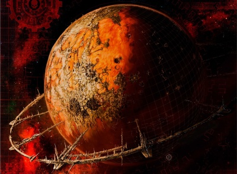
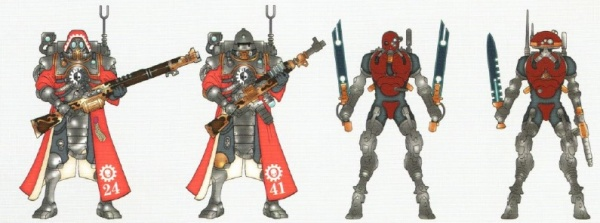
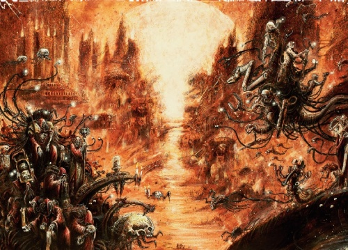

# 0997 火星 Mars

精校状态：中文行文已逐段精校，部分术语仍为暂定

分类：地理 / 小行星

原文来源：https://www.bilibili.com/opus/1057106303308005395

原作者：帝国神选罐头

原文时间：2025年04月18日 16:32

[返回分类目录](目录.md) · [全书目录](../../目录.md)

<!-- A0997-B0001 图片 -->

<!-- A0997-B0002 -->

原译文

Planetary Image 行星图像

**校订译文**

Planetary Image 行星图像

<!-- /A0997-B0002 -->

<!-- A0997-B0003 -->
### Basic Data 基本资料

原题：Basic Data 基础数据

<!-- /A0997-B0003 -->

<!-- A0997-B0004 -->
**英文原文**

Name:Mars

<!-- /A0997-B0004 -->

<!-- A0997-B0005 -->

原译文

名称：火星

**校订译文**

名称：火星

<!-- /A0997-B0005 -->

<!-- A0997-B0006 -->
**英文原文**

Segmentum:Segmentum Solar

<!-- /A0997-B0006 -->

<!-- A0997-B0007 -->

原译文

星域：太阳星域

**校订译文**

星域：太阳星域

<!-- /A0997-B0007 -->

<!-- A0997-B0008 -->
**英文原文**

Sector:Sector Solar

<!-- /A0997-B0008 -->

<!-- A0997-B0009 -->

原译文

星区：太阳星区

**校订译文**

星区：太阳星区

<!-- /A0997-B0009 -->

<!-- A0997-B0010 -->
**英文原文**

Subsector:Subsector Sol

<!-- /A0997-B0010 -->

<!-- A0997-B0011 -->

原译文

分区：太阳分区

**校订译文**

次星区：太阳次星区

<!-- /A0997-B0011 -->

<!-- A0997-B0012 -->
**英文原文**

System:Sol System

<!-- /A0997-B0012 -->

<!-- A0997-B0013 -->

原译文

星系：太阳系

**校订译文**

星系：太阳系

<!-- /A0997-B0013 -->

<!-- A0997-B0014 -->
**英文原文**

Population:20,000,000,000

<!-- /A0997-B0014 -->

<!-- A0997-B0015 -->

原译文

人口：二百亿

**校订译文**

人口：二百亿

<!-- /A0997-B0015 -->

<!-- A0997-B0016 -->
**英文原文**

Affiliation:Imperium

<!-- /A0997-B0016 -->

<!-- A0997-B0017 -->

原译文

隶属：帝国

**校订译文**

隶属：帝国

<!-- /A0997-B0017 -->

<!-- A0997-B0018 -->
**英文原文**

Class:Forge World

<!-- /A0997-B0018 -->

<!-- A0997-B0019 -->

原译文

类别：铸造世界

**校订译文**

类别：铸造世界

<!-- /A0997-B0019 -->

<!-- A0997-B0020 -->
**英文原文**

Tithe Grade:Aptus Non

<!-- /A0997-B0020 -->

<!-- A0997-B0021 -->

原译文

什一税等级：特别免税

**校订译文**

什一税等级：特别免税

<!-- /A0997-B0021 -->

<!-- A0997-B0022 -->
**英文原文**

Mars, also known as Sacred Mars or simply The Red Planet, is the fourth planet of the Sol system. It is the domain, headquarters, and principal Forge World of the Adeptus Mechanicus.

<!-- /A0997-B0022 -->

<!-- A0997-B0023 -->

原译文

火星，也被称为神圣火星或简称为红星，是太阳系的第四颗行星。它是机械神教的领地、总部和主要铸造世界。

**校订译文**

火星又称神圣火星，或简称红色星球，是太阳系第四颗行星，也是机械修会的领地、总部与首要铸造世界。

<!-- /A0997-B0023 -->

<!-- A0997-B0024 图片 -->

<!-- A0997-B0025 -->

原译文

The Icon of Mars 火星的标志

**校订译文**

The Icon of Mars 火星的标志

<!-- /A0997-B0025 -->

<!-- A0997-B0026 -->
## Overview 概述

<!-- /A0997-B0026 -->

<!-- A0997-B0027 -->
**英文原文**

Mars is the linchpin of the Adeptus Mechanicus and the greatest repository of technical knowledge in the Imperium. Martian society is highly stratified, with the lowest level consisting of unaugmented Human citizens who labour en masse at simple tasks. Most citizens aspire to gain status by joining the Skitarii. In the process, they will receive their first bionics. Above these menials and soldiers are the ruling order, the Tech-Priests. The planet itself is ruled directly by the Fabricator-General of the Mechanicum. The ruling body of the Forge World and the entire Cult Mechanicus by extension, is the Synod of Mars (also known as the Great Synod and Martian Synod) and is lead by Fabricator General.

<!-- /A0997-B0027 -->

<!-- A0997-B0028 -->

原译文

火星是机械神教的关键，也是帝国中最大的技术知识库。火星社会高度分层，最低层由未经审计的人类公民组成，他们集体从事简单的工作。大多数公民都渴望通过加入护教军来获得地位。在这个过程中，他们将获得他们的第一个仿生部件。在这些仆人和士兵之上是统治集团，技术神甫。这颗行星本身直接由机械教铸造将军统治。铸造世界和整个机械教派的统治机构是火星议会（也称为大议会和火星会议），由铸造将军领导。

**校订译文**

火星是机械修会的枢纽，也是帝国最大的技术知识宝库。这里的社会等级森严，底层是未经机械改造的人类公民，成群从事简单劳作。许多人渴望加入护教军以提升地位，并在此过程中获得最初的仿生改造。劳工和士兵之上，是技术祭司构成的统治阶层。火星由机械教铸造将军直接统治；由他主持的火星议会，亦称大议会或火星会议，管理这个铸造世界，并由此统辖整个机械教派。

**校注：** unaugmented为未经身体改造，不是未经审计。源文在当代概述里用Mechanicum，按英文保留机械教组织名，未擅改时代称呼。

<!-- /A0997-B0028 -->

<!-- A0997-B0029 图片 -->

<!-- A0997-B0030 -->

原译文

Martian Skitarii 火星护教军

**校订译文**

Martian Skitarii 火星护教军

<!-- /A0997-B0030 -->

<!-- A0997-B0031 -->
**英文原文**

Mars is the home of the mightiest fleet in the Imperium, the Battlefleet Solar; above the equator vast space docks float in geo-stationary orbit. Mars serves as the Segmentum fortress of Segmentum Solar, and is the home world of several Titan Legions, including the Legio Ignatum. Every day trillions of tons of cargo are ferried downwards to the surface or upwards into space to the gigantic orbiting manufactorums by void-lifts.

<!-- /A0997-B0031 -->

<!-- A0997-B0032 -->

原译文

火星是帝国中最强大的舰队—太阳舰队的所在地；在赤道上方，巨大的太空码头漂浮在星球静止轨道上。火星是太阳星域的星域要塞，也是包括烈焰军团在内的几个泰坦军团的家园世界。每天，数万亿吨的货物通过虚空升降机被运送到地面或向上进入太空，到达巨大的轨道制造厂。

**校订译文**

火星是帝国最强舰队——太阳战斗舰队的基地。巨大的太空船坞漂浮在赤道上方的同步轨道上。它也是太阳星域的星域要塞，以及烈焰军团等数支泰坦军团的母世界。每天，数万亿吨货物经虚空升降机在地面与太空中的巨型轨道工厂之间往返运输。

<!-- /A0997-B0032 -->

<!-- A0997-B0033 -->
**英文原文**

Some rumours tell that the C'tan Void Dragon resides deep under Mars' surface. Another rumour says that the Primarch Ferrus Manus survived the Isstvan V massacre and now resides on Mars, though this is strictly rejected by the Iron Hands.

<!-- /A0997-B0033 -->

<!-- A0997-B0034 -->

原译文

有传言称，星神虚空龙深藏于火星表面之下。另一个谣言说，原体费鲁斯·马努斯在伊斯塔万五号大屠杀中幸存下来，现在居住在火星上，尽管钢铁之手严格拒绝了这一说法。

**校订译文**

有传言称，星神虚空龙潜藏在火星地下深处。另有传闻宣称原体费鲁斯·马努斯在伊斯塔万五号大屠杀中幸存，如今住在火星；钢铁之手坚决否认这种说法。

<!-- /A0997-B0034 -->

<!-- A0997-B0035 -->
## History 历史

<!-- /A0997-B0035 -->

<!-- A0997-B0036 -->
### Early History 早期历史

<!-- /A0997-B0036 -->

<!-- A0997-B0037 -->
**英文原文**

The Red Planet, as it is called, is acclaimed as a wonder of the galaxy. In the early 22nd century it became the first planet to be terraformed by humans. After being made habitable, the planet was settled by industrial cartels, and it soon developed into the first Hive World and a centre of industry and scientific advancement. During the Dark Age of Technology, the empires of Mars and Earth peacefully coexisted.

<!-- /A0997-B0037 -->

<!-- A0997-B0038 -->

原译文

这颗被称为红星的行星被誉为银河系的奇迹。在第22个千年初，它成为第一个被人类改造的行星。在适合居住后，这个星球被卡特尔工业企业定居，很快发展成为第一个巢都世界和工业和科学进步中心。在黑暗技术时代，火星和地球的帝国和平共处。

**校订译文**

红色星球被誉为银河奇迹。22世纪初，它成为人类第一颗完成环境改造的行星。适宜居住后，工业财团纷纷进驻，使它迅速发展为第一个巢都世界，以及工业和科学进步的中心。科技黑暗时代，火星与地球的帝国和平共存。

**校注：** 22nd century为22世纪，原第22个千年错一个数量级。

<!-- /A0997-B0038 -->

<!-- A0997-B0039 -->
**英文原文**

During the Age of Strife, Mars endured long centuries of isolation as complete anarchy ripped through Terra. During the long time Mars was cut off from Terra by Warp storms, Mars's own atmospheric shields gave way, exposing it to deadly radiation that devastated the planet. During this time, fallout shelters represented the only hope for one's survival on Mars. Technology, now responsible for one's very existence, soon became revered and the worship of the Omnissiah began in earnest. Any humans remaining outside the shelters devolved into cannibal mutants or were wiped out by insane automata and A.I. which stalked the surface.

<!-- /A0997-B0039 -->

<!-- A0997-B0040 -->

原译文

在纷争时代，火星经历了漫长的几个世纪的孤立，因为完全的无政府状态席卷了T泰拉。在很长一段时间里，火星被亚空间风暴与泰拉隔绝，火星自身的大气屏蔽失效，使其暴露在毁灭星球的致命辐射中。在此期间，放射性尘埃避难所是人们在火星上生存的唯一希望。技术，现在负责一个人的存在，很快就受到了人们的尊敬，对欧姆尼赛亚的崇拜也开始了。任何留在避难所外的人都会变成食人族和变种人，或者被潜入地表的疯狂自动机兵和人工智能消灭。

**校订译文**

纷争时代，无政府状态席卷泰拉，火星则经历了数百年的孤立。亚空间风暴长期隔断两地联系，而火星自身的大气防护也崩溃了，致命辐射摧残整个星球。防辐射避难所成为居民唯一的生存希望。技术直接维系着人的生命，因而迅速受到敬奉，对欧姆尼赛亚的崇拜随之兴起。留在避难所外的人，有的退化为食人变种人，有的被游荡于地表的疯狂自动机兵和人工智能杀死。

<!-- /A0997-B0040 -->

<!-- A0997-B0041 -->
**英文原文**

Long before the Terran Unification Wars, the survivors on Mars had developed their own culture, guided by the Cult Mechanicus. After battling against many horrors including the Cy-Carnivora, they eventually reunited the planet, founding the Mechanicum. As time went on, Mars began to send expeditions to Earth to reclaim lost technology there, and even sent fleets into the void beyond the Sol System to found new Forge Worlds.

<!-- /A0997-B0041 -->

<!-- A0997-B0042 -->

原译文

早在人类统一战争之前，火星上的幸存者就在机械教派的指导下发展了自己的文化。在与包括科技食肉者在内的许多恐怖生物作战后，他们最终重新统一了这个星球，建立了机械教。随着时间的推移，火星开始向地球派遣探险队，以回收那里丢失的技术，甚至派遣舰队进入太阳系以外的虚空，以发现新的铸造世界。

**校订译文**

早在泰拉统一战争之前，火星幸存者便在机械教派指引下发展出自己的文化。他们与科技食肉者等恐怖存在交战，最终重新统一行星，建立机械教。此后，火星开始派遣探险队前往地球，回收失落技术，甚至将舰队送往太阳系外，在那里建立新的铸造世界。

**校注：** found是建立，不是发现新铸造世界。

<!-- /A0997-B0042 -->

<!-- A0997-B0043 -->
### Union With the Imperium 与帝国结盟

<!-- /A0997-B0043 -->

<!-- A0997-B0044 -->
**英文原文**

Eventually, the Emperor would unite Terra, and established a union with Mars, bringing the red planet back into the fold. During the Great Crusade, the Titan Legions of Mars marched alongside the newly created Space Marines. However, during the Horus Heresy Mars became a key battleground as the loyalist Mechanicus and Dark Mechanicus split. In the resulting Schism of Mars, which devastated the planet, the Dark Mechanicum eventually emerged victorious. After the traitors took over Mars, the Imperial Fists blockaded the world for several years as the Heresy waged, only to be "liberated" by Horus' traitor forces during the final stage of the Solar War. Mars was again claimed by the Imperium after Horus was defeated in the Battle of Terra.

<!-- /A0997-B0044 -->

<!-- A0997-B0045 -->

原译文

最终，帝皇统一泰拉，并与火星建立联盟，将这颗红色星球重新纳入版图。在大远征期间，火星泰坦军团与新成立的星际战士并肩作战。然而，在荷鲁斯叛乱期间，随着忠诚机械教和黑暗机械教的分裂，火星成为了一个关键的战场。在由此导致的火星分裂中，黑暗机械教最终取得了胜利。在叛徒占领火星后，帝国之拳在叛徒发动战争时封锁了世界数年，但在太阳战争的最后阶段被荷鲁斯的叛徒部队“解放”。在荷鲁斯在泰拉之战中战败后，火星再次被帝国宣称拥有。

**校订译文**

帝皇最终统一泰拉，并与火星结盟，将红色星球重新纳入人类共同体。大远征期间，火星泰坦军团与新生的星际战士并肩作战。荷鲁斯之乱中，机械教分裂为忠诚派与黑暗机械教，火星遂成为关键战场。火星分裂重创了整颗行星，黑暗机械教最终获胜。叛军占据火星后，帝国之拳将其封锁数年；直到太阳战争最后阶段，荷鲁斯部队才将火星“解放”。荷鲁斯在泰拉战败后，帝国再次收复火星。

<!-- /A0997-B0045 -->

<!-- A0997-B0046 -->
### Post-Heresy 叛乱后

<!-- /A0997-B0046 -->

<!-- A0997-B0047 -->
**英文原文**

1,500 years later, during the War of the Beast in M32, relations between the Adeptus Terra and Mechanicum degenerated due to the scheming of the then-current Fabricator-General, Kubik. A crisis eventually erupted between the two powers over the custody of Tech-Priest Eldon Urquidex. After a tense standoff, the Fists Exemplar exchanged fire with Skitarii forces before Kubik backed down and agreed to hand over Urquidex.

<!-- /A0997-B0047 -->

<!-- A0997-B0048 -->

原译文

1500年后，在M32的野兽战争中，由于当时的铸造将军库比克的阴谋，泰拉和机械教之间的关系恶化。最终，这两个大国在科技神甫埃尔登·乌尔奎德克斯的监护权问题上爆发了危机。在紧张的对峙之后，艾尔顿·乌尔奎德斯特与护教军部队交火，然后库比克让步并同意交出乌尔奎德克斯。

**校订译文**

1,500年后，M32的野兽战争期间，时任铸造将军库比克的图谋使中央政务部与机械教关系恶化。双方围绕技术祭司埃尔登·乌尔奎德克斯的控制权爆发危机。紧张对峙后，典范之拳与护教军交火；库比克最终退让，同意交出乌尔奎德克斯。

**校注：** Fists Exemplar为典范之拳战团，原译误把交战者再译成乌尔奎德克斯人名；custody为控制／拘管，并非未成年人监护。

<!-- /A0997-B0048 -->

<!-- A0997-B0049 -->
**英文原文**

Mars would again became a battlefield during the North-South Mars Conflict of M34.

<!-- /A0997-B0049 -->

<!-- A0997-B0050 -->

原译文

在M34的南北火星冲突中，火星再次成为战场。

**校订译文**

在M34的南北火星冲突中，火星再次成为战场。

<!-- /A0997-B0050 -->

<!-- A0997-B0051 -->
### In the 41st Millennium 第41个千年

<!-- /A0997-B0051 -->

<!-- A0997-B0052 -->
**英文原文**

In the Age of the Imperium, Mars is home to untold billions of servitors and the Cult Mechanicus tech-priests, the devoted servants of its techno-arcane Machine God. The planet is covered in sprawling hives reaching miles into the Martian sky and their foundations delving deep into the planet's core. Orbital factories circle the equatorial belt, their ceaseless industry forming a glowing halo around the planet.

<!-- /A0997-B0052 -->

<!-- A0997-B0053 -->

原译文

在帝国时代，火星是无数仆人和机械教派技术神甫的家园，他们是技术奥秘万机神的忠实仆人。这颗行星上覆盖着绵延数英里的巢都，它们的基础深入到火星核心。轨道工厂环绕赤道带，他们不断的工业在星球周围形成了一个发光的光环。

**校订译文**

帝国时代，火星居住着数以十亿计的机仆，以及机械教派的技术祭司；他们都是神秘机械之神——万机神的忠仆。绵延巢都高耸入火星天空数英里，地基则深入星球核心。轨道工厂环绕赤道，永不停息的生产活动为星球镶上一圈炽亮光环。

<!-- /A0997-B0053 -->

<!-- A0997-B0054 -->
**英文原文**

In M41, Mars itself would come under attack by a bizarre suicidal Necron raid. Somehow, five Necron Shroud Class Light Cruisers managed to penetrate the formidable planetary defenses of the world. After pursuing the invaders to a mining complex in the northern regions of the planet known as the Noctis Labyrinthus, defense ships were finally able to catch and destroy the Necron vessels, though only to great cost to themselves. Moreover, one ship managed to actually land on the soil of Mars before being vaporized. What the Necrons hoped to gain by this remains a mystery.

<!-- /A0997-B0054 -->

<!-- A0997-B0055 -->

原译文

在M41，火星本身受到一场奇怪的自杀式死灵突袭的攻击。不知何故，五艘死灵寿衣级轻型巡洋舰设法穿透了世界上强大的行星防御系统。在追捕入侵者到地球北部地区被称为永夜迷宫的采矿综合体后，防御舰终于能够捕获并摧毁死灵船只，尽管只会给自己带来巨大的代价。此外，一艘飞船在汽化前成功降落在火星大地上。死灵希望从中获得什么仍然是个谜。

**校订译文**

M41，火星遭到一次诡异的太空死灵自杀式突袭。5艘寿衣级轻巡洋舰不知如何突破了严密的行星防御。守军舰船追击入侵者，直至火星北部名为永夜迷宫的矿业设施，才以惨重代价将其截住并摧毁。其中一艘甚至在被汽化之前成功降落火星地表。太空死灵此行究竟意欲何为，至今成谜。

**校注：** 原译地球错误，英文the planet指火星；caught在交战语境为截住，非俘获后摧毁。

<!-- /A0997-B0055 -->

<!-- A0997-B0056 -->
## Geography 地理

<!-- /A0997-B0056 -->

<!-- A0997-B0057 -->
**英文原文**

Millennia of industry has reduced the surface of Mars to toxic, barren desert. The planet has millions of factorums and hives, covering the planetary surface like a burning spider's web of light.

<!-- /A0997-B0057 -->

<!-- A0997-B0058 -->

原译文

数千年的工业使火星表面变成了有毒、贫瘠的沙漠。星球上有数百万个工厂和巢都，像燃烧的蜘蛛网一样覆盖着行星表面。

**校订译文**

数千年的工业使火星表面变成了有毒、贫瘠的沙漠。星球上有数百万个工厂和巢都，像燃烧的蜘蛛网一样覆盖着行星表面。

<!-- /A0997-B0058 -->

<!-- A0997-B0059 图片 -->

<!-- A0997-B0060 -->

原译文

The surface of Mars 火星表面

**校订译文**

The surface of Mars 火星表面

<!-- /A0997-B0060 -->

<!-- A0997-B0061 -->
### Notable Locations 著名地点

<!-- /A0997-B0061 -->

<!-- A0997-B0062 -->
### Tharsis Quadrangle 塔尔西斯四方区

<!-- /A0997-B0062 -->

<!-- A0997-B0063 -->
**英文原文**

Olympus Mons — Temple of the Fabricator-General. Also the largest mountain in the entire Sol System.

<!-- /A0997-B0063 -->

<!-- A0997-B0064 -->

原译文

奥林匹斯山脉—铸造将军神殿。也是整个太阳系中最大的山脉。

**校订译文**

奥林匹斯山——铸造将军神殿所在，也是整个太阳系最高大的山。

<!-- /A0997-B0064 -->

<!-- A0997-B0065 -->

原译文

The Temple of All Knowledge 全知圣殿

**校订译文**

The Temple of All Knowledge 全知圣殿

<!-- /A0997-B0065 -->

<!-- A0997-B0066 -->

原译文

Mondus Occulam 神秘世界

**校订译文**

Mondus Occulam 蒙杜斯·奥库勒姆

<!-- /A0997-B0066 -->

<!-- A0997-B0067 -->

原译文

Syria Planum 叙利亚高原

**校订译文**

Syria Planum 叙利亚高原

<!-- /A0997-B0067 -->

<!-- A0997-B0068 -->

原译文

Mondus Gamma 伽马世界

**校订译文**

Mondus Gamma 蒙杜斯·伽马

<!-- /A0997-B0068 -->

<!-- A0997-B0069 -->

原译文

Ipluvien Maximal 伊普鲁维恩·马克西姆

**校订译文**

Ipluvien Maximal 伊普露维恩·马克西姆

<!-- /A0997-B0069 -->

<!-- A0997-B0070 -->
**英文原文**

Ascraeus Mons — Fortress of the Legio Tempestus (Heresy-era). Destroyed during the Schism of Mars.

<!-- /A0997-B0070 -->

<!-- A0997-B0071 -->

原译文

艾斯克雷尔斯山脉 — 暴风军团要塞（叛乱时代）。在火星分裂期间被摧毁。

**校订译文**

艾斯克雷尔斯山——暴风军团在荷鲁斯之乱时期的要塞，于火星分裂中被毁。

<!-- /A0997-B0071 -->

<!-- A0997-B0072 -->
**英文原文**

Pavonis Mons — Fortress of the Legio Mortis (Heresy-era).

<!-- /A0997-B0072 -->

<!-- A0997-B0073 -->

原译文

帕弗尼斯山脉 — 死颅军团要塞（叛乱时代）

**校订译文**

帕弗尼斯山——死颅军团在荷鲁斯之乱时期的要塞。

<!-- /A0997-B0073 -->

<!-- A0997-B0074 -->
**英文原文**

Olympica Fossae — Titan construction yards.

<!-- /A0997-B0074 -->

<!-- A0997-B0075 -->

原译文

奥林匹亚峡谷 — 泰坦建造场。

**校订译文**

奥林匹亚峡谷 — 泰坦建造场。

<!-- /A0997-B0075 -->

<!-- A0997-B0076 -->
**英文原文**

Arsia Mons — Fortress of House Taranis (Heresy-era).

<!-- /A0997-B0076 -->

<!-- A0997-B0077 -->

原译文

阿尔西亚山 — 塔兰尼斯家族的要塞（叛乱时代）。

**校订译文**

阿尔西亚山——塔兰尼斯家族在荷鲁斯之乱时期的要塞。

<!-- /A0997-B0077 -->

<!-- A0997-B0078 -->

原译文

Magma City 马格马城

**校订译文**

Magma City 岩浆城

<!-- /A0997-B0078 -->

<!-- A0997-B0079 -->

原译文

Acheron Fosse 阿刻戎峡谷

**校订译文**

Acheron Fosse 阿刻戎峡谷

<!-- /A0997-B0079 -->

<!-- A0997-B0080 -->

原译文

Temple of the Frictionless Piston 无摩擦活塞圣殿

**校订译文**

Temple of the Frictionless Piston 无摩擦活塞圣殿

<!-- /A0997-B0080 -->

<!-- A0997-B0081 -->

原译文

The Noctis Labyrinthus 永夜迷宫

**校订译文**

The Noctis Labyrinthus 永夜迷宫

<!-- /A0997-B0081 -->

<!-- A0997-B0082 -->
### Other 其他

<!-- /A0997-B0082 -->

<!-- A0997-B0083 -->
**英文原文**

Aries Primus — during the Horus Heresy it was the second major city of the planet and the largest single source of war munitions in the Imperium. It was surrounded by a defence line called the Ring of Death with mighty plasma defence systems. It is unknown whether it still exists in M41.

<!-- /A0997-B0083 -->

<!-- A0997-B0084 -->

原译文

白羊座主城—在荷鲁斯叛乱时期，它是星球上第二大城市，也是帝国中最大的战争弹药来源。它被一条名为“死亡之环”的防线包围，该防线配备了强大的等离子防御系统。目前尚不清楚它是否仍存在于M41中。

**校订译文**

白羊座主城——荷鲁斯之乱时期火星第二大城市，也是帝国最大的单一军火产地。外围环绕着名为“死亡之环”的防线，设有强大的等离子防御系统。它是否仍存在于M41，尚不清楚。

<!-- /A0997-B0084 -->

<!-- A0997-B0085 -->

原译文

The High Altar of Technology 技术至高祭坛

**校订译文**

The High Altar of Technology 技术至高祭坛

<!-- /A0997-B0085 -->

<!-- A0997-B0086 -->

原译文

The Librarium Omnissiah 欧姆尼赛亚图书馆

**校订译文**

The Librarium Omnissiah 欧姆尼赛亚图书馆

<!-- /A0997-B0086 -->

<!-- A0997-B0087 -->

原译文

The Librarius Omnis 全知智库

**校订译文**

The Librarius Omnis 全知图书馆

<!-- /A0997-B0087 -->

<!-- A0997-B0088 -->

原译文

Mare Erythraeum 红海

**校订译文**

Mare Erythraeum 红海

<!-- /A0997-B0088 -->

<!-- A0997-B0089 -->

原译文

Hydraulach Point 海德拉科定居点

**校订译文**

Hydraulach Point 海德拉科定居点

<!-- /A0997-B0089 -->

<!-- A0997-B0090 -->

原译文

The Vaults of Moravec 莫拉维克地窖

**校订译文**

The Vaults of Moravec 莫拉维克秘库

<!-- /A0997-B0090 -->

<!-- A0997-B0091 -->

原译文

Other Locations 其他地点

**校订译文**

Other Locations 其他地点

<!-- /A0997-B0091 -->

<!-- A0997-B0092 -->

原译文

Glaivid Hive 格拉维德巢都

**校订译文**

Glaivid Hive 格拉维德巢都

<!-- /A0997-B0092 -->

<!-- A0997-B0093 -->

原译文

Oxygos Hive 奥西戈斯巢都

**校订译文**

Oxygos Hive 奥西戈斯巢都

<!-- /A0997-B0093 -->

<!-- A0997-B0094 -->

原译文

Olympus Undae Hive 奥林匹斯沙丘巢都

**校订译文**

Olympus Undae Hive 奥林匹斯沙丘巢都

<!-- /A0997-B0094 -->

<!-- A0997-B0095 -->

原译文

Hyperboreae Undae 许珀玻瑞亚沙丘

**校订译文**

Hyperboreae Undae 许珀玻瑞亚沙丘

<!-- /A0997-B0095 -->

<!-- A0997-B0096 -->

原译文

The Headquarters of the Collegia Titanica 泰坦修会总部

**校订译文**

The Headquarters of the Collegia Titanica 泰坦修会总部

<!-- /A0997-B0096 -->

<!-- A0997-B0097 -->

原译文

Mare Chronius 克罗尼乌斯海

**校订译文**

Mare Chronius 克罗尼乌斯海

<!-- /A0997-B0097 -->

<!-- A0997-B0098 -->

原译文

Tantalus Hive 坦塔罗斯巢都

**校订译文**

Tantalus Hive 坦塔罗斯巢都

<!-- /A0997-B0098 -->

<!-- A0997-B0099 -->

原译文

Milancovic Fusion Reactor 米兰科维奇聚变反应堆

**校订译文**

Milancovic Fusion Reactor 米兰科维奇聚变反应堆

<!-- /A0997-B0099 -->

<!-- A0997-B0100 -->

原译文

Arcadia Solar Collector Fields 阿卡迪亚太阳能集热器场

**校订译文**

Arcadia Solar Collector Fields 阿卡迪亚太阳能集热器场

<!-- /A0997-B0100 -->

<!-- A0997-B0101 -->

原译文

Omnid Apertura 全向光环

**校订译文**

Omnid Apertura 奥姆尼德·阿佩图拉

**校注：** Omnid Apertura是地名，原全向光环缺乏直接词义依据，暂音译待核。

<!-- /A0997-B0101 -->

<!-- A0997-B0102 -->

原译文

The Grand Temple of the Omnissiah 欧姆尼赛亚大神殿

**校订译文**

The Grand Temple of the Omnissiah 欧姆尼赛亚大神殿

<!-- /A0997-B0102 -->

<!-- A0997-B0103 -->

原译文

Mareotis Forge Temple 马雷奥蒂斯铸造圣殿

**校订译文**

Mareotis Forge Temple 马雷奥蒂斯铸造圣殿

<!-- /A0997-B0103 -->

<!-- A0997-B0104 -->

原译文

Deep Core Mines 深核矿井

**校订译文**

Deep Core Mines 深核矿井

<!-- /A0997-B0104 -->

<!-- A0997-B0105 -->

原译文

Dodecai Elevatus Prime 十二升降机一号

**校订译文**

Dodecai Elevatus Prime 多德凯升降设施一号

**校注：** Dodecai未证为计数十二，暂音译；Elevatus依上下文暂升降设施，功能仍待核。

<!-- /A0997-B0105 -->

<!-- A0997-B0106 -->

原译文

Dodecai Elevatus Secundus 十二升降机二号

**校订译文**

Dodecai Elevatus Secundus 多德凯升降设施二号

<!-- /A0997-B0106 -->

<!-- A0997-B0107 -->

原译文

Esperanos Space Port 埃斯佩兰诺斯太空港

**校订译文**

Esperanos Space Port 埃斯佩兰诺斯太空港

<!-- /A0997-B0107 -->

<!-- A0997-B0108 -->

原译文

Deus Manus Space Port 权力之神太空港

**校订译文**

Deus Manus Space Port 神之手太空港

**校注：** Deus Manus按神／手词根暂神之手，不是权力之神。

<!-- /A0997-B0108 -->

<!-- A0997-B0109 -->

原译文

Fortress-Temple of the Knights Taranis 塔兰尼斯骑士圣殿堡垒

**校订译文**

Fortress-Temple of the Knights Taranis 塔兰尼斯骑士圣殿堡垒

<!-- /A0997-B0109 -->

<!-- A0997-B0110 -->

原译文

Pavonis Mons 帕弗尼斯山脉

**校订译文**

Pavonis Mons 帕弗尼斯山

<!-- /A0997-B0110 -->

<!-- A0997-B0111 -->

原译文

Xanthos 克桑托斯

**校订译文**

Xanthos 克桑托斯

<!-- /A0997-B0111 -->

<!-- A0997-B0112 -->

原译文

Fortress-Temple of the Legio Tempestus 暴风军团圣殿堡垒

**校订译文**

Fortress-Temple of the Legio Tempestus 暴风军团圣殿堡垒

<!-- /A0997-B0112 -->

<!-- A0997-B0113 -->

原译文

Haunted Dunes of Solis Planum 索利斯平原的闹鬼沙丘

**校订译文**

Haunted Dunes of Solis Planum 索利斯平原的闹鬼沙丘

<!-- /A0997-B0113 -->

<!-- A0997-B0114 -->

原译文

Candor Casma 坎德河谷

**校订译文**

Candor Casma 坎德河谷

<!-- /A0997-B0114 -->

<!-- A0997-B0115 -->

原译文

Varnalia 瓦尔纳里亚

**校订译文**

Varnalia 瓦尔纳里亚

<!-- /A0997-B0115 -->

<!-- A0997-B0116 -->

原译文

Mondus Terrawatt II Complex 泰拉瓦特二号世界复合体

**校订译文**

Mondus Terrawatt II Complex 蒙杜斯·泰拉瓦特二号设施群

<!-- /A0997-B0116 -->

<!-- A0997-B0117 -->

原译文

Lybia Montes Forge Temples 利比亚蒙特斯铸造圣殿

**校订译文**

Lybia Montes Forge Temples 利比亚蒙特斯铸造圣殿

<!-- /A0997-B0117 -->

<!-- A0997-B0118 -->

原译文

Lethe Zone 忘川境

**校订译文**

Lethe Zone 忘川境

<!-- /A0997-B0118 -->

<!-- A0997-B0119 -->

原译文

Antionradi Forge Temple 安坦拉迪铸造圣殿

**校订译文**

Antionradi Forge Temple 安坦拉迪铸造圣殿

<!-- /A0997-B0119 -->

<!-- A0997-B0120 -->

原译文

Mechavitae Forge Temple 机械生命铸造圣殿

**校订译文**

Mechavitae Forge Temple 机械生命铸造圣殿

<!-- /A0997-B0120 -->

<!-- A0997-B0121 -->

原译文

The Rust Wastes 铁锈荒地

**校订译文**

The Rust Wastes 铁锈荒地

<!-- /A0997-B0121 -->

<!-- A0997-B0122 -->

原译文

Cthonia 冥府

**校订译文**

Cthonia 克苏尼亚（火星地区）

**校注：** 本条为火星地理名，同形Cthonia不代表荷鲁斯母星；音译统一词根但保留实体限定。

<!-- /A0997-B0122 -->

<!-- A0997-B0123 -->

原译文

Autonoct Deserts 自夜沙漠

**校订译文**

Autonoct Deserts 自夜沙漠

<!-- /A0997-B0123 -->

<!-- A0997-B0124 -->

原译文

Sornia 索尼亚

**校订译文**

Sornia 索尼亚

<!-- /A0997-B0124 -->

<!-- A0997-B0125 -->

原译文

Nilosyrtis Hive 尼罗沙洲巢都

**校订译文**

Nilosyrtis Hive 尼罗沙洲巢都

<!-- /A0997-B0125 -->

<!-- A0997-B0126 -->

原译文

Sydonian Tetrahedra 塞东尼亚四方区

**校订译文**

Sydonian Tetrahedra 西多尼亚四面体区

<!-- /A0997-B0126 -->

<!-- A0997-B0127 -->

原译文

Protoservitor cradle 原型机仆发源地

**校订译文**

Protoservitor cradle 原型机仆育成舱

**校注：** cradle暂按设备育成舱理解，具体设施性质待核，原发源地属另一词义。

<!-- /A0997-B0127 -->

<!-- A0997-B0128 -->

原译文

Sydonian Mistsea 锡多尼亚迷雾海

**校订译文**

Sydonian Mistsea 西多尼亚迷雾海

<!-- /A0997-B0128 -->

<!-- A0997-B0129 -->

原译文

Sydonian Mask 锡多尼亚伪装

**校订译文**

Sydonian Mask 西多尼亚面具

<!-- /A0997-B0129 -->

<!-- A0997-B0130 -->

原译文

Acidalia Planitia 阿西达里亚平原

**校订译文**

Acidalia Planitia 阿西达里亚平原

<!-- /A0997-B0130 -->

<!-- A0997-B0131 -->

原译文

Sea of Iron Curses 铁咒之海

**校订译文**

Sea of Iron Curses 铁咒之海

<!-- /A0997-B0131 -->

<!-- A0997-B0132 -->

原译文

Vastitas Borealis 北方大平原

**校订译文**

Vastitas Borealis 北方大平原

<!-- /A0997-B0132 -->

<!-- A0997-B0133 -->
## Satellites 卫星

<!-- /A0997-B0133 -->

<!-- A0997-B0134 -->
### Moons 卫星

<!-- /A0997-B0134 -->

<!-- A0997-B0135 -->
**英文原文**

Deimos (Former)

<!-- /A0997-B0135 -->

<!-- A0997-B0136 -->

原译文

火卫二（迪莫斯）（前）

**校订译文**

迪莫斯（曾为火星卫星，亦称火卫二）

<!-- /A0997-B0136 -->

<!-- A0997-B0137 -->

原译文

Phobos 火卫一（福波斯）

**校订译文**

Phobos 火卫一（福波斯）

<!-- /A0997-B0137 -->

<!-- A0997-B0138 -->
### The Ring of Iron 钢铁之环

<!-- /A0997-B0138 -->

<!-- A0997-B0139 -->
**英文原文**

The massive shipyards orbiting the Martian equator are known collectively as the Ring of Iron. Spacecraft and other large constructs are constructed within the Ring’s extensive orbital factories, and many of the ships of the Battlefleet Solar are based in its huge floating docks. As of M41, the Ring of Iron is the largest known man-made structure in the galaxy.

<!-- /A0997-B0139 -->

<!-- A0997-B0140 -->

原译文

环绕火星赤道的大型造船厂统称为钢铁之环。太空舰船和其他大型建筑都是在环的广阔轨道工厂内建造的，太阳舰队的许多船只都驻扎在其巨大的浮动码头上。截至M41，钢铁之环是银河系中已知最大的人造结构。

**校订译文**

环绕火星赤道的巨型船坞统称钢铁之环。舰船与其他大型构造体在其庞大的轨道工厂中建造，太阳战斗舰队的许多舰船也以这里的巨型浮空船坞为基地。到M41，钢铁之环是银河已知最大的人造结构。

<!-- /A0997-B0140 -->

本篇核心术语与暂定项

以下列出本篇出现的英文原形及核心术语表用词。同形词可能指不同对象，具体词义以本篇正文和校注为准；单复数、别名和仅见于图注的名称可能尚未列入。完整候选见[术语表](../../术语表/双语术语候选.csv)。

| 英文 | 采用中文 | 状态 |
| --- | --- | --- |
| Space Marines | 星际战士 | 官方已核对 |
| Adeptus Mechanicus | 机械修会 | 官方已核对 |
| Necrons | 太空死灵 | 官方已核对 |
| Horus Heresy | 荷鲁斯之乱 | 官方已核对 |
| Warp | 亚空间 | 官方已核对 |
| Imperium | 帝国 | 暂定·简称 |
| Mechanicum | 机械教 | 暂定·历史称谓 |
| Cult Mechanicus | 机械教派 | 暂定·概念区分 |
| Tech-Priest | 技术祭司 | 官方已核对 |
| Dark Mechanicum | 黑暗机械教 | 暂定·官方待核 |
| Dark Age of Technology | 黑暗科技时代 | 暂定 |
| Imperial Fists | 帝国之拳 | 暂定 |
| Emperor | 帝皇 | 官方已核对 |
| Primarch | 原体 | 官方已核对 |
| Adeptus Terra | 中央政务部 | 暂定 |
| Hive World | 巢都世界 | 暂定·官方待核 |
| Forge World | 铸造世界 | 暂定·官方待核 |
| Great Crusade | 大远征 | 暂定·官方待核 |
| Age of Strife | 纷争时代 | 暂定·官方待核 |
| Ferrus Manus | 费鲁斯·马努斯 | 暂定·官方待核 |
| Terra | 泰拉 | 暂定·官方待核 |
| Horus | 荷鲁斯 | 暂定·官方待核 |
| Iron Hands | 钢铁之手 | 暂定·官方待核 |
| Skitarii | 护教军 | 暂定·官方待核 |
| Unification Wars | 统一战争 | 暂定·官方待核 |
| Segmentum Solar | 太阳星域 | 暂定·官方待核 |
| Segmentum | 星域 | 暂定·官方待核 |
| Sector | 星区 | 暂定·官方待核 |
| Subsector | 次星区 | 暂定·官方待核 |
| Machine God | 万机神 | 暂定·官方待核 |
| Omnissiah | 欧姆尼赛亚 | 暂定·官方待核 |
| Age of the Imperium | 帝国时代 | 暂定·官方待核 |
| Void Dragon | 虚空龙 | 暂定·官方待核 |
| Mars | 火星 | 暂定·官方待核 |
| Deimos | 迪莫斯 | 暂定·官方待核 |
| Titan | 泰坦 | 暂定·官方待核 |
| Tech | 技术语 | 暂定·官方待核 |
| Bionics | 仿生改造／仿生部件（依语境） | 语境定译·官方待核 |
| Aptus Non | 特级免税 | 暂定·官方待核 |
| Fabricator-General | 铸造将军 | 暂定·官方待核 |
| Founding | 建军 | 暂定·官方待核 |
| Sol | 太阳系 | 暂定·官方待核 |
| Isstvan | 伊斯塔万 | 暂定·官方待核 |
| Fists Exemplar | 典范之拳 | 暂定·官方待核 |
| Invaders | 侵略者 | 暂定·官方待核 |
| Powers | 能天使 | 暂定·官方待核 |
| Dark Mechanicus | 黑暗机械教 | 暂定·官方待核 |
| C'tan | 星神 | 暂定·官方待核 |
| Principal | 首席（史洛斯职衔） | 暂定·官方待核 |
| The Beast | 野兽 | 暂定·官方待核 |
| Primus | 领军 | 官方已核对 |
| Menials | 杂役 | 暂定·官方待核 |
| The Ring | 圆环 | 暂定·官方待核 |
| Legio Ignatum | 烈焰军团 | 暂定·官方待核 |
| The Dark | 《黑暗》 | 暂定·官方待核 |
| Kubik | 库比克 | 暂定·官方待核 |
| Eldon Urquidex | 埃尔登·乌尔奎德克斯 | 暂定·官方待核 |
| Pavonis Mons | 帕弗尼斯山 | 暂定·官方待核 |
| Segmentum Fortress | 星域堡垒 | 暂定·官方待核 |
| System | 星系（恒星系统） | 暂定·官方待核 |
| Shroud | 裹尸布 | 暂定·官方待核 |
| Legio Mortis | 死亡军团 | 暂定·官方待核 |
| Ring of Iron | 铁环 | 暂定·官方待核 |
| Fabricator | 铸造师 | 暂定·待核官方 |
| Subsector Sol | 太阳次星区 | 暂定·官方待核 |
| Titan Legions | 泰坦军团 | 暂定·官方待核 |
| Ring of Death | 死亡之环 | 暂定·官方待核 |
| Aries Primus | 白羊座主城 | 暂定·官方待核 |
| Sector Solar | 太阳星区 | 暂定·官方待核 |
| Sol System | 太阳系 | 暂定·官方待核 |
| Skitarii Forces | 护教军部队 | 暂定·官方待核 |
| Synod of Mars | 火星议会 | 暂定·官方待核 |
| Olympus Mons | 奥林匹斯山 | 暂定·官方待核 |
| Ascraeus Mons | 艾斯克雷尔斯山 | 暂定·官方待核 |
| Olympica Fossae | 奥林匹亚峡谷 | 暂定·官方待核 |
| Arsia Mons | 阿尔西亚山 | 暂定·官方待核 |
| The Noctis Labyrinthus | 永夜迷宫 | 暂定·官方待核 |
| The Ring of Iron | 钢铁之环 | 暂定·官方待核 |

