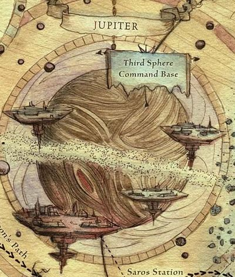

# 1001 木星 Jupiter

精校状态：中文行文已逐段精校，部分术语仍为暂定

分类：地理 / 小行星

原文来源：https://www.bilibili.com/opus/1056644465440063510

原作者：帝国神选罐头

原文时间：2025年04月17日 10:40

[返回分类目录](目录.md) · [全书目录](../../目录.md)

<!-- A1001-B0001 图片 -->

<!-- A1001-B0002 -->

原译文

Planetary Image 行星图像

**校订译文**

Planetary Image 行星图像

<!-- /A1001-B0002 -->

<!-- A1001-B0003 -->
### Basic Data 基本资料

原题：Basic Data 基础数据

<!-- /A1001-B0003 -->

<!-- A1001-B0004 -->
**英文原文**

Name:Jupiter

<!-- /A1001-B0004 -->

<!-- A1001-B0005 -->

原译文

名称：木星

**校订译文**

名称：木星

<!-- /A1001-B0005 -->

<!-- A1001-B0006 -->
**英文原文**

Segmentum:Segmentum Solar

<!-- /A1001-B0006 -->

<!-- A1001-B0007 -->

原译文

星域：太阳星域

**校订译文**

星域：太阳星域

<!-- /A1001-B0007 -->

<!-- A1001-B0008 -->
**英文原文**

Sector:Sector Solar

<!-- /A1001-B0008 -->

<!-- A1001-B0009 -->

原译文

星区：太阳星区

**校订译文**

星区：太阳星区

<!-- /A1001-B0009 -->

<!-- A1001-B0010 -->
**英文原文**

Subsector:Subsector Sol

<!-- /A1001-B0010 -->

<!-- A1001-B0011 -->

原译文

分区：太阳分区

**校订译文**

次星区：太阳次星区

<!-- /A1001-B0011 -->

<!-- A1001-B0012 -->
**英文原文**

System:Sol System

<!-- /A1001-B0012 -->

<!-- A1001-B0013 -->

原译文

星系：太阳系

**校订译文**

星系：太阳系

<!-- /A1001-B0013 -->

<!-- A1001-B0014 -->
**英文原文**

Affiliation:Imperium

<!-- /A1001-B0014 -->

<!-- A1001-B0015 -->

原译文

隶属：帝国

**校订译文**

隶属：帝国

<!-- /A1001-B0015 -->

<!-- A1001-B0016 -->
**英文原文**

Class:Gas Giant / Forge World / Mining World

<!-- /A1001-B0016 -->

<!-- A1001-B0017 -->

原译文

类别：气态巨星/铸造世界/矿业世界

**校订译文**

类别：气态巨星/铸造世界/矿业世界

<!-- /A1001-B0017 -->

<!-- A1001-B0018 -->
**英文原文**

Jupiter is a Forge World and Mining World in the Sol System and, as with all forge-worlds, it is a vast manufacturing center. It is the base of the orbital Jovian shipyards.

<!-- /A1001-B0018 -->

<!-- A1001-B0019 -->

原译文

木星是太阳系中的铸造世界和矿业世界，与所有铸造世界一样，它是一个巨大的制造中心。它是木星轨道造船厂的基地。

**校订译文**

木星是太阳系中的铸造世界兼矿业世界，与其他铸造世界一样，是庞大的制造中心。木星轨道造船厂就设于此。

<!-- /A1001-B0019 -->

<!-- A1001-B0020 -->
## History 历史

<!-- /A1001-B0020 -->

<!-- A1001-B0021 -->
**英文原文**

During the Age of Strife, Jupiter's moons became occupied by cruel Xenos overlords which enslaved the human inhabitants. These moons were not liberated from alien control until the coming of the Emperor in the early days of the Great Crusade. The Human Jovian Void Clans were utilized by the Emperor during the Great Crusade. During the Great Crusade the Jovian Clans and their shipyards gained fame for producing massive amounts of high-quality warships thanks to technology they guarded even from the Mechanicum.

<!-- /A1001-B0021 -->

<!-- A1001-B0022 -->

原译文

在纷争时代，木星的卫星被残酷的异型霸主占领，他们奴役了人类居民。直到大远征初期帝皇的到来，这些卫星才从外星人的控制中解放出来。人类木星虚空氏族在大远征期间被帝皇利用。在大远征期间，木星氏族及其造船厂因生产大量高质量的战舰而闻名，这要归功于他们甚至从机械神教那里保护的技术。

**校订译文**

纷争时代，木星的卫星被残酷的异形霸主占据，当地人类遭到奴役。直到大远征初期帝皇到来，这些卫星才摆脱异形统治。大远征期间，帝皇征用了人类的木星虚空氏族；这些氏族及其造船厂因能大量生产优质战舰而闻名，所凭借的技术甚至对机械教也秘而不宣。

<!-- /A1001-B0022 -->

<!-- A1001-B0023 -->
**英文原文**

During the Horus Heresy Jupiter was the center of Rogal Dorn's third defensive sphere under the command of Imperial Fists Captain Efried. In the later stages of the Solar War, the massive array of moons and orbital habitations of Jupiter were captured by Iron Warriors forces led by Perturabo. Instead of reducing every pocket of loyalist resistance or wasting his time during his drive to Terra to occupy the many habitation zones around Jupiter, Perturabo instead unleashed fleets of Pirates, traitor Imperial Army, Night Lords, and Emperor's Children to terrorize and subdue the region. Jupiter was subsequently reclaimed by the Imperium during the Great Scouring after the traitor defeat in the Siege of Terra.

<!-- /A1001-B0023 -->

<!-- A1001-B0024 -->

原译文

在荷鲁斯叛乱时期，木星是罗格·多恩在帝国之拳连长埃夫里德指挥下的第三个防御圈的中心。在太阳战争的后期，由佩图拉博领导的钢铁勇士部队占领了木星的大量卫星和轨道居住站。在前往泰拉占领木星周围的许多居住站的过程中，佩图拉博没有减少每一个忠诚抵抗的包围，也没有浪费时间，而是释放了海盗舰队、叛徒帝国军队、午夜领主和帝皇之子来恐吓和征服该地区。在泰拉围城中叛徒战败后，帝国在大清洗期间夺回了木星。

**校订译文**

荷鲁斯之乱期间，木星是罗格·多恩所设第三防御圈的中心，由帝国之拳连长埃夫里德负责指挥。太阳系战争后期，佩图拉博率钢铁勇士攻占木星众多卫星与轨道居住站。为尽快向泰拉推进，他没有逐一肃清忠诚派抵抗据点，也没有耗时占领木星周围的每一处居住区，而是放任海盗舰队、叛变的帝国军、午夜领主和帝皇之子恐吓并征服当地。叛军在泰拉围城战败北后，帝国于大清洗期间夺回木星。

**校注：** reducing pockets of resistance 是肃清抵抗据点；原译“减少包围”误解军事用语。

<!-- /A1001-B0024 -->

<!-- A1001-B0025 -->
**英文原文**

At some point after the Heresy, Jupiter's orbital shipyards were subjected to the Jovian Purge by the Adeptus Custodes, Ordo Malleus, Sisters of Silence, and Callidus Temple after Heretic elements were discovered there.

<!-- /A1001-B0025 -->

<!-- A1001-B0026 -->

原译文

在叛乱之后的某个时刻，木星的轨道造船厂在发现异端元素后，受到了禁军、圣锤修会、寂静修女和卡利都斯神庙的净化。

**校订译文**

荷鲁斯之乱结束后的某个时期，木星轨道造船厂被发现藏有异端势力，帝皇禁军、恶魔审判庭、寂静修女和卡利都斯神庙遂发动木星净化行动。

<!-- /A1001-B0026 -->

<!-- A1001-B0027 -->
## Overview 概述

<!-- /A1001-B0027 -->

<!-- A1001-B0028 -->
**英文原文**

The space docks and workshops that circle Jupiter, like a ring of moons, are home to the millions of technomat and drone Servitors that work under the supervision of Artisan and Rune Priest Tech-priests to build the Imperial Navy's warships.

<!-- /A1001-B0028 -->

<!-- A1001-B0029 -->

原译文

环绕木星的太空码头和车间，就像一圈卫星，是数百万技术人员和无人机仆的家园，他们在工匠和如尼机僧技术神甫的监督下工作，建造帝国海军的军舰。

**校订译文**

太空船坞与工场如一圈卫星般环绕木星。数以百万计的技术工役与劳作机仆在这里生活，在工匠和如尼机僧等技术祭司的监督下，为帝国海军建造战舰。

**校注：** Rune Priest 在此明确属技术祭司类别，沿原译如尼机僧，区别太空野狼符文牧师及其军团时期符文祭司职衔。technomat 暂译技术役工，身份细分待核。

<!-- /A1001-B0029 -->

<!-- A1001-B0030 -->
**英文原文**

It is known that as far back as the Horus Heresy, Jupiter held industrial and colonial cohorts with clouds of satellites along with Trojan asteroids containing human colonies, factories along with forges. The Jovian colonies were powered by the radiation that surged from the massive planet and much of the industry fed on the mineral riches that had been yielded from centuries of exploitation, with its full potential having not been fully exhausted. Due to these factors, Jupiter served as Terra's shipyards and its skies were always filled with starships with spacedocks and fabricatories around the various moons that worked tirelessly to construct anything from single manned Raven Interceptors to gargantuan hulls of Emperor Class Battleships.

<!-- /A1001-B0030 -->

<!-- A1001-B0031 -->

原译文

众所周知，早在荷鲁斯叛乱时期，木星就拥有工业和殖民地，伴随着卫星云以及包含人类殖民地、工厂和铸造厂的特洛伊小行星。木星的殖民地是由这颗巨大行星的辐射提供动力的，大部分工业都以几个世纪以来开采的矿产资源为主，其全部潜力尚未完全耗尽。由于这些因素，木星充当了泰拉的造船厂，它的天空总是充满了太空飞船，在各种卫星周围有太空船坞和制造厂，它们不知疲倦地建造了从单人渡鸦拦截机到巨大的帝皇级战舰船体的任何东西。

**校订译文**

早在荷鲁斯之乱时期，木星周围就分布着工业与殖民聚落、大量人造卫星，以及设有人类殖民地、工厂和铸造设施的特洛伊小行星。各殖民地利用这颗巨行星释放的强烈辐射供能，工业则依赖数百年来开采的丰富矿藏；当地资源仍远未耗尽。得益于这些条件，木星成为泰拉的造船基地，附近空域始终布满星舰。各卫星周围的船坞与制造厂昼夜不停，从单人驾驶的渡鸦拦截机，到帝皇级战列舰的巨型舰体，无所不造。

<!-- /A1001-B0031 -->

<!-- A1001-B0032 -->
**英文原文**

Each of the Imperium's ship designs is associated with a single shipyard: the Emperor, Tyrant and Dominator are typical of the spaceships produced at the Jovian shipyards.

<!-- /A1001-B0032 -->

<!-- A1001-B0033 -->

原译文

帝国的每艘飞船设计都与一个造船厂有关：帝皇级、暴君级和统治者级是木星造船厂生产的典型太空飞船。

**校订译文**

帝国的每一种舰船设计都与特定造船厂相联系；帝皇级、暴君级和统治者级就是木星造船厂的代表性舰型。

<!-- /A1001-B0033 -->

<!-- A1001-B0034 -->
## Geography 地理

<!-- /A1001-B0034 -->

<!-- A1001-B0035 -->
### Moons 卫星

<!-- /A1001-B0035 -->

<!-- A1001-B0036 -->
**英文原文**

Ananke : This moon is known to have had habitats on its surface by the era of the Horus Heresy.

<!-- /A1001-B0036 -->

<!-- A1001-B0037 -->

原译文

木卫十二（阿南刻）：众所周知，在荷鲁斯叛乱时代，这颗卫星的表面就有栖息地。

**校订译文**

木卫十二（阿南刻）：已知在荷鲁斯之乱时期，其地表就设有居住设施。

<!-- /A1001-B0037 -->

<!-- A1001-B0038 -->
**英文原文**

Iocaste : This moon is known to have had habitats on its surface by the era of the Horus Heresy.

<!-- /A1001-B0038 -->

<!-- A1001-B0039 -->

原译文

木卫二十四（伊俄卡斯忒）：众所周知，在荷鲁斯叛乱时代，这颗卫星的表面就有栖息地。

**校订译文**

木卫二十四（伊俄卡斯忒）：已知在荷鲁斯之乱时期，其地表就设有居住设施。

<!-- /A1001-B0039 -->

<!-- A1001-B0040 -->
**英文原文**

Europa : Located within the Galilean range, Europa had been geo-engineered into an ocean-moon by the Horus Heresy.

<!-- /A1001-B0040 -->

<!-- A1001-B0041 -->

原译文

木卫二（欧罗巴）：欧罗巴位于伽利略范围内，被荷鲁斯叛乱期间的地理工程改造成海洋卫星。

**校订译文**

木卫二（欧罗巴）：伽利略卫星之一，到荷鲁斯之乱时期已通过星球工程改造成海洋卫星。

**校注：** by the Horus Heresy 指到该时期已经完成；修正原译将时间写成改造执行者。Galilean range 指伽利略卫星群。

<!-- /A1001-B0041 -->

<!-- A1001-B0042 -->
**英文原文**

Io : One of the moons in the Galilean range that had a seething orange mass by the Horus Heresy.

<!-- /A1001-B0042 -->

<!-- A1001-B0043 -->

原译文

木卫一（伊奥）：伽利略范围中的一颗卫星，在荷鲁斯叛乱时期有一团炽热翻腾的橙色物质。

**校订译文**

木卫一（伊奥）：伽利略卫星之一，荷鲁斯之乱时期呈现为翻腾的橙色团块。

<!-- /A1001-B0043 -->

<!-- A1001-B0044 -->
**英文原文**

Ganymede : Another of the moons of Jupiter with the shipyards centering around it as well as the dozen other smaller moons. It has since been transformed into a Hub-Fortress for the Indomitus Crusade.

<!-- /A1001-B0044 -->

<!-- A1001-B0045 -->

原译文

木卫三（盖尼米得）：木星的另一颗卫星，其周围有造船厂，以及其他十几颗较小的卫星。此后，它被改造成了不屈远征的枢纽要塞。

**校订译文**

木卫三（盖尼米得）：木星造船厂主要集中在它与十余颗较小卫星周围。后来，它被改造成不屈远征的枢纽要塞。

<!-- /A1001-B0045 -->

<!-- A1001-B0046 -->
**英文原文**

Thule : An asteroid moon that served as the clandestine shipyard for the Furious Abyss and was destroyed by renegade members of the Adeptus Mechanicus during the Horus Heresy.

<!-- /A1001-B0046 -->

<!-- A1001-B0047 -->

原译文

图勒：一颗小行星卫星，曾是狂怒深渊级的秘密造船厂，在荷鲁斯叛乱期间被机械神教的叛徒成员摧毁。

**校订译文**

图勒：一颗小行星卫星，曾是建造狂怒深渊号的秘密船坞所在地。荷鲁斯之乱期间，它被机械修会的叛徒摧毁。

**校注：** Furious Abyss 是具名舰狂怒深渊号，不是狂怒深渊级；Adeptus Mechanicus 按英文译机械修会。

<!-- /A1001-B0047 -->

<!-- A1001-B0048 -->
**英文原文**

Callisto : A moon of Jupiter known to hold residential orbitals above its surface by the Horus Heresy.

<!-- /A1001-B0048 -->

<!-- A1001-B0049 -->

原译文

木卫四（卡利斯托）：木星的一颗卫星，在荷鲁斯叛乱期间认为在其表面上方有居住轨道站。

**校订译文**

木卫四（卡利斯托）：已知在荷鲁斯之乱时期，其上空轨道就设有居住站。

<!-- /A1001-B0049 -->

<!-- A1001-B0050 -->
**英文原文**

Lysithea: Moon of Jupiter that during the Age of Strife was occupied by Xenos. The moon was liberated by forces of the early XIXth Legion during the Great Crusade.

<!-- /A1001-B0050 -->

<!-- A1001-B0051 -->

原译文

木卫十（吕西忒亚）：木星的卫星，在纷争时代被异型占据。在大远征期间，卫星被早期第十九军团的部队解放。

**校订译文**

木卫十（吕西忒亚）：纷争时代被异形占据，后在大远征期间由早期第十九军团解放。

<!-- /A1001-B0051 -->

<!-- A1001-B0052 -->
### Orbitals 轨道站

<!-- /A1001-B0052 -->

<!-- A1001-B0053 -->
**英文原文**

Polar Shoal City-Stations: Vast space colony conglomerations that spread across Jupiter's northern pole. Home to the ruling class of Jupiter.

<!-- /A1001-B0053 -->

<!-- A1001-B0054 -->

原译文

极地浅滩城市轨道站：横跨木星北极的巨大太空殖民地群。木星统治阶级的家园。

**校订译文**

极地浅滩城市轨道站：分布于木星北极上空的庞大太空殖民地群，是木星统治阶级的居所。

<!-- /A1001-B0054 -->

<!-- A1001-B0055 -->
**英文原文**

Saros Station : This space station in orbit around Jupiter resembled a vast spindle bathing in crimson glow which made it appear as if it were crystal chandelier that had been severed from its mounting and thus cast free into the void. Unlike the majority of the gas giant's industrial and colonial cohorts, the station had been a resort platform before the Horus Heresy, where the Jovian elite found respite as well as diversion from the works of the shipyards and manufactories. It was said that only the Venus orbitals could surpass Saros Station in luxury with its avenues of gold and silver, null-gardens, auditoriums along with the finest opera houses outside the Imperial Palace.

<!-- /A1001-B0055 -->

<!-- A1001-B0056 -->

原译文

萨罗斯空间站：这个环绕木星轨道的空间站就像一个巨大的纺锤，沐浴在深红色的光芒中，看起来就像一个水晶吊灯，从安装架上被切断，从而被抛入虚空。与这家气态巨星的大多数工业和殖民地同行不同，该站在荷鲁斯叛乱之前一直是一个度假平台，在那里，木星的精英们找到了喘息的机会，也从造船厂和制造厂的工作中转移了注意力。据说，只有金星轨道才能在豪华程度上超越萨罗斯空间站，那里有金银大道、空无花园、以及帝国皇宫外最好的歌剧院礼堂。

**校订译文**

萨罗斯空间站：这座环绕木星运行的空间站形似巨大的纺锤，沐浴在深红光芒中，仿佛一盏从吊架上脱落、漂入虚空的水晶吊灯。与这颗气态巨星周围大多数工业和殖民设施不同，荷鲁斯之乱前，它是一座度假平台，供木星精英暂别船坞和制造厂的工作，休憩消遣。这里有金银铺饰的大道、空无花园、礼堂，以及帝国皇宫以外最出色的歌剧院；据说只有金星轨道站的奢华能胜过它。

**校注：** null-gardens 的具体机制未由本段说明，暂沿空无花园，不擅增零重力或灵能空白性质。

<!-- /A1001-B0056 -->

<!-- A1001-B0057 -->
**英文原文**

Kadal: Satellite munitions fortress. It was the site of an Alpha Legion-instigated anti-Imperial revolt during the Horus Heresy. Subsequently destroyed during the Solar War.

<!-- /A1001-B0057 -->

<!-- A1001-B0058 -->

原译文

卡达尔：弹药堡垒人造卫星。在荷鲁斯叛乱期间，阿尔法军团煽动了一场反帝国叛乱。随后在太阳战争中被摧毁。

**校订译文**

卡达尔：设于卫星上的弹药堡垒。荷鲁斯之乱期间，阿尔法军团曾在此煽动反帝国叛乱。它随后在太阳系战争中被摧毁。

**校注：** satellite 可指卫星，并未明确为人造卫星，修订撤去无依据的限定。

<!-- /A1001-B0058 -->

<!-- A1001-B0059 -->
**英文原文**

Platform XI: Orbital shipyard that was the site of the Jovian Purge.

<!-- /A1001-B0059 -->

<!-- A1001-B0060 -->

原译文

十一号平台：轨道造船厂，是木星净化的地点。

**校订译文**

十一号平台：木星净化行动发生地，一座轨道造船厂。

<!-- /A1001-B0060 -->

<!-- A1001-B0061 -->
### Other 其他

<!-- /A1001-B0061 -->

<!-- A1001-B0062 -->
**英文原文**

The Caul: Sphere of debris that surrounds Jupiters shipyards which extends deep into space in every direction. This debris field is home to mazes of equatorial breaker yards that gather scrap and dissemble or retrofit vessels.

<!-- /A1001-B0062 -->

<!-- A1001-B0063 -->

原译文

模板：环绕木星造船厂的碎片球体，向各个方向深入太空。这个碎片场地是赤道破碎场地的迷宫，这些破碎场地收集废料，拆卸或改装船只。

**校订译文**

碎屑帷幕：包围木星造船厂的球状残骸带，向四面八方的深空延伸。其中遍布迷宫般的赤道拆船场，负责收集废料、拆解或改装舰船。

**校注：** The Caul 在此是包围船厂的残骸带专名，原“模板”不符语境；暂译碎屑帷幕。breaker yards 是拆船场，非破碎场地。

<!-- /A1001-B0063 -->

本篇核心术语与暂定项

以下列出本篇出现的英文原形及核心术语表用词。同形词可能指不同对象，具体词义以本篇正文和校注为准；单复数、别名和仅见于图注的名称可能尚未列入。完整候选见[术语表](../../术语表/双语术语候选.csv)。

| 英文 | 采用中文 | 状态 |
| --- | --- | --- |
| Adeptus Custodes | 帝皇禁军 | 官方已核对 |
| Adeptus Mechanicus | 机械修会 | 官方已核对 |
| Imperial Army | 帝国军 | 暂定·官方待核 |
| Horus Heresy | 荷鲁斯之乱 | 官方已核对 |
| Imperium | 帝国 | 暂定·简称 |
| Imperial Navy | 帝国海军 | 暂定 |
| Mechanicum | 机械教 | 暂定·历史称谓 |
| Indomitus | 不屈学派 | 暂定·学派语境 |
| Ordo Malleus | 恶魔审判庭 | 用户指定 |
| Imperial Fists | 帝国之拳 | 暂定 |
| Emperor | 帝皇 | 官方已核对 |
| Forge World | 铸造世界 | 暂定·官方待核 |
| Emperor's Children | 帝皇之子 | 官方已核对 |
| Iron Warriors | 钢铁勇士 | 暂定·官方待核 |
| Night Lords | 午夜领主 | 暂定·官方待核 |
| Great Crusade | 大远征 | 暂定·官方待核 |
| Age of Strife | 纷争时代 | 暂定·官方待核 |
| Terra | 泰拉 | 暂定·官方待核 |
| Horus | 荷鲁斯 | 暂定·官方待核 |
| Sisters of Silence | 寂静修女 | 暂定·官方待核 |
| Indomitus Crusade | 不屈远征 | 暂定·官方待核 |
| Segmentum Solar | 太阳星域 | 暂定·官方待核 |
| Segmentum | 星域 | 暂定·官方待核 |
| Sector | 星区 | 暂定·官方待核 |
| Subsector | 次星区 | 暂定·官方待核 |
| Jupiter | 木星 | 暂定·官方待核 |
| Venus | 金星 | 暂定·官方待核 |
| Tech | 技术语 | 暂定·官方待核 |
| Artisan | 铸造士 | 暂定·官方待核 |
| Alpha Legion | 阿尔法军团 | 暂定·官方待核 |
| Sol | 太阳系 | 暂定·官方待核 |
| Captain | 连长 | 暂定·官方待核 |
| Interceptors | 拦截者 | 暂定·官方待核 |
| Furious Abyss | 狂怒深渊号 | 暂定·官方待核 |
| Xenos | 异形 | 暂定·官方待核 |
| Great Scouring | 大清洗 | 暂定·官方待核 |
| Thule | 图勒 | 暂定·官方待核 |
| Sphere | 防御圈 | 暂定·官方待核 |
| System | 星系（恒星系统） | 暂定·官方待核 |
| Hub-Fortress | 枢纽堡垒 | 暂定·官方待核 |
| Mining World | 矿业世界 | 暂定·官方待核 |
| Efried | 埃弗里德 | 暂定·官方待核 |
| Jovian Void Clans | 木星虚空氏族 | 暂定·官方待核 |
| Jovian Purge | 木星净化行动 | 暂定·官方待核 |
| technomat | 技术工役 | 暂定·官方待核 |
| Polar Shoal City-Stations | 极地浅滩城市轨道站 | 暂定·官方待核 |
| Saros Station | 萨罗斯空间站 | 暂定·官方待核 |
| Kadal | 卡达尔 | 暂定·官方待核 |
| The Caul | 碎屑帷幕 | 暂定·官方待核 |
| Subsector Sol | 太阳次星区 | 暂定·官方待核 |
| Trojan | 特洛伊 | 暂定·官方待核 |
| Sector Solar | 太阳星区 | 暂定·官方待核 |
| Sol System | 太阳系 | 暂定·官方待核 |

