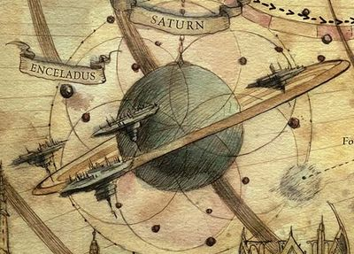

# 1002 土星 Saturn

精校状态：中文行文已逐段精校，部分术语仍为暂定

分类：地理 / 小行星

原文来源：https://www.bilibili.com/opus/1056644370953928711

原作者：帝国神选罐头

原文时间：2025年04月17日 10:39

[返回分类目录](目录.md) · [全书目录](../../目录.md)

<!-- A1002-B0001 图片 -->

<!-- A1002-B0002 -->

原译文

Planetary Image 行星图像

**校订译文**

Planetary Image 行星图像

<!-- /A1002-B0002 -->

<!-- A1002-B0003 -->
### Basic Data 基本资料

原题：Basic Data 基础信息

<!-- /A1002-B0003 -->

<!-- A1002-B0004 -->
**英文原文**

Name:Saturn

<!-- /A1002-B0004 -->

<!-- A1002-B0005 -->

原译文

名称：土星

**校订译文**

名称：土星

<!-- /A1002-B0005 -->

<!-- A1002-B0006 -->
**英文原文**

Segmentum:Segmentum Solar

<!-- /A1002-B0006 -->

<!-- A1002-B0007 -->

原译文

星域：太阳星域

**校订译文**

星域：太阳星域

<!-- /A1002-B0007 -->

<!-- A1002-B0008 -->
**英文原文**

Sector:Sector Solar

<!-- /A1002-B0008 -->

<!-- A1002-B0009 -->

原译文

星区：太阳星区

**校订译文**

星区：太阳星区

<!-- /A1002-B0009 -->

<!-- A1002-B0010 -->
**英文原文**

Subsector:Subsector Sol

<!-- /A1002-B0010 -->

<!-- A1002-B0011 -->

原译文

分区：太阳分区

**校订译文**

次星区：太阳次星区

<!-- /A1002-B0011 -->

<!-- A1002-B0012 -->
**英文原文**

System:Sol System

<!-- /A1002-B0012 -->

<!-- A1002-B0013 -->

原译文

星系：太阳系

**校订译文**

星系：太阳系

<!-- /A1002-B0013 -->

<!-- A1002-B0014 -->
**英文原文**

Affiliation:Imperium

<!-- /A1002-B0014 -->

<!-- A1002-B0015 -->

原译文

隶属：帝国

**校订译文**

隶属：帝国

<!-- /A1002-B0015 -->

<!-- A1002-B0016 -->
**英文原文**

Class:Inquisitorial Fortress

<!-- /A1002-B0016 -->

<!-- A1002-B0017 -->

原译文

类别：审判庭要塞

**校订译文**

类别：审判庭要塞

<!-- /A1002-B0017 -->

<!-- A1002-B0018 -->
**英文原文**

Saturn is a gas giant in the Sol System located within the Segmentum Solar. It is noteworthy for housing the headquarters of the Ordo Malleus of the Inquisition.

<!-- /A1002-B0018 -->

<!-- A1002-B0019 -->

原译文

土星是位于太阳星域内的太阳系中的一颗气态巨星。值得注意的是，这里是圣锤修会的总部所在地。

**校订译文**

土星是太阳星域内、太阳系中的一颗气态巨星，也是审判庭下属恶魔审判庭的总部所在地。

<!-- /A1002-B0019 -->

<!-- A1002-B0020 -->
## History 历史

<!-- /A1002-B0020 -->

<!-- A1002-B0021 -->
**英文原文**

During the Age of Strife, the rings and the moons served as the home of an advanced independent polity known as the Saturnyne Ordo, with its military arm being known as the Saturnine Fleet. After this period, the miniature empire based at Saturn encountered the fledgling Imperium of Man, which they saw as a brother empire. A treaty was signed with the Emperor that merged the two during the years leading to the Great Crusade. However, portions of the Saturn system were occupied by a rival faction, the so-called Ringers, who fought against and were conquered by the Imperium. Moreover, the Moons of the planet became occupied by cruel Xenos overlords which enslaved their human inhabitants. These moons would not be liberated until the planet fell to the Emperor during the Great Crusade.

<!-- /A1002-B0021 -->

<!-- A1002-B0022 -->

原译文

在纷争时代，土星环和卫星是一个先进的独立政体—土星邦国的家园，其军事部门被称为土星舰队。在此之后，以土星为基地的微型帝国遇到了羽翼未丰的人类帝国，他们将其视为兄弟帝国。在大远征之前的几年里，与帝皇签署了一项条约，将两者合并。然而，土星系统的一部分被一个敌对派系占领，即所谓的铃者，他们与帝国作战并被帝国征服。此外，这个星球的卫星被残酷的异型霸主占领，他们奴役了人类居民。直到大远征期间，这颗行星落入帝皇之手，这些卫星才被解放。

**校订译文**

纷争时代，土星环与各卫星上存在一个技术先进的独立政体，名为土星邦国，其武装力量称作土星舰队。此后，这个以土星为中心的小帝国遇见了初生的人类帝国，并将其视为兄弟之邦。在大远征开始前的数年间，土星邦国与帝皇签订条约，两者合并。然而，土星周边也有部分区域由敌对派系“环民”占据；他们与帝国交战，最终被征服。此外，一些卫星还落在残酷的异形霸主手中，当地人类遭到奴役。直到大远征期间土星归于帝皇统治，这些卫星才获得解放。

<!-- /A1002-B0022 -->

<!-- A1002-B0023 -->
**英文原文**

During the Horus Heresy period Saturn and its moons were classified as a quarantine zone under the exclusive control of Malcador and his agents. Any unregistered ship approaching Saturn was destroyed. These actions were all all part of Malcador's contingency plans for the fight against Chaos, and shortly before the Siege of Terra Saturn's moon of Titan was teleported into the Webway with Eldar technology in order to safeguard it. During the subsequent Solar War, Saturn was ravaged by the Night Lords who sent ships from Uranus full of dead civilians into its moons and habitation stations in order to sow terror and confusion.

<!-- /A1002-B0023 -->

<!-- A1002-B0024 -->

原译文

在荷鲁斯叛乱时期，土星及其卫星被列为马卡多及其代理人独家控制的隔离区。任何接近土星的未注册船只都被摧毁了。这些行动都是马卡多对抗混沌的应急计划的一部分，在泰拉围城之前不久，土星的卫星泰坦被灵族技术传送到网道，以保护它。在随后的太阳战争中，土星被午夜领主蹂躏，他们从天王星派遣满载平民的船只进入其卫星和居住站，以散布恐怖和混乱。

**校订译文**

荷鲁斯之乱期间，土星及其卫星被划为隔离区，由马卡多及其代理人独占管辖，任何未经登记的舰船接近都会遭到摧毁。这些措施属于马卡多为对抗混沌准备的后备计划。泰拉围城前不久，为确保安全，土卫六泰坦被利用灵族技术传送进网道。随后太阳系战争爆发，午夜领主蹂躏土星：他们从天王星送来满载平民尸体的舰船，驶入各卫星和居住站，制造恐慌与混乱。

**校注：** 恢复 dead civilians 的死亡限定，原译漏去尸体，改变午夜领主制造恐怖的手段。本篇称藏入Webway网道，第1003篇用Warp亚空间；分别保留来源表述，不擅抹平机制差异。

<!-- /A1002-B0024 -->

<!-- A1002-B0025 -->
**英文原文**

By M32, Saturn had become home to the secretive Ordo Malleus and Grey Knights. The world and its moons were restricted and only a select few were allowed anywhere near its orbit. Unlike the other worlds of the Sol System, it had no orbital colonies and was not heavily developed. Any unidentified vessel nearing Saturn is promptly destroyed by its sophisticated orbital defenses.

<!-- /A1002-B0025 -->

<!-- A1002-B0026 -->

原译文

到M32，土星已经成为神秘的圣锤修会和灰骑士的家园世界。世界及其卫星受到限制，只有少数几个被允许靠近其轨道。与太阳系的其他世界不同，它没有轨道殖民地，也没有高度发达。任何接近土星的不明飞船都会被其复杂的轨道防御系统迅速摧毁。

**校订译文**

到第三十二个千年，土星已成为隐秘的恶魔审判庭与灰骑士的驻地。土星及其卫星受到严密封锁，只有极少数获准者能够接近相关轨道。与太阳系其他世界不同，土星没有轨道殖民地，也未经过大规模开发。任何身份不明的舰船接近，都会立即被先进的轨道防御系统摧毁。

<!-- /A1002-B0026 -->

<!-- A1002-B0027 -->
## Geography 地理

<!-- /A1002-B0027 -->

<!-- A1002-B0028 -->
### Moons 卫星

<!-- /A1002-B0028 -->

<!-- A1002-B0029 -->
**英文原文**

Mimas: The closest major moon, with its surface suffering from an immense impact scar covering a quarter of the surface. This crater houses the Inquisitorial prison complex which contains the worst criminals hunted down by the Inquisition, who are kept in isolated cells with psychic wards woven into the walls and guarded by gun-Servitors and an Inquisitorial Stormtrooper regiment.

<!-- /A1002-B0029 -->

<!-- A1002-B0030 -->

原译文

土卫一（弥玛斯）：最接近的主要卫星，其表面有四分之一的巨大撞击痕迹。这个弹坑是审判庭监狱群的所在地，里面关押着审判庭追捕到的最恶劣的罪犯，他们被关在隔离的牢房里，墙上有灵能遮蔽，由枪炮机仆和审判庭风暴兵守卫。

**校订译文**

土卫一（弥玛斯）：距离土星最近的主要卫星，地表有一道占据约四分之一面积的巨大撞击疤痕。坑内设有审判庭监狱群，关押着审判庭缉获的最危险罪犯。囚犯分别单独监禁，牢房墙壁布有灵能防护，由枪炮机仆和一个团的审判庭风暴兵看守。

**校注：** 原文明确一个 regiment，补回整团风暴兵的兵力信息。

<!-- /A1002-B0030 -->

<!-- A1002-B0031 -->
**英文原文**

Enceladus: The next moon, which houses a citadel of the Inquisition and is a vast palace from which Lord Inquisitors of the Ordo Malleus hold court, and also where many of these Lords maintain their personal estates. The primary citadel used by the Inquisition is known as the Encaladus Fortress. In the libraries of the Encaladus Fortress, there are countless volumes of forbidden lore on the subject of Chaos. The Encaladus Fortress also incorporates the Admiralty Spire, where the empire of Saturn's rulers signed their treaty with the Emperor. The Moon is the base of the Sisters of Battle Order known as the Order of the Shattered Glass.

<!-- /A1002-B0031 -->

<!-- A1002-B0032 -->

原译文

土卫二（恩克拉多斯）：下一个卫星，它是一座审判庭的城堡，是一座巨大的宫殿，圣锤修会的领主审判官们在这里举行会议，也是许多这些领主维护个人财产的地方。审判庭使用的主要城堡被称为恩克拉多斯要塞。在恩克拉多斯要塞的图书馆里，有无数关于混沌主题的禁书。恩克拉多斯堡垒还包括海军部尖塔，土星统治者的帝国在那里与帝皇签署了条约。卫星是被称为破碎琉璃修会的战斗修女修会的基地。

**校订译文**

土卫二（恩克拉多斯）：由内向外的下一颗主要卫星，设有审判庭的宏伟宫堡。恶魔审判庭的审判官领主在此处理事务，许多人也在这里拥有私人庄园。其中最主要的建筑称为恩克拉多斯要塞，其图书馆收藏无数有关混沌的禁忌典籍。要塞还包括海军部尖塔，土星邦国的统治者曾在此与帝皇签订条约。这颗卫星也是战斗修女破碎琉璃修会的基地。

<!-- /A1002-B0032 -->

<!-- A1002-B0033 -->
**英文原文**

Tethys (Death World): The site of the hidden archive of the Librarium Daemonicum, access to which is restricted to Lord Inquisitors. Tethys is home to a number of Daemons trapped on its surface. One of the set trials for all aspiring Paladins of the Grey Knights is to survive on its surface without their armour.

<!-- /A1002-B0033 -->

<!-- A1002-B0034 -->

原译文

土卫三（泰西斯）（死亡世界）：恶魔图书馆的隐藏档案馆所在地，只有领主审判官才能访问。土卫三是许多被困在其表面的恶魔的家园。对于所有有抱负的灰骑士圣骑士来说，一个既定的考验是在没有盔甲的情况下在其表面生存。

**校订译文**

土卫三（忒提斯，死亡世界）：恶魔图书馆的秘密档案库所在地，只有审判官领主获准进入。许多恶魔被困在这颗卫星地表。所有希望晋升灰骑士圣骑士的候选者，都必须通过一项考验：不穿护甲，在这里生存。

**校注：** 土星卫星Tethys沿忒提斯，区别吞世者人物特提斯。此处Librarium Daemonicum位于土卫三，第1003篇Librarium Daemonica列在泰坦；不因拉丁语相近而擅合并设施。

<!-- /A1002-B0034 -->

<!-- A1002-B0035 -->
**英文原文**

Titan: The largest moon and the home of the Grey Knights Chapter's Fortress-Monastery, which covers a large portion of the surface.

<!-- /A1002-B0035 -->

<!-- A1002-B0036 -->

原译文

土卫六（泰坦）：最大的卫星，也是灰骑士战团要塞修道院的所在地，该修道院覆盖了大部分地表。

**校订译文**

土卫六（泰坦）：最大的卫星，也是灰骑士战团要塞修道院的所在地，该修道院覆盖了大部分地表。

<!-- /A1002-B0036 -->

<!-- A1002-B0037 -->
**英文原文**

Deimos — Former moon of Mars which has since been put into Titan's orbit. It serves as a Forge World for the Ordo Malleus.

<!-- /A1002-B0037 -->

<!-- A1002-B0038 -->

原译文

火卫二（迪莫斯）—火星的前卫星，此后被送入土卫六的轨道。它是圣锤修会的锻造世界。

**校订译文**

迪莫斯：原为火星的卫星，后来被移入环绕土卫六的轨道，成为为恶魔审判庭服务的铸造世界。

<!-- /A1002-B0038 -->

<!-- A1002-B0039 -->
**英文原文**

Iapetus: The furthermost major moon, home to a Naval Fortress and dock that serves the strike fleets of the Grey Knights, along with the battleships requisitioned from Battlefleet Solar. As it is under Inquisitorial command, it serves as the only reliable means of getting into and out of the rings of Saturn. Iapetus was a stronghold of the Ringers in pre-Imperial times.

<!-- /A1002-B0039 -->

<!-- A1002-B0040 -->

原译文

土卫八（伊阿珀托斯）：最远的主要卫星，拥有一个海军要塞和码头，为灰骑士的打击舰队以及从太阳舰队征用的战舰服务。由于它受审判庭的指挥，它是进出土星环的唯一可靠手段。在帝国时代之前，土卫八是铃者的要塞。

**校订译文**

土卫八（伊阿珀托斯）：距离土星最远的主要卫星，设有海军要塞与船坞，为灰骑士打击舰队及从太阳战斗舰队征用的战列舰提供服务。由于此处由审判庭掌控，它成为进出土星环唯一可靠的通道。帝国建立之前，这里曾是环民的据点。

**校注：** battleships 为战列舰，Battlefleet Solar 为太阳战斗舰队；不是泛称船只。

<!-- /A1002-B0040 -->

<!-- A1002-B0041 -->
**英文原文**

Hyperion: Known for its low gravity, denizens of this moon are tall and have brittle bones outside of their natural home.

<!-- /A1002-B0041 -->

<!-- A1002-B0042 -->

原译文

土卫七（许珀里翁）：以其低重力而闻名，这颗卫星的居民都很高，在他们的自然家园之外有脆弱的骨骼。

**校订译文**

土卫七（许珀里翁）：以低重力著称。当地居民身材高大，但离开家园后，骨骼显得格外脆弱。

<!-- /A1002-B0042 -->

本篇核心术语与暂定项

以下列出本篇出现的英文原形及核心术语表用词。同形词可能指不同对象，具体词义以本篇正文和校注为准；单复数、别名和仅见于图注的名称可能尚未列入。完整候选见[术语表](../../术语表/双语术语候选.csv)。

| 英文 | 采用中文 | 状态 |
| --- | --- | --- |
| Grey Knights | 灰骑士 | 官方已核对 |
| Eldar | 灵族 | 暂定·语境区分 |
| Horus Heresy | 荷鲁斯之乱 | 官方已核对 |
| Inquisition | 审判庭 | 暂定 |
| Imperium of Man | 人类帝国 | 官方已核对 |
| Imperium | 帝国 | 暂定·简称 |
| Webway | 网道 | 暂定 |
| Ordo Malleus | 恶魔审判庭 | 用户指定 |
| Emperor | 帝皇 | 官方已核对 |
| Forge World | 铸造世界 | 暂定·官方待核 |
| Night Lords | 午夜领主 | 暂定·官方待核 |
| The Order | 秩序 | 暂定·官方待核 |
| Great Crusade | 大远征 | 暂定·官方待核 |
| Age of Strife | 纷争时代 | 暂定·官方待核 |
| Terra | 泰拉 | 暂定·官方待核 |
| Horus | 荷鲁斯 | 暂定·官方待核 |
| Sisters of Battle | 战斗修女 | 暂定·官方待核 |
| Segmentum Solar | 太阳星域 | 暂定·官方待核 |
| Segmentum | 星域 | 暂定·官方待核 |
| Sector | 星区 | 暂定·官方待核 |
| Subsector | 次星区 | 暂定·官方待核 |
| Mars | 火星 | 暂定·官方待核 |
| Deimos | 迪莫斯 | 暂定·官方待核 |
| Titan | 泰坦 | 暂定·官方待核 |
| Librarium | 智库馆 | 暂定·官方待核 |
| Sol | 太阳系 | 暂定·官方待核 |
| Chapter | 战团 | 暂定·官方待核 |
| Fortress-monastery | 要塞修道院 | 暂定·官方待核 |
| Brother | 修士 | 暂定·官方待核 |
| Xenos | 异形 | 暂定·官方待核 |
| Hyperion | 许珀里翁 | 暂定·官方待核 |
| Gun | 甘 | 暂定·官方待核 |
| System | 星系（恒星系统） | 暂定·官方待核 |
| Death World | 死亡世界 | 暂定·官方待核 |
| Tethys | 忒提斯 | 暂定·官方待核 |
| Saturnine Fleet | 土星舰队 | 暂定·官方待核 |
| Ringers | 环民 | 暂定·官方待核 |
| Subsector Sol | 太阳次星区 | 暂定·官方待核 |
| Saturnyne Ordo | 土星邦国 | 暂定·官方待核 |
| Librarium Daemonicum | 恶魔图书馆 | 暂定·官方待核 |
| Encaladus Fortress | 恩克拉多斯要塞 | 暂定·官方待核 |
| Order of the Shattered Glass | 破碎琉璃修会 | 暂定·官方待核 |
| Saturn | 土星 | 暂定·官方待核 |
| Sector Solar | 太阳星区 | 暂定·官方待核 |
| Sol System | 太阳系 | 暂定·官方待核 |

