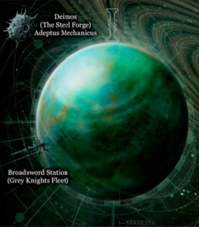
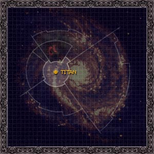

# 1003 土卫六 Titan

精校状态：中文行文已逐段精校，部分术语仍为暂定

分类：地理 / 小行星

原文来源：https://www.bilibili.com/opus/1062997937557078017

原作者：帝国神选罐头

原文时间：2025年05月04日 13:34

[返回分类目录](目录.md) · [全书目录](../../目录.md)

<!-- A1003-B0001 图片 -->

<!-- A1003-B0002 -->

原译文

Lunar Image 卫星图片

**校订译文**

Lunar Image 卫星图片

<!-- /A1003-B0002 -->

<!-- A1003-B0003 图片 -->

<!-- A1003-B0004 -->

原译文

Map 地图

**校订译文**

Map 地图

<!-- /A1003-B0004 -->

<!-- A1003-B0005 -->
### Basic Data 基本资料

原题：Basic Data 基础数据

<!-- /A1003-B0005 -->

<!-- A1003-B0006 -->
**英文原文**

Name:Titan

<!-- /A1003-B0006 -->

<!-- A1003-B0007 -->

原译文

名称：泰坦（土卫六）

**校订译文**

名称：泰坦（土卫六）

<!-- /A1003-B0007 -->

<!-- A1003-B0008 -->
**英文原文**

Segmentum:Segmentum Solar

<!-- /A1003-B0008 -->

<!-- A1003-B0009 -->

原译文

星域：太阳星域

**校订译文**

星域：太阳星域

<!-- /A1003-B0009 -->

<!-- A1003-B0010 -->
**英文原文**

Sector:Sector Solar

<!-- /A1003-B0010 -->

<!-- A1003-B0011 -->

原译文

星区：太阳星区

**校订译文**

星区：太阳星区

<!-- /A1003-B0011 -->

<!-- A1003-B0012 -->
**英文原文**

Subsector:Sol Subsector

<!-- /A1003-B0012 -->

<!-- A1003-B0013 -->

原译文

分区：太阳分区

**校订译文**

次星区：太阳次星区

<!-- /A1003-B0013 -->

<!-- A1003-B0014 -->
**英文原文**

System:Sol System

<!-- /A1003-B0014 -->

<!-- A1003-B0015 -->

原译文

星系：太阳系

**校订译文**

星系：太阳系

<!-- /A1003-B0015 -->

<!-- A1003-B0016 -->
**英文原文**

Primary:Saturn

<!-- /A1003-B0016 -->

<!-- A1003-B0017 -->

原译文

主星：土星

**校订译文**

主星：土星

<!-- /A1003-B0017 -->

<!-- A1003-B0018 -->
**英文原文**

Affiliation:Imperium

<!-- /A1003-B0018 -->

<!-- A1003-B0019 -->

原译文

隶属关系：帝国

**校订译文**

隶属关系：帝国

<!-- /A1003-B0019 -->

<!-- A1003-B0020 -->
**英文原文**

Class:Adeptus Astartes Homeworld，Inquisitorial Fortress

<!-- /A1003-B0020 -->

<!-- A1003-B0021 -->

原译文

类别：阿斯塔特家园世界，审判庭要塞

**校订译文**

类别：阿斯塔特修会家园世界、审判庭要塞

<!-- /A1003-B0021 -->

<!-- A1003-B0022 -->
**英文原文**

Tithe Grade:Aptus Non

<!-- /A1003-B0022 -->

<!-- A1003-B0023 -->

原译文

什一税等级：特级免税

**校订译文**

什一税等级：特级免税

<!-- /A1003-B0023 -->

<!-- A1003-B0024 -->
**英文原文**

Titan is a moon of Saturn, in the Sol System, located in Segmentum Solar. Titan contains the fortress-monastery of the Grey Knights, which is made entirely of basalt.

<!-- /A1003-B0024 -->

<!-- A1003-B0025 -->

原译文

土卫六是土星的一颗卫星，位于太阳星域的太阳系。泰坦包含灰骑士的堡垒修道院，完全由玄武岩制成。

**校订译文**

泰坦，即土卫六，是太阳星域内太阳系中土星的一颗卫星。灰骑士的要塞修道院坐落于此，建筑完全由玄武岩砌成。

<!-- /A1003-B0025 -->

<!-- A1003-B0026 -->
## History 历史

<!-- /A1003-B0026 -->

<!-- A1003-B0027 -->
**英文原文**

In pre-Imperial times, Titan was part of the Saturn polity which was defended by the Saturnine Fleet. Titan, along with the rest of Saturn and its moons, were eventually absorbed into the fledgling Imperium during the early Great Crusade.

<!-- /A1003-B0027 -->

<!-- A1003-B0028 -->

原译文

在帝国时代之前，泰坦是土星政体的一部分，由土星舰队保卫。在早期的大远征中，泰坦与土星的其他部分及其卫星最终被羽翼未丰的帝国吸收。

**校订译文**

帝国建立之前，泰坦属于土星邦国，由土星舰队守卫。大远征初期，它与土星及其余卫星一同并入初生的人类帝国。

<!-- /A1003-B0028 -->

<!-- A1003-B0029 -->
**英文原文**

Later under order of Malcador the Sigillite, ships and supplies were quietly siphoned off other projects and covertly sent to Titan under the code name Othrys. These shipments were discovered by Administratum Scribe-Adepta Second Classificate Katanoah Tallery when she was processing cargo shipping through the Riga Orbital Plate over Terra, and she believed that they represented a Horus-backed plot to undermine the Imperium via the Departmento Munitorum. An attempt to alert others to the discovery caused her to be hunted, but she was rescued by Nathaniel Garro who believed her story about a possible threat to the Imperium. He was aboard the plate searching for Saint Keeler, and Tallery's devotion to the Lectitio Divinitatus persuaded him to her honesty.

<!-- /A1003-B0029 -->

<!-- A1003-B0030 -->

原译文

后来，在掌印者马卡多的命令下，船只和补给被悄悄地从其他项目中抽走，并以代号奥西里斯秘密送往泰坦。这些货物是由内务部二级抄写修女卡塔诺亚·塔勒里在处理通过泰拉上空的里加轨道平台的货物运输时发现的，她认为这些货物代表了荷鲁斯支援的通过军务部破坏帝国的阴谋。试图提醒他人这一发现导致她被追捕，但她被纳撒尼尔·伽罗救了出来，伽罗相信了她关于帝国可能受到威胁的故事。他登上了寻找圣琪乐的平台，塔勒里对圣言录的虔诚使他相信了她的诚实。

**校订译文**

后来，掌印者马卡多下令从其他项目中暗中抽调舰船和补给，以“俄特律斯”为代号，秘密送往泰坦。内政部二级文士卡塔诺·塔勒里在处理经由泰拉上空里加轨道平台转运的货物时，发现这些异常运输。她以为这是荷鲁斯支持的一场阴谋，企图利用军务部破坏帝国。试图向他人示警后，她遭到追捕，却获纳撒尼尔·伽罗相救。伽罗当时正在平台上寻找圣琪乐；塔勒里虔信《圣言录》，使他相信她没有说谎，也相信帝国可能面临威胁。

**校注：** Othrys是俄特律斯，不是Osiris奥西里斯；与697同一工程。Scribe-Adepta不是战斗修女身份，按文士职级译。

<!-- /A1003-B0030 -->

<!-- A1003-B0031 -->
**英文原文**

After slipping aboard a derelict ship sent to be used as material to build a fortress monastery on Titan, they managed to navigate through various construction sites as they discovered esoteric weapons being shipped in and the arrival of the Mertiol wounded arriving. They managed to fight their way to the top of the newly constructed fortress only to find Malcador awaiting them. Upon discovery, Malcador revealed that it was not a traitorous plot but one that would ensure humanity would be able to fight the growing threat of Chaos after the Horus Heresy came to an end. However, Tallery could not live with the knowledge, and Malcador ordered Garro to execute her. Garro rebelled against the order, and Malcador relented, taking Tallery into confidence and putting her to use in completing the facility as Curator-Adepta Primus.

<!-- /A1003-B0031 -->

<!-- A1003-B0032 -->

原译文

在登上一艘被用来在泰坦上建造堡垒修道院的废弃船只后，他们设法在各种建筑工地上穿行，因为他们发现了运送进来的机密武器和抵达的梅尔蒂奥尔伤员。他们设法登上了新建堡垒的顶端，却发现马卡多在等着他们。发现后，马卡多透露，这不是一个叛国阴谋，而是一个确保人类能够在荷鲁斯叛乱结束后对抗日益增长的混沌威胁的密谋。然而，塔勒里无法忍受这种知识，马卡多尔命令伽罗处决她。伽罗反抗了这一命令，马卡多让步了，将塔勒里交给了他，并让她作为主要策划修女来完成这一设施。

**校订译文**

两人潜入一艘废弃舰船，随船前往泰坦；该舰将被拆作建造要塞修道院的材料。他们穿过多处工地，发现秘仪武器运入，以及来自默蒂奥的伤员抵达。一路战至新建要塞顶端后，等待他们的却是马卡多。掌印者解释，这不是叛徒阴谋，而是一项确保人类在荷鲁斯之乱后仍能对抗混沌威胁的秘密计划。然而，塔勒里知道得太多，不能被允许活着离开，马卡多便命令伽罗处决她。伽罗抗命，马卡多最终让步，将塔勒里纳入知情者行列，任命她为首席策建官，协助完成设施。

**校注：** could not live with the knowledge 指不容知情者存活，不是精神上无法忍受知识。taking into confidence 指纳入秘密，不是交给伽罗。

<!-- /A1003-B0032 -->

<!-- A1003-B0033 -->
**英文原文**

Shortly before the Siege of Terra Titan and the remaining Knights-Errant, through Malcador's mystical means, was hidden away from the traitorous Warmaster Horus. When Titan eventually returned after the Heresy, the Citadel of Titan had been constructed along with the creation of the 666th Space Marine Chapter, the Grey Knights. Whilst in the Warp, time had passed at a greater rate for Titan and so it had emerged not with the original eight Space Marines and their raw recruits, but with a full Chapter of one thousand fully trained Battle-Brothers.

<!-- /A1003-B0033 -->

<!-- A1003-B0034 -->

原译文

泰坦在泰拉围城之前不久，剩下的游侠骑士通过马卡多的神秘手段，隐藏在叛徒战帅荷鲁斯之外。当泰坦最终在叛乱之后返回时，泰坦城堡已经随着第666星际战士战团的建立而建造，即灰骑士。在亚空间中，泰坦的时间以更快的速度流逝，因此它不是与最初的八名星际战士及其新兵一起出现的，而是与一千名训练有素的战斗兄弟组成的完整战团一起出现的。

**校订译文**

泰拉围城前不久，马卡多以神秘手段将泰坦与剩余的游侠骑士一同藏匿，使其避开叛徒战帅荷鲁斯的耳目。荷鲁斯之乱结束后，泰坦重新现身，此时泰坦城堡已建成，第666个星际战士战团——灰骑士——也已建立。藏身亚空间期间，泰坦上的时间流逝更快。因此，重返现实时，当地已经不只是最初八名星际战士与一批未经训练的新兵，而是一整个由千名训练有素的战斗兄弟组成的战团。

**校注：** 英文此处说藏身Warp，第1002篇则称传送进Webway，照各自记载保留。复现后是完整战团，不是仍只有八名创始人及新兵。

<!-- /A1003-B0034 -->

<!-- A1003-B0035 -->
## Geography 地理

<!-- /A1003-B0035 -->

<!-- A1003-B0036 -->
**英文原文**

Under the surface of Titan lies a cool, damp crypt. It is here that every Grey Knight wishes to finally reside, in the hallowed halls of the glorious dead. Almost every member of the chapter will have their body recovered and brought to this crypt beneath the Emperor's Temple. As a final tribute to those that have given their lives, the names of the dead are carved ceremoniously into a great basalt wall in the heart of the fortress. Among these names are some of the Imperium's greatest heroes who died in the most heroic circumstances imaginable. And like all other matters in regard to Grey Knights, they will remain almost completely unknown.

<!-- /A1003-B0036 -->

<!-- A1003-B0037 -->

原译文

泰坦表面下有一个凉爽潮湿的地穴。正是在这里，每个灰骑士都希望最终居住在光荣之死的神圣大厅里。几乎每一位成员的尸体都会被找到，并被带到帝皇圣殿下的这个地穴。作为对那些献出生命的人的最后致敬，死者的名字被庄严地雕刻在堡垒中心的一堵巨大的玄武岩墙上。在这些名字中，有一些帝国最伟大的英雄，他们在可以想象的最英勇的情况下牺牲。就像所有其他关于灰骑士的事情一样，他们将几乎完全不为人知。

**校订译文**

泰坦地表之下，有一座阴凉潮湿的地下墓穴。每一位灰骑士都希望最终长眠于此，与光荣战死者一同安息于神圣厅堂。几乎每位牺牲者的遗体都会被寻回，送入帝皇圣殿下方的墓穴。为向献出生命的战士致上最后敬意，人们会举行仪式，将其姓名刻入要塞中心一面巨大的玄武岩墙。其中有些是帝国最伟大的英雄，曾以无比英勇的方式牺牲；然而，正如灰骑士的一切，他们的事迹也几乎完全不为世人所知。

<!-- /A1003-B0037 -->

<!-- A1003-B0038 -->
**英文原文**

The defences of Titan consist of a vast array of defence fleets, interceptors, and ground-based weaponry. It is said that only Terra, Mars, and Cadia sported more formidable defenses.

<!-- /A1003-B0038 -->

<!-- A1003-B0039 -->

原译文

泰坦的防御系统由大量的防御舰队、拦截机和地面武器组成。据说只有泰拉、火星和卡迪亚拥有更强大的防御能力。

**校订译文**

泰坦的防御系统由大量的防御舰队、拦截机和地面武器组成。据说只有泰拉、火星和卡迪亚拥有更强大的防御能力。

<!-- /A1003-B0039 -->

<!-- A1003-B0040 -->
### Locations 地点

<!-- /A1003-B0040 -->

<!-- A1003-B0041 -->
**英文原文**

Archivum Titanis — Volumes of battlefield reports conducted by Grey Knights are stored within the shelves of the Archivum.

<!-- /A1003-B0041 -->

<!-- A1003-B0042 -->

原译文

泰坦档案馆 — 灰骑士进行的大量战场报告存储在档案馆的架子上。

**校订译文**

泰坦档案馆：馆内书架保存着灰骑士提交的大量战场报告。

<!-- /A1003-B0042 -->

<!-- A1003-B0043 -->
**英文原文**

Cloister of Sorrows — This is a chamber that is open to the night sky of Titan. It's atmosphere is contained in an electromagnetic shield which allows a Grey Knight to be alone with their thoughts as they gaze into the stars.

<!-- /A1003-B0043 -->

<!-- A1003-B0044 -->

原译文

悲伤回廊 — 这是一个向泰坦夜空开放的房间。它的大气层包含在一个电磁屏蔽中，这使得灰骑士在凝视星星时可以独自思考。

**校订译文**

悲伤回廊：一间朝向泰坦夜空敞开的厅室。电磁护盾将室内空气留住，使灰骑士可以独自凝望群星，沉思冥想。

<!-- /A1003-B0044 -->

<!-- A1003-B0045 -->
**英文原文**

Fallen Dagger Hall — A gathering hall named after Grand Master Kolgano who challenged the Grey Knights under his command to an unarmoured dagger duel with the winner getting his jewel-encrusted Terminator armour. It serves as a place for close combat training for new recruits, drills and sometimes for meetings with the Ordo Malleus.

<!-- /A1003-B0045 -->

<!-- A1003-B0046 -->

原译文

落匕大厅 — 一个以科尔加诺大导师命名的聚会大厅，科尔加诺大导师挑战了他指挥下的灰骑士，进行了一场无甲匕首决斗，获胜者获得了镶有珠宝的终结者盔甲。它是新兵近战训练、演习的场所，有时也是与圣锤修会会面的场所。

**校订译文**

落匕大厅：为纪念大导师科尔加诺的一项挑战而得名的集会厅。他曾向麾下灰骑士发起不着护甲的匕首决斗挑战，许诺将自己镶满宝石的终结者护甲赠予胜者。这里用于新兵近战训练和操练，有时也用来会见恶魔审判庭成员。

**校注：** 大厅名称由科尔加诺的匕首挑战典故而来，原文named after的简写不宜译成大厅直接叫科尔加诺。

<!-- /A1003-B0046 -->

<!-- A1003-B0047 -->
**英文原文**

Mandulian Chapel — This is a long gallery named after Grand Master Mandulis who died a thousand years ago. It is filled with a high ceiling along with thick columns of statues of Imperial heroes said to represent the different organisations that kept the Imperium together. At the end is a huge three panelled altar and at the front of the chapel is an ornate statue of Mandulis.

<!-- /A1003-B0047 -->

<!-- A1003-B0048 -->

原译文

曼杜利斯教堂 — 这是一个以千年前牺牲的曼杜利斯大导师命名的长廊。它有一个高高的天花板，还有厚厚的帝国英雄雕像柱，据说代表了将帝国团结在一起的不同组织。最后是一个巨大的三镶板祭坛，教堂的前面是一座华丽的曼杜利斯雕像。

**校订译文**

曼杜利斯教堂：以千年前牺牲的大导师曼杜利斯命名的一座长廊。廊顶高耸，粗大的柱体上布置着帝国英雄雕像，据说象征维系帝国的各个组织。尽头是一座巨大的三联祭坛，教堂前方则立着装饰华美的曼杜利斯雕像。

<!-- /A1003-B0048 -->

<!-- A1003-B0049 -->
**英文原文**

The Citadel of Titan — This is the Fortress Monastery of the Grey Knights. It nests on the Shadow of Mount Anarch which juts from the ice sheets and oceans of liquid methane like a jagged black spire. The caverns beneath Mount Anarch are said to be haunted, and Paladin aspirants must spend time in them without losing their sanity.

<!-- /A1003-B0049 -->

<!-- A1003-B0050 -->

原译文

泰坦城堡——这是灰骑士堡垒修道院。它栖息在叛逆之峰的阴影中，叛逆之峰像锯齿状的黑色尖顶一样从冰盖和液态甲烷海洋中伸出。据说叛逆之峰下的洞穴闹鬼，圣骑士有志者必须在其中度过一段时间，而不失去理智。

**校订译文**

泰坦城堡：灰骑士的要塞修道院，坐落在叛逆之峰的阴影中。这座山峰如参差的黑色尖塔，从冰原与液态甲烷海洋间耸起。据说山下洞穴中有幽魂徘徊，圣骑士候选者必须在其中停留一段时间，并保持理智。

<!-- /A1003-B0050 -->

<!-- A1003-B0051 -->

原译文

Chamber of Trials 审判大厅

**校订译文**

Chamber of Trials 试炼厅

<!-- /A1003-B0051 -->

<!-- A1003-B0052 -->

原译文

Augurium 占卜台

**校订译文**

Augurium 占卜殿

<!-- /A1003-B0052 -->

<!-- A1003-B0053 -->

原译文

Chamber of Heroes 英雄大厅

**校订译文**

Chamber of Heroes 英雄大厅

<!-- /A1003-B0053 -->

<!-- A1003-B0054 -->

原译文

Chamber of Purity 纯洁大厅

**校订译文**

Chamber of Purity 纯洁圣堂

<!-- /A1003-B0054 -->

<!-- A1003-B0055 -->

原译文

Hall of Champions 冠军大厅

**校订译文**

Hall of Champions 冠军大厅

<!-- /A1003-B0055 -->

<!-- A1003-B0056 -->

原译文

Sanctum Sanctorum 至圣所

**校订译文**

Sanctum Sanctorum 至圣所

<!-- /A1003-B0056 -->

<!-- A1003-B0057 -->

原译文

Librarium Daemonica 恶魔图书馆

**校订译文**

Librarium Daemonica 恶魔图书馆

<!-- /A1003-B0057 -->

<!-- A1003-B0058 -->

原译文

Warp Nexus 亚空间枢纽

**校订译文**

Warp Nexus 亚空间枢纽

<!-- /A1003-B0058 -->

<!-- A1003-B0059 -->
**英文原文**

Dead Fields — These catacombs serve as the final resting place of fallen Grey Knights. Each chamber contains the dead of an entire century. Individual tombs are marked by a plaque and a statue of the interred Grey Knight\[5a\]. Within the Dead Fields, lies the Tomb of the Eight. The Tomb of Eight is the resting place of the first eight Grand Masters.

<!-- /A1003-B0059 -->

<!-- A1003-B0060 -->

原译文

亡者之地 — 这些地下墓穴是倒下的灰骑士的最后安息之地。每个房间都有整整一个世纪的牺牲者。个别坟墓上有一块牌匾和一尊埋葬的灰骑士的雕像。在亡者之地里，躺着八人之墓。八人之墓是第一批八位大导师的安息之地。

**校订译文**

亡者之地：安葬灰骑士阵亡者的地下墓穴，每个墓室容纳一个世纪的死者。各座墓穴以铭牌和墓主雕像标示身份。八人之墓亦位于其中，是最初八位大导师的安息之所。

<!-- /A1003-B0060 -->

<!-- A1003-B0061 -->
**英文原文**

Apex Cronus Bastion — A gigantic space station orbiting the planet, it is the size of a small moon. It is one of the most formidable starforts in the Imperium, surpassing even The Phalanx in firepower.

<!-- /A1003-B0061 -->

<!-- A1003-B0062 -->

原译文

顶点克洛诺斯堡垒 — 一个围绕地球运行的巨大空间站，其大小与一个小卫星相当。它是帝国中最强大的星堡之一，火力甚至超过了山阵号。

**校订译文**

顶点克洛诺斯堡垒：环绕泰坦运行的巨大空间站，体积堪比一颗小型卫星。它是帝国最强大的星堡之一，火力甚至超过山阵号。

**校注：** planet在此回指泰坦，原译“地球”误认地点；前文明确泰坦是卫星，译文按已知指代写泰坦。

<!-- /A1003-B0062 -->

<!-- A1003-B0063 -->
**英文原文**

Broadsword Station — An orbital station that serves as headquarters for the Grey Knights fleet

<!-- /A1003-B0063 -->

<!-- A1003-B0064 -->

原译文

阔剑空间站 — 作为灰骑士舰队总部的轨道空间站

**校订译文**

阔剑空间站 — 作为灰骑士舰队总部的轨道空间站

<!-- /A1003-B0064 -->

<!-- A1003-B0065 -->
**英文原文**

Deimos — Forge World that supplies the Grey Knights and Ordo Malleus. Hangs in orbit over Titan.

<!-- /A1003-B0065 -->

<!-- A1003-B0066 -->

原译文

火卫二 — 为灰骑士和圣锤修会提供补给的铸造世界。悬挂在土卫六的轨道上。

**校订译文**

迪莫斯：环绕泰坦运行的铸造世界，为灰骑士与恶魔审判庭提供补给。

<!-- /A1003-B0066 -->

<!-- A1003-B0067 -->

原译文

Deimos Clock 火卫二时钟

**校订译文**

Deimos Clock 迪莫斯时钟

<!-- /A1003-B0067 -->

<!-- A1003-B0068 -->
**英文原文**

According to the Purifiers, something ancient and powerful slumbers beneath the surface of Titan.

<!-- /A1003-B0068 -->

<!-- A1003-B0069 -->

原译文

根据净化者的说法，泰坦表面下沉睡着某种古老而强大的东西。

**校订译文**

根据净化者的说法，泰坦表面下沉睡着某种古老而强大的东西。

<!-- /A1003-B0069 -->

本篇核心术语与暂定项

以下列出本篇出现的英文原形及核心术语表用词。同形词可能指不同对象，具体词义以本篇正文和校注为准；单复数、别名和仅见于图注的名称可能尚未列入。完整候选见[术语表](../../术语表/双语术语候选.csv)。

| 英文 | 采用中文 | 状态 |
| --- | --- | --- |
| Space Marines | 星际战士 | 官方已核对 |
| Adeptus Astartes | 阿斯塔特修会 | 官方已核对 |
| Grey Knights | 灰骑士 | 官方已核对 |
| Terminator | 终结者 | 官方已核对 |
| Horus Heresy | 荷鲁斯之乱 | 官方已核对 |
| Warp | 亚空间 | 官方已核对 |
| Imperium | 帝国 | 暂定·简称 |
| Administratum | 内政部 | 暂定 |
| Ordo Malleus | 恶魔审判庭 | 用户指定 |
| Phalanx | 山阵号 | 暂定 |
| Emperor | 帝皇 | 官方已核对 |
| Departmento Munitorum | 军务部 | 暂定 |
| Forge World | 铸造世界 | 暂定·官方待核 |
| The Order | 秩序 | 暂定·官方待核 |
| Great Crusade | 大远征 | 暂定·官方待核 |
| Terra | 泰拉 | 暂定·官方待核 |
| Horus | 荷鲁斯 | 暂定·官方待核 |
| Segmentum Solar | 太阳星域 | 暂定·官方待核 |
| Segmentum | 星域 | 暂定·官方待核 |
| Sector | 星区 | 暂定·官方待核 |
| Subsector | 次星区 | 暂定·官方待核 |
| Malcador the Sigillite | 掌印者马卡多 | 暂定·官方待核 |
| Mars | 火星 | 暂定·官方待核 |
| Deimos | 迪莫斯 | 暂定·官方待核 |
| Cadia | 卡迪亚 | 暂定·官方待核 |
| Titan | 泰坦 | 暂定·官方待核 |
| Lectitio Divinitatus | 神性论 | 暂定·官方待核 |
| Aptus Non | 特级免税 | 暂定·官方待核 |
| Master | 导师（审判庭职衔）／舰务官（舰员职务） | 语境定译·官方待核 |
| Ancient | 旗手 | 官方已核对 |
| The Sigillite | 掌印者 | 暂定·官方待核 |
| Knights-Errant | 游侠骑士 | 暂定·官方待核 |
| Sol | 太阳系 | 暂定·官方待核 |
| The Phalanx | 山阵号 | 暂定·官方待核 |
| Nathaniel Garro | 纳撒尼尔·伽罗 | 暂定·官方待核 |
| Space Marine | 星际战士 | 暂定·官方待核 |
| Chapter | 战团 | 暂定·官方待核 |
| Fortress-monastery | 要塞修道院 | 暂定·官方待核 |
| Interceptors | 拦截者 | 暂定·官方待核 |
| Primus | 领军 | 官方已核对 |
| Grand Master | 大导师 | 暂定·官方待核 |
| Mandulis | 曼杜利斯 | 暂定·官方待核 |
| System | 星系（恒星系统） | 暂定·官方待核 |
| Saturnine Fleet | 土星舰队 | 暂定·官方待核 |
| Curator-Adepta Primus | 首席策建官 | 暂定·官方待核 |
| Othrys | 俄特律斯 | 暂定·官方待核 |
| Katanoah Tallery | 卡塔诺·塔勒里 | 暂定·官方待核 |
| Scribe-Adepta Second Classificate | 二级文士 | 暂定·官方待核 |
| Mertiol | 默蒂奥 | 暂定·官方待核 |
| Archivum Titanis | 泰坦档案馆 | 暂定·官方待核 |
| Cloister of Sorrows | 悲伤回廊 | 暂定·官方待核 |
| Fallen Dagger Hall | 落匕大厅 | 暂定·官方待核 |
| Mandulian Chapel | 曼杜利斯教堂 | 暂定·官方待核 |
| Mount Anarch | 叛逆之峰 | 暂定·官方待核 |
| Dead Fields | 亡者之地 | 暂定·官方待核 |
| Apex Cronus Bastion | 顶点克洛诺斯堡垒 | 暂定·官方待核 |
| Broadsword Station | 阔剑空间站 | 暂定·官方待核 |
| Terminator Armour | 终结者盔甲 | 暂定·官方待核 |
| Saturn | 土星 | 暂定·官方待核 |
| Sector Solar | 太阳星区 | 暂定·官方待核 |
| Sol System | 太阳系 | 暂定·官方待核 |

