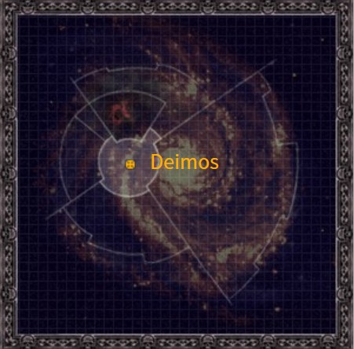
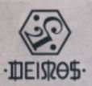
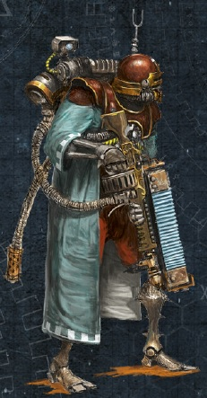

# 1004 火卫二 Deimos

精校状态：中文行文已逐段精校，部分术语仍为暂定

分类：地理 / 小行星

原文来源：https://www.bilibili.com/opus/1160884167866581014

原作者：帝国神选罐头

原文时间：2026年01月23日 08:23

[返回分类目录](目录.md) · [全书目录](../../目录.md)

<!-- A1004-B0001 图片 -->

<!-- A1004-B0002 -->

原译文

Map 地图

**校订译文**

Map 地图

<!-- /A1004-B0002 -->

<!-- A1004-B0003 -->
### Basic Data 基本资料

原题：Basic Data 基础数据

<!-- /A1004-B0003 -->

<!-- A1004-B0004 -->
**英文原文**

Name:Deimos

<!-- /A1004-B0004 -->

<!-- A1004-B0005 -->

原译文

名称：迪莫斯

**校订译文**

名称：迪莫斯

<!-- /A1004-B0005 -->

<!-- A1004-B0006 -->
**英文原文**

Segmentum:Segmentum Solar

<!-- /A1004-B0006 -->

<!-- A1004-B0007 -->

原译文

星域：太阳星域

**校订译文**

星域：太阳星域

<!-- /A1004-B0007 -->

<!-- A1004-B0008 -->
**英文原文**

Sector:Sector Solar

<!-- /A1004-B0008 -->

<!-- A1004-B0009 -->

原译文

星区：太阳星区

**校订译文**

星区：太阳星区

<!-- /A1004-B0009 -->

<!-- A1004-B0010 -->
**英文原文**

Subsector:Sub-Sector Solar

<!-- /A1004-B0010 -->

<!-- A1004-B0011 -->

原译文

分区：太阳分区

**校订译文**

次星区：太阳次星区

<!-- /A1004-B0011 -->

<!-- A1004-B0012 -->
**英文原文**

System:Sol System

<!-- /A1004-B0012 -->

<!-- A1004-B0013 -->

原译文

星系：太阳星系

**校订译文**

星系：太阳系

<!-- /A1004-B0013 -->

<!-- A1004-B0014 -->
**英文原文**

Primary:Titan (itself a moon of Saturn)

<!-- /A1004-B0014 -->

<!-- A1004-B0015 -->

原译文

主星：泰坦（它本身就是土星的卫星）

**校订译文**

主星：泰坦（它本身就是土星的卫星）

<!-- /A1004-B0015 -->

<!-- A1004-B0016 -->
**英文原文**

Affiliation:Imperium

<!-- /A1004-B0016 -->

<!-- A1004-B0017 -->

原译文

隶属：帝国

**校订译文**

隶属：帝国

<!-- /A1004-B0017 -->

<!-- A1004-B0018 -->
**英文原文**

Class:Forge World

<!-- /A1004-B0018 -->

<!-- A1004-B0019 -->

原译文

类别：铸造世界

**校订译文**

类别：铸造世界

<!-- /A1004-B0019 -->

<!-- A1004-B0020 -->
**英文原文**

Tithe Grade:Aptus Non

<!-- /A1004-B0020 -->

<!-- A1004-B0021 -->

原译文

什一税等级：特级免税

**校订译文**

什一税等级：特级免税

<!-- /A1004-B0021 -->

<!-- A1004-B0022 -->
**英文原文**

Deimos is a moon originally of the planet Mars that serves as a Forge World to the Ordo Malleus.

<!-- /A1004-B0022 -->

<!-- A1004-B0023 -->

原译文

火卫二最初是火星的一颗卫星，它是圣锤修会的锻造世界。

**校订译文**

迪莫斯原是火星的一颗卫星，如今是为恶魔审判庭服务的铸造世界。

**校注：**  Deimos本稿统一迪莫斯，火卫二作为其原火星卫星名称仅保留于原译与校注。

<!-- /A1004-B0023 -->

<!-- A1004-B0024 图片 -->

<!-- A1004-B0025 -->

原译文

The Icon of Deimos 火卫二标志

**校订译文**

The Icon of Deimos 迪莫斯标志

<!-- /A1004-B0025 -->

<!-- A1004-B0026 -->
## Overview 概述

<!-- /A1004-B0026 -->

<!-- A1004-B0027 -->
**英文原文**

When Malcador the Sigillite created the Grey Knights Chapter during the Horus Heresy, the moon of Deimos was displaced from its orbit and relocated to the orbit about Titan by way of hidden, arcane technologies.

<!-- /A1004-B0027 -->

<!-- A1004-B0028 -->

原译文

当掌印者马卡多在荷鲁斯叛乱期间创建了灰骑士战团时，卫星迪莫斯被从其轨道上移位，并通过隐藏的神秘技术重新定位到泰坦周围的轨道上。

**校订译文**

荷鲁斯之乱期间，掌印者马卡多创建灰骑士战团时，借助隐秘而玄奥的技术，将迪莫斯移出原有轨道，转移到环绕泰坦的轨道上。

<!-- /A1004-B0028 -->

<!-- A1004-B0029 -->
**英文原文**

This moon provides the Grey Knights with the majority of their ammunition, armour and equipment which ranges from psycannons to Land Raider components to starship ordnance within the Forge World's subterranean halls. Furthermore, Deimos holds the STC imprints for the entire canon of Adeptus Mechanicus lore and other weapons that are yet to be dreamed up. Only the more unique weapons such as Nemesis Force Weapons are not made on Deimos, instead they are crafted by the Chapter's Techmarines at their Fortress Monastery. The transfer of Deimos-produced equipment is primarily done through dull-minded Servitors who have their memories scrubbed shortly after completing their task. This process prevents the arcane secrets of the Grey Knights from falling into the hands of the Adeptus Mechanicus whilst also allowing the Adepts of Mars to shelter their own dangerous knowledge from the Chapter.

<!-- /A1004-B0029 -->

<!-- A1004-B0030 -->

原译文

这个卫星为灰骑士提供了他们的大部分弹药、盔甲和装备，从灵能炮到兰德掠袭者组件，再到铸造世界地下大厅内的星舰弹药。此外，迪莫斯拥有STC的铭刻，涵盖了机械神教的全部知识和其他尚未被想象出来的武器。只有更独特的武器，如复仇女神灵能武器，不是在火卫二上制造的，而是由战团的技术军事在他们的堡垒修道院制作的。火卫二生产的设备的转移主要是通过头脑迟钝的机仆完成的，他们在完成任务后不久就会抹去记忆。这个过程可以防止灰骑士的神秘秘密落入机械神教的手中，同时也允许火星的专家将自己的危险知识隐藏起来。

**校订译文**

这颗卫星的地下工场为灰骑士制造大部分弹药、护甲和装备，产品从灵能炮、兰德掠袭者组件到星舰弹药，无所不包。此外，迪莫斯保存的 STC 印记据称涵盖机械修会的整套技术典籍，乃至其他尚未有人构想出的武器。只有复仇女神灵能武器等更特殊的装备不在这里制造，而由战团的科技战士在要塞修道院内亲手打造。迪莫斯装备的交接主要经由心智迟钝的机仆完成；任务结束后不久，它们的记忆便会被清除。这既防止灰骑士的秘法落入机械修会之手，也让火星专家能够向战团隐瞒自己的危险知识。

**校注：** 原文称STC印记涵盖全部技术典籍乃至尚未构想出的武器，带有概括性；保留为记载所称，未缩成已量产武器。Techmarines官译科技战士，原“技术军事”亦有错字。

<!-- /A1004-B0030 -->

<!-- A1004-B0031 图片 -->

<!-- A1004-B0032 -->

原译文

Skitarii warrior of Deimos 火卫二的护教军战士

**校订译文**

Skitarii warrior of Deimos 迪莫斯的护教军战士

<!-- /A1004-B0032 -->

<!-- A1004-B0033 -->
**英文原文**

Deimos has both defending Skitarii as well as 3 Knight Houses, including House Steel. These normally act as guards but will sometimes march forth with the Grey Knights.

<!-- /A1004-B0033 -->

<!-- A1004-B0034 -->

原译文

迪莫斯既有防守的护教军，也有三个骑士家族，包括钢家族。这些人通常担任卫兵，但有时会与灰骑士一起前进。

**校订译文**

迪莫斯的守军包括护教军，以及钢家族在内的三个骑士家族。他们通常负责警戒守卫，有时也会随灰骑士出征。

**校注：** House Steel 为骑士家族专名，沿原稿钢家族，未查得官方全名对应。

<!-- /A1004-B0034 -->

本篇核心术语与暂定项

以下列出本篇出现的英文原形及核心术语表用词。同形词可能指不同对象，具体词义以本篇正文和校注为准；单复数、别名和仅见于图注的名称可能尚未列入。完整候选见[术语表](../../术语表/双语术语候选.csv)。

| 英文 | 采用中文 | 状态 |
| --- | --- | --- |
| Grey Knights | 灰骑士 | 官方已核对 |
| Adeptus Mechanicus | 机械修会 | 官方已核对 |
| Horus Heresy | 荷鲁斯之乱 | 官方已核对 |
| Imperium | 帝国 | 暂定·简称 |
| Equipment | 装备 | 编辑用语已统一 |
| Ordo Malleus | 恶魔审判庭 | 用户指定 |
| Forge World | 铸造世界 | 暂定·官方待核 |
| Horus | 荷鲁斯 | 暂定·官方待核 |
| STC | 标准建造模板 | 暂定·官方待核 |
| Skitarii | 护教军 | 暂定·官方待核 |
| Segmentum Solar | 太阳星域 | 暂定·官方待核 |
| Segmentum | 星域 | 暂定·官方待核 |
| Sector | 星区 | 暂定·官方待核 |
| Subsector | 次星区 | 暂定·官方待核 |
| Malcador the Sigillite | 掌印者马卡多 | 暂定·官方待核 |
| Mars | 火星 | 暂定·官方待核 |
| Deimos | 迪莫斯 | 暂定·官方待核 |
| Titan | 泰坦 | 暂定·官方待核 |
| Land Raider | 兰德掠袭者战车 | 官方已核对 |
| Aptus Non | 特级免税 | 暂定·官方待核 |
| The Sigillite | 掌印者 | 暂定·官方待核 |
| Sol | 太阳系 | 暂定·官方待核 |
| Chapter | 战团 | 暂定·官方待核 |
| Nemesis | 复仇女神 | 暂定·官方待核 |
| Raider | 掠袭者飞艇 | 官方已核对 |
| System | 星系（恒星系统） | 暂定·官方待核 |
| House Steel | 钢家族 | 暂定·官方待核 |
| Force Weapons | 灵能武器 | 暂定·官方待核 |
| Saturn | 土星 | 暂定·官方待核 |
| Sector Solar | 太阳星区 | 暂定·官方待核 |
| Sol System | 太阳系 | 暂定·官方待核 |

