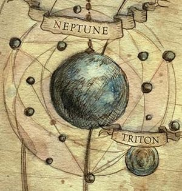

# 1005 海王星 Neptune

精校状态：中文行文已逐段精校，部分术语仍为暂定

分类：地理 / 小行星

原文来源：https://www.bilibili.com/opus/1180579869945233410

原作者：帝国神选罐头

原文时间：2026年03月17日 10:12

[返回分类目录](目录.md) · [全书目录](../../目录.md)

<!-- A1005-B0001 -->
### Basic Data 基本资料

原题：Basic Data 基础数据

<!-- /A1005-B0001 -->

<!-- A1005-B0002 -->
**英文原文**

Name:Neptune

<!-- /A1005-B0002 -->

<!-- A1005-B0003 -->

原译文

名称：海王星

**校订译文**

名称：海王星

<!-- /A1005-B0003 -->

<!-- A1005-B0004 -->
**英文原文**

Segmentum:Segmentum Solar

<!-- /A1005-B0004 -->

<!-- A1005-B0005 -->

原译文

星域：太阳星域

**校订译文**

星域：太阳星域

<!-- /A1005-B0005 -->

<!-- A1005-B0006 -->
**英文原文**

Sector:Sector Solar

<!-- /A1005-B0006 -->

<!-- A1005-B0007 -->

原译文

星区：太阳星区

**校订译文**

星区：太阳星区

<!-- /A1005-B0007 -->

<!-- A1005-B0008 -->
**英文原文**

Subsector:Subsector Sol

<!-- /A1005-B0008 -->

<!-- A1005-B0009 -->

原译文

分区：太阳分区

**校订译文**

次星区：太阳次星区

<!-- /A1005-B0009 -->

<!-- A1005-B0010 -->
**英文原文**

System:Sol System

<!-- /A1005-B0010 -->

<!-- A1005-B0011 -->

原译文

星系：太阳系

**校订译文**

星系：太阳系

<!-- /A1005-B0011 -->

<!-- A1005-B0012 -->
**英文原文**

Affiliation:Imperium

<!-- /A1005-B0012 -->

<!-- A1005-B0013 -->

原译文

隶属：帝国

**校订译文**

隶属：帝国

<!-- /A1005-B0013 -->

<!-- A1005-B0014 图片 -->

<!-- A1005-B0015 -->

原译文

Planetary Image 行星图像

**校订译文**

Planetary Image 行星图像

<!-- /A1005-B0015 -->

<!-- A1005-B0016 -->
**英文原文**

Neptune is an Imperial world of the Solar system, the system which holds Terra, capital of humanity.

<!-- /A1005-B0016 -->

<!-- A1005-B0017 -->

原译文

海王星是太阳系的帝国世界，太阳系有人类的首都泰拉。

**校订译文**

海王星是太阳系中的帝国世界；人类首都泰拉也位于这一星系。

<!-- /A1005-B0017 -->

<!-- A1005-B0018 -->
## History 历史

<!-- /A1005-B0018 -->

<!-- A1005-B0019 -->
**英文原文**

An ancient world by Imperial standards, Neptune was first colonized by humanity during the Age of Terra. During the Age of Strife, the planet's inhabitants were mutated into hideous inhuman creatures.

<!-- /A1005-B0019 -->

<!-- A1005-B0020 -->

原译文

按照帝国的标准，海王星是一个古老的世界，在泰拉时代首次被人类殖民。在纷争时代，行星上的居民变成了可怕的非人生物。

**校订译文**

即使按帝国的尺度，海王星也是历史悠久的世界，人类早在泰拉时代便开始在此殖民。纷争时代，当地居民变异成了骇人的非人怪物。

<!-- /A1005-B0020 -->

<!-- A1005-B0021 -->
**英文原文**

During the early Great Crusade, the task of conquering Neptune and its moons as well as scouring its mutant hordes fell to the vicious IXth Legion. In the tunnels of Neptune's Moons, the IXth Legion fought a bloody war that saw 12,000 Battle-Brothers lost. Yet by the time Imperial reinforcements arrive, the Legion still endured and had succeeded in its mission. They had also replenished their numbers by recruiting among many of the dregs of Neptune.

<!-- /A1005-B0021 -->

<!-- A1005-B0022 -->

原译文

在大远征早期，征服海王星及其卫星以及搜寻其变种人部落的任务落到了狂暴的第九军团手中。在海王星卫星的隧道里，第九军团进行了一场血腥的战争，导致12000名战斗兄弟丧生。然而，当帝国援军到达时，军团仍然坚持并成功完成了任务。他们还通过招募许多海王星的渣滓来补充人数。

**校订译文**

大远征初期，凶悍的第九军团受命征服海王星及其卫星，并清剿当地的变种人群体。他们在卫星隧道中展开血战，损失了一万两千名战斗兄弟。然而，帝国援军抵达时，军团依然屹立不倒，并已完成任务。他们还从海王星的底层人口中大量征募，补充了兵员。

**校注：** scouring 指清剿而非搜寻；lost保持军事损失，不凭本句断定全部阵亡。dregs带有贬义，指当地底层招募来源，不按现代道德断定其皆为罪犯。

<!-- /A1005-B0022 -->

<!-- A1005-B0023 -->
**英文原文**

By the Horus Heresy, Neptune's moons contained Human colonists. During the Solar War, Neptune and its habitats were ravaged by various Pirate and traitor Imperial Army vessels unleashed by Perturabo. Between this and the subsequent mass bombardments by Ultramarines vessels upon the relief of the Siege of Terra, Neptune's habitations and moons were left utterly devastated.

<!-- /A1005-B0023 -->

<!-- A1005-B0024 -->

原译文

到荷鲁斯叛乱，海王星的卫星上有人类殖民者。在太阳战争期间，海王星及其栖息地遭到了佩图拉博释放的各种海盗和叛徒帝国军队战舰的破坏。在此期间，以及随后在泰拉围城解除后，极限战士战舰的大规模轰炸，海王星的栖息地和卫星被彻底摧毁。

**校订译文**

到荷鲁斯之乱时期，海王星各卫星上已有了人类殖民者。太阳系战争中，佩图拉博放出的海盗与叛变帝国军舰船蹂躏了海王星及其居住设施。后来，极限战士舰队又在驰援泰拉、解除围城时进行大规模轰炸。接连的打击使海王星的居住区和各卫星彻底沦为废墟。

<!-- /A1005-B0024 -->

<!-- A1005-B0025 -->
## Notable Locations 著名地点

<!-- /A1005-B0025 -->

<!-- A1005-B0026 -->
**英文原文**

Triton — The moon is being mined for Corvinium by the Imperium. It was once infested with a Genestealer Cult, until it was recently destroyed by the Adeptus Custodes' Dread Host, when Kallisarian Tristraen Desh personally killed the Genestealer Patriarch.

<!-- /A1005-B0026 -->

<!-- A1005-B0027 -->

原译文

特里同(海卫一) — 帝国正在为科维纽姆开采卫星。它曾经被一个基因窃取者教派所侵扰，直到最近被禁军修会的恐怖之主摧毁，当时卡利萨里安·崔斯特伦·德什亲自杀害了基因窃取者族长。

**校订译文**

特里同（海卫一）：帝国在此开采科维纽姆。这颗卫星一度受到基因窃取者教派渗透，直到所述事件中的近期，帝皇禁军的恐惧军团将其消灭，卡利萨里安·崔斯特伦·德什亲手杀死基因窃取者族长。

**校注：** Corvinium 是开采对象，非为其服务的人；Dread Host为禁军恐惧军团，非恐怖之主。原文recently缺绝对时点，修订保留相对叙述。

<!-- /A1005-B0027 -->

<!-- A1005-B0028 -->
**英文原文**

Laomedeia - Moon. During the Horus Heresy Chaos Cultists unleashed toxic gas into its habits. Following the loyalist victory in the Siege of Terra, the Moon became a refuge for escaping Traitors and the Word Bearers used sorcerous abilities to shield their presence. They began the "Great Work", which was aimed at constructing a colossal device meant to rekindle the Warp within the Sol System and restart the war. However the Iron Warriors under Ortag Theokon were able to summon Perturabo and the Iron Blood to the world, and upon taking command the Primarch stripped the moon of all its resources and withdraw with his warriors as part of a grander plan.

<!-- /A1005-B0028 -->

<!-- A1005-B0029 -->

原译文

拉俄墨得亚(海卫十二) - 卫星。在荷鲁斯叛乱时期，混沌邪教徒向其栖息地中释放了有毒气体。在忠诚派在泰拉围城中获胜后，卫星成为逃跑的叛徒的避难所，怀言者使用巫术来保护他们的存在。他们开始了“伟大工作”，旨在建造一个巨大的装置，以重燃太阳系内的亚空间并重启战争。然而，奥尔塔格·西奥康领导下的钢铁勇士能够吁求佩图拉博和铁血号来到世界，在掌权后，原体掠夺了卫星的所有资源，并与他的战士一起撤退，这是一个更宏伟计划的一部分。

**校订译文**

拉俄墨得亚（海卫十二）：荷鲁斯之乱期间，混沌邪教徒向其居住区释放毒气。忠诚派赢得泰拉围城战后，这颗卫星成为叛徒逃亡者的避难所，怀言者以巫术遮蔽他们的踪迹。他们着手实施“大工程”，企图建造一座巨型装置，重新激活太阳系内的亚空间力量，再度发动战争。然而，奥尔塔格·西奥康率领的钢铁勇士将佩图拉博及铁血号召至此处。原体接掌指挥后，掠尽这颗卫星的资源，随后带领战士撤离，以执行更大的计划。

**校注：** habits 应为 habitats 的脱字，按居住区理解；shield their presence指遮蔽踪迹，不是保护其存在。Great Work此为装置工程，不与其他同名计划混同。

<!-- /A1005-B0029 -->

<!-- A1005-B0030 -->
**英文原文**

Proteus - Moon

<!-- /A1005-B0030 -->

<!-- A1005-B0031 -->

原译文

普罗透斯(海卫八) - 卫星

**校订译文**

普罗透斯(海卫八) - 卫星

<!-- /A1005-B0031 -->

<!-- A1005-B0032 -->
**英文原文**

Nereid - Moon

<!-- /A1005-B0032 -->

<!-- A1005-B0033 -->

原译文

涅瑞伊德(海卫二) - 卫星

**校订译文**

涅瑞伊德(海卫二) - 卫星

<!-- /A1005-B0033 -->

<!-- A1005-B0034 -->
**英文原文**

Grylor - orbital colony as large as a Hive city.

<!-- /A1005-B0034 -->

<!-- A1005-B0035 -->

原译文

格莱洛 — 与巢都城市一样大的轨道殖民地。

**校订译文**

格莱洛：规模堪比一座巢都的轨道殖民地。

<!-- /A1005-B0035 -->

本篇核心术语与暂定项

以下列出本篇出现的英文原形及核心术语表用词。同形词可能指不同对象，具体词义以本篇正文和校注为准；单复数、别名和仅见于图注的名称可能尚未列入。完整候选见[术语表](../../术语表/双语术语候选.csv)。

| 英文 | 采用中文 | 状态 |
| --- | --- | --- |
| Adeptus Custodes | 帝皇禁军 | 官方已核对 |
| Imperial Army | 帝国军 | 暂定·官方待核 |
| Ultramarines | 极限战士 | 官方已核对 |
| Horus Heresy | 荷鲁斯之乱 | 官方已核对 |
| Warp | 亚空间 | 官方已核对 |
| Imperium | 帝国 | 暂定·简称 |
| Patriarch | 族长 | 官方已核对 |
| Primarch | 原体 | 官方已核对 |
| Mutant | 变种人 | 暂定·官方待核 |
| Word Bearers | 怀言者 | 暂定·官方待核 |
| Iron Warriors | 钢铁勇士 | 暂定·官方待核 |
| Great Crusade | 大远征 | 暂定·官方待核 |
| Age of Strife | 纷争时代 | 暂定·官方待核 |
| Terra | 泰拉 | 暂定·官方待核 |
| Horus | 荷鲁斯 | 暂定·官方待核 |
| Segmentum Solar | 太阳星域 | 暂定·官方待核 |
| Segmentum | 星域 | 暂定·官方待核 |
| Sector | 星区 | 暂定·官方待核 |
| Subsector | 次星区 | 暂定·官方待核 |
| Age of Terra | 泰拉时代 | 暂定·官方待核 |
| Mission | 教团／传教机构 | 暂定 |
| Ancient | 旗手 | 官方已核对 |
| Dread Host | 恐惧军团 | 暂定·官方待核 |
| Sol | 太阳系 | 暂定·官方待核 |
| Host | 天军 | 暂定·官方待核 |
| Proteus | 普罗透斯 | 暂定·官方待核 |
| Iron Blood | 铁血（芬里斯部落）／铁血号（舰船） | 语境定译·官方待核 |
| System | 星系（恒星系统） | 暂定·官方待核 |
| Hive City | 巢都城市 | 暂定·官方待核 |
| Subsector Sol | 太阳次星区 | 暂定·官方待核 |
| Corvinium | 科维纽姆 | 暂定·官方待核 |
| Kallisarian Tristraen Desh | 卡利萨里安·崔斯特伦·德什 | 暂定·官方待核 |
| Ortag Theokon | 奥尔塔格·西奥康 | 暂定·官方待核 |
| Grylor | 格莱洛 | 暂定·官方待核 |
| Sector Solar | 太阳星区 | 暂定·官方待核 |
| Sol System | 太阳系 | 暂定·官方待核 |

