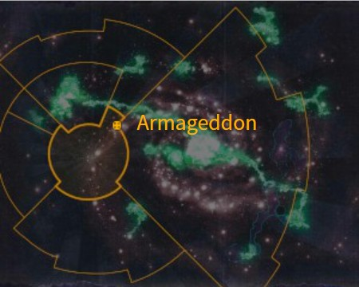
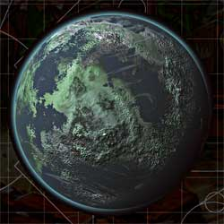
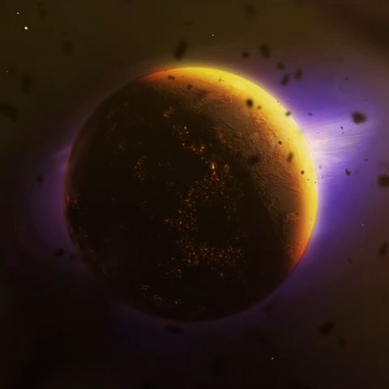
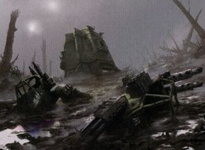
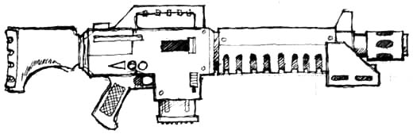
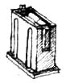
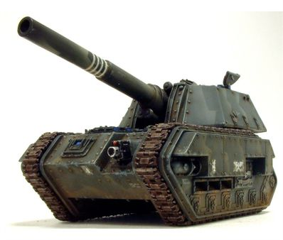
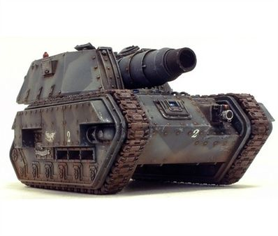
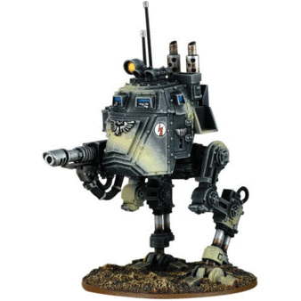

# 1006 阿玛吉多顿 Armageddon

精校状态：中文行文已逐段精校，部分术语仍为暂定

分类：地理 / 小行星

原文来源：https://www.bilibili.com/opus/1136059536021389316

原作者：帝国神选罐头

原文时间：2025年11月17日 10:51

[返回分类目录](目录.md) · [全书目录](../../目录.md)

<!-- A1006-B0001 -->
**英文原文**

Armageddon is a Hive World of the Imperium. It is the fourth planet of the Armageddon System. To the Orks the world is known as Armour-Geddem.

<!-- /A1006-B0001 -->

<!-- A1006-B0002 -->

原译文

阿玛吉多顿是帝国的巢都世界。它是阿玛吉多顿星系的第四颗行星。对于欧克来说，这个世界被称为装甲格迪姆。

**校订译文**

阿玛吉多顿是帝国的巢都世界，也是阿玛吉多顿星系的第四颗行星。欧克称其为“装甲格迪姆”。

<!-- /A1006-B0002 -->

<!-- A1006-B0003 -->
**英文原文**

Armageddon has been the site of some of the largest wars in the Imperium's history.

<!-- /A1006-B0003 -->

<!-- A1006-B0004 -->

原译文

阿玛吉多顿是帝国历史上一些最大战争的发生地。

**校订译文**

帝国历史上一些规模最为庞大的战争，曾在阿玛吉多顿爆发。

<!-- /A1006-B0004 -->

<!-- A1006-B0005 图片 -->

<!-- A1006-B0006 -->

原译文

Map 地图

**校订译文**

Map 地图

<!-- /A1006-B0006 -->

<!-- A1006-B0007 -->
### Basic Data 基本资料

原题：Basic Data 基础数据

<!-- /A1006-B0007 -->

<!-- A1006-B0008 -->
**英文原文**

Name:Armageddon

<!-- /A1006-B0008 -->

<!-- A1006-B0009 -->

原译文

名称：阿玛吉多顿

**校订译文**

名称：阿玛吉多顿

<!-- /A1006-B0009 -->

<!-- A1006-B0010 -->
**英文原文**

Segmentum:Segmentum Solar

<!-- /A1006-B0010 -->

<!-- A1006-B0011 -->

原译文

星域：太阳星域

**校订译文**

星域：太阳星域

<!-- /A1006-B0011 -->

<!-- A1006-B0012 -->
**英文原文**

Sector:Armageddon Sector

<!-- /A1006-B0012 -->

<!-- A1006-B0013 -->

原译文

星区：阿玛吉多顿星区

**校订译文**

星区：阿玛吉多顿星区

<!-- /A1006-B0013 -->

<!-- A1006-B0014 -->
**英文原文**

Subsector:Armageddon Subsector

<!-- /A1006-B0014 -->

<!-- A1006-B0015 -->

原译文

分区：阿玛吉多顿分区

**校订译文**

次星区：阿玛吉多顿次星区

<!-- /A1006-B0015 -->

<!-- A1006-B0016 -->
**英文原文**

System:Armageddon System

<!-- /A1006-B0016 -->

<!-- A1006-B0017 -->

原译文

星系：阿玛吉多顿星系

**校订译文**

星系：阿玛吉多顿星系

<!-- /A1006-B0017 -->

<!-- A1006-B0018 -->
**英文原文**

Affiliation:Imperium

<!-- /A1006-B0018 -->

<!-- A1006-B0019 -->

原译文

隶属：帝国

**校订译文**

隶属：帝国

<!-- /A1006-B0019 -->

<!-- A1006-B0020 -->
**英文原文**

Class:Hive World, Industrial World

<!-- /A1006-B0020 -->

<!-- A1006-B0021 -->

原译文

级别：巢都世界，工业世界

**校订译文**

类别：巢都世界、工业世界

<!-- /A1006-B0021 -->

<!-- A1006-B0022 -->
**英文原文**

Tithe Grade:Exactis Extremis reduced to Solutio Tertius

<!-- /A1006-B0022 -->

<!-- A1006-B0023 -->

原译文

什一税等级：第一级高等降到第三级初等

**校订译文**

什一税等级：第一级高等降到第三级初等

<!-- /A1006-B0023 -->

<!-- A1006-B0024 图片 -->

<!-- A1006-B0025 -->

原译文

Planetary Image 行星图片

**校订译文**

Planetary Image 行星图片

<!-- /A1006-B0025 -->

<!-- A1006-B0026 -->
## History 历史

<!-- /A1006-B0026 -->

<!-- A1006-B0027 -->
**英文原文**

"Armageddon, a world whose name is known across the Imperium. Armageddon, a world whose name has become a byword for war and destruction on a massive scale. Armageddon, where the fate of a thousand worlds hangs in the balance." — Lord Commander Solar Eugenian

<!-- /A1006-B0027 -->

<!-- A1006-B0028 -->

原译文

“阿玛吉多顿，一个名字在帝国中广为人知的世界。阿玛吉多顿，这个名字已经成为大规模战争和毁灭的代名词。阿玛吉多顿，一千个世界的命运悬而未决。” — 太阳领主指挥官尤金尼亚

**校订译文**

“阿玛吉多顿，一个响彻帝国的名字。阿玛吉多顿，一个已成为大规模战争与毁灭代名词的世界。阿玛吉多顿，千百世界的命运在此悬于一线。”——太阳领主指挥官尤金尼亚

<!-- /A1006-B0028 -->

<!-- A1006-B0029 -->
### Secret Origins 隐秘起源

原题：Secret Origins 神秘起源

<!-- /A1006-B0029 -->

<!-- A1006-B0030 -->
**英文原文**

Unknown to the greater Imperium at large, Armageddon was in fact originally the world of Ullanor, made famous by the Ullanor Crusade during the time of the Emperor. 1,500 years after the Horus Heresy during the War of the Beast, Ullanor became the capital world of The Beast and was thought destroyed by the Mechanicum. In truth, the Mechanicum simply teleported Ullanor into the Armageddon System.

<!-- /A1006-B0030 -->

<!-- A1006-B0031 -->

原译文

更大的帝国并不知道，阿玛吉多顿实际上最初是乌兰诺的世界，在帝皇的时代因乌兰诺远征而闻名。在荷鲁斯叛乱1500年后的野兽战争期间，乌兰诺成为野兽的首都世界，并被机械教摧毁。事实上，机械教只是将乌兰诺传送到了阿玛吉多顿星系。

**校订译文**

帝国绝大多数人并不知道，阿玛吉多顿原本就是乌兰诺——帝皇亲征时期因乌兰诺远征而闻名的世界。荷鲁斯之乱一千五百年后，野兽战争爆发，乌兰诺成为野兽的首都，后来被认为已由机械教摧毁。实际上，机械教只是将它传送到了阿玛吉多顿星系。

**校注：** was thought destroyed 是外界认为已被摧毁，非事实。原文在此称Mechanicum机械教，保留其用词，不据时代自行改名。

<!-- /A1006-B0031 -->

<!-- A1006-B0032 -->
### First War of Armageddon 第一次阿玛吉多顿战争

<!-- /A1006-B0032 -->

<!-- A1006-B0033 -->
**英文原文**

The First War for Armageddon is perhaps the least known, and probably for good reason. In 444.M41 Cultists worshipping the Chaos god Khorne broke out in rebellion during a Warp storm. Soon, a great Space Hulk, codified the Devourer of Stars, appeared over the planet, containing none other than Angron, the Daemon Primarch of the World Eaters.

<!-- /A1006-B0033 -->

<!-- A1006-B0034 -->

原译文

第一次阿玛吉多顿战争可能是最不为人知的，而且可能是有充分理由的。444.M41，在一场亚空间风暴中，崇拜混沌之神恐虐的邪教徒爆发了叛乱。很快，一个大太空废船，称为群星吞噬者号，出现在这个行星上，除了吞世者的恶魔原体安格隆之外，没有其他人。

**校订译文**

第一次阿玛吉多顿战争也许最不为人所知，而这种沉默或许自有缘由。444.M41，一场亚空间风暴期间，崇拜混沌神恐虐的邪教徒发动叛乱。不久，一艘被编号识别为“群星吞噬者号”的巨大太空废船出现在行星上空，舰上来者正是吞世者的恶魔原体安格隆。

**校注：** none other than 意为正是，原译“除了安格隆没有其他人”误解固定表达。

<!-- /A1006-B0034 -->

<!-- A1006-B0035 图片 -->

<!-- A1006-B0036 -->

原译文

Armageddon 阿玛吉多顿

**校订译文**

Armageddon 阿玛吉多顿

<!-- /A1006-B0036 -->

<!-- A1006-B0037 -->
**英文原文**

The daemonic legions quickly pushed the defenders back in an orgy of bloodshed, until help arrived in the form of the Space Wolves and the Grey Knights.

<!-- /A1006-B0037 -->

<!-- A1006-B0038 -->

原译文

恶魔军团在血腥的狂欢中迅速将守军击退，直到太空野狼和灰骑士的帮助到来。

**校订译文**

恶魔军团掀起血腥屠戮，迅速逼退守军，直到太空野狼与灰骑士前来支援。

<!-- /A1006-B0038 -->

<!-- A1006-B0039 -->
**英文原文**

With the Wolves bolstering the defences, the Grey Knights teleported to the centre of the Daemonic horde. The Grey Knights eventually banished Angron and his army from the material world, leaving the cultists to be crushed by the Imperial counterattack. Victory was imminent, but one final tragedy was to strike the planet.

<!-- /A1006-B0039 -->

<!-- A1006-B0040 -->

原译文

在野狼加强防御的情况下，灰骑士传送到了恶魔部落的中心。灰骑士最终将安格隆和他的军队从物质世界中放逐出去，让邪教徒被帝国的反击所粉碎。胜利迫在眉睫，但最后一场悲剧是袭击行星。

**校订译文**

太空野狼稳固防线，灰骑士则直接传送至恶魔大军中央，最终将安格隆及其军队放逐出物质宇宙。失去恶魔支援的邪教徒，被帝国反击击溃。胜利已近在眼前，但这颗星球仍将迎来最后一场悲剧。

<!-- /A1006-B0040 -->

<!-- A1006-B0041 -->
### Aftermath 余波

<!-- /A1006-B0041 -->

<!-- A1006-B0042 -->
**英文原文**

In order to preserve the secret of the Daemon Primarch and the Grey Knights, the entire population of Armageddon, as well as all the surviving soldiers, were rounded up, sterilized, and sentenced to work camps for the rest of their lives while a new population was brought to re-settle the planet. Despite these cautions, several thousand Guardsmen managed to slip through the containment action, forcing the Inquisition to take more drastic measures in order to preserve the secrets of the daemons and the Grey Knights. Many Imperial Guard troopships were destroyed as they departed by Grey Knight Strike Cruisers, and in the Tremayne sector, three entire worlds were put to the sword to ensure the silence of a single company of Storm Troopers who had fought at Helsreach Hive alongside the Grey Knights.

<!-- /A1006-B0042 -->

<!-- A1006-B0043 -->

原译文

为了保守恶魔原体和灰骑士的秘密，阿玛吉多顿的全体居民以及所有幸存的士兵被围捕、绝育，并被判处在劳改营度过余生，同时新的居民被带到行星上重新定居。尽管有这些警告，数千名卫兵还是设法躲过了围堵行动，迫使审判庭采取更严厉的措施来保护恶魔和灰骑士的秘密。许多帝国卫队的部队运输舰在离开时被灰骑士打击巡洋舰摧毁，在特里梅因星区，三个完整的世界被置于剑下，以确保与灰骑士一起在赫尔斯利奇巢都作战的一个风暴军连队保持沉默。

**校订译文**

为守住恶魔原体与灰骑士的秘密，阿玛吉多顿全体居民和幸存士兵被集中拘捕、绝育，并被判在劳役营中度过余生；帝国另迁入新居民，重新殖民这颗星球。尽管采取了这些措施，仍有数千名帝国卫队士兵逃过封锁。审判庭于是采取更极端的手段，防止恶魔与灰骑士的秘密外泄。许多帝国卫队运兵船刚离港，便遭灰骑士打击巡洋舰摧毁。在特里梅因星区，为让一个曾在赫尔斯利奇巢都与灰骑士并肩作战的风暴兵连永远噤声，整整三个世界遭到屠戮。

**校注：** cautions 指防泄密措施，非警告。put to the sword 为屠戮；保留原文整个人口及三个世界的严厉措施，不淡化。

<!-- /A1006-B0043 -->

<!-- A1006-B0044 -->
**英文原文**

Logan Grimnar, the Great Wolf of the Space Wolves, has never forgiven the Inquisition for carrying out such a betrayal of the men and women who fought for their world.

<!-- /A1006-B0044 -->

<!-- A1006-B0045 -->

原译文

罗根·格里姆纳尔，太空野狼的头狼，永远不会原谅审判庭对为世界而战的男女们的背叛。

**校订译文**

太空野狼头狼洛根·格里姆纳尔始终无法原谅审判庭：这些男女曾为自己的世界奋战，却遭到如此背叛。

<!-- /A1006-B0045 -->

<!-- A1006-B0046 -->
### Second War for Armageddon 第二次阿玛吉多顿战争

<!-- /A1006-B0046 -->

<!-- A1006-B0047 -->
**英文原文**

The Second War for Armageddon featured a huge force of Orks in 941.M41 led by the mighty Warboss Ghazghkull Mag Uruk Thraka. The Overlord of the planet, Herman von Strab, was completely unprepared for the attack and his own pride and incompetence only made matters worse. His ineffective, piecemeal defence of the planet was compounded by his refusal to contact the wider Imperium to ask for outside help; when an Imperial Commissar named Yarrick defied von Strab and sent an Astropathic call for aid, von Strab ordered Yarrick exiled to Hades Hive.

<!-- /A1006-B0047 -->

<!-- A1006-B0048 -->

原译文

941.M41，第二次阿玛吉多顿战争爆发，由强大的战争头目碎骨者马格·乌鲁克·萨拉卡领导的一支庞大的兽人部队。这个行星的霸主赫尔曼·冯·斯特拉布对这次袭击毫无准备，他自己的骄傲和无能只会让事情变得更糟。他拒绝联系更广泛的帝国寻求外界帮助，加剧了他对行星的无效、零碎的防御；当一位名叫亚瑞克的帝国政委违抗冯·斯特拉布并发出星语求救信号时，冯·斯特拉布下令将亚瑞克流放到哈迪斯巢都。

**校订译文**

941.M41，第二次阿玛吉多顿战争爆发。强大的战争头目碎骨者·马格·乌鲁克·斯拉卡率领庞大欧克军队来袭，而行星最高统治者赫尔曼·冯·斯特拉布毫无准备。他的傲慢与无能使局势雪上加霜：防御部署零散低效，他却仍拒绝向帝国其他地区求援。帝国政委亚瑞克违抗命令，发出星语求救讯息，冯·斯特拉布便将他放逐到哈迪斯巢都。

**校注：** Ghazghkull Thraka采用已核官方词根碎骨者·斯拉卡；本段全名中Mag Uruk沿马格·乌鲁克，完整长名仍待核。

<!-- /A1006-B0048 -->

<!-- A1006-B0049 -->
**英文原文**

Ironically, Yarrick led a heroic defence of the Hive that eventually distracted Ghazghkull from the planetary battles. This infuriated the Ork enough to send more and more forces against Hades Hive. The battle escalated to such proportions that Ghazghkull considered the fight a matter of personal pride, and took command of the forces assaulting Hades himself.

<!-- /A1006-B0049 -->

<!-- A1006-B0050 -->

原译文

具有讽刺意味的是，亚瑞克领导了对巢都的英勇防御，最终分散了碎骨者对行星战斗的注意力。这激怒了欧克，他们派遣越来越多的部队对抗哈迪斯巢都。这场战斗升级到了这样的程度，以至于碎骨者认为这场战斗是个人自豪感的问题，并亲自指挥了袭击哈迪斯的部队。

**校订译文**

讽刺的是，亚瑞克英勇指挥巢都防御，反而把碎骨者的注意力从整颗行星的战局吸引了过来。久攻不下使这位欧克头目暴怒，不断增兵哈迪斯。战斗规模越演越烈，碎骨者将之视为关乎个人颜面的大事，最终亲自指挥攻城。

<!-- /A1006-B0050 -->

<!-- A1006-B0051 -->
**英文原文**

Eventually, salvation arrived for Armageddon's defenders. Commander Dante of the Blood Angels led an Imperial army which took the fight to the Orks. He took control of the planet's defence and had von Strab arrested for crimes against the Imperium. The forces involved were the Space Marines of the Salamanders, Blood Angels and Ultramarines, along with Imperial Guard and Squats. Although Hades Hive eventually fell, the distraction provided by Yarrick's stalemate of Ghazghkull gave the Imperial forces enough time to mount a counterattack that finally broke the back of the Ork invasion force.

<!-- /A1006-B0051 -->

<!-- A1006-B0052 -->

原译文

最终，阿玛吉多顿的守军获得了救赎。圣血天使的指挥官但丁率领一支帝国军队与欧克作战。他控制了行星的防御，并以反帝国罪逮捕了冯·斯特拉布。参与其中的部队是火蜥蜴、圣血天使和极限战士的星际战士，以及帝国卫队和矮人。尽管哈迪斯巢都最终陷落，但亚瑞克与碎骨者的僵局分散了帝国部队的注意力，给了足够的时间进行反击，最终击溃了欧克入侵部队的防线。

**校订译文**

守军终于等来救援。圣血天使指挥官但丁率领帝国军队迎击欧克，接管行星防御，并以危害帝国的罪名逮捕冯·斯特拉布。参战部队包括火蜥蜴、圣血天使与极限战士的星际战士，以及帝国卫队和矮人。尽管哈迪斯巢都最终陷落，亚瑞克牵制碎骨者所争取的时间，仍足以让帝国组织反击，最终重创并瓦解欧克入侵军的攻势。

**校注：** 亚瑞克牵制的是碎骨者的注意力，为帝国争取反攻时间；原译把被分散注意力的一方写成帝国。

<!-- /A1006-B0052 -->

<!-- A1006-B0053 -->
### Aftermath 余波

<!-- /A1006-B0053 -->

<!-- A1006-B0054 -->
**英文原文**

Armageddon was devastated in the invasion. Even 50 years after the war, many of the hives retained extensive damage. However, due to its strategic significance to the Imperium, the Adeptus Terra ordered an extensive set of projects to rebuild and reinforce the Armageddon System against future attacks. Both ground-based and void-based defences were extensively bolstered. The Armegeddon Sector's naval command was transferred to the nearby planet of St. Jowen's Dock, whose naval facilities were refurbished and reequipped to handle even the largest of Naval battleships. In addition three space stations were constructed to monitor the edges of the Armageddon System, which were named after three great heroes of the war: Dante, Mannheim and Yarrick.

<!-- /A1006-B0054 -->

<!-- A1006-B0055 -->

原译文

阿玛吉多顿在入侵中被摧毁了。即使在战争结束50年后，许多巢都仍然受到严重破坏。然而，由于其对帝国的战略意义，泰拉下令进行一系列广泛的工程，以重建和增强阿玛吉多顿星系，以抵御未来的袭击。陆基和空基防御都得到了广泛增强。阿玛吉多顿星区的海军指挥部被转移到附近行星的圣约文码头，那里的海军设施经过翻新和重新装备，甚至可以处理最大的海军战舰。此外，还建造了三个空间站来监测阿玛吉多顿星系的边缘，以战争中的三位伟大英雄但丁、曼海姆和亚瑞克命名。

**校订译文**

这场入侵使阿玛吉多顿满目疮痍。即使五十年后，许多巢都仍有大片区域未能修复。由于该星系对帝国具有重要战略价值，中央政务部下令展开庞大的重建与加固工程，以防日后再遭进攻。地面和太空防御均大幅增强。阿玛吉多顿星区的海军指挥部迁往附近名为圣约文船坞的星球，其海军设施经过翻修和重新装备，足以容纳最大的海军战列舰。此外，还建造了三座监视星系边缘的空间站，分别以战争英雄但丁、曼海姆和亚瑞克命名。

**校注：** St. Jowen’s Dock是附近星球的名称，非附近行星上的码头；Adeptus Terra为中央政务部。

<!-- /A1006-B0055 -->

<!-- A1006-B0056 -->
**英文原文**

Though it was rumoured that Ghazghkull himself had fallen to the Blood Angels when they assaulted the Ork army near Hive Tartarus, these claims would later prove false. Nevertheless the bulk of the Orks were forced off-planet, humiliated in their defeat. Ghazghkull retreated to his stronghold in the Golgotha Sector but, although Imperial officials believed the Warboss utterly defeated, they were gravely mistaken. He spent the next 50 years building his Waaagh! anew, engaging in a series of raids and attacks on numerous Imperial worlds.

<!-- /A1006-B0056 -->

<!-- A1006-B0057 -->

原译文

尽管有传言称，当圣血天使袭击塔尔塔罗斯巢都附近的欧克军队时，碎骨者本人已经落入了圣血天使之手，但这些说法后来被证明是错误的。尽管如此，大部分欧克还是被迫离开了行星，在失败中蒙羞。碎骨者撤退到他在各各他星区的据点，但尽管帝国官员认为战争头目完全被击败，但他们大错特错了。在接下来的50年里，他创建了他的Waaagh！，再次对众多帝国世界进行了一系列突袭和攻击。

**校订译文**

当时有传言称，圣血天使在塔尔塔罗斯巢都附近进攻欧克军队时杀死了碎骨者，但后来证实并非如此。尽管如此，欧克主力仍蒙受败绩，被迫撤离星球。碎骨者退回各各他星区的据点。帝国官员以为这位战争头目已被彻底打败，却大错特错：此后的五十年间，他重新积聚 Waaagh!，对众多帝国世界展开一连串袭击。

**校注：** fallen to在传言语境指被杀，非被俘。Waaagh! 保留原词和空格。

<!-- /A1006-B0057 -->

<!-- A1006-B0058 -->
**英文原文**

Despite the Orks' general retreat, pockets of Feral Orks remained on Armageddon, plaguing the planet's equatorial jungles and the ruins of fallen hives for many years to come. The greenskins remained on other worlds of the Armageddon system as well, most notably Chosin.

<!-- /A1006-B0058 -->

<!-- A1006-B0059 -->

原译文

尽管欧克普遍撤退，但蛮荒欧克的一些残余部队仍然处于阿玛吉多顿，在未来许多年里困扰着行星的赤道丛林和倒塌的巢都废墟。绿皮也在阿玛吉多顿星系的其他世界中留下了足迹，最著名的是乔辛。

**校订译文**

欧克大举撤退后，仍有零散蛮荒欧克留在阿玛吉多顿，在此后多年不断侵扰赤道丛林和陷落巢都的废墟。星系中的其他世界也留有绿皮，尤以乔辛最为突出。

<!-- /A1006-B0059 -->

<!-- A1006-B0060 -->
**英文原文**

Though nearly killed, Yarrick survived and would clash with Ghazghkull again.

<!-- /A1006-B0060 -->

<!-- A1006-B0061 -->

原译文

虽然差点被杀，但亚瑞克幸存下来，并将再次与碎骨者发生冲突。

**校订译文**

虽然差点被杀，但亚瑞克幸存下来，并将再次与碎骨者发生冲突。

<!-- /A1006-B0061 -->

<!-- A1006-B0062 -->
**英文原文**

Von Strab also managed to escape his jailers and would later return

<!-- /A1006-B0062 -->

<!-- A1006-B0063 -->

原译文

冯·斯特拉布也设法逃离了狱卒，后来又回来了

**校订译文**

冯·斯特拉布也成功逃脱看守，日后再度归来。

<!-- /A1006-B0063 -->

<!-- A1006-B0064 -->
### Third War for Armageddon 第三次阿玛吉多顿战争

<!-- /A1006-B0064 -->

<!-- A1006-B0065 -->
**英文原文**

The Third War for Armageddon occurred fifty years after the Second War. Ghazghkull Thraka returned, leading a second Waaagh! smashing into Armageddon. Commissar Yarrick and many of the heroes who fought for the planet before were called into battle again.

<!-- /A1006-B0065 -->

<!-- A1006-B0066 -->

原译文

第三次阿玛吉多顿战争发生在第二次战争五十年后。碎骨者萨拉卡回来了，领着第二次Waaagh！闯入阿玛吉多顿。亚瑞克政委和许多之前为行星而战的英雄再次被征召入伍。

**校订译文**

第二次战争五十年后，第三次阿玛吉多顿战争爆发。碎骨者·斯拉卡卷土重来，率领第二场 Waaagh! 猛攻阿玛吉多顿。亚瑞克政委和许多曾为这颗星球奋战的英雄再次受召上阵。

<!-- /A1006-B0066 -->

<!-- A1006-B0067 -->
### Aftermath 余波

<!-- /A1006-B0067 -->

<!-- A1006-B0068 -->
**英文原文**

Although the 3rd Armageddon War has seen the Imperium retain its hold on the world, fighting still continues on the planet. Ghazghkull has left the planet and continues to plague neighbouring Imperial worlds. He is being pursued by Yarrick with a full Black Templars crusade at his back. The Orks have come to regard Armageddon as a kind of Valhalla, where they can always come to find a good fight, and the Imperium must still send more troops to battle to keep the planet in Imperial hands while Ork reinforcements continue to flood in.

<!-- /A1006-B0068 -->

<!-- A1006-B0069 -->

原译文

尽管在第三次阿玛吉多顿战争中，帝国仍然控制着世界，但行星上的战斗仍在继续。碎骨者已经离开了这个行星，并继续困扰着邻近的帝国世界。他被亚瑞克追捕，背后是一场满编的黑色圣堂远征。欧克已经将阿玛吉多顿视为一种英灵殿，在那里他们总是可以找到一场精彩的战斗，帝国仍然必须派遣更多的军队作战，以将行星掌握在帝国手中，而欧克援军则继续涌入。

**校订译文**

第三次战争中，帝国仍保住了对阿玛吉多顿的控制，但战斗并未结束。碎骨者离开当地，继续侵扰邻近的帝国世界；亚瑞克则率领一整支黑色圣堂远征军追击他。欧克开始把阿玛吉多顿视作某种英灵殿，随时都能来此痛快厮杀。随着欧克援军不断涌入，帝国也不得不持续增兵，以守住这颗星球。

**校注：** 这一段按源文时点叙述亚瑞克正在追击，不据其他版本的后续生死状态改写。Valhalla此为好战者乐园比喻，不指同名帝国世界。

<!-- /A1006-B0069 -->

<!-- A1006-B0070 -->
### The New Danger 新危险

<!-- /A1006-B0070 -->

<!-- A1006-B0071 -->
**英文原文**

After the opening of the Great Rift at the end of M41, Armageddon found itself directly in the path of The Blood Crusade, a vast legion of Khorne's Daemons pouring into realspace. The planet was again subjected to a Daemonic invasion and now not two, but three great forces fight on the ash wastes of Armageddon, as Orks, Imperials and Khorne's followers clash with each other.

<!-- /A1006-B0071 -->

<!-- A1006-B0072 -->

原译文

M41末大裂隙打开后，阿玛吉多顿发现自己位于鲜血远征的道路，恐虐的一支庞大的恶魔军团涌入了现实世界。这个行星再次遭受了恶魔的入侵，现在不是两个，而是三个大部队在阿玛吉多顿的灰烬废墟上作战，因为欧克、帝国和恐虐的追随者相互冲突。

**校订译文**

第四十一个千年末，大裂隙开启。恐虐恶魔大军涌入现实，发动鲜血远征，阿玛吉多顿恰在其进军路线上。这颗星球再次遭到恶魔入侵。如今，在灰烬荒原上混战的已不再是两方，而是欧克、帝国和恐虐追随者三大势力。

<!-- /A1006-B0072 -->

<!-- A1006-B0073 -->
### Season of Blood 血季

<!-- /A1006-B0073 -->

<!-- A1006-B0074 -->
**英文原文**

The continued fighting on Armageddon eventually attracted the attention of the damned World Eaters warship Conqueror, which arrived at the beleaguered planet at the head of a vast Khornate host. Angron himself manifested through the Red Angel's Gate during the subsequent invasion, forcing a major intervention by the Imperium led by the Grey Knights, Space Wolves, Black Templars, and Imperial Guard. At the climax of the battle the Imperials were successful in pushing Angron back through his own Warp Portal and sealing the Red Angel's Gate thanks to the sacrifice of Grand Master Rothwyr Morvans of the Grey Knights 5th Brotherhood.

<!-- /A1006-B0074 -->

<!-- A1006-B0075 -->

原译文

阿玛吉多顿的持续战斗最终引起了受诅咒的吞世者战舰征服者号的注意，它在一个庞大的恐虐天军的带领下抵达了这个被围困的行星。在随后的入侵中，安格隆本人通过红天使之门现身，迫使由灰骑士、太空野狼、黑色圣堂和帝国卫队领导的帝国进行了重大干预。在战斗的高潮，帝国成功地将安格隆推回自己的亚空间传送门，并在灰骑士第五兄弟会大导师罗斯维尔·墨万斯的牺牲下封锁了红天使之门。

**校订译文**

阿玛吉多顿持久的战火，最终引来受诅咒的吞世者战舰征服者号。它率领庞大的恐虐军势抵达这颗饱受围攻的星球。随后，安格隆亲自从红天使之门显现，迫使帝国投入大规模援军，由灰骑士、太空野狼、黑色圣堂和帝国卫队主导作战。决战时，帝国部队成功把安格隆逼回他自己的亚空间门户；灰骑士第五兄弟会大导师罗斯维尔·墨万斯牺牲自己，封闭了红天使之门。

**校注：** 征服者号处于大军前列并率军抵达，原译被大军率领颠倒了关系。

<!-- /A1006-B0075 -->

<!-- A1006-B0076 -->
**英文原文**

While the immediate threat has been contained, fighting on Armageddon continues.

<!-- /A1006-B0076 -->

<!-- A1006-B0077 -->

原译文

虽然直接的威胁已经得到控制，但阿玛吉多顿的战斗仍在继续。

**校订译文**

虽然直接的威胁已经得到控制，但阿玛吉多顿的战斗仍在继续。

<!-- /A1006-B0077 -->

<!-- A1006-B0078 -->
## Geography 地理

<!-- /A1006-B0078 -->

<!-- A1006-B0079 -->
**英文原文**

Armageddon's surface features three main bodies of land: the Fire Wastes surrounding the north pole, the Deadlands around the south pole and one large equatorial landmass. These continents are separated by a world ocean.

<!-- /A1006-B0079 -->

<!-- A1006-B0080 -->

原译文

阿玛吉多顿的表面有三个主要的大陆：北极周围的火之荒地，南极周围的死亡之地和一个巨大的赤道大陆。这些大陆被世界海洋隔开。

**校订译文**

阿玛吉多顿地表有三片主要陆地：环绕北极的火之荒地、环绕南极的死亡之地，以及一块庞大的赤道陆块。它们之间由覆盖全球的海洋相隔。

<!-- /A1006-B0080 -->

<!-- A1006-B0081 图片 -->

<!-- A1006-B0082 -->

原译文

The dismal backwater of Armageddon 阿玛吉多顿的凄凉死水

**校订译文**

The dismal backwater of Armageddon 阿玛吉多顿的凄凉僻地

**校注：** backwater在图注指偏僻落后的地方，非死水。

<!-- /A1006-B0082 -->

<!-- A1006-B0083 -->
**英文原文**

The equatorial landmass supports the majority of the planet's population, including a number of hive cities. It is split into two continents: Armageddon Prime in the west and Armageddon Secundus to the east, which meet in a region dominated by a massive jungle.

<!-- /A1006-B0083 -->

<!-- A1006-B0084 -->

原译文

赤道大陆支持着行星上大部分的人口，包括许多巢都城市。它分为两个大陆：西部的阿玛吉多顿一号和东部的阿玛吉多顿二号，它们在一个由巨大丛林主导的地区相遇。

**校订译文**

大多数人口和许多巢都都集中在赤道陆块上。它又分为两片大陆地区：西侧的阿玛吉多顿普赖姆地区，以及东侧的阿玛吉多顿塞孔杜斯地区；两地交界处是一片广袤的丛林。

**校注：** Prime与Secundus均为这颗行星内部大陆地区，非一号星／二号星；按主审已定普赖姆／塞孔杜斯地区。

<!-- /A1006-B0084 -->

<!-- A1006-B0085 -->
**英文原文**

The planet's atmosphere is thick and has been contaminated by thousands of years worth of industrial by-products, along with hydrogen sulphides (produced by volcanic activity) and carbon oxides (produced by decaying organic matter and a lack of plant life). An average human requires mechanical assistance to breathe, although the thicker atmosphere does counteract the planet's relatively weak magnetic field, protecting Armageddon from cosmic radiation.

<!-- /A1006-B0085 -->

<!-- A1006-B0086 -->

原译文

行星的大气层很厚，被数千年的工业副产品污染，还有硫化氢（由火山活动产生）和碳氧化物（由腐烂的有机物和缺乏植物产生）。普通人需要机械辅助才能呼吸，尽管较厚的大气层确实抵消了行星相对较弱的磁场，保护了阿玛吉多顿免受宇宙辐射的影响。

**校订译文**

阿玛吉多顿大气稠密，数千年来一直受到工业副产物污染，其中还有火山活动释放的硫化氢，以及有机物腐烂和植物匮乏造成的碳氧化物污染。普通人必须借助机械设备才能呼吸。不过，厚重大气也弥补了行星磁场较弱带来的防护不足，使阿玛吉多顿免受宇宙辐射侵袭。

**校注：** thicker atmosphere counteract weak magnetic field指补偿较弱磁场的防护不足，非抵消磁场本身。

<!-- /A1006-B0086 -->

<!-- A1006-B0087 -->
## Other Planetary Data 其他行星数据

<!-- /A1006-B0087 -->

<!-- A1006-B0088 -->
**英文原文**

Designation: ARO4.01

<!-- /A1006-B0088 -->

<!-- A1006-B0089 -->

原译文

标示：ARO4.01

**校订译文**

标示：ARO4.01

<!-- /A1006-B0089 -->

<!-- A1006-B0090 -->
**英文原文**

Aestimere: A501

<!-- /A1006-B0090 -->

<!-- A1006-B0091 -->

原译文

评估：A501

**校订译文**

评估：A501

<!-- /A1006-B0091 -->

<!-- A1006-B0092 -->
**英文原文**

Orbital Distance: 1.1 AU

<!-- /A1006-B0092 -->

<!-- A1006-B0093 -->

原译文

轨道距离：1.1天文单位

**校订译文**

轨道距离：1.1天文单位

<!-- /A1006-B0093 -->

<!-- A1006-B0094 -->
**英文原文**

Gravitation: 0.91G

<!-- /A1006-B0094 -->

<!-- A1006-B0095 -->

原译文

重力：0.91G

**校订译文**

重力：0.91G

<!-- /A1006-B0095 -->

<!-- A1006-B0096 -->
**英文原文**

Temperature: 60°С

<!-- /A1006-B0096 -->

<!-- A1006-B0097 -->

原译文

温度：60°С

**校订译文**

温度：60℃

<!-- /A1006-B0097 -->

<!-- A1006-B0098 -->
**英文原文**

Diameter: 6830 miles

<!-- /A1006-B0098 -->

<!-- A1006-B0099 -->

原译文

直径：6830英里

**校订译文**

直径：6830英里

<!-- /A1006-B0099 -->

<!-- A1006-B0100 -->
**英文原文**

Moons: None

<!-- /A1006-B0100 -->

<!-- A1006-B0101 -->

原译文

卫星：无

**校订译文**

卫星：无

<!-- /A1006-B0101 -->

<!-- A1006-B0102 -->
## Society 社会

<!-- /A1006-B0102 -->

<!-- A1006-B0103 -->
**英文原文**

Ever since the Second War for Armageddon, the planet has been ruled by a military council which consists of high-ranking members of various Imperial organisations: officers of the Astra Militarum, Navy and Munitorium, representatives of the Mechanicus and Ecclesiarchy, and the Governor's of the planet's major hives. The overall leader of the council is General Kurov.

<!-- /A1006-B0103 -->

<!-- A1006-B0104 -->

原译文

自第二次阿玛吉多顿战争以来，这个行星一直由一个军事议会统治，该议会由各种帝国组织的高级成员组成：星界军、海军和军务部的军官，机械教和国教的代表，以及行星主要巢都的总督。议会的总领导人是库罗夫将军。

**校订译文**

第二次阿玛吉多顿战争后，行星由军事议会统治。其成员来自帝国各大机构，包括星界军、海军与军务部的高级军官，机械修会与国教会代表，以及各主要巢都的总督。议会由库罗夫将军统领。

<!-- /A1006-B0104 -->

<!-- A1006-B0105 -->
### Military 军事

<!-- /A1006-B0105 -->

<!-- A1006-B0106 -->
**英文原文**

Armageddon operates a large standing army, including both a Planetary Defense Force known as the Armageddon Defence Force and the famed Armageddon Steel Legion of the Imperial Guard, which specialises in mechanised warfare and fighting Orks. During the Second War for Armageddon, they also operated specialised anti-Ork units known as the Armageddon Ork Hunters. In times of crisis, Armageddon also mobilises militias, such as the Armageddon Ash Waste Militia and the Armageddon Hive Militia.

<!-- /A1006-B0106 -->

<!-- A1006-B0107 -->

原译文

阿玛吉多顿拥有一支庞大的常备军，包括一支被称为阿玛吉多顿防御部队的行星防御部队和著名的帝国卫队阿玛吉多顿钢铁军团，该军团专门从事机械化战争和与欧克作战。在第二次阿玛吉多顿战争期间，他们还使用了专门的反欧克部队，称为阿玛吉多顿欧克猎手。在危机时刻，阿玛吉多顿也会动员民兵，如阿玛吉多顿灰烬荒地民兵和阿玛吉多顿巢都民兵。

**校订译文**

阿玛吉多顿维持着庞大的常备军，包括称为阿玛吉多顿防御部队的行星防卫军，以及帝国卫队中著名的阿玛吉多顿钢铁军团。后者擅长机械化作战和对抗欧克。第二次战争期间，当地还部署过专门猎杀欧克的阿玛吉多顿欧克猎手。危急时刻，行星也会征召民兵，包括阿玛吉多顿灰烬荒地民兵和阿玛吉多顿巢都民兵。

<!-- /A1006-B0107 -->

<!-- A1006-B0108 图片 -->

<!-- A1006-B0109 -->

原译文

M40 Armageddon pattern Autogun M40阿玛吉多顿型自动枪

**校订译文**

M40 Armageddon pattern Autogun M40阿玛吉多顿型自动枪

<!-- /A1006-B0109 -->

<!-- A1006-B0110 -->
**英文原文**

The planet also sports extensive orbital defences, including layers of orbital mines, spacedocks, weapons platforms and two manned Imperial Space Stations (one located over each pole).

<!-- /A1006-B0110 -->

<!-- A1006-B0111 -->

原译文

这颗行星还拥有广泛的轨道防御，包括多层轨道地雷、太空船坞、武器平台和两个载人帝国空间站（每个极点上一个）。

**校订译文**

行星还拥有完备的轨道防御，包括层层轨道雷区、太空船坞、武器平台，以及两座有人驻守的帝国空间站，分别位于南北两极上空。

<!-- /A1006-B0111 -->

<!-- A1006-B0112 图片 -->

<!-- A1006-B0113 -->

原译文

12 shot solid slug magazine 12发实心弹匣

**校订译文**

12 shot solid slug magazine 12发容量实弹弹匣

<!-- /A1006-B0113 -->

<!-- A1006-B0114 -->
## Armageddon patterns 阿玛吉多顿型

<!-- /A1006-B0114 -->

<!-- A1006-B0115 -->
**英文原文**

Armageddon is known to produce its own patterns of numerous weapons and vehicles. Armageddon-pattern vehicles tend to be environmentally sealed, a necessity for fighting on Armageddon in order to protect both the pilot and machine from the corrosive effects of the planet's ash waste sands.

<!-- /A1006-B0115 -->

<!-- A1006-B0116 -->

原译文

众所周知，阿玛吉多顿会制造出自己的众多武器和载具。阿玛吉多顿型的载具往往是环境密封的，这是在阿玛吉多顿作战的必要条件，以保护驾驶员和机械免受行星灰烬荒地沙尘的腐蚀效果。

**校订译文**

阿玛吉多顿生产多种采用本地型号的武器与载具。当地载具通常采用密封结构，以隔绝外界环境；在灰烬荒原作战时，这是保护驾驶员和机器、避免遭受腐蚀性沙尘侵害的必要措施。

<!-- /A1006-B0116 -->

<!-- A1006-B0117 图片 -->

<!-- A1006-B0118 -->

原译文

Armageddon pattern Basilisk 阿玛吉多顿型石化蜥蜴

**校订译文**

Armageddon pattern Basilisk 阿玛吉多顿型石化蜥蜴

<!-- /A1006-B0118 -->

<!-- A1006-B0119 -->
**英文原文**

In the course of the ork invasions, some of the manufactories of Armageddon started to produce a variant of the Chimera APC. These new tanks, intended as a stopgap to bolster the Planetary Defence Forces, are designated the APDS-6a 'Defender'. They mount a laser destroyer on a Chimera chassis and have proved reasonably effective.

<!-- /A1006-B0119 -->

<!-- A1006-B0120 -->

原译文

在欧克入侵的过程中，阿玛吉多顿的一些铸造厂开始生产奇美拉装甲运兵车的变体。这些新型坦克被命名为APDS-6a“防御者”，旨在作为增强行星防御部队的权宜之计。他们将激光毁灭炮安装在奇美拉底盘上，并被证明相当有效。

**校订译文**

欧克入侵期间，阿玛吉多顿的一些制造厂开始生产奇美拉装甲运兵车的改型，编号为 APDS-6a“防御者”。这种坦克是在奇美拉底盘上安装激光毁灭炮，原为临时增强行星防卫军实力的应急方案，实际表现相当有效。

<!-- /A1006-B0120 -->

<!-- A1006-B0121 图片 -->

<!-- A1006-B0122 -->

原译文

Armageddon pattern Medusa 阿玛吉多顿型美杜莎

**校订译文**

Armageddon pattern Medusa 阿玛吉多顿型美杜莎

<!-- /A1006-B0122 -->

<!-- A1006-B0123 -->
**英文原文**

Amongst the weapons produced on Armageddon are lasguns. Newly-produced lasguns on Armageddon are known to have a flaw whereby the slides often jam. The planet also produces ten million new battle tanks every year

<!-- /A1006-B0123 -->

<!-- A1006-B0124 -->

原译文

阿玛吉多顿制造的武器中有激光枪。众所周知，阿玛吉多顿新生产的激光枪有一个缺陷，即滑块经常卡住。行星每年还生产1000万辆新的战斗坦克

**校订译文**

阿玛吉多顿也生产激光枪，不过新出厂产品存在滑动机构经常卡滞的缺陷。此外，该星球每年还生产一千万辆新战斗坦克。

**校注：** 年产一千万辆战斗坦克为原文明确数字，照录。slides指滑动部件，本段未交代激光枪的具体机构，未擅定为枪机。

<!-- /A1006-B0124 -->

<!-- A1006-B0125 图片 -->

<!-- A1006-B0126 -->

原译文

Armageddon pattern Sentinel 阿玛吉多顿型哨兵

**校订译文**

Armageddon pattern Sentinel 阿玛吉多顿型哨兵

<!-- /A1006-B0126 -->

<!-- A1006-B0127 -->
## Trivia 琐事

<!-- /A1006-B0127 -->

<!-- A1006-B0128 -->
**英文原文**

The name Armageddon likely references the location in Christian mythology where it is prophesied that the last great battle between good and evil will take place.

<!-- /A1006-B0128 -->

<!-- A1006-B0129 -->

原译文

阿玛吉多顿这个名字可能是指基督教神话中预言善恶之间最后一场大战将发生的地点。

**校订译文**

阿玛吉多顿这个名字可能是指基督教神话中预言善恶之间最后一场大战将发生的地点。

<!-- /A1006-B0129 -->

本篇核心术语与暂定项

以下列出本篇出现的英文原形及核心术语表用词。同形词可能指不同对象，具体词义以本篇正文和校注为准；单复数、别名和仅见于图注的名称可能尚未列入。完整候选见[术语表](../../术语表/双语术语候选.csv)。

| 英文 | 采用中文 | 状态 |
| --- | --- | --- |
| Space Marines | 星际战士 | 官方已核对 |
| Black Templars | 黑色圣堂 | 官方已核对 |
| Blood Angels | 圣血天使 | 官方已核对 |
| Grey Knights | 灰骑士 | 官方已核对 |
| Space Wolves | 太空野狼 | 官方已核对 |
| Astra Militarum | 星界军 | 官方已核对 |
| Imperial Guard | 帝国卫队 | 暂定·语境区分 |
| Imperial Army | 帝国军 | 暂定·官方待核 |
| World Eaters | 吞世者 | 官方已核对 |
| Orks | 欧克蛮人 | 官方已核对 |
| Commissar | 政委 | 官方已核对 |
| Chimera | 奇美拉 | 官方已核对 |
| Ultramarines | 极限战士 | 官方已核对 |
| Horus Heresy | 荷鲁斯之乱 | 官方已核对 |
| Warp | 亚空间 | 官方已核对 |
| Great Rift | 大裂隙 | 官方已核对 |
| Inquisition | 审判庭 | 暂定 |
| Imperium | 帝国 | 暂定·简称 |
| Mechanicum | 机械教 | 暂定·历史称谓 |
| Khorne | 恐虐 | 官方已核对 |
| Waaagh! | Waaagh! | 暂定·保留原文 |
| History | 历史 | 编辑用语已统一 |
| Emperor | 帝皇 | 官方已核对 |
| Primarch | 原体 | 官方已核对 |
| Adeptus Terra | 中央政务部 | 暂定 |
| Ecclesiarchy | 国教会 | 暂定 |
| Hive World | 巢都世界 | 暂定·官方待核 |
| Terra | 泰拉 | 暂定·官方待核 |
| Horus | 荷鲁斯 | 暂定·官方待核 |
| Ghazghkull Thraka | 碎骨者·斯拉卡 | 官方已核对 |
| Ghazghkull Mag Uruk Thraka | 碎骨者·斯拉卡 | 暂定·官方短名对应 |
| Segmentum Solar | 太阳星域 | 暂定·官方待核 |
| Segmentum | 星域 | 暂定·官方待核 |
| Sector | 星区 | 暂定·官方待核 |
| Subsector | 次星区 | 暂定·官方待核 |
| Salamanders | 火蜥蜴 | 暂定·官方待核 |
| Brotherhood | 兄弟会 | 暂定·官方待核 |
| Squats | 矮人 | 暂定·官方待核 |
| Armageddon | 阿玛吉多顿 | 暂定·官方待核 |
| Valhalla | 瓦尔哈拉 | 暂定·官方待核 |
| Aestimere | 战略价值评级 | 暂定·官方待核 |
| Master | 导师（审判庭职衔）／舰务官（舰员职务） | 语境定译·官方待核 |
| Ullanor | 乌兰诺 | 暂定·官方待核 |
| Lord Commander | 领主指挥官 | 暂定·官方待核 |
| Destroyer | 毁灭者 | 暂定·官方待核 |
| Logan Grimnar | 洛根·格里姆纳尔 | 官方已核 |
| Dante | 但丁 | 暂定·官方待核 |
| Overlord | 霸主 | 官方已核对 |
| Monitor | 监视者 | 暂定·官方待核 |
| Host | 天军 | 暂定·官方待核 |
| Ash Wastes | 灰烬荒原 | 暂定·官方待核 |
| Horde | 部落 | 暂定·官方待核 |
| Warboss | 战争头目 | 官方已核对 |
| Feral Orks | 蛮荒欧克 | 暂定·官方待核 |
| The Beast | 野兽 | 暂定·官方待核 |
| Golgotha Sector | 各各他星区 | 暂定·官方待核 |
| Commissar Yarrick | 雅瑞克政委 | 官方中文参考·英文对应待复核 |
| Angron | 安格隆 | 官方已核对 |
| Rothwyr Morvans | 罗斯维尔·墨万斯 | 暂定·官方待核 |
| Grand Master | 大导师 | 暂定·官方待核 |
| Armageddon Prime | 阿玛吉多顿普赖姆地区 | 暂定·官方待核 |
| Devourer of Stars | 群星吞噬者号 | 暂定·官方待核 |
| The Blood | 鲜血 | 暂定·官方待核 |
| Warp Storm | 亚空间风暴 | 暂定·官方待核 |
| System | 星系（恒星系统） | 暂定·官方待核 |
| Solutio Tertius | 第三级初等 | 暂定·官方待核 |
| Industrial World | 工业世界 | 暂定·官方待核 |
| Lord Commander Solar | 太阳领主指挥官 | 暂定·官方待核 |
| Armageddon Secundus | 阿玛吉多顿塞孔杜斯地区 | 暂定·官方待核 |
| Herman von Strab | 赫尔曼·冯·斯特拉布 | 暂定·官方待核 |
| Armour-Geddem | 装甲格迪姆 | 暂定·官方待核 |
| Eugenian | 尤金尼亚 | 暂定·官方待核 |
| Fire Wastes | 火之荒地 | 暂定·官方待核 |
| Laser Destroyer | 激光毁灭炮 | 暂定·官方待核 |
| Exactis Extremis | 第一级极等 | 暂定·官方待核 |
| Armageddon Sector | 阿玛吉多顿星区 | 暂定·官方待核 |

