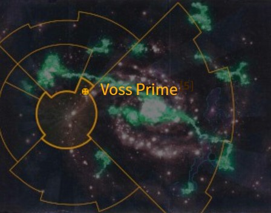
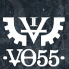
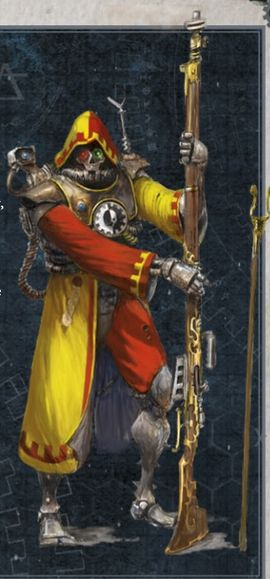
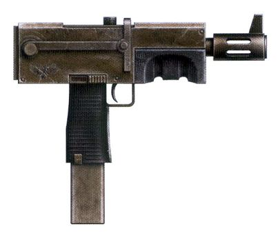
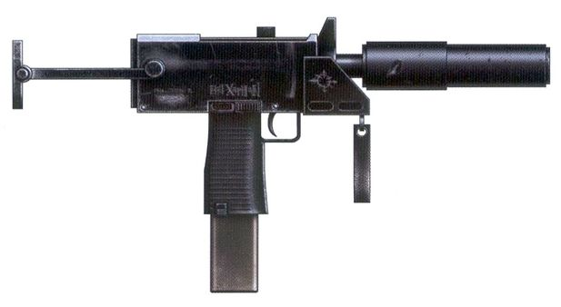
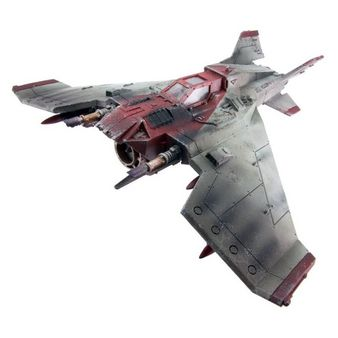

# 1007 沃斯主星 Voss Prime

精校状态：中文行文已逐段精校，部分术语仍为暂定

分类：地理 / 小行星

原文来源：https://www.bilibili.com/opus/1159060889821773840

原作者：帝国神选罐头

原文时间：2026年01月18日 10:28

[返回分类目录](目录.md) · [全书目录](../../目录.md)

原篇名：沃斯一号 Voss Prime

<!-- A1007-B0001 图片 -->

<!-- A1007-B0002 -->

原译文

Map 地图

**校订译文**

Map 地图

<!-- /A1007-B0002 -->

<!-- A1007-B0003 -->
### Basic Data 基本资料

原题：Basic Data 基础数据

<!-- /A1007-B0003 -->

<!-- A1007-B0004 -->
**英文原文**

Name:Voss Prime

<!-- /A1007-B0004 -->

<!-- A1007-B0005 -->

原译文

名称：沃斯一号

**校订译文**

名称：沃斯主星

<!-- /A1007-B0005 -->

<!-- A1007-B0006 -->
**英文原文**

Segmentum:Segmentum Solar

<!-- /A1007-B0006 -->

<!-- A1007-B0007 -->

原译文

星域：太阳星域

**校订译文**

星域：太阳星域

<!-- /A1007-B0007 -->

<!-- A1007-B0008 -->
**英文原文**

Sector:Armageddon Sector

<!-- /A1007-B0008 -->

<!-- A1007-B0009 -->

原译文

星区：阿玛吉多顿星区

**校订译文**

星区：阿玛吉多顿星区

<!-- /A1007-B0009 -->

<!-- A1007-B0010 -->
**英文原文**

Subsector:Voss Subsector

<!-- /A1007-B0010 -->

<!-- A1007-B0011 -->

原译文

分区：沃斯分区

**校订译文**

次星区：沃斯次星区

<!-- /A1007-B0011 -->

<!-- A1007-B0012 -->
**英文原文**

Affiliation:Imperium

<!-- /A1007-B0012 -->

<!-- A1007-B0013 -->

原译文

隶属：帝国

**校订译文**

隶属：帝国

<!-- /A1007-B0013 -->

<!-- A1007-B0014 -->
**英文原文**

Class:Forge World

<!-- /A1007-B0014 -->

<!-- A1007-B0015 -->

原译文

类别：铸造世界

**校订译文**

类别：铸造世界

<!-- /A1007-B0015 -->

<!-- A1007-B0016 -->
**英文原文**

Production Grade:II-Extremis

<!-- /A1007-B0016 -->

<!-- A1007-B0017 -->

原译文

生产等级：二级 - 高等

**校订译文**

生产等级：二级 - 高等

<!-- /A1007-B0017 -->

<!-- A1007-B0018 -->
**英文原文**

Tithe Grade:Aptus Non

<!-- /A1007-B0018 -->

<!-- A1007-B0019 -->

原译文

什一税等级：特级免税

**校订译文**

什一税等级：特级免税

<!-- /A1007-B0019 -->

<!-- A1007-B0020 -->
**英文原文**

Voss Prime, known as the Right Hand of Mars, is a Forge World and the closest such world to Armageddon. It is the homeworld of the Legio Invigilata.

<!-- /A1007-B0020 -->

<!-- A1007-B0021 -->

原译文

沃斯一号，被称为火星的右手，是一个铸造世界，也是最接近阿玛吉多顿的世界。这里是监戒军团的家园。

**校订译文**

沃斯主星素有“火星右手”之称，是距离阿玛吉多顿最近的铸造世界，也是监戒军团的家园。

**校注：** the closest such world指最近的铸造世界，非最近的任何世界。Voss Prime沿864已定沃斯主星。

<!-- /A1007-B0021 -->

<!-- A1007-B0022 图片 -->

<!-- A1007-B0023 -->

原译文

Voss Prime's emblem 沃斯一号的标志

**校订译文**

Voss Prime's emblem 沃斯主星的标志

<!-- /A1007-B0023 -->

<!-- A1007-B0024 -->
## Overview 概述

<!-- /A1007-B0024 -->

<!-- A1007-B0025 -->
**英文原文**

Voss Prime was founded during the Dark Age of Technology but was reunited with Mars following a lull in Warp Storms during the Age of Strife. Thus at the time of the Great Crusade, the new Imperium found a thriving and rich world and Voss Prime has continued to churn out massive levels of armaments and technology for Mankind. Much of their wealth can be attributed to the Mordan Belt, an asteroid belt rich in resources that also has proven to be a useful defence for the planet. Nonetheless Voss has some weaknesses: namely, it has proven unable to master plasma technology as well as other Forge Worlds have. It has not requested any aid in this deficiency, and none has been offered.

<!-- /A1007-B0025 -->

<!-- A1007-B0026 -->

原译文

沃斯一号成立于黑暗技术时代，但在纷争时代亚空间风暴的平静之后与火星重聚。因此，在大远征时期，新帝国发现了一个繁荣富裕的世界，沃斯一号继续为人类大量生产军备和技术。他们的大部分财富可以归因于摩丹带，这是一个资源丰富的小行星带，也被证明是行星的有用防御。尽管如此，沃斯仍有一些弱点：即，它已被证明无法像其他铸造世界那样掌握等离子技术。它没有要求任何援助来弥补这一不足，也没有提供任何援助。

**校订译文**

沃斯主星建于黑暗科技时代，并在纷争时代的一次亚空间风暴暂歇期间重新与火星建立联系。因此，大远征到来时，新生帝国见到的是一个繁荣富足的世界。此后，沃斯持续为人类生产海量军备与技术产品。其财富很大程度上来自资源丰富的摩丹小行星带；该带也构成了行星的有效防线。不过，沃斯同样存在短板：它对等离子技术的掌握不及其他铸造世界。它没有为此求援，也没有谁主动提供帮助。

**校注：** none has been offered指无人向沃斯提供援助，原译变成沃斯未向他人援助，施受关系错误。

<!-- /A1007-B0026 -->

<!-- A1007-B0027 图片 -->

<!-- A1007-B0028 -->

原译文

Voss Prime Skitarii 沃斯一号护教军

**校订译文**

Voss Prime Skitarii 沃斯主星护教军

<!-- /A1007-B0028 -->

<!-- A1007-B0029 -->
**英文原文**

Voss’ low orbit is full of circling slab-like rectangles made from solid adamantine, ready to be installed onto ships constructed at the forge world due to the peculiar design variations of Voss pattern ships.

<!-- /A1007-B0029 -->

<!-- A1007-B0030 -->

原译文

沃斯的低轨道充满了由坚固的精金制成的环绕的板状矩形，由于沃斯型舰船的特殊设计变化，这些矩形可以安装在铸造世界建造的舰船上。

**校订译文**

沃斯的低轨道中漂浮着大量厚重的长方形精金板。这些构件正等待安装到当地建造的舰船上，是沃斯型舰船独特设计的一部分。

<!-- /A1007-B0030 -->

<!-- A1007-B0031 -->
**英文原文**

Voss Prime possesses a number of client Forge Worlds subservient to it, including Eontar and Gorvallon.

<!-- /A1007-B0031 -->

<!-- A1007-B0032 -->

原译文

沃斯一号拥有许多从属于它的铸造世界成员，包括伊昂塔尔和戈尔瓦隆。

**校订译文**

沃斯主星拥有多个附属铸造世界，包括埃昂塔尔和戈尔瓦隆。

<!-- /A1007-B0032 -->

<!-- A1007-B0033 -->
## History 历史

<!-- /A1007-B0033 -->

<!-- A1007-B0034 -->
### Raid 突袭

<!-- /A1007-B0034 -->

<!-- A1007-B0035 -->
**英文原文**

The planet has been raided by Black Legion Chaos Terminators working with the mysterious Cypher. During the raid, they stole STC documents.

<!-- /A1007-B0035 -->

<!-- A1007-B0036 -->

原译文

这颗行星被与神秘的塞弗合作的黑色军团混沌终结者突袭。在突袭中，他们偷走了STC文件。

**校订译文**

与神秘人物塞弗合作的黑色军团混沌终结者曾突袭这里，并夺走 STC 文件。

<!-- /A1007-B0036 -->

<!-- A1007-B0037 -->
### Noctis Aeterna 永恒之夜

<!-- /A1007-B0037 -->

<!-- A1007-B0038 -->
**英文原文**

During the Noctis Aeterna, Voss was assaulted by vast Daemonic hordes. While the Mordan Belt proved an effective defence against Orks from Armageddon, the forces of Chaos were not so easily blocked. It was only thanks to their ability to rapidly repair their Cybernetica and Servitors that Voss endured.

<!-- /A1007-B0038 -->

<!-- A1007-B0039 -->

原译文

在永恒之夜期间，沃斯遭到了庞大的恶魔部落的袭击。虽然摩丹带被证明是抵御来自阿玛吉多顿的兽人的有效防御，但混沌部队并没有那么容易被阻挡。正是由于他们能够快速修复他们的智控军和机仆，沃斯才得以承受。

**校订译文**

永恒之夜期间，庞大的恶魔军势袭击沃斯。摩丹带虽然能有效抵御来自阿玛吉多顿的欧克，却难以同样阻挡混沌。沃斯依靠迅速修复智控战斗机械与机仆的能力，才得以支撑下来。

**校注：** Cybernetica在“修复”语境指智控战斗机械，非修复整个军团组织。

<!-- /A1007-B0039 -->

<!-- A1007-B0040 -->
## Voss Patterns 沃斯型号

<!-- /A1007-B0040 -->

<!-- A1007-B0041 -->
**英文原文**

Voss is known to have its own patterns of Autopistols and aircraft. Voss pattern technology is much revered across the Imperium.

<!-- /A1007-B0041 -->

<!-- A1007-B0042 -->

原译文

众所周知，沃斯有自己的自动手枪和飞行器型号。沃斯型技术在帝国中备受推崇。

**校订译文**

众所周知，沃斯有自己的自动手枪和飞行器型号。沃斯型技术在帝国中备受推崇。

<!-- /A1007-B0042 -->

<!-- A1007-B0043 图片 -->

<!-- A1007-B0044 -->

原译文

Voss pattern Mk 11 Autopistol 沃斯型Mk11自动手枪

**校订译文**

Voss pattern Mk 11 Autopistol 沃斯型 Mk 11 自动手枪

<!-- /A1007-B0044 -->

<!-- A1007-B0045 图片 -->

<!-- A1007-B0046 -->

原译文

Modified Voss pattern Mk 10 Autopistol 改进型沃斯型Mk10自动手枪

**校订译文**

Modified Voss pattern Mk 10 Autopistol 改进型沃斯 Mk 10 自动手枪

<!-- /A1007-B0046 -->

<!-- A1007-B0047 图片 -->

<!-- A1007-B0048 -->

原译文

Voss Pattern Lightning Strike Fighter 沃斯型闪电攻击战斗机

**校订译文**

Voss Pattern Lightning Strike Fighter 沃斯型闪电攻击战斗机

<!-- /A1007-B0048 -->

本篇核心术语与暂定项

以下列出本篇出现的英文原形及核心术语表用词。同形词可能指不同对象，具体词义以本篇正文和校注为准；单复数、别名和仅见于图注的名称可能尚未列入。完整候选见[术语表](../../术语表/双语术语候选.csv)。

| 英文 | 采用中文 | 状态 |
| --- | --- | --- |
| Orks | 欧克蛮人 | 官方已核对 |
| Warp | 亚空间 | 官方已核对 |
| Imperium | 帝国 | 暂定·简称 |
| Dark Age of Technology | 黑暗科技时代 | 暂定 |
| Forge World | 铸造世界 | 暂定·官方待核 |
| Black Legion | 黑色军团 | 暂定·官方待核 |
| Great Crusade | 大远征 | 暂定·官方待核 |
| Age of Strife | 纷争时代 | 暂定·官方待核 |
| STC | 标准建造模板 | 暂定·官方待核 |
| Segmentum Solar | 太阳星域 | 暂定·官方待核 |
| Segmentum | 星域 | 暂定·官方待核 |
| Sector | 星区 | 暂定·官方待核 |
| Subsector | 次星区 | 暂定·官方待核 |
| Armageddon | 阿玛吉多顿 | 暂定·官方待核 |
| Mars | 火星 | 暂定·官方待核 |
| Voss Prime | 沃斯主星 | 暂定·官方待核 |
| Aptus Non | 特级免税 | 暂定·官方待核 |
| Slab | 肉砖 | 暂定·官方待核 |
| Master | 导师（审判庭职衔）／舰务官（舰员职务） | 语境定译·官方待核 |
| Terminators | 终结者 | 暂定·官方待核 |
| Cypher | 塞弗 | 官方已核对 |
| The Dark | 《黑暗》 | 暂定·官方待核 |
| Eontar | 埃昂塔尔 | 暂定·官方待核 |
| Gorvallon | 戈尔瓦隆 | 暂定·官方待核 |
| Voss | 沃斯 | 暂定·官方待核 |
| Noctis Aeterna | 永恒之夜 | 暂定·官方待核 |
| Mordan Belt | 摩丹带 | 暂定·官方待核 |
| Legio Invigilata | 监戒军团 | 暂定·官方待核 |
| Armageddon Sector | 阿玛吉多顿星区 | 暂定·官方待核 |

