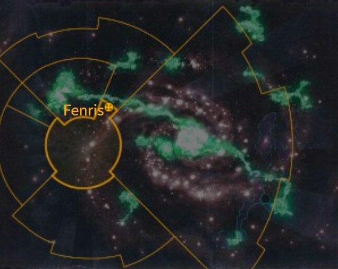
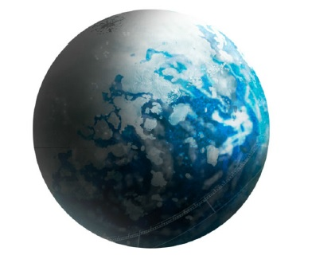

# 1008 芬里斯 Fenris

精校状态：中文行文已逐段精校，部分术语仍为暂定

分类：地理 / 小行星

原文来源：https://www.bilibili.com/opus/1095563096842305561

原作者：帝国神选罐头

原文时间：2025年07月31日 07:44

[返回分类目录](目录.md) · [全书目录](../../目录.md)

<!-- A1008-B0001 图片 -->

<!-- A1008-B0002 -->

原译文

Map 地图

**校订译文**

Map 地图

<!-- /A1008-B0002 -->

<!-- A1008-B0003 -->
### Basic Data 基本资料

原题：Basic Data 基础信息

<!-- /A1008-B0003 -->

<!-- A1008-B0004 -->
**英文原文**

Name:Fenris

<!-- /A1008-B0004 -->

<!-- A1008-B0005 -->

原译文

名称：芬里斯

**校订译文**

名称：芬里斯

<!-- /A1008-B0005 -->

<!-- A1008-B0006 -->
**英文原文**

Segmentum:Segmentum Solar

<!-- /A1008-B0006 -->

<!-- A1008-B0007 -->

原译文

星域：太阳星域

**校订译文**

星域：太阳星域

<!-- /A1008-B0007 -->

<!-- A1008-B0008 -->
**英文原文**

Sector:Fenris Sector

<!-- /A1008-B0008 -->

<!-- A1008-B0009 -->

原译文

星区：芬里斯星区

**校订译文**

星区：芬里斯星区

<!-- /A1008-B0009 -->

<!-- A1008-B0010 -->
**英文原文**

Subsector:Svarteldari Sub-Sector

<!-- /A1008-B0010 -->

<!-- A1008-B0011 -->

原译文

分区：斯瓦特尔达里分区

**校订译文**

次星区：斯瓦特尔达里次星区

<!-- /A1008-B0011 -->

<!-- A1008-B0012 -->
**英文原文**

System:Fenris System

<!-- /A1008-B0012 -->

<!-- A1008-B0013 -->

原译文

星系：芬里斯星区

**校订译文**

星系：芬里斯星系

<!-- /A1008-B0013 -->

<!-- A1008-B0014 -->
**英文原文**

Population:~3,400,000 (Pre-Siege)

<!-- /A1008-B0014 -->

<!-- A1008-B0015 -->

原译文

人口：~340,0000（围城前）

**校订译文**

人口：约340万（围城前）

**校注：** 英文人口为3,400,000，即约340万；原数字分组不规范，修正书写。

<!-- /A1008-B0015 -->

<!-- A1008-B0016 -->
**英文原文**

Affiliation:Imperium (Space Wolves)

<!-- /A1008-B0016 -->

<!-- A1008-B0017 -->

原译文

隶属：帝国（太空野狼）

**校订译文**

隶属：帝国（太空野狼）

<!-- /A1008-B0017 -->

<!-- A1008-B0018 -->
**英文原文**

Class:Adeptus Astartes Homeworld, Feral World, Death World

<!-- /A1008-B0018 -->

<!-- A1008-B0019 -->

原译文

级别：阿斯塔特修会家园世界，蛮荒世界，死亡世界

**校订译文**

级别：阿斯塔特修会家园世界，蛮荒世界，死亡世界

<!-- /A1008-B0019 -->

<!-- A1008-B0020 -->
**英文原文**

Tithe Grade:Solutio Exceptius

<!-- /A1008-B0020 -->

<!-- A1008-B0021 -->

原译文

什一税等级：第三级高等

**校订译文**

什一税等级：Solutio Exceptius（中文等级待核）

**校注：** 英文为Solutio Exceptius，而原“第三级高等”在本稿其他等级表对应Solutio Extremis。尚无足够依据确定此变体等级，保留英文并标待核，不擅替换成另一税级。

<!-- /A1008-B0021 -->

<!-- A1008-B0022 图片 -->

<!-- A1008-B0023 -->

原译文

Planetary Image 行星图像

**校订译文**

Planetary Image 行星图像

<!-- /A1008-B0023 -->

<!-- A1008-B0024 -->
**英文原文**

Fenris is the homeworld of the Space Wolves Space Marine Chapter and their Fortress-Monastery, The Fang. It is located relatively close to the Eye of Terror.

<!-- /A1008-B0024 -->

<!-- A1008-B0025 -->

原译文

芬里斯是太空野狼星际战士战团的家园世界和他们的堡垒修道院长牙堡所在地。它相对靠近恐惧之眼。

**校订译文**

芬里斯是太空野狼星际战士战团的家园世界和他们的要塞修道院长牙堡所在地。它相对靠近恐惧之眼。

<!-- /A1008-B0025 -->

<!-- A1008-B0026 -->
## History 历史

<!-- /A1008-B0026 -->

<!-- A1008-B0027 -->
**英文原文**

During the Dark Age of Technology Fenris was colonised by Humanity. The Emperor described the world as a "relic from before the days of Old Night". The planet proved difficult for the colonists, who scrapped their vessels in order to build shelters.

<!-- /A1008-B0027 -->

<!-- A1008-B0028 -->

原译文

在黑暗技术时代，芬里斯被人类殖民。帝皇将世界描述为“旧夜之前的遗迹”。事实证明，这个行星对殖民者来说很困难，他们为了建造避难所而报废了舰船。

**校订译文**

黑暗科技时代，人类在芬里斯建立殖民地。帝皇将其形容为“旧夜之前的遗迹”。当地环境极其恶劣，殖民者不得不拆解自己的飞船，利用材料建造避难所。

<!-- /A1008-B0028 -->

<!-- A1008-B0029 -->
**英文原文**

During the Age of Strife: Fenris regressed to a pre-industrial state.

<!-- /A1008-B0029 -->

<!-- A1008-B0030 -->

原译文

在纷争时代：芬里斯倒退到工业化前的状态。

**校订译文**

纷争时代：芬里斯退回工业化之前的社会状态。

<!-- /A1008-B0030 -->

<!-- A1008-B0031 -->
**英文原文**

M30: Leman Russ arrived on Fenris and was raised by a She-Wolf before being taken in by its inhabitants. He eventually managed to become King of Fenris before the Emperor arrived. Fenris joined the Imperium and Russ took part in the Great Crusade.

<!-- /A1008-B0031 -->

<!-- A1008-B0032 -->

原译文

黎曼·鲁斯抵达芬里斯，被一只母狼抚养长大，随后被其居民收留。他最终在帝皇到来之前成为了芬里斯之王。芬里斯加入了帝国，鲁斯参加了大远征。

**校订译文**

M30：黎曼·鲁斯降临芬里斯，最初由一只母狼抚养，后来被当地人收留。帝皇到来之前，他已成为芬里斯之王。随后，芬里斯加入帝国，鲁斯投身大远征。

**校注：** 补回原译遗漏的纪年；后续M31、M32、444.M41、641.M41、886.M41、999.M41与M42亦逐条补回。

<!-- /A1008-B0032 -->

<!-- A1008-B0033 -->
**英文原文**

M31: Russ went missing on Fenris after the Horus Heresy.

<!-- /A1008-B0033 -->

<!-- A1008-B0034 -->

原译文

在荷鲁斯叛乱之后，鲁斯在芬里斯失踪了。

**校订译文**

M31：荷鲁斯之乱后，鲁斯在芬里斯失踪。

<!-- /A1008-B0034 -->

<!-- A1008-B0035 -->
**英文原文**

M32: Battle of the Fang — Fenris was attacked by the Thousand Sons as revenge for the Burning of Prospero.

<!-- /A1008-B0035 -->

<!-- A1008-B0036 -->

原译文

长牙堡之战 - 芬里斯被千子袭击，作为对普洛斯佩罗之焚的报复。

**校订译文**

M32：长牙之战——千子袭击芬里斯，报复普罗斯佩罗之焚。

<!-- /A1008-B0036 -->

<!-- A1008-B0037 -->
**英文原文**

Plague of Unbelief — Fenris was the last planet attacked by Cardinal Bucharis in his conquest of a minor empire.

<!-- /A1008-B0037 -->

<!-- A1008-B0038 -->

原译文

无信瘟疫 — 芬里斯是红衣主教布加勒斯征服一个小帝国时袭击的最后一颗行星。

**校订译文**

无信瘟疫：芬里斯是枢机主教布加勒斯扩张自己小帝国时进攻的最后一颗星球。

<!-- /A1008-B0038 -->

<!-- A1008-B0039 -->
**英文原文**

444.M41: Months of Shame — The dispute between the Inquisition and Space Wolves after the First War for Armageddon culminated in a short battle in orbit over the planet.

<!-- /A1008-B0039 -->

<!-- A1008-B0040 -->

原译文

耻辱之月 — 第一次阿玛吉多顿战争后，审判庭和太空野狼之间的争端在行星轨道上的一场短暂战斗中达到高潮。

**校订译文**

444.M41：耻辱之月——第一次阿玛吉多顿战争后，审判庭与太空野狼的争端最终演变成芬里斯轨道上的一场短暂交战。

<!-- /A1008-B0040 -->

<!-- A1008-B0041 -->
**英文原文**

641.M41: Fenris is raided by a collection of Dark Eldar Kabals led by Duke Traevelliath Sliscus and his warband, the Sky Serpents. The Dark Eldar were driven off with significant losses but managed to capture a number of tribesmen and Space Wolf aspirants from Asaheim as slaves.

<!-- /A1008-B0041 -->

<!-- A1008-B0042 -->

原译文

芬里斯遭到了由特拉维利亚斯·斯莱斯库斯公爵和他的战帮，天蛇领导的黑暗灵族海盗的突袭。黑暗灵族在遭受重大损失后被赶走，但设法从阿萨海姆俘虏了一些部落成员和太空野狼的有志者作为奴隶。

**校订译文**

641.M41：特拉维利亚斯·斯里斯克斯公爵及其战帮“天空之蛇”率领多个黑暗灵族阴谋团袭击芬里斯。来犯者付出惨重代价后被击退，却仍从阿萨海姆掳走一些部落居民与太空野狼候选者，充作奴隶。

<!-- /A1008-B0042 -->

<!-- A1008-B0043 -->
**英文原文**

886.M41: Fenris Incident — The Ecclesiarchy arrived on Fenris to try and confirm if the Space Wolves worship false gods. The attempt provoked a war that lasted three weeks.

<!-- /A1008-B0043 -->

<!-- A1008-B0044 -->

原译文

芬里斯事件 — 国教来到芬里斯，试图确认太空野狼是否崇拜伪神。这一企图引发了一场持续三周的战争。

**校订译文**

886.M41：芬里斯事件——国教会来到芬里斯，试图查明太空野狼是否崇拜伪神，引发了一场持续三周的战争。

<!-- /A1008-B0044 -->

<!-- A1008-B0045 -->
**英文原文**

999.M41: Siege of the Fenris System — As the entire Fenris System was assailed by Chaos forces, Fenris itself was bombarded by a Dark Angels-led coalition. Ultimately much of the world was subjected to a massive Thousand Sons and Daemonic invasion led by Magnus himself before the Space Wolves under Logan Grimnar triumphed. Much of Fenris' tribal population was liquidated by the Ordo Malleus in the aftermath for witnessing a Daemon Primarch.

<!-- /A1008-B0045 -->

<!-- A1008-B0046 -->

原译文

围攻芬里斯星系 — 当整个芬里斯星系受到混沌势力的攻击时，芬里斯本身也受到了黑暗天使领导的联盟的轰炸。最终，在罗根·格里姆纳尔领导的太空野狼获胜之前，世界大部分地区都遭受了马格努斯本人领导的千子和恶魔的大规模入侵。芬里斯的大部分部落人口在目睹恶魔原体后被圣锤修会清洗。

**校订译文**

999.M41：芬里斯星系围城战——整个星系遭到混沌攻击时，芬里斯本身也被黑暗天使率领的联军轰炸。随后，马格努斯亲率千子与恶魔大举入侵，战火遍及大部分地区，最终被洛根·格里姆纳尔统率的太空野狼击败。战后，恶魔审判庭因当地人目睹恶魔原体，而清洗了大批部落居民。

<!-- /A1008-B0046 -->

<!-- A1008-B0047 -->
**英文原文**

M42: The Fang was unsuccessfully raided by the Haemonculus Khaeghris Xhakt.

<!-- /A1008-B0047 -->

<!-- A1008-B0048 -->

原译文

血伶人哈格里斯·沙克特袭击长牙堡失败。

**校订译文**

M42：血伶人哈格里斯·沙克特袭击长牙堡，未能得手。

<!-- /A1008-B0048 -->

<!-- A1008-B0049 -->
## Geography 地理

<!-- /A1008-B0049 -->

<!-- A1008-B0050 -->
**英文原文**

A planet of fire and ice, Fenris orbits its sun once every 3-4 Terran years. During the summer months volcanoes erupt, burning great areas with lava flows and churning the seas, spreading great floods and tidal waves. As the planet enters its long winter, the temperature drops so far that most of it actually ices over, giving the planet the appearance of a snowball from orbit.

<!-- /A1008-B0050 -->

<!-- A1008-B0051 -->

原译文

作为一颗火与冰的行星，芬里斯每3-4泰拉年绕太阳一周。在夏季的几个月里，火山爆发，熔岩流燃烧大片地区，搅动大海，引发大洪水和海啸。随着这颗行星进入漫长的冬季，温度下降到大部分地区实际上都结冰了，使这颗行星在轨道上看起来像一个雪球。

**校订译文**

芬里斯是一颗冰火交织的星球，每三至四个泰拉年绕恒星运行一周。夏季，火山喷发，熔岩焚毁大片区域、搅动海洋，引发洪水与巨浪。漫长冬季到来后，温度骤降，绝大多数地区冰封，从轨道望去如同一个雪球。

<!-- /A1008-B0051 -->

<!-- A1008-B0052 -->
**英文原文**

Apart from a single area of the planet that is permanently land-locked, Fenris is a world of shifting geography and mostly oceans. Numerous asteroid strikes, mutable coastlines and even swiftly risen or sunk island masses have resulted in the population becoming one of largely nomadic barbarian tribes. The tribes constantly seek secure territory, and as a result skirmishes and feuds over land between rival tribes are common. The people are hardened to the changes in temperature and extremes, and so is the fauna. The only continent that remains constant is Asaheim, standing on top of the crest of the world. During the summer, it is covered in lava and magma flows, but is habitable during the winter.

<!-- /A1008-B0052 -->

<!-- A1008-B0053 -->

原译文

除了行星上一个永久性内陆地区外，芬里斯是一个地理变化的世界，主要是海洋。无数的小行星撞击、多变的海岸线，甚至迅速上升或沉没的岛屿群，都导致当地人口成为主要游牧的野蛮部落之一。部落不断寻求安全的领土，因此，敌对部落之间就土地问题发生的小规模冲突和争斗很常见。人们对温度和极端天气的变化已经习以为常，动物也是如此。唯一保持不变的大陆是阿萨海姆，它位于世界之巅。在夏季，它被熔岩和岩浆流覆盖，但在冬季可以居住。

**校订译文**

除了唯一一片始终稳定的陆地，芬里斯大多被海洋覆盖，地貌不断变化。频繁的小行星撞击、变动不居的海岸线，以及迅速隆起或沉没的岛屿，使居民大多以迁徙不定的蛮荒部落形式生活。各部落不断寻找安全的土地，争夺地盘引发的冲突与世仇十分常见。居民和当地动物都已适应剧烈的气温变化与极端环境。唯一始终稳定的大陆是位于世界顶部的阿萨海姆；夏季，它被熔岩与岩浆流覆盖，冬季才适宜居住。

**校注：** 原文land-locked在此措辞不够精确；结合后文唯一稳定大陆，按地貌不随季节沉没变化理解，未擅增内陆国概念。

<!-- /A1008-B0053 -->

<!-- A1008-B0054 -->
**英文原文**

The central sea of Fenris is the Savage Sea or Worldsea, home to most of the planet's wildlife, most of which are vicious sea creatures. Nonetheless the sea provides most of the planet's inhabitants with their food.

<!-- /A1008-B0054 -->

<!-- A1008-B0055 -->

原译文

芬里斯的中心海洋是野蛮之海或世界之海，是行星上大多数野生动物的家园，其中大多数是凶猛的海洋生物。尽管如此，海洋还是为行星上的大多数居民提供了食物。

**校订译文**

芬里斯中央的大洋称为野蛮之海，又称世界之海。星球上大多数野生动物都生活于此，其中多为凶猛的海兽。尽管危险，这片海洋仍为大多数居民提供食物。

<!-- /A1008-B0055 -->

<!-- A1008-B0056 -->
## Notable Locations 著名地点

<!-- /A1008-B0056 -->

<!-- A1008-B0057 -->
**英文原文**

Asaheim — The only stable continent on Fenris, located on its northern pole. Here there are many unique creatures not seen elsewhere on the world such as bears, elks, mastodons, ice trolls, shape-shifting dopplegangrels, and ice wyrms. Asaheim is surrounded by cliffs thousands of feet high, separating it from the rest of the planet. The tribesmen of Fenris consider it the land of the Gods.

<!-- /A1008-B0057 -->

<!-- A1008-B0058 -->

原译文

阿萨海姆 — 芬里斯上唯一稳定的大陆，位于其北极。这里有许多世界上其他地方看不到的独特生物，如熊、麋鹿、乳齿象、冰巨魔、变形幻身怪和冰龙。阿萨海姆被数千英尺高的悬崖环绕，将其与行星其他地区隔开。芬里斯的部落成员认为这里是众神之地。

**校订译文**

阿萨海姆：芬里斯唯一稳定的大陆，位于北极。这里生活着其他地区没有的多种生物，包括熊、麋鹿、乳齿象、冰巨魔、变形幻身怪和冰龙。环绕大陆的是数千英尺高的峭壁，将它与其余地区隔开。芬里斯部落居民视之为众神之地。

<!-- /A1008-B0058 -->

<!-- A1008-B0059 -->
**英文原文**

The Seven Great Peaks of Asaheim:

<!-- /A1008-B0059 -->

<!-- A1008-B0060 -->

原译文

阿萨海姆的七大山峰：

**校订译文**

阿萨海姆的七大山峰：

<!-- /A1008-B0060 -->

<!-- A1008-B0061 -->
**英文原文**

Allfather's Peak: The site where Leman Russ initially landed on Fenris.

<!-- /A1008-B0061 -->

<!-- A1008-B0062 -->

原译文

全父之峰：黎曼·鲁斯最初登陆芬里斯的地方。

**校订译文**

全父之峰：黎曼·鲁斯最初登陆芬里斯的地方。

<!-- /A1008-B0062 -->

<!-- A1008-B0063 -->

原译文

Ammagrimgul 阿玛格林古尔

**校订译文**

Ammagrimgul 阿玛格林古尔

<!-- /A1008-B0063 -->

<!-- A1008-B0064 -->

原译文

Asfryk 阿斯弗里克

**校订译文**

Asfryk 阿斯弗里克

<!-- /A1008-B0064 -->

<!-- A1008-B0065 -->

原译文

Broddja 布罗德加

**校订译文**

Broddja 布罗德加

<!-- /A1008-B0065 -->

<!-- A1008-B0066 -->

原译文

Friemiaki 弗里米亚基

**校订译文**

Friemiaki 弗里米亚基

<!-- /A1008-B0066 -->

<!-- A1008-B0067 -->

原译文

Krakgard 克拉克加德

**校订译文**

Krakgard 克拉克加德

<!-- /A1008-B0067 -->

<!-- A1008-B0068 -->

原译文

Tror 特罗尔

**校订译文**

Tror 特罗尔

<!-- /A1008-B0068 -->

<!-- A1008-B0069 -->
**英文原文**

The Fang - Fortress-Monastery of the Space Wolves. Located in the centre of the peaks.

<!-- /A1008-B0069 -->

<!-- A1008-B0070 -->

原译文

长牙堡 - 太空野狼堡垒修道院。位于山峰的中心。

**校订译文**

长牙堡：太空野狼的要塞修道院，坐落于群峰中央。

<!-- /A1008-B0070 -->

<!-- A1008-B0071 -->
**英文原文**

Worldsea or Savage Sea - Fenris' single enormous ocean, home to many sea monsters and other dreadful creatures. It experiences constant and violent weather fluctuations such as ice storms and hurricanes.

<!-- /A1008-B0071 -->

<!-- A1008-B0072 -->

原译文

世界之海或野蛮之海 - 芬里斯的一片巨大海洋，是许多海怪和其他可怕生物的家园。它经历了持续而剧烈的天气波动，如冰风暴和飓风。

**校订译文**

世界之海，又称野蛮之海：芬里斯唯一的浩瀚大洋，是众多海怪与恐怖生物的栖息地。冰暴、飓风等猛烈天气变化持续不断。

<!-- /A1008-B0072 -->

<!-- A1008-B0073 -->
**英文原文**

Island of the Iron Masters - Home to a tribe with a level of technology that includes iron weapons and steam engines. Fenrisians make difficult journeys to travel and trade with the Iron Masters, who maintain formidable forces to deter any pirates. The Iron Masters will sometimes train with Space Wolves Aspirants and Chapter Serfs.

<!-- /A1008-B0073 -->

<!-- A1008-B0074 -->

原译文

钢铁大师岛 - 一个拥有钢铁武器和蒸汽机等技术水平的部落的家园。芬里斯人艰难地与钢铁大师通行和贸易，钢铁大师拥有强大的力量来威慑任何海盗。钢铁大师有时会与太空野狼的有志者和战团仆役一起训练。

**校订译文**

钢铁大师岛：岛上部落掌握铁制武器与蒸汽机技术。其他芬里斯人长途跋涉，冒险前来与钢铁大师贸易；后者拥有强大武力，足以震慑海盗。钢铁大师有时还会与太空野狼候选者及战团农奴一起训练。

<!-- /A1008-B0074 -->

<!-- A1008-B0075 -->
**英文原文**

Kraken's Spur - A volcanic island that periodically rises and sinks. It is home to a Kraken graveyard, making it a site of potential plunder for Fenrisians while it is surfaced.

<!-- /A1008-B0075 -->

<!-- A1008-B0076 -->

原译文

克拉肯之刺 - 一个周期性上升和下降的火山岛。它是一个海怪墓地的所在地，使其在浮出水面时成为芬里斯人可能掠夺的地点。

**校订译文**

克拉肯之刺：一座周期性升出海面又沉没的火山岛，岛上有克拉肯的墓场，每逢浮出水面便吸引芬里斯人前来搜寻战利品。

<!-- /A1008-B0076 -->

<!-- A1008-B0077 -->
**英文原文**

Cavern Cities - These subterranean cities were built in Fenris' northern pole by the first Human colonists. Built from the remains of their colonisation vessels, they became a shelter during the Age of Strife but were ultimately abandoned for unknown reasons, though worship of Chaos, mutation, and the unleashing of ancient weaponry are all proposed. The remaining settlers inside eventually mutated into horrific monsters known as "nightgangers". Leman Russ later forbade any from entering the caverns. Deep within the caverns is an ancient temple of Tzeentch built by the Nightgangers.

<!-- /A1008-B0077 -->

<!-- A1008-B0078 -->

原译文

洞穴城市 - 这些地下城市是由第一批人类殖民者在芬里斯的北极建造的。它们由殖民船的残骸建造而成，在纷争时代成为避难所，但最终因未知原因被遗弃，尽管人们都提出了对混沌、突变和释放古代武器的崇拜。里面剩下的定居者最终变成了被称为“夜行者”的可怕怪物。黎曼·鲁斯后来禁止任何人进入洞穴。在洞穴深处是一座由夜行者建造的古老神殿。

**校订译文**

洞穴城市：最初的人类殖民者用殖民船残骸，在芬里斯北极建起这些地下城市。它们曾在纷争时代充当避难所，后来却因不明原因遭到废弃；可能的解释包括混沌崇拜、变异，或古代武器被释放。仍留在其中的居民最终化为可怕的“夜行者”。黎曼·鲁斯后来禁止任何人进入这些洞穴。洞穴深处还有一座由夜行者建造的古老奸奇神殿。

**校注：** 混沌崇拜、变异与释放古代武器是并列的废弃原因假说，不是都属于崇拜对象。补回原译遗漏的Tzeentch奸奇。

<!-- /A1008-B0078 -->

<!-- A1008-B0079 -->
**英文原文**

Fire Breather - Active and violent volcano.

<!-- /A1008-B0079 -->

<!-- A1008-B0080 -->

原译文

火焰呼吸 - 活跃而猛烈的火山。

**校订译文**

喷火者：一座活动剧烈的活火山。

<!-- /A1008-B0080 -->

<!-- A1008-B0081 -->
**英文原文**

Thunder Mountain - Stable peak mounted with great rune stones. Home of the Thunderfist tribe.

<!-- /A1008-B0081 -->

<!-- A1008-B0082 -->

原译文

雷霆山脉 — 一座有巨大符文石的稳固山峰。雷拳部落的家园。

**校订译文**

雷霆山：一座地质稳定的山峰，山上立有巨大符文石，是雷拳部落的家园。

<!-- /A1008-B0082 -->

<!-- A1008-B0083 -->
**英文原文**

Syrtyr's Door — A volcanic cavern with mystical properties, considered by the people of Fenris to be the door to the Underverse.

<!-- /A1008-B0083 -->

<!-- A1008-B0084 -->

原译文

瑟蒂尔之门 — 一个具有神秘特性的火山洞穴，被芬里斯人认为是通往地下世界的门。

**校订译文**

瑟蒂尔之门：具有神秘特性的火山洞穴，芬里斯人视其为通往下界的门户。

<!-- /A1008-B0084 -->

<!-- A1008-B0085 -->
**英文原文**

Valley of Burning Stones - An ominous valley with a dark reputation. Its Tribe, the Vulture Clan, would chain sacrificial offerings to the rocks above their settlement and set them alight. After Psykers in the Clan were discovered, they were mostly purged by the Space Wolves.

<!-- /A1008-B0085 -->

<!-- A1008-B0086 -->

原译文

燃烧石之谷 - 一个不祥的山谷，有着黑暗的名声。它的部落，秃鹫氏族，会把祭品链在定居点上方的岩石上，然后点燃。在氏族中的灵能者被发现后，他们大多被太空野狼清除。

**校订译文**

燃烧石之谷：一座声名不祥的阴森山谷。当地秃鹫氏族会把祭品锁在聚落上方的岩石上，再放火焚烧。氏族中的灵能者被发现后，大部分族人遭太空野狼清洗。

**校注：** they在此按氏族居民理解；原文未进一步区分被清洗者是否全部都是灵能者。

<!-- /A1008-B0086 -->

<!-- A1008-B0087 -->
**英文原文**

Iron Isles - Range of volcanic mountains that serve as the forge for Space Wolves Rune Priests.

<!-- /A1008-B0087 -->

<!-- A1008-B0088 -->

原译文

钢铁群岛 - 一系列火山山脉，是太空野狼符文牧师的铸造场。

**校订译文**

钢铁群岛 - 一系列火山山脉，是太空野狼符文牧师的铸造场。

<!-- /A1008-B0088 -->

<!-- A1008-B0089 -->
## Flora and Fauna 动植物群

<!-- /A1008-B0089 -->

<!-- A1008-B0090 -->
**英文原文**

Because of its harsh conditions, there is little native plant life on Fenris. Many studies have concluded that Fenrisian animals are the most dangerous on any planet, even more so than those on Catachan.

<!-- /A1008-B0090 -->

<!-- A1008-B0091 -->

原译文

由于其恶劣的条件，芬里斯上几乎没有本土植物。许多研究得出结论，芬里斯动物是任何行星上最危险的，甚至比卡塔昌上的动物更危险。

**校订译文**

芬里斯环境恶劣，本土植物极少。许多研究认为，当地动物是所有已知世界中最危险的，甚至超过卡塔昌的生物。

<!-- /A1008-B0091 -->

<!-- A1008-B0092 -->
### Flora 植物群

<!-- /A1008-B0092 -->

<!-- A1008-B0093 -->

原译文

Ekka Pine 埃卡松树

**校订译文**

Ekka Pine 埃卡松树

<!-- /A1008-B0093 -->

<!-- A1008-B0094 -->
**英文原文**

Fangtree: a tree native to Fenris that is used by both the tribes and inhabitants of The Fang in craftsmanship.

<!-- /A1008-B0094 -->

<!-- A1008-B0095 -->

原译文

獠牙树：一种原产于芬里斯的树，被长牙堡的部落和居民用于技艺。

**校订译文**

獠牙树：芬里斯本土树木，部落居民与长牙堡住民都会将其用作手工制作的材料。

<!-- /A1008-B0095 -->

<!-- A1008-B0096 -->
**英文原文**

Vitae Vine: a carnivorous crystalline weed

<!-- /A1008-B0096 -->

<!-- A1008-B0097 -->

原译文

生命藤蔓：一种食肉的晶状杂草

**校订译文**

生命藤蔓：一种食肉的晶状杂草

<!-- /A1008-B0097 -->

<!-- A1008-B0098 -->
### Fauna 动物群

<!-- /A1008-B0098 -->

<!-- A1008-B0099 -->
**英文原文**

Bloodlice: Vermin that dwell in the carcasses of small animals.

<!-- /A1008-B0099 -->

<!-- A1008-B0100 -->

原译文

血冰：寄生在小动物尸体上的害虫。

**校订译文**

血虱：栖居于小动物尸体中的害虫。

**校注：** lice为虱，原“血冰”误读。

<!-- /A1008-B0100 -->

<!-- A1008-B0101 -->

原译文

Cave Bear 穴熊

**校订译文**

Cave Bear 穴熊

<!-- /A1008-B0101 -->

<!-- A1008-B0102 -->
**英文原文**

Drakes: Mighty, dragon-like creatures that circle above geothermal vents for warmth.

<!-- /A1008-B0102 -->

<!-- A1008-B0103 -->

原译文

飞龙：强大的龙状生物，在地热喷口上方盘旋取暖。

**校订译文**

飞龙：强大的龙状生物，在地热喷口上方盘旋取暖。

<!-- /A1008-B0103 -->

<!-- A1008-B0104 -->
**英文原文**

Fathom Whales: Thousands of these creatures teem the polar shores to spawn.

<!-- /A1008-B0104 -->

<!-- A1008-B0105 -->

原译文

寻鲸：成千上万的这种生物在极地海岸繁衍生息。

**校订译文**

寻鲸：繁殖季节，成千上万头聚集在极地海岸。

**校注：** 沿原译寻鲸；fathom可指测深长度单位，不按动词“寻找”展开。

<!-- /A1008-B0105 -->

<!-- A1008-B0106 -->
**英文原文**

Fenrisian Elk: Mammals with razor-sharp antlers.

<!-- /A1008-B0106 -->

<!-- A1008-B0107 -->

原译文

芬里斯麋鹿：鹿角如剃刀般锋利的哺乳动物。

**校订译文**

芬里斯麋鹿：鹿角如剃刀般锋利的哺乳动物。

<!-- /A1008-B0107 -->

<!-- A1008-B0108 -->
**英文原文**

Fenrisian Ice Fiend: Giant creatures twice the height of a Space Marine that bleed acidic blood.

<!-- /A1008-B0108 -->

<!-- A1008-B0109 -->

原译文

芬里斯冰魔：两倍于星际战士高度的巨型生物，会分泌酸性血液。

**校订译文**

芬里斯冰魔：身高达到星际战士两倍的巨兽，流出的血液带有酸性。

<!-- /A1008-B0109 -->

<!-- A1008-B0110 -->
**英文原文**

Fenrisian Mammoth: A single beast can crush a man in moments.

<!-- /A1008-B0110 -->

<!-- A1008-B0111 -->

原译文

芬里斯猛犸象：一头可以瞬间粉碎一个人的野兽。

**校订译文**

芬里斯猛犸象：一头便能在片刻间将人碾碎的巨兽。

<!-- /A1008-B0111 -->

<!-- A1008-B0112 -->
**英文原文**

Fenrisian Wolf: Among the most cunning and deadly predators in the galaxy, these wolves are capable of growing from the size of a small horse to that of an APC.

<!-- /A1008-B0112 -->

<!-- A1008-B0113 -->

原译文

芬里斯狼：在银河系中最狡猾和致命的掠食者中，这些狼能够从小马的大小成长为装甲运兵车的大小。

**校订译文**

芬里斯狼：银河中最狡猾、最致命的捕食者之一，体型可从小型马匹大小长到装甲运兵车般庞大。

<!-- /A1008-B0113 -->

<!-- A1008-B0114 -->

原译文

Frost Mastodon 霜冻乳齿象

**校订译文**

Frost Mastodon 霜冻乳齿象

<!-- /A1008-B0114 -->

<!-- A1008-B0115 -->
**英文原文**

Frost Wolf: Prefers to clamp its prey in massive jaws and shake its apart.

<!-- /A1008-B0115 -->

<!-- A1008-B0116 -->

原译文

霜狼：喜欢用巨大的下颚夹住猎物，然后摇晃分开。

**校订译文**

霜狼：惯于用巨颚咬住猎物，再猛烈甩动，将其撕碎。

<!-- /A1008-B0116 -->

<!-- A1008-B0117 -->

原译文

Frostlion 霜狮

**校订译文**

Frostlion 霜狮

<!-- /A1008-B0117 -->

<!-- A1008-B0118 -->

原译文

Fyre Drake 火龙

**校订译文**

Fyre Drake 火龙

<!-- /A1008-B0118 -->

<!-- A1008-B0119 -->

原译文

Giants 巨人

**校订译文**

Giants 巨人

<!-- /A1008-B0119 -->

<!-- A1008-B0120 -->
**英文原文**

Giant Yaks: Their fur is used to make the felts used as dampers in the magazines of the Space Wolves' void fleet.

<!-- /A1008-B0120 -->

<!-- A1008-B0121 -->

原译文

巨型牦牛：它们的皮毛被用来制作毛毡，用作太空野狼虚空舰队弹匣的减震器。

**校订译文**

巨型牦牛：毛皮可制成毛毡，用于太空野狼虚空舰队弹药库的减震衬垫。

**校注：** magazines在舰船语境指弹药库，而非手持武器弹匣。

<!-- /A1008-B0121 -->

<!-- A1008-B0122 -->
**英文原文**

Great White Bears: Massive creatures capable of destroying buildings.

<!-- /A1008-B0122 -->

<!-- A1008-B0123 -->

原译文

大白熊：能够摧毁建筑物的巨大生物。

**校订译文**

大白熊：能够摧毁建筑物的巨大生物。

<!-- /A1008-B0123 -->

<!-- A1008-B0124 -->
**英文原文**

Hoggorm: Extremely venomous serpents.

<!-- /A1008-B0124 -->

<!-- A1008-B0125 -->

原译文

霍格戈姆：剧毒的蛇。

**校订译文**

霍格戈姆：剧毒的蛇。

<!-- /A1008-B0125 -->

<!-- A1008-B0126 -->

原译文

Ice Mammoth 冰原猛犸象

**校订译文**

Ice Mammoth 冰原猛犸象

<!-- /A1008-B0126 -->

<!-- A1008-B0127 -->

原译文

Ice Troll 冰巨魔

**校订译文**

Ice Troll 冰巨魔

<!-- /A1008-B0127 -->

<!-- A1008-B0128 -->

原译文

Ice Whale 冰鲸

**校订译文**

Ice Whale 冰鲸

<!-- /A1008-B0128 -->

<!-- A1008-B0129 -->

原译文

Ice Wyrm 冰龙

**校订译文**

Ice Wyrm 冰龙

<!-- /A1008-B0129 -->

<!-- A1008-B0130 -->
**英文原文**

Kraken: Gigantic sea creatures that continue to grow until they are killed, possibly the remnants of a failed Tyranid invasion.

<!-- /A1008-B0130 -->

<!-- A1008-B0131 -->

原译文

克拉肯：巨大的海洋生物，会一直生长直到被杀死，可能是泰伦入侵失败的残余。

**校订译文**

克拉肯：巨大的海洋生物，会一直生长直到被杀死，可能是泰伦入侵失败的残余。

<!-- /A1008-B0131 -->

<!-- A1008-B0132 -->

原译文

Mastodon 乳齿象

**校订译文**

Mastodon 乳齿象

<!-- /A1008-B0132 -->

<!-- A1008-B0133 -->
**英文原文**

Mountain Raptor: Fly above Fenris in flocks.

<!-- /A1008-B0133 -->

<!-- A1008-B0134 -->

原译文

高山猛禽：成群结队地在芬里斯上空飞行。

**校订译文**

高山猛禽：成群结队地在芬里斯上空飞行。

<!-- /A1008-B0134 -->

<!-- A1008-B0135 -->
**英文原文**

Orca: Mighty, horned beasts swim in the icy ocean depths. Baleen-spears are used to hunt them.

<!-- /A1008-B0135 -->

<!-- A1008-B0136 -->

原译文

杀人鲸：强大的有角动物在冰冷的海洋深处游泳。打捆的长矛被用来猎杀它们。

**校订译文**

杀人鲸：强壮的有角海兽，生活在冰冷的深海。当地人用鲸须矛猎杀它们。

**校注：** Baleen指鲸须，原“打捆”不符词义。

<!-- /A1008-B0136 -->

<!-- A1008-B0137 -->
**英文原文**

Rime Spider: Lurks in ice caves to leap onto its prey. Clever and patient creatures.

<!-- /A1008-B0137 -->

<!-- A1008-B0138 -->

原译文

白霜蜘蛛：潜伏在冰洞里跳到猎物身上。聪明而耐心的生物。

**校订译文**

白霜蜘蛛：潜伏于冰洞中，等待机会扑向猎物；聪明且极有耐心。

<!-- /A1008-B0138 -->

<!-- A1008-B0139 -->
**英文原文**

Ripperfish: Creatures capable of reducing a man to bone in seconds.

<!-- /A1008-B0139 -->

<!-- A1008-B0140 -->

原译文

开膛手鱼：能够在几秒钟内将人变成骨头的生物。

**校订译文**

开膛手鱼：能在数秒内将人啃成白骨。

<!-- /A1008-B0140 -->

<!-- A1008-B0141 -->
**英文原文**

Sea Dragon: Massive creatures that live in the Worldsea, their hides are used by nomads for ships and dwellings.

<!-- /A1008-B0141 -->

<!-- A1008-B0142 -->

原译文

海龙：生活在世界之海中的大型生物，它们的皮被游牧民族用作船只和住所。

**校订译文**

海龙：生活在世界之海的巨兽，游牧部落利用其皮建造船只与居所。

<!-- /A1008-B0142 -->

<!-- A1008-B0143 -->
**英文原文**

Snow Hart: Mysterious beast hunted by Fenrisian tribes.

<!-- /A1008-B0143 -->

<!-- A1008-B0144 -->

原译文

雪鹿：芬里斯部落猎杀的神秘野兽。

**校订译文**

雪鹿：芬里斯部落猎杀的神秘野兽。

<!-- /A1008-B0144 -->

<!-- A1008-B0145 -->
**英文原文**

Spore-Bear: Creatures that attack their prey using clubbing fists of bony spurs.

<!-- /A1008-B0145 -->

<!-- A1008-B0146 -->

原译文

孢子熊：用骨刺棍击猎物的生物。

**校订译文**

孢子熊：挥动长有骨刺的拳头，猛击猎物。

<!-- /A1008-B0146 -->

<!-- A1008-B0147 -->
**英文原文**

Storm-Elk: Found in million head herds over the tundra of Fenris.

<!-- /A1008-B0147 -->

<!-- A1008-B0148 -->

原译文

风暴麋鹿：在芬里斯苔原上的数百万头鹿群中发现。

**校订译文**

风暴麋鹿：在芬里斯苔原上成群生活，兽群可达百万头。

<!-- /A1008-B0148 -->

<!-- A1008-B0149 -->
**英文原文**

Underfangs: Wolf-like beasts.

<!-- /A1008-B0149 -->

<!-- A1008-B0150 -->

原译文

低牙：像狼一样的野兽。

**校订译文**

低牙：像狼一样的野兽。

<!-- /A1008-B0150 -->

<!-- A1008-B0151 -->
**英文原文**

Wendigore: Hunts on the glaciers of Fenris.

<!-- /A1008-B0151 -->

<!-- A1008-B0152 -->

原译文

温迪戈尔：在芬里斯冰川上狩猎。

**校订译文**

温迪戈尔：在芬里斯冰川上狩猎。

<!-- /A1008-B0152 -->

<!-- A1008-B0153 -->
**英文原文**

Wrath-badgers: Famously ill-tempered beasts.

<!-- /A1008-B0153 -->

<!-- A1008-B0154 -->

原译文

怒獾：以脾气暴躁著称的野兽。

**校订译文**

怒獾：以脾气暴躁著称的野兽。

<!-- /A1008-B0154 -->

<!-- A1008-B0155 -->
**英文原文**

Miscellaneous: Glacier Wurm, Ice Cobra, Peak Render, Razorhawk, Rot Spectre, Sabrewolf, Sea-Eagle, Snow-Blind Geist.

<!-- /A1008-B0155 -->

<!-- A1008-B0156 -->

原译文

其他：冰川亚龙、冰眼镜蛇、峰铸者、剃刀鹰、腐烂怨灵、刃狼、海鹰、雪盲鬼。

**校订译文**

其他：冰川亚龙、冰眼镜蛇、裂峰兽、剃刀鹰、腐烂怨灵、刃狼、海鹰、雪盲鬼。

**校注：** Peak Render中的Render按撕裂者语义暂译裂峰兽；原“峰铸者”误取渲染／制作含义。

<!-- /A1008-B0156 -->

<!-- A1008-B0157 -->
## Society 社会

<!-- /A1008-B0157 -->

<!-- A1008-B0158 -->
**英文原文**

The population of Fenris is small, yet hardy and tough. Fenrisians are born warriors from cradle to grave, battling not only the planetary conditions but also each other. Land is the most precious commodity of the planet, and as a result tribes frequently clash with one another for its control. Tribal fighting escalates during the Time of Ice and Fire when new landmasses can rise from the ocean. But despite these hardships, the Fenrisians consider themselves blessed, for they have a chance to join the "Dwellers Above the Clouds", the Space Wolves. The Space Wolves carefully watch their tribal brethren, but never appear openly among them. To Fenrisians the Space Wolves are known as the Sky Warriors and have a mythical status. The Fenrisians take to the seas in simple wooden sail vessels known as Dragonships.

<!-- /A1008-B0158 -->

<!-- A1008-B0159 -->

原译文

芬里斯的人口虽然少，但顽强而坚韧。芬里斯人天生就是战士，从摇篮到坟墓，不仅要与行星环境作斗争，还要与彼此作斗争。土地是行星上最珍贵的货物，因此部落之间经常为争夺土地而发生冲突。在冰与火的时代，当新的陆地可以从海洋中升起时，部落间的战斗会升级。但尽管有这些困难，芬里斯人认为自己是有福的，因为他们有机会加入“云上之民”，即太空野狼。太空野狼仔细观察他们的部落兄弟，但从未公开出现在他们中间。对于芬里斯人来说，太空野狼被称为天空战士，具有神话般的地位。芬里斯人乘坐被称为龙船的简单木制帆船出海。

**校订译文**

芬里斯人口稀少，却个个坚韧强悍。他们从出生到死亡都在战斗，既对抗星球环境，也彼此争斗。土地是最珍贵的资源，各部落常为之交战；冰火交替、海中新陆地隆起的时期，冲突尤其激烈。尽管生活艰苦，芬里斯人仍认为自己蒙受眷顾，因为他们有机会加入“云上之民”——太空野狼。战团密切观察部落同胞，却从不公开现身。在当地人的传说中，他们是具有神话地位的“天空战士”。芬里斯人平时乘坐称为龙船的简陋木帆船航海。

<!-- /A1008-B0159 -->

<!-- A1008-B0160 -->
**英文原文**

From a Fenrisian perspective, prospective candidates are mainly chosen from young warriors who fall in battle with grievous wounds, or perform prodigious feats of arms. These youths are taken from their tribes, and their wounds are treated if necessary, and taken to The Fang to train as Aspirants in camps scattered around Asaheim. Apart from the aspirants, the only normal permanent human inhabitants of Asaheim are the Kaerls, the Space Wolves' Chapter Serfs, who also serve as the planet's Defence Force.

<!-- /A1008-B0160 -->

<!-- A1008-B0161 -->

原译文

从芬里斯人的角度来看，潜在的候选人主要是从那些在战斗中身受重伤或表现出惊人战争壮举的年轻战士中选出的。这些年轻人被从他们的部落中带走，如有必要，他们的伤口会得到治疗，并被带到长牙堡，在分散在阿萨海姆周围的营地中训练成为有志者。除了有志者，阿萨海姆唯一正常的永久人类居民是卡尔斯，太空野狼战团仆役，他们也是行星的防卫部队。

**校订译文**

在芬里斯人看来，获选者主要是战斗中身受重伤倒下，或立下惊人武功的年轻战士。他们被带离部落，必要时接受治疗，随后送往长牙堡，在阿萨海姆各处营地中以候选者身份受训。除候选者外，阿萨海姆唯一长期定居的普通人类是卡尔斯，即太空野狼的战团农奴；他们同时承担行星防卫军的职责。

<!-- /A1008-B0161 -->

<!-- A1008-B0162 -->
**英文原文**

During the Great Crusade and the Horus Heresy the Fenrisian Kaerls Solar Auxilia Regiments mustered from Fenris.

<!-- /A1008-B0162 -->

<!-- A1008-B0163 -->

原译文

在大远征和荷鲁斯叛乱期间，芬里斯近卫太阳辅助军从芬里斯集结。

**校订译文**

大远征及荷鲁斯之乱期间，芬里斯曾征募芬里斯近卫太阳辅助军各团。

**校注：** Fenrisian Kaerls作为该太阳辅助军名称沿较早现稿芬里斯近卫；社会身份Kaerls保留卡尔斯，并注明战团仆役，未等同全部部落人口。

<!-- /A1008-B0163 -->

<!-- A1008-B0164 -->
### Known tribes 著名部落

<!-- /A1008-B0164 -->

<!-- A1008-B0165 -->
**英文原文**

The Russ - Powerful tribe which Leman Russ himself eventually became king of.

<!-- /A1008-B0165 -->

<!-- A1008-B0166 -->

原译文

鲁斯 - 黎曼·鲁斯最终成为了强大的罗斯部落的国王。

**校订译文**

鲁斯部落：实力强大的部落，黎曼·鲁斯最终成为其王。

<!-- /A1008-B0166 -->

<!-- A1008-B0167 -->
**英文原文**

Iron Masters - The most technologically advanced tribe on Fenris with iron and steam technology. They live on the isolated Island of the Iron Masters, trading with those who may brave the journey.

<!-- /A1008-B0167 -->

<!-- A1008-B0168 -->

原译文

钢铁大师 - 芬里斯技术最先进的部落，拥有钢铁和蒸汽技术。他们住在与世隔绝的钢铁大师岛上，与那些可能勇敢踏上旅程的人进行贸易。

**校订译文**

钢铁大师：芬里斯技术最先进的部落，掌握铁器与蒸汽技术，居住在孤悬海外的钢铁大师岛上，与敢于远道而来的旅人贸易。

<!-- /A1008-B0168 -->

<!-- A1008-B0169 -->
**英文原文**

Vulture Clan - This tribe would chain sacrificial offerings to the rocks above their settlement and set them alight. After Psykers in the Clan were discovered, they were mostly purged by the Space Wolves.

<!-- /A1008-B0169 -->

<!-- A1008-B0170 -->

原译文

秃鹫氏族 — 这个部落会把祭品链在他们定居点上方的岩石上，然后点燃。在氏族中的灵能者被发现后，他们大多被太空野狼清洗。

**校订译文**

秃鹫氏族：会将祭品锁在聚落上方的岩石上焚烧。氏族灵能者被发现后，大部分族人遭太空野狼清洗。

<!-- /A1008-B0170 -->

<!-- A1008-B0171 -->

原译文

Ascomani 阿斯寇马尼

**校订译文**

Ascomani 阿斯寇马尼

<!-- /A1008-B0171 -->

<!-- A1008-B0172 -->

原译文

Balt 巴尔特

**校订译文**

Balt 巴尔特

<!-- /A1008-B0172 -->

<!-- A1008-B0173 -->
**英文原文**

Hradcana - Major power in the west.

<!-- /A1008-B0173 -->

<!-- A1008-B0174 -->

原译文

赫拉德卡纳 - 西部的主要力量。

**校订译文**

赫拉德卡纳 - 西部的主要力量。

<!-- /A1008-B0174 -->

<!-- A1008-B0175 -->

原译文

Vakreyr 瓦克雷尔

**校订译文**

Vakreyr 瓦克雷尔

<!-- /A1008-B0175 -->

<!-- A1008-B0176 -->
**英文原文**

The Great Wolf of the Space Wolves also bears the title "High King of Fenris", and is the planet's de facto Governor.

<!-- /A1008-B0176 -->

<!-- A1008-B0177 -->

原译文

太空野狼的大狼也有“芬里斯至高王”的称号，是行星事实上的统治者。

**校订译文**

太空野狼头狼也拥有“芬里斯至高王”的尊号，是这颗星球事实上的总督。

<!-- /A1008-B0177 -->

<!-- A1008-B0178 -->
### Language 语言

<!-- /A1008-B0178 -->

<!-- A1008-B0179 -->
**英文原文**

The local language, Fenrisian includes several dialects such as Juvykka. Fenrisian language is rarely written in Imperial Gothic. Local records are usually written in Fenrisian runic script. The script varies between different areas of Fenris. Because of these varieties, many words and terms of the Fenrisian Lexicon have multiple accepted variations within the Imperial records. The dominant form of Low Gothic spoken on Fenris is Fenris Vulgaris.

<!-- /A1008-B0179 -->

<!-- A1008-B0180 -->

原译文

当地语言芬里斯语包括几种方言，如尤维卡语。芬里斯语很少用帝国哥特语书写。当地的记录通常是用芬里斯符文写成的。芬里斯不同地区的文字各不相同。由于这些变化，芬里斯词典中的许多单词和术语在帝国记录中都有多种可接受的变体。芬里斯上使用的低哥特语的主要形式是芬里斯通俗语。

**校订译文**

芬里斯语包含尤维卡语等多种方言，很少用帝国哥特文字转写。当地记录通常使用芬里斯符文，而各地符文字形又不相同。因此，芬里斯词汇中的许多词语，在帝国档案中都有数种通行写法。当地最普遍的低哥特语变体称为芬里斯通俗语。

<!-- /A1008-B0180 -->

<!-- A1008-B0181 -->
### Religion 宗教

<!-- /A1008-B0181 -->

<!-- A1008-B0182 -->
**英文原文**

Fenrisians have a tribal and highly superstitious religion. They worship the planet itself as Mother Fenris, routinely giving offerings to the soil and believing it can ward off evil spirits dubbed Maleficarum. They have shamans who take part in ritualistic acts and carve runes to harness the natural energy of Fenris.

<!-- /A1008-B0182 -->

<!-- A1008-B0183 -->

原译文

芬里斯人有一个部落和高度迷信的宗教。他们将行星本身视为芬里斯母亲，经常向土壤献祭，并相信它可以抵御被称为玛勒菲卡鲁姆的邪灵。他们有萨满参加仪式活动，雕刻符文来利用芬里斯的自然能量。

**校订译文**

芬里斯人的宗教具有浓厚的部落传统与迷信色彩。他们将星球本身敬为芬里斯母亲，经常向大地献祭，相信这样可以抵御被称为玛勒菲卡鲁姆的邪灵。萨满主持仪式，刻下符文，以汲取芬里斯的自然能量。

<!-- /A1008-B0183 -->

<!-- A1008-B0184 -->
**英文原文**

The Fenrisians refer to their pantheon of deities and spirites as Aesir. Their supreme deity is the Allfather, or the Emperor of Mankind. Fenrisians also believe that those who die of old age are cowards and thus are condemned to the court of the Erlking.

<!-- /A1008-B0184 -->

<!-- A1008-B0185 -->

原译文

芬里斯人将他们的众神和神灵称为阿萨。他们的最高神是全父，或人类帝皇。芬里斯人还认为，那些因年老而死的人是懦夫，因此被判入埃尔林王宫廷。

**校订译文**

芬里斯人将众神与神灵统称为阿萨。他们的至高神是全父，也就是人类帝皇。他们还相信，自然老死的人是懦夫，死后会被发落到埃尔林王的宫廷。

<!-- /A1008-B0185 -->

<!-- A1008-B0186 -->
## Moons 卫星

<!-- /A1008-B0186 -->

<!-- A1008-B0187 -->
**英文原文**

Valdrmani — The Wolf's Moon. Valdrmani is home to the Longhowl astropathic station. The domed city is the only habitable location on the radiation-soaked moon.

<!-- /A1008-B0187 -->

<!-- A1008-B0188 -->

原译文

瓦尔德曼尼 — 狼月。瓦尔德曼尼是龙嚎星语站的所在地。这座穹顶城市是这颗被辐射浸透的卫星上唯一可居住的地方。

**校订译文**

瓦尔德曼尼：又称狼月，设有长嚎星语站。整颗卫星饱受辐射污染，只有这座穹顶城市适宜居住。

**校注：** Longhowl指长嚎，原“龙嚎”混淆long与龙。

<!-- /A1008-B0188 -->

<!-- A1008-B0189 -->
## Other Planetary Information 其他行星信息

<!-- /A1008-B0189 -->

<!-- A1008-B0190 -->
**英文原文**

Gravitation: Var. 0.9x-1.21x Terran standard

<!-- /A1008-B0190 -->

<!-- A1008-B0191 -->

原译文

重力：0.9x-1.21x泰拉标准

**校订译文**

重力：在泰拉标准重力的0.9至1.21倍之间变化。

<!-- /A1008-B0191 -->

<!-- A1008-B0192 -->
**英文原文**

Aestimare: Under reassessment

<!-- /A1008-B0192 -->

<!-- A1008-B0193 -->

原译文

评估：正在重新评估

**校订译文**

评估：正在重新评估

<!-- /A1008-B0193 -->

<!-- A1008-B0194 -->
## Trivia 琐事

<!-- /A1008-B0194 -->

<!-- A1008-B0195 -->
**英文原文**

In Norse mythology, Fenrir is the son of Loki, who usually takes the form of a monstrous wolf.

<!-- /A1008-B0195 -->

<!-- A1008-B0196 -->

原译文

在挪威神话中，芬里尔是洛基的儿子，通常是一只可怕的狼。

**校订译文**

北欧神话中，芬里尔是洛基之子，通常以巨狼形象出现。

<!-- /A1008-B0196 -->

<!-- A1008-B0197 -->
### Conflicting sources 来源冲突

<!-- /A1008-B0197 -->

<!-- A1008-B0198 -->
**英文原文**

Codex: Space Marines (4th Edition) and Codex: Space Marines (8th Edition) place Fenris within Segmentum Obscurus, but most other references give its location in Segmentum Solar.

<!-- /A1008-B0198 -->

<!-- A1008-B0199 -->

原译文

圣典:星际战士（第4版）和圣典:星际战士（第8版）将芬里斯放置在朦胧星域内，但大多数其他参考文献都给出了它在太阳星域中的位置。

**校订译文**

《圣典：星际战士》第四版与第八版将芬里斯列在朦胧星域，但多数其他参考资料将它列在太阳星域。

**校注：** 保留底稿明确指出的星域归属版本冲突；基本资料沿多数来源太阳星域，未删去朦胧星域记录。

<!-- /A1008-B0199 -->

本篇核心术语与暂定项

以下列出本篇出现的英文原形及核心术语表用词。同形词可能指不同对象，具体词义以本篇正文和校注为准；单复数、别名和仅见于图注的名称可能尚未列入。完整候选见[术语表](../../术语表/双语术语候选.csv)。

| 英文 | 采用中文 | 状态 |
| --- | --- | --- |
| Space Marines | 星际战士 | 官方已核对 |
| Adeptus Astartes | 阿斯塔特修会 | 官方已核对 |
| Dark Angels | 黑暗天使 | 官方已核对 |
| Space Wolves | 太空野狼 | 官方已核对 |
| Thousand Sons | 千子 | 官方已核对 |
| Eldar | 灵族 | 暂定·语境区分 |
| Dark Eldar | 黑暗灵族 | 暂定·旧称对应 |
| Horus Heresy | 荷鲁斯之乱 | 官方已核对 |
| Inquisition | 审判庭 | 暂定 |
| Imperium | 帝国 | 暂定·简称 |
| Dark Age of Technology | 黑暗科技时代 | 暂定 |
| Tzeentch | 奸奇 | 官方已核对 |
| Eye of Terror | 恐惧之眼 | 官方已核对 |
| Ordo Malleus | 恶魔审判庭 | 用户指定 |
| Emperor of Mankind | 人类帝皇 | 暂定 |
| Emperor | 帝皇 | 官方已核对 |
| Primarch | 原体 | 官方已核对 |
| Ecclesiarchy | 国教会 | 暂定 |
| Haemonculus | 血伶人 | 官方已核对 |
| Great Crusade | 大远征 | 暂定·官方待核 |
| Age of Strife | 纷争时代 | 暂定·官方待核 |
| Horus | 荷鲁斯 | 暂定·官方待核 |
| Solar Auxilia | 太阳辅助军 | 暂定·官方待核 |
| Segmentum Solar | 太阳星域 | 暂定·官方待核 |
| Segmentum Obscurus | 朦胧星域 | 暂定·官方待核 |
| Segmentum | 星域 | 暂定·官方待核 |
| Sector | 星区 | 暂定·官方待核 |
| Subsector | 次星区 | 暂定·官方待核 |
| Low Gothic | 低哥特语 | 暂定·官方待核 |
| Old Night | 旧夜 | 暂定·官方待核 |
| Armageddon | 阿玛吉多顿 | 暂定·官方待核 |
| Catachan | 卡塔昌 | 暂定·官方待核 |
| Fenris | 芬里斯 | 暂定·官方待核 |
| Loki | 洛基 | 暂定·官方待核 |
| Obscurus | 朦胧星 | 暂定·官方待核 |
| Aestimare | 战略价值评级 | 暂定·官方待核 |
| Imperial Gothic | 帝国哥特语 | 暂定·官方待核 |
| Cardinal | 红衣主教 | 暂定 |
| Ancient | 旗手 | 官方已核对 |
| False Gods | 伪神 | 暂定·官方待核 |
| Space Marine | 星际战士 | 暂定·官方待核 |
| Chapter | 战团 | 暂定·官方待核 |
| Fortress-monastery | 要塞修道院 | 暂定·官方待核 |
| Logan Grimnar | 洛根·格里姆纳尔 | 官方已核 |
| Predators | 掠食者 | 暂定·官方待核 |
| Remnants | 残骸 | 暂定·官方待核 |
| Chapter serfs | 战团农奴 | 暂定·官方待核 |
| Risen | 赦天使 | 暂定·官方待核 |
| Sky Serpents | 天空之蛇 | 暂定·官方待核 |
| Traevelliath Sliscus | 特拉维利亚斯·斯里斯克斯 | 暂定·官方待核 |
| Tribe | 部落（欧克组织） | 暂定·官方待核 |
| Battle of the Fang | 长牙之战 | 暂定·官方待核 |
| Fenris Incident | 芬里斯事件 | 暂定·官方待核 |
| Underverse | 下界 | 暂定·官方待核 |
| Erlking | 埃尔林王 | 暂定·官方待核 |
| Fenrir | 芬里尔 | 暂定·官方待核 |
| Bear | 熊 | 暂定·官方待核 |
| Dwell | 德威尔 | 暂定·官方待核 |
| Sliscus | 斯里斯克斯 | 暂定·官方待核 |
| The Dark | 《黑暗》 | 暂定·官方待核 |
| System | 星系（恒星系统） | 暂定·官方待核 |
| Death World | 死亡世界 | 暂定·官方待核 |
| Feral World | 蛮荒世界 | 暂定·官方待核 |
| Plague of Unbelief | 无信瘟疫 | 暂定·官方待核 |
| Svarteldari Sub-Sector | 斯瓦特尔达里次星区 | 暂定·官方待核 |
| Bloodlice | 血虱 | 暂定·官方待核 |
| Fathom Whales | 寻鲸 | 暂定·官方待核 |
| Baleen-spears | 鲸须矛 | 暂定·官方待核 |
| Peak Render | 裂峰兽 | 暂定·官方待核 |
| Longhowl | 长嚎 | 暂定·官方待核 |
| Valdrmani | 瓦尔德曼尼 | 暂定·官方待核 |
| Nightgangers | 夜行者 | 暂定·官方待核 |
| Kaerls | 卡尔斯 | 暂定·官方待核 |
| Fenrisian Kaerls | 芬里斯近卫 | 暂定·官方待核 |
| Bucharis | 布查里斯 | 暂定·官方待核 |
| Hradcana | 赫拉德卡纳 | 暂定·官方待核 |
| Kraken | 克拉肯 | 暂定·官方待核 |

