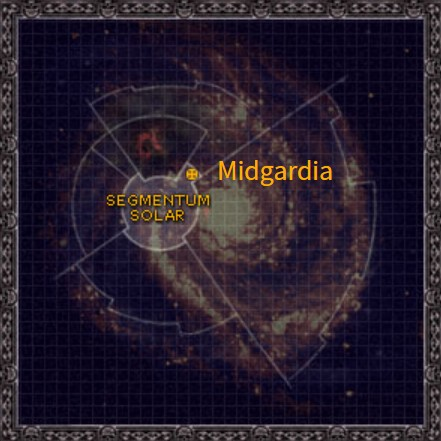
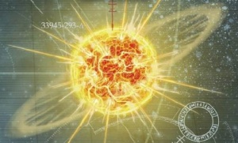
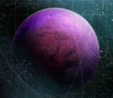

# 1009 米德加迪亚 Midgardia

精校状态：中文行文已逐段精校，部分术语仍为暂定

分类：地理 / 小行星

原文来源：https://www.bilibili.com/opus/1166083191403970564

原作者：帝国神选罐头

原文时间：2026年02月06日 08:38

[返回分类目录](目录.md) · [全书目录](../../目录.md)

<!-- A1009-B0001 图片 -->

<!-- A1009-B0002 -->

原译文

Map 地图

**校订译文**

Map 地图

<!-- /A1009-B0002 -->

<!-- A1009-B0003 -->
### Basic Data 基本资料

原题：Basic Data 基础数据

<!-- /A1009-B0003 -->

<!-- A1009-B0004 -->
**英文原文**

Name:Midgardia

<!-- /A1009-B0004 -->

<!-- A1009-B0005 -->

原译文

名称：米德加迪亚

**校订译文**

名称：米德加迪亚

<!-- /A1009-B0005 -->

<!-- A1009-B0006 -->
**英文原文**

Segmentum:Segmentum Solar

<!-- /A1009-B0006 -->

<!-- A1009-B0007 -->

原译文

星域：太阳星域

**校订译文**

星域：太阳星域

<!-- /A1009-B0007 -->

<!-- A1009-B0008 -->
**英文原文**

System:Fenris System

<!-- /A1009-B0008 -->

<!-- A1009-B0009 -->

原译文

星系：芬里斯星系

**校订译文**

星系：芬里斯星系

<!-- /A1009-B0009 -->

<!-- A1009-B0010 -->
**英文原文**

Population:6.5 billion (prior to the planet's destruction)

<!-- /A1009-B0010 -->

<!-- A1009-B0011 -->

原译文

人口：65亿（在行星毁灭之前）

**校订译文**

人口：65亿（在行星毁灭之前）

<!-- /A1009-B0011 -->

<!-- A1009-B0012 -->
**英文原文**

Affiliation:Imperium

<!-- /A1009-B0012 -->

<!-- A1009-B0013 -->

原译文

隶属：帝国

**校订译文**

隶属：帝国

<!-- /A1009-B0013 -->

<!-- A1009-B0014 -->
**英文原文**

Class:Destroyed, former Death World

<!-- /A1009-B0014 -->

<!-- A1009-B0015 -->

原译文

类别：毁灭，前死亡世界

**校订译文**

类别：已毁灭，原为死亡世界

<!-- /A1009-B0015 -->

<!-- A1009-B0016 图片 -->

<!-- A1009-B0017 -->

原译文

Planetary Image 行星图像

**校订译文**

Planetary Image 行星图像

<!-- /A1009-B0017 -->

<!-- A1009-B0018 -->
**英文原文**

Midgardia was a world of the Imperium and sister planet to Fenris. As such, its security was overseen by the Space Wolves.

<!-- /A1009-B0018 -->

<!-- A1009-B0019 -->

原译文

米德加迪亚是帝国的世界，也是芬里斯的姐妹行星。因此，它的安全由太空野狼监督。

**校订译文**

米德加迪亚曾是帝国世界，也是芬里斯的姐妹行星，其安全由太空野狼负责。

<!-- /A1009-B0019 -->

<!-- A1009-B0020 -->
## Overview 概述

<!-- /A1009-B0020 -->

<!-- A1009-B0021 -->
**英文原文**

Midgardia was one of three inhabited worlds of the Fenris System, orbiting the Wolf's Eye alongside Frostheim and Fenris.

<!-- /A1009-B0021 -->

<!-- A1009-B0022 -->

原译文

米德加迪亚是芬里斯星系的三个有人居住的世界之一，与弗洛斯特海姆和芬里斯一起绕狼眼运行。

**校订译文**

米德加迪亚是芬里斯星系的三个有人居住的世界之一，与弗洛斯特海姆和芬里斯一起绕狼眼运行。

<!-- /A1009-B0022 -->

<!-- A1009-B0023 图片 -->

<!-- A1009-B0024 -->

原译文

Midgardia before the Exterminatus 灭绝令前的米德加迪亚

**校订译文**

Midgardia before the Exterminatus 灭绝令前的米德加迪亚

<!-- /A1009-B0024 -->

<!-- A1009-B0025 -->
**英文原文**

Unlike its sister worlds, Midgardia was a poisonous greenhouse. Sprawling fungus growths covered its surface under boiling purple clouds, and the surface was so toxic that its people were forced to live in subterranean cities within the world's vast natural cavern structures. Their settlements were carved from the complex root boles of the jungle above, often hanging over the magma sea that bubbled and hissed hundreds of yards below.

<!-- /A1009-B0025 -->

<!-- A1009-B0026 -->

原译文

与它的姐妹世界不同，米德加迪亚是一个有毒的温室。在沸腾的紫色云层下，蔓延的真菌生长覆盖了它的表面，表面毒性很大，人们被迫生活在世界上巨大的天然洞穴结构内的地下城市。他们的定居点是从上面丛林的复杂树根上雕刻而成的，通常悬挂在数百码外沸腾和嘶嘶作响的岩浆海之上。

**校订译文**

与其他姐妹世界不同，米德加迪亚宛如一座有毒温室。翻腾的紫色云层下，真菌疯长，覆盖地表；环境毒性极强，居民只能住在巨大天然洞穴中的地下城市。他们从上方丛林盘根错节的根干中凿出聚落，住所往往悬在岩浆海上空，下方数百码处，熔岩不断翻涌嘶鸣。

<!-- /A1009-B0026 -->

<!-- A1009-B0027 -->
**英文原文**

While not as heavily defended as Fenris, Midgardia did tithe soldiers for the Astra Militarum. These regiments have a well-deserved reputation for their tenacity and aggression, as did the planetary defence forces that served on the world.

<!-- /A1009-B0027 -->

<!-- A1009-B0028 -->

原译文

虽然不像芬里斯那样防守严密，但米德加迪亚为星界军组织提供了什一税士兵。这些兵团因其坚韧和侵略性而享有盛誉，为世界服务的行星防御部队也是如此。

**校订译文**

米德加迪亚的防御虽不及芬里斯，却按什一税义务为星界军提供兵员。当地出征的各团以坚韧善战、攻势猛烈闻名，驻守本土的行星防卫军也同样如此。

<!-- /A1009-B0028 -->

<!-- A1009-B0029 -->
**英文原文**

The only structures on the surface of Midgardia were fortifications and orbital defence batteries (including the Nova Cannon Emperor's Judgement), their guns pointing skyward while augurs and vox echoes probed through the spore-laden clouds. Meanwhile, underground, pallid-skinned citizens tapped the rich nutrient deposits held in the root structures, carefully extracting viscous strands of reddish pulp to be used in the manufacture of medicines. Occasionally a subsidence or collapse would briefly open a hole up to the surface, poisonous air flooding down into the tunnels and killing hundreds of workers before the breach could be sealed. At other times the sea below their dwellings erupted in great fountains, molten rock destroying whole settlements in moments. Such were the perils of life on Midgardia.

<!-- /A1009-B0029 -->

<!-- A1009-B0030 -->

原译文

米德加迪亚表面唯一的结构是防御工事和轨道防御炮台（包括新星炮 - 帝皇审判），它们的炮口指向天空，而鸟卜仪和音阵回响则通过孢子云探测。与此同时，皮肤苍白的地下居民利用根结构中富含的营养物质，小心地提取出粘稠的淡红浆，用于制造药物。偶尔，沉陷或坍塌会短暂地打开一个通往地表的洞，有毒空气会涌入隧道，在裂缝被密封之前杀死数百名工人。在其他时候，他们住所下面的海水会爆发出巨大的喷泉，熔岩会在瞬间摧毁整个定居点。这就是米德加迪亚生活的危险。

**校订译文**

米德加迪亚地表只有防御工事和轨道防御炮台，包括名为“帝皇审判”的新星炮。炮口朝向天空，鸟卜仪与音阵回波穿透孢子弥漫的云层进行探测。地下，肤色苍白的居民开采根系中富集的营养物，小心抽取黏稠的红色浆丝，用于制药。有时，地层沉陷或坍塌会突然打通地表，毒气涌入隧道；裂口还未封闭，数百工人便已丧命。另一些时候，住所下方的岩浆海会喷出巨柱，熔岩顷刻摧毁整座聚落。这些便是米德加迪亚居民日常面对的危险。

**校注：** sea below回指岩浆海，原译海水错误；root boles指根干结构，非将整座星球雕刻成聚落。

<!-- /A1009-B0030 -->

<!-- A1009-B0031 -->
## History 历史

<!-- /A1009-B0031 -->

<!-- A1009-B0032 -->
**英文原文**

The planet was assaulted by the Necrons under Trazyn the Infinite in led M41, who were seeking a C'tan Shard. In the ensuing Battle of Midgardia, the Necrons achieved their objective and withdrew.

<!-- /A1009-B0032 -->

<!-- A1009-B0033 -->

原译文

M41，这颗行星被无限者塔拉辛领导的死灵袭击，他们正在寻找星神碎片。在随后的米德加迪亚之战中，死灵实现了他们的目标并撤退了。

**校订译文**

第四十一个千年，无尽者塔拉辛率领太空死灵袭击这颗星球，寻找一块星神碎片。在随后的米德加迪亚之战中，太空死灵达成目标后撤离。

**校注：** 原英文“in led M41”有明显损坏，但不能仅凭此确定是否本想写late；保留能确读的M41，不擅补具体早晚。Trazyn the Infinite依已核官译无尽者塔拉辛。

<!-- /A1009-B0033 -->

<!-- A1009-B0034 -->
**英文原文**

During the Siege of the Fenris System, the world was devastated by both Tzeentch and Nurgle Daemons. Ultimately Magnus unleashed a plague crafted by Mortarion upon Midgardia, dooming it forever. This led to Supreme Grand Master Azrael of the Dark Angels enacting Exterminatus upon the world. It was not enough, though, because the cleansing fire only killed all life on the planet's surface and not in its underground complexes. After returning from the Midgardia's stony heart, Logan Grimnar decided to destroy the planet itself and did it, blowing up Midgardia's core with Morkai's Tooth — an especially powerful warhead, though it was a very hard decision for Grimnar. The destruction of Midgardia caused mighty gravity waves that diverged through Fenris System. This waves reached the sieging Silver Towers and forced them to wink out back to the Warp. For years to come shards of Midgardia fell to the surface of the other planets of the Fenris System and it is said that people who tried to investigate the impact sites were cursed and slowly wasted away to death.

<!-- /A1009-B0034 -->

<!-- A1009-B0035 -->

原译文

在芬里斯星系围城期间，世界被奸奇和纳垢恶魔摧毁。最终，马格努斯在米德加迪亚爆发了一场由莫塔里安制造的瘟疫，将其永远毁灭。这导致了黑暗天使的至高大导师阿兹瑞尔在世界上颁布了灭绝令。然而，这还不够，因为净化之火只杀死了行星表面的所有生命，而不是地下建筑群中的生命。从米德加迪亚的石心回来后，罗根·格里姆纳尔决定摧毁这个行星本身，并用莫凯之牙炸毁了米德加迪亚的核心 — 这是一个特别强大的弹头，尽管这对格里姆纳尔来说是一个非常艰难的决定。米德加迪亚的毁灭引发了强大的重力波，这些重力波在芬里斯星系中发散。这些波到达了围攻的银塔，迫使他们在眨眼间回到亚空间。在接下来的几年里，米德加迪亚的碎片落到了芬里斯星系其他行星的表面，据说那些试图调查撞击地点的人被诅咒了，慢慢消瘦至死。

**校订译文**

芬里斯星系围城战期间，奸奇与纳垢的恶魔共同蹂躏米德加迪亚。马格努斯最终释放莫塔里安制造的瘟疫，使这颗星球无可挽救。黑暗天使至高大导师阿兹瑞尔因此执行灭绝令，但净化烈焰只杀死了地表生命，地下设施中的威胁仍然存在。洛根·格里姆纳尔从行星岩层深处返回后，艰难地决定彻底摧毁整颗星球。他以威力惊人的弹头“莫凯之牙”炸毁地核。米德加迪亚毁灭产生的强烈引力波向整个芬里斯星系扩散，冲击正在围攻的银塔，迫使其消失、退回亚空间。此后多年，碎片仍不断坠落在星系其他行星表面。据说，试图探查撞击地点的人会遭到诅咒，逐渐衰弱而死。

**校注：** Morkai’s Tooth在此为摧毁地核的弹头，区别同词根的药剂师器械Fang of Morkai。银塔受冲击退回亚空间，不是被引力波消灭。

<!-- /A1009-B0035 -->

<!-- A1009-B0036 -->
## Trivia 琐事

<!-- /A1009-B0036 -->

<!-- A1009-B0037 -->
**英文原文**

In Norse/ Germanic mythology Midgard is the name for Earth inhabited by and known to humans.

<!-- /A1009-B0037 -->

<!-- A1009-B0038 -->

原译文

在北欧/日耳曼神话中，米德加德这是人类居住并熟知的地球的名称。

**校订译文**

北欧／日耳曼神话中的米德加德，是人类居住并熟知的世界之名。

<!-- /A1009-B0038 -->

本篇核心术语与暂定项

以下列出本篇出现的英文原形及核心术语表用词。同形词可能指不同对象，具体词义以本篇正文和校注为准；单复数、别名和仅见于图注的名称可能尚未列入。完整候选见[术语表](../../术语表/双语术语候选.csv)。

| 英文 | 采用中文 | 状态 |
| --- | --- | --- |
| Dark Angels | 黑暗天使 | 官方已核对 |
| Space Wolves | 太空野狼 | 官方已核对 |
| Astra Militarum | 星界军 | 官方已核对 |
| Necrons | 太空死灵 | 官方已核对 |
| Warp | 亚空间 | 官方已核对 |
| Imperium | 帝国 | 暂定·简称 |
| Tzeentch | 奸奇 | 官方已核对 |
| Nurgle | 纳垢 | 官方已核对 |
| Trazyn the Infinite | 无尽者塔拉辛 | 官方已核对 |
| Emperor | 帝皇 | 官方已核对 |
| Mortarion | 莫塔里安 | 官方已核对 |
| Segmentum Solar | 太阳星域 | 暂定·官方待核 |
| Segmentum | 星域 | 暂定·官方待核 |
| Fenris | 芬里斯 | 暂定·官方待核 |
| Midgardia | 米德加迪亚 | 暂定·官方待核 |
| Master | 导师（审判庭职衔）／舰务官（舰员职务） | 语境定译·官方待核 |
| Azrael | 阿兹瑞尔 | 官方已核 |
| Logan Grimnar | 洛根·格里姆纳尔 | 官方已核 |
| Supreme Grand Master | 至高大导师 | 暂定·官方待核 |
| C'tan | 星神 | 暂定·官方待核 |
| Grand Master | 大导师 | 暂定·官方待核 |
| Frostheim | 弗罗斯特海姆 | 暂定·官方待核 |
| The Dark | 《黑暗》 | 暂定·官方待核 |
| System | 星系（恒星系统） | 暂定·官方待核 |
| Death World | 死亡世界 | 暂定·官方待核 |
| Emperor's Judgement | 帝皇审判 | 暂定·官方待核 |

