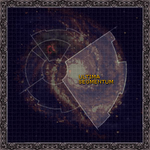

# 1010 极限星域 Ultima Segmentum

精校状态：中文行文已逐段精校，部分术语仍为暂定

分类：地理 / 小行星 / 极限星域 Ultima Segmentum

原文来源：https://www.bilibili.com/opus/1137547901114777640

原作者：帝国神选罐头

原文时间：2025年11月21日 11:06

[返回分类目录](目录.md) · [全书目录](../../目录.md)

<!-- A1010-B0001 -->
**英文原文**

The Ultima Segmentum is one of the divisions of the Galaxy known as Segmentums of the Imperium and is by far the largest. It is located to the east of Holy Terra, and its Segmentum Fortress is located at Kar Duniash. Notably it contains the Ultramarines empire of Ultramar, the Tau Empire, and along its border is the Eastern Fringe.

<!-- /A1010-B0001 -->

<!-- A1010-B0002 -->

原译文

极限星域是银河系中被称为帝国星域的部分之一，是迄今为止最大的部分。它位于神圣泰拉以东，其星域堡垒位于卡尔·杜尼亚施。值得注意的是，它包含了奥特拉玛的奥特拉玛帝国，钛帝国，沿着它的边界是东部边缘。

**校订译文**

极限星域是帝国划分银河的五大星域之一，也是其中规模最大者。它位于神圣泰拉以东，星域要塞设在卡杜尼亚斯。极限战士的奥特拉玛帝国与钛帝国都位于其中，东部边疆则沿其边界分布。

**校注：** Ultramarines empire of Ultramar为极限战士所属奥特拉玛帝国，原译重复奥特拉玛并漏去所属者。

<!-- /A1010-B0002 -->

<!-- A1010-B0003 -->
**英文原文**

Following the conclusion of the Thirteenth Black Crusade and the rebirth of Roboute Guilliman, much of north and northeastern Ultima Segmentum has become stranded within Imperium Nihilus.

<!-- /A1010-B0003 -->

<!-- A1010-B0004 -->

原译文

随着第十三次黑色远征的结束和罗伯特·基里曼的重生，北部和东北部的大部分极限星域都被困在帝国暗面内。

**校订译文**

第十三次黑色远征结束、罗保特·基里曼复生后，极限星域北部与东北部的大片区域被隔绝在帝国暗面。

<!-- /A1010-B0004 -->

<!-- A1010-B0005 图片 -->

<!-- A1010-B0006 -->

原译文

Galactic map of Ultima Segmentum 极限星域的银河系地图

**校订译文**

Galactic map of Ultima Segmentum 极限星域的银河系地图

<!-- /A1010-B0006 -->

<!-- A1010-B0007 -->
## Notable Planets 著名行星

<!-- /A1010-B0007 -->

<!-- A1010-B0008 -->

原译文

Andermung 安德蒙

**校订译文**

Andermung 安德蒙

<!-- /A1010-B0008 -->

<!-- A1010-B0009 -->

原译文

Anvilus Nine 安维鲁斯九星

**校订译文**

Anvilus Nine 安维鲁斯九号

<!-- /A1010-B0009 -->

<!-- A1010-B0010 -->

原译文

Attila 阿提拉

**校订译文**

Attila 阿提拉

<!-- /A1010-B0010 -->

<!-- A1010-B0011 -->

原译文

Baal 巴尔

**校订译文**

Baal 巴尔

<!-- /A1010-B0011 -->

<!-- A1010-B0012 -->

原译文

Badab 巴达布

**校订译文**

Badab 巴达布

<!-- /A1010-B0012 -->

<!-- A1010-B0013 -->

原译文

Bork'an 博克'安

**校订译文**

Bork'an 博克’安

<!-- /A1010-B0013 -->

<!-- A1010-B0014 -->

原译文

Calth 考斯

**校订译文**

Calth 考斯

<!-- /A1010-B0014 -->

<!-- A1010-B0015 -->

原译文

Catachan 卡塔昌

**校订译文**

Catachan 卡塔昌

<!-- /A1010-B0015 -->

<!-- A1010-B0016 -->

原译文

Charadon 查拉顿

**校订译文**

Charadon 查拉顿

<!-- /A1010-B0016 -->

<!-- A1010-B0017 -->

原译文

Chemos 彻莫斯

**校订译文**

Chemos 彻莫斯

<!-- /A1010-B0017 -->

<!-- A1010-B0018 -->

原译文

Chogoris 巧高里斯

**校订译文**

Chogoris 乔高里斯

<!-- /A1010-B0018 -->

<!-- A1010-B0019 -->

原译文

Dal'yth 达'利斯

**校订译文**

Dal'yth 达利斯

<!-- /A1010-B0019 -->

<!-- A1010-B0020 -->

原译文

Eye of Damocles 达摩克利斯之眼

**校订译文**

Eye of Damocles 达摩克利斯之眼

<!-- /A1010-B0020 -->

<!-- A1010-B0021 -->

原译文

Fort Pykman 皮克曼堡垒

**校订译文**

Fort Pykman 皮克曼堡垒

<!-- /A1010-B0021 -->

<!-- A1010-B0022 -->

原译文

Gorkamorka (Angelis) 搞咔毛咔（安杰利斯）

**校订译文**

Gorkamorka (Angelis) 搞咔毛咔（安杰利斯）

<!-- /A1010-B0022 -->

<!-- A1010-B0023 -->

原译文

Konor 康诺

**校订译文**

Konor 康诺

<!-- /A1010-B0023 -->

<!-- A1010-B0024 -->

原译文

Macragge 马库拉格

**校订译文**

Macragge 马库拉格

<!-- /A1010-B0024 -->

<!-- A1010-B0025 -->

原译文

Mancora 曼科拉

**校订译文**

Mancora 曼科拉

<!-- /A1010-B0025 -->

<!-- A1010-B0026 -->

原译文

Mandragora 曼德拉戈拉

**校订译文**

Mandragora 曼德拉戈拉

<!-- /A1010-B0026 -->

<!-- A1010-B0027 -->

原译文

Masali 马萨利

**校订译文**

Masali 马萨里

<!-- /A1010-B0027 -->

<!-- A1010-B0028 -->

原译文

Metalica 梅塔利卡

**校订译文**

Metalica 梅塔利卡

<!-- /A1010-B0028 -->

<!-- A1010-B0029 -->

原译文

Mu'gulath Bay 慕'古拉斯湾

**校订译文**

Mu'gulath Bay 穆古拉湾

<!-- /A1010-B0029 -->

<!-- A1010-B0030 -->

原译文

Newfound 新发现

**校订译文**

Newfound 新发现星

<!-- /A1010-B0030 -->

<!-- A1010-B0031 -->

原译文

Nuceria 努凯里亚

**校订译文**

Nuceria 努凯里亚

<!-- /A1010-B0031 -->

<!-- A1010-B0032 -->

原译文

Olympia 奥林匹亚

**校订译文**

Olympia 奥林匹亚

<!-- /A1010-B0032 -->

<!-- A1010-B0033 -->

原译文

Orask 奥拉斯克

**校订译文**

Orask 奥拉斯克

<!-- /A1010-B0033 -->

<!-- A1010-B0034 -->

原译文

Pech 佩什

**校订译文**

Pech 佩什

<!-- /A1010-B0034 -->

<!-- A1010-B0035 -->

原译文

Prefectia 总督星

**校订译文**

Prefectia 总督星

<!-- /A1010-B0035 -->

<!-- A1010-B0036 -->

原译文

Prospero 普罗斯佩罗

**校订译文**

Prospero 普罗斯佩罗

<!-- /A1010-B0036 -->

<!-- A1010-B0037 -->

原译文

Protos 普鲁托斯

**校订译文**

Protos 普鲁托斯

<!-- /A1010-B0037 -->

<!-- A1010-B0038 -->

原译文

Pythos 派索斯

**校订译文**

Pythos 派索斯

<!-- /A1010-B0038 -->

<!-- A1010-B0039 -->

原译文

Rynn's World 林恩世界

**校订译文**

Rynn's World 瑞恩世界

<!-- /A1010-B0039 -->

<!-- A1010-B0040 -->

原译文

Ryza 瑞扎

**校订译文**

Ryza 瑞扎

<!-- /A1010-B0040 -->

<!-- A1010-B0041 -->

原译文

Sotha 索萨

**校订译文**

Sotha 索萨

<!-- /A1010-B0041 -->

<!-- A1010-B0042 -->

原译文

Stygies VIII 黄泉八号

**校订译文**

Stygies VIII 黄泉八号

<!-- /A1010-B0042 -->

<!-- A1010-B0043 -->

原译文

T'au 钛

**校订译文**

T'au 钛星

**校注：** 本表列行星，T’au在此为钛星而非钛族。Vespid同为世界名，保留胡蜂星，不套用物种胡蜂人。

<!-- /A1010-B0043 -->

<!-- A1010-B0044 -->

原译文

Talasa Prime 塔拉萨一号

**校订译文**

Talasa Prime 塔拉萨主星

<!-- /A1010-B0044 -->

<!-- A1010-B0045 -->

原译文

Tsagualsa 察古尔萨

**校订译文**

Tsagualsa 查古尔萨

<!-- /A1010-B0045 -->

<!-- A1010-B0046 -->

原译文

Tarsis Ultra 塔西斯极限

**校订译文**

Tarsis Ultra 塔西斯·极限

<!-- /A1010-B0046 -->

<!-- A1010-B0047 -->

原译文

Triplex Phall 三重法尔

**校订译文**

Triplex Phall 三重法尔

<!-- /A1010-B0047 -->

<!-- A1010-B0048 -->

原译文

Valhalla 瓦尔哈拉

**校订译文**

Valhalla 瓦尔哈拉

<!-- /A1010-B0048 -->

<!-- A1010-B0049 -->

原译文

Vespator 维斯帕托

**校订译文**

Vespator 维斯帕托

<!-- /A1010-B0049 -->

<!-- A1010-B0050 -->

原译文

Vespid 胡蜂星

**校订译文**

Vespid 胡蜂星

<!-- /A1010-B0050 -->

<!-- A1010-B0051 -->

原译文

Vior'la 维奥'拉

**校订译文**

Vior'la 维奥’拉

<!-- /A1010-B0051 -->

<!-- A1010-B0052 -->

原译文

Vior'los 维奥'洛斯

**校订译文**

Vior'los 维奥'洛斯

<!-- /A1010-B0052 -->

<!-- A1010-B0053 -->

原译文

Voltoris 沃特瑞斯

**校订译文**

Voltoris 沃尔托利斯

<!-- /A1010-B0053 -->

<!-- A1010-B0054 -->
## Notable Regions 著名区域

原题：Notable Regions 著名帝国

<!-- /A1010-B0054 -->

<!-- A1010-B0055 -->

原译文

Galactic Core 银河核心

**校订译文**

Galactic Core 银心

<!-- /A1010-B0055 -->

<!-- A1010-B0056 -->

原译文

Ultramar 奥特拉玛

**校订译文**

Ultramar 奥特拉玛

<!-- /A1010-B0056 -->

<!-- A1010-B0057 -->

原译文

Tau Empire 钛帝国

**校订译文**

Tau Empire 钛帝国

<!-- /A1010-B0057 -->

<!-- A1010-B0058 -->

原译文

Sautekh Dynasty 索泰克王朝

**校订译文**

Sautekh Dynasty 索泰克王朝

<!-- /A1010-B0058 -->

<!-- A1010-B0059 -->

原译文

Grendl Stars 格伦德尔群星

**校订译文**

Grendl Stars 格伦德尔群星

<!-- /A1010-B0059 -->

<!-- A1010-B0060 -->

原译文

Ghost Stars 食尸鬼群星

**校订译文**

Ghost Stars 幽魂群星（食尸鬼群星的别称）

**校注：** 英文此处为Ghost Stars；第1016篇明确Ghoul Stars also known as Ghost Stars，两者为同一地区不同称呼。保留幽魂群星作为别名，并与食尸鬼群星建立对应。

<!-- /A1010-B0060 -->

<!-- A1010-B0061 -->

原译文

Kreen Scar 克雷恩疤痕

**校订译文**

Kreen Scar 克雷恩疤痕

<!-- /A1010-B0061 -->

<!-- A1010-B0062 -->

原译文

Ork Empire of Charadon 查拉顿的欧克帝国

**校订译文**

Ork Empire of Charadon 查拉顿的欧克帝国

<!-- /A1010-B0062 -->

<!-- A1010-B0063 -->

原译文

Ork Empire of Octarius 奥克塔琉斯的欧克帝国

**校订译文**

Ork Empire of Octarius 奥克塔琉斯欧克帝国

<!-- /A1010-B0063 -->

<!-- A1010-B0064 -->

原译文

Red Scar 红疤

**校订译文**

Red Scar 红疤地区

<!-- /A1010-B0064 -->

<!-- A1010-B0065 -->

原译文

Pariah Nexus 驱灵死域

**校订译文**

Pariah Nexus 驱灵死域

<!-- /A1010-B0065 -->

<!-- A1010-B0066 -->
## Notable Sectors, Sub-sectors, and Systems 著名星区、次星区与星系

原题：Notable Sectors, Sub-sectors, and Systems 著名星区，分区和星系

<!-- /A1010-B0066 -->

<!-- A1010-B0067 -->
### Sectors 星区

<!-- /A1010-B0067 -->

<!-- A1010-B0068 -->

原译文

Badab Sector 巴达布星区

**校订译文**

Badab Sector 巴达布星区

<!-- /A1010-B0068 -->

<!-- A1010-B0069 -->

原译文

Charadon Sector 查拉顿星区

**校订译文**

Charadon Sector 查拉顿星区

<!-- /A1010-B0069 -->

<!-- A1010-B0070 -->

原译文

Demeter Sector 得墨忒耳星区

**校订译文**

Demeter Sector 得墨忒耳星区

<!-- /A1010-B0070 -->

<!-- A1010-B0071 -->

原译文

Gulgorahd Protectorate 古尔戈拉德保护国

**校订译文**

Gulgorahd Protectorate 古尔戈拉德保护国

<!-- /A1010-B0071 -->

<!-- A1010-B0072 -->

原译文

Karthago Sector 卡萨戈星区

**校订译文**

Karthago Sector 卡萨戈星区

<!-- /A1010-B0072 -->

<!-- A1010-B0073 -->

原译文

Loki Sector 洛基星区

**校订译文**

Loki Sector 洛基星区

<!-- /A1010-B0073 -->

<!-- A1010-B0074 -->

原译文

Nephilim Sector 拿非利星区

**校订译文**

Nephilim Sector 拿非利星区

<!-- /A1010-B0074 -->

<!-- A1010-B0075 -->

原译文

Nostramo Sector 诺斯特拉莫星区

**校订译文**

Nostramo Sector 诺斯特拉莫星区

<!-- /A1010-B0075 -->

<!-- A1010-B0076 -->

原译文

Thramas Sector 萨拉玛斯星区

**校订译文**

Thramas Sector 萨拉玛斯星区

<!-- /A1010-B0076 -->

<!-- A1010-B0077 -->

原译文

Vidar Sector 维达尔星区

**校订译文**

Vidar Sector 维达尔星区

<!-- /A1010-B0077 -->

<!-- A1010-B0078 -->

原译文

Yasan Sector 崖山星区

**校订译文**

Yasan Sector 崖山星区

<!-- /A1010-B0078 -->

<!-- A1010-B0079 -->
### Sub-Sectors 次星区

原题：Sub-Sectors 分区

<!-- /A1010-B0079 -->

<!-- A1010-B0080 -->

原译文

Corvus Sub-sector 乌鸦分区

**校订译文**

Corvus Sub-sector 乌鸦次星区

<!-- /A1010-B0080 -->

<!-- A1010-B0081 -->
### Systems 星系

<!-- /A1010-B0081 -->

<!-- A1010-B0082 -->

原译文

Anesidorax System 阿内西多拉克斯星系

**校订译文**

Anesidorax System 阿内西多拉克斯星系

<!-- /A1010-B0082 -->

<!-- A1010-B0083 -->

原译文

Balor System 巴罗尔星系

**校订译文**

Balor System 巴罗尔星系

<!-- /A1010-B0083 -->

<!-- A1010-B0084 -->

原译文

Dovar System 多瓦尔星系

**校订译文**

Dovar System 多瓦尔星系

<!-- /A1010-B0084 -->

<!-- A1010-B0085 -->

原译文

Lagan System 拉甘星系

**校订译文**

Lagan System 拉甘星系

<!-- /A1010-B0085 -->

<!-- A1010-B0086 -->

原译文

Methystos System 梅西斯托斯星系

**校订译文**

Methystos System 梅西斯托斯星系

<!-- /A1010-B0086 -->

<!-- A1010-B0087 -->

原译文

Nocturne System 夜曲星系

**校订译文**

Nocturne System 夜曲星系

<!-- /A1010-B0087 -->

<!-- A1010-B0088 -->

原译文

Octarius System 奥克塔琉斯星系

**校订译文**

Octarius System 奥克塔琉斯星系

<!-- /A1010-B0088 -->

<!-- A1010-B0089 -->
## Other Celestial Objects 其他天体

<!-- /A1010-B0089 -->

<!-- A1010-B0090 -->

原译文

Ulthwe 乌斯维

**校订译文**

Ulthwe 乌斯维

<!-- /A1010-B0090 -->

<!-- A1010-B0091 -->

原译文

Saim-Hann 塞姆-罕

**校订译文**

Saim-Hann 塞姆罕

<!-- /A1010-B0091 -->

<!-- A1010-B0092 -->

原译文

Ymga Monolith 耶门迦巨石碑

**校订译文**

Ymga Monolith 耶门迦巨石碑

<!-- /A1010-B0092 -->

<!-- A1010-B0093 -->

原译文

Pariah Nexus 驱灵死域

**校订译文**

Pariah Nexus 驱灵死域

**校注：** Pariah Nexus在原稿同时列入著名区域和其他天体，为原清单重复归类；保留，不擅删。

<!-- /A1010-B0093 -->

<!-- A1010-B0094 -->

原译文

Attilan Gate 阿提兰之门

**校订译文**

Attilan Gate 阿提兰之门

<!-- /A1010-B0094 -->

<!-- A1010-B0095 -->
### Warpstorms 亚空间风暴

<!-- /A1010-B0095 -->

<!-- A1010-B0096 -->

原译文

Maelstrom 大漩涡

**校订译文**

Maelstrom 大漩涡

<!-- /A1010-B0096 -->

<!-- A1010-B0097 -->

原译文

Storm of the Emperor's Wrath 帝皇之怒风暴

**校订译文**

Storm of the Emperor's Wrath 帝皇之怒风暴

<!-- /A1010-B0097 -->

<!-- A1010-B0098 -->

原译文

Great Rift 大裂隙

**校订译文**

Great Rift 大裂隙

<!-- /A1010-B0098 -->

<!-- A1010-B0099 -->
## Other Segmentums 其他星域

<!-- /A1010-B0099 -->

<!-- A1010-B0100 -->
**英文原文**

Segmentum Tempestus - Galactic South West

<!-- /A1010-B0100 -->

<!-- A1010-B0101 -->

原译文

暴风星域 - 银河西南部

**校订译文**

暴风星域 - 银河西南部

<!-- /A1010-B0101 -->

<!-- A1010-B0102 -->
**英文原文**

Segmentum Solar - Galactic West

<!-- /A1010-B0102 -->

<!-- A1010-B0103 -->

原译文

太阳星域 - 银河西部

**校订译文**

太阳星域 - 银河西部

<!-- /A1010-B0103 -->

<!-- A1010-B0104 -->
**英文原文**

Segmentum Obscurus - Galactic North West

<!-- /A1010-B0104 -->

<!-- A1010-B0105 -->

原译文

朦胧星域 - 银河西北部

**校订译文**

朦胧星域 - 银河西北部

<!-- /A1010-B0105 -->

<!-- A1010-B0106 -->
**英文原文**

Segmentum Pacificus - Galactic Far West

<!-- /A1010-B0106 -->

<!-- A1010-B0107 -->

原译文

太平星域 - 银河远西

**校订译文**

太平星域 - 银河远西

<!-- /A1010-B0107 -->

本篇核心术语与暂定项

以下列出本篇出现的英文原形及核心术语表用词。同形词可能指不同对象，具体词义以本篇正文和校注为准；单复数、别名和仅见于图注的名称可能尚未列入。完整候选见[术语表](../../术语表/双语术语候选.csv)。

| 英文 | 采用中文 | 状态 |
| --- | --- | --- |
| Roboute Guilliman | 罗保特·基里曼 | 官方已核对 |
| Ultramar | 奥特拉玛 | 官方已核对 |
| Ultramarines | 极限战士 | 官方已核对 |
| Imperium | 帝国 | 暂定·简称 |
| Terra | 泰拉 | 暂定·官方待核 |
| Imperium Nihilus | 帝国暗面 | 暂定·官方待核 |
| Segmentum Solar | 太阳星域 | 暂定·官方待核 |
| Segmentum Pacificus | 太平星域 | 暂定·官方待核 |
| Segmentum Obscurus | 朦胧星域 | 暂定·官方待核 |
| Segmentum Tempestus | 暴风星域 | 暂定·官方待核 |
| Ultima Segmentum | 极限星域 | 暂定·官方待核 |
| Segmentum | 星域 | 暂定·官方待核 |
| Eastern Fringe | 东部边缘 | 暂定·官方待核 |
| Kar Duniash | 卡杜尼亚斯 | 暂定·官方待核 |
| Obscurus | 朦胧星 | 暂定·官方待核 |
| Segmentum Fortress | 星域堡垒 | 暂定·官方待核 |
| Tau Empire | 钛帝国 | 暂定·官方待核 |

