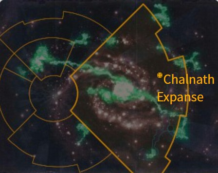

# 1011 查尔纳斯广域 Chalnath Expanse

精校状态：中文行文已逐段精校，部分术语仍为暂定

分类：地理 / 小行星 / 极限星域 Ultima Segmentum

原文来源：https://www.bilibili.com/opus/1142037877102739462

原作者：帝国神选罐头

原文时间：2025年12月03日 13:30

[返回分类目录](目录.md) · [全书目录](../../目录.md)

原篇名：查尔纳特扩区 Chalnath Expanse

<!-- A1011-B0001 -->
**英文原文**

The Chalnath Expanse is a region of space, located in Ultima Segmentum within the Imperium Nihilus.

<!-- /A1011-B0001 -->

<!-- A1011-B0002 -->

原译文

查尔纳特扩区是一个太空区域，位于帝国暗面内的极限星域。

**校订译文**

查尔纳斯广域位于极限星域，是帝国暗面中的一片天区。

<!-- /A1011-B0002 -->

<!-- A1011-B0003 图片 -->

<!-- A1011-B0004 -->

原译文

Location of the Chalnath Expanse 查尔纳特扩区的地点

**校订译文**

Location of the Chalnath Expanse 查尔纳斯广域的位置

<!-- /A1011-B0004 -->

<!-- A1011-B0005 -->
## Overview 概述

<!-- /A1011-B0005 -->

<!-- A1011-B0006 -->
**英文原文**

The Expanse became embroiled by conflict in the aftermath of the creation of the Great Rift, most notable of which were Genestealer Cult uprisings and Tau invasions. Not one system avoided conflict. The Tau Commander Shadowsun herself attacked Astorgius while Ctesiphus and Arrajian were the site of Genestealer uprisings. On Haephos, the Imperial defenders engaged in a bitter guerrilla war against the Genestealers and Tau infiltrators. The Riatov System became an inferno of battle between the Tau, Imperial Guard, and Genestealers. Vorotheion seemed immune to the violence for a time before becoming embroiled in a Tau invasion. The Tau wooed disenfranchised Human populations to the Greater Good, establishing insurrectionist cells and proxies to battle the Imperials alongside their conventional forces. The effects of the Psychic Awakening soon made themselves known on the Humans, with Imperial Priests performing "miracles" and even Gue'vesa forces going into bouts of insanity.

<!-- /A1011-B0006 -->

<!-- A1011-B0007 -->

原译文

大裂隙形成后，扩区陷入了冲突，其中最著名的是基因窃取者教派叛乱和陶入侵。没有一个星系能够避免冲突。钛指挥官影阳亲自袭击了阿斯特吉斯，而克忒西丰和阿拉贾是基因窃取者叛乱的地点。在海弗斯，帝国守军对基因窃取者和钛渗透者进行了激烈的游击战。里亚托夫星系成为了钛、帝国卫队和基因窃取者之间战斗的地狱。沃罗塞翁在卷入钛入侵之前似乎对暴行免疫了一段时间。钛向被剥夺权利的人类寻求上上善道，建立叛乱组织和代理人，与帝国的常备部队并肩作战。灵能觉醒的影响很快就在人类身上显现出来，帝国牧师表演了“神迹”，甚至古'维萨部队也陷入了疯狂。

**校订译文**

大裂隙形成后，查尔纳斯广域战火四起，最突出的威胁是基因窃取者教派叛乱与钛族入侵，没有一个星系幸免。指挥官影阳亲自进攻阿斯特吉斯，克忒西丰与阿拉贾则爆发基因窃取者叛乱。海弗斯的帝国守军与基因窃取者和钛族渗透者展开惨烈游击战；里亚托夫星系成为钛族、帝国卫队和基因窃取者三方混战的炼狱。沃罗西翁一度置身事外，最终也遭钛族入侵。钛族以至上善道拉拢被剥夺权利的人类，建立叛乱组织与代理势力，使其配合钛族正规军对抗帝国。不久，灵能觉醒的影响开始在人类身上显现：帝国传教士施展“神迹”，甚至连古维萨部队也出现阵发性的疯狂。

**校注：** 钛族拉拢受压迫人类，使其与钛族正规军协同对抗帝国；原译写成与帝国常备军并肩作战，阵营关系颠倒。

<!-- /A1011-B0007 -->

<!-- A1011-B0008 -->
**英文原文**

The disturbances caused the Order of the Sacred Rose to respond, saving those who remained true to the Emperor while purging all heretics they came across. Warriors of the Tau Fire Caste put up formidable resistance, but the Sisters find the largest threat to be Ethereals whose preachings claim countless Human souls. Recently, Deathwatch Watch Master Agathon has arrived from Watch Fortress Mortguard into the Warzone at the request of the Ordo Xenos Inquisitor Jazad D'ontor.

<!-- /A1011-B0008 -->

<!-- A1011-B0009 -->

原译文

动乱促使神圣玫瑰修会做出回应，拯救了那些忠于帝皇的人，同时清除了他们遇到的所有异端。钛火氏族的战士们进行了强大的抵抗，但修女们发现最大的威胁是以太，他们的宣讲夺走了无数人的灵魂。最近，应攘外修会审判官贾扎德·东'托尔的要求，死亡守望守望大师阿格顿已从守望要塞蒙托加德抵达战区。

**校订译文**

动乱引来神圣玫瑰修会。修女们救援仍忠于帝皇的人，并清除所遇到的一切异端。钛族火氏战士抵抗顽强，但修女们认为最大的威胁是以太：他们的宣讲使无数人类改换信仰。后来，应异形审判庭审判官贾扎德·东托尔之请，死亡守望守望堡主阿格顿从莫特加德守望要塞赶赴战区。

**校注：** Mortguard暂音译莫特加德，原蒙托加德不含对应monto音节；专名仍待官方核定。审判庭名称依用户已决异形审判庭，未重复添加全书首次别名。

<!-- /A1011-B0009 -->

<!-- A1011-B0010 -->
## Known Regions 已知地区

<!-- /A1011-B0010 -->

<!-- A1011-B0011 -->

原译文

Nem'yar Atoll 内姆'亚尔环礁

**校订译文**

Nem'yar Atoll 奈姆亚尔环礁

<!-- /A1011-B0011 -->

<!-- A1011-B0012 -->
## Known Systems 已知星系

<!-- /A1011-B0012 -->

<!-- A1011-B0013 -->

原译文

Arrajian System 阿拉贾星系

**校订译文**

Arrajian System 阿拉贾星系

<!-- /A1011-B0013 -->

<!-- A1011-B0014 -->

原译文

Barolyr System 巴罗利尔星系

**校订译文**

Barolyr System 巴罗利尔星系

<!-- /A1011-B0014 -->

<!-- A1011-B0015 -->

原译文

Ctesiphus System 克忒西丰星系

**校订译文**

Ctesiphus System 克忒西丰星系

<!-- /A1011-B0015 -->

<!-- A1011-B0016 -->

原译文

Pekun System 佩坤星系

**校订译文**

Pekun System 佩坤星系

<!-- /A1011-B0016 -->

<!-- A1011-B0017 -->

原译文

Riatov System 里亚托夫星系

**校订译文**

Riatov System 里亚托夫星系

<!-- /A1011-B0017 -->

<!-- A1011-B0018 -->

原译文

Thaxaril System 萨哈瑞尔星系

**校订译文**

Thaxaril System 萨哈瑞尔星系

<!-- /A1011-B0018 -->

<!-- A1011-B0019 -->

原译文

Vedik System 韦迪克星系

**校订译文**

Vedik System 韦迪克星系

<!-- /A1011-B0019 -->

<!-- A1011-B0020 -->
## Other Worlds 其他世界

<!-- /A1011-B0020 -->

<!-- A1011-B0021 -->

原译文

Ashenfell 灰落星

**校订译文**

Ashenfell 灰落星

<!-- /A1011-B0021 -->

<!-- A1011-B0022 -->

原译文

Cestis 赛斯提斯

**校订译文**

Cestis 赛斯提斯

<!-- /A1011-B0022 -->

<!-- A1011-B0023 -->
**英文原文**

Endura — Shrine World.

<!-- /A1011-B0023 -->

<!-- A1011-B0024 -->

原译文

安杜拉 — 圣地世界

**校订译文**

安杜拉 — 圣地世界

<!-- /A1011-B0024 -->

<!-- A1011-B0025 -->

原译文

Saint's Halt 圣者之终

**校订译文**

Saint's Halt 圣者之终

<!-- /A1011-B0025 -->

本篇核心术语与暂定项

以下列出本篇出现的英文原形及核心术语表用词。同形词可能指不同对象，具体词义以本篇正文和校注为准；单复数、别名和仅见于图注的名称可能尚未列入。完整候选见[术语表](../../术语表/双语术语候选.csv)。

| 英文 | 采用中文 | 状态 |
| --- | --- | --- |
| Deathwatch | 死亡守望 | 官方已核对 |
| Imperial Guard | 帝国卫队 | 暂定·语境区分 |
| Great Rift | 大裂隙 | 官方已核对 |
| Inquisitor | 审判官 | 官方已核对 |
| Imperium | 帝国 | 暂定·简称 |
| Emperor | 帝皇 | 官方已核对 |
| Shrine World | 圣地世界 | 暂定·官方待核 |
| The Order | 秩序 | 暂定·官方待核 |
| Imperium Nihilus | 帝国暗面 | 暂定·官方待核 |
| Chalnath Expanse | 查尔纳斯广域 | 暂定·官方待核 |
| Ordo Xenos | 异形审判庭 | 用户指定 |
| Ultima Segmentum | 极限星域 | 暂定·官方待核 |
| Segmentum | 星域 | 暂定·官方待核 |
| Gue'vesa | 古维萨 | 暂定·官方待核 |
| Master | 导师（审判庭职衔）／舰务官（舰员职务） | 语境定译·官方待核 |
| Order of the Sacred Rose | 神圣玫瑰修会 | 暂定 |
| Xenos | 异形 | 暂定·官方待核 |
| Greater Good | 上上善道 | 官方已核对 |
| Fire Caste | 火氏族 | 暂定·官方待核 |
| Commander Shadowsun | 指挥官影阳 | 官方已核对 |
| Shadowsun | 影阳 | 官方词根参考·语境定译 |
| Watch Master | 守望堡主 | 官方已核 |
| System | 星系（恒星系统） | 暂定·官方待核 |
| Astorgius | 阿斯特吉斯 | 暂定·官方待核 |
| Haephos | 海弗斯 | 暂定·官方待核 |
| Riatov | 里亚托夫 | 暂定·官方待核 |
| Vorotheion | 沃罗西翁 | 暂定·官方待核 |
| Watch Fortress Mortguard | 莫特加德守望要塞 | 暂定·官方待核 |

