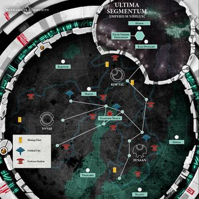

# 1012 奈姆亚尔环礁 Nem'yar Atoll

精校状态：中文行文已逐段精校，部分术语仍为暂定

分类：地理 / 小行星 / 极限星域 Ultima Segmentum

原文来源：https://www.bilibili.com/opus/1141259697777541129

原作者：帝国神选罐头

原文时间：2025年12月01日 11:10

[返回分类目录](目录.md) · [全书目录](../../目录.md)

原篇名：内姆'亚尔环礁 Nem'yar Atoll

<!-- A1012-B0001 -->
**英文原文**

The Nem'yar Atoll is a region of frontier Imperium space that was initially colonised and fortified by the survivors of the T'au Empire's Fourth Sphere of Expansion after their escape from the Warp. It is located in a region of the Ultima Segmentum known as the Chalnath Expanse.

<!-- /A1012-B0001 -->

<!-- A1012-B0002 -->

原译文

内姆'亚尔环礁是帝国空域边界的一个地区，最初是由逃离亚空间后的钛帝国第四界扩张的幸存者殖民和加固的。它位于被称为查尔纳特扩区的极限星域地区。

**校订译文**

奈姆亚尔环礁位于帝国边境空域，最初由钛帝国第四界扩张中逃离亚空间的幸存者殖民并设防。它属于极限星域的查尔纳斯广域。

<!-- /A1012-B0002 -->

<!-- A1012-B0003 图片 -->

<!-- A1012-B0004 -->

原译文

The Nem'yar Atoll 内姆'亚尔环礁

**校订译文**

The Nem'yar Atoll 奈姆亚尔环礁

<!-- /A1012-B0004 -->

<!-- A1012-B0005 -->
## History 历史

<!-- /A1012-B0005 -->

<!-- A1012-B0006 -->
**英文原文**

The Fourth Sphere's emergence into realspace created the vortex known as the Startide Nexus, which is a stable dimensional pathway between the Nem'yar Atoll and the T'au Empire. Once the Empire confirmed the survival of the Fourth Sphere, Commander Shadowsun was given command of the Fifth Sphere of Expansion and led it into the Startide Nexus. Once the Fifth Sphere emerged into the Nem'yar Atoll, Shadowsun integrated the survivors of the Fourth Sphere into her command and began expanding the size of the T'au Empire's new domain. Since its discovery by the T'au, the Nem'yar Atoll has become a cluster of Sept Worlds, stellar fortresses and habitation spheres that surround the Startide Nexus, but is also under almost constant assault from raiders, hostile Xenos and other, darker threats. As such, the military resources allocated to the defense of this key region are considerable.

<!-- /A1012-B0006 -->

<!-- A1012-B0007 -->

原译文

第四界进入现实空间，创造了被称为星潮枢纽的漩涡，这是内姆亚尔环礁和钛帝国之间的一条稳定的维度通道。一旦帝国确认了第四界的存在，影阳指挥官就被赋予了第五界扩张的指挥权，并带领它进入星潮枢纽。当第五界出现在内姆'亚尔环礁时，影阳将第四界的幸存者整合到她的指挥中，并开始扩大钛帝国新领地的规模。自从钛的发现以来，内姆'亚尔环礁已经成为围绕星潮枢纽的家门世界、星堡和居住领域的集群，但也几乎不断受到袭击者、敌对的异型和其他更黑暗威胁的攻击。因此，分配给这一关键地区防御的军事资源相当可观。

**校订译文**

第四界扩张部队返回现实空间时，形成了名为星潮枢纽的漩涡，在奈姆亚尔环礁与钛帝国之间开辟出一条稳定的维度通道。钛帝国确认第四界部队仍有幸存者后，任命指挥官影阳统率第五界扩张，率军穿过星潮枢纽。抵达环礁后，她将第四界幸存者纳入麾下，开始扩张这片新领地。自钛族发现以来，奈姆亚尔环礁逐渐发展成环绕星潮枢纽的家门世界、星堡与球形居住设施群；然而，劫掠者、敌对异形及其他更黑暗的威胁几乎从未停止进攻。因此，钛帝国为守卫这一关键地区投入了相当庞大的军事资源。

**校注：** Empire此处均指钛帝国，不是人类帝国；第四界“仍有幸存者”不等于仅确认其存在。habitation spheres按居住设施形态理解，非抽象领域。

<!-- /A1012-B0007 -->

<!-- A1012-B0008 -->
**英文原文**

The Nem'yar Atoll was later attacked by a sizable Death Guard armada, which were intent on gaining access to the Startide Nexus. Though caught by surprise, Shadowsun quickly rallied her forces against the Chaos invaders and engaged in a desperate battle to prevent the Death Guard from reaching the Nexus and gaining a pathway to the heartlands of the T'au Empire. The Death Guard eventually were able to enter the Nexus in limited numbers before vanishing or withdrawing. Their plan remains unclear.

<!-- /A1012-B0008 -->

<!-- A1012-B0009 -->

原译文

后来，内姆'亚尔环礁遭到了一支庞大的死亡守卫舰队的袭击，该舰队意图进入星潮枢纽。尽管感到意外，影阳还是迅速召集她的部队对抗混沌入侵者，并进行了一场绝望的战斗，以阻止死亡守卫到达枢纽，并获得通往钛帝国中心地带的道路。死亡守卫最终能够以有限的数量进入枢纽，然后消失或撤退。他们的计划尚不清楚。

**校订译文**

后来，一支规模可观的死亡守卫舰队进攻奈姆亚尔环礁，意图进入星潮枢纽。影阳虽然措手不及，仍迅速集结部队抵抗混沌入侵者，拼死阻止其抵达枢纽、获得通往钛帝国腹地的通道。最终，仍有少量死亡守卫进入枢纽，随后或消失，或撤退；他们的真正计划仍不清楚。

**校注：** 原文未说明消失或撤退各自对应哪些舰队成分，保留并列叙述，不补编具体目的或结局。

<!-- /A1012-B0009 -->

本篇核心术语与暂定项

以下列出本篇出现的英文原形及核心术语表用词。同形词可能指不同对象，具体词义以本篇正文和校注为准；单复数、别名和仅见于图注的名称可能尚未列入。完整候选见[术语表](../../术语表/双语术语候选.csv)。

| 英文 | 采用中文 | 状态 |
| --- | --- | --- |
| Death Guard | 死亡守卫 | 官方已核对 |
| T'au Empire | 钛帝国 | 官方已核对 |
| Warp | 亚空间 | 官方已核对 |
| Imperium | 帝国 | 暂定·简称 |
| Fifth Sphere of Expansion | 第五次扩张 | 暂定·官方待核 |
| Nem'yar Atoll | 奈姆亚尔环礁 | 暂定·官方待核 |
| Chalnath Expanse | 查尔纳斯广域 | 暂定·官方待核 |
| Ultima Segmentum | 极限星域 | 暂定·官方待核 |
| Segmentum | 星域 | 暂定·官方待核 |
| Invaders | 侵略者 | 暂定·官方待核 |
| Xenos | 异形 | 暂定·官方待核 |
| T'au | 钛族 | 暂定·官方待核 |
| Sept | 家门 | 暂定·官方待核 |
| Startide Nexus | 星潮枢纽 | 暂定·官方待核 |
| Commander Shadowsun | 指挥官影阳 | 官方已核对 |
| Shadowsun | 影阳 | 官方词根参考·语境定译 |
| Sphere | 防御圈 | 暂定·官方待核 |

