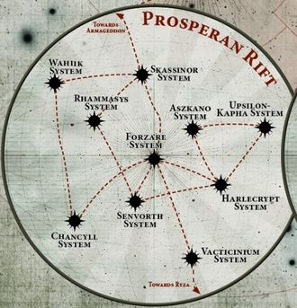

# 1013 普罗斯佩罗裂隙 Prosperan Rift

精校状态：中文行文已逐段精校，部分术语仍为暂定

分类：地理 / 小行星 / 极限星域 Ultima Segmentum

原文来源：https://www.bilibili.com/opus/1140912591381463043

原作者：帝国神选罐头

原文时间：2025年11月30日 12:43

[返回分类目录](目录.md) · [全书目录](../../目录.md)

<!-- A1013-B0001 -->
**英文原文**

The Prosperan Rift is a group of Imperial Systems that lie in the Ultima Segmentum and are close to the borders of Segmentum Solar. In the wake of the Great Rift's creation, the Rift has become rife with war as the Daemon Primarch Magnus has begun claiming its worlds in order to form an empire within Imperial space.

<!-- /A1013-B0001 -->

<!-- A1013-B0002 -->

原译文

普罗斯佩罗裂隙是位于极限星域的一组帝国星系，靠近太阳星域的边界。随着大裂隙的形成，裂隙已经充斥着战争，因为恶魔原体马格努斯已经开始声称拥有自己的世界，以便在帝国空域内建立一个帝国。

**校订译文**

普罗斯佩罗裂隙是一组位于极限星域、靠近太阳星域边界的帝国星系。大裂隙形成后，恶魔原体马格努斯开始夺取当地世界，企图在帝国疆域内建立自己的帝国，使这一地区战乱不断。

<!-- /A1013-B0002 -->

<!-- A1013-B0003 图片 -->

<!-- A1013-B0004 -->

原译文

The Prosperan Rift 普罗斯佩罗裂隙

**校订译文**

The Prosperan Rift 普罗斯佩罗裂隙

<!-- /A1013-B0004 -->

<!-- A1013-B0005 -->
## Known Systems 已知星系

<!-- /A1013-B0005 -->

<!-- A1013-B0006 -->

原译文

Axandria System 阿克桑德里亚星系

**校订译文**

Axandria System 阿克桑德里亚星系

<!-- /A1013-B0006 -->

<!-- A1013-B0007 -->

原译文

Wahiik System 瓦希克星系

**校订译文**

Wahiik System 瓦希克星系

<!-- /A1013-B0007 -->

<!-- A1013-B0008 -->
**英文原文**

Skassinor System - leads towards the Armageddon System

<!-- /A1013-B0008 -->

<!-- A1013-B0009 -->

原译文

斯卡西诺星系 - 通往阿玛吉多顿星系

**校订译文**

斯卡西诺星系 - 通往阿玛吉多顿星系

<!-- /A1013-B0009 -->

<!-- A1013-B0010 -->

原译文

Rhammasys System 拉姆马西斯星系

**校订译文**

Rhammasys System 拉姆马西斯星系

<!-- /A1013-B0010 -->

<!-- A1013-B0011 -->

原译文

Aszkano System 阿斯卡诺星系

**校订译文**

Aszkano System 阿斯卡诺星系

<!-- /A1013-B0011 -->

<!-- A1013-B0012 -->

原译文

Upsilon-Kapha System 尤普西隆-卡帕星系

**校订译文**

Upsilon-Kapha System 尤普西隆-卡帕星系

<!-- /A1013-B0012 -->

<!-- A1013-B0013 -->

原译文

Forzare System 弗扎雷星系

**校订译文**

Forzare System 弗扎雷星系

<!-- /A1013-B0013 -->

<!-- A1013-B0014 -->

原译文

Chancyll System 钱西星系

**校订译文**

Chancyll System 钱西星系

<!-- /A1013-B0014 -->

<!-- A1013-B0015 -->

原译文

Senvorth System 森沃斯星系

**校订译文**

Senvorth System 森沃斯星系

<!-- /A1013-B0015 -->

<!-- A1013-B0016 -->

原译文

Harlecrypt System 哈利克利特星系

**校订译文**

Harlecrypt System 哈利克利特星系

<!-- /A1013-B0016 -->

<!-- A1013-B0017 -->
**英文原文**

Vacticinium System - leads towards the Ryza System

<!-- /A1013-B0017 -->

<!-- A1013-B0018 -->

原译文

瓦克西尼姆星系 - 通往瑞扎星系

**校订译文**

瓦克西尼姆星系 - 通往瑞扎星系

<!-- /A1013-B0018 -->

本篇核心术语与暂定项

以下列出本篇出现的英文原形及核心术语表用词。同形词可能指不同对象，具体词义以本篇正文和校注为准；单复数、别名和仅见于图注的名称可能尚未列入。完整候选见[术语表](../../术语表/双语术语候选.csv)。

| 英文 | 采用中文 | 状态 |
| --- | --- | --- |
| Great Rift | 大裂隙 | 官方已核对 |
| Primarch | 原体 | 官方已核对 |
| Prosperan Rift | 普罗斯佩罗裂隙 | 暂定·官方待核 |
| Segmentum Solar | 太阳星域 | 暂定·官方待核 |
| Ultima Segmentum | 极限星域 | 暂定·官方待核 |
| Segmentum | 星域 | 暂定·官方待核 |
| Armageddon | 阿玛吉多顿 | 暂定·官方待核 |
| Ryza | 瑞扎 | 暂定·官方待核 |
| System | 星系（恒星系统） | 暂定·官方待核 |

