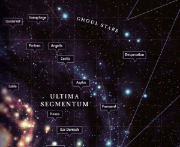

# 1016 食尸鬼群星 Ghoul Stars

精校状态：中文行文已逐段精校，部分术语仍为暂定

分类：地理 / 小行星 / 极限星域 Ultima Segmentum

原文来源：https://www.bilibili.com/opus/1154725167559081986

原作者：帝国神选罐头

原文时间：2026年01月06日 18:03

[返回分类目录](目录.md) · [全书目录](../../目录.md)

<!-- A1016-B0001 -->
**英文原文**

The Ghoul Stars, also known as the Ghost Stars, are a desolate region of space located in the extreme northeast of the galaxy. They consist of worlds lit by the cold rays of dying suns.

<!-- /A1016-B0001 -->

<!-- A1016-B0002 -->

原译文

食尸鬼群星，也被称为幽灵群星，是位于银河系最东北部的一个荒凉的太空区域。它们由垂死太阳的冷光照亮的世界组成。

**校订译文**

食尸鬼群星，又称幽魂群星，是银河最东北端的一片荒凉天区。这里的诸多世界，沐浴在垂死恒星冰冷的光线中。

**校注：** 本篇明确将Ghost Stars列为Ghoul Stars别称，据此校正1010的对应关系；保留两种英文写法。

<!-- /A1016-B0002 -->

<!-- A1016-B0003 图片 -->

<!-- A1016-B0004 -->

原译文

The Ghoul Stars 食尸鬼群星

**校订译文**

The Ghoul Stars 食尸鬼群星

<!-- /A1016-B0004 -->

<!-- A1016-B0005 -->
## Overview 概述

<!-- /A1016-B0005 -->

<!-- A1016-B0006 -->
**英文原文**

It is known as a feared area of void-space located in the northern part of the Ultima Segmentum.

<!-- /A1016-B0006 -->

<!-- A1016-B0007 -->

原译文

它被称为位于极限星域北部的令人恐惧的虚空区域。

**校订译文**

这片令人畏惧的虚空区域位于极限星域北部。

<!-- /A1016-B0007 -->

<!-- A1016-B0008 -->
**英文原文**

Among the Xenos populations within this area were the Cythor Fiends along with other creatures out of primal nightmares such as Togoran Bloodreeks. Among the native inhabitants of the Ghoul Stars are creatures so alien that they seem supernatural. This region of space was once home to a number of Human inhabited worlds. However, an ancient threat is believed to be responsible for the destruction of these planets and accounted for the large number of formerly human inhabited Dead Worlds. The inhabitants of the Ghoul Stars have been described as being supernatural and pose a threat to the galaxy. Among the most horrifying of threats native to this area of space is the Necron Bone Kingdom of Drazak.

<!-- /A1016-B0008 -->

<!-- A1016-B0009 -->

原译文

在这个地区的异型族群中，有赛索尔恶魔和其他来自原始噩梦的生物，如托戈兰血恶。在食尸鬼群星的土著居民中，有一些生物是如此诡异，以至于它们看起来是超自然的。这个太空地区曾经是许多人类居住的世界的家园。然而，一种古老的威胁被认为是这些行星毁灭的原因，并造成了大量以前有人类居住的死亡世界。食尸鬼群星的居民被描述为超自然的，对银河系构成威胁。德拉扎克的死骨王国是这片太空地区最可怕的威胁之一。

**校订译文**

这里的异形包括西索尔凶魔，以及托戈兰血恶等仿佛源于最原始噩梦的生物。有些原生居民怪异得近乎超自然。此地曾有人类定居的多个世界，如今却留下大量曾有居民的死寂世界；人们认为，一种古老威胁造成了它们的毁灭。食尸鬼群星中的居民被形容为超自然存在，对整个银河构成威胁，其中最可怕的势力之一，就是太空死灵的德拉扎克白骨王国。

**校注：** Dead Worlds为死寂世界，区别Death Worlds死亡世界。Cythor Fiends为异形西索尔凶魔，不因Fiend一词判作混沌恶魔。

<!-- /A1016-B0009 -->

<!-- A1016-B0010 -->
**英文原文**

In addition, the small, independent Human empire of the Ashen Claws is located in the Ghoul Stars.

<!-- /A1016-B0010 -->

<!-- A1016-B0011 -->

原译文

此外，灰烬之爪的小型独立人类帝国位于食尸鬼群星。

**校订译文**

此外，灰烬之爪的小型独立人类帝国也位于食尸鬼群星。

<!-- /A1016-B0011 -->

<!-- A1016-B0012 -->
### Imperial presence 帝国的存在

<!-- /A1016-B0012 -->

<!-- A1016-B0013 -->
**英文原文**

The Imperium has only a light presence in the Ghoul Stars since the Horus Heresy, and it is known that no Imperial expedition ever returned from its deeper regions. However, the Death Spectres Chapter maintain a constant vigil over the Ghoul Stars in ensuring that the menace posed by its inhabitants do not threaten the galaxy again. The Deathwatch of Fort Pykman also watch the region, while the Carcharodons would also periodically pass through the region. The Angels Erythrean also patrol this region and usually manage to make trading deals with their fellow exiles the Carcharodons, as well as other nomad predation forces. However, neither force actually invests much effort into protecting the few Imperial colonies which exist in the Ghouls Stars, instead focusing on shielding the wider Imperium.

<!-- /A1016-B0013 -->

<!-- A1016-B0014 -->

原译文

自荷鲁斯叛乱以来，帝国在食尸鬼群星只有微弱的存在，众所周知，帝国探索者从未从其更深的地区返回过。然而，死亡幽灵战团对食尸鬼群星保持着持续的警惕，以确保其居民构成的威胁不会再次威胁到银河系。皮克曼堡垒的死亡守望也会监视该地区，而噬人鲨也会定期经过该地区。厄立特里亚天使也在这个地区巡逻，通常会设法与他们的流放者同伴噬人鲨以及其他流浪掠食部队达成交易。然而，这两支部队实际上都没有投入太多精力来保护存在于食尸鬼群星的少数帝国殖民地，而是专注于保护更广泛的帝国。

**校订译文**

荷鲁斯之乱以后，帝国在食尸鬼群星的势力十分有限；据已知记录，深入其腹地的帝国远征队从未归来。不过，死亡幽灵战团始终监视这一地区，防止当地威胁再度危及银河。皮克曼堡垒的死亡守望也在守望此地，噬人鲨则定期经过。厄立特里亚天使同样在这里巡逻，往往与同为流放者的噬人鲨，以及其他流动劫掠势力达成贸易。然而，后两者很少花精力保护食尸鬼群星中仅存的帝国殖民地，而是把重点放在屏护帝国其余疆域上。

**校注：** neither force按最近提及的厄立特里亚天使与噬人鲨理解；并不泛指之前列出的所有帝国守卫力量。

<!-- /A1016-B0014 -->

<!-- A1016-B0015 -->
## History 历史

<!-- /A1016-B0015 -->

<!-- A1016-B0016 -->
**英文原文**

Some regions of the Ghoul Stars were conquered by the Imperium during the Great Crusade; Nostramo, homeworld of the Night Lords, was located at the border of the Ghoul Stars. In 002.M31, Raven Guard elements were sent on a crusade into the Ghoul Stars, where they became renegades, forming the Ashen Claws. Most of the Imperial presence in the Ghoul Stars was destroyed during the Horus Heresy, with many worlds being depopulated during campaigns such as the Scouring of the Nostramo Sector.

<!-- /A1016-B0016 -->

<!-- A1016-B0017 -->

原译文

大远征期间，帝国征服了食尸鬼群星的一些地区；诺斯特拉莫，午夜领主的家园世界，位于食尸鬼群星的边界。002.M31，暗鸦守卫成员被派往食尸鬼群星进行远征，在那里他们成为叛徒，形成了灰烬之爪。在荷鲁斯叛乱期间，帝国在食尸鬼群星的大部分存在都被摧毁了，许多世界在对诺斯特拉莫星区的清洗等战役中人口减少。

**校订译文**

大远征期间，帝国征服了食尸鬼群星的部分地区；午夜领主家园诺斯特拉莫就位于其边缘。002.M31，部分暗鸦守卫奉命深入此地远征，后来脱离帝国，组成灰烬之爪。荷鲁斯之乱中，帝国在这里的大部分势力被摧毁，诺斯特拉莫星区清洗等战役使许多世界人口尽失。

**校注：** depopulated不只是人口减少；本段说明整个世界失去居民。

<!-- /A1016-B0017 -->

<!-- A1016-B0018 -->
**英文原文**

In circa late M34, a great threat from the Ghoul Stars referred to as the Pale Wastings after the Nova Terra Interregnum is known in the records of the Imperium. What few records remain of this event suggest that this threat was both a "Star-spawned plague" that swept across many worlds and as "Nightmare engines" that slaughtered entire sectors. The Novamarines along with eleven other Chapters were dispatched to combat this menace in what was believed to be an apocalyptic struggle. Among the only survivors were the Novamarines with the others being lost, though the only evidence of this in later years was an ancient stelae located in the Imperial Palace on Terra itself that refers to the bravery of the Chapter.

<!-- /A1016-B0018 -->

<!-- A1016-B0019 -->

原译文

大约在M34晚期，帝国的记录中记载了来自食尸鬼群星的巨大威胁，称为新泰拉空位期后的苍白消耗。这一事件的少数记录表明，这一威胁既是席卷许多世界的“星引瘟疫”，也是屠杀整个星区的“梦魇引擎”。新星战士和其他十一个战团被派往对抗这一威胁，据信这是一场启示录级的斗争。唯一的幸存者是新星战士，其他人都失踪了，尽管在后来的几年里，唯一的证据是位于泰拉皇宫的一块古代石碑，上面提到了该战团的无畏精神。

**校订译文**

帝国档案记载，新泰拉空位期后、约第三十四个千年末，一场称为“苍白消耗”的巨大威胁从食尸鬼群星袭来。仅存记录将其既描述为席卷多界的“星际滋生之瘟疫”，也描述为屠戮整个星区的“梦魇引擎”。新星战士与另外十一个战团奉命出战，投入一场被认为近乎末日浩劫的抗争。新星战士是少数幸存者之一，其余战团失落无踪。后世仅余的证据，是泰拉帝国皇宫内一块颂扬该团勇武的古老石碑。

**校注：** among the only survivors保留少数幸存者之一，原译唯一幸存者过度绝对。Pale Wastings与既有Pale Wasting统一苍白消耗，是否规范官方名仍待核。

<!-- /A1016-B0019 -->

<!-- A1016-B0020 -->
**英文原文**

In 818.M35, the Asuryani record a Ghoul Star Supernova.

<!-- /A1016-B0020 -->

<!-- A1016-B0021 -->

原译文

在818.M35，方舟灵族记录了一颗食尸鬼群星超新星。

**校订译文**

818.M35，方舟灵族记录了食尸鬼群星中的一次超新星事件。

<!-- /A1016-B0021 -->

<!-- A1016-B0022 -->
**英文原文**

In 601.390.M38, the Marines Errant Space Marines entered into the Covenant of Ecale with the legendary Sia'hadn Ecale of the Rogue Trader House of Ecale. Between this point and until 433.M38, the entire weight of the Chapter was added to the Rogue Trader's own army that went on a voyage of war and exploration into the Ghoul Stars that lasted more than forty years. In 977.M41, an Eastern splinter of a Tyranid Hive Fleet passed through this region where it became disorientated and twisted before heading towards the Orask system.

<!-- /A1016-B0022 -->

<!-- A1016-B0023 -->

原译文

601.390.M38，游侠战士星际战士与行商浪人家族埃卡莱的传奇希亚哈敦·埃卡莱签订了埃卡莱契约。从这一时刻到433.M38，该战团的全部都加入到了行商浪人自己的军队中，他们进行了持续四十多年的战争和探索食尸鬼群星的航行。977.M41，一支泰伦虫巢舰队的东部分裂穿过这个地区，在那里它迷失方向并扭曲，然后朝奥拉斯克星系前进。

**校订译文**

601.390.M38，游侠战士战团与行商浪人埃卡莱家族的传奇人物希亚哈敦·埃卡莱缔结《埃卡莱契约》。从此直到433.M38，全团兵力都加入该行商浪人的军队，深入食尸鬼群星，展开持续四十余年的征战与探索。977.M41，一支泰伦虫巢舰队的东部支系穿过此地，迷失方向并发生扭曲，随后驶向奥拉斯克星系。

**校注：** 601.390.M38与433.M38均按原始帝国日期保留；前者包含日期分数，不删601，也不误当第601390年。

<!-- /A1016-B0023 -->

<!-- A1016-B0024 -->
**英文原文**

Upon his appointment as High Marshal, Helbrecht of the Black Templars is known to have led a Crusade in 989.M41 against the Cythor Fiends that resided within the Ghoul Stars. Within the span of eight years, the xeno populations of the outlying systems had been exterminated, whereupon the Crusade pushed to the alien homeworld. However, upon reaching the core systems, the Black Templars discovered them to be empty with no trace of the aliens found. Before the mystery could be fully investigated, the Black Templars were called to aid Armageddon that was being besieged by the Orks.

<!-- /A1016-B0024 -->

<!-- A1016-B0025 -->

原译文

在被任命为至高元帅后，黑色圣堂的赫尔布雷希特于989.M41率领远征，对抗居住在食尸鬼群星内的赛索尔恶魔。在八年的时间里，边远星系的异型族群被消灭，于是远征将他们推向了异型家园世界。然而，在到达核心星系后，黑色圣堂发现它们是空的，没有发现异型的踪迹。在这个谜团得到充分调查之前，黑色圣堂被召唤去援助被兽人围困的阿玛吉多顿。

**校订译文**

赫尔布雷希特获任黑色圣堂至高元帅后，于989.M41率军远征食尸鬼群星中的西索尔凶魔。八年之内，外围星系的异形被尽数消灭，远征军随即挺进其家园。然而，到达核心星系后，黑色圣堂却发现那里空无一物，没有任何异形踪迹。尚未查清谜团，他们便奉召前往阿玛吉多顿，救援遭欧克围攻的帝国守军。

<!-- /A1016-B0025 -->

<!-- A1016-B0026 -->
**英文原文**

The Iron Crusaders Chapter were last reported heading for the Ghoul Stars.

<!-- /A1016-B0026 -->

<!-- A1016-B0027 -->

原译文

据最后一次报告，钢铁十字军前往食尸鬼群星。

**校订译文**

关于钢铁十字军战团的最后报告称，他们正前往食尸鬼群星。

<!-- /A1016-B0027 -->

<!-- A1016-B0028 -->
**英文原文**

In M42 the Black Templars Oparian Crusade disappeared into the Ghoul Stars, though many believe they continue to fight on against the enemies of mankind.

<!-- /A1016-B0028 -->

<!-- A1016-B0029 -->

原译文

在M42，黑色圣堂奥帕里安远征消失在食尸鬼群星中，尽管许多人认为他们继续与人类之敌作战。

**校订译文**

M42，黑色圣堂的奥帕里安远征军进入食尸鬼群星后失踪，不过仍有许多人相信，他们还在与人类之敌奋战。

<!-- /A1016-B0029 -->

<!-- A1016-B0030 -->
## Known regions 已知地区

<!-- /A1016-B0030 -->

<!-- A1016-B0031 -->

原译文

Iquathan Deeps 伊卡坦深渊

**校订译文**

Iquathan Deeps 伊卡坦深渊

<!-- /A1016-B0031 -->

<!-- A1016-B0032 -->

原译文

Sarvakal Cluster 萨瓦卡尔星群

**校订译文**

Sarvakal Cluster 萨瓦卡尔星群

<!-- /A1016-B0032 -->

<!-- A1016-B0033 -->
**英文原文**

Nostramo Sector (border zone)

<!-- /A1016-B0033 -->

<!-- A1016-B0034 -->

原译文

诺斯特拉莫星区（边境区）

**校订译文**

诺斯特拉莫星区（边境区）

<!-- /A1016-B0034 -->

<!-- A1016-B0035 -->
**英文原文**

Thramas Sector (border zone)

<!-- /A1016-B0035 -->

<!-- A1016-B0036 -->

原译文

萨拉玛斯星区（边境区）

**校订译文**

萨拉玛斯星区（边境区）

<!-- /A1016-B0036 -->

<!-- A1016-B0037 -->
**英文原文**

Thirsis Subsector (border zone)

<!-- /A1016-B0037 -->

<!-- A1016-B0038 -->

原译文

瑟西斯分区（边境区）

**校订译文**

瑟西斯次星区（边境区）

<!-- /A1016-B0038 -->

<!-- A1016-B0039 -->
### Known individual planets 已知单独行星

<!-- /A1016-B0039 -->

<!-- A1016-B0040 -->

原译文

9836-18 Grave Core 9836-18墓穴核心

**校订译文**

9836-18 Grave Core 9836-18墓穴核心

<!-- /A1016-B0040 -->

<!-- A1016-B0041 -->

原译文

Atargatis Prime 阿塔加提斯一号

**校订译文**

Atargatis Prime 阿塔加提斯一号

<!-- /A1016-B0041 -->

<!-- A1016-B0042 -->

原译文

Drazak 德拉扎克

**校订译文**

Drazak 德拉扎克

<!-- /A1016-B0042 -->

<!-- A1016-B0043 -->

原译文

Orask 奥拉斯克

**校订译文**

Orask 奥拉斯克

<!-- /A1016-B0043 -->

<!-- A1016-B0044 -->

原译文

Sarvakal 22-b 萨瓦卡尔22-b

**校订译文**

Sarvakal 22-b 萨瓦卡尔22-b

<!-- /A1016-B0044 -->

<!-- A1016-B0045 -->

原译文

Sandran 桑德兰

**校订译文**

Sandran 桑德兰

<!-- /A1016-B0045 -->

本篇核心术语与暂定项

以下列出本篇出现的英文原形及核心术语表用词。同形词可能指不同对象，具体词义以本篇正文和校注为准；单复数、别名和仅见于图注的名称可能尚未列入。完整候选见[术语表](../../术语表/双语术语候选.csv)。

| 英文 | 采用中文 | 状态 |
| --- | --- | --- |
| Space Marines | 星际战士 | 官方已核对 |
| Black Templars | 黑色圣堂 | 官方已核对 |
| Deathwatch | 死亡守望 | 官方已核对 |
| Orks | 欧克蛮人 | 官方已核对 |
| Horus Heresy | 荷鲁斯之乱 | 官方已核对 |
| Imperium | 帝国 | 暂定·简称 |
| Rogue Trader | 行商浪人 | 暂定 |
| Night Lords | 午夜领主 | 暂定·官方待核 |
| Asuryani | 阿苏焉尼 | 暂定·官方待核 |
| Great Crusade | 大远征 | 暂定·官方待核 |
| Terra | 泰拉 | 暂定·官方待核 |
| Horus | 荷鲁斯 | 暂定·官方待核 |
| Nova Terra Interregnum | 新泰拉空位期 | 暂定·官方待核 |
| Ultima Segmentum | 极限星域 | 暂定·官方待核 |
| Segmentum | 星域 | 暂定·官方待核 |
| Sector | 星区 | 暂定·官方待核 |
| Subsector | 次星区 | 暂定·官方待核 |
| Ghoul Stars | 食尸鬼群星 | 暂定·官方待核 |
| Deeper | 深人 | 暂定·官方待核 |
| Armageddon | 阿玛吉多顿 | 暂定·官方待核 |
| Nova Terra | 新泰拉 | 暂定·官方待核 |
| Nostramo | 诺斯特拉莫 | 暂定·官方待核 |
| Ancient | 旗手 | 官方已核对 |
| Vigil | 警戒团（静默修女编制）／警戒堡（红蝎空间站）／守夜星（行星） | 语境定译·官方待核 |
| Raven Guard | 暗鸦守卫 | 官方已核 |
| Ashen Claws | 灰烬之爪 | 暂定·官方待核 |
| Chapter | 战团 | 暂定·官方待核 |
| Helbrecht | 赫尔布雷彻 | 暂定·官方待核 |
| Novamarines | 新星战士 | 暂定·官方待核 |
| Angels Erythrean | 厄立特里亚天使 | 暂定·官方待核 |
| Death Spectres | 死亡幽灵 | 暂定·官方待核 |
| Marines Errant | 游侠战士 | 暂定·官方待核 |
| The Black Templars | 黑色圣堂 | 暂定·官方待核 |
| Carcharodons | 噬人鲨 | 暂定·官方待核 |
| Crusaders | 十字军 | 暂定·官方待核 |
| Iron Crusaders | 钢铁十字军 | 暂定·官方待核 |
| Xenos | 异形 | 暂定·官方待核 |
| Fiends | 欢愉魔 | 官方已核对 |
| Marshal | 元帅 | 官方已核对 |
| Cythor Fiends | 西索尔凶魔 | 暂定·官方待核 |
| System | 星系（恒星系统） | 暂定·官方待核 |
| Ashen | 灰白星 | 暂定·官方待核 |
| Ghost Stars | 幽魂群星 | 暂定·官方待核 |
| Togoran Bloodreeks | 托戈兰血恶 | 暂定·官方待核 |
| Bone Kingdom of Drazak | 德拉扎克白骨王国 | 暂定·官方待核 |
| Pale Wastings | 苍白消耗 | 暂定·官方待核 |
| Covenant of Ecale | 埃卡莱契约 | 暂定·官方待核 |
| Thirsis Subsector | 瑟西斯次星区 | 暂定·官方待核 |
| Thramas Sector | 萨拉玛斯星区 | 暂定·官方待核 |

