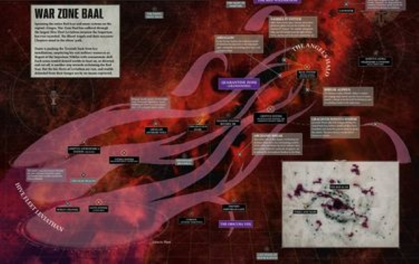

# 1017 红疤地区 Red Scar

精校状态：中文行文已逐段精校，部分术语仍为暂定

分类：地理 / 小行星 / 极限星域 Ultima Segmentum

原文来源：https://www.bilibili.com/opus/1135052855849254937

原作者：帝国神选罐头

原文时间：2025年11月14日 17:44

[返回分类目录](目录.md) · [全书目录](../../目录.md)

原篇名：红疤 Red Scar

<!-- A1017-B0001 -->
**英文原文**

The Red Scar is a sector or subsector of Ultima Segmentum, whose thousands of stars all shine a shade of crimson, tinting its worlds and gas clouds with the color of spilt blood.

<!-- /A1017-B0001 -->

<!-- A1017-B0002 -->

原译文

红疤是极限星域的一个星区或分区，其数千颗恒星都闪耀着深红色的光芒，用洒出的鲜血般的颜色为其世界和气体云着色。

**校订译文**

红疤地区位于极限星域，属于星区或次星区规模。这里数千颗恒星都发出深红光芒，将各世界与星际气云染成鲜血般的颜色。

<!-- /A1017-B0002 -->

<!-- A1017-B0003 图片 -->

<!-- A1017-B0004 -->

原译文

The Red Scar 红疤

**校订译文**

The Red Scar 红疤地区

<!-- /A1017-B0004 -->

<!-- A1017-B0005 -->
## Overview 概述

<!-- /A1017-B0005 -->

<!-- A1017-B0006 -->
**英文原文**

Each of its Systems are cursed with ferocious radiation emitted by these scarlet suns, and life there is exceptionally hard. The Red Scar is rich with valuable resources, though, so the Imperium has established settlements in hundreds of its Systems, despite the cost being billions of lives to do so.

<!-- /A1017-B0006 -->

<!-- A1017-B0007 -->

原译文

它的每个星系都受到这些猩红色太阳发出的凶猛辐射的诅咒，那里的生活异常艰难。然而，红疤拥有丰富的重要资源，因此帝国在其数百个星系中建立了定居点，尽管这样做需要数十亿人的生命。

**校订译文**

各星系都承受着猩红恒星释放的强烈辐射，生存极其艰难。然而，此地珍贵资源丰富，帝国仍以数十亿人的生命为代价，在数百个星系建立了聚落。

<!-- /A1017-B0007 -->

<!-- A1017-B0008 -->
## History 历史

<!-- /A1017-B0008 -->

<!-- A1017-B0009 -->
**英文原文**

In the aftermath of the Great Rift's creation, the Tau Empire attempted to annex parts of the Red Scar from the Nem'yar Atoll, but were stopped by the Space Marines of the Blood Angels Chapter, whose home-System resides in the region. Now, though, the Red Scar has been invaded by multiple tendrils of Hive Fleet Leviathan and the Blood Angels have launched another campaign to save it.

<!-- /A1017-B0009 -->

<!-- A1017-B0010 -->

原译文

大裂隙形成后，钛帝国试图吞并内姆'亚尔环礁的部分红疤，但被圣血天使战团的星际战士阻止，该战团的家园星系位于该地区。不过，现在红疤已经被虫巢舰队利维坦的多条卷须入侵，圣血天使们又发起了另一场战役来拯救它。

**校订译文**

大裂隙形成后，钛帝国从奈姆亚尔环礁出发，企图吞并红疤地区的部分领土，却遭圣血天使阻止；该战团的家园星系就位于此地。后来，利维坦虫巢舰队的多条触须又侵入红疤地区，圣血天使因而再次发动战役，试图挽救这里。

**校注：** from Nem’yar Atoll表示钛族以环礁为进攻出发地，非红疤地区属于环礁。region的星区／次星区级别在英文中未明确，保留两可。

<!-- /A1017-B0010 -->

本篇核心术语与暂定项

以下列出本篇出现的英文原形及核心术语表用词。同形词可能指不同对象，具体词义以本篇正文和校注为准；单复数、别名和仅见于图注的名称可能尚未列入。完整候选见[术语表](../../术语表/双语术语候选.csv)。

| 英文 | 采用中文 | 状态 |
| --- | --- | --- |
| Space Marines | 星际战士 | 官方已核对 |
| Blood Angels | 圣血天使 | 官方已核对 |
| Great Rift | 大裂隙 | 官方已核对 |
| Imperium | 帝国 | 暂定·简称 |
| Red Scar | 红疤地区 | 暂定·官方待核 |
| Nem'yar Atoll | 奈姆亚尔环礁 | 暂定·官方待核 |
| Hive Fleet Leviathan | 利维坦虫巢舰队 | 暂定·官方待核 |
| Ultima Segmentum | 极限星域 | 暂定·官方待核 |
| Segmentum | 星域 | 暂定·官方待核 |
| Sector | 星区 | 暂定·官方待核 |
| Subsector | 次星区 | 暂定·官方待核 |
| Chapter | 战团 | 暂定·官方待核 |
| The Blood | 鲜血 | 暂定·官方待核 |
| System | 星系（恒星系统） | 暂定·官方待核 |
| Tau Empire | 钛帝国 | 暂定·官方待核 |

